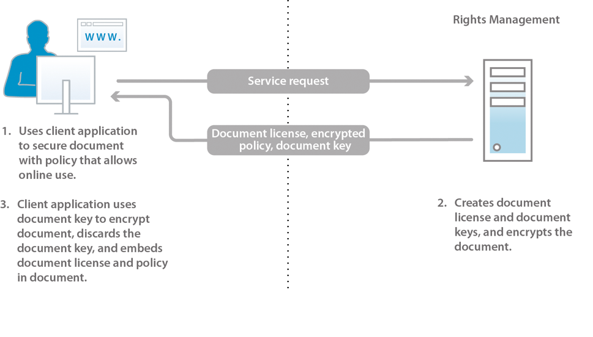

# Informazioni sulla protezione dei documenti {#about-document-security}

La protezione dei documenti garantisce che solo gli utenti autorizzati possano utilizzare i documenti. Grazie alla protezione dei documenti è possibile distribuire in modo sicuro le informazioni salvate in un formato supportato. I formati di file supportati includono:

* File PDF Adobe
* File Microsoft® Word, Excel e PowerPoint

Per ulteriori informazioni su come i criteri proteggono i tipi di file supportati, consulta [ulteriori informazioni sulla protezione dei documenti](https://experienceleague.adobe.com/docs/experience-manager-65/forms/use-document-security/document-security-offerings.html?lang=it).

La protezione dei documenti consente di creare, archiviare e applicare facilmente impostazioni di riservatezza predefinite ai documenti. Per evitare che le informazioni si diffondano oltre la portata dell’utente, è inoltre possibile monitorare e controllare il modo in cui i destinatari utilizzano i documenti dopo averli distribuiti.

È possibile proteggere i documenti utilizzando i criteri. Un *criterio* è una raccolta di informazioni che comprende impostazioni di riservatezza e un elenco di utenti autorizzati. Le impostazioni di riservatezza specificate in un criterio determinano il modo in cui un destinatario può utilizzare un documento al quale esso è applicato. È ad esempio possibile specificare se i destinatari possono stampare o copiare testo, modificarlo o aggiungere firme e commenti ai documenti protetti.

Gli utenti che utilizzano la protezione documenti possono creare criteri tramite le pagine web degli utenti finali. Gli amministratori utilizzano le pagine web di protezione documenti per creare set di criteri contenenti criteri condivisi, disponibili per tutti gli utenti autorizzati.

Sebbene i criteri siano memorizzati nel sistema di protezione dei documenti, vengono applicati ai documenti tramite client. Le modalità di applicazione dei criteri ai documenti PDF sono descritte in dettaglio nella *Guida di Acrobat*. L’applicazione dei criteri mediante altre applicazioni, ad esempio Microsoft® Office, è documentata nella *Guida delle estensioni di Acrobat Reader DC* per quell’applicazione.

Le informazioni contenute in un documento a cui è stato applicato un criterio, sono protette dalle relative impostazioni di riservatezza definite nel criterio stesso. Tali impostazioni proteggono inoltre tutti i file (testo, audio o video) all’interno di un documento PDF. Puoi distribuire il documento protetto da criterio ai destinatari autorizzati dal criterio stesso.

**Controllo degli accessi ai documenti e auditing**

Utilizzare un criterio per proteggere un documento, consente di mantenere il controllo su di esso anche dopo la distribuzione. È possibile monitorare il documento, impedire agli utenti di continuare ad accedervi, modificare il criterio o cambiare quello applicato.

Tramite la protezione dei documenti è possibile monitorare quelli protetti tramite criterio e tenere traccia degli eventi, ad esempio quando un utente autorizzato o uno non autorizzato tentano di aprire il documento.

**Componenti**

Il sistema di protezione dei documenti è costituito da un server e da un’interfaccia utente:

**Server:** il componente centrale tramite il quale la protezione dei documenti esegue transazioni quali l’autenticazione degli utenti, la gestione in tempo reale dei criteri e l’applicazione della riservatezza. Il server fornisce inoltre un archivio centrale per le regole, i record di controllo e altre informazioni correlate.

**Pagine web:** l’interfaccia dove creare i criteri, gestire documenti protetti da criteri e monitorare gli eventi associati a tali documenti. Gli amministratori possono anche configurare opzioni globali quali l’autenticazione degli utenti, l’auditing e la messaggistica per gli utenti invitati oltre alla gestione dei rispettivi account.

I passaggi nell’illustrazione sono i seguenti:

1. Il proprietario del documento crea i criteri utilizzando le pagine web. I proprietari dei documenti possono creare criteri personali accessibili solo a loro. Gli amministratori e i coordinatori di set di criteri possono creare criteri condivisi all’interno di set accessibili agli utenti autorizzati.
1. Il proprietario del documento applica il criterio, quindi salva e distribuisce il documento. Il documento può essere distribuito via e-mail, tramite una cartella di rete o su un sito web.
1. Il destinatario apre il documento nell’applicazione client appropriata. Il destinatario può utilizzare il documento in base ai propri criteri.
1. Il proprietario del documento, il coordinatore di set di criteri o l’amministratore possono tenere traccia dei documenti e modificarne l’accesso utilizzando le pagine web.

## Informazioni sugli utenti del sistema di protezione dei documenti. {#about-document-security-users}

Diversi tipi di utenti utilizzano la protezione dei documenti per eseguire attività diverse:

* L’amministratore di sistema o la persona che si occupa di altri sistemi informativi (IS) installa e configura la protezione dei documenti. Questa persona può anche essere responsabile della configurazione delle impostazioni globali per il server, le pagine web, i criteri e i documenti.

  Queste impostazioni possono includere, ad esempio, un URL di sicurezza del documento di base, notifiche di auditing, di privacy e di registrazione per gli utenti invitati, nonché periodi di leasing offline predefiniti.

* Gli amministratori della protezione dei documenti creano criteri e relativi set e gestiscono i documenti protetti tramite criteri per gli utenti come richiesto. Inoltre, creano gli account utente invitati e monitorano il sistema, i documenti, gli utenti, i criteri, i relativi set e gli eventi personalizzati. Possono anche essere responsabili della configurazione del server globale e delle impostazioni delle pagine web e dei criteri con un amministratore di sistema.

  Gli amministratori possono assegnare agli utenti i seguenti ruoli nell’area Gestione utenti della console di amministrazione. Gli utenti a cui sono assegnati questi ruoli eseguono le proprie attività nell’area dell’interfaccia utente della protezione dei documenti della console di amministrazione.

  **Super amministratore per la protezione dei documenti**

  Gli utenti con questo ruolo possono accedere a tutte le impostazioni di protezione dei documenti nella console di amministrazione. Queste autorizzazioni sono associate al ruolo:

   * Gestione della configurazione
   * Gestione dei criteri
   * Gestione dei set di criteri
   * Gestione dei documenti
   * Gestione degli editori di documenti
   * Gestione degli utenti invitati e locali
   * Visualizzazione degli eventi
   * Delega
   * Invito per utenti esterni

  **Amministratore della protezione dei documenti**

  Gli utenti con questo ruolo possono configurare il server della protezione dei documenti utilizzando la pagina Configurazione nella sezione della protezione dei documenti della console di amministrazione. Questa autorizzazione è associata al ruolo di gestione della configurazione.

  >[!NOTE]
  >
  >Gli utenti con questo ruolo devono inoltre disporre del ruolo Utente della console di amministrazione per poter accedere alla console di amministrazione e modificare le impostazioni relative alla configurazione.

  **Amministratore del set di criteri della protezione dei documenti**

  Gli utenti con questo ruolo possono utilizzare la sezione della protezione dei documenti della console di amministrazione per modificare i criteri di altri utenti, nonché creare, modificare ed eliminare set di criteri. Quando un amministratore dei set di criteri ne crea uno, può assegnargli un coordinatore. Queste autorizzazioni sono associate al ruolo:

   * Gestione dei criteri
   * Gestione dei set di criteri
   * Gestione dei documenti
   * Gestione degli editori di documenti
   * Visualizzazione degli eventi
   * Delega

  >[!NOTE]
  >
  >Gli utenti con questo ruolo devono inoltre disporre del ruolo Utente della console di amministrazione per poter accedere alla console di amministrazione e modificare le impostazioni relative alla configurazione.

  **La protezione dei documenti consente di gestire gli utenti invitati e locali**

  Gli utenti con questo ruolo possono eseguire le attività necessarie per gestire tutti gli utenti invitati e locali sulle pagine web della protezione dei documenti pertinenti. Queste autorizzazioni sono associate al ruolo:

   * Gestione degli utenti invitati e locali
   * Invito per utenti esterni
   * Accesso alle pagine web degli utenti finali

  >[!NOTE]
  >
  >Gli utenti con questo ruolo devono inoltre disporre del ruolo Utente della console di amministrazione per poter accedere alla console di amministrazione e modificare le impostazioni relative alla configurazione.

  **La protezione dei documenti consente di invitare gli utenti**

  Gli utenti con questo ruolo possono invitare gli utenti. Queste autorizzazioni sono associate al ruolo:

   * Invito per utenti esterni
   * Accesso alle pagine web degli utenti finali

  **Protezione dei documenti e utenti finali**

  Gli utenti con questo ruolo possono accedere alle pagine web degli utenti finali relative alla protezione dei documenti. Questo ruolo può anche essere assegnato agli amministratori per consentire loro di creare criteri utilizzando le pagine degli utenti finali. Questa autorizzazione è associata al ruolo Accesso alle pagine Web degli utenti finali.

* Gli utenti all’interno dell’organizzazione che dispongono di account di protezione dei documenti validi creano i propri criteri e li utilizzano per proteggere i documenti, per tenere traccia e per gestire i documenti protetti e monitorare gli eventi correlati ai propri documenti.
* I coordinatori di set di criteri gestiscono documenti, visualizzano gli eventi e gestiscono altri coordinatori di set di criteri (in base alle rispettive autorizzazioni). Gli amministratori designano gli utenti come coordinatori di set di criteri per set di criteri specifici.
* Gli utenti esterni all’organizzazione (ad esempio, un partner commerciale) possono utilizzare documenti protetti da criteri se si trovano nella directory della protezione dei documenti, se l’amministratore crea un account per loro o se si registrano con protezione dei documenti tramite un processo automatizzato di invito via e-mail. A seconda del modo in cui l’amministratore abilita le impostazioni di accesso, gli utenti invitati possono anche disporre dell’autorizzazione per applicare criteri ai documenti, per creare, modificare ed eliminare i propri criteri e invitare altri utenti esterni ad utilizzare i propri documenti protetti da criteri.
* Gli sviluppatori utilizzano AEM Forms SDK per integrare applicazioni personalizzate tramite la protezione dei documenti.

Gli amministratori della protezione dei documenti possono creare ruoli personalizzati nella Gestione utenti utilizzando le seguenti autorizzazioni:

* Configurazione della gestione della protezione dei documenti
* Gestione della protezione dei documenti per utenti invitati e locali
* Gestione della protezione dei documenti per set di criteri
* Gestione della protezione dei documenti per set di criteri
* Visualizzare eventi del server della protezione dei documenti
* Modificare il proprietario del criterio della protezione dei documenti

## Criteri e documenti protetti da criteri {#policies-and-policy-protected-documents}

Un *criterio* definisce un set di impostazioni di riservatezza e gli utenti che possono accedere a un documento a cui il criterio viene applicato. Un criterio consente inoltre di modificare dinamicamente le autorizzazioni in un documento. Consente alla persona che protegge il documento di modificare le impostazioni di riservatezza per revocare l’accesso al documento o per cambiare il criterio.

È possibile applicare la protezione del criterio a un documento PDF utilizzando Adobe Acrobat® Pro e Acrobat Standard. È possibile applicare la protezione del criterio ad altri tipi di file, ad esempio file Microsoft® Word, Excel e PowerPoint, utilizzando l’applicazione client con le estensioni appropriate di Acrobat Reader DC installate.

### Funzionamento dei criteri {#how-policies-work}

I criteri contengono le informazioni sugli utenti autorizzati e le impostazioni di riservatezza da applicare ai documenti. Gli utenti possono essere sia membri dell’organizzazione, sia persone esterne che dispongono di un account. Se l’amministratore abilita la funzione di invito degli utenti, è anche possibile aggiungere nuovi utenti ai criteri, avviando quindi un processo via e-mail di invito alla registrazione.

Le impostazioni di riservatezza in un criterio determinano il modo in cui i destinatari possono utilizzare il documento. Ad esempio, è possibile specificare se i destinatari possono stampare o copiare il testo, apportare modifiche o aggiungere firme e commenti ai documenti protetti. Lo stesso criterio può anche definire impostazioni di riservatezza diverse per utenti specifici.

>[!NOTE]
>
>Le impostazioni di riservatezza applicate tramite un criterio sostituiscono eventuali impostazioni applicate a un documento di PDF in Acrobat utilizzando le opzioni di sicurezza relative alla password o al certificato. (Per ulteriori informazioni, consulta la guida di Acrobat.)

Gli utenti e gli amministratori creano criteri tramite le pagine web di protezione dei documenti. A un documento è possibile applicare un solo criterio alla volta. Puoi applicare un criterio utilizzando uno dei seguenti metodi:

* Apri il documento in Acrobat o in un’altra applicazione client e seleziona un criterio per proteggere il documento.
* Invia un documento come allegato e-mail in Microsoft® Outlook. In questo caso, puoi selezionare un criterio da un elenco di criteri. In alternativa, puoi selezionare un criterio generato automaticamente che Acrobat crea con un set predefinito di impostazioni di riservatezza per proteggere il documento solo per i destinatari del messaggio e-mail.

È possibile rimuovere un criterio da un documento utilizzando l’applicazione client.

I passaggi nel diagramma sono i seguenti:

1. Il proprietario del documento protegge il documento da un’applicazione client supportata con un criterio che consente l’utilizzo online.
1. La protezione dei documenti crea una licenza dei documenti e le relative chiavi, quindi crittografa il criterio. La licenza del documento, il criterio crittografato e la chiave del documento vengono restituiti all’applicazione client.
1. Il documento viene crittografato con la chiave del documento, che viene successivamente eliminata. Il documento ora incorpora la licenza e il criterio. Queste attività vengono eseguite nell’applicazione client supportata.

Quando applichi un criterio a un documento, le informazioni in esso contenute, inclusi eventuali file contenuti (testo, audio o video) nei documenti di PDF, sono protette dalle impostazioni di riservatezza specificate nel criterio. La protezione dei documenti genera una licenza e informazioni di crittografia che vengono poi incorporate nel documento. Quando distribuisci il documento, la protezione dei documenti può autenticare i destinatari che tentano di aprirlo e ne autorizzano l’accesso in base ai privilegi specificati nel criterio.

Se l’utilizzo offline è consentito, i destinatari possono utilizzare i file protetti da criteri anche in modalità offline (senza una connessione Internet o di rete attiva) per il periodo di tempo specificato nel criterio.

### Funzionamento dei documenti protetti da criteri {#how-policy-protected-documents-work}

Per aprire e utilizzare documenti protetti da criteri, è necessario includere il proprio nome come destinatario e disporre di un account di protezione dei documenti valido. Per i documenti PDF, è necessario Acrobat o Adobe Reader®. Per gli altri tipi di file, devi disporre dell’applicazione appropriata per il file con le estensioni Acrobat Reader DC installate.

Quando apri un documento protetto da criteri, Acrobat, Adobe Reader o le estensioni Acrobat Reader DC si connettono alla protezione dei documenti per autenticarti. Quindi, ora puoi effettuare l’accesso. Se l&#39;utilizzo del documento è sottoposto a controllo, viene visualizzato un messaggio di notifica. Una volta che la protezione dei documenti determina le autorizzazioni da concedere, gestisce la decrittografia del documento. Puoi anche utilizzare il documento in base alle impostazioni di riservatezza del criterio.

I passaggi nel diagramma sono i seguenti:

1. L’utente apre il documento in un’applicazione client supportata e si autentica con il server. L’identificatore del documento viene inviato al server della protezione dei documenti.
1. Document security autentica gli utenti, controlla il criterio per l’autorizzazione e crea un voucher. Il voucher (che contiene la chiave del documento e le autorizzazioni) viene restituito all’applicazione client.
1. Il documento viene decrittografato con la chiave del documento e la stessa viene eliminata. Il documento può quindi essere utilizzato in base alle impostazioni di riservatezza del criterio. Queste attività vengono eseguite nell’applicazione client supportata.

Puoi continuare a utilizzare un documento nelle seguenti condizioni:

* A tempo indeterminato o per il periodo di validità specificato nel criterio.
* Fino a quando un amministratore o la persona che ha applicato il criterio non revoca l’accesso al file o modifica il criterio.

Puoi inoltre utilizzare documenti protetti tramite crtierio in modalità non in linea (senza una connessione Internet o di rete) se il criterio consente l’accesso non in linea. Accedi innanzitutto a Document Security per sincronizzare il documento. Puoi quindi utilizzare il documento durante il periodo di lease offline specificato nel criterio.

Al termine del periodo di lease offline, sincronizza nuovamente il documento con la protezione dei documenti, accedendo online e aprendo un documento protetto tramite criterio o utilizzando un comando nell’applicazione client. Per ulteriori informazioni, consulta la *Guida di Acrobat* o la *Guida delle estensioni di Acrobat Reader DC* appropriata.

Se salvi una copia di un documento protetto tramite criterio utilizzando il comando di menu Salva o Salva con nome, il criterio viene automaticamente applicato al nuovo documento. Come per il documento originale, vengono controllati e registrati anche gli eventi correlati, ad esempio i tentativi di aprirne uno nuovo.

## Set di criteri {#policy-sets}

*I set di criteri* vengono utilizzati per raggruppare un set di criteri con uno scopo aziendale comune. Questi set di criteri vengono quindi resi disponibili a un sottoinsieme di utenti nel sistema.

A ogni set di criteri possono essere associati uno o più coordinatori di set di criteri. Il coordinatore del set di criteri è un amministratore o un utente che dispone di più autorizzazioni. Il *coordinatore di set di criteri* è in genere uno specialista dell’organizzazione che può creare i criteri in un determinato set di criteri.

I coordinatori dei set di criteri possono eseguire le seguenti attività:

* Creare i criteri
* Modificare ed eliminare qualsiasi criterio nel set di criteri
* Modificare impostazioni del set di criteri
* Aggiungere e rimuovere i coordinatori di set di criteri
* Visualizzare eventi relativi a criteri e documenti per qualsiasi criterio o documento all’interno del set di criteri
* Revocare l’accesso ai documenti
* Cambiare i criteri per il documento.

>[!NOTE]
>
>Puoi recuperare un massimo di 1000 nomi di set di criteri dal database utilizzando l’API `getAllPolicysetnames()`.

I set di criteri vengono creati ed eliminati nelle pagine web dell’amministrazione di protezione dei documenti dagli amministratori e dai coordinatori dei set di criteri che dispongono delle autorizzazioni necessarie.

I set di criteri vengono resi disponibili a un numero limitato di utenti specificando quali utenti o gruppi all’interno di un dominio possono utilizzare i criteri del set di criteri per proteggere i documenti.

Quando si installa Document Security, viene creato un set di criteri predefinito denominato *Set di criteri globale*. L’amministratore che ha installato il software gestisce questo set di criteri.

## Best practice {#best-practices}

I criteri sono set riutilizzabili di autorizzazioni e gruppi di utenti che possono essere applicati a vari documenti. Per i documenti protetti. Questi criteri garantiscono che solo gli utenti autorizzati possano utilizzare le funzioni consentite. Il numero di criteri e set di criteri dovrebbero aumentare con l’aumento dei diversi ruoli utente e documenti all’interno di un reparto. Di seguito sono riportare alcune considerazioni e best practice per creare e gestire i criteri:

* **Creazione di criteri riutilizzabili:** Adobe consiglia di riutilizzare i criteri in vari documenti. In questo modo, è possibile ridurre al minimo il numero di criteri, fornire prestazioni ottimali e semplificare la gestione. Per creare un criterio riutilizzabile:

1. Identifica e definisci i requisiti di controllo degli accessi a livello di reparto e organizzazione.

1. Crea gruppi di utenti e aggiungi utenti a tali gruppi.

1. Crea un set di criteri.

1. Apri il set di criteri e crea un criterio. Aggiungi gruppi di utenti e configura le impostazioni di riservatezza (controllo degli accessi) per il criterio.

Aggiungi gruppi di utenti ai criteri anziché singoli utenti. Semplifica la gestione e l’applicazione dei criteri a molti utenti.

* **Creazione di set di criteri personalizzati:** un set di criteri combina più criteri in un’entità gestibile. Crea set di criteri personalizzati per l’organizzazione o il reparto, utilizzali per raggruppare i criteri correlati e rendili disponibili per un sottoinsieme di utenti nel sistema.

  L’utilizzo dei set di criteri semplifica l’assegnazione e la gestione dei criteri correlati a utenti specifici di un’organizzazione o di un reparto. Ad esempio, set di criteri separati per il reparto finanze e risorse umane possono facilitare la gestione e l’applicazione dei criteri correlati ai documenti designati per i reparti corrispondenti.

* **Utilizzo di un handler per l’autorizzazione esterna per l’applicazione dinamica delle autorizzazioni:** puoi utilizzare l’[handler per l’autorizzazione esterna](https://help.adobe.com/en_US/livecycle/11.0/ProgramLC/WS624e3cba99b79e12e69a9941333732bac8-6f26.2.html) per valutare e applicare in modo dinamico le autorizzazioni in base alla condizione esterna. Quando le autorizzazioni vengono valutate in modo dinamico, in base alla condizione esterna, puoi:

   * Assicurare un controllo degli accessi centralizzato ai documenti dell’organizzazione.

   * Controlla l’accesso ai documenti protetti tramite criteri determinando in modo dinamico se un utente può accedere a un documento protetto tramite criteri. Ad esempio, puoi decidere in modo dinamico se un utente può stampare un documento protetto tramite criteri.

   * Sfrutta un meccanismo di controllo degli accessi utilizzato dal sistema di gestione dei contenuti, oltre al processo standard di valutazione dei criteri. Ad esempio, quando il servizio determina se un utente può stampare un documento protetto tramite criteri, può utilizzare il processo standard di valutazione dei criteri. Può inoltre sfruttare il meccanismo di controllo degli accessi utilizzato dal sistema di gestione dei contenuti.

  Sebbene sia possibile sostituire completamente il processo di valutazione dei criteri della protezione dei documenti con un handler per l’autorizzazione esterna, si consiglia di utilizzare quest’ultimo con il processo di valutazione dei criteri. Di conseguenza, l’accesso ai documenti può essere controllato mediante lo stesso meccanismo di controllo utilizzato dal sistema di gestione dei contenuti. Ad esempio, quando il servizio di protezione dei documenti determina se un utente può stampare un documento protetto tramite criteri, utilizza il processo standard di valutazione dei criteri. Utilizza anche il meccanismo di controllo degli accessi utilizzato dal sistema di gestione dei contenuti. Per ulteriori informazioni, consulta [Creazione di handler per l’autorizzazione esterna](https://help.adobe.com/en_US/livecycle/11.0/ProgramLC/WS624e3cba99b79e12e69a9941333732bac8-6f26.2.html).

* **Mantenimento di un numero limitato di set di criteri:** diversi fattori determinano la crescita costante di criteri e dei relativi set. Di seguito sono riportati alcuni fattori comuni:

   * Aumento di ruoli utente, reparti e documenti all’interno di un’organizzazione in un periodo.
   * I dipartimenti di un’organizzazione lavorano in modo isolato e mantengono un rigido controllo sui criteri specifici del dipartimento. Questa condizione assicura criteri identici all’interno di un’organizzazione.

  Adobe consiglia di mantenere al minimo il numero di criteri e di relativi set. In questo modo, è più semplice gestire i criteri e i relativi set, nonché garantire prestazioni migliori. Per ridurre il numero al minimo:

   * Crea criteri riutilizzabili. Questi criteri possono essere condivisi tra più reparti.
   * Se alcuni criteri vengono applicati a più reparti, prendi in considerazione la creazione di set di criteri a livello di organizzazione, anziché di un singolo set di criteri per ogni reparto.
   * Criteri correlati al gruppo in un set di criteri. Non creare un set di criteri separato per ogni criterio.
   * Utilizza un handler per l’autorizzazione esterna per controllare in modo dinamico le autorizzazioni utente.

  >[!NOTE]
  >
  >Puoi utilizzare l’API [getAllPolicysetnames()](https://developer.adobe.com/experience-manager/reference-materials/6-5/forms/programlc/javadoc/com/adobe/livecycle/rightsmanagement/client/PolicyManager.html) per recuperare un massimo di 1000 nomi di set di criteri. Internamente, l’API recupera un massimo di 1000 criteri per i quali il chiamante di API dispone dell’autorizzazione di editore del documento, quindi crea e ti restituisce un elenco di nomi univoci di set di criteri associati ai criteri recuperati. Ad esempio, quando l’API recupera 1000 criteri e questi sono associati a 200 set di criteri in totale, l’API restituisce solo 200 nomi di set di criteri.
