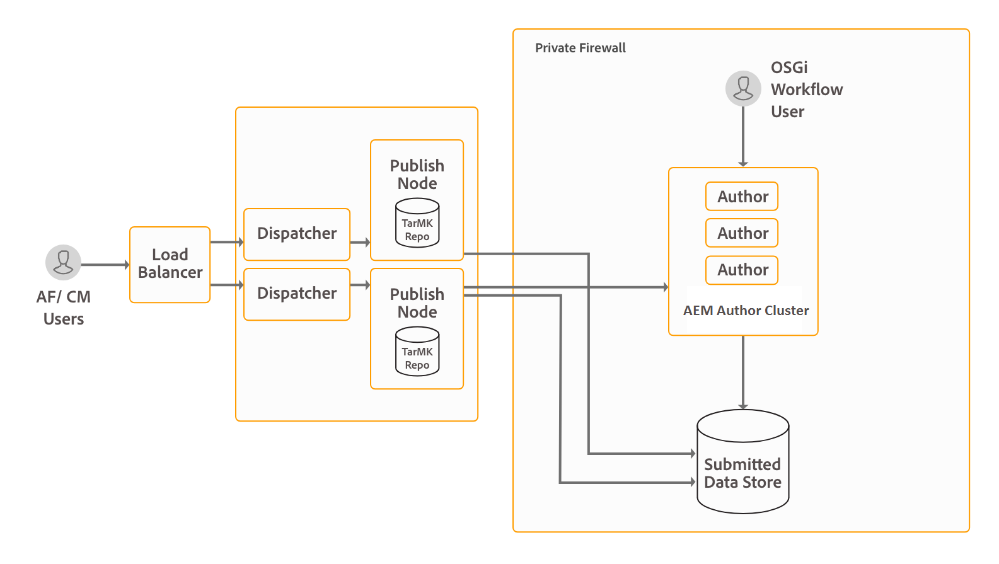

# Topologie di architettura e implementazione per AEM Forms {#architecture-and-deployment-topologies-for-aem-forms}

## Architettura {#architecture}

AEM Forms è un’applicazione implementata in AEM come pacchetto AEM. Il pacchetto è noto come pacchetto aggiuntivo AEM Forms. Il pacchetto del componente aggiuntivo AEM Forms contiene sia i servizi (fornitori di API) che quelli distribuiti nel contenitore AEM OSGi, sia i servlet o i JSP (che forniscono funzionalità front-end e REST API) gestiti dal framework Sling di AEM. Il diagramma seguente illustra questa configurazione:

L’architettura di AEM Forms include i seguenti componenti:

* **** Servizi AEM di base: Servizi di base forniti da AEM a un’applicazione distribuita. Tali servizi includono un archivio di contenuti conforme con JCR, un contenitore di servizi OSGI, un motore di workflow, un archivio di fiducia, un archivio di chiavi e così via. Questi servizi sono disponibili per l&#39;applicazione AEM Forms ma non sono forniti dai pacchetti AEM Forms. Questi servizi sono parte integrante dello stack AEM globale e i vari componenti AEM Forms li utilizzano.
* **** Servizi Forms: Offrire funzionalità correlate ai moduli, quali creazione, assemblaggio, distribuzione e archiviazione di documenti PDF, aggiunta di firme digitali per limitare l&#39;accesso ai documenti e decodifica di moduli con codice a barre. Questi servizi sono disponibili al pubblico per l’uso da parte di codice personalizzato co-distribuito in AEM.
* **** Livello Web: JSP o servlet, costruiti su servizi comuni e di moduli, che forniscono le seguenti funzionalità:

   * **Fronte di authoring**: Interfaccia utente per la creazione e gestione di moduli e per la creazione e la gestione di moduli.
   * **Rappresentazioni del modulo e frontali** di invio: Interfaccia per l’utente finale utilizzata dagli utenti finali di AEM Forms (ad esempio, per l’accesso da parte di cittadini a un sito Web governativo). Questo fornisce la rappresentazione del modulo (visualizzazione del modulo in un browser Web) e le funzionalità di invio.
   * **API REST**: I JSP e i servlet esportano un sottoinsieme di servizi di moduli da utilizzare in remoto da client basati su HTTP, ad esempio l&#39;SDK di Forms Mobile.

**** AEM Forms su OSGi: I moduli AEM nell’ambiente OSGi sono pacchetti standard AEM Author o AEM Publish con AEM Forms distribuiti al loro interno. È possibile eseguire AEM Forms su OSGi in un ambiente server [singolo, in una farm e in cluster](/help/sites-deploying/recommended-deploys.md). La configurazione del cluster è disponibile solo per le istanze di AEM Author.

**** AEM Forms su JEE: AEM Forms su JEE è il server AEM Forms in esecuzione sullo stack JEE. AEM Author è dotato di pacchetti aggiuntivi AEM Forms e di ulteriori funzionalità AEM Forms JEE implementate congiuntamente su un singolo stack JEE in esecuzione su un server applicazioni. È possibile eseguire AEM Forms su JEE in configurazioni a server singolo e cluster. AEM Forms su JEE è richiesto solo per eseguire la protezione dei documenti, la gestione dei processi e per i clienti di LiveCycle che eseguono l&#39;aggiornamento ad AEM Forms. Di seguito sono riportati alcuni scenari aggiuntivi per utilizzare AEM Forms su JEE:

* **** Supporto per l’area di lavoro HTML (per i clienti che utilizzano l’area di lavoro HTML): AEM Forms su JEE abilita il single sign-on con le istanze di elaborazione, distribuisce determinate risorse sottoposte a rendering sulle istanze di elaborazione e gestisce l&#39;invio di moduli sottoposti a rendering nell&#39;area di lavoro HTML.
* **Elaborazione** avanzata dei dati di comunicazione interattiva/modulo: AEM Forms su JEE può essere utilizzato per elaborare ulteriormente i dati di comunicazione interattiva e per salvarli in un archivio di dati adatto, in casi d’uso complessi in cui sono necessarie funzionalità avanzate di gestione dei processi.

AEM Forms su JEE include anche i seguenti servizi di supporto ai componenti AEM:

* **** Gestione utente integrata: Consente agli utenti di AEM Forms su JEE di essere riconosciuti come moduli AEM sugli utenti OSGi e consente di abilitare SSO sia per gli utenti OSGi che per gli utenti JEE. Questo è richiesto per gli scenari in cui è richiesto il single sign-on tra moduli AEM su OSGi e moduli AEM su JEE (ad esempio, area di lavoro HTML).
* **** Hosting risorse: I moduli AEM su JEE possono distribuire risorse (ad esempio, moduli HTML5) su AEM Forms su OSGi.

L&#39;interfaccia utente per la creazione di moduli AEM non supporta la creazione di DOR (Document of Record), moduli PDF e moduli HTML5. Tali risorse sono progettate utilizzando l&#39;applicazione autonoma di Designer Forms e caricate singolarmente in AEM Forms Manager. In alternativa, per AEM Forms su JEE, i moduli possono essere progettati come risorse dell&#39;applicazione (in AEM Forms Workbench) e distribuiti in AEM Forms sul server JEE.

AEM Forms su OSGi e AEM Forms su JEE sono entrambi dotati di funzionalità per il flusso di lavoro. È possibile creare e implementare rapidamente flussi di lavoro di base per varie attività nei moduli AEM su OSGi, senza dover installare la funzionalità di gestione dei processi completa di AEM Forms su JEE. Esistono differenze nelle [funzioni del flusso di lavoro incentrato sui moduli in AEM Forms su OSGi e nelle funzionalità di gestione dei processi di AEM Forms su JEE](/help/forms/using/capabilities-osgi-jee-workflows.md). Lo sviluppo e la gestione di flussi di lavoro incentrati sui moduli in AEM Forms su OSGi utilizzano le familiari funzionalità Flusso di lavoro AEM e Casella in entrata AEM.

## Terminologie {#terminologies}

L’immagine seguente mostra diverse configurazioni del server AEM Form e i relativi componenti utilizzati in una tipica implementazione di AEM Forms:

**** Autore: Un’istanza di creazione è un server AEM Forms in esecuzione nella modalità standard di esecuzione di Author. Può essere AEM Forms su JEE o AEM Forms su OSGi. È destinata agli utenti interni, ai progettisti e agli sviluppatori di comunicazioni interattive. Attiva le seguenti funzionalità:

* **** Creazione e gestione di moduli e comunicazioni interattive: Designer e sviluppatori possono creare e modificare moduli adattivi e comunicazioni interattive, caricare altri tipi di moduli creati esternamente, ad esempio moduli creati in Adobe Forms Designer e gestire le risorse utilizzando la console Forms Manager.
* **** Pubblicazione di moduli e comunicazioni interattive: Le risorse ospitate in un’istanza di creazione possono essere pubblicate in un’istanza di pubblicazione per eseguire operazioni di runtime. La pubblicazione delle risorse utilizza le funzioni di replica di AEM. Adobe consiglia di configurare un agente di replica in tutte le istanze dell&#39;autore in modo da inviare manualmente i moduli pubblicati alle istanze di elaborazione, mentre un altro agente di replica è configurato nell&#39;elaborazione delle istanze con l&#39;attivazione *Al ricevimento* abilitato per replicare automaticamente i moduli ricevuti alle istanze di pubblicazione.

**** Pubblica: Un’istanza di pubblicazione è un server AEM Forms in esecuzione nella modalità di esecuzione standard di Publish. Le istanze di pubblicazione sono destinate agli utenti finali di applicazioni basate su moduli, ad esempio gli utenti che accedono a un sito Web pubblico e inviano moduli. Attiva le seguenti funzionalità:

* Rendering e invio di moduli per gli utenti finali.
* Trasporto dei dati del modulo non elaborati inviati alle istanze di elaborazione per ulteriore elaborazione e archiviazione nel sistema di registrazione finale. L’implementazione predefinita fornita in AEM Forms consente di ottenere questo risultato utilizzando le funzionalità di replica inversa di AEM. È inoltre disponibile un&#39;implementazione alternativa per inviare direttamente i dati del modulo ai server di elaborazione, anziché salvarli prima localmente (quest&#39;ultimo è un prerequisito per l&#39;attivazione della replica inversa). I clienti che nutrono dubbi sulla memorizzazione di dati potenzialmente sensibili nelle istanze di pubblicazione possono implementare questa implementazione alternativa, dal momento che le istanze di elaborazione in genere si trovano in un&#39;area più sicura.
* Rendering e invio di comunicazioni e lettere interattive: Viene eseguito il rendering di una comunicazione e una lettera interattive sulle istanze di pubblicazione e i dati corrispondenti vengono inviati alle istanze di elaborazione per l’archiviazione e la post-elaborazione. I dati possono essere salvati localmente in un’istanza di pubblicazione e replicati in modo inverso in un’istanza di elaborazione (opzione predefinita) in un secondo momento, oppure inviati direttamente all’istanza di elaborazione senza salvare nell’istanza di pubblicazione. Quest&#39;ultima implementazione è utile per i clienti attenti alla sicurezza.

**** Elaborazione: Un&#39;istanza di AEM Forms in esecuzione in modalità di esecuzione Author senza che al gruppo Forms Manager sia assegnato alcun utente. Puoi distribuire AEM Forms su JEE o AEM Forms su OSGi come istanza di elaborazione. Gli utenti non vengono assegnati per garantire che le attività di creazione e gestione dei moduli non vengano eseguite nell&#39;istanza di elaborazione e che si verifichino solo nell&#39;istanza di autore. Un&#39;istanza di elaborazione abilita le seguenti funzionalità:

* **** Elaborazione dei dati del modulo non elaborato in arrivo da un&#39;istanza Pubblica: Questo si ottiene principalmente su un’istanza Elaborazione tramite flussi di lavoro AEM che si attiva all’arrivo dei dati. I flussi di lavoro possono utilizzare il passaggio Modello dati modulo fornito out-of-the-box per archiviare i dati o il documento in un archivio dati appropriato.
* **Memorizzazione protetta dei dati** del modulo: L&#39;elaborazione fornisce un archivio protetto dietro il firewall per i dati dei moduli non elaborati che vengono isolati dagli utenti. Né i progettisti di moduli nell’istanza Author né gli utenti finali nell’istanza Publish possono accedere a questo archivio.

   >[!NOTE]
   >
   > Adobe consiglia di utilizzare un archivio dati di terze parti per salvare i dati elaborati finali invece di utilizzare l&#39;archivio AEM.

* **** Archiviazione e post-elaborazione di dati di corrispondenza provenienti da un’istanza Pubblica: I flussi di lavoro AEM eseguono il post-elaborazione facoltativo delle definizioni di lettere corrispondenti. Questi flussi di lavoro possono salvare i dati elaborati finali in archivi di dati esterni adatti.

* **Hosting** di HTML Workspace: Un’istanza di elaborazione ospita il front-end per HTML Workspace. L’area di lavoro HTML fornisce l’interfaccia utente per l’assegnazione di attività/gruppi associata ai processi di revisione e approvazione.

Un&#39;istanza di elaborazione è configurata per l&#39;esecuzione in modalità di esecuzione Author perché:

* Consente la replica inversa dei dati di un modulo non elaborato da un&#39;istanza Pubblica. Il gestore di archiviazione dati predefinito richiede la funzione di replica inversa.
* Si consiglia di eseguire AEM Workflows, che è il mezzo principale per elaborare i dati del modulo non elaborato provenienti da un&#39;istanza di pubblicazione, in un sistema in stile autore.

## Topologie fisiche di esempio per AEM Forms su JEE {#sample-physical-topologies-for-aem-forms-on-jee}

Le topologie AEM Forms on JEE consigliate di seguito sono principalmente destinate ai clienti che eseguono l&#39;aggiornamento da LiveCycle o da una versione precedente di AEM Forms su JEE. Adobe consiglia di utilizzare AEM Forms su OSGi per nuove installazioni. Una nuova installazione di AEM Forms su JEE è consigliata solo per l&#39;utilizzo delle funzionalità di Document Security e Process Management.

### Topologia per l&#39;utilizzo di Document Services o funzionalità di protezione dei documenti {#topology-for-using-document-services-or-document-security-capabilities}

I clienti di AEM Forms che intendono utilizzare solo Document Services o funzionalità di protezione dei documenti possono avere una topologia simile a quella visualizzata di seguito. Questa topologia consiglia di utilizzare una singola istanza di AEM Forms. Se necessario, potete anche creare un cluster o una farm di server AEM Forms. Questa topologia è consigliata quando la maggior parte degli utenti accede a livello di programmazione alle funzionalità del server AEM Forms e l&#39;intervento tramite l&#39;interfaccia utente è minimo. La topologia è utile nelle operazioni di elaborazione batch di document services. Ad esempio, utilizzando il servizio di output è possibile creare centinaia di documenti PDF non modificabili su base giornaliera.

Anche se in AEM Forms è possibile configurare ed eseguire tutte le funzionalità da un solo server, è comunque necessario eseguire la pianificazione della capacità, il bilanciamento del carico e configurare server dedicati per capacità specifiche in un ambiente di produzione. Ad esempio, per un ambiente che utilizza il servizio PDF Generator per convertire migliaia di pagine al giorno e aggiungere firme digitali per limitare l&#39;accesso ai documenti, impostare server AEM Forms separati per il servizio PDF Generator e le funzionalità di firma digitale. Consente di fornire prestazioni ottimali e di ridimensionare i server indipendentemente l&#39;uno dall&#39;altro.

### Topologia per l&#39;utilizzo della gestione dei processi di AEM Forms {#topology-for-using-aem-forms-process-management}

I clienti di AEM Forms che intendono utilizzare le funzioni di gestione dei processi di AEM Forms, ad esempio, HTML Workspace può avere una topologia simile a quella visualizzata di seguito. I moduli AEM su server JEE possono trovarsi in una singola configurazione di server o cluster.

Se state effettuando l&#39;aggiornamento da LiveCycle ES4, questa topologia rispecchia fedelmente le funzionalità già presenti in LiveCycle, fatta eccezione per l&#39;aggiunta di AEM Author incorporato in AEM Forms su JEE. Inoltre, non vi è alcuna modifica nei requisiti di clustering per i clienti che eseguono un aggiornamento. Se si utilizza AEM Forms in un ambiente cluster, è possibile continuare con lo stesso nei moduli AEM 6.5. Per una nuova installazione di AEM Forms of JEE per l’utilizzo di HTML Workspace, è necessario eseguire l’istanza di creazione AEM integrata nell’ambiente JEE.

L&#39;archivio dati del modulo è un archivio dati di terze parti utilizzato per memorizzare i dati elaborati finali di moduli e comunicazioni interattive. Si tratta di un elemento facoltativo nella topologia. È inoltre possibile scegliere di impostare un&#39;istanza di elaborazione e utilizzare il relativo repository come sistema di registrazione finale, se necessario.

La topologia è consigliata ai clienti che intendono utilizzare AEM Forms sul server JEE per le funzionalità di gestione dei processi (HTML Workspace) senza utilizzare alcuna funzionalità di post-elaborazione, moduli adattivi, moduli HTML5 e comunicazioni interattive.

### Topologia per l&#39;utilizzo di moduli adattivi, moduli HTML5, capacità di comunicazione interattiva {#topology-for-using-adaptive-forms-html-forms-interactive-communication-capabilities}

I clienti di AEM Forms che intendono utilizzare le funzionalità di acquisizione dei dati di AEM Forms, ad esempio moduli adattivi, moduli HTML5 e moduli PDF, possono avere una topologia simile a quella visualizzata di seguito. Questa topologia è consigliata anche per l&#39;utilizzo delle funzionalità di comunicazione interattiva di AEM Forms.

Potete apportare le seguenti modifiche/personalizzazioni alla topologia suggerita:

* L&#39;utilizzo dell&#39;app HTML Workspace e AEM Forms richiede un&#39;istanza di creazione o elaborazione AEM. Puoi utilizzare l’istanza di creazione AEM integrata in AEM Forms su un server JEE invece di configurare un ulteriore server di creazione AEM esterno.
* Un&#39;istanza di AEM Author o Processing è necessaria solo per i flussi di lavoro incentrati su Forms su OSGi, moduli adattivi, portale moduli e comunicazione interattiva.
* l&#39;interfaccia utente dell&#39;agente di comunicazione interattiva viene in genere eseguita all&#39;interno dell&#39;organizzazione. È quindi possibile mantenere un server di pubblicazione per l’interfaccia utente dell’agente all’interno della rete privata.
* I moduli AEM su un’istanza OSGi incorporati in AEM Forms sul server JEE possono inoltre eseguire flussi di lavoro incentrati su Forms su OSGi e cartelle esaminate.

## Topologie fisiche di esempio per l’utilizzo di AEM Forms su OSGi {#sample-physical-topologies-for-using-aem-forms-on-osgi}

### Topologia per l&#39;acquisizione dei dati, comunicazione interattiva, Flusso di lavoro incentrato sui moduli sulle funzionalità OSGi {#topology-for-data-capture-interactive-communication-form-centric-workflow-on-osgi-capabilities}

I clienti di AEM Forms che intendono utilizzare le funzionalità di acquisizione dei dati di AEM Forms, ad esempio moduli adattivi, moduli HTML5 e moduli PDF, possono avere una topologia simile a quella visualizzata di seguito. Questa topologia è consigliata anche per l’utilizzo delle comunicazioni interattive e dei flussi di lavoro incentrati sui moduli per OSGi, ad esempio per l’utilizzo di AEM Inbox e AEM Forms App per i flussi di lavoro dei processi aziendali.

### Topologia per l&#39;utilizzo delle funzionalità delle cartelle esaminate per l&#39;elaborazione batch offline {#topology-for-using-watched-folder-capabilities-for-offline-batch-processing}

I clienti di AEM Forms che intendono utilizzare le cartelle esaminate per l&#39;elaborazione batch possono avere una topologia simile a quella visualizzata di seguito. La topologia visualizza un ambiente cluster, ma si decide di utilizzare una singola istanza o una farm di server AEM Forms a seconda del carico. L&#39;origine dati di terze parti è il tuo sistema di record. Funziona come origine di input per le cartelle esaminate. La topologia visualizza anche l&#39;output sotto forma di file stampato. È inoltre possibile memorizzare il contenuto di output in un file system, inviarlo via e-mail e utilizzare altri metodi personalizzati per utilizzare l&#39;output.

### Topologia per l&#39;utilizzo delle funzionalità di document services per l&#39;elaborazione basata sulle API offline {#topology-for-using-document-services-capabilities-for-offline-api-based-processing}

I clienti di AEM Forms che intendono utilizzare solo la funzionalità Document Services possono avere una topologia simile a quella visualizzata di seguito. Questa topologia consiglia di utilizzare un cluster di AEM Forms su server OSGi. Questa topologia è consigliata quando la maggior parte degli utenti a livello di programmazione (mediante API) accede alle funzionalità del server AEM Forms e l&#39;intervento tramite l&#39;interfaccia utente è minimo. La topologia è molto utile in diversi scenari software client. Ad esempio, più client che utilizzano il servizio PDF Generator per creare documenti PDF su richiesta.

Anche se AEM Forms consente di configurare ed eseguire tutte le funzionalità da un solo server, è necessario pianificare la capacità, bilanciare il carico e configurare server dedicati per capacità specifiche in un ambiente di produzione. Ad esempio, per un ambiente che utilizza il servizio PDF Generator per convertire migliaia di pagine al giorno e più moduli adattivi per l&#39;acquisizione dei dati, impostare server AEM Forms separati per il servizio PDF Generator e le funzionalità dei moduli adattivi. Consente di fornire prestazioni ottimali e di ridimensionare i server indipendentemente l&#39;uno dall&#39;altro.

