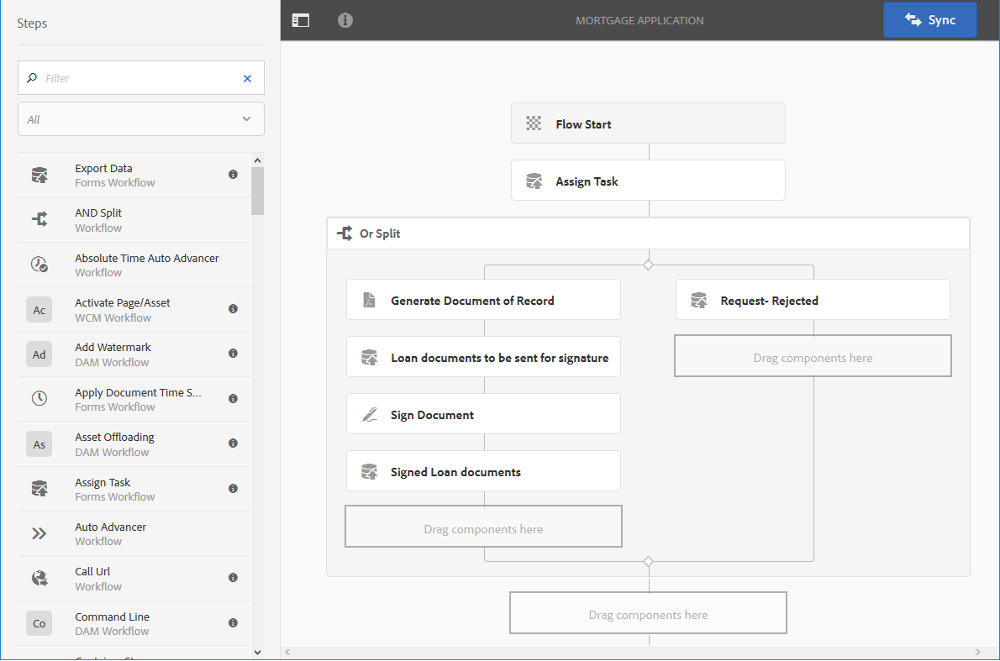

# Flusso di lavoro Forms basato su OSGi{#forms-centric-workflow-on-osgi}

Le aziende raccolgono i dati da centinaia e migliaia di moduli, diversi sistemi back-end e origini dati online o offline. Hanno anche un set dinamico di utenti che prendono decisioni sui dati, il che implica processi di revisione e approvazione ripetitivi.

Oltre ai flussi di lavoro di revisione e approvazione per il pubblico interno ed esterno, le grandi organizzazioni e aziende hanno attività ripetitive. Ad esempio, conversione di un documento PDF in un altro formato. Una volta eseguite manualmente, queste attività richiedono molto tempo e risorse. Le aziende dispongono inoltre di requisiti legali per firmare digitalmente un documento e archiviare i dati del modulo per utilizzarli successivamente in formati predefiniti.

## Introduzione al flusso di lavoro Forms-centric su OSGi {#introduction-to-forms-centric-workflow-on-osgi}

È possibile utilizzare AEM flussi di lavoro per creare rapidamente flussi di lavoro basati su moduli adattivi. Questi flussi di lavoro possono essere utilizzati per revisioni e approvazioni, flussi di processi aziendali, per avviare Document Services, per l&#39;integrazione con  flusso di lavoro di firma Adobe Sign e operazioni simili. Ad esempio, l&#39;elaborazione delle applicazioni con carta di credito, i dipendenti, lasciando i flussi di lavoro di approvazione, salvando un modulo come documento PDF. Inoltre, questi flussi di lavoro possono essere utilizzati all&#39;interno di un&#39;organizzazione o attraverso un firewall di rete.

Con il flusso di lavoro Forms basato su OSGi, potete creare e implementare rapidamente flussi di lavoro per varie attività nello stack OSGi, senza dover installare la funzionalità di Process Management completa nello stack JEE. Lo sviluppo e la gestione dei flussi di lavoro utilizzano le funzionalità familiari AEM Workflow e AEM Inbox. I flussi di lavoro sono la base per automatizzare i processi aziendali reali che si estendono su più sistemi software, reti, reparti e persino organizzazioni.

Una volta configurati, questi flussi di lavoro possono essere attivati manualmente per completare un processo definito o eseguiti a livello di programmazione quando gli utenti inviano una lettera di gestione [del modulo o della](/help/forms/using/cm-overview.md) corrispondenza. Grazie a queste funzionalità avanzate AEM Workflow,  AEM Forms offre due funzionalità distinte ma simili. Come parte della strategia di distribuzione, è necessario decidere quale funziona. Consulta un [confronto](capabilities-osgi-jee-workflows.md) dei flussi di lavoro AEM Forms su OSGi e Process Management su JEE. Inoltre, per la topologia di implementazione, consulta, topologie di [architettura e implementazione per  AEM Forms](/help/forms/using/aem-forms-architecture-deployment.md).

Il flusso di lavoro Forms-centric su OSGi estende [AEM Posta in arrivo](/help/sites-authoring/inbox.md) e fornisce componenti aggiuntivi (passaggi) per AEM Editor flussi di lavoro per aggiungere supporto  flussi di lavoro basati su AEM Forms. La Casella in entrata AEM estesa dispone di funzionalità simili a [AEM Forms Workspace](introduction-html-workspace.md). Oltre a gestire flussi di lavoro basati su risorse umane (approvazione, revisione e così via), è possibile utilizzare AEM flussi di lavoro per automatizzare le operazioni relative a [Document Services](/help/sites-developing/workflows-step-ref.md)(ad esempio, Genera PDF) e la firma elettronica ( Adobe Sign) dei documenti.

Tutti  passaggi del flusso di lavoro AEM Forms supportano l’uso delle variabili. Le variabili consentono ai passaggi del flusso di lavoro di contenere e trasmettere i metadati attraverso i passaggi in fase di esecuzione. È possibile creare diversi tipi di variabili per memorizzare diversi tipi di dati. È inoltre possibile creare raccolte di variabili (array) per memorizzare più istanze di dati correlati con lo stesso tipo. In genere, si utilizza una variabile o una raccolta di variabili quando è necessario prendere una decisione in base al valore che contiene o per memorizzare le informazioni necessarie in un secondo momento in un processo. Per ulteriori informazioni sull’utilizzo delle variabili in questi componenti per flussi di lavoro basati su Forms (passaggi), consulta Flusso di lavoro incentrato su [Forms in OSGi - Riferimento](../../forms/using/aem-forms-workflow-step-reference.md)passo. Per informazioni sulla creazione e la gestione di variabili, vedi [Variabili nei flussi di lavoro](../../forms/using/variable-in-aem-workflows.md)AEM.

Nel diagramma seguente viene illustrata la procedura end-to-end per creare, eseguire e monitorare un flusso di lavoro Forms incentrato su OSGi.

## Prima di iniziare {#before-you-start}

* Un flusso di lavoro è una rappresentazione di un processo aziendale reale. Tenete a portata di mano il processo aziendale e l&#39;elenco dei partecipanti al processo aziendale. Inoltre, tenete le risorse (moduli adattivi, documenti PDF e altro ancora) pronte prima di iniziare a creare un flusso di lavoro.
* Un flusso di lavoro può avere più fasi. Queste fasi vengono visualizzate nella AEM in entrata e consentono di segnalare l’avanzamento del flusso di lavoro. Dividi il processo aziendale in fasi logiche.
* È possibile configurare la fase di assegnazione dei flussi di lavoro AEM per inviare le notifiche e-mail agli utenti o assegnatari. Pertanto, [abilitate le notifiche](#configure-email-service)e-mail.
* Un flusso di lavoro può inoltre utilizzare  Adobe per le firme digitali. Se prevedete di utilizzare  Adobe Sign in un flusso di lavoro, [configurate  Adobe Sign per  AEM Forms](../../forms/using/adobe-sign-integration-adaptive-forms.md) prima di utilizzarlo in un flusso di lavoro.

## Create a workflow model {#create-a-workflow-model}

Un modello di workflow è costituito dalla logica e dal flusso di lavoro di un processo aziendale. È costituito da una serie di passi. Questi passaggi sono AEM componenti. È possibile estendere i passaggi del flusso di lavoro con parametri e script per fornire funzionalità e controllo maggiori, a seconda delle necessità.  AEM Forms fornisce alcuni passaggi oltre AEM passaggi disponibili. Per un elenco dettagliato dei passaggi AEM e  AEM Forms, consultate [AEM Riferimento](/help/sites-developing/workflows-step-ref.md) ai passaggi del flusso di lavoro e Flusso di lavoro incentrato su [Forms in OSGi - Riferimento](../../forms/using/aem-forms-workflow.md)passo.

AEM un&#39;interfaccia utente intuitiva per creare un modello di workflow utilizzando i passaggi del flusso di lavoro forniti. Per istruzioni dettagliate sulla creazione di un modello di workflow, consultate [Creazione di modelli](/help/sites-developing/workflows-models.md)di workflow. L&#39;esempio seguente fornisce istruzioni dettagliate per creare un modello di workflow per un flusso di lavoro di approvazione e revisione:

>[!NOTE]
>
>Per creare o modificare un modello di workflow, è necessario essere membri del gruppo di editor del flusso di lavoro.

### Creare un modello per un flusso di lavoro di approvazione e revisione {#create-a-model-for-an-approval-and-review-workflow}

Il flusso di lavoro di approvazione e revisione riguarda i compiti che richiedono l&#39;intervento umano per prendere decisioni. Nell&#39;esempio seguente viene creato un modello di flusso di lavoro per un&#39;applicazione di mutuo ipotecario da compilare da un agente bancario front-office. Una volta compilata, la domanda viene inviata per l&#39;approvazione. Successivamente, la domanda approvata viene inviata al richiedente per le firme elettroniche utilizzando  Adobe Sign.

L&#39;esempio è disponibile come pacchetto allegato di seguito. Importate e installate l&#39;esempio utilizzando il gestore pacchetti. Per creare manualmente il modello di flusso di lavoro per l’applicazione, potete inoltre effettuare le seguenti operazioni:

Nell&#39;esempio viene creato un modello di flusso di lavoro per un&#39;applicazione mutuo da compilare da un agente bancario front-office. Una volta compilata la domanda viene inviata per l&#39;approvazione. In seguito, l&#39;applicazione approvata verrà inviata al cliente per le firme elettroniche utilizzando  Adobe Sign. Potete importare e installare l’esempio utilizzando il gestore pacchetti.

[Ottieni file](assets/example-mortgage-loan-application.zip)

1. Aprite la console Modelli di workflow. L’URL predefinito è `https://[server]:[port]/libs/cq/workflow/admin/console/content/models.html/etc/workflow/models`
1. Select **Create**, then **Create Model**. Viene visualizzata la finestra di dialogo Aggiungi modello flusso di lavoro.
1. Immettete **Titolo** e **Nome** (facoltativo). Ad esempio, un&#39;applicazione di ipoteca. Toccate **Chiudi**.
1. Selezionate il modello di flusso di lavoro appena creato e toccate **Modifica**. Ora puoi aggiungere passaggi al flusso di lavoro per creare logica di business. La prima volta che create un modello di workflow, questo contiene:

   * I passaggi: Inizio flusso e Fine flusso. Questi passaggi rappresentano l’inizio e la fine del flusso di lavoro. Questi passaggi sono obbligatori e non possono essere modificati o rimossi.
   * Esempio di passaggio partecipante denominato Passaggio 1. Questo passaggio è configurato per assegnare un elemento di lavoro all’utente amministratore. Rimuovi questo passaggio.

1. Abilitare le notifiche e-mail. Potete configurare il flusso di lavoro Forms-centric su OSGi per l’invio di notifiche e-mail a utenti o assegnatari. Per abilitare le notifiche e-mail, eseguite le seguenti configurazioni:

   1. Andate AEM gestore di configurazione all&#39;indirizzo `https://[server]:[port]/system/console/configMgr`.
   1. Aprire la configurazione **[!UICONTROL Day CQ Mail Service]** . Specificare un valore per il nome **[!UICONTROL host del server]** SMTP, **[!UICONTROL la porta del server]** SMTP e i campi dell&#39;indirizzo **** &quot;Da&quot;. Fai clic su **[!UICONTROL Salva]**.
   1. Aprite la configurazione **[!UICONTROL Day CQ Link Externalizer]** . Nel campo **[!UICONTROL Domini]** , specificate il nome host/indirizzo IP effettivo e il numero di porta per le istanze locali, di autori e di pubblicazione. Fai clic su **[!UICONTROL Salva]**.

1. Creare le fasi del flusso di lavoro. Un flusso di lavoro può avere più fasi. Tali fasi vengono visualizzate nella AEM in entrata e riportano l&#39;avanzamento del flusso di lavoro.

   Per definire un passaggio, toccate l&#39;icona  per aprire le proprietà del modello di workflow, aprite la scheda **Staggi** , aggiungete le fasi per il modello di workflow e toccate **Salva e chiudi**. Per l&#39;applicazione ipoteca di esempio, creare le fasi: richiesta di prestito, stato della richiesta di prestito, documenti da firmare e documento di prestito firmato.

1. Trascinare il browser **Assegna passaggi attività** sul modello di workflow. Impostatelo come primo passo del modello.

   Il componente Attività assegna l’attività, creata in base al flusso di lavoro, a un utente o a un gruppo. Oltre ad assegnare l’attività, è possibile utilizzare il componente per specificare un modulo adattivo o un PDF non interattivo per l’attività. Il modulo adattivo è richiesto per accettare l&#39;input degli utenti e i PDF non interattivi oppure un modulo adattivo di sola lettura viene utilizzato per i flussi di lavoro di sola revisione.

   È inoltre possibile utilizzare il passaggio per controllare il comportamento dell&#39;attività. Ad esempio, la creazione di un documento di record automatico, l&#39;assegnazione dell&#39;attività a un utente o gruppo specifico, il percorso dei dati inviati, il percorso dei dati da precompilare e le azioni predefinite. Per informazioni dettagliate sulle opzioni della fase di assegnazione delle attività, vedere Flusso di lavoro incentrato su [Forms in OSGi - documento Riferimento](../../forms/using/aem-forms-workflow.md) passo.

   

   Per l&#39;esempio dell&#39;applicazione ipotecaria, configurare il passaggio dell&#39;attività di assegnazione in modo che utilizzi un modulo adattivo di sola lettura e visualizzare il documento PDF al termine dell&#39;attività. Inoltre, selezionare il gruppo di utenti autorizzato ad approvare la richiesta di prestito. Nella scheda **Azioni** , disabilitare l&#39;opzione **Invia** . Creare una variabile **actionTaken** di tipo di dati String e specificare la variabile come variabile di **route**. Ad esempio, actionTaken. Inoltre, aggiungere le route Approva e Rifiuta. Le route vengono visualizzate come azioni (pulsanti) separate nella AEM Posta in arrivo. Il flusso di lavoro seleziona un ramo in base all&#39;azione (pulsante) toccata dall&#39;utente.

   È possibile importare il pacchetto di esempio, disponibile per il download all&#39;inizio della sezione, per l&#39;insieme completo di valori di tutti i campi del passaggio dell&#39;attività di assegnazione configurato, ad esempio l&#39;applicazione mutuo.

1. Trascinate il componente O divisione dal browser a passi al modello di workflow. La divisione OR crea una divisione nel flusso di lavoro, dopo di che è attivo un solo ramo. Questo passaggio consente di introdurre i percorsi di elaborazione condizionale nel flusso di lavoro. Potete aggiungere i passaggi del flusso di lavoro a ogni ramo, a seconda delle necessità.

   È possibile definire l&#39;espressione di routing per un ramo utilizzando una definizione di regola, uno script ECMA o uno script esterno.

   Utilizzare l&#39;editor di espressioni per creare espressioni di routing per ramo 1 e ramo 2. Queste espressioni di routing consentono di scegliere un ramo in base all&#39;azione dell&#39;utente in AEM Posta in arrivo.

   **Espressione di routing per il ramo 1**

   Quando un utente tocca **Approva** in AEM Posta in arrivo, viene attivato il ramo 1.

   

   **Espressione di routing per il ramo 2**

   Quando un utente tocca **Rifiuta** in AEM Posta in arrivo, viene attivato il ramo 2.

   

   Per informazioni sulla creazione di espressioni di routing utilizzando le variabili, vedere [Variabili in  flussi di lavoro](../../forms/using/variable-in-aem-workflows.md)AEM Forms.

1. Aggiungi altri passaggi del flusso di lavoro per creare la logica di business.

   Per l&#39;esempio relativo all&#39;ipoteca, aggiungere un documento di generazione del record, due passaggi dell&#39;attività di assegnazione e un passaggio del documento di firma al ramo 1 del modello, come illustrato nell&#39;immagine seguente. Una fase di assegnazione dell&#39;attività consiste nel visualizzare e inviare **al richiedente** i documenti di prestito firmati e un&#39;altra componente dell&#39;attività assegnata consiste **nella visualizzazione dei documenti** firmati. È inoltre possibile aggiungere un componente attività di assegnazione al ramo 2. Viene attivato quando un utente tocca Rifiuta in AEM Posta in arrivo.

   Per l&#39;insieme completo di valori di tutti i campi dei passaggi dell&#39;attività di assegnazione, del passaggio del documento del record e del passaggio del documento di firma configurati ad esempio per l&#39;applicazione del mutuo, importare il pacchetto di esempio, disponibile per il download all&#39;inizio di questa sezione.

   Il modello di workflow è pronto. Potete avviare il flusso di lavoro tramite vari metodi. Per informazioni dettagliate, consultate [Avviare un flusso di lavoro Forms-centric su OSGi](#launch).

   

## Creare un’applicazione di flussi di lavoro basata su Forms {#create-a-forms-centric-workflow-application}

L’applicazione è il modulo adattivo associato al flusso di lavoro. Quando un&#39;applicazione viene inviata tramite Inbox, avvia il flusso di lavoro associato. Per rendere disponibile un flusso di lavoro Forms come applicazione in AEM Posta in arrivo e  App AEM Forms, effettuate le seguenti operazioni per creare un’applicazione di flusso di lavoro:

>[!NOTE]
>
>È necessario essere membri del gruppo di amministratori di fd per poter creare e gestire le applicazioni del flusso di lavoro.

1. Nell’istanza di AEM autore, andate a  > **[!UICONTROL Forms]**> **[!UICONTROL Manage Workflow Application]** (Gestisci applicazione flusso di lavoro) e toccate **[!UICONTROL Create]**(Crea).
1. Nella finestra Crea applicazione flusso di lavoro, fornisci gli input per i campi seguenti e tocca **Crea**. Una nuova applicazione viene creata ed elencata nella schermata Applicazioni flusso di lavoro.

<table>
 <tbody>
  <tr>
   <td>Campo</td>
   <td>Descrizione</td>
  </tr>
  <tr>
   <td>Titolo</td>
   <td>Il titolo è visibile in AEM Casella in entrata e consente agli utenti di scegliere un’applicazione. Tenetelo descrittivo. Ad esempio, Salvataggio dell'applicazione di apertura dell'account.  </td>
  </tr>
  <tr>
   <td>Nome </td>
   <td>Specificate il nome dell'applicazione. Tutti i caratteri diversi da alfabeti, numeri, trattini e caratteri di sottolineatura vengono sostituiti da trattini. </td>
  </tr>
  <tr>
   <td>Descrizione</td>
   <td>La descrizione è visibile in AEM Posta in arrivo. Fornire informazioni dettagliate sull'applicazione nei campi di descrizione. Ad esempio, Finalità dell'applicazione.  </td>
  </tr>
  <tr>
   <td>Modulo adattivo</td>
   <td>
Specificare il percorso di un modulo adattivo. Quando un utente avvia un'applicazione, viene visualizzato il modulo adattivo specificato.
 
<strong>Nota</strong>: Le applicazioni per i flussi di lavoro non supportano moduli e documenti PDF con più pagine o che richiedono lo scorrimento sull'iPad Apple. Quando un'applicazione viene aperta sull'iPad e il modulo adattivo o il documento PDF supera una pagina, i campi modulo e il contenuto della seconda pagina vengono persi.
 </td>
  </tr>
  <tr>
   <td>Gruppo di accesso</td>
   <td>
Selezionate un gruppo. L'applicazione è visibile in AEM Posta in arrivo solo ai membri del gruppo selezionato. L’opzione del gruppo di accesso rende disponibili per la selezione tutti i gruppi di utenti del flusso di lavoro. 
   </td>
  </tr>
  <tr>
   <td>Servizio preriempimento</td>
   <td>Selezionate un servizio <a href="../../forms/using/prepopulate-adaptive-form-fields.md#aem-forms-custom-prefill-service" target="_blank">di</a> precompilazione per il modulo adattivo.  </td>
  </tr>
  <tr>
   <td>Modello flusso di lavoro</td>
   <td>Selezionate un modello <a href="../../forms/using/aem-forms-workflow.md#create-a-workflow-model">di</a> workflow per l’applicazione. Un modello di workflow è costituito dalla logica e dal flusso del processo aziendale. </td>
  </tr>
  <tr>
   <td>Percorso del file di dati</td>
   <td>Specificare il percorso del file di dati nell'archivio crx. Il percorso è relativo al payload del modulo adattivo e contiene il nome del file di dati. Includete sempre il nome completo del file, inclusa l'estensione, se applicabile. Ad esempio, [payload]/data.xml. </td>
  </tr>
  <tr>
   <td>Percorso allegato</td>
   <td>Specificare il percorso della cartella degli allegati in archivio crx. Il percorso dell'allegato è relativo alla posizione del payload. Ad esempio, [payload]/data.xml. </td>
  </tr>
  <tr>
   <td>Percorso del documento record</td>
   <td>Specificare il percorso del file del documento di registrazione nell'archivio crx. Il percorso è relativo alla posizione del payload del modulo adattivo. Includete sempre il nome completo del file, inclusa l'estensione, se applicabile. Ad esempio, [payload]/DOR/creditcard.pdf.</td>
  </tr>
 </tbody>
</table>

## Avviare un flusso di lavoro Forms-centric su OSGi {#launch}

Puoi avviare o attivare un flusso di lavoro Forms:

* [Invio di un&#39;applicazione dalla AEM Posta in arrivo](#inbox)
* [Invio di un’applicazione da  app AEM Forms](#afa)

* [Invio di un modulo adattivo](#af)
* [Utilizzo della cartella esaminata](#watched)

* [Invio di una comunicazione interattiva o di una lettera](#letter)

### Invio di un&#39;applicazione dalla AEM Posta in arrivo {#inbox}

L’applicazione del flusso di lavoro creata è disponibile come applicazione in Posta in arrivo. Gli utenti membri del gruppo Workflow-users possono compilare e inviare l’applicazione che attiva il flusso di lavoro associato. Per informazioni sull&#39;utilizzo AEM Posta in arrivo per inviare applicazioni e gestire attività, vedere [Gestione di applicazioni e attività Forms in AEM Posta in arrivo](../../forms/using/manage-applications-inbox.md).

### Invio di un’applicazione da  app AEM Forms {#afa}

L&#39;app  AEM Forms si sincronizza con un server  AEM Forms e consente di apportare modifiche ai dati del modulo, alle attività, alle applicazioni del flusso di lavoro e alle informazioni salvate (bozze/modelli) nel proprio account. Per ulteriori informazioni, consultate [app](/help/forms/using/aem-forms-app.md) AEM Forms e articoli correlati.

### Invio di un modulo adattivo {#af}

È possibile configurare le azioni di invio di un modulo adattivo per avviare un flusso di lavoro dopo l’invio del modulo adattivo. I moduli adattivi forniscono l&#39;azione **Richiama un flusso di lavoro** AEM per avviare un flusso di lavoro dopo l&#39;invio di un modulo adattivo. Per informazioni dettagliate sull&#39;azione di invio, vedere [Configurazione dell&#39;azione](../../forms/using/configuring-submit-actions.md)di invio. Per inviare un modulo adattivo tramite l&#39;app AEM Forms , abilitare l&#39;opzione Sincronizza con  app AEM Forms nelle proprietà del modulo adattivo.

È possibile configurare un modulo adattivo per la sincronizzazione, l&#39;invio e l&#39;attivazione di un flusso di lavoro &#39;app AEM Forms. Per informazioni dettagliate, vedere [Uso di un modulo](/help/forms/using/working-with-form.md).

### Utilizzo di una cartella esaminata {#watched}

Un amministratore (membro del gruppo di amministratori di fd) può configurare una cartella di rete per eseguire un flusso di lavoro preconfigurato quando un utente inserisce un file (ad esempio un file PDF) nella cartella. Al termine del flusso di lavoro, è possibile salvare il file dei risultati in una cartella di output specificata. Tale cartella è nota come cartella esaminata. Per configurare una cartella esaminata e avviare un flusso di lavoro, effettuate le seguenti operazioni:

1. Nell’istanza di AEM autore, andate a  **>**[!UICONTROL  Forms ]**> Configure Watched Folder (Configura cartella esaminata).** Viene visualizzato un elenco di cartelle esaminate già configurate.
1. Toccate **[!UICONTROL Nuovo]**. Viene visualizzato un elenco di campi. Specificate un valore per i seguenti campi per configurare una cartella esaminata per un flusso di lavoro:

<table>
 <tbody>
  <tr>
   <td>Campo</td>
   <td>Descrizione</td>
  </tr>
  <tr>
   <td>Nome</code></td>
   <td>Specificate il nome della cartella esaminata. Questo campo supporta solo caratteri alfanumerici.</td>
  </tr>
  <tr>
   <td>Percorso</code></td>
   <td>Specificate la posizione fisica della cartella esaminata. In un ambiente cluster, utilizzate una cartella di rete condivisa accessibile AEM nodo del cluster.</td>
  </tr>
  <tr>
   <td>Elabora file tramite</code></td>
   <td>Selezionate l’ opzione </code>Flusso di lavoro. </code></td>
  </tr>
  <tr>
   <td>Modello flusso di lavoro</code></td>
   <td>Select a workflow model.  </td>
  </tr>
  <tr>
   <td>Motivo file di output</code></td>
   <td>Specificate la struttura di directory per i file di output e le directory. È inoltre possibile specificare un <a href="/help/forms/using/admin-help/configuring-watched-folder-endpoints.md" target="_blank">pattern per file e directory</a>di output.</td>
  </tr>
 </tbody>
</table>

1. Toccate **Avanzate**. Specificate un valore per il campo seguente e toccate **Crea**. La cartella esaminata è configurata per avviare un flusso di lavoro. Ora, ogni volta che un file viene inserito nella directory di input della cartella esaminata, viene attivato il flusso di lavoro specificato.

   | Campo | Descrizione |
   |---|---|
   | Filtro servizio mappatura payload | Quando create una cartella esaminata, viene creata una struttura di cartelle nell’archivio crx. La struttura delle cartelle può fungere da payload per il flusso di lavoro. È possibile creare uno script per mappare un flusso di lavoro AEM per accettare input dalla struttura di cartelle controllata. Un&#39;implementazione out-of-the-box è disponibile ed elencata nel filtro Payload Mapper. Se non disponete di un&#39;implementazione personalizzata, selezionate l&#39;implementazione predefinita. |

   La scheda Avanzate contiene altri campi. La maggior parte di questi campi contiene un valore predefinito. Per informazioni su tutti i campi, consultate l’articolo [Creare o configurare una cartella](/help/forms/using/admin-help/configuring-watched-folder-endpoints.md) controllata.

### Invio di una comunicazione interattiva o di una lettera {#letter}

È possibile associare ed eseguire un flusso di lavoro Forms-centric su OSGi all&#39;invio di una comunicazione interattiva o di una lettera. Nei flussi di lavoro di gestione della corrispondenza vengono utilizzate le comunicazioni interattive e le lettere post-elaborazione. Ad esempio, invio tramite e-mail, stampa, fax o archiviazione delle lettere finali. Per informazioni dettagliate, consultate [Post-elaborazione di comunicazioni interattive e lettere](../../forms/using/submit-letter-topostprocess.md).

## Configurazioni aggiuntive {#additional-configurations}

### Configurare il servizio e-mail {#configure-email-service}

Puoi utilizzare i passaggi Assegna attività e Invia e-mail di Flussi di lavoro AEM per inviare un messaggio e-mail. Per specificare i server e-mail e le altre configurazioni necessarie per l’invio di e-mail, effettuate le seguenti operazioni:

1. Andate AEM gestore di configurazione all&#39;indirizzo `https://[server]:[port]/system/console/configMgr`.
1. Aprire la configurazione **[!UICONTROL Day CQ Mail Service]** . Specificare un valore per il nome **[!UICONTROL host del server]** SMTP, **[!UICONTROL la porta del server]** SMTP e i campi dell&#39;indirizzo **** &quot;Da&quot;. Fai clic su **[!UICONTROL Salva]**.
1. Aprite la configurazione **[!UICONTROL Day CQ Link Externalizer]** . Nel campo **[!UICONTROL Domini]** , specificate il nome host/indirizzo IP effettivo e il numero di porta per le istanze locali, di autori e di pubblicazione. Fai clic su **[!UICONTROL Salva]**.

### Rimozione delle istanze del flusso di lavoro {#purge-workflow-instances}

Riducendo il numero di istanze del flusso di lavoro si ottengono maggiori prestazioni nel motore del flusso di lavoro, è possibile eliminare regolarmente dal repository le istanze del flusso di lavoro completate o in esecuzione. Per informazioni dettagliate, consultate Soppressione [regolare delle istanze](/help/sites-administering/workflows-administering.md#regular) del flusso di lavoro eliminazione delle istanze del flusso di lavoro
