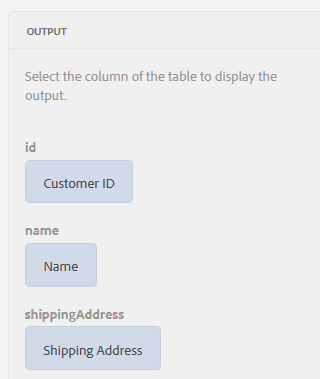

# Tutorial: applicare regole ai campi del modulo adattivo {#tutorial-apply-rules-to-adaptive-form-fields}


Questo tutorial è un passaggio del [Creare il primo modulo adattivo](/help/forms/using/create-your-first-adaptive-form.md) serie. L’Adobe consiglia di seguire la serie in sequenza cronologica per comprendere, eseguire e dimostrare il caso di utilizzo completo dell’esercitazione.

## Informazioni sull’esercitazione {#about-the-tutorial}

È possibile utilizzare le regole per aggiungere interattività, logica di business e convalide intelligenti a un modulo adattivo. I moduli adattivi hanno un editor di regole integrato. L’editor di regole fornisce una funzionalità di trascinamento della selezione, simile alle visite guidate. Il metodo di trascinamento della selezione è il metodo più rapido e semplice per creare regole. L’editor di regole fornisce anche una finestra di codice per gli utenti interessati a testare le loro abilità di codifica o a portare le regole a un livello successivo.

Per ulteriori informazioni sull’editor delle regole, consulta [Editor regole di Forms adattivo](/help/forms/using/rule-editor.md).

Entro la fine dell’esercitazione imparerai a creare regole per:

* Richiama un servizio Modello dati modulo per recuperare i dati dal database
* Richiama un servizio Modello dati modulo per aggiungere dati al database
* Eseguire un controllo delle convalide e visualizzare i messaggi di errore

Le immagini GIF interattive alla fine di ogni sezione dell&#39;esercitazione consentono di apprendere e convalidare al volo la funzionalità del modulo che si sta creando.

## Passaggio 1: recuperare un record cliente dal database {#retrieve-customer-record}

È stato creato un modello dati modulo seguendo la [crea modello dati modulo](/help/forms/using/create-form-data-model.md) articolo. Ora è possibile utilizzare l&#39;editor di regole per richiamare i servizi Forms Data Model per recuperare e aggiungere informazioni al database.

A ogni cliente viene assegnato un numero ID cliente univoco, che consente di identificare i dati rilevanti del cliente in un database. La procedura seguente utilizza l’ID cliente per recuperare informazioni dal database:

1. Apri il modulo adattivo per la modifica.

   [http://localhost:4502/editor.html/content/forms/af/change-billing-shipping-address.html](http://localhost:4502/editor.html/content/forms/af/change-billing-shipping-address.html)

1. Seleziona la **[!UICONTROL ID cliente]** e selezionare il **[!UICONTROL Modifica regole]** icona. Viene visualizzata la finestra Editor regole.
1. Seleziona la **[!UICONTROL + Crea]** per aggiungere una regola. Viene aperto l&#39;Editor visivo.

   Nell&#39;editor visivo, il **[!UICONTROL QUANDO]** è selezionata per impostazione predefinita. Inoltre, l&#39;oggetto modulo (in questo caso, **[!UICONTROL ID cliente]**) da dove hai avviato l&#39;editor di regole è specificato in **[!UICONTROL QUANDO]** dichiarazione.

1. Seleziona la **[!UICONTROL Seleziona stato]** a discesa e selezionare **[!UICONTROL è stato modificato]**.

   

1. In **[!UICONTROL THEN]** istruzione, seleziona **[!UICONTROL Richiama servizio]** dal **[!UICONTROL Seleziona azione]** a discesa.
1. Seleziona la **[!UICONTROL Recupera indirizzo di spedizione]** servizio da **[!UICONTROL Seleziona]** a discesa.
1. Trascina la selezione **[!UICONTROL ID cliente]** dalla scheda Oggetti modulo al campo **[!UICONTROL Rilascia l&#39;oggetto o seleziona qui]** campo in **[!UICONTROL INPUT]** casella.

   

1. Trascina la selezione **[!UICONTROL ID cliente, nome, indirizzo di spedizione, stato e CAP]** dalla scheda Oggetti modulo al campo **[!UICONTROL Rilascia l&#39;oggetto o seleziona qui]** campo in **[!UICONTROL OUTPUT]** casella.

   

   Seleziona **[!UICONTROL Fine]** per salvare la regola. Nella finestra dell’editor delle regole, seleziona **[!UICONTROL Chiudi]**.

1. Visualizza l’anteprima del modulo adattivo. Immetti un ID in **[!UICONTROL ID cliente]** campo. Il modulo ora può recuperare i dettagli del cliente dal database.

   

## Passaggio 2: aggiungere l&#39;indirizzo del cliente aggiornato al database {#updated-customer-address}

Dopo aver recuperato i dettagli del cliente dal database, puoi aggiornare l’indirizzo di spedizione, lo stato e il codice postale. La procedura seguente richiama un servizio del modello dati modulo per aggiornare le informazioni sul cliente nel database:

1. Seleziona la **[!UICONTROL Invia]** e selezionare il **[!UICONTROL Modifica regole]** icona. Viene visualizzata la finestra Editor regole.
1. Seleziona la **[!UICONTROL Submit - Click]** e seleziona la **[!UICONTROL Modifica]** icona. Vengono visualizzate le opzioni per modificare la regola di invio.

   

   Nell’opzione WHEN, il comando **[!UICONTROL Invia]** e **[!UICONTROL ha fatto clic su]** opzioni già selezionate.

   

1. In **[!UICONTROL THEN]** , seleziona l&#39;opzione **[!UICONTROL + Aggiungi istruzione]** opzione. Seleziona **[!UICONTROL Richiama servizio]** dal **[!UICONTROL Seleziona azione]** a discesa.
1. Seleziona la **[!UICONTROL Aggiorna indirizzo di spedizione]** servizio da **[!UICONTROL Seleziona]** a discesa.

   

   

1. Trascina la selezione **[!UICONTROL Indirizzo di spedizione, stato e CAP]** campo da [!UICONTROL Oggetti modulo] al corrispondente nome di tabella .property (ad esempio, customerdetails .shippingAddress) del **[!UICONTROL Rilascia l&#39;oggetto o seleziona qui]** campo in **[!UICONTROL INPUT]** casella. Tutti i campi con prefisso tablename (ad esempio, customerdetails in this use case) fungono da dati di input per il servizio di aggiornamento. Tutto il contenuto fornito in questi campi viene aggiornato nell’origine dati.

   >[!NOTE]
   >
   >Non trascinare **[!UICONTROL Nome]** e **[!UICONTROL ID cliente]** campi corrispondenti a tablename.property (ad esempio, customerdetails.name). Consente di evitare di aggiornare il nome e l’ID del cliente per errore.

1. Trascina la selezione **[!UICONTROL ID cliente]** campo da [!UICONTROL Oggetti modulo] scheda al campo id nella sezione **[!UICONTROL INPUT]** casella. I campi senza un nome di tabella preceduto (ad esempio, customerdetails in questo caso d’uso) fungono da parametro di ricerca per il servizio di aggiornamento. Il **[!UICONTROL id]** in questo caso d’uso identifica in modo univoco un record nel  **customerdetails**  tabella.
1. Seleziona **[!UICONTROL Fine]** per salvare la regola. Nella finestra dell’editor delle regole, seleziona **[!UICONTROL Chiudi]**.
1. Visualizza l’anteprima del modulo adattivo. Recupera i dettagli di un cliente, aggiorna l’indirizzo di spedizione e invia il modulo. Quando recuperi nuovamente i dettagli dello stesso cliente, viene visualizzato l’indirizzo di spedizione aggiornato.

## Passaggio 3: (sezione Bonus) Utilizza l’editor di codice per eseguire convalide e visualizzare messaggi di errore {#step-bonus-section-use-the-code-editor-to-run-validations-and-display-error-messages}

Eseguire la convalida del modulo per verificare che i dati immessi nel modulo siano corretti e che venga visualizzato un messaggio di errore in caso di dati errati. Ad esempio, se nel modulo viene inserito un ID cliente non esistente, deve essere visualizzato un messaggio di errore.

I moduli adattivi forniscono diversi componenti con convalide incorporate, ad esempio e-mail e campi numerici che puoi utilizzare per casi d’uso comuni. Utilizza l’editor di regole per i casi d’uso avanzati, ad esempio, per visualizzare un messaggio di errore quando il database restituisce record zero (0) (nessun record).

Nella procedura seguente viene illustrato come creare una regola per visualizzare un messaggio di errore se l&#39;ID cliente immesso nel modulo non esiste nel database. La regola porta anche lo stato attivo su e ripristina il **[!UICONTROL ID cliente]** campo. La regola utilizza [API dataIntegrationUtils del servizio modello dati modulo](/help/forms/using/invoke-form-data-model-services.md) per verificare se l’ID cliente esiste nel database.

1. Seleziona la **[!UICONTROL ID cliente]** e selezionare il `Edit Rules` icona. Il [!UICONTROL Editor regole] viene visualizzata la finestra.
1. Seleziona la **[!UICONTROL + Crea]** per aggiungere una regola. Viene aperto l&#39;Editor visivo.

   Nell&#39;editor visivo, il **[!UICONTROL QUANDO]** è selezionata per impostazione predefinita. Inoltre, l&#39;oggetto modulo (in questo caso, **[!UICONTROL ID cliente]**) da dove hai avviato l&#39;editor di regole è specificato in **[!UICONTROL QUANDO]** dichiarazione.

1. Seleziona la **[!UICONTROL Seleziona stato]** a discesa e selezionare **[!UICONTROL è stato modificato]**.

   

   In **[!UICONTROL THEN]** istruzione, seleziona **[!UICONTROL Richiama servizio]** dal **[!UICONTROL Seleziona azione]** a discesa.

1. Passa da **[!UICONTROL Editor visivo]** a **[!UICONTROL Editor di codice]**. Il comando dell&#39;interruttore si trova sul lato destro della finestra. Viene visualizzato l&#39;Editor di codice, con un codice simile al seguente:

   

1. Sostituisci la sezione della variabile di input con il seguente codice:

   ```javascript
   var inputs = {
       "id" : this
   };
   ```

1. Sostituisci il `guidelib.dataIntegrationUtils.executeOperation (operationInfo, inputs, outputs)` sezione con il seguente codice:

   ```javascript
   guidelib.dataIntegrationUtils.executeOperation(operationInfo, inputs, outputs, function (result) {
     if (result) {
         result = JSON.parse(result);
       customer_Name.value = result.name;
       customer_Shipping_Address = result.shippingAddress;
     } else {
       if(window.confirm("Invalid Customer ID. Provide a valid customer ID")) {
             customer_Name.value = " ";
            guideBridge.setFocus(customer_ID);
       }
     }
   });
   ```

1. Visualizza l’anteprima del modulo adattivo. Immetti un ID cliente errato. Viene visualizzato un messaggio di errore.

   
