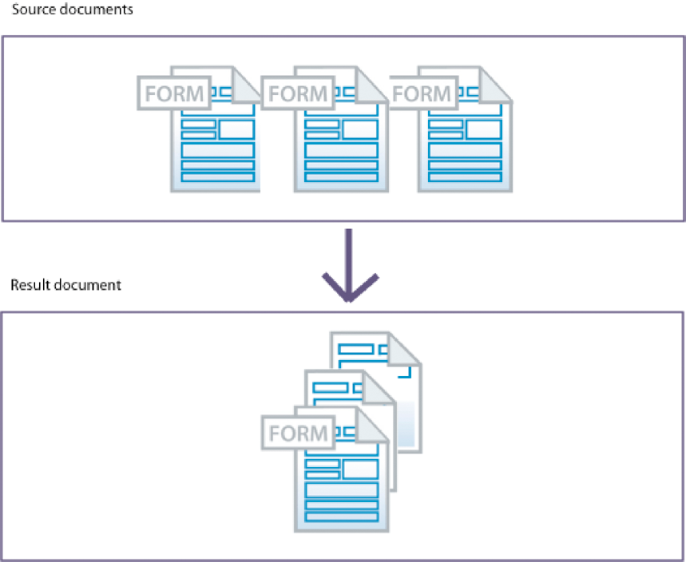
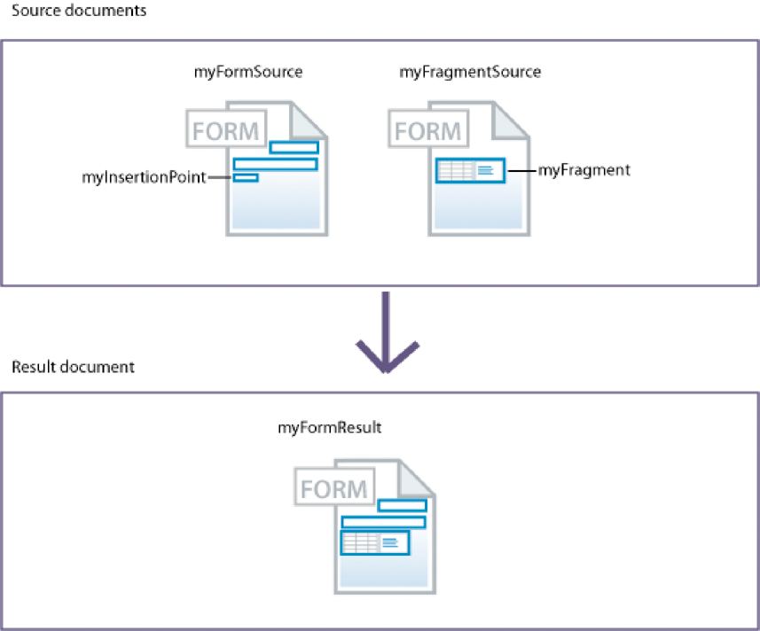
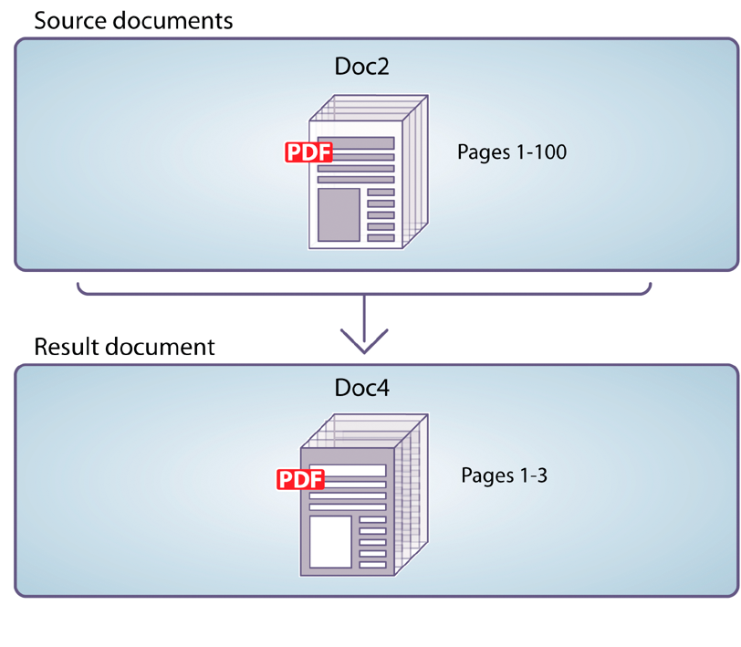

# Utilizzo del servizio Assembler{#using-assembler-service}

Il servizio Assembler consente di combinare, ridisporre e integrare documenti PDF e XDP e di ottenere informazioni sui documenti PDF. Ogni processo inviato al servizio Assembler include un documento Document Description XML (DDX), documenti di origine e risorse esterne (stringhe e grafica). Per ulteriori informazioni sul servizio assembler, vedi [Panoramica del servizio Assembler](../../forms/using/overview-aem-document-services.md#p-assembler-service-p).

È possibile utilizzare il servizio di assemblaggio per le seguenti operazioni:

## Assemblare documenti PDF {#assemble-pdf-documents}

È possibile utilizzare il servizio Assembler per assemblare due o più documenti PDF in un singolo documento PDF o Portfolio PDF. È inoltre possibile applicare funzioni al documento PDF per facilitarne la navigazione o migliorarne la sicurezza. Di seguito sono riportati alcuni modi per assemblare documenti PDF:

### Assemblare un semplice documento PDF {#assemble-a-simple-pdf-document}

Nell&#39;illustrazione seguente sono illustrati tre documenti di origine che vengono uniti in un singolo documento risultante.


Assemblaggio di un semplice documento PDF da più documenti PDF

L&#39;esempio seguente è un semplice documento DDX utilizzato per assemblare il documento. Specifica i nomi dei documenti di origine utilizzati per produrre il documento risultante, nonché il nome del documento risultante:

```xml
<PDF result="Doc4">
<PDF source="Doc1"/>
<PDF source="Doc2"/>
<PDF source="Doc3"/>
</PDF>
```

L&#39;assieme del documento produce un documento risultante contenente il seguente contenuto e\
caratteristiche:

* Tutto o parte di ciascun documento di origine
* Tutti o parte dei segnalibri di ciascun documento di origine, normalizzati per il documento risultante assemblato
* Altre caratteristiche adottate dal documento di base (Doc1), compresi metadati, etichette di pagina e dimensioni della pagina
* Facoltativamente, il documento risultante include un sommario costruito a partire dai segnalibri nei documenti di origine

### Creare un Portfolio PDF {#create-a-pdf-portfolio}

Il servizio Assembler può creare Portfoli PDF contenenti una raccolta di documenti e un&#39;interfaccia utente autonoma. L’interfaccia è denominata Layout Portfolio di PDF o navigatore Portfolio di PDF (navigatore). I Portfoli di PDF estendono la funzionalità dei pacchetti di PDF aggiungendo un navigatore, cartelle e pagine di benvenuto. L’interfaccia può migliorare l’esperienza utente sfruttando le stringhe di testo localizzate, le combinazioni di colori personalizzate e le risorse grafiche. Il Portfolio PDF può anche includere cartelle per organizzare i file nel portfolio.

Quando il servizio Assembler interpreta il seguente documento DDX, assembla un Portfolio PDF che include un navigatore di Portfolio PDF e un pacchetto di due file. Il servizio ottiene il navigatore dalla posizione specificata dall&#39;origine myNavigator. Cambia la combinazione di colori predefinita del navigatore nella combinazione di colori rosaSchema.

```xml
<DDX xmlns="https://ns.adobe.com/DDX/1.0/">
<PDF result="Untitled 1">
<Portfolio>
<Navigator source="myNavigator"/>
<ColorScheme scheme="pinkScheme"/>
</Portfolio>
<PackageFiles>
<PDF source="sourcePDF1"/>
<PDF source="sourcePDF2"/>
</PackageFiles>
</PDF>
</DDX>
```

### Assemblare documenti crittografati {#assemble-encrypted-documents}

Quando si assembla un documento, è inoltre possibile crittografare il documento PDF con una password. Dopo aver crittografato un documento PDF con una password, è necessario che l’utente specifichi la password per visualizzare il documento PDF in Adobe Reader o Acrobat. Per crittografare un documento PDF con una password, il documento DDX deve contenere i valori degli elementi di crittografia necessari per crittografare un documento PDF.

Il servizio di crittografia non deve far parte dell’installazione del LiveCycle per crittografare un documento PDF con una password.

Se uno o più documenti di input sono crittografati, fornisci una password per aprire il documento come parte del DDX.

### Assemblare documenti utilizzando la numerazione Bates {#assemble-documents-using-bates-numbering}

Quando si assembla un documento, è possibile utilizzare la numerazione Bates per applicare un identificatore di pagina univoco a ogni pagina. Quando si utilizza la numerazione Bates, a ogni pagina del documento (o set di documenti) viene assegnato un numero che identifica la pagina in modo univoco. Ad esempio, i documenti di fabbricazione che contengono informazioni sulla distinta base e sono associati alla produzione di un assieme possono contenere un identificatore. Un numero Bates contiene un valore numerico sequenzialmente incrementato e un prefisso e un suffisso facoltativi. Il prefisso + valore numerico + suffisso è denominato pattern a blocchi.

L’illustrazione seguente mostra un documento PDF contenente un identificatore univoco presente nell’intestazione del documento.


Documento PDF contenente un identificatore univoco nell&#39;intestazione del documento

### Flatten e assemblare documenti {#flatten-and-assemble-documents}

È possibile utilizzare il servizio Assembler per trasformare un documento PDF interattivo (ad esempio un modulo) in un documento PDF non interattivo. Un documento PDF interattivo consente agli utenti di immettere o modificare i dati contenuti nei campi del documento di PDF. Il processo di trasformazione di un documento PDF interattivo in un documento PDF non interattivo è denominato appiattimento. Quando un documento PDF viene appiattito, l’aspetto grafico dei campi modulo viene mantenuto ma non è più interattivo. Un motivo per appiattire un documento di PDF è garantire che i dati non possano essere modificati. Inoltre, gli script associati ai campi non funzionano più.

Quando si crea un documento PDF assemblato da documenti PDF interattivi, il servizio Assembler appiattisce tali moduli prima di assemblarli nel documento risultante.

>[!NOTE]
>
>Il servizio Assembler utilizza il servizio Output per appiattire i moduli XFA dinamici. Se il servizio Assembler elabora un DDX che richiede l&#39;appiattimento di un modulo dinamico XFA e il servizio Output non è disponibile, viene generata un&#39;eccezione. Il servizio Assembler può appiattire un modulo Acrobat o un modulo XFA statico senza utilizzare il servizio Output.

## Assemblare documenti XDP {#assemble-xdp-documents}

È possibile utilizzare il servizio Assembler per assemblare più documenti XDP in un singolo documento XDP o in un documento PDF. Per i file XDP di origine che includono punti di inserimento, è possibile specificare i frammenti da inserire.

Ecco alcuni dei modi per assemblare documenti XDP:

### Assembla un semplice documento XDP {#assemble-a-simple-xdp-document}

La figura seguente mostra tre documenti XDP di origine che vengono assemblati in un singolo documento XDP risultante. Il documento XDP risultante contiene i tre documenti XDP di origine, inclusi i relativi dati associati. Il documento risultante ottiene attributi di base dal documento di base, che è il primo documento XDP di origine.



Assemblaggio di un semplice documento XDP da più documenti XDP

Ecco un documento DDX che produce il risultato illustrato sopra.

```xml
<DDX xmlns="https://ns.adobe.com/DDX/1.0/">
<XDP result="MyXDPResult">
<XDP source="sourceXDP1"/>
<XDP source="sourceXDP2"/>
<XDP source="sourceXDP3"/>
</XDP>
</DDX>
```

### Risoluzione dei riferimenti durante l&#39;assieme {#resolving-references-during-assembly}

In genere, i documenti XDP possono contenere immagini a cui si fa riferimento tramite riferimenti assoluti o relativi. Il servizio Assembler, per impostazione predefinita, mantiene i riferimenti alle immagini nel documento XDP risultante.

È possibile specificare come il servizio Assembler gestisce le immagini a cui si fa riferimento nei documenti XDP di origine tramite riferimenti assoluti o relativi nei file XDP durante l&#39;assemblaggio. È possibile scegliere di incorporare tutte le immagini nel risultato in modo che non contenga riferimenti relativi o assoluti. Puoi definirlo impostando il valore del tag resolveAssets , che può assumere una delle seguenti opzioni. Per impostazione predefinita, nessun riferimento viene risolto nel documento dei risultati.

<table>
 <tbody> 
  <tr> 
   <th>Valore</th> 
   <th>Descrizione</th> 
  </tr> 
  <tr> 
   <td>nessuno</td> 
   <td>Non risolve alcun riferimento.</td> 
  </tr> 
  <tr> 
   <td>all</td> 
   <td>Incorpora tutte le immagini di riferimento nel documento XDP di origine.</td> 
  </tr> 
  <tr> 
   <td>relativo</td> 
   <td>Incorpora tutte le immagini a cui si fa riferimento tramite riferimenti relativi nell'XDP di origine<br /> documento.</td> 
  </tr> 
  <tr> 
   <td>assoluto</td> 
   <td>Incorpora tutte le immagini a cui si fa riferimento tramite riferimenti assoluti nell'XDP di origine<br /> documento.</td> 
  </tr> 
 </tbody> 
</table>

È possibile specificare il valore dell&#39;attributo resolveAssets nel tag di origine XDP o nel tag di risultato XDP padre. Se l&#39;attributo è specificato per il tag di risultato XDP, verrà ereditato da tutti gli elementi sorgente XDP che sono figli del risultato XDP. Tuttavia, specificando esplicitamente l&#39;attributo per un elemento di origine si esclude l&#39;impostazione dell&#39;elemento di risultato solo per quel documento di origine.

#### Risolvere tutti i riferimenti di origine in un documento XDP {#resolve-all-source-references-in-an-xdp-document}

Per risolvere tutti i riferimenti nei documenti XDP di origine, specifica l&#39;attributo resolveAssets per\
documento risultante per tutti, come nell&#39;esempio seguente:

```xml
<DDX xmlns="https://ns.adobe.com/DDX/1.0/">
<XDP result="result.xdp" resolveAssets="all">
<XDP source="input1.xdp" />
<XDP source="input2.xdp" />
<XDP source="input3.xdp" />
</XDP>
</DDX
```

È inoltre possibile specificare l&#39;attributo per tutti i documenti XDP di origine in modo indipendente per ottenere lo stesso\
risultato.

```xml
<DDX xmlns="https://ns.adobe.com/DDX/1.0/">
<XDP result="result.xdp">
<XDP source="input1.xdp" resolveAssets="all"/>
<XDP source="input2.xdp" resolveAssets="all"/>
<XDP source="input3.xdp" resolveAssets="all"/>
</XDP>
</DDX>
```

#### Risolvere i riferimenti sorgente selezionati in un documento XDP {#resolve-selected-source-references-in-an-xdp-document}

È possibile specificare in modo selettivo i riferimenti di origine che si desidera risolvere specificando l&#39;attributo resolveAssets corrispondente. Gli attributi per i singoli documenti di origine sostituiscono l’impostazione del documento XDP risultante. In questo esempio vengono risolti anche i frammenti inclusi.

```xml
<DDX xmlns="https://ns.adobe.com/DDX/1.0/">
<XDP result="result.xdp" resolveAssets="all">
<XDP source="input1.xdp" >
<XDPContent source="fragment.xdp" insertionPoint="MyInsertionPoint"
fragment="myFragment"/>
</XDP>
<XDP source="input2.xdp" />
</XDP>
</DDX>
```

#### Risolvere in modo selettivo i riferimenti assoluti o relativi {#selectively-resolve-absolute-or-relative-references}

È possibile risolvere in modo selettivo i riferimenti assoluti o relativi in tutti o in alcuni dei documenti di origine, come illustrato nell&#39;esempio seguente:

```xml
<DDX xmlns="https://ns.adobe.com/DDX/1.0/">
<XDP result="result.xdp" resolveAssets="absolute">
<XDP source="input1.xdp" />
<XDP source="input2.xdp" />
</XDP>
</DDX
```

### Inserimento dinamico di frammenti di modulo in un modulo XFA {#dynamically-insert-form-fragments-into-an-xfa-form}

È possibile utilizzare il servizio Assembler per creare un modulo XFA creato da un altro modulo XFA in cui vengono inseriti i frammenti. Questa funzione consente di utilizzare i frammenti per creare più moduli.

Il supporto per l’inserimento dinamico dei frammenti di modulo supporta il controllo a singola origine. È possibile mantenere una singola sorgente di componenti comunemente utilizzati. Ad esempio, puoi creare un frammento per il banner aziendale. Se il banner cambia, è sufficiente modificare il frammento. Gli altri moduli che includono il frammento rimangono invariati.

I progettisti di moduli utilizzano Progettazione LiveCycli per creare frammenti di modulo. Questi frammenti sono sottomoduli con nome univoco all’interno di un modulo XFA. I form designer utilizzano anche Designer per creare moduli XFA con punti di inserimento denominati in modo univoco. Il programmatore scrive documenti DDX che specificano la modalità di inserimento dei frammenti nel modulo XFA.

Nella figura seguente sono illustrati due moduli XML (modelli XFA). Il modulo a sinistra contiene un punto di inserimento denominato myInsertionPoint. Il modulo sulla destra contiene un frammento denominato myFragment.



Inserimento di frammenti di modulo in un modulo XFA

Quando il servizio Assembler interpreta il seguente documento DDX, crea un modulo XML che contiene un altro modulo XML. Il sottomodulo myFragment del documento myFragmentSource viene inserito in myInsertionPoint nel documento myFormSource.

```xml
<DDX xmlns="https://ns.adobe.com/DDX/1.0/">
<XDP result="myFormResult">
<XDP source="myFormSource">
<XDPContent fragment="myFragment" insertionPoint="myInsertionPoint"
source="myFragmentSource"/>
</XDP>
</XDP>
</DDX
```

### Creare un pacchetto di un documento XDP come PDF {#package-an-xdp-document-as-pdf}

È possibile utilizzare il servizio Assembler per creare un pacchetto di un documento XDP come documento PDF, come mostrato in questo documento DDX.

```xml
<DDX xmlns="https://ns.adobe.com/DDX/1.0/">
<PDF result="Untitled 1" encryption="passEncProfile1">
<XDP>
<XDP source="sourceXDP3"/>
<XDP source="sourceXDP4"/>
</XDP>
</PDF>
</DDX>
```

## Separare i documenti PDF {#disassemble-pdf-documents}

È possibile utilizzare il servizio Assembler per smontare un documento PDF. Il servizio può estrarre pagine dal documento di origine o dividere un documento di origine in base ai segnalibri. In genere, questa attività è utile se il documento PDF è stato creato in origine da molti documenti, ad esempio da una raccolta di istruzioni.

### Estrarre pagine da un documento di origine {#extract-pages-from-a-source-document}

Nell&#39;illustrazione seguente, le pagine 1-3 vengono estratte dal documento di origine e inserite in un nuovo documento risultante.



Estrazione di pagine specifiche da un documento di origine

L&#39;esempio seguente è un documento DDX utilizzato per smontare il documento.

```xml
<PDF result="Doc4">
<PDF source="Doc2" pages="1-3"/>
</PDF>
```

### Dividi un documento di origine basato sui segnalibri {#divide-a-source-document-based-on-bookmarks}

Nell&#39;illustrazione seguente, DocA è suddiviso in più documenti risultanti. Il primo segnalibro di livello 1 in una pagina identifica l&#39;inizio di un nuovo documento risultante.


Dividere un documento di origine basato sui segnalibri in più documenti

L&#39;esempio seguente è un documento DDX che utilizza segnalibri per smontare un documento sorgente.

```xml
<PDFsFromBookmarks prefix="A">
<PDF source="DocA"/>
</PDFsFromBookmarks>
```

## Determinare se i documenti sono conformi a PDF/A {#determine-whether-documents-are-pdf-a-compliant}

È possibile utilizzare il servizio Assembler per determinare se un documento PDF è conforme a PDF/A. PDF/A è un formato di archiviazione destinato alla conservazione a lungo termine del contenuto del documento. I font vengono incorporati nel documento e il file non è compresso. Di conseguenza, un documento PDF/A è generalmente più grande di un documento PDF standard. Inoltre, un documento PDF/A non contiene contenuto audio e video.

## Ottenere informazioni su un documento PDF {#obtain-information-about-a-pdf-document}

È possibile utilizzare il servizio Assembler per ottenere le seguenti informazioni su un documento PDF:

* Informazioni sul testo.

   * Parole in ogni pagina del documento
   * Posizione di ogni parola su ogni pagina del documento
   * Frasi in ogni paragrafo di ogni pagina del documento

* Segnalibri, compresi il numero di pagina, il titolo, la destinazione e l’aspetto. Puoi esportarlo\
   i dati di un documento PDF e importarli in un documento PDF.

* Allegati di file, comprese le informazioni sui file. Per gli allegati a livello di pagina, include anche\
   posizione dell&#39;annotazione dell&#39;allegato del file. È possibile esportare questi dati da un documento PDF e\
   importarlo in un documento PDF.

* File del pacchetto, compresi informazioni sui file, cartelle, pacchetti, schemi e dati dei campi. È possibile esportare i dati da un documento PDF e importarli in un documento PDF.

## Convalida documenti DDX {#validate-ddx-documents}

È possibile utilizzare il servizio Assembler per determinare se un documento DDX è valido. Ad esempio, se si esegue l&#39;aggiornamento da una versione precedente del LiveCycle, la convalida assicura la validità del documento DDX.

## Chiamare altri servizi {#call-other-services}

È possibile utilizzare documenti DDX che fanno chiamare il servizio Assembler i seguenti servizi LiveC. Il servizio Assembler può chiamare solo i servizi installati con LiveCycle.

**Servizio Estensioni Reader**: Consente agli utenti di Adobe Reader di firmare digitalmente il documento PDF risultante.

**Servizio Forms**: Unisce un file XDP e un file di dati XML per produrre un documento PDF contenente il modulo interattivo compilato.

**Servizio di uscita**: Converte un modulo XML dinamico in un documento PDF contenente un modulo non interattivo (appiattisce il modulo). Il servizio Assembler appiattisce i moduli XML statici e i moduli Acrobat senza chiamare il servizio Output.

```xml
<?xml version="1.0" encoding="UTF-8"?>
<DDX xmlns="https://ns.adobe.com/DDX/1.0/">
<PDF result="outDoc">
<PDF source="doc1"/>
<PDF source="doc2"/>
<ReaderRights
credentialAlias="LCESCred"
digitalSignatures="true"/>
</PDF>
</DDX>
```

L&#39;utilizzo di DDX e del servizio Assembler per chiamare altri servizi LiveC per il ciclo può semplificare il diagramma del processo. Può anche ridurre lo sforzo per personalizzare i flussi di lavoro. (Consulta anche
