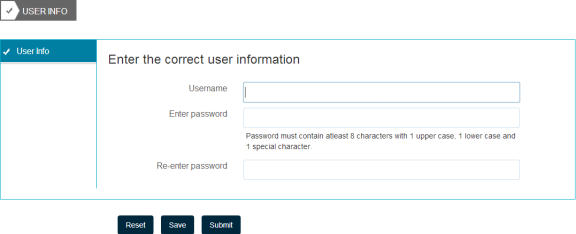

# Authoring della guida contestuale per i campi modulo{#authoring-in-context-help-for-form-fields}

## Introduzione {#introduction}

In alcuni casi, gli utenti finali che compilano un modulo non sono sicuri di come compilare i dettagli in un particolare campo del modulo. Per risolvere tali problemi, i moduli adattivi supportano l&#39;aggiunta di testo o di informazioni dettagliate nel contesto a un campo del modulo. Consente di migliorare l&#39;esperienza di compilazione del modulo ed evitare ogni ambiguità per gli utenti finali.

In questo articolo viene illustrato in che modo gli autori dei moduli possono aggiungere la guida contestuale durante la creazione di Forms adattivo.

## Aggiungi aiuto contestuale {#add-in-context-help}

Potete specificare la guida contestuale utilizzando le seguenti opzioni nella sezione Contenuto della Guida della scheda Proprietà nella barra laterale.

* [Breve descrizione](../../forms/using/authoring-in-field-help.md#p-short-description-p)
* [Descrizione lunga](../../forms/using/authoring-in-field-help.md#p-long-description-p)

>[!NOTE]
>
>La descrizione lunga sostituisce la descrizione breve. Se avete specificato entrambi, verrà visualizzata solo la descrizione lunga.

### Breve descrizione {#short-description}

Il campo Descrizione breve fornisce suggerimenti rapidi e brevi sulla compilazione di un campo del modulo. Il testo specificato nel campo Descrizione breve viene visualizzato come suggerimento quando si passa il mouse sul campo.

>[!NOTE]
>
>Selezionare **Mostra sempre una breve descrizione** per visualizzare in modo permanente il testo della guida sotto il campo.

### Descrizione lunga {#long-description}

Potete utilizzare il campo Descrizione lunga per specificare testo lungo o incorporare contenuti multimediali avanzati, inclusi video, come guida contestuale. Ad esempio, l’immagine seguente mostra come incorporare un video come guida contestuale.

Se si aggiunge una descrizione lunga, viene visualizzata una **?** accanto al campo. Facendo clic sull&#39;icona viene visualizzato il contenuto aggiunto nella sezione di descrizione lunga.

### Guida a livello di pannello {#panel-level-help}

Oltre alla guida contestuale per i campi modulo, è possibile specificare la guida a livello di pannello nella scheda del contenuto della Guida della finestra di dialogo di modifica del pannello.

Aggiungendo aiuto per il pannello viene visualizzato un **?** accanto alla descrizione del pannello. Facendo clic sull’icona viene visualizzato il contenuto aggiunto nella sezione Contenuto della guida della finestra di dialogo di modifica del pannello.

