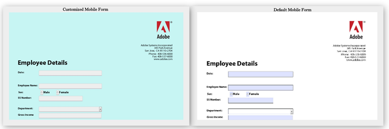

# Modifica degli stili predefiniti dei moduli di HTML5{#changing-default-styles-of-html-forms}

I moduli HTML5 vengono sottoposti a rendering utilizzando le funzionalità di HTML5 e lo stile del modulo sottoposto a rendering viene eseguito utilizzando gli stili CSS. L&#39;aspetto predefinito di un form HTML5 è simile a quello della relativa rappresentazione PDF. Gli sviluppatori possono utilizzare CSS personalizzati per modificare l’aspetto predefinito dei moduli HTML5.

Questo articolo fornisce informazioni dettagliate per modificare lo stile di un modulo HTML5 e [Introduzione agli stili](/help/forms/using/css-styles.md) l’articolo contiene informazioni dettagliate su vari aspetti dello stile dei moduli di HTML5. Assicurati di aver letto l’articolo Introduzione agli stili prima di eseguire i passaggi menzionati in questo articolo.

Le due immagini seguenti mostrano la differenza tra gli stili predefiniti e personalizzati.

## Personalizzare lo stile dei moduli {#style-your-forms}

1. **Scegli un profilo per aggiungere stili personalizzati**

   Accedi all’interfaccia CRX DE all’URL: **https://&lt;server>:&lt;port>/crx/de** e creare un profilo o sceglierne uno esistente. Per informazioni su come creare un profilo, consulta [Creazione di un profilo](/help/forms/using/custom-profile.md)

1. **Creazione di un foglio di stile CSS per la formattazione dei moduli HTML5**

   Passa alla cartella in cui hai creato il renderer del profilo e crea un file del foglio di stile CSS. I passaggi da seguire sono

   1. Fare clic con il pulsante destro del mouse sulla cartella e selezionare **creare** > **crea file** dal menu

   1. Nella finestra di dialogo Crea file immettere il nome del foglio di stile. Assicurati di utilizzare l’estensione .css (ad esempio, stylesheet.css)
   1. Dal riquadro di navigazione, apri il file CSS creato.
   1. Definisci le classi CSS dei componenti a cui vuoi applicare uno stile e aggiungi gli stili in tali classi.

   Per informazioni sulle classi CSS da creare per un particolare componente nei moduli HTML5, consulta [Introduzione agli stili](/help/forms/using/css-styles.md).

1. **Includi il foglio di stile nel modulo di rendering profili**

   Apri la pagina di rendering del profilo (file jsp) in CRX DE e includi il file CSS nella pagina immediatamente sotto la libreria client XFA. Per includere il file CSS nel profilo, effettua le seguenti operazioni.

   1. Cerca nella pagina del renderer la seguente riga:

      &lt;cq:includeClientLib categories=&quot;xfaforms.profile&quot; />

   1. Inserire quanto segue sotto la riga precedente per includere il foglio di stile:

      &lt;link href=&quot;/path/to/stylesheet&quot; rel=&quot;stylesheet&quot; type=&quot;text/css&quot;/>

   1. Salva il file.
