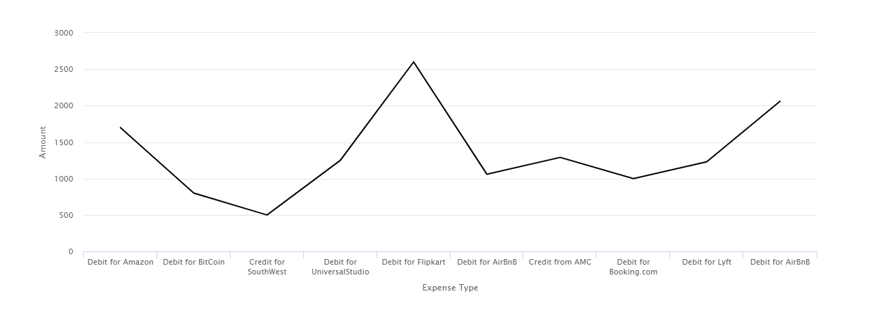

# Utilizzo dei grafici nelle comunicazioni interattive{#using-charts-in-interactive-communications}

Un grafico o un grafico è una rappresentazione visiva dei dati. Condensa grandi quantità di informazioni in formato visivo facile da comprendere, consentendo ai destinatari della comunicazione interattiva di visualizzare, interpretare e analizzare meglio i dati complessi.

Durante la creazione di una comunicazione interattiva, è possibile aggiungere grafici per rappresentare visivamente dati bidimensionali dal modello di dati del modulo della comunicazione interattiva. Il componente Grafico consente di aggiungere e configurare i seguenti tipi di grafici: Torta, Colonna, Anello, Barre, Linea, Linea e Punto, Punto, Area e Quadrante.

## Aggiungi e configura un grafico in una comunicazione interattiva {#add-and-configure-chart-in-an-interactive-communication}

Esegui i seguenti passaggi per aggiungere e configurare un grafico in una comunicazione interattiva:

1. Tocca **Componenti** dalla barra laterale della comunicazione interattiva.
1. Trascina il componente **Grafico** in uno dei seguenti componenti:

   * Canale di stampa: Area di destinazione o campo immagine
   * Canale Web: Pannello o area di destinazione

1. Tocca il componente grafico nell’editor delle comunicazioni interattive e seleziona **[!UICONTROL Configura (]** ) dalla barra degli strumenti del componente.

   Le proprietà del grafico vengono visualizzate nel riquadro a sinistra.

   

   Proprietà di base di un grafico a linee nel canale di stampa

   

   Proprietà di base di un grafico a linee nel canale web

1. Configura le proprietà [del grafico](../../forms/using/chart-component-interactive-communications.md#configure-chart-properties) in base al tipo di canale.
1. (Solo canale di stampa) In **[!UICONTROL Impostazioni agente]**, specificare se è obbligatorio per l&#39;agente utilizzare questo grafico. Se l&#39;opzione i **[!UICONTROL t è obbligatoria per l&#39;agente di utilizzare questo grafico]** non è selezionata, l&#39;agente può toccare l&#39;icona occhio del grafico nella scheda **[!UICONTROL Contenuto]** dell&#39;interfaccia utente dell&#39;agente per mostrare o nascondere il grafico.

   

1. Tocca  per salvare le proprietà del grafico.

   Tocca **[!UICONTROL Anteprima]** per visualizzare l&#39;aspetto e i dati associati al grafico. Tocca **[!UICONTROL Modifica]** per riconfigurare le proprietà del grafico.

## Configura le proprietà del grafico {#configure-chart-properties}

Configura le seguenti proprietà durante la creazione di grafici per la stampa e i canali web:

<table>
 <tbody>
  <tr>
   <td>Campo</td>
   <td>Descrizione</td>
   <td>Tipo canale</td>
  </tr>
  <tr>
   <td>Nome</td>
   <td>Identificatore per l’elemento grafico. Il nome del grafico specificato in questo campo non è visibile nel grafico. Viene utilizzato quando si fa riferimento all’elemento di altri componenti, script ed espressioni SOM.</td>
   <td>Stampa e Web</td>
  </tr>
  <tr>
   <td>Tipo di grafico</td>
   <td>Tipo di grafico da generare. Le opzioni disponibili sono Torta, Colonna, Anello, Barre, Linea, Linea e Punto, Punto e Area.</td>
   <td>Stampa e Web</td>
  </tr>
  <tr>
   <td>Serie &gt; Serie multiple</td>
   <td>Selezionare questa opzione per aggiungere più serie per gli elementi della raccolta di modelli di dati del modulo tracciati sull'asse X e sull'asse Y.</td>
   <td>Stampa e Web</td>
  </tr>
  <tr>
   <td>Serie &gt; Oggetto modello dati</td>
   <td>Nome dell’elemento di raccolta del modello dati del modulo per aggiungere più serie al grafico.<br /> Scegliere una proprietà dell'oggetto modello dati modulo padre per le proprietà tracciate sull'asse X e sull'asse Y per formare una serie significativa. L'oggetto modello dati associato deve essere di tipo Number, String o Date.</td>
   <td>Stampa e Web</td>
  </tr>
  <tr>
   <td>Mostra impilati</td>
   <td>Scegli di impilare i valori di ciascuna serie uno sopra l'altro.</td>
   <td>Stampa e Web</td>
  </tr>
  <tr>
   <td>Asse X &gt; Titolo</td>
   <td>Titolo per l’asse X.</td>
   <td>Stampa e Web</td>
  </tr>
  <tr>
   <td>Asse X &gt; Oggetto modello dati</td>
   <td><p>Nome dell'elemento di raccolta del modello dati modulo da tracciare sull'asse X.</p> <p>Scegliere due proprietà di tipo raccolta/matrice dello stesso oggetto del modello dati padre significative l'una rispetto all'altra per eseguire il grafico sull'asse X e Y di un grafico. L'oggetto modello dati associato deve essere di tipo Number, String o Date.</p> </td>
   <td>Stampa e Web</td>
  </tr>
  <tr>
   <td>Asse Y &gt; Titolo</td>
   <td>Titolo per l’asse Y. </td>
   <td>Stampa e Web</td>
  </tr>
  <tr>
   <td>Asse Y &gt; Oggetto modello dati</td>
   <td><p>Elemento di raccolta del modello dati modulo da tracciare sull’asse Y. Nel canale Stampa, l'oggetto modello dati per l'asse Y deve essere di tipo Numero.</p> <p>Scegliere due proprietà di tipo raccolta/matrice dello stesso oggetto del modello dati padre significative l'una rispetto all'altra per eseguire il grafico sull'asse X e Y di un grafico. </p> </td>
   <td>Stampa e Web</td>
  </tr>
  <tr>
   <td>Asse Y &gt; Funzione</td>
   <td>Funzione statistica/personalizzata da utilizzare per l'elaborazione dei valori sull'asse y.</td>
   <td>Stampa e Web</td>
  </tr>
  <tr>
   <td>Nascondi oggetto</td>
   <td>Selezionare questa opzione per nascondere il grafico nell'output finale.</td>
   <td>Stampa e Web</td>
  </tr>
  <tr>
   <td>Titolo</td>
   <td>Titolo del grafico. </td>
   <td>Stampa</td>
  </tr>
  <tr>
   <td>Altezza</td>
   <td>Altezza del grafico, in pixel.</td>
   <td>Stampa</td>
  </tr>
  <tr>
   <td>Larghezza</td>
   <td>Larghezza del grafico, in pixel. È possibile controllare la larghezza del grafico nel canale web utilizzando il livello di stile o applicando un tema.</td>
   <td>Stampa</td>
  </tr>
  <tr>
   <td>Interruzione di pagina obbligatoria prima</td>
   <td>Selezionare questa opzione per aggiungere un’interruzione di pagina obbligatoria prima del grafico e posizionare il grafico sopra una nuova pagina. </td>
   <td>Stampa</td>
  </tr>
  <tr>
   <td>Interruzione di pagina obbligatoria dopo</td>
   <td>Selezionare questa opzione per aggiungere un’interruzione di pagina obbligatoria dopo il grafico e inserire il contenuto che segue il grafico nella parte superiore di una nuova pagina. </td>
   <td>Stampa</td>
  </tr>
  <tr>
   <td>Rientro</td>
   <td>Rientro del grafico a sinistra della pagina. </td>
   <td>Stampa</td>
  </tr>
  <tr>
   <td>Suggerimento</td>
   <td><p>Formato in cui la descrizione comando viene visualizzata al passaggio del mouse su un punto dati del grafico nel canale Web. Il valore predefinito è ${x}(${y}). A seconda del tipo di grafico, quando si posiziona il mouse su un punto, una barra o una sezione del grafico, le variabili ${x}e ${y} vengono sostituite in modo dinamico con i valori corrispondenti sull'asse X e sull'asse Y e visualizzate nella descrizione comando.</p> <p>Per disabilitare la descrizione comando, lasciare vuoto il campo <span class="uicontrol">Descrizione comando</code> . Questa opzione non è applicabile ai grafici a linee e a superfici. Ad esempio, vedi <a href="#chartoutputprintweb">Esempio 1: Output grafico in stampa e web</a>.</code></p> </td>
   <td>Web</td>
  </tr>
  <tr>
   <td>Configurazioni specifiche del grafico</td>
   <td><p>Oltre alle configurazioni comuni, sono disponibili le seguenti configurazioni specifiche per il grafico:</p>
    <ul>
     <li><strong>Mostra legenda:  </strong>Mostra una legenda per il grafico a torta o ad anello quando è attivato.</li>
     <li><strong>Posizione della legenda:  </strong>Specifica la posizione della legenda rispetto al grafico. Le opzioni disponibili sono Destra, Sinistra, Superiore e Inferiore. Si consiglia di utilizzare la legenda sul lato destro nel canale di stampa.</li>
     <li><strong>Raggio interno</strong>: Disponibile per i grafici ad anello per specificare il raggio (in pixel) del cerchio interno nel grafico.</li>
     <li><strong>Colore</strong> linea: È disponibile per i grafici a linee, a linee e a punti e Area per specificare il colore della linea nel grafico.</li>
     <li><strong>Colore</strong> punto: Disponibile per i grafici a punti e a linee e punti per specificare il colore dei punti del grafico.<br /> </li>
     <li><strong>Colore</strong> area: Disponibile per i grafici Area per specificare il colore dell’area sotto la linea del grafico.</li>
     <li><strong>Punto di riferimento &gt; Tipo di binding:  </strong>Disponibile per i grafici quadranti <strong> </strong>per specificare il tipo di binding per il punto di riferimento. Utilizzare la proprietà dell'oggetto modello dati o testo statico per definire il valore del punto di riferimento.</li>
     <li><strong>Punto di riferimento &gt; asse X:  </strong>Disponibile per i grafici quadranti se si seleziona  <span class="uicontrol"></code> Statico dall’elenco a discesa Tipo di binding per specificare il valore dell’asse X per il punto di riferimento.</code></li>
     <li><strong>Punto di riferimento &gt; Asse Y:  </strong>Disponibile per i grafici quadranti se si seleziona  <span class="uicontrol"></code> Statico dall’elenco a discesa Tipo di binding per specificare il valore dell’asse Y per il punto di riferimento.</code></li>
     <li><strong>Punto di riferimento &gt; Oggetto del modello dati per le serie:  </strong>Disponibile per più grafici Quadranti serie se si seleziona  <span class="uicontrol">Oggetto modello dati </code> dall'elenco a discesa Tipo di binding. Definisci le proprietà oggetto modello dati del modulo per identificare la serie per il punto di riferimento. </code></li>
     <li><strong>Punto di riferimento &gt; Valore dell'oggetto del modello dati per le serie:  </strong>Disponibile per più grafici Quadranti serie se si seleziona  <span class="uicontrol">Oggetto modello dati </code> dall'elenco a discesa Tipo di binding. Utilizzare la proprietà dell'oggetto modello dati modulo per le serie e il valore definito in questo campo per identificare la serie per il punto di riferimento.</code></li>
     <li><strong>Punto di riferimento &gt; Oggetto del modello dati per il punto di riferimento:  </strong>Disponibile per i grafici quadranti se si seleziona  <span class="uicontrol">Oggetto modello dati </code> dall'elenco a discesa Tipo di binding. Definire una proprietà dell’oggetto modello dati modulo di pari livello rispetto alle proprietà tracciate sull’asse X e sull’asse Y. Inoltre, per più serie, definire una proprietà dell'oggetto modello dati che sia un'entità figlio della proprietà dell'oggetto modello dati definita per la serie.</code></li>
     <li><strong>Punto di riferimento &gt; Valore dell'oggetto del modello dati per il punto di riferimento:  </strong>Disponibile per i grafici quadranti se si seleziona  <span class="uicontrol">Oggetto modello dati </code> dall'elenco a discesa Tipo di binding. Utilizzare la proprietà dell'oggetto modello dati modulo per il punto di riferimento e il valore definito in questo campo per identificare il punto di riferimento per il grafico.<br /> <strong>Etichette quadranti &gt; In alto a sinistra:</strong> disponibili per i grafici quadranti per specificare il nome del quadrante in alto a sinistra.</code></li>
     <li><strong>Etichette quadranti &gt; In alto a destra:</strong> disponibili per i grafici quadranti per specificare il nome del quadrante in alto a destra.</li>
     <li><strong>Etichette quadranti &gt; In basso a destra:  </strong>Disponibile per i grafici Quadrante per specificare il nome del quadrante in basso a destra.</li>
     <li><strong>Etichette quadranti &gt; In basso a sinistra:  </strong>Disponibile per i grafici Quadrante per specificare il nome del quadrante in basso a sinistra.</li>
    </ul> </td>
   <td>Stampa e Web</td>
  </tr>
 </tbody>
</table>

## Usa funzioni nel grafico {#use-functions-in-chart}

È possibile configurare un grafico in modo da utilizzare le funzioni statistiche per calcolare i valori dei dati di origine per il grafico. Applicando funzioni in un grafico, è possibile tracciare dati non forniti direttamente dal modello dati del modulo.


Mentre il componente Grafico include alcune funzioni integrate, è possibile scrivere [funzioni personalizzate](#customfunctionsweb) e renderle disponibili per l&#39;uso nella configurazione del grafico nel canale web.

Per impostazione predefinita, con il componente Grafico sono disponibili le seguenti funzioni:

**Media (Media)** Restituisce la media dei valori sull&#39;asse X o Y di un valore specificato sull&#39;altro asse.

**** SumRestituisce la somma di tutti i valori sull&#39;asse X o Y per un valore specificato sull&#39;altro asse.

**** MaximumRestituisce il valore massimo dei valori sull&#39;asse X o Y per un valore specificato sull&#39;altro asse.

**** FrequenzaRestituisce il numero di valori sull&#39;asse X o Y per un valore specificato sull&#39;altro asse.

**** RangeRestituisce la differenza tra il massimo e il minimo dei valori sull&#39;asse X o Y per un valore specificato sull&#39;altro asse.

**** MedianRestituisce il valore che separa i valori più alti e più bassi nella metà dell&#39;asse X o Y per un valore specificato sull&#39;altro asse.

**** MinimumRestituisce il minimo dei valori sull&#39;asse X o Y per un valore specificato sull&#39;altro asse.

**** ModeRestituisce il valore con la maggior parte delle occorrenze sull&#39;asse X o Y per un valore specificato sull&#39;altro asse.

Per ulteriori informazioni, consulta [Esempio 2: Applicazione delle funzioni Somma e Frequenza in un grafico a linee](#applicationsumfrequency).

### Funzioni personalizzate nel canale web {#customfunctionsweb}

Oltre a utilizzare le funzioni predefinite nei grafici, è possibile scrivere funzioni personalizzate in JavaScript™ e renderle disponibili nell&#39;elenco delle funzioni del componente Grafico per il canale web.

Una funzione prende una matrice o valori e un nome di categoria come input e restituisce un valore. Esempio:

```javascript
Multiply(valueArray, category) {
 var val = 1;
 _.each(valueArray, function(value) {
 val = val * value;
 });
 return val;
}
```

Dopo aver scritto una funzione personalizzata, procedi come segue per renderla disponibile per l&#39;uso nella configurazione del grafico:

1. Aggiungi la funzione personalizzata nella libreria client associata alla comunicazione interattiva pertinente. Per ulteriori informazioni, consulta [Configurazione dell’azione Invia](/help/forms/using/configuring-submit-actions.md) e [Utilizzo delle librerie lato client](/help/sites-developing/clientlibs.md).

1. Per visualizzare la funzione personalizzata nel menu a discesa Funzione, in CRXDe Lite, crea un nodo `nt:unstructured` nella cartella delle app con le seguenti proprietà:

   * Aggiungi la proprietà `guideComponentType` con il valore `fd/af/reducer`. (mandatory)

   * Aggiungi la proprietà `value` a un nome completo della funzione JavaScript™ personalizzata. (obbligatorio) e imposta il relativo valore sul nome della funzione personalizzata, ad esempio Moltiplica.
   * Aggiungi la proprietà `jcr:description` con il valore che desideri visualizzare come nome della funzione personalizzata visualizzata nel menu a discesa Funzione. Ad esempio, **Moltiplica**.

   * Aggiungi la proprietà `qtip` con un valore che sarà una breve descrizione della funzione personalizzata. Viene visualizzata come descrizione quando si passa il puntatore sul nome della funzione nell&#39;elenco a discesa **Funzione**.

1. Fai clic su **Salva tutto** per salvare la configurazione.

La funzione è ora disponibile per l&#39;utilizzo nel grafico.

## Esempio 1: Output grafico in stampa e web {#chartoutputprintweb}

Nella scheda Base è possibile definire il tipo di grafico, le proprietà del modello di dati del modulo di origine che contengono dati, le etichette da tracciare sull&#39;asse X e sull&#39;asse Y del grafico ed eventualmente la funzione statistica per calcolare i valori per il grafico.

Comprendiamo in dettaglio le informazioni minime richieste nelle proprietà di base, con l&#39;aiuto di un&#39;istruzione a schede generata utilizzando una comunicazione interattiva. Tenere presente che si desidera generare un grafico per rappresentare la quantità di spese diverse nell&#39;istruzione. Utilizzare diversi tipi di grafici per la stampa e l&#39;output Web della comunicazione interattiva.

### Grafico a colonne per Stampa {#columnchartprint}

A questo scopo, specifica le seguenti proprietà:

* **[!UICONTROL Nome]** : specifica il nome del grafico.
* **[!UICONTROL Tipo di grafico]** : seleziona  **** Colonna dall’elenco a discesa.
* **[!UICONTROL Titolo]**  - Specifica il tipo di spesa per l&#39;asse X e l&#39;importo della transazione per l&#39;asse Y.
* **[!UICONTROL Oggetti modello dati]** : selezionare le proprietà dell&#39;oggetto modello dati per creare binding dei dati per l&#39;asse X (tipo di spesa) e l&#39;asse Y (importo transazione).


Grafico a colonne nel canale di stampa di una comunicazione interattiva

### Grafico a torta per web {#donutchartweb}

A questo scopo, specifica le seguenti proprietà:

* **[!UICONTROL Nome]** : specifica il nome del grafico.
* **[!UICONTROL Tipo di grafico]** : seleziona  **** Donutt dall’elenco a discesa.
* **[!UICONTROL Oggetti modello dati]** : selezionare le proprietà dell&#39;oggetto modello dati per creare binding dei dati per l&#39;asse X (tipo di spesa) e l&#39;asse Y (importo transazione).
* **[!UICONTROL Raggio interno]** : specifica il valore Raggio interno come 150 per specificare il raggio (in pixel) del cerchio interno nel grafico.
* **[!UICONTROL Tooltip]**  - Utilizza il formato predefinito ${x}(${y}) per visualizzare la descrizione comando. La descrizione comando viene visualizzata come: Tipo di spesa (Importo transazione). Esempio: Addebito per Bitcoin(10000).


Grafico ad anello nel canale web di una comunicazione interattiva

## Esempio 2: Applicazione delle funzioni Somma e Frequenza in un grafico a linee {#applicationsumfrequency}

Applicando funzioni in un grafico, è possibile tracciare dati non forniti direttamente dal modello dati del modulo. In questo esempio, utilizziamo un esempio di rendiconto della carta di credito per comprendere come le funzioni Somma e Frequenza possono essere applicate al grafico.



Grafico a linee senza funzione con due transazioni &quot;Debit for AirBnB&quot;

### Funzione Somma {#sum-function}

È possibile applicare la funzione sum per aggiungere valori di più istanze della stessa proprietà dati e visualizzarla una sola volta. Ad esempio, nel grafico seguente, la funzione Somma viene applicata sull&#39;asse Y per sommare l&#39;importo dei due Debiti per le transazioni AirBnB (2050 e 1050) e mostrare una sola transazione (3100).

La funzione Somma può rendere il grafico più utile quando si desidera raccogliere e visualizzare la somma per molte istanze della stessa proprietà dati.


### Funzione di frequenza {#frequency-function}

La funzione Frequenza restituisce il numero di valori dell&#39;asse Y per un valore specificato sull&#39;altro asse. Con l&#39;applicazione della funzione Frequenza sull&#39;asse Y (Importo transazione), il grafico mostra che sono state rilevate due occorrenze di Debit per le transazioni AirBnB e una occorrenza dei restanti tipi di transazioni.


## Esempio 3: Grafico quadrante multiserie in Web {#example-multi-series-quadrant-chart-in-web}

Il grafico rappresenta l&#39;importo per le transazioni eseguite in un determinato intervallo di date. Il grafico Quadrante consente di suddividere l&#39;area del grafico in quattro sezioni etichettate. Il carrello utilizza un punto di riferimento statico per l&#39;asse X e l&#39;asse Y. Utilizzare la funzione serie multipla per separare i dati in base al nome della banca.

A questo scopo, specifica le seguenti proprietà:

* **Nome:** specifica il nome del grafico.
* **Tipo di grafico:** seleziona  **** Quadrante dall’elenco a discesa.

* Selezionare la casella di controllo **Serie multiple**.
* **Oggetto** modello dati: Specificare la proprietà dell&#39;oggetto modello dati per la serie. La proprietà dell&#39;oggetto modello dati per il nome della banca è un elemento padre delle proprietà dell&#39;oggetto modello dati tracciate nell&#39;asse X e nell&#39;asse Y.
* **Oggetti modello dati:** selezionare le proprietà dell&#39;oggetto modello dati per creare binding dei dati per l&#39;asse X (Data transazione) e l&#39;asse Y (Importo transazione).
* Nella sezione **Punto di riferimento**, selezionare **Statico** come tipo di binding.

* Specificare i valori per i punti di riferimento dell&#39;asse X e dell&#39;asse Y.
* Specifica le etichette del quadrante per i quadranti In alto a sinistra, In alto a destra, In basso a destra e In basso a sinistra.
* Selezionare la casella di controllo **Mostra legende** per visualizzare i codici colore per i nomi bancari.


