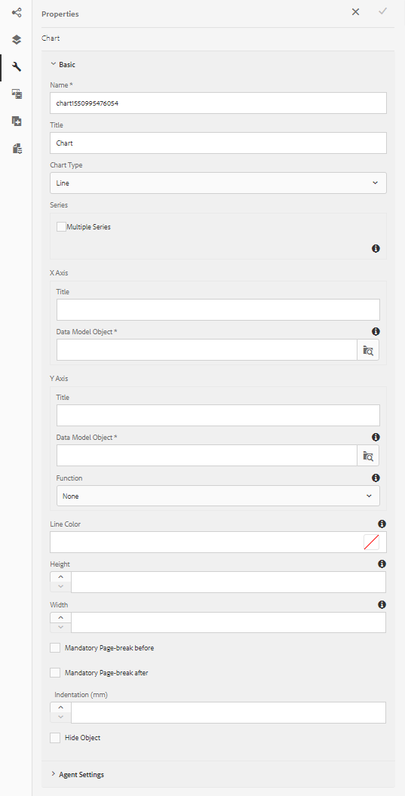
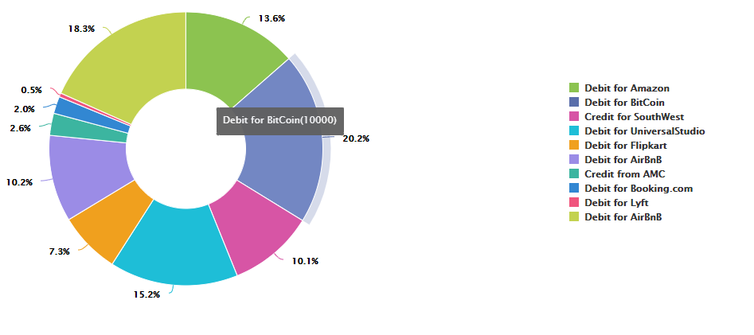

# Utilizzo dei grafici nelle comunicazioni interattive{#using-charts-in-interactive-communications}

Un grafico o un grafico è una rappresentazione visiva dei dati. Concentra grandi quantità di informazioni in un formato visivo di facile comprensione, consentendo ai destinatari della comunicazione interattiva di visualizzare, interpretare e analizzare meglio i dati complessi.

Durante la creazione di una comunicazione interattiva, è possibile aggiungere grafici per rappresentare visivamente i dati bidimensionali provenienti dal modello per dati modulo della comunicazione interattiva. Il componente Grafico consente di aggiungere e configurare i seguenti tipi di grafici: Torta, Colonna, Anello, Barra, Linea, Linea e Punto, Punto, Area e Quadrante.

## Aggiungere e configurare un grafico in una comunicazione interattiva {#add-and-configure-chart-in-an-interactive-communication}

Per aggiungere e configurare un grafico in una comunicazione interattiva, effettua le seguenti operazioni:

1. Tocca **Componenti** dalla barra laterale della comunicazione interattiva.
1. Trascina la **Grafico** a uno dei seguenti componenti:

   * Canale di stampa: area di destinazione o campo Immagine
   * Canale web: pannello o area di destinazione

1. Tocca il componente Grafico nell’editor di comunicazione interattiva e seleziona **[!UICONTROL Configura (]** ) dalla barra degli strumenti Componente.

   Le proprietà del grafico vengono visualizzate nel riquadro sinistro.

   

   Proprietà di base di un grafico a linee nel canale di stampa

   

   Proprietà di base di un grafico a linee nel canale web

1. Configurare [proprietà grafico](../../forms/using/chart-component-interactive-communications.md#configure-chart-properties) in base al tipo di canale.
1. (Solo canale di stampa) In **[!UICONTROL Impostazioni agente]**, specifica se l&#39;agente deve obbligatoriamente utilizzare questo grafico. Se i **[!UICONTROL È Obbligatorio Per L’Agente Utilizzare Questo Grafico]** non è selezionata, l’agente può toccare l’icona dell’occhio per il grafico nella **[!UICONTROL Contenuto]** nell’interfaccia utente dell’agente per mostrare o nascondere il grafico.

   

1. Tocca  per salvare le proprietà del grafico.

   Tocca **[!UICONTROL Anteprima]** per visualizzare l&#39;aspetto e i dati associati al grafico. Tocca **[!UICONTROL Modifica]** per riconfigurare le proprietà del grafico.

## Configurare le proprietà del grafico {#configure-chart-properties}

Configura le seguenti proprietà durante la creazione di grafici per i canali di stampa e web:

<table>
 <tbody>
  <tr>
   <td>Campo</td>
   <td>Descrizione</td>
   <td>Tipo canale</td>
  </tr>
  <tr>
   <td>Nome</td>
   <td>Identificatore dell'elemento del grafico. Il nome del grafico specificato in questo campo non è visibile nel grafico. Viene utilizzato quando si fa riferimento all’elemento da altri componenti, script ed espressioni SOM.</td>
   <td>Stampa e Web</td>
  </tr>
  <tr>
   <td>Tipo di grafico</td>
   <td>Tipo di grafico che si desidera generare. Le opzioni disponibili sono Torta, Colonna, Anello, Barra, Linea, Linea e Punto, Punto e Area.</td>
   <td>Stampa e Web</td>
  </tr>
  <tr>
   <td>Serie &gt; Serie multiple</td>
   <td>Selezionare questa opzione per aggiungere più serie per gli elementi della raccolta del modello dati del modulo tracciati sull'asse X e sull'asse Y.</td>
   <td>Stampa e Web</td>
  </tr>
  <tr>
   <td>Series &gt; Oggetto modello dati</td>
   <td>Nome dell'elemento di raccolta del modello dati del modulo per aggiungere più serie al grafico.<br /> Scegliere una proprietà dell'oggetto modello dati del modulo padre per le proprietà tracciate sull'asse X e sull'asse Y per creare una serie significativa. L’oggetto modello dati associato deve essere di tipo Numerico, Stringa o Data.</td>
   <td>Stampa e Web</td>
  </tr>
  <tr>
   <td>Mostra impilati</td>
   <td>Scegli di impilare i valori di ciascuna serie uno sopra l'altro.</td>
   <td>Stampa e Web</td>
  </tr>
  <tr>
   <td>Asse X &gt; Titolo</td>
   <td>Titolo per l'asse X.</td>
   <td>Stampa e Web</td>
  </tr>
  <tr>
   <td>Asse X &gt; Oggetto modello dati</td>
   <td><p>Nome dell'elemento di raccolta del modello dati del modulo da tracciare sull'asse X.</p> <p>Scegliete due proprietà di tipo insieme/array dello stesso oggetto modello dati padre che sono significative in relazione tra loro per tracciare sull'asse X e Y di un grafico. L’oggetto modello dati associato deve essere di tipo Numerico, Stringa o Data.</p> </td>
   <td>Stampa e Web</td>
  </tr>
  <tr>
   <td>Asse Y &gt; Titolo</td>
   <td>Titolo per l'asse Y. </td>
   <td>Stampa e Web</td>
  </tr>
  <tr>
   <td>Asse Y &gt; Oggetto modello dati</td>
   <td><p>Elemento di raccolta modello dati modulo da tracciare sull’asse Y. Nel canale di stampa, l’oggetto modello dati per l’asse Y deve essere di tipo Numerico.</p> <p>Scegliete due proprietà di tipo insieme/array dello stesso oggetto modello dati padre che sono significative in relazione tra loro per tracciare sull'asse X e Y di un grafico. </p> </td>
   <td>Stampa e Web</td>
  </tr>
  <tr>
   <td>Asse Y &gt; Funzione</td>
   <td>Funzione statistica/personalizzata da utilizzare per calcolare i valori sull’asse y.</td>
   <td>Stampa e Web</td>
  </tr>
  <tr>
   <td>Nascondi oggetto</td>
   <td>Selezionare questa opzione per nascondere il grafico nell'output finale.</td>
   <td>Stampa e Web</td>
  </tr>
  <tr>
   <td>Titolo</td>
   <td>Titolo del grafico. </td>
   <td>Stampa</td>
  </tr>
  <tr>
   <td>Altezza</td>
   <td>Altezza del grafico in pixel.</td>
   <td>Stampa</td>
  </tr>
  <tr>
   <td>Larghezza</td>
   <td>Larghezza del grafico in pixel. Potete controllare la larghezza del grafico nel canale web utilizzando il livello di stile o applicando un tema.</td>
   <td>Stampa</td>
  </tr>
  <tr>
   <td>Interruzione di pagina obbligatoria prima</td>
   <td>Selezionare questa opzione per aggiungere un'interruzione di pagina obbligatoria prima del grafico e posizionare il grafico all'inizio di una nuova pagina. </td>
   <td>Stampa</td>
  </tr>
  <tr>
   <td>Interruzione di pagina obbligatoria dopo</td>
   <td>Selezionare questa opzione per aggiungere un'interruzione di pagina obbligatoria dopo il grafico e inserire il contenuto che segue il grafico nella parte superiore di una nuova pagina. </td>
   <td>Stampa</td>
  </tr>
  <tr>
   <td>Rientro</td>
   <td>Rientro del grafico a sinistra della pagina. </td>
   <td>Stampa</td>
  </tr>
  <tr>
   <td>Suggerimento</td>
   <td><p>Formato in cui la descrizione viene visualizzata al passaggio del mouse su un punto dati nel grafico nel canale web. Il valore predefinito è ${x}(${y}). A seconda del tipo di grafico, quando si posiziona il mouse su un punto, una barra o una sezione del grafico, le variabili ${x}e ${y} vengono sostituiti in modo dinamico con i valori corrispondenti sull'asse X e sull'asse Y e visualizzati nella descrizione comando.</p> <p>Per disattivare la descrizione comando, lasciare <span class="uicontrol">Descrizione</code> campo vuoto. Questa opzione non è applicabile ai grafici a linee e a superficie. Ad esempio, consulta <a href="#chartoutputprintweb">Esempio 1: output del grafico in stampa e sul Web</a>.</p> </td>
   <td>Web</td>
  </tr>
  <tr>
   <td>Configurazioni specifiche per il grafico</td>
   <td><p>Oltre alle configurazioni comuni, sono disponibili le seguenti configurazioni specifiche per i grafici:</p>
    <ul>
     <li><strong>Mostra legenda: </strong>Se selezionata, mostra una legenda per il grafico a torta o ad anello.</li>
     <li><strong>Posizione legenda: </strong>Specifica la posizione della legenda rispetto al grafico. Le opzioni disponibili sono Right, Left, Top e Bottom. Utilizza la legenda a destra nel canale di stampa.</li>
     <li><strong>Raggio interno</strong>: disponibile per i grafici ad anello per specificare il raggio (in pixel) del cerchio interno del grafico.</li>
     <li><strong>Colore linea</strong>: disponibile per i grafici a linee, a linee, a punti e ad area per specificare il colore della linea nel grafico.</li>
     <li><strong>Colore punto</strong>: disponibile per i grafici Punto e Linea e Punto per specificare il colore dei punti nel grafico.<br /> </li>
     <li><strong>Colore area</strong>: disponibile per i grafici a superficie per specificare il colore dell'area sotto la linea del grafico.</li>
     <li><strong>Punto di riferimento &gt; Tipo di associazione: </strong>Disponibile per grafici a quadrante per<strong> </strong>specificare il tipo di associazione per il punto di riferimento. Utilizzare la proprietà dell'oggetto modello dati o testo statico per definire il valore per il punto di riferimento.</li>
     <li><strong>Punto di riferimento &gt; Asse X: </strong>Disponibile per i grafici a quadrante se si seleziona <span class="uicontrol">Statico</code> dall'elenco a discesa Tipo di associazione per specificare il valore dell'asse X per il punto di riferimento.</li>
     <li><strong>Punto di riferimento &gt; Asse Y: </strong>Disponibile per i grafici a quadrante se si seleziona <span class="uicontrol">Statico</code> dall'elenco a discesa Tipo di associazione per specificare il valore dell'asse Y per il punto di riferimento.</li>
     <li><strong>Punto di riferimento &gt; Oggetto modello dati per serie: </strong>Disponibile per grafici a quadrante a serie multiple se si seleziona <span class="uicontrol">Oggetto modello dati</code> dall'elenco a discesa Tipo di associazione. Definisci le proprietà oggetto modello dati del modulo per identificare la serie per il punto di riferimento. </li>
     <li><strong>Punto di riferimento &gt; Valore oggetto modello dati per serie: </strong>Disponibile per grafici a quadrante a serie multiple se si seleziona <span class="uicontrol">Oggetto modello dati</code> dall'elenco a discesa Tipo di associazione. Utilizzare la proprietà object del modello dati del modulo per la serie e il valore definito in questo campo per identificare la serie per il punto di riferimento.</li>
     <li><strong>Punto di riferimento &gt; Oggetto modello dati per punto di riferimento: </strong>Disponibile per i grafici a quadrante se si seleziona <span class="uicontrol">Oggetto modello dati</code> dall'elenco a discesa Tipo di associazione. Definisci una proprietà dell’oggetto modello dati del modulo di pari livello rispetto alle proprietà tracciate sull’asse X e sull’asse Y. Inoltre, per le serie multiple, definire una proprietà oggetto modello dati che sia un'entità figlio della proprietà oggetto modello dati definita per la serie.</li>
     <li><strong>Punto di riferimento &gt; Valore oggetto modello dati per punto di riferimento: </strong>Disponibile per i grafici a quadrante se si seleziona <span class="uicontrol">Oggetto modello dati</code> dall'elenco a discesa Tipo di associazione. Utilizzare la proprietà dell'oggetto modello dati del modulo per il punto di riferimento e il valore definito in questo campo per identificare il punto di riferimento per il grafico.<br /> <strong>Etichette quadrante &gt; In alto a sinistra:</strong> Disponibile per i grafici a quadrante per specificare il nome del quadrante superiore sinistro.</li>
     <li><strong>Etichette quadrante &gt; In alto a destra:</strong> Disponibile per i grafici a quadrante per specificare il nome del quadrante superiore destro.</li>
     <li><strong>Etichette quadrante &gt; In basso a destra: </strong>Disponibile per i grafici a quadrante per specificare il nome del quadrante inferiore destro.</li>
     <li><strong>Etichette quadrante &gt; In basso a sinistra: </strong>Disponibile per i grafici a quadrante per specificare il nome del quadrante inferiore sinistro.</li>
    </ul> </td>
   <td>Stampa e Web</td>
  </tr>
 </tbody>
</table>

## Utilizzare le funzioni nel grafico {#use-functions-in-chart}

È possibile configurare un grafico in modo da utilizzare le funzioni statistiche per calcolare i valori dai dati di origine per il plottaggio sul grafico. Applicando le funzioni in un grafico, è possibile tracciare i dati che non vengono forniti direttamente dal modello dati del modulo.


Il componente Grafico include alcune funzioni incorporate, ma puoi scrivere [funzioni personalizzate](#customfunctionsweb) e renderle disponibili per l’utilizzo nella configurazione del grafico nel canale web.

Per impostazione predefinita, con il componente Grafico sono disponibili le seguenti funzioni:

**Media (media)** Restituisce la media dei valori sull&#39;asse X o Y per un determinato valore sull&#39;altro asse.

**Somma** Restituisce la somma di tutti i valori sull&#39;asse X o Y per un determinato valore sull&#39;altro asse.

**Massimo** Restituisce il massimo dei valori sull&#39;asse X o Y per un determinato valore sull&#39;altro asse.

**Frequenza** Restituisce il numero di valori sull&#39;asse X o Y per un determinato valore sull&#39;altro asse.

**Intervallo** Restituisce la differenza tra il valore massimo e il valore minimo sull&#39;asse X o Y per un determinato valore sull&#39;altro asse.

**Mediana** Restituisce il valore che separa i valori più alti e più bassi a metà sull&#39;asse X o Y per un determinato valore sull&#39;altro asse.

**Minimo** Restituisce il minimo dei valori sull&#39;asse X o Y per un determinato valore sull&#39;altro asse.

**Modalità** Restituisce il valore con la maggior parte delle occorrenze sull&#39;asse X o Y per un determinato valore sull&#39;altro asse.

Per ulteriori informazioni, consulta [Esempio 2: applicazione delle funzioni Somma e Frequenza in un grafico a linee](#applicationsumfrequency).

### Funzioni personalizzate nel canale web {#customfunctionsweb}

Oltre a utilizzare le funzioni predefinite nei grafici, è possibile scrivere funzioni personalizzate in JavaScript™ e renderle disponibili nell’elenco delle funzioni nel componente Grafico per il canale web.

Una funzione accetta una matrice o più valori e un nome di categoria come input e restituisce un valore. Ad esempio:

```javascript
Multiply(valueArray, category) {
 var val = 1;
 _.each(valueArray, function(value) {
 val = val * value;
 });
 return val;
}
```

Dopo aver scritto una funzione personalizzata, eseguire le operazioni seguenti per renderla disponibile per l&#39;utilizzo nella configurazione del grafico:

1. Aggiungi la funzione personalizzata nella libreria client associata alla comunicazione interattiva pertinente. Per ulteriori informazioni, consulta [Configurazione dell’azione Invia](/help/forms/using/configuring-submit-actions.md) e [Utilizzo delle librerie lato client](/help/sites-developing/clientlibs.md).

1. Per visualizzare la funzione personalizzata nel menu a discesa Funzione, in CRXDe Lite, crea un’ `nt:unstructured` nella cartella apps con le seguenti proprietà:

   * Aggiungi proprietà `guideComponentType` con valore come `fd/af/reducer`. (obbligatorio)

   * Aggiungi proprietà `value` a un nome completo della funzione JavaScript™ personalizzata. (obbligatorio) e impostarne il valore sul nome della funzione personalizzata, ad esempio Moltiplica.
   * Aggiungi proprietà `jcr:description` con il valore che si desidera visualizzare come nome della funzione personalizzata visualizzata nel menu a discesa Funzione. Ad esempio: **Moltiplica**.

   * Aggiungi proprietà `qtip` con un valore che sarà una breve descrizione della funzione personalizzata. Viene visualizzato come descrizione comando quando si passa il puntatore sul nome della funzione nel **Funzione** elenco a discesa.

1. Clic **Salva tutto** per salvare la configurazione.

La funzione è ora disponibile per l’utilizzo nel grafico.

## Esempio 1: output del grafico in stampa e sul Web {#chartoutputprintweb}

Nella scheda Base è possibile definire il tipo di grafico, le proprietà del modello dati del modulo di origine che contengono dati, le etichette da tracciare sull&#39;asse X e sull&#39;asse Y del grafico e, facoltativamente, la funzione statistica per calcolare i valori da tracciare sul grafico.

Comprendiamo in dettaglio le informazioni minime richieste nelle proprietà di base, con l’aiuto di un estratto conto generato utilizzando una comunicazione interattiva. Si supponga di voler generare un grafico per rappresentare l&#39;importo delle spese diverse nel rendiconto. Desideri utilizzare diversi tipi di grafici per la stampa e l’output web della comunicazione interattiva.

### Grafico a colonne per la stampa {#columnchartprint}

A questo scopo, specifica le seguenti proprietà:

* **[!UICONTROL Nome]** - Specificare il nome del grafico.
* **[!UICONTROL Tipo di grafico]** - Seleziona **Colonna** dall’elenco a discesa.
* **[!UICONTROL Titolo]** - Specificare il tipo di spesa per l&#39;asse X e l&#39;importo della transazione per l&#39;asse Y.
* **[!UICONTROL Oggetti modello dati]** : seleziona le proprietà dell’oggetto modello dati per creare associazioni di dati per l’asse X (tipo di spesa) e l’asse Y (importo transazione).


Istogramma nel canale di stampa di una comunicazione interattiva

### Grafico ad anello per il web {#donutchartweb}

A questo scopo, specifica le seguenti proprietà:

* **[!UICONTROL Nome]** - Specificare il nome del grafico.
* **[!UICONTROL Tipo di grafico]** - Seleziona **[!UICONTROL Anello]** dall’elenco a discesa.
* **[!UICONTROL Oggetti modello dati]** : seleziona le proprietà dell’oggetto modello dati per creare associazioni di dati per l’asse X (tipo di spesa) e l’asse Y (importo transazione).
* **[!UICONTROL Raggio interno]** - Specificate il valore Raggio interno (Inner Radius) come 150 per specificare il raggio (in pixel) del cerchio interno del grafico.
* **[!UICONTROL Descrizione]** - Utilizza il ${x}(${y}) per visualizzare la descrizione comando. La descrizione comando viene visualizzata come: Tipo di spesa (Importo transazione). Esempio: debito per Bitcoin(10000).



Grafico ad anello nel canale web di una comunicazione interattiva

## Esempio 2: applicazione delle funzioni Somma e Frequenza in un grafico a linee {#applicationsumfrequency}

Applicando le funzioni in un grafico, è possibile tracciare i dati che non vengono forniti direttamente dal modello dati del modulo. In questo esempio, utilizziamo un esempio di estratto conto della carta di credito per capire come le funzioni Somma e Frequenza possono essere applicate al grafico.


Grafico a linee senza funzione con due transazioni &quot;Debito per AirBnB&quot;

### Funzione Somma {#sum-function}

Puoi applicare la funzione sum per sommare i valori di più istanze della stessa proprietà dati e mostrarla una sola volta. Ad esempio, nel grafico seguente, la funzione Somma viene applicata sull&#39;asse Y per sommare l&#39;importo dei due debiti per le transazioni AirBnB (2050 e 1050) e visualizzare una sola transazione (3100).

La funzione Somma può rendere il grafico più utile quando si desidera fascicolare e visualizzare la somma per molte istanze della stessa proprietà di dati.


### Funzione di frequenza {#frequency-function}

La funzione Frequenza restituisce il numero di valori dell&#39;asse Y per un determinato valore sull&#39;altro asse. Con l&#39;applicazione della funzione Frequenza sull&#39;asse Y (Importo transazione), il grafico mostra che ci sono state due occorrenze di debito per le transazioni AirBnB e una occorrenza di resto dei tipi di transazioni.


## Esempio 3: grafico a quadranti a più serie nel web {#example-multi-series-quadrant-chart-in-web}

Il grafico rappresenta l’importo delle transazioni eseguite in un determinato intervallo di date. Il grafico a quadrante consente di dividere l&#39;area del grafico in quattro sezioni etichettate. Il carattere utilizza un punto di riferimento statico per l&#39;asse X e l&#39;asse Y. Utilizzare la funzione a serie multiple per separare i dati in base al nome della banca.

A questo scopo, specifica le seguenti proprietà:

* **Nome:** Specificare il nome del grafico.
* **Tipo di grafico:** Seleziona **Quadrante** dall’elenco a discesa.

* Seleziona la **Serie multiple** casella di controllo.
* **Oggetto modello dati**: specifica la proprietà oggetto modello dati per la serie. La proprietà dell’oggetto modello dati per il nome della banca è un elemento padre delle proprietà dell’oggetto modello dati tracciate sull’asse X e sull’asse Y.
* **Oggetti modello dati:** Selezionare le proprietà dell&#39;oggetto modello dati per creare associazioni dati per l&#39;asse X (Data transazione) e l&#39;asse Y (Importo transazione).
* In **Punto di riferimento** sezione, seleziona **Statico** come Tipo di binding.

* Specificate i valori per i punti di riferimento dell&#39;asse X e dell&#39;asse Y.
* Specificate le etichette dei quadranti Superiore sinistro, Superiore destro, Inferiore destro e Inferiore sinistro.
* Seleziona la **Mostra legende** per visualizzare i codici colore per i nomi delle banche.


