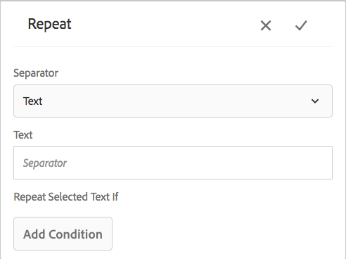

# Condizione in linea e ripetizione in comunicazioni interattive e lettere{#inline-condition-and-repeat-in-interactive-communications-and-letters}

## Condizioni in linea {#inline-conditions}

AEM Forms consente di utilizzare le condizioni in linea nei moduli di testo per automatizzare il rendering del testo che dipende dal contesto o dai dati associati al modello di dati del modulo (in Comunicazione interattiva) o al dizionario dati (in lettere). La condizione in linea visualizza contenuto specifico in base alla valutazione della condizione che sia true o false.

Le condizioni eseguono calcoli sui valori dati forniti dal modello dati/dizionario dati del modulo o dagli utenti finali. Utilizzando le condizioni in linea, è possibile risparmiare tempo e ridurre gli errori umani, creando al contempo comunicazioni interattive altamente contestuali e personalizzate.

Per ulteriori informazioni, vedere:

* [Creare una comunicazione interattiva](../../forms/using/create-interactive-communication.md)
* [Panoramica sulla gestione della corrispondenza](/help/forms/using/cm-overview.md)
* [Testo nelle comunicazioni interattive](../../forms/using/texts-interactive-communications.md)

### Esempio: Uso delle regole per condizionare il testo in linea nella comunicazione interattiva {#example-using-rules-to-conditionalize-inline-text-in-interactive-communication}

Per condizionare una frase, un paragrafo o una stringa di testo in una comunicazione interattiva, è possibile creare una regola nel frammento di documento di testo appropriato. Nell&#39;esempio seguente viene utilizzata una regola per visualizzare un numero verde solo per i destinatari statunitensi della comunicazione interattiva.

Per ulteriori informazioni, consulta Creare una regola nel testo in [Testi nelle comunicazioni interattive](../../forms/using/texts-interactive-communications.md).

Una volta incluso il frammento di testo in una comunicazione interattiva e l’agente utilizza l’interfaccia utente dell’agente per preparare una comunicazione interattiva, i dati (modello dati modulo) per i destinatari vengono valutati e il testo viene mostrato solo ai destinatari negli Stati Uniti.

### Esempio: Utilizzo di condizioni in linea in una lettera per eseguire il rendering dell’indirizzo appropriato  {#example-using-inline-condition-in-a-letter-to-render-the-appropriate-address}

È possibile inserire una condizione in linea in una lettera inserendo la condizione in linea nel modulo di testo appropriato. L&#39;esempio seguente utilizza due condizioni per valutare e visualizzare l&#39;indirizzo appropriato, Signore o Signora, in una lettera basata sull&#39;elemento DD Genere. Utilizzando passaggi simili, puoi creare altre condizioni.

>[!NOTE]
>
>Se le risorse esistenti includono vecchie espressioni di condizione/ripetizione (prima della versione 6.2 SP1 CFP 4), le risorse visualizzano la vecchia sintassi di condizione e ripetono. Tuttavia, la vecchia condizione/ripetizione funziona. Le espressioni nuove e vecchie condizione/ripetizione sono compatibili tra loro per creare un mix nidificato di espressioni vecchie e nuove condizioni/ripetizioni.

1. Nel modulo di testo pertinente, seleziona la parte di testo da condizionalizzare e tocca **Condizione**.

   

   Viene visualizzata la finestra di dialogo Condizione con una condizione vuota.

   

   >[!NOTE]
   >
   >Impossibile salvare un&#39;espressione condizionale vuota o non valida. All&#39;interno deve essere presente un&#39;espressione condizionale valida `${}` per salvare l’espressione.

1. Effettua le seguenti operazioni per creare una condizione per valutare se il testo selezionato/condizionalizzato viene visualizzato nella lettera, quindi tocca il segno di spunta per salvare l’espressione:

   Tocca due volte un elemento DD per inserirlo nella condizione . Inserisci l’operatore appropriato e crea la seguente condizione nella finestra di dialogo.

   ```javascript
   ${DD_creditcard_Gender=="Male"}
   ```

   Per ulteriori informazioni sulla creazione dell’espressione, consulta **Creazione di espressioni e funzioni remote con il generatore di espressioni** in [Generatore di espressioni](../../forms/using/expression-builder.md). Il valore specificato nell&#39;espressione deve essere supportato per l&#39;elemento nel dizionario dati. Per ulteriori informazioni, consulta [Dizionario dati](../../forms/using/data-dictionary.md).

   Una volta inserita la condizione, puoi passare il cursore del mouse sulla maniglia a sinistra della condizione per visualizzarla. Tocca la maniglia per visualizzare il menu a comparsa della condizione, che consente di modificare o rimuovere la condizione.

    

1. Inserisci una condizione simile selezionando il testo `Ma'am`.

   ```javascript
   ${DD_creditcard_Gender == "Female"}
   ```

1. Visualizzare in anteprima la lettera pertinente e notare che il testo viene riprodotto in base alla condizione in linea. Puoi immettere il valore dell’elemento DD Gender utilizzando:

   * File di dati XML di esempio creato in base al dizionario dati pertinente durante l&#39;anteprima della lettera con dati di esempio.
   * File di dati XML allegato al dizionario dati pertinente.

   Per ulteriori informazioni, consulta [Dizionario dati](../../forms/using/data-dictionary.md).

   

## Ripeti {#repeat}

È possibile che nella comunicazione/lettera interattiva siano presenti informazioni dinamiche, ad esempio transazioni in un estratto conto della carta di credito, la cui istanza o occorrenza può continuare a cambiare con ogni lettera generata. Utilizzando la funzione di ripetizione, è possibile formattare e strutturare tali informazioni dinamiche nel frammento di documento di testo.

Inoltre, è possibile specificare la regola/condizione all&#39;interno del costrutto di ripetizione per condizionalizzare le informazioni/le voci di cui viene eseguito il rendering nella comunicazione/lettera interattiva.

### Esempio: Utilizzo della ripetizione in una comunicazione interattiva per formattare, strutturare e visualizzare un elenco di transazioni con carta di credito {#example-using-repeat-in-an-interactive-communication-to-format-structure-and-display-a-list-of-credit-card-transactions}

L&#39;esempio seguente illustra i passaggi necessari per utilizzare la funzione di ripetizione per strutturare ed eseguire il rendering delle transazioni con carta di credito in una comunicazione interattiva.

1. In un frammento di documento di testo basato su un modello di dati modulo, inserire gli oggetti del modello dati del modulo pertinenti (e il testo incorporato richiesto per le etichette, come in questo esempio):

   

   >[!NOTE]
   >
   >Il contenuto ripetibile deve includere almeno una proprietà del tipo Collection.

1. Selezionare il contenuto al quale applicare la ripetizione.

   

1. Toccare Ripeti.

   Viene visualizzata la finestra di dialogo Ripeti.

   

1. Seleziona Interruzione riga come separatore e, se necessario, tocca Aggiungi condizione per creare una regola. È inoltre possibile utilizzare il testo come separatore e specificare i caratteri di testo da utilizzare come separatore.

   Viene visualizzata la finestra di dialogo Crea regola.

1. Crea una regola per visualizzare le transazioni con data successiva al 28 febbraio 2018 per includere le transazioni solo per il mese di marzo nella comunicazione interattiva.

   >[!NOTE]
   >
   >In questo esempio si presuppone che l’agente creerà l’istruzione alla fine di marzo 2018. In caso contrario, puoi creare un’altra regola per includere le transazioni prima del 2018-04-01 per escludere le transazioni dopo marzo 2018.

   

1. Salvare la condizione/regola e quindi salvare la ripetizione. Al contenuto selezionato viene applicata la ripetizione condizionale.

   

   Al passaggio del mouse, il frammento del documento di testo visualizza la condizione e il separatore utilizzati nella ripetizione applicata al contenuto.

1. Salvare il frammento del documento di testo e visualizzare in anteprima la comunicazione interattiva pertinente. A seconda dei dati nel modello dati del modulo, la ripetizione applicata agli elementi esegue il rendering dei dettagli della transazione in modo simile a quanto segue nell’anteprima:

   

### Esempio: Utilizzo della ripetizione in una lettera per formattare, strutturare e visualizzare un elenco di transazioni con carta di credito {#example-using-repeat-in-a-letter-to-format-structure-and-display-a-list-of-credit-card-transactions}

L&#39;esempio seguente fornisce i passaggi per utilizzare la funzione di ripetizione per strutturare ed eseguire il rendering delle transazioni con carta di credito in una lettera. Utilizzando passaggi simili, è possibile utilizzare la ripetizione in uno scenario diverso.

1. Apri (durante la modifica o la creazione) un modulo di testo con elementi DD che eseguono il rendering di dati ripetuti/dinamici e incorpora il testo richiesto intorno agli elementi DD. Ad esempio, un modulo di testo ha i seguenti elementi DD per creare un rendiconto delle transazioni su una carta di credito:

   ```javascript
   {^DD_creditcard_TransactionDate^} {^DD_creditcard_TransactionAmount^}
   {^DD_creditcard_TransactionType^}
   ```

   Questi elementi DD presentano un elenco delle transazioni effettuate sulla carta di credito con le seguenti informazioni:

   Data della transazione, importo della transazione e tipo di transazione (debito o credito)

1. Incorpora il testo all’interno degli elementi DD per rendere l’istruzione più leggibile, ad esempio:

   

   ```javascript
   Date: {^DD_creditcard_TransactionDate^} Amount (USD): {^DD_creditcard_TransactionAmount^} Transaction Type: {^DD_creditcard_TransactionType^}
   ```

   Il processo di rendering di un&#39;istruzione formattata correttamente, tuttavia, non è ancora stato eseguito. Se esegui il rendering di una lettera in base al lavoro svolto finora, viene visualizzata come segue:

   

   Per ripetere il testo statico insieme agli elementi DD, è necessario applicare la ripetizione come spiegato nei passaggi successivi.

1. Seleziona il testo statico e gli elementi DD da ripetere, come illustrato di seguito:

   

1. Tocca **Ripeti**. Viene visualizzata la finestra di dialogo Ripeti con una condizione in linea vuota.

   

1. Se necessario, inserire una condizione per rendere selettivamente le transazioni, ad esempio per rendere gli importi delle transazioni superiori a 50 centesimi:

   ```javascript
   ${DD_creditcard_TransactionAmount > 0.5}
   ```

   In caso contrario, se non devi eseguire il rendering selettivo delle informazioni (in questo caso le transazioni), mantieni la condizione vuota eliminando quanto segue nella finestra di dialogo: `${}`. Il salvataggio di un&#39;espressione di ripetizione viene attivato sia quando la finestra dell&#39;espressione di ripetizione è vuota (senza ${} quando non è necessaria alcuna ripetizione) sia quando contiene una condizione valida per la ripetizione.

1. Seleziona un separatore per la formattazione del testo dinamico e tocca il segno di spunta da salvare:

   * **Interruzione di riga**: Inserisce un&#39;interruzione di riga dopo ogni voce di transazione nella lettera di output.
   * **Testo**: Inserisce il carattere di testo specificato dopo ogni voce di transazione nella lettera di output.

   Una volta inserita la condizione, il testo con ripetizione viene evidenziato in rosso e sulla sua sinistra appare una maniglia. Per visualizzare il costrutto di ripetizione, posizionate il puntatore del mouse sulla maniglia a sinistra della ripetizione.

   

   Toccate la maniglia per visualizzare il menu a comparsa della ripetizione, che consente di modificare o rimuovere il costrutto di ripetizione.

   

1. Visualizzare in anteprima la lettera pertinente e notare che il testo viene riprodotto in base alla ripetizione. Puoi immettere il valore degli elementi DD utilizzando:

   * File di dati XML di esempio creato in base al dizionario dati pertinente durante l&#39;anteprima della lettera con dati di esempio.
   * File di dati XML allegato al dizionario dati pertinente.

   Per ulteriori informazioni, consulta [Dizionario dati](https://helpx.adobe.com/aem-forms/6-2/data-dictionary.html).

   

   Il testo statico si ripete con i dettagli della transazione. La ripetizione del testo statico è facilitata dalla ripetizione applicata al testo in questa procedura. La condizione, ${DD_creditcard_TransactionAmount > 0.5}, assicura che le transazioni inferiori a USD 0.5 non siano sottoposte a rendering nella lettera.

   >[!NOTE]
   >
   >È possibile inserire una condizione e ripetere solo durante la creazione o la modifica del modulo di testo pertinente. Durante l&#39;anteprima della lettera, anche se è possibile apportare modifiche al modulo di testo, non è possibile inserire condizione o ripetere.

## Utilizzo di condizioni in linea e ripetizione - alcuni casi d’uso  {#using-inline-condition-and-repeat-some-use-cases}

### Ripeti in condizioni {#repeat-within-condition}

Potrebbe essere necessario utilizzare la ripetizione all’interno di una condizione. Gestione della corrispondenza consente di utilizzare la ripetizione all’interno di un costrutto di condizione in linea.

Ad esempio, il seguente viene ripetuto (formattato in rosso) all’interno di una condizione (formattata in verde).

Mentre la ripetizione esegue il rendering delle transazioni della carta di credito, la condizione ${DD_creditcard_noofTransactions > 0} assicura che il costrutto di ripetizione venga eseguito solo in presenza di almeno una transazione.


Allo stesso modo, in base alle tue esigenze, puoi creare:

* Una o più condizioni in una condizione
* Una o più condizioni in una ripetizione
* Una combinazione di condizioni e ripetersi in una condizione o ripetere

### Condizione in linea vuota {#empty-inline-condition}

Potrebbe essere necessario inserire condizioni in linea vuote ed elementi di testo da incorporare e DD in un secondo momento. Gestione della corrispondenza consente di farlo.


Si consiglia tuttavia, se possibile, di inserire prima nel modulo di testo gli elementi di testo e DD con la formattazione prevista, ad esempio i punti elenco, e di applicare successivamente una condizione in linea.
