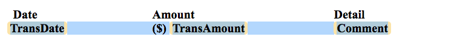
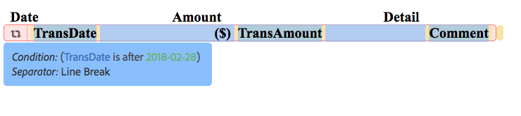
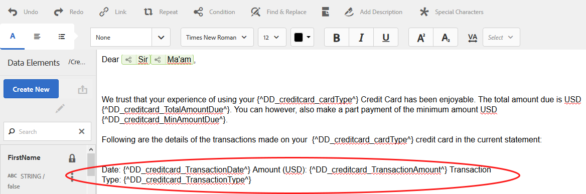

# Condizione in linea e ripetizione in Comunicazioni interattive e lettere{#inline-condition-and-repeat-in-interactive-communications-and-letters}

## Condizioni in linea {#inline-conditions}

 AEM Forms consente di utilizzare le condizioni in linea nei moduli di testo per automatizzare il rendering del testo che dipende dal contesto o dai dati associati al modello dati del modulo (in Comunicazione interattiva) o al dizionario dati (in lettere). La condizione in linea visualizza contenuto specifico in base alla valutazione della condizione che sia vera o falsa.

Le condizioni eseguono calcoli sui valori dei dati forniti dal modello dati/Dizionario dati del modulo o dagli utenti finali. Utilizzando le condizioni in linea, potete risparmiare tempo e ridurre gli errori umani, creando al contempo lettere e comunicazioni interattive altamente contestuali e personalizzate.

Per ulteriori informazioni, vedere:

* [Creazione di una comunicazione interattiva](../../forms/using/create-interactive-communication.md)
* [Panoramica sulla gestione della corrispondenza](/help/forms/using/cm-overview.md)
* [Testo nelle comunicazioni interattive](../../forms/using/texts-interactive-communications.md)

### Esempio: Utilizzo di regole per condizionale del testo in linea nella comunicazione interattiva {#example-using-rules-to-conditionalize-inline-text-in-interactive-communication}

Per condizionalizzare una frase, un paragrafo o una stringa di testo in una comunicazione interattiva, è possibile creare una regola nel frammento di documento di testo appropriato. Nell&#39;esempio seguente viene utilizzata una regola per visualizzare un numero verde solo per i destinatari statunitensi della comunicazione interattiva.

Per ulteriori informazioni, consultate Creare una regola nel testo nei [testi nelle comunicazioni](../../forms/using/texts-interactive-communications.md)interattive.

Dopo aver incluso il frammento di testo in una comunicazione interattiva e l&#39;agente utilizza l&#39;interfaccia utente agente per preparare una comunicazione interattiva, i dati (modello dati modulo) per i destinatari vengono valutati e il testo viene mostrato solo ai destinatari negli Stati Uniti.

### Esempio: Utilizzo di condizioni in linea in una lettera per rappresentare l&#39;indirizzo appropriato  {#example-using-inline-condition-in-a-letter-to-render-the-appropriate-address}

È possibile inserire una condizione in linea in una lettera inserendo la condizione in linea nel modulo di testo appropriato. L&#39;esempio seguente utilizza due condizioni per valutare e visualizzare l&#39;indirizzo appropriato, Signore o Signora, in una lettera basata sull&#39;elemento DD Genere. Con passaggi simili, potete creare altre condizioni.

>[!NOTE]
>
>Se le risorse esistenti includono espressioni di condizione/ripetizione precedenti alla 6.2 SP1 CFP 4, le risorse visualizzeranno una vecchia sintassi di condizione e si ripeteranno. Tuttavia, la vecchia condizione/ripetizione funziona. Le espressioni nuove e vecchie di condizione/ripetizione sono compatibili tra loro per creare un mix nidificato di espressioni vecchie e nuove di condizione/ripetizione.

1. Nel modulo di testo pertinente, selezionate la parte di testo da condizionare e toccate **Condizione**.

   

   La finestra di dialogo Condizione viene visualizzata con una condizione vuota.

   

   >[!NOTE]
   >
   >Impossibile salvare un&#39;espressione condizionale vuota o non valida. Per salvare l&#39;espressione, è necessario disporre di un&#39;espressione condizionale valida all&#39;interno `${}` .

1. Effettuate le seguenti operazioni per creare una condizione per valutare se il testo selezionato/condizionalizzato sia visualizzato nella lettera, quindi toccate il segno di spunta per salvare l&#39;espressione:

   Toccate due volte un elemento DD per inserirlo nella condizione. Inserire l&#39;operatore appropriato e creare la seguente condizione nella finestra di dialogo.

   ```javascript
   ${DD_creditcard_Gender=="Male"}
   ```

   Per ulteriori informazioni sulla creazione dell&#39;espressione, vedere **Creazione di espressioni e funzioni remote con il generatore** di espressioni in [Generatore](../../forms/using/expression-builder.md)di espressioni. Il valore specificato nell&#39;espressione deve essere supportato per l&#39;elemento nel dizionario dati. Per ulteriori informazioni, vedere [Dizionario](../../forms/using/data-dictionary.md)dati.

   Una volta inserita la condizione, è possibile passare il mouse sulla maniglia a sinistra della condizione per visualizzare la condizione. Toccate la maniglia per visualizzare il menu a comparsa della condizione, che consente di modificare o rimuovere la condizione.

    

1. Per inserire una condizione simile, selezionate il testo `Ma'am`.

   ```javascript
   ${DD_creditcard_Gender == "Female"}
   ```

1. Visualizzate l&#39;anteprima della lettera e notate che il testo viene rappresentato in base alla condizione in linea. Puoi inserire il valore dell&#39;elemento DD Genere utilizzando:

   * Un file di dati XML di esempio creato in base al dizionario dati pertinente durante la visualizzazione in anteprima della lettera con dati di esempio.
   * Un file di dati XML allegato al dizionario dati pertinente.

   Per ulteriori informazioni, vedere [Dizionario](../../forms/using/data-dictionary.md)dati.

   

## Ripeti {#repeat}

È possibile che l&#39;utente disponga di informazioni dinamiche nella comunicazione/lettera interattiva, come le transazioni in un rendiconto della carta di credito, la cui istanza o occorrenza può continuare a cambiare con ogni lettera generata. La ripetizione consente di formattare e strutturare tali informazioni dinamiche nel frammento di documento di testo.

Inoltre, è possibile specificare regola/condizione all&#39;interno del costrutto di ripetizione per condizionalizzare le informazioni/voci di cui viene eseguito il rendering nella comunicazione interattiva/lettera.

### Esempio: Utilizzo della ripetizione in una comunicazione interattiva per formattare, strutturare e visualizzare un elenco delle transazioni con carta di credito {#example-using-repeat-in-an-interactive-communication-to-format-structure-and-display-a-list-of-credit-card-transactions}

L&#39;esempio seguente illustra i passaggi per utilizzare la ripetizione per strutturare ed eseguire il rendering delle transazioni con carta di credito in una comunicazione interattiva.

1. In un frammento di documento di testo basato su modello di dati modulo, inserire gli oggetti del modello di dati del modulo pertinenti (e il testo incorporato richiesto per le etichette, come in questo esempio):

   

   >[!NOTE]
   >
   >Il contenuto ripetibile deve includere almeno una proprietà del tipo Collection.

1. Selezionare il contenuto sul quale applicare la ripetizione.

   

1. Toccate Ripeti.

   Viene visualizzata la finestra di dialogo Ripeti.

   

1. Selezionare Interruzione di riga come separatore e, se necessario, toccare Aggiungi condizione per creare una regola. È inoltre possibile utilizzare il testo come separatore e specificare i caratteri di testo da utilizzare come separatore.

   Viene visualizzata la finestra di dialogo Crea regola.

1. Crea una regola per visualizzare le transazioni con data successiva al 28 febbraio 2018 per includere le transazioni solo per il mese di marzo nella comunicazione interattiva.

   >[!NOTE]
   >
   >Nell&#39;esempio si presuppone che l&#39;agente creerà l&#39;istruzione alla fine di marzo 2018. In caso contrario, è possibile creare un&#39;altra regola per includere le transazioni prima del 2018-04-01 per escludere le transazioni dopo marzo 2018.

   

1. Salvare la condizione/regola, quindi salvare la ripetizione. Al contenuto selezionato viene applicata la ripetizione condizionale.

   

   Quando si passa il mouse sul frammento del documento di testo, vengono visualizzati la condizione e il separatore utilizzati per la ripetizione applicata al contenuto.

1. Salvare il frammento del documento di testo e visualizzare in anteprima la comunicazione interattiva pertinente. A seconda dei dati nel modello dati del modulo, la ripetizione applicata agli elementi rende i dettagli della transazione simili a quelli riportati di seguito nell&#39;anteprima:

   

### Esempio: Utilizzo della ripetizione in una lettera per formattare, strutturare e visualizzare un elenco delle transazioni con carta di credito {#example-using-repeat-in-a-letter-to-format-structure-and-display-a-list-of-credit-card-transactions}

L&#39;esempio seguente illustra i passaggi per utilizzare la ripetizione per strutturare ed eseguire il rendering delle transazioni con carta di credito in una lettera. Con passaggi simili, è possibile utilizzare la ripetizione in uno scenario diverso.

1. Aprite (durante la modifica o la creazione) un modulo di testo con elementi DD che eseguono il rendering di dati ripetuti/dinamici e incorporano il testo richiesto intorno agli elementi DD. Ad esempio, un modulo di testo ha i seguenti elementi DD per creare un rendiconto delle transazioni su una carta di credito:

   ```javascript
   {^DD_creditcard_TransactionDate^} {^DD_creditcard_TransactionAmount^}
   {^DD_creditcard_TransactionType^}
   ```

   Questi elementi DD forniscono un elenco delle transazioni effettuate sulla carta di credito con le seguenti informazioni:

   Data transazione, importo transazione e tipo di transazione (debito o credito)

1. Incorporare il testo all&#39;interno degli elementi DD per rendere l&#39;istruzione più leggibile, ad esempio:

   

   ```javascript
   Date: {^DD_creditcard_TransactionDate^} Amount (USD): {^DD_creditcard_TransactionAmount^} Transaction Type: {^DD_creditcard_TransactionType^}
   ```

   Il processo di rendering di un&#39;istruzione in formato corretto, tuttavia, non è ancora stato eseguito. Se esegui il rendering di una lettera in base al lavoro svolto finora, viene visualizzata come segue:

   

   Per ripetere il testo statico insieme agli elementi DD, è necessario applicare la ripetizione come spiegato nei passaggi successivi.

1. Selezionate il testo statico e gli elementi DD da ripetere, come illustrato di seguito:

   

1. Toccate **Ripeti**. Viene visualizzata la finestra di dialogo Ripeti con una condizione in linea vuota.

   

1. Se necessario, inserire una condizione per eseguire selettivamente il rendering delle transazioni, ad esempio per rendere gli importi delle transazioni superiori a 50 centesimi:

   ```javascript
   ${DD_creditcard_TransactionAmount > 0.5}
   ```

   In caso contrario, se non è necessario eseguire il rendering selettivo delle informazioni (qui transazioni), mantenere vuota la condizione eliminando quanto segue nella finestra di dialogo: `${}`. Il salvataggio di un&#39;espressione di ripetizione viene attivato quando la finestra dell&#39;espressione di ripetizione è vuota (senza ${} quando non è necessaria alcuna ripetizione) o quando contiene una condizione valida per la ripetizione.

1. Selezionate un separatore per formattare il testo dinamico e toccate il segno di spunta da salvare:

   * **Interruzione** riga: Inserisce un&#39;interruzione di riga dopo ogni voce di transazione nella lettera di output.
   * **Testo**: Inserisce il carattere di testo specificato dopo ogni voce di transazione nella lettera di output.

   Una volta inserita la condizione, il testo con ripetizione viene evidenziato in rosso e una maniglia viene visualizzata a sinistra. Per visualizzare il costrutto di ripetizione, posizionate il puntatore del mouse sulla maniglia a sinistra della ripetizione.

   

   Toccate la maniglia per visualizzare il menu a comparsa della ripetizione, che consente di modificare o rimuovere il costrutto di ripetizione.

   

1. Visualizzate l’anteprima della lettera e notate che il testo viene riprodotto in base alla ripetizione. È possibile inserire il valore degli elementi DD utilizzando:

   * Un file di dati XML di esempio creato in base al dizionario dati pertinente durante la visualizzazione in anteprima della lettera con dati di esempio.
   * Un file di dati XML allegato al dizionario dati pertinente.

   Per ulteriori informazioni, vedere [Dizionario](https://helpx.adobe.com/aem-forms/6-2/data-dictionary.html)dati.

   

   Il testo statico si ripete con i dettagli della transazione. Il testo statico ripetuto è facilitato dalla ripetizione applicata al testo in questa procedura. La condizione, ${DD_creditcard_TransactionAmount > 0.5}, assicura che il rendering delle transazioni sotto USD .5 non venga eseguito nella lettera.

   >[!NOTE]
   >
   >È possibile inserire una condizione e ripeterla solo durante la creazione o la modifica del modulo di testo pertinente. Durante l&#39;anteprima della lettera, anche se è possibile apportare modifiche al modulo di testo, non è possibile inserire condizioni o ripetere.

## Utilizzo di condizioni in linea e ripetizione - alcuni casi di utilizzo  {#using-inline-condition-and-repeat-some-use-cases}

### Ripeti in una condizione {#repeat-within-condition}

Potrebbe essere necessario utilizzare la ripetizione in una condizione. Gestione corrispondenza consente di utilizzare la ripetizione all&#39;interno di un costrutto di condizione in linea.

Ad esempio, quanto segue viene ripetuto (formattato in rosso) all&#39;interno di una condizione (formattato in verde).

Mentre la ripetizione esegue il rendering delle transazioni con carta di credito, la condizione ${DD_creditcard_nooftransaction > 0} garantisce che il costrutto di ripetizione venga rappresentato solo se è presente almeno una transazione.


Analogamente, in base alle vostre esigenze, potete creare:

* Una o più condizioni in una condizione
* Una o più condizioni in una ripetizione
* Una combinazione di condizioni e ripetersi in una condizione o ripetere

### Condizione in linea vuota {#empty-inline-condition}

Potrebbe essere necessario inserire condizioni in linea vuote e incorporare testo ed elementi DD in un secondo momento. Gestione della corrispondenza consente di farlo.


Tuttavia, si consiglia di inserire il testo e gli elementi DD prima nel modulo di testo con la formattazione prevista, come ad esempio gli elenchi puntati, e di applicare successivamente una condizione in linea.
