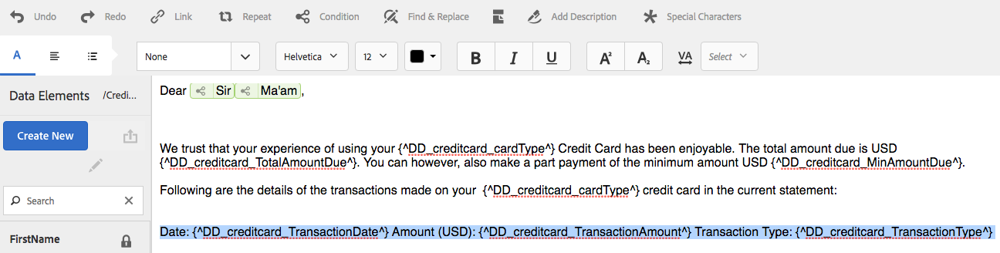

# Condizione in linea e ripetizione in lettere e comunicazioni interattive{#inline-condition-and-repeat-in-interactive-communications-and-letters}

## Condizioni in linea {#inline-conditions}

AEM Forms consente di utilizzare condizioni in linea nei moduli di testo per automatizzare il rendering del testo che dipende dal contesto o dai dati associati al modello di dati del modulo (nella comunicazione interattiva) o al dizionario dati (in lettere). In Condizione in linea viene visualizzato il contenuto specifico in base al fatto che la valutazione della condizione è true o false.

Le condizioni eseguono calcoli sui valori dei dati forniti dal modello dati/dizionario dati del modulo o dagli utenti finali. Utilizzando le condizioni in linea, puoi risparmiare tempo e ridurre gli errori umani, creando al contempo lettere e comunicazioni interattive altamente contestuali e personalizzate.

Per ulteriori informazioni, consulta:

* [Creare una comunicazione interattiva](../../forms/using/create-interactive-communication.md)
* [Panoramica sulla gestione della corrispondenza](/help/forms/using/cm-overview.md)
* [Testo nelle comunicazioni interattive](../../forms/using/texts-interactive-communications.md)

### Esempio: utilizzo di regole per condizionare il testo in linea nella comunicazione interattiva {#example-using-rules-to-conditionalize-inline-text-in-interactive-communication}

Per rendere condizionale una frase, un paragrafo o una stringa di testo in una comunicazione interattiva, puoi creare una regola nel frammento di documento di testo appropriato. Nell&#39;esempio seguente viene utilizzata una regola per visualizzare un numero verde solo per i destinatari statunitensi della comunicazione interattiva.

Per ulteriori informazioni, consulta Creare una regola nel testo in [Testi nelle comunicazioni interattive](../../forms/using/texts-interactive-communications.md).

Dopo aver incluso il frammento di testo in una comunicazione interattiva e aver utilizzato l’interfaccia utente dell’agente per preparare una comunicazione interattiva, vengono valutati i dati (modello dati modulo) per i destinatari e il testo viene visualizzato solo ai destinatari negli Stati Uniti.

### Esempio: utilizzo della condizione inline in una lettera per eseguire il rendering dell’indirizzo appropriato  {#example-using-inline-condition-in-a-letter-to-render-the-appropriate-address}

È possibile inserire una condizione in linea in una lettera inserendo la condizione in linea nel modulo di testo appropriato. Nell&#39;esempio seguente vengono utilizzate due condizioni per valutare e visualizzare l&#39;indirizzo appropriato, Sir o Signora, in una lettera basata sull&#39;elemento DD Genere. Utilizzando passaggi simili, puoi creare altre condizioni.

>[!NOTE]
>
>Se le risorse esistenti includono espressioni di condizione/ripetizione precedenti alla 6.2 SP1 CFP 4, queste presentano la vecchia sintassi di condizione e ripetizione. Tuttavia, la condizione precedente/ripetizione funziona. Le espressioni di condizione/ripetizione nuova e vecchia sono compatibili tra loro per creare una combinazione nidificata di espressioni di condizione/ripetizione vecchie e nuove.

1. Nel modulo di testo pertinente, seleziona la parte di testo da condizionalizzare e tocca **Condizione**.

   

   Viene visualizzata la finestra di dialogo Condizione con una condizione vuota.

   

   >[!NOTE]
   >
   >Impossibile salvare un&#39;espressione condizionale vuota o non valida. Deve essere presente un’espressione condizionale valida all’interno di `${}` per salvare l&#39;espressione.

1. Effettua le seguenti operazioni per creare una condizione per valutare se il testo selezionato/condizionato viene visualizzato nella lettera, quindi tocca il segno di spunta per salvare l’espressione:

   Tocca due volte un elemento DD per inserirlo nella condizione. Inserisci l’operatore appropriato e crea la seguente condizione nella finestra di dialogo.

   ```javascript
   ${DD_creditcard_Gender=="Male"}
   ```

   Per ulteriori informazioni sulla creazione dell&#39;espressione, vedere **Creazione di espressioni e funzioni remote con il generatore di espressioni** in [Generatore di espressioni](../../forms/using/expression-builder.md). Il valore specificato nell’espressione deve essere supportato per l’elemento nel dizionario dati. Per ulteriori informazioni, consulta [Dizionario dati](../../forms/using/data-dictionary.md).

   Una volta inserita la condizione, puoi passare il cursore sul quadratino di ridimensionamento a sinistra della condizione per visualizzarla. Tocca la maniglia per visualizzare il menu a comparsa della condizione, che consente di modificare o rimuovere la condizione.

    

1. Inserire una condizione simile selezionando il testo `Ma'am`.

   ```javascript
   ${DD_creditcard_Gender == "Female"}
   ```

1. Visualizza in anteprima la lettera pertinente e nota che il rendering del testo dipende dalla condizione in linea. Puoi immettere il valore dell’elemento DD Genere utilizzando:

   * Un file di dati XML di esempio creato in base al dizionario dati pertinente durante l’anteprima della lettera con dati di esempio.
   * File di dati XML associato al dizionario dati pertinente.

   Per ulteriori informazioni, consulta [Dizionario dati](../../forms/using/data-dictionary.md).

   

## Ripeti {#repeat}

È possibile che nella comunicazione/lettera interattiva siano presenti informazioni dinamiche, ad esempio le transazioni in un estratto conto relativo a una carta di credito, la cui istanza o occorrenza potrebbe cambiare con ogni lettera generata. Utilizzando la funzione di ripetizione, è possibile formattare e strutturare tali informazioni dinamiche nel frammento di documento di testo.

Inoltre, puoi specificare una regola o condizione all’interno del costrutto di ripetizione per condizionare le informazioni o le voci visualizzate nella comunicazione interattiva o nella lettera.

### Esempio: utilizzo della ripetizione in una comunicazione interattiva per formattare, strutturare e visualizzare un elenco di transazioni con carta di credito {#example-using-repeat-in-an-interactive-communication-to-format-structure-and-display-a-list-of-credit-card-transactions}

Nell&#39;esempio seguente vengono illustrati i passaggi per l&#39;utilizzo di repeat per strutturare ed eseguire il rendering delle transazioni con carta di credito in una comunicazione interattiva.

1. In un frammento di documento di testo basato su modello dati modulo, inserisci gli oggetti modello dati modulo pertinenti (e il testo incorporato necessario per le etichette, come in questo esempio):

   

   >[!NOTE]
   >
   >Il contenuto ripetibile deve includere almeno una proprietà del tipo Collection.

1. Seleziona il contenuto su cui applicare la ripetizione.

   

1. Tocca Ripeti.

   Viene visualizzata la finestra di dialogo Ripeti.

   

1. Seleziona Interruzione di riga come separatore e, se necessario, tocca Aggiungi condizione per creare una regola. È inoltre possibile utilizzare il testo come separatore e specificare i caratteri di testo da utilizzare come separatore.

   Viene visualizzata la finestra di dialogo Crea regola.

1. Crea una regola per visualizzare le transazioni con data successiva al 28 febbraio 2018 in modo da includere nella comunicazione interattiva solo le transazioni relative al mese di marzo.

   >[!NOTE]
   >
   >In questo esempio si presuppone che l’agente creerà l’istruzione alla fine di marzo 2018. In caso contrario, puoi creare un’altra regola per includere le transazioni precedenti al 01/04/2018 per escludere le transazioni successive a tale data.

   

1. Salva la condizione/regola, quindi salva la ripetizione. La ripetizione condizionale viene applicata al contenuto selezionato.

   

   Al passaggio del mouse, il frammento del documento di testo visualizza la Condizione e il separatore utilizzati nella ripetizione applicata al contenuto.

1. Salva il frammento del documento di testo e visualizza in anteprima la comunicazione interattiva pertinente. A seconda dei dati nel modello dati del modulo, la ripetizione applicata agli elementi riproduce i dettagli della transazione in modo simile a quelli riportati di seguito nell’anteprima:

   

### Esempio: utilizzo della ripetizione in una lettera per formattare, strutturare e visualizzare un elenco di transazioni con carta di credito {#example-using-repeat-in-a-letter-to-format-structure-and-display-a-list-of-credit-card-transactions}

Nell&#39;esempio seguente vengono illustrati i passaggi per l&#39;utilizzo di ripeti per strutturare ed eseguire il rendering delle transazioni con carta di credito in una lettera. Con passaggi simili, puoi utilizzare la funzione di ripetizione in uno scenario diverso.

1. Apri (durante la modifica o la creazione) un modulo di testo con elementi DD che eseguono il rendering di dati ripetuti/dinamici e incorporano il testo richiesto intorno agli elementi DD. Ad esempio, un modulo di testo dispone dei seguenti elementi DD per creare un rendiconto delle transazioni su una carta di credito:

   ```javascript
   {^DD_creditcard_TransactionDate^} {^DD_creditcard_TransactionAmount^}
   {^DD_creditcard_TransactionType^}
   ```

   Questi elementi DD rappresentano un elenco delle transazioni effettuate sulla carta di credito con le seguenti informazioni:

   Data transazione, importo transazione e tipo di transazione (dare o avere)

1. Incorpora il testo all’interno degli elementi DD per rendere l’istruzione più leggibile, ad esempio:

   

   ```javascript
   Date: {^DD_creditcard_TransactionDate^} Amount (USD): {^DD_creditcard_TransactionAmount^} Transaction Type: {^DD_creditcard_TransactionType^}
   ```

   Tuttavia, il processo di rendering di un’istruzione ben formattata non è ancora terminato. Se esegui il rendering di una lettera in base al lavoro svolto finora, viene visualizzato come segue:

   

   Per ripetere il testo statico insieme agli elementi DD, è necessario applicare la ripetizione come descritto nei passaggi successivi.

1. Selezionate il testo statico e gli elementi DD da ripetere, come illustrato di seguito:

   

1. Tocca **Ripeti**. Viene visualizzata la finestra di dialogo Ripeti con una condizione in linea vuota.

   

1. Se necessario, inserisci una condizione per eseguire selettivamente il rendering delle transazioni, ad esempio per rendere gli importi delle transazioni superiori a 50 centesimi:

   ```javascript
   ${DD_creditcard_TransactionAmount > 0.5}
   ```

   In caso contrario, se non è necessario eseguire il rendering selettivo delle informazioni (in questo caso, le transazioni), lascia vuota la condizione eliminando quanto segue nella finestra di dialogo: `${}`. Il salvataggio di un&#39;espressione ripetuta viene attivato quando la finestra dell&#39;espressione ripetuta è vuota (senza ${} quando non è necessaria alcuna ripetizione) o quando contiene una condizione valida per la ripetizione.

1. Seleziona un separatore per la formattazione del testo dinamico e tocca il segno di spunta per salvare:

   * **Interruzione di riga**: inserisce un&#39;interruzione di riga dopo ogni voce di transazione nella lettera di output.
   * **Testo**: inserisce il carattere di testo specificato dopo ogni voce di transazione nella lettera di output.

   Una volta inserita la condizione, il testo con la ripetizione viene evidenziato in rosso e una maniglia viene visualizzata a sinistra. Potete posizionare il cursore del mouse sulla maniglia a sinistra della ripetizione per visualizzare il costrutto di ripetizione.

   

   È possibile toccare la maniglia per visualizzare il menu a comparsa della ripetizione, che consente di modificare o rimuovere la costruzione della ripetizione.

   

1. Visualizzate in anteprima la lettera pertinente e notate che il testo viene visualizzato in base alla ripetizione. Puoi immettere il valore degli elementi DD utilizzando:

   * Un file di dati XML di esempio creato in base al dizionario dati pertinente durante l’anteprima della lettera con dati di esempio.
   * File di dati XML associato al dizionario dati pertinente.

   Per ulteriori informazioni, consulta [Dizionario dati](https://helpx.adobe.com/aem-forms/6-2/data-dictionary.html).

   

   Il testo statico viene ripetuto con i dettagli della transazione. La ripetizione del testo statico è facilitata dalla ripetizione applicata al testo in questa procedura. La condizione ${DD_creditcard_TransactionAmount > 0.5}, si assicura che le transazioni inferiori a USD 0,5 non vengano visualizzate nella lettera.

   >[!NOTE]
   >
   >È possibile inserire una condizione e ripetere solo durante la creazione o la modifica del modulo di testo pertinente. Durante l’anteprima della lettera, anche se è possibile apportare modifiche al modulo di testo, non è possibile inserire una condizione o ripetere.

## Utilizzo di condizioni in linea e ripetizione: alcuni casi d’uso  {#using-inline-condition-and-repeat-some-use-cases}

### Ripeti entro la condizione {#repeat-within-condition}

Potrebbe essere necessario utilizzare repeat all’interno di una condizione. Gestione della corrispondenza consente di utilizzare la ripetizione all’interno di un costrutto di condizione in linea.

Ad esempio, si ripete (formattato in rosso) all’interno di una condizione (formattata in verde).

Mentre la ripetizione esegue il rendering delle transazioni con carta di credito, la condizione ${DD_creditcard_nooftransaction > 0} assicura che venga eseguito il rendering del costrutto di ripetizione solo se è presente almeno una transazione.


Allo stesso modo, in base alle tue esigenze, puoi creare:

* Una o più condizioni in una condizione
* Una o più condizioni all’interno di una ripetizione
* Una combinazione di condizioni e ripetizione all’interno di una condizione o ripetizione

### Condizione in linea vuota {#empty-inline-condition}

Potrebbe essere necessario inserire condizioni in linea vuote e incorporare testo ed elementi DD in un secondo momento. Gestione della corrispondenza consente di farlo.


Tuttavia, se possibile, si consiglia di inserire il testo e gli elementi DD prima nel modulo di testo con la formattazione prevista, ad esempio i punti elenco, e successivamente di applicare una condizione in linea.
