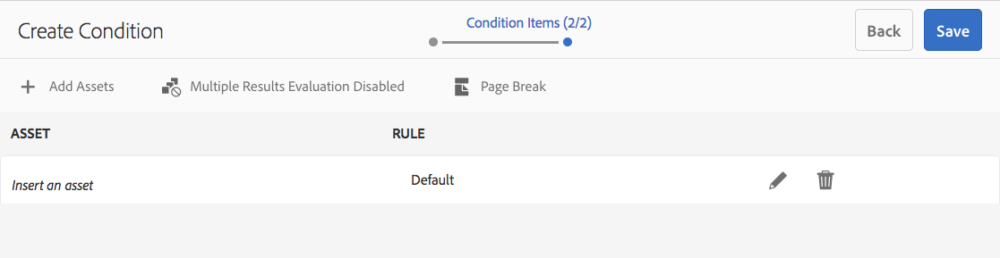
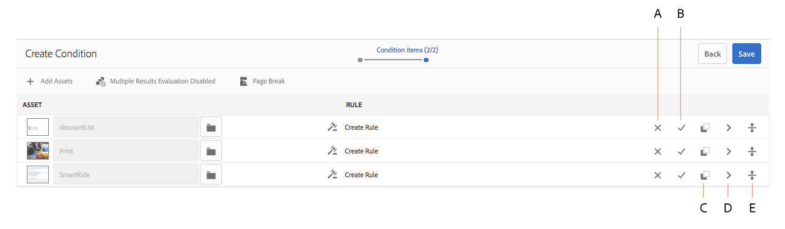
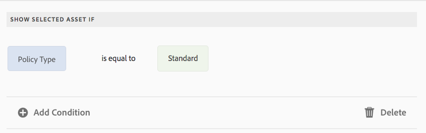

# Condizioni nelle comunicazioni interattive{#conditions-in-interactive-communications}

Creazione e modifica di frammenti di condizione da utilizzare nelle comunicazioni interattive: la condizione è uno dei quattro tipi di frammenti di documento utilizzati per creare le comunicazioni interattive. Gli altri tre sono testi, elenchi e frammenti di layout.

## Panoramica {#overview}

La condizione è un frammento di documento che puoi includere in una comunicazione interattiva. Gli altri frammenti di documento sono [text](../../forms/using/texts-interactive-communications.md)Frammento di elenco e layout. Le condizioni ti consentono di definire una o più risorse contestuali da includere in una comunicazione interattiva in base ai dati e alle regole forniti.

Esempi:

* In un estratto conto della carta di credito, visualizzare la tariffa annuale della carta di credito e l&#39;immagine della carta di credito in base al tipo di carta di credito del cliente.
* In un promemoria relativo al premio assicurativo dovuto, visualizzare i calcoli delle imposte in base alle imposte dello stato del cliente.

Le risorse nelle condizioni sottoposte a rendering in base alle regole applicate e ai valori passati alla regola. Le regole nelle condizioni possono controllare i valori nei seguenti tipi di dati:

* Proprietà del modello dati modulo associato
* Eventuali variabili create nella condizione
* Stringhe
* Numeri
* Espressioni matematica
* Date

## Creare una condizione {#createcondition}

1. Seleziona **[!UICONTROL Forms]** > **[!UICONTROL Frammenti di documenti]**.
1. Seleziona **[!UICONTROL Crea]** > **[!UICONTROL Condizione]**.
1. Specifica le seguenti informazioni:

   * **[!UICONTROL Titolo]**: (Facoltativo) immetti il titolo della condizione. I titoli non devono necessariamente essere univoci e possono contenere caratteri speciali e non inglesi. Le condizioni sono indicate dai relativi titoli (se disponibili), ad esempio nelle miniature e nelle proprietà.
   * **[!UICONTROL Nome]**: nome univoco della condizione, all’interno di una cartella. In una cartella non possono esistere due frammenti di documento (testo, condizione o elenco) con lo stesso nome. Nel campo Nome è possibile immettere solo caratteri, numeri e trattini in lingua inglese. Il campo Nome viene compilato automaticamente in base al campo Titolo. I caratteri speciali, gli spazi, i numeri e i caratteri non inglesi immessi nel campo Titolo vengono sostituiti da trattini nel campo Nome. Anche se il valore nel campo Titolo viene copiato automaticamente nel Nome, è possibile modificarlo.

   * **[!UICONTROL Descrizione]**: digita una descrizione del frammento di documento.
   * **[!UICONTROL Modello dati modulo]**: se necessario, seleziona il pulsante di opzione Modello dati modulo per creare la condizione in base a un modello dati modulo. Quando selezioni il pulsante di opzione Modello dati modulo, **[!UICONTROL Modello dati modulo]** viene visualizzato. Sfoglia e seleziona un modello di dati del modulo. Durante la creazione della condizione per una comunicazione interattiva, accertati di utilizzare lo stesso modello di dati che intendi utilizzare nella comunicazione interattiva. Per ulteriori informazioni sul modello dati del modulo, consulta [Integrazione dei dati](../../forms/using/data-integration.md).

   * **[!UICONTROL Tag]**: facoltativamente, per creare un tag personalizzato, immetti il valore nel campo di testo e seleziona Invio. Quando salvi questa condizione, vengono creati i nuovi tag aggiunti.

1. Seleziona **[!UICONTROL Avanti]**.

   Viene visualizzata la pagina Crea condizione.

   

1. Seleziona **[!UICONTROL Aggiungi risorse]**.

   Viene visualizzata la pagina Seleziona risorse con i testi, gli elenchi, le condizioni e le immagini disponibili per l’aggiunta alla condizione.

   >[!NOTE]
   >
   >Nella pagina Seleziona risorse vengono visualizzate solo le risorse basate su Nessuno e le risorse basate su FDM appena create (create utilizzando lo stesso FDM della condizione in fase di creazione).

1. Seleziona le risorse appropriate da includere nella condizione, quindi seleziona **[!UICONTROL Fine]**.

   Viene visualizzata la pagina Crea condizione in cui sono elencate le risorse aggiunte.

   

   Per gestire le risorse in una condizione, puoi utilizzare le seguenti opzioni:

   

   **[A] Rifiuta modifica.** Seleziona questa icona per rifiutare le modifiche eventualmente apportate alla risorsa e alla regola nella condizione.
   **[B] Accetta modifica.** Seleziona questa icona per accettare le modifiche apportate alla risorsa e alla regola nella condizione.
   **[C] Risorsa duplicata.** Seleziona questa icona per creare una copia della risorsa insieme all’eventuale regola applicata nella condizione. Quindi puoi procedere alla modifica della regola e della risorsa per la risorsa duplicata. La duplicazione di una risorsa è utile per creare regole simili in modo da visualizzare risorse alternative in base a un particolare contesto.
   **[D] Mostra anteprima.** Selezionare questa icona per visualizzare un&#39;anteprima della risorsa nella pagina Crea\Modifica condizione.
   **Riordinamento &#39;server&#39;.** Seleziona e tieni premuto questa icona per trascinare e rilasciare le risorse per riordinarle all’interno di una condizione.

   Per specificare il comportamento della condizione in fase di esecuzione, è possibile selezionare le opzioni seguenti:

   * **Valutazione risultati multipli disabilitata\Valutazione risultati multipli abilitata**: quando questa opzione è abilitata (viene visualizzato come &quot;Valutazione più risultati abilitata&quot;), tutte le regole vengono valutate e il risultato è la somma di tutte le regole vere. Se questa opzione è disabilitata (viene visualizzato come &quot;Valutazione più risultati disabilitata&quot;), viene valutata solo la prima regola che risulta true e diventa l’output della condizione.

   * **Interruzione di pagina**: seleziona questa opzione ( ) per aggiungere un’interruzione di pagina tra le risorse delle condizioni. Se questa opzione non è selezionata ( ), se una condizione si sta riversando sulla pagina successiva nell’output di stampa, l’intera condizione viene spostata sulla pagina successiva invece di interrompere la pagina tra le risorse della condizione.

1. Seleziona **[!UICONTROL Crea regola]** per aggiungere regole per visualizzare o nascondere le risorse, in base alle esigenze. Per utilizzare le variabili nelle regole, consulta [creazione di variabili](#variables). Per ulteriori informazioni, consulta [Aggiunta di regole alla condizione](#ruleeditor).

   Le regole create vengono visualizzate nella colonna REGOLA della schermata Crea condizione.

   

   >[!NOTE]
   >
   >È possibile inserire nella condizione risorse a cui sono già state applicate regole o ripetizioni.

1. Seleziona **[!UICONTROL Salva]**.

   La condizione viene creata. Ora puoi utilizzare la condizione come blocco predefinito durante la creazione di una comunicazione interattiva.

   >[!NOTE]
   >
   >Per salvare una condizione nuova o modificata, è necessario disporre di almeno una regola per ciascuna delle risorse aggiunte alla condizione.

## Modificare una condizione {#edit-a-condition}

Per modificare una condizione, segui la procedura riportata di seguito. Puoi anche scegliere di modificare una condizione all’interno di una comunicazione interattiva selezionando Modifica frammento nel menu a comparsa.

1. Seleziona **[!UICONTROL Forms]** > **[!UICONTROL Frammenti di documenti]**.
1. Passa alla condizione e selezionala.
1. Seleziona **[!UICONTROL Modifica]**.
1. Apporta le modifiche necessarie nella condizione. Per ulteriori dettagli sulle informazioni che è possibile modificare in una condizione, vedi [Crea condizione](#createcondition).
1. Seleziona **[!UICONTROL Salva]** e quindi seleziona **[!UICONTROL Chiudi]**.

## Crea regole nella condizione {#ruleeditor}

Utilizzando l’editor di regole in una condizione, puoi creare regole per visualizzare o nascondere le risorse in base a **condizioni preimpostate**. Queste condizioni possono essere costruite in base a:

* Stringhe
* Numeri
* Espressioni matematica
* Date
* Proprietà del modello dati modulo associato
* Qualsiasi [Variabili](#variables) che potresti aver creato

### Crea regola nella condizione {#create-rule-in-condition}

1. Durante la creazione o la modifica di una condizione, seleziona  (Editor regole) per la risorsa pertinente.

   Viene visualizzata la finestra di dialogo Crea regola. Oltre a stringa, numero, espressione matematica e data, nell’Editor regole sono disponibili anche le seguenti opzioni per la creazione di istruzioni delle regole:

   * Proprietà del modello dati modulo associato
   * Qualsiasi [Variabili](#variables) che hai creato.

   

   Seleziona l’opzione appropriata da valutare.

   >[!NOTE]
   >
   >La proprietà di raccolta non è supportata per la creazione di regole per la visualizzazione delle risorse.

1. Selezionare l&#39;operatore appropriato per valutare la regola, ad esempio È uguale a, Contiene e Inizia con.
1. Inserisci l’espressione di valutazione, la stringa, la proprietà del modello dati, la variabile o la data.

   

   Regola per mostrare una risorsa quando il tipo di criterio è standard

   * Durante la creazione o la modifica di una regola, puoi anche selezionare  (Ridimensiona) per espandere la finestra di dialogo Crea regola/Modifica regola. La finestra di dialogo espansa a finestra intera consente di creare [Variabili](#variables) per creare le regole. Seleziona Ridimensiona di nuovo per tornare alla normale finestra di dialogo Crea regola.

   * Puoi anche creare più condizioni in una regola.

1. Seleziona **[!UICONTROL Fine]**.

   La regola viene applicata alla risorsa.

## Creazione e utilizzo di variabili in una condizione {#variables}

Durante la creazione o la modifica di una regola in una condizione, puoi selezionare  (Ridimensiona) per espandere la finestra di dialogo Crea regola\Modifica regola. La finestra di dialogo espansa a finestra intera consente di:

* Creare e utilizzare le variabili nella regola
* Trascinare le proprietà e le variabili del modello di dati modulo nella regola

Selezionare Ridimensiona per tornare alla finestra di dialogo Crea regola\Modifica regola.

### Creare le variabili {#create-variables}

1. Durante la creazione o la modifica di una regola in una condizione, puoi selezionare  (Ridimensiona) per espandere la finestra di dialogo Crea regola\Modifica regola.

   Viene visualizzata la finestra di dialogo Espansa, a finestra intera.

   

1. Nel riquadro a sinistra, seleziona **[!UICONTROL Variabili]**.

   Viene visualizzato il riquadro Variabili.

   

1. Seleziona **[!UICONTROL Crea]**.

   Viene visualizzato il riquadro Crea variabili.

1. Immetti le seguenti informazioni e seleziona **[!UICONTROL Crea]**:

   * **[!UICONTROL Nome]**: nome della variabile.
   * **[!UICONTROL Descrizione]**: facoltativamente, inserisci una descrizione della variabile.
   * **[!UICONTROL Tipo]**: seleziona un tipo di variabile: String, Number, Boolean o Date.
   * **[!UICONTROL Consenti solo valori specifici]**: per le variabili String e Number, puoi fare in modo che l’agente scelga uno specifico set di valori per un segnaposto nell’interfaccia utente dell’agente. Per specificare il set di valori, seleziona questa opzione e quindi specifica i valori separati da virgola consentiti nella **[!UICONTROL Valori]** campo.

1. Seleziona **[!UICONTROL Crea]**.

   La variabile viene creata ed elencata nel riquadro Variabili.

1. Per inserire una variabile nella regola, trascina la variabile in un segnaposto per un’opzione nella regola.
1. Dopo aver creato una regola valida, seleziona **[!UICONTROL Fine]**.

   Procedi ad apportare ulteriori modifiche, se necessario, alla condizione e salvala.
