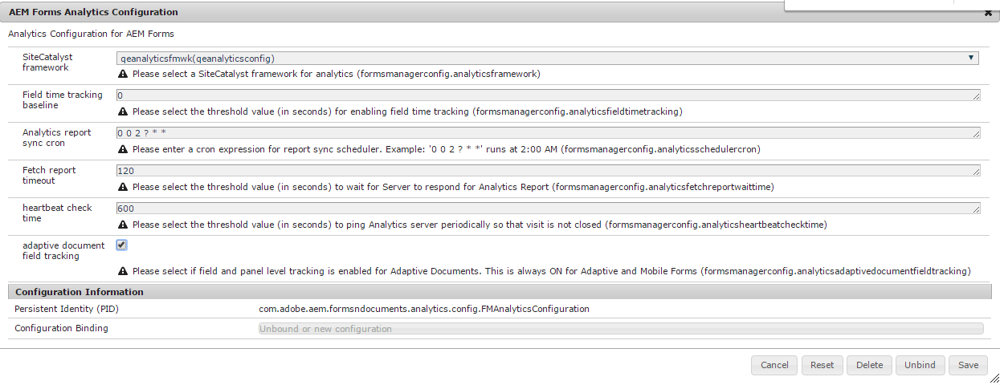

# Analytics tramite Cloud Service Framework {#analyticsusingcloudframework}

AEM Forms si integra con Analytics per acquisire e tenere traccia delle metriche delle prestazioni per i moduli e i documenti pubblicati. L’obiettivo dell’analisi di queste metriche è quello di prendere decisioni informate in base ai dati sulle modifiche necessarie per rendere i moduli o i documenti più utilizzabili.

>[!NOTE]
>
>La funzione di analisi di AEM Forms è disponibile come parte del pacchetto del componente aggiuntivo AEM Forms. Per informazioni sull&#39;installazione del pacchetto del componente aggiuntivo, vedere [Installazione e configurazione di AEM Forms](../../forms/using/installing-configuring-aem-forms-osgi.md).
>
>Oltre al pacchetto del componente aggiuntivo, è necessario disporre di un account Adobe Analytics e dei privilegi di amministratore per l’istanza AEM. Per informazioni sulla soluzione, consulta [Adobe Analytics](https://www.adobe.com/solutions/digital-analytics.html).

Puoi anche eseguire analisi utilizzando Adobe Launch. Per ulteriori informazioni su come integrare AEM Forms con Adobe Launch, consulta [Analytics utilizzando Adobe Launch](/help/forms/using/integrate-aem-forms-with-adobe-analytics.md).

## Panoramica {#overview}

Puoi utilizzare Adobe Analytics per scoprire i pattern di interazione e i problemi che gli utenti devono affrontare durante l’utilizzo di moduli adattivi, moduli HTML5 e comunicazione interattiva. Adobe Analytics tiene traccia e memorizza informazioni sui seguenti parametri:

* **Tempo medio di riempimento**: tempo medio impiegato per compilare il modulo.
* **Rappresentazioni**: numero di volte in cui un modulo viene aperto.
* **Bozze**: numero di volte in cui un modulo viene salvato nello stato di bozza.
* **Invii**: numero di invii di un modulo.
* **Interrompi**: numero di volte in cui gli utenti se ne vanno senza completare il modulo.

Puoi personalizzare Adobe Analytics per aggiungere/rimuovere altri parametri. Oltre alle informazioni di cui sopra, il rapporto contiene le seguenti informazioni su ogni pannello di HTML5 e del modulo adattivo:

* **Ora**: tempo trascorso sul pannello e sui campi del pannello.
* **Errore**: numero di errori rilevati nel pannello e nei relativi campi.
* **Aiuto**: numero di volte in cui un utente apre la guida di un pannello e i relativi campi.

## Creazione di una suite di rapporti {#creating-report-suite}

I dati di Analytics vengono memorizzati negli archivi specifici del cliente denominati suite di rapporti. Per creare una suite di rapporti e utilizzare Adobe Analytics, devi disporre di un account Adobe Marketing Cloud valido. Prima di eseguire i passaggi seguenti, assicurati di disporre di un account Adobe Marketing Cloud valido.

Per creare una suite di rapporti, effettua le seguenti operazioni.

1. Accedi a [https://sc.omniture.com/login/](https://sc.omniture.com/login/)
1. Nel Marketing Cloud, seleziona **Amministratore** > **Admin Console** > **Suite di rapporti**.
1. Seleziona **Crea nuovo** > **Suite di rapporti** in Report Suite Manager.

   

   Creare una nuova suite di rapporti

1. Assicurati che il primo elenco a discesa sia impostato su **Creare da un modello** e quindi seleziona **Commerce**.
1. Individua il **ID suite di rapporti** e aggiungi un nuovo ID suite di rapporti. Ad esempio, JJEsquire. Sotto il campo ID suite di rapporti viene visualizzato un ID suite di rapporti. Include un prefisso automatico, che spesso corrisponde al nome dell’azienda.
1. Aggiungi nuovo **Titolo sito**. Ad esempio, JJEsquire Getting Started Suite. Questo titolo viene utilizzato nell’interfaccia utente di Analytics. Utilizza l’ID suite di rapporti nel codice.
1. Seleziona un **Fuso orario** dal menu a discesa. Tutti i dati che entrano in questa suite di rapporti vengono registrati in base al fuso orario definito.
1. Lascia **URL di base** e **Pagina predefinita** campi vuoti. Questi due valori vengono utilizzati solo dall’interfaccia di Adobe Marketing Cloud per il collegamento al sito web.
1. Lascia **Data lancio** impostato su oggi. La data di lancio determina il giorno in cui la suite di rapporti viene attivata.
1. In **Visualizzazioni pagina stimate al giorno** campo, digitare 100. Utilizza questo campo per stimare il numero giornaliero di visualizzazioni di pagina previste per il sito web. Questa stima consente ad Adobe di implementare la quantità appropriata di hardware per elaborare i dati che verranno raccolti.
1. Seleziona un **Valuta di base** dal menu a discesa. Tutti i dati sulla valuta inclusi in questa suite di rapporti vengono convertiti e memorizzati in questo formato di valuta.
1. Clic **Crea rapporto** Suite. Dovresti visualizzare l’aggiornamento della pagina con un messaggio che informa che la suite di rapporti è stata creata correttamente.
1. Seleziona la suite di rapporti appena creata. Accedi a **Modifica impostazioni** > **Generale** > **Impostazioni account generali**.

   

   Impostazioni account generali

1. Nella schermata Impostazioni account generali, abilita **Rapporti sulla geografia** e fai clic su **Salva.**
1. Accedi a **Modifica impostazioni** > **Traffico** > **Variabili di traffico**.
1. Nella suite di rapporti, configura e abilita le seguenti variabili di traffico.

   * **formName**: identificatore di un modulo adattivo.
   * **formInstance**: identificatore di un’istanza di modulo adattivo. Abilita i rapporti di percorso per questa variabile.
   * **fieldName**: identificatore di un campo modulo adattivo. Abilita i rapporti di percorso per questa variabile.
   * **panelName**: identificatore di un pannello di moduli adattivi. Abilita i rapporti di percorso per questa variabile.
   * **formTitle**: titolo del modulo.
   * **fieldTitle**: titolo del campo modulo.
   * **panelTitle**: titolo del pannello del modulo.
   * **analyticsVersion**: versione di analisi dei moduli.

1. Accedi a **Modifica impostazioni** > **Conversione** > **Eventi di successo**. Definisci e abilita i seguenti eventi di successo:

   | Evento di successo | Tipo |
   |---|---|
   | abbandonare | Contatore |
   | rendering | Contatore |
   | panelVisit | Contatore |
   | fieldVisit | Contatore |
   | salva | Contatore |
   | errore | Contatore |
   | aiuto | Contatore |
   | invia | Contatore |
   | timeSpent | Numerico |

   >[!NOTE]
   >
   >Un numero evento e un numero proprietà utilizzati per configurare AEM Forms Analytics devono essere diversi dal numero evento e dal numero proprietà utilizzati in [Analisi AEM](/help/sites-administering/adobeanalytics.md) configurazione.

1. Esci dall’account Adobe Marketing Cloud.

## Creazione della configurazione del Cloud Service {#creating-cloud-service-configuration}

Per configurazione di Cloud Service si intendono le informazioni sul tuo account Adobe Analytics. La configurazione consente a Adobe Experience Manager (AEM) di connettersi ad Adobe Analytics. Crea una configurazione separata per ogni account Analytics utilizzato.

1. Accedi all’istanza di authoring dell’AEM come amministratore.
1. Nell’angolo in alto a sinistra, fai clic su **Adobe Experience Manager** > **Strumenti**  > **Cloud Service** > **Cloud Service legacy**.
1. Individua **Adobe Analytics** icona. Clic **Mostra configurazioni** e quindi fai clic su **[+]** per aggiungere una nuova configurazione.

   Se sei un utente alle prime armi, fai clic su **Configura ora**.

1. Aggiungi un Titolo alla nuova configurazione (la compilazione del campo Nome è facoltativa). Ad esempio, Configurazione My analytics. Fai clic su **Crea**.

1. Quando il pannello Modifica si apre nella pagina di configurazione, compila i campi:

   * **Azienda**: nome della tua azienda come descritto su Adobe Analytics.
   * **Nome utente**: nome utilizzato per accedere ad Adobe Analytics.
   * **Password**: password di Adobe Analytics per l’account di cui sopra.
   * **Data center**: il datacenter del tuo account Adobe Analytics.

1. Clic **Connetti ad Analytics**. Viene visualizzata una finestra di dialogo con il messaggio che la connessione è riuscita. Fai clic su **OK**.

## Creazione framework Cloud Service {#creating-cloud-service-framework}

Un framework Adobe Analytics è un set di mappature tra variabili Adobe Analytics e variabili AEM. Utilizza un framework per configurare il modo in cui i moduli compilano i dati nei rapporti di Adobe Analytics. I framework sono associati a una configurazione Adobe Analytics. Puoi creare più framework per ogni configurazione.

1. Nella console Servizi cloud AEM, fai clic su **Mostra configurazioni**, in Adobe Analytics.
1. Fai clic su **[+]** accanto a accanto alla configurazione di Analytics.

   

   Configurazione Adobe Analytics

1. Digita un **Titolo** e **Nome** per il framework, seleziona **Adobe Analytics** Framework e fai clic su **Crea**. Il framework si apre per la modifica.
1. Nella sezione Suite di rapporti del pod laterale, fai clic su **Aggiungi elemento**, quindi utilizza l’elenco a discesa per selezionare l’ID suite di rapporti (ad esempio, JJEsquire) con cui il framework interagirà.
1. Accanto all’ID suite di rapporti, seleziona le istanze del server a cui desideri inviare informazioni.

   

1. Trascina un **Componente analisi modulo** dal **altro** categoria dal Sidekick al framework.
1. Per mappare le variabili di Analytics con le variabili definite nel componente, trascina una variabile da AEM Content Finder su un campo del componente di tracciamento.

   

1. Attiva il framework utilizzando **scheda pagina** nella barra laterale, fai clic su **Attiva framework**.

## Configurazione del servizio di configurazione di AEM Forms Analytics {#configuring-aem-forms-analytics-configuration-service}

1. Nell’istanza di authoring, apri Gestione configurazione della console web AEM all’indirizzo `https://<server>:<port>;/system/console/configMgr`.
1. Individuare e aprire Configurazione di AEM Forms Analytics

   

   Servizio di configurazione di AEM Forms Analytics

1. Specifica i valori appropriati per i campi seguenti e fai clic su **Salva**.

   * **Framework di SiteCatalyst**: seleziona il framework o la configurazione definita nella sezione Configurare un framework per il tracciamento.
   * **Baseline di tracciamento temporale del campo**: specifica la durata in secondi dopo la quale deve essere tracciata la visita in campo. Il valore predefinito è 0. Quando il valore è maggiore di 0 (zero), due eventi di tracciamento separati vengono inviati al server Adobe Analytics. Il primo evento indica al server di analisi di interrompere il tracciamento del campo in uscita. Il secondo evento viene inviato dopo la scadenza della durata specificata. Il secondo evento indica al server di analisi di iniziare a tracciare il campo visitato. L’utilizzo di due eventi separati consente di misurare con precisione il tempo trascorso su un campo. Quando il valore è 0 (zero), viene inviato un singolo evento di tracciamento al server Adobe Analytics.

   * **Cron di sincronizzazione report di Analytics**: specifica l’espressione cron per recuperare i rapporti da Adobe Analytics. Il valore predefinito è 0 0 2 ? &#42; &#42;.

   * **Timeout recupero rapporto:** Specifica la durata in secondi dell&#39;attesa della risposta del server al rapporto di analisi. Il tempo predefinito è di 120 secondi.

   >[!NOTE]
   >
   >Possono essere necessari fino a 10 secondi in più per l’operazione di recupero del rapporto di timeout rispetto al numero di secondi specificato.

1. Ripeti i passaggi 1-3 sull’istanza di pubblicazione per configurare l’analisi.

Ora è possibile abilitare Analytics per i moduli e generare un rapporto di analisi.

## Abilitazione delle analisi per un modulo o un documento {#enabling-analytics-for-a-form-or-document}

1. Accedi al portale AEM all’indirizzo `https://[hostname]:'port'`.
1. Clic **Forms > Forms e documenti**, selezionare un modulo o un documento e fare clic su **Abilita analisi**. L’analisi è abilitata.

   

   Abilitazione delle analisi per un modulo

   **R.** Pulsante Abilita analisi **B.** Modulo selezionato

   Per informazioni dettagliate sulla visualizzazione dei rapporti di Forms Analytics, consulta [Visualizzazione e comprensione dei rapporti di AEM Forms Analytics](../../forms/using/view-understand-aem-forms-analytics-reports.md).
