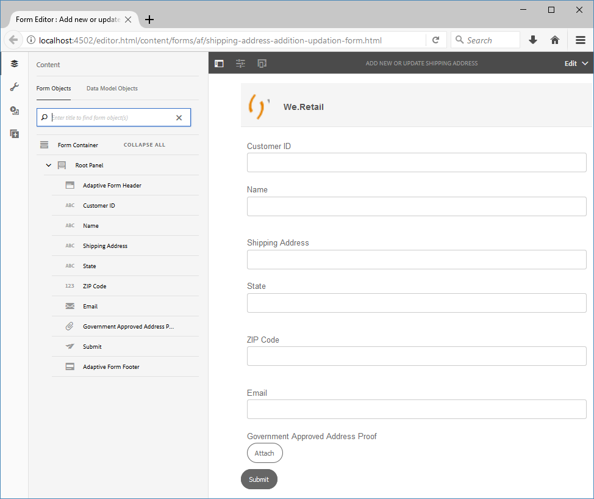

# Tutorial: creare un modulo adattivo {#do-not-publish-tutorial-create-an-adaptive-form}

Questo tutorial è un passaggio del [Creare il primo modulo adattivo](/help/forms/using/create-your-first-adaptive-form.md) serie. Si consiglia di seguire la serie in sequenza cronologica per comprendere, eseguire e dimostrare il caso di utilizzo completo dell’esercitazione.

## Informazioni sull’esercitazione {#about-the-tutorial}

I moduli adattivi sono moduli di nuova generazione dinamici e reattivi. Puoi utilizzare i moduli adattivi per fornire esperienze personalizzate. È inoltre possibile integrare i moduli adattivi con [!DNL Adobe Analytics] per le statistiche di utilizzo e [!DNL Adobe Campaign] per la gestione delle campagne. Per ulteriori informazioni sulle funzionalità dei moduli adattivi, consulta [Introduzione all’authoring di moduli adattivi](/help/forms/using/introduction-forms-authoring.md).

La creazione e la gestione dei moduli è più semplice se si segue un processo appropriato. In questo articolo imparerai a:

* [Creare un modulo adattivo che consenta a un cliente di aggiungere un indirizzo di spedizione](/help/forms/using/create-adaptive-form.md#step-create-the-adaptive-form)

* [Layout dei campi di un modulo adattivo per visualizzare e accettare le informazioni di un cliente](/help/forms/using/create-adaptive-form.md#step-add-header-and-footer)

* [Crea un’azione di invio per inviare un’e-mail contenente il contenuto del modulo](/help/forms/using/create-adaptive-form.md#step-add-components-to-capture-and-display-information)
* [Anteprima e invio di un modulo adattivo](/help/forms/using/create-adaptive-form.md)

Avrai un modulo simile al seguente entro la fine dell’articolo:\

## Passaggio 1: creare il modulo adattivo {#step-create-the-adaptive-form}

1. Accedi all’istanza di authoring dell’AEM e passa a **[!UICONTROL Adobe Experience Manager]** > **[!UICONTROL Forms]** > **[!UICONTROL Forms e documenti]**. L’URL predefinito è [http://localhost:4502/aem/forms.html/content/dam/formsanddocuments](http://localhost:4502/aem/forms.html/content/dam/formsanddocuments).
1. Seleziona **[!UICONTROL Crea]** e seleziona **[!UICONTROL Modulo adattivo]**. Viene visualizzata un&#39;opzione per selezionare un modello. Seleziona la **[!UICONTROL Vuoto]** modello per selezionarlo e selezionare **[!UICONTROL Successivo]**.

1. Opzione per **[!UICONTROL Aggiungi proprietà]** viene visualizzato. Il **[!UICONTROL Titolo]** e **[!UICONTROL Nome]** I campi sono obbligatori:

   * **Titolo:** Specifica `Add new or update shipping address` nel **[!UICONTROL Titolo]** campo. Il campo titolo specifica il nome visualizzato del modulo. Il titolo ti aiuta a identificare il modulo nell’AEM [!DNL Forms] dell&#39;utente.
   * **Nome:** Specifica `shipping-address-add-update-form` nel **[!UICONTROL Nome]** campo. Il campo Nome specifica il nome del modulo. Nell’archivio viene creato un nodo con il nome specificato. Quando si inizia a digitare un titolo, il valore del campo nome viene generato automaticamente. Puoi modificare il valore suggerito. Il campo nome può contenere solo caratteri alfanumerici, trattini e caratteri di sottolineatura. Tutti gli input non validi vengono sostituiti da un trattino.

1. Seleziona **[!UICONTROL Crea]**. Viene creato un modulo adattivo e viene visualizzata una finestra di dialogo per aprire il modulo per la modifica. Seleziona **[!UICONTROL Apri]** per aprire il modulo appena creato in una nuova scheda. Il modulo viene aperto per la modifica. Viene visualizzata inoltre la barra laterale per personalizzare il modulo appena creato in base alle esigenze.

   Per informazioni sull’interfaccia di authoring di moduli adattivi e sui componenti disponibili, consulta [Introduzione all’authoring di moduli adattivi](/help/forms/using/creating-adaptive-form.md).

   

## Passaggio 2: aggiungere intestazione e piè di pagina {#step-add-header-and-footer}

AEM [!DNL Forms] fornisce molti componenti per visualizzare informazioni su un modulo adattivo. I componenti Intestazione e Piè di pagina consentono di conferire a un modulo un aspetto coerente. In genere, un’intestazione include il logo di un’azienda, il titolo del modulo e il riepilogo. Un piè di pagina include in genere informazioni sul copyright e collegamenti ad altre pagine.

1. Seleziona  > . Viene visualizzato il browser Componenti (Component). Trascina **[!UICONTROL Intestazione]** dal browser componenti al modulo adattivo.
1. Seleziona **[!UICONTROL Logo]**. Viene visualizzata la barra degli strumenti. Seleziona  sulla barra degli strumenti, digita **We.Retail**, e seleziona .

1. Seleziona Immagine. Viene visualizzata la barra degli strumenti. Seleziona . Il browser delle proprietà si apre a sinistra dello schermo. **[!UICONTROL Sfoglia]** e carica l&#39;immagine del logo. Seleziona . L&#39;immagine viene visualizzata nell&#39;intestazione.

   Se non ne hai uno, seleziona Ottieni file per scaricare il logo utilizzato in questo articolo.

[Ottieni file](assets/logo.png)

1. Trascina **[!UICONTROL Piè di pagina]** componente da  al modulo adattivo. In questa fase, il modulo si presenta come segue:

   

## Passaggio 3: aggiungere componenti per acquisire e visualizzare informazioni {#step-add-components-to-capture-and-display-information}

I componenti sono elementi costitutivi di un modulo adattivo. AEM [!DNL Forms] fornisce molti componenti per acquisire e visualizzare informazioni in un modulo adattivo. Puoi trascinare i componenti da  in un modulo. Per informazioni sui componenti disponibili e sulle funzionalità corrispondenti, consulta [Introduzione all’authoring di moduli adattivi](/help/forms/using/introduction-forms-authoring.md).

1. Trascina **[!UICONTROL Componente casella numerica]** al modulo adattivo. Posizionalo prima del componente Piè di pagina. Apri le proprietà del componente, modifica **[!UICONTROL Titolo]** del componente a **`Customer ID`**, modifica **[!UICONTROL Nome elemento]** a **`customer_ID`**, abilita **[!UICONTROL Campo obbligatorio]** , abilita **[!UICONTROL Usa tipo di input numero HTML5]** e seleziona .
1. Trascina tre componenti Casella di testo nel modulo adattivo. Posizionale prima del componente Piè di pagina. Impostare le seguenti proprietà per queste caselle di testo.:

   <table> 
    <tbody> 
     <tr> 
      <td><b>Proprietà</b></td> 
      <td><b>Riquadro 1 </b></td> 
      <td><b>Casella di testo 2 </b></td> 
      <td><b>Riquadro 3</b></td> 
     </tr> 
     <tr> 
      <td>Titolo</td> 
      <td>Nome  </td> 
      <td>Indirizzo di spedizione</td> 
      <td>Stato</td> 
     </tr> 
     <tr> 
      <td>Nome elemento</td> 
      <td>customer_Name  </td> 
      <td>customer_Shipping_Address</td> 
      <td>customer_State</td> 
     </tr> 
     <tr> 
      <td>Campo obbligatorio</td> 
      <td>Attivato</td> 
      <td>Attivato</td> 
      <td>Attivato</td> 
     </tr> 
     <tr> 
      <td>Consenti più righe  </td> 
      <td>Disattivato</td> 
      <td>Attivato</td> 
      <td>Disattivato</td> 
     </tr> 
    </tbody> 
   </table>

1. Trascina un **[!UICONTROL Casella numerica]** prima del componente piè di pagina. Apri le proprietà del componente, imposta i valori elencati nella tabella seguente, Seleziona .

   | Proprietà | Valore |
   |---|---|
   | Titolo | Codice postale |
   | Nome elemento | customer_ZIPCode |
   | Numero massimo di cifre | 6 |
   | Campo obbligatorio | Attivato |
   | Tipo di pattern di visualizzazione | Nessun pattern |

1. Trascina una **[!UICONTROL E-mail]** prima del componente piè di pagina. Apri le proprietà del componente, imposta i valori elencati nella tabella seguente e seleziona .

   | Proprietà | Valore |
   |---|---|
   | Titolo | E-mail |
   | Nome elemento | customer_Email |
   | Campo obbligatorio | Attivato |

1. Trascina una **[!UICONTROL File allegato]** prima del componente piè di pagina. Apri le proprietà del componente, imposta i valori elencati nella tabella seguente e seleziona .

   <table> 
    <tbody> 
     <tr> 
      <td><b>Proprietà</b></td> 
      <td><b>Valore</b></td> 
     </tr> 
     <tr> 
      <td>Titolo</td> 
      <td>Bozza indirizzo approvato dal governo  </td> 
     </tr> 
     <tr> 
      <td>Nome elemento</td> 
      <td>customer_Address_Proof</td> 
     </tr> 
     <tr> 
      <td>Campo obbligatorio</td> 
      <td>Attivato</td> 
     </tr> 
    </tbody> 
   </table>

1. Trascina un **[!UICONTROL Pulsante Invia]** al modulo adattivo. Posizionalo prima del componente Piè di pagina. Apri le proprietà del componente, modifica Nome elemento in `address_addition_update_submit`, seleziona . Il layout del modulo è completo e l&#39;aspetto del modulo è il seguente:

   

## Passaggio 4: configurare l’azione di invio per il modulo adattivo {#step-configure-submit-action-for-the-adaptive-form}

Un’azione di invio viene attivata quando un utente tocca il pulsante Invia in un modulo adattivo. È possibile utilizzare un’azione di invio per salvare i dati del modulo nell’archivio locale, inviare i dati del modulo a un endpoint REST, inviare i dati del modulo come e-mail e altro ancora. I moduli adattivi forniscono alcune ulteriori azioni di invio pronte all’uso. Per informazioni dettagliate, consulta [Configurazione dell’azione Invia](/help/forms/using/configuring-submit-actions.md).

La procedura seguente consente di configurare l’azione di invio e-mail e l’azione di invio demo del modulo:

1. Configura il server e-mail. Per ulteriori informazioni, consulta [Configurazione delle notifiche e-mail](/help/sites-administering/notification.md).

1. Seleziona **[!UICONTROL Contenitore modulo]** nel browser Contenuto e seleziona . Il browser delle proprietà si apre a sinistra.
1. Vai a **[!UICONTROL Invio]** >  **[!UICONTROL Azione di invio]**. Seleziona **[!UICONTROL Invia e-mail]**. Specifica i seguenti valori e seleziona .

   | Proprietà | Valore |
   |--- |--- |
   | Da | `donotreply@weretail.com` |
   | A | `${customer_Email}` |
   | Oggetto | Conferma: hai aggiunto l&#39;indirizzo di spedizione sul sito Web We.Retail. |
   | Modello e-mail | Ciao `${customer_Name}`, Il seguente indirizzo viene aggiunto come indirizzo di spedizione per il tuo account:  `${customer_Name}`, `${customer_Shipping_Address}`, `${customer_State}`, `${customer_ZIPCode}`  Saluti, We.Retail |
   | Includi allegati | Attivato |

   Modulo pronto. Ora è possibile visualizzare in anteprima il modulo e verificarne la funzionalità. Se hai usato il nome indicato nell’esercitazione e accedi al modulo sul computer che esegue AEM [!DNL Forms] , il modulo è disponibile all&#39;indirizzo [http://localhost:4502/editor.html/content/forms/af/shipping-address-add-update-form.html](http://localhost:4502/editor.html/content/forms/af/shipping-address-add-update-form.html).

## Passaggio 5: visualizzare in anteprima e inviare il modulo adattivo {#step-preview-and-submit-the-adaptive-form}

È possibile utilizzare **[!UICONTROL Opzione Anteprima]** per valutare l&#39;aspetto e il comportamento di un modulo. Puoi inviare un modulo in modalità anteprima e controllare anche le convalide applicate a un modulo. Ad esempio, se viene visualizzato un errore quando un campo obbligatorio viene lasciato vuoto.

I moduli adattivi offrono anche un’opzione per emulare l’esperienza di un modulo per vari dispositivi. Ad esempio, iPhone, iPad e Desktop. Puoi utilizzare entrambi **[!UICONTROL Anteprima]** e **[!UICONTROL Emulatore]**  insieme per visualizzare in anteprima un modulo per dispositivi con dimensioni di schermo diverse.

1. Seleziona la **[!UICONTROL Anteprima]** sul lato destro dell’editor di moduli. Il modulo viene aperto in modalità anteprima. Se hai utilizzato il nome menzionato nell’esercitazione, l’URL di anteprima del modulo è [http://localhost:4502/content/dam/formsanddocuments/shipping-address-add-update-form/jcr:content?wcmmode=disabled](http://localhost:4502/content/dam/formsanddocuments/shipping-address-addition-updation-form/jcr:content?wcmmode=disabled)
1. Utilizzare  per visualizzare l&#39;aspetto del modulo su vari dispositivi.
1. Compila i campi del modulo e seleziona **[!UICONTROL Invia]**. Il modulo viene inviato e si viene reindirizzati al valore predefinito **Grazie** pagina. È inoltre possibile specificare una pagina di ringraziamento personalizzata. Per ulteriori informazioni, consulta [Configurazione della pagina di reindirizzamento](/help/forms/using/configuring-redirect-page.md).

Il modulo adattivo per aggiungere un indirizzo è pronto. Se hai utilizzato il nome menzionato nell’esercitazione e accedi al modulo sul computer che esegue il server AEM Forms, il modulo è disponibile all’indirizzo [http://localhost:4502/editor.html/content/forms/af/shipping-address-add-update-form.html](http://localhost:4502/editor.html/content/forms/af/shipping-address-add-update-form.html).
