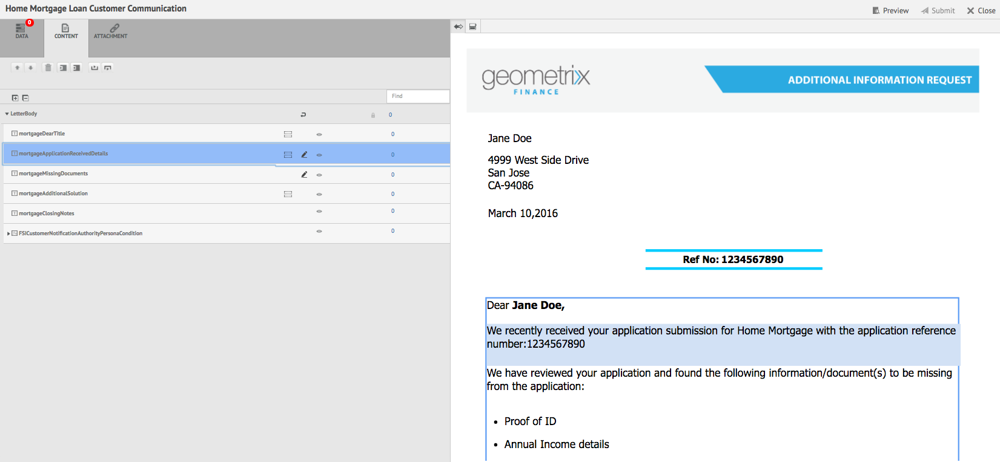
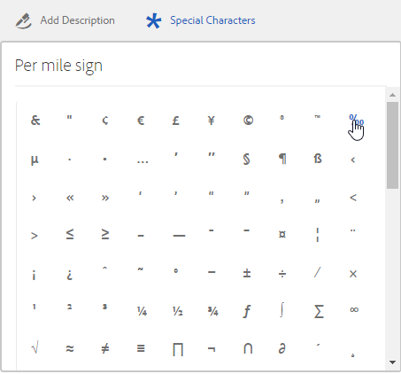

# Crea corrispondenza{#create-correspondence}

## Creare corrispondenza nell’interfaccia utente Crea corrispondenza {#create-correspondence-in-the-create-correspondence-user-interface}

Dopo un [il modello di lettera viene creato in Gestione corrispondenza](../../forms/using/create-letter.md), l’utente finale/agente/perito di attestazione può aprire la lettera nell’interfaccia utente Crea corrispondenza e creare una corrispondenza immettendo i dati, impostando il contenuto e gestendo gli allegati. Infine, il perito o l&#39;agente può gestire il contenuto in modalità anteprima e inviare la lettera.

### Visualizzare in anteprima una corrispondenza {#preview-a-correspondence}

Selezionare la lettera da visualizzare in anteprima seguendo la procedura descritta di seguito.

1. Nella pagina Lettere, tocca **Seleziona**.
1. Seleziona la lettera appropriata toccandola.

   

   Seleziona lettera

1. Per una lettera basata sul dizionario dati, seleziona **Anteprima** > **Anteprima**. In alternativa, per una lettera non basata su dizionario dati, selezionare **Anteprima**. Puoi anche passare il cursore su una lettera (senza selezionarla) e toccare l’icona Anteprima lettera per visualizzarla in anteprima.

   >[!NOTE]
   >
   >Se alla lettera non è associato un dizionario dati, viene visualizzata l’anteprima della lettera. In caso contrario, se la lettera è basata sul dizionario dati, Gestione corrispondenza visualizza le opzioni Anteprima e Personalizzata nel menu Anteprima e puoi selezionare una delle due opzioni. È inoltre possibile associare i dati di test a un dizionario dati. Quando [Dizionario dati con dati di test associati](../../forms/using/data-dictionary.md#p-working-with-test-data-p), quindi selezionando l’opzione di anteprima, viene aperta l’anteprima normale con i dati di test compilati.

1. Per poter eseguire il rendering di una corrispondenza durante l’anteprima, è necessario essere un amministratore o far parte di uno dei seguenti gruppi:

   * forms-users (per visualizzare l’anteprima sull’istanza di authoring)
   * cm-agent-users (per la rappresentazione nell’istanza Publish)

   Se non disponi delle autorizzazioni necessarie, richiedi all’amministratore l’accesso appropriato. Per ulteriori informazioni sulla creazione e l&#39;aggiunta di utenti ai gruppi, consulta [Aggiunta di utenti o gruppi a un gruppo](/help/sites-administering/security.md). Se tenti di eseguire il rendering di una corrispondenza senza disporre delle autorizzazioni appropriate, viene visualizzata la pagina di errore 404.

1. Se hai selezionato **Anteprima** > **Personalizzato**, viene visualizzata una finestra di dialogo. Nella finestra di dialogo, seleziona un file di dati corrispondente al dizionario dati con cui visualizzare l’anteprima della lettera, quindi seleziona **Anteprima**. Un file di dati viene creato in base a un dizionario dati per una lettera specifica. Per ulteriori informazioni sul file di dati, consulta [Dizionario dati](../../forms/using/data-dictionary.md#p-working-with-test-data-p).

   

1. Per impostazione predefinita, viene aperta l’anteprima di Letter HTML (anteprima moduli mobili) con la scheda Dati attivata.

   Per ulteriori informazioni sui moduli mobili e sulle funzioni supportate, consulta [Differenziazione delle funzioni tra Mobile Forms e PDF forms](https://helpx.adobe.com/livecycle/help/mobile-forms/feature-differentiation-mobile-forms-pdf.html).

   Sono disponibili tre schede: dati, contenuto e allegati. Se non sono presenti elementi di dati (variabili segnaposto e campi di layout), la lettera si apre direttamente in con la scheda Contenuto visualizzata. La scheda Allegati è disponibile solo se sono presenti allegati o se è abilitato l&#39;accesso alla libreria.

   >[!NOTE]
   >
   >Per ulteriori informazioni sul passaggio dalla modalità di rendering HTML alla modalità di rendering PDF dell’anteprima della lettera, consulta [Cambia la modalità di rappresentazione della lettera](#changerenditionmode). Per ulteriori informazioni sul supporto dei PDF in Gestione della corrispondenza e AEM, consulta [Interruzione dei plug-in del browser NPAPI e relativo impatto](https://helpx.adobe.com/acrobat/kb/change-in-support-for-acrobat-and-reader-plug-ins-in-modern-web-.html). <!-- and [PDF Forms to HTML5 Forms](https://helpx.adobe.com/aem-forms/kb/pdf-forms-to-html5-forms.html). THIS URL IS A 404 AND NO SUITABLE REPLACEMENT TOPIC WAS FOUND. CONSIDER DELETING OR ADDING NEW LINK. COMMENTING OUT SO USERS DON'T CLICK IT. -->

### Immetti i dati {#enterdata}

Nella scheda Dati, compila i campi di layout e i segnaposto disponibili.

1. Immetti i dati e le variabili di contenuto nei campi, in base alle esigenze. Compila tutti i campi obbligatori contrassegnati da un asterisco (&#42;) per attivare **Invia** pulsante.

   Tocca un valore di campo dati nell’anteprima della lettera HTML per evidenziare il campo dati corrispondente nella scheda Dati.

    

### Gestione contenuto {#managecontent}

Nella scheda del contenuto, gestisci il contenuto, ad esempio frammenti di documento e variabili di contenuto, nella lettera.

1. Seleziona **Contenuto**. Gestione corrispondenza visualizza la scheda contenuto della lettera.

   

1. Modifica i moduli di contenuto, come richiesto, nella scheda Contenuto. Per spostare lo stato attivo sul modulo del contenuto rilevante nella gerarchia del contenuto, tocca la riga o il paragrafo pertinente nell’anteprima della lettera oppure tocca il modulo del contenuto direttamente nella gerarchia del contenuto.

   Ad esempio, la riga &quot;Abbiamo rivisto...&quot; è selezionata nell’immagine seguente e il relativo modulo di contenuto è selezionato nella scheda Contenuto.

   

   Nella scheda Contenuto o Dati, toccando Evidenzia moduli selezionati ( ) in alto a sinistra nell’anteprima della lettera HTML, puoi disabilitare o abilitare la funzionalità per passare al modulo contenuto/dati quando nell’anteprima della lettera è selezionato il campo testo, paragrafo o dati pertinente.

   Per ulteriori informazioni sulle azioni disponibili per i vari moduli nell’interfaccia utente Crea corrispondenza, consulta [Azioni e informazioni disponibili nell’interfaccia utente per la creazione di corrispondenza](#actions-and-info-available-in-the-create-correspondence-content-tab).

1. Per individuare i moduli di contenuto, utilizzare il campo Trova. Inserisci il nome o il titolo completo o parziale del modulo di contenuto per cercarlo nella corrispondenza.
1. Tocca l’icona Schermo ( ) davanti a un elenco, testo, condizione o area di destinazione per mostrarlo o nasconderlo nella lettera.
1. Per modificare un modulo di testo in linea o modificabile, tocca il relativo **Modifica** icona ( ) o fare doppio clic sul modulo di testo corrispondente nell&#39;anteprima della lettera.

   Il sistema visualizza un editor di testo per modificare e formattare il testo.

   Il correttore ortografico predefinito nel browser controlla l&#39;ortografia nell&#39;editor di testo. Per gestire il controllo ortografico e grammaticale, è possibile modificare le impostazioni del correttore ortografico del browser oppure installare i plug-in e gli add-on del browser per il controllo ortografico e grammaticale.

   È inoltre possibile utilizzare le varie scelte rapide da tastiera disponibili nell&#39;editor di testo per gestire, modificare e formattare il testo. Per ulteriori informazioni su [Editor di testo](/help/forms/using/keyboard-shortcuts.md#correspondence-management) scelte rapide da tastiera in Scelte rapide da tastiera per Gestione corrispondenza.

   

   È possibile riutilizzare uno o più paragrafi di testo esistenti in un&#39;altra applicazione del documento. È possibile copiare e incollare direttamente il testo, ad esempio da MS Word, pagine HTML o qualsiasi altra applicazione.

   È possibile copiare e incollare uno o più paragrafi di testo in un modulo di testo modificabile. Ad esempio, è possibile disporre di un documento di MS Word con un elenco puntato di prove di residenza accettabili come:

   

   È possibile copiare e incollare direttamente il testo dal documento di MS Word in un modulo di testo modificabile. Nel modulo di testo viene mantenuta la formattazione come elenco puntato, carattere e colore del testo.

   

   >[!NOTE]
   >
   >La formattazione del testo incollato, tuttavia, presenta alcune [limitazioni](https://helpx.adobe.com/aem-forms/kb/cm-copy-paste-text-limitations.html).

   È possibile applicare un rientro al testo e ai numeri nella lettera utilizzando il tasto TAB. È ad esempio possibile utilizzare il tasto TAB per allineare più colonne di testo di un elenco in un formato tabulare.

   

   Esempio: utilizzo del tasto TAB per allineare più colonne di testo in un formato tabulare

   >[!NOTE]
   >
   >Per ulteriori informazioni sull&#39;impostazione della spaziatura di tabulazione per i moduli di testo e le lettere, vedere [Ulteriori informazioni sull&#39;utilizzo della spaziatura tra schede per la disposizione del testo](https://helpx.adobe.com/aem-forms/kb/cm-tab-spacing-limitations.html).

1. Se necessario, inserisci caratteri speciali nella corrispondenza. Ad esempio, è possibile utilizzare la tavolozza Caratteri speciali per inserire:

   * Simboli di valuta come €,¥ e £
   * Simboli matematici come ∑, √, ∂ e ^
   * Simboli di punteggiatura come ‟ e &quot;

   

   Gestione della corrispondenza supporta 210 caratteri speciali. L’amministratore può [aggiungi supporto per caratteri speciali aggiuntivi/personalizzati tramite personalizzazione](../../forms/using/custom-special-characters.md).

1. Per evidenziare/enfatizzare parti di testo in un modulo inline modificabile, selezionate il testo e toccate Colore evidenziazione.

   

   È possibile toccare direttamente un colore di base `**[A]**` presente nella palette Colori di base o toccare **Seleziona** dopo aver utilizzato il dispositivo di scorrimento `**[B]**` per scegliere la tonalità appropriata del colore.

   Se necessario, è anche possibile passare alla scheda Avanzate per selezionare la tonalità, la luminosità e la saturazione appropriate `**[C]**` per creare il colore preciso, quindi tocca Seleziona `**[D]**` per applicare il colore per evidenziare il testo.

   

1. Apporta le modifiche appropriate al contenuto e al formato e tocca **Salva**. Tocca ( ) per spostarsi tra moduli di testo modificabili, oppure tocca **Salva e Successivo** per salvare le modifiche e passare al successivo modulo di testo modificabile.
1. Il sistema visualizza anche le variabili non compilate per ciascuno dei rami. Quando non ci sono variabili vuote, le variabili vuote vengono visualizzate come 0. Se è presente una variabile non riempita, puoi toccare un ramo per espanderlo e individuare la variabile non riempita. Utilizza la barra degli strumenti del contenuto per eliminare il contenuto, aumentare/ridurre il rientro del contenuto e inserire interruzioni di pagina prima/dopo il contenuto.

   È possibile inserire interruzioni di pagina al di sopra e al di sotto dei moduli dati anche quando fanno parte di elenchi e condizioni.

1. Tocca Apri/chiudi variabile contenuto ( ) per aprire le variabili di contenuto e compilarle in modo appropriato.
1. Una volta compilata correttamente la variabile non compilata, il conteggio della variabile non compilata viene impostato su 0.

   Nell’interfaccia utente per la creazione di corrispondenza, il conteggio delle variabili non compilate viene visualizzato a ogni livello della gerarchia di qualsiasi modulo che contiene almeno una variabile. Se un modulo contiene variabili non compilate, il conteggio viene visualizzato a livello di variabile, modulo, area di destinazione e modello di lettera.

   Il conteggio delle variabili non compilate include:

   * Solo variabili del dizionario dati non protette e segnaposto. Il conteggio delle variabili non include variabili layout o del dizionario dati protetto.
   * Campi obbligatori
   * Campi layout se obbligatori e associati all’utente.
   * Solo istanze di variabili univoche. Se un modulo, un’area di destinazione o un modello di lettera contiene due o più istanze della stessa variabile, il conteggio viene visualizzato come 1 (uno). Tuttavia, per ciascuna istanza, il conteggio viene visualizzato come 1.

   Il conteggio delle variabili non compilate non include i moduli deselezionati. Se un modulo è incluso in un modello di lettera ma non è incluso nella lettera, il conteggio delle variabili non compilate in questo modulo non viene visualizzato.

   Per l&#39;area di destinazione, il modulo e la variabile, il conteggio viene visualizzato a destra di ciascun oggetto nel modello di lettera. Tuttavia, per il modello completo, il conteggio viene visualizzato nella barra di stato Crea corrispondenza.

   I moduli in un modello di lettera visualizzano il conteggio delle variabili non compilate come descritto di seguito:

   * **Testo** Visualizza la somma delle variabili segnaposto non compilate univoche e degli elementi del dizionario dati contenuti nel modulo di testo.
   * **Condizione** Visualizza la somma delle variabili di condizione univoche non compilate contenute nella condizione e delle variabili contenute nei moduli risultanti.
   * **Elenco** Visualizza la somma di tutte le variabili univoche non compilate contenute nei moduli assegnati all’elenco.
   * **Area di destinazione** Visualizza la somma di tutte le variabili univoche non compilate contenute nei moduli assegnati all&#39;area di destinazione.

   Per quanto riguarda le variabili con valori predefiniti, tieni presente quanto segue:

   * Un campo variabile booleano utilizza per impostazione predefinita *false*. Tuttavia, la variabile è considerata non compilata. Questo implica che il conteggio delle variabili include tutti i campi della variabile booleana con valore *false*.

   * Un campo variabile numerica utilizza per impostazione predefinita *0 (zero)*. Tuttavia, la variabile è considerata non compilata. Questo implica che il conteggio delle variabili include tutti i campi di variabili numeriche con valore *0 (zero)*.

#### Azioni e informazioni disponibili nella scheda Crea contenuto corrispondenza {#actions-and-info-available-in-the-create-correspondence-content-tab}

**Area di destinazione**

* Inserisci riga vuota: inserisce una nuova riga vuota.
* Inserisci testo in linea: inserisce un nuovo modulo di testo.
* Blocco ordine (info): indica che l&#39;ordine del contenuto non può essere modificato.
* Valori non compilati (info): indica il numero di variabili non compilate nell&#39;area di destinazione.

**Modulo**

* Selezione (icona occhio): include\esclude il modulo dalla lettera.
* Salta punti elenco (applicabile ai moduli elenco e ai relativi moduli figlio): salta i punti elenco in un modulo specifico.
* Interruzione di pagina prima di (applicabile ai moduli figlio dell’area di destinazione): inserisce l’interruzione di pagina prima del modulo.
* Interruzione di pagina dopo (applicabile ai moduli figlio dell’area di destinazione): inserisce l’interruzione di pagina prima del modulo.
* Valori non compilati (info): indica il numero di variabili non compilate nell&#39;area di destinazione.
* Modifica (solo moduli di testo): apri l’editor Rich Text per modificare il modulo di testo.
* Pannello dati (moduli di testo e condizione): apre tutte le variabili del modulo.

**Modulo elenco**

* Inserisci riga vuota: inserisce una nuova riga vuota.
* Libreria dei contenuti: apre la libreria dei contenuti per aggiungere moduli all’elenco.
* Impostazione elenco (solo elenco nidificato):
* Blocco ordine (info): indica che l&#39;ordine delle voci dell&#39;elenco non può essere modificato.

### Gestisci allegati {#manage-attachments}

1. Seleziona **Allegati**. Gestione corrispondenza visualizza gli allegati disponibili, in base alle impostazioni configurate durante la creazione del modello di lettera.
1. Per scegliere di non inviare un allegato insieme alla lettera, toccare l’icona di visualizzazione e toccare la croce nell’allegato per eliminarlo dalla lettera. Per gli allegati specificati, durante la creazione di un modello di lettera, come Obbligatorio, le icone Visualizza ed Elimina sono disattivate.
1. Tocca Accesso alla libreria ( ) per accedere alla Libreria dei contenuti e inserire risorse DAM come allegati.

   >[!NOTE]
   >
   >L’icona Accesso libreria è disponibile solo se è stato abilitato l’accesso alla libreria durante l’authoring della lettera.

1. Se l&#39;ordine degli allegati non è stato bloccato durante la creazione della corrispondenza, è possibile riordinare gli allegati selezionando un allegato e toccando le frecce giù e su.

   Per ulteriori informazioni, consulta [Consegna dell’allegato](#attachmentdelivery).

### Gestire il contenuto in anteprima e inviare la lettera {#manage-content-in-preview-and-submit-the-letter}

Puoi apportare modifiche al layout e al contenuto per garantire che la lettera abbia l’aspetto desiderato e inviarla ai vari processi di post.

1. Per evidenziare tutto il contenuto modificabile nella lettera, tocca **Evidenzia sezioni modificabili**.

   Il contenuto modificabile della lettera viene evidenziato con sfondo grigio.

   

1. Modifica i moduli di contenuto, come richiesto, nella scheda Contenuto. Per spostare lo stato attivo sul modulo del contenuto rilevante nella gerarchia del contenuto, tocca la riga o il paragrafo pertinente nell’anteprima della lettera oppure tocca il modulo del contenuto direttamente nella gerarchia del contenuto.

   Ad esempio, la riga &quot;Per consentirci di accedere a...&quot; è selezionata nell&#39;immagine seguente e il modulo di contenuto corrispondente è selezionato nella scheda Contenuto.

   Toccando Evidenzia moduli selezionati nel contenuto ( ), puoi disabilitare o abilitare la funzionalità per evidenziare il modulo del contenuto nella scheda Contenuto quando il testo, il paragrafo o il campo dati pertinente viene toccato nell’anteprima della lettera.

   Per ulteriori informazioni sulle azioni disponibili per i vari moduli nell’interfaccia utente Crea corrispondenza, consulta [Azioni e informazioni disponibili nell’interfaccia utente per la creazione di corrispondenza](#actions-and-info-available-in-the-create-correspondence-content-tab).

1. Per aggiungere un’interruzione di pagina alla lettera, tocca il punto in cui desideri inserire un’interruzione di pagina e seleziona Interruzione di pagina prima o Interruzione di pagina dopo ( ).

   Nella lettera viene inserito un segnaposto di interruzione di pagina esplicito. Per visualizzare il modo in cui un’interruzione di pagina esplicita influisce sulla lettera, consulta l’anteprima PDF semplificata.

   >[!NOTE]
   >
   >Poiché i moduli mobili non supportano le interruzioni di pagina, le intestazioni e i piè di pagina vengono visualizzati una sola volta. Tuttavia, è possibile impostare esplicitamente le intestazioni e i piè di pagina nel layout (per pagina) in modo che vengano visualizzati nell&#39;anteprima dei moduli mobili. Inoltre, le eventuali pagine vuote nella lettera non vengono visualizzate nell’anteprima dei moduli per dispositivi mobili.

   

1. Per salvare la lettera come bozza, su cui puoi continuare a lavorare in un secondo momento, tocca Salva come bozza. Per utilizzare questa opzione, la lettera deve essere [pubblicato](../../forms/using/publishing-unpublishing-forms.md#publishanasset). Per ulteriori informazioni, consulta Bozza di istanza in [Salvataggio delle bozze e invio delle istanze di lettere](#savingdrafts).

   

   Viene visualizzata la finestra di dialogo Nome bozza lettera con l&#39;ID istanza della lettera. Facoltativamente, puoi modificare questo ID. Prendi nota dell’ID della lettera, quindi tocca **Fine**. Puoi usare questo ID in seguito per [ricarica la bozza della lettera](submit-letter-topostprocess.md#reloaddraft).

1. Per visualizzare in anteprima la lettera come PDF appiattito con l’esatto layout e le interruzioni di pagina man mano che viene inviata, tocca ( ) Anteprima.

   La lettera viene visualizzata come PDF appiattito. Il PDF appiattito è l&#39;esatta rappresentazione della lettera, in quanto verrà inviata con i font, le interruzioni e il layout corretti della lettera.

   >[!NOTE]
   >
   >Se utilizzi Mozilla Firefox e il tipo di rappresentazione HTML, per visualizzare in anteprima la lettera come PDF appiattito, assicurati di utilizzare il plug-in nativo del browser e non il plug-in Acrobat. Per selezionare il plug-in del browser nativo, vai alle impostazioni di Mozilla Firefox e per il tipo di contenuto PDF, seleziona Anteprima in Firefox.

1. Se l’anteprima di PDF appiattita è soddisfacente, tocca **Invia** per inviare la lettera. Oppure per modificare la lettera, tocca **Esci da anteprima** per tornare all’anteprima dell’interfaccia utente per la creazione di corrispondenza della lettera e apportare modifiche. Quando tocchi Invia, se la configurazione Gestisci istanza lettera è abilitata nell’istanza Pubblica, viene generata l’istanza della lettera di invio.

   Per ulteriori informazioni, vedere Istanza bozza in Salvataggio delle bozze e invio delle istanze di lettere.

   È inoltre possibile salvare la lettera come bozza per apportarvi modifiche in un secondo momento.

   Dopo aver apportato le modifiche necessarie, puoi inviare la lettera dall’anteprima di HTML5 oppure toccare nuovamente Anteprima per rivedere l’output di Flattened PDF.

   Per informazioni sulle differenze tra moduli HTML5 e PDF forms, consulta [Differenziazione delle funzioni tra moduli di HTML5 e PDF forms](../../forms/using/feature-differentiation-html5-forms-pdf-forms.md).

## Salvataggio delle bozze e invio delle istanze di lettere {#savingdrafts}

Quando si esegue il rendering di una lettera nell’interfaccia utente Crea corrispondenza, è possibile salvare la lettera come visualizzata.

È possibile salvare due tipi di istanze di lettere: Istanza bozza e Istanza invio.

* **Bozza istanza**: l’istanza Bozza acquisisce lo stato corrente della lettera che stai visualizzando in anteprima. Per salvare una bozza di istanza, accertatevi innanzitutto che la lettera e tutte le risorse a cui fa riferimento la lettera siano nello stato Pubblicato. Per informazioni sulla pubblicazione di una lettera, consulta [Pubblicare una risorsa](../../forms/using/publishing-unpublishing-forms.md#publishanasset). È necessario pubblicare una lettera prima di salvarla come bozza, poiché quando si pubblica una lettera, si crea una versione della lettera, delle risorse dipendenti e dei dati a quel punto. La versione pubblicata di una lettera non può essere modificata da te o da un altro utente e può essere ripristinata in un secondo momento senza alcuna discrepanza imprevista dalla versione pubblicata. Puoi tornare a questa istanza in un secondo momento e continuare da dove ti sei allontanato.

* **Invia istanza**: le istanze di invio acquisiscono lo stato della lettera durante l’invio. L’istanza di invio memorizza lo stato PDF dell’istanza della lettera dopo la post-elaborazione insieme ai dati immessi dall’utente nell’interfaccia utente per la creazione di corrispondenza.

Tali istanze possono essere salvate solo quando la lettera viene visualizzata nell’istanza Publish. Per impostazione predefinita, il salvataggio sulle istanze è disattivato. Per abilitare il salvataggio delle istanze di lettere, effettuare le seguenti operazioni.

1. In AEM, apri Configurazione console web Adobe Experience Manager per il server utilizzando il seguente URL: https://&lt;server>:&lt;port>/&lt;contextpath>/system/console/configMgr
1. Individua **[!UICONTROL Configurazioni gestione corrispondenza]** e fare clic su di esso.
1. Verifica **[!UICONTROL Gestisci istanze lettere al momento della pubblicazione]** e quindi fare clic su **[!UICONTROL Salva]**.

### Abilita funzione Salva bozza {#enable-save-draft-feature}

Prima di pubblicare lettere o salvare bozze nell’istanza di pubblicazione, effettua le seguenti operazioni sull’istanza di authoring e di pubblicazione per abilitare la funzione Salva come bozza:

Il *cq:lastReplicationAction*, *cq:lastreplicated* e *cq:lastReplicatedBy* per impostazione predefinita, le proprietà non vengono trasferite all’istanza Publish. Al fine di riportare *cq:lastReplicationAction*, *cq:lastreplicated* e *cq:lastReplicatedBy* per pubblicare l&#39;istanza, disabilita la proprietà [!UICONTROL com.day.cq.replication.impl.ReplicationPropertiesFilterFactory] componente. Per disattivare il componente:

1. Nell’istanza di authoring, apri la console Componenti della console web di Adobe Experience Manager. L’URL predefinito è `http://author-server:port/system/console/components`

1. Cerca **[!UICONTROL com.day.cq.replication.impl.ReplicationPropertiesFilterFactory]** componente.

1. Clic  per disattivare [!UICONTROL com.day.cq.replication.impl.ReplicationPropertiesFilterFactory] componente.

Per abilitare la funzione Salva come bozza, sostituisci l’URL esistente in [!UICONTROL URL autore VersionRestoreManager] con URL dell’istanza di authoring. Per sostituire l’URL:

1. Nell’istanza di pubblicazione, apri [!UICONTROL Configurazione della console Web di Aode Manager]. L’URL predefinito è `https://publish-server:port/system/console/configMgr`

1. Cerca e apri **[!UICONTROL Gestione della corrispondenza - Configurazioni di Ripristino versione dell’istanza di authoring]** componente.

1. Individua il **[!UICONTROL URL autore VersionRestoreManager]** e specifica l’URL per l’istanza di authoring.

1. Fai clic su Salva.

Quando è attivato il salvataggio delle istanze di lettere, è possibile selezionare la posizione in cui salvare le istanze di lettere. Sono disponibili due opzioni per il salvataggio delle istanze di lettere: Salvataggio locale o Salvataggio remoto.

### Salvataggio locale {#local-save}

Le istanze di lettere vengono salvate nell’istanza di pubblicazione e vengono replicate in senso inverso nell’istanza di authoring.

### Salvataggio remoto {#remote-save}

Questa opzione è disponibile per le persone che hanno dubbi sul salvataggio dei dati utente nelle istanze di pubblicazione, che in genere si trovano al di fuori del firewall aziendale. Quando è attivato il salvataggio remoto, le istanze di lettere non vengono salvate nell’istanza di pubblicazione, ma vengono salvate in remoto nell’autore dell’elaborazione specificato tramite le configurazioni dell’SDK del client di LiveCycle.

#### Abilita salvataggio remoto {#enable-remote-save}

1. In AEM, apri Configurazione console web Adobe Experience Manager per il server utilizzando il seguente URL: `https://<server>:<port>/<contextpath>/system/console/configMgr`
1. Cerca **[!UICONTROL Configurazioni gestione corrispondenza]** e fare clic su di esso.
1. Individua il **[!UICONTROL Salvataggio remoto]** , verificarlo e fare clic su **[!UICONTROL Salva]**.

#### Specificare le impostazioni di elaborazione dell’autore {#specify-processing-author-settings}

1. In AEM, apri Configurazione console web Adobe Experience Manager per il server utilizzando il seguente URL: `https://<server>:<port>/system/console/configMgr`

   

1. In questa pagina, individua la configurazione Adobe LiveCycle Client SDK e espandila facendo clic su di essa.

1. Nell&#39;URL del server di elaborazione, immettere il nome del server di LiveCycle, fornire le informazioni di accesso e quindi fare clic su **Salva**.

   

1. Se necessario, impostare il nome utente e la password con cui si desidera accedere al server.

#### Consegna dell’allegato {#attachmentdelivery}

* Gli allegati della lettera sono disponibili nell’elaborazione post in PDF, che viene creata dopo l’invio della lettera.
* Quando viene eseguito il rendering della lettera utilizzando le API lato server come PDF interattivo o non interattivo, il PDF sottoposto a rendering contiene allegati come allegati PDF.
* Quando un processo di post associato a un modello di lettera viene caricato come parte delle operazioni di invio o completamento della corrispondenza tramite l’interfaccia utente Crea corrispondenza, gli allegati vengono passati come elenco&lt;com.adobe.idp.document> nel parametro AttachmentDocs.
* Anche i meccanismi di consegna predefiniti, come e-mail e Stampa, consegnano allegati insieme alle PDF della corrispondenza generata.

## Modalità di rappresentazione dell’anteprima di una lettera: Anteprima moduli mobile e Anteprima PDF {#rendition-modes-of-letter-preview-mobile-forms-preview-and-pdf-preview}

AEM Forms Correspondence Management visualizza una lettera come HTML nell’interfaccia utente per la creazione di corrispondenza. Tuttavia, Gestione della corrispondenza supporta ancora il ripristino dell’anteprima PDF invece di quella HTML. Per ulteriori informazioni sul passaggio tra la modalità di anteprima HTML e PDF, consulta [Cambia la modalità di rappresentazione della lettera](#changerenditionmode).

Di seguito sono riportati i vantaggi e le funzionalità disponibili nell’anteprima di HTML e PDF.

**Vantaggi dell’anteprima di moduli/HTML per dispositivi mobili**

* **Tocca un valore di campo dati per evidenziare il campo dati corrispondente**: nell’interfaccia utente per la creazione di corrispondenza, puoi toccare un valore di campo dati nella lettera per evidenziare il campo dati corrispondente nella scheda Dati. Per ulteriori informazioni, consulta [Immetti i dati](#enterdata).

* **Supporto browser**: i browser rimuovono gradualmente il supporto per NPAPI, il che influisce sull’anteprima PDF della lettera. Questo non influisce sull’anteprima HTML/mobile forms della lettera.
* **Evidenzia contenuto modificabile in una lettera**: nell’interfaccia utente per la creazione di corrispondenza, tocca Evidenzia contenuto modificabile per evidenziare in grigio tutto il contenuto modificabile nella lettera. Per ulteriori informazioni, consulta [Gestire i contenuti](#managecontent).

`<li>` `<li>Benefits of HTML preview  <ul>   <li>Right to left</li>   <li>NPAPI</li>   <li>Highlight Editable Content</li>  </ul> </li>` `<li>Benefits of PDF preview  <ul>   <li>Page Break</li>   <li>Final Preview</li>  </ul> </li>`
`<li>` `<li>Benefits of HTML preview  <ul>   <li>Right to left</li>   <li>NPAPI</li>   <li>Highlight Editable Content</li>  </ul> </li>` `<li>Benefits of PDF preview  <ul>   <li>Page Break</li>   <li>Final Preview</li>  </ul> </li>`  **Vantaggi dell’anteprima PDF**

* **Interruzione di pagina**: nell’anteprima PDF, puoi visualizzare esattamente in che modo le interruzioni di pagina nella lettera influiscono sul suo output.
* **Anteprima finale**: nell’anteprima PDF puoi visualizzare la formattazione e l’aspetto esatti della lettera così come apparirà nell’output.

Per informazioni sul supporto degli script nei PDF forms, consulta [Supporto script](https://help.adobe.com/en_US/livecycle/11.0/ScriptingSupport/index.html).

Per ulteriori informazioni sul supporto degli script nei moduli HTML5, consulta [Supporto di script per moduli HTML5](/help/forms/using/scripting-support.md).

### Cambia la modalità di rappresentazione della lettera {#changerenditionmode}

Per impostazione predefinita, nell’interfaccia utente per la creazione di corrispondenza vengono utilizzati i moduli HTML o mobili per eseguire il rendering dell’anteprima della lettera. L’anteprima dei moduli mobili non presenta problemi di rendering in alcun browser, poiché utilizza il plug-in nativo del browser e non richiede plug-in aggiuntivi. Potete cambiare la modalità di anteprima della lettera in PDF. Tuttavia, i vincoli del browser possono creare problemi per diverse funzioni dell’anteprima PDF interattiva della lettera.

Per ulteriori informazioni sulla compatibilità del browser con l’anteprima della lettera, consulta [Interruzione dei plug-in del browser NPAPI e relativo impatto](https://helpx.adobe.com/acrobat/kb/change-in-support-for-acrobat-and-reader-plug-ins-in-modern-web-.html).

La procedura seguente illustra come modificare la modalità di anteprima della lettera:

1. Vai a `https://[system]:'port'/system/console/configMgr` e, se necessario, accedi come Amministratore.
1. Vai a **[!UICONTROL Configurazioni gestione corrispondenza]** > **[!UICONTROL Tipo di rappresentazione]** e seleziona **Rappresentazione HTML** (Impostazione predefinita) o **Rappresentazione PDF**.
1. Fai clic su **[!UICONTROL Salva]**.
