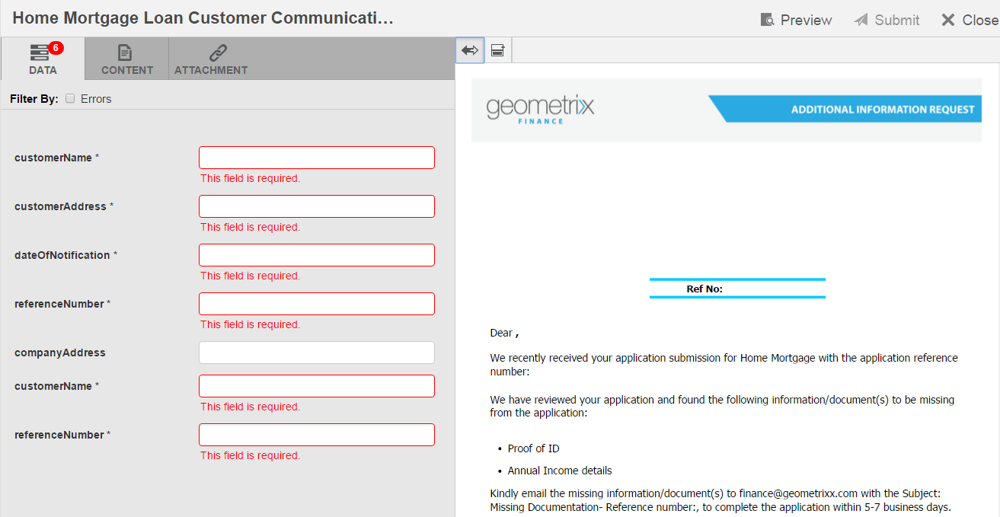

# Crea corrispondenza{#create-correspondence}

## Creare corrispondenza nell’interfaccia utente Crea corrispondenza {#create-correspondence-in-the-create-correspondence-user-interface}

Dopo un [il modello di lettera viene creato in Gestione corrispondenza](../../forms/using/create-letter.md), l’utente/agente/regolatore di attestazione può aprire la lettera nell’interfaccia utente Crea corrispondenza e creare una corrispondenza immettendo i dati, impostando il contenuto e gestendo gli allegati. Infine, l&#39;agente o il regolatore delle attestazioni può gestire il contenuto in modalità anteprima e inviare la lettera.

### Anteprima di una corrispondenza {#preview-a-correspondence}

Seleziona la lettera da visualizzare in anteprima seguendo la procedura seguente:

1. Nella pagina Lettere, tocca **Seleziona**.
1. Selezionare la lettera appropriata toccandola.

   

   Seleziona lettera

1. Per una lettera basata su dizionario dati, selezionare **Anteprima** > **Anteprima**. In alternativa, per una lettera non basata su dizionario dati, selezionare **Anteprima**. Puoi anche passare il cursore sopra una lettera (senza selezionarla) e toccare l’icona Anteprima lettera per visualizzarla in anteprima.

   >[!NOTE]
   >
   >Se un dizionario dati non è associato alla lettera, viene visualizzata l’anteprima della lettera. In caso contrario, se la lettera è basata su un dizionario dati, Gestione corrispondenza visualizza le opzioni Anteprima e Personalizzato nel menu Anteprima ed è possibile selezionare una delle due opzioni. È inoltre possibile associare i dati di test a un dizionario dati. Quando il [Al dizionario dati sono associati dati di test](../../forms/using/data-dictionary.md#p-working-with-test-data-p), quindi selezionando l’opzione di anteprima viene visualizzata l’anteprima normale con i dati di test compilati.

1. Per eseguire il rendering di una corrispondenza durante la visualizzazione in anteprima, devi essere un amministratore o far parte di uno dei seguenti gruppi:

   * utenti di forms (per visualizzare in anteprima sull’istanza dell’autore)
   * cm-agent-users (per rendering su istanza di pubblicazione)

   Se non disponi delle autorizzazioni necessarie, richiedi all&#39;amministratore l&#39;accesso appropriato. Per ulteriori informazioni sulla creazione e l’aggiunta di utenti ai gruppi, consulta [Aggiunta di utenti o gruppi a un gruppo](/help/sites-administering/security.md). Se tenti di eseguire il rendering di una corrispondenza senza disporre delle autorizzazioni appropriate, viene visualizzata la pagina di errore 404.

1. Se hai selezionato **Anteprima** > **Personalizzato**, viene visualizzata una finestra di dialogo. Nella finestra di dialogo, selezionare un file di dati corrispondente al dizionario dati per visualizzare in anteprima la lettera con e quindi selezionare **Anteprima**. Viene creato un file di dati basato su un dizionario dati per una lettera specifica. Per ulteriori informazioni sul file di dati, consulta [Dizionario dati](../../forms/using/data-dictionary.md#p-working-with-test-data-p).

   

1. Per impostazione predefinita, viene visualizzata l’anteprima della lettera di HTML (anteprima moduli mobile) con la scheda Dati attiva.

   Per ulteriori informazioni sui moduli per dispositivi mobili e sulle relative funzioni, consulta [Differenziazione delle funzioni tra Forms mobile e PDF forms](https://helpx.adobe.com/livecycle/help/mobile-forms/feature-differentiation-mobile-forms-pdf.html).

   Sono disponibili tre schede: dati, contenuto e allegati. Se non sono presenti elementi dati (variabili segnaposto e campi di layout), la lettera viene aperta direttamente con la scheda Contenuto visualizzata. La scheda Allegati è disponibile solo quando gli allegati sono presenti o l&#39;accesso alla libreria è abilitato.

   >[!NOTE]
   >
   >Per ulteriori informazioni sul passaggio tra la modalità di rendering di HTML o PDF nell’anteprima delle lettere, consulta [Modifica della modalità di rendering della lettera](#changerenditionmode). Per ulteriori informazioni sul supporto PDF in Gestione e AEM Corrispondenza, consulta [Interruzione dei plug-in del browser NPAPI e relativo impatto](https://helpx.adobe.com/aem-forms/kb/discontinuation-of-npapi-plugins-impact-on-aem-forms.html) e [PDF forms a HTML5 Forms](https://helpx.adobe.com/aem-forms/kb/pdf-forms-to-html5-forms.html).

### Immettere i dati {#enterdata}

Nella scheda Dati , compila i campi e i segnaposto di layout disponibili.

1. Immetti i dati e le variabili di contenuto nei campi come richiesto. Compila tutti i campi obbligatori contrassegnati da un asterisco (&#42;) per abilitare **Invia** pulsante .

   Toccare un valore del campo dati nell’anteprima della lettera di HTML per evidenziare il campo dati corrispondente nella scheda Dati.

    

### Gestione contenuto {#managecontent}

Nella scheda contenuto , gestisci il contenuto, ad esempio frammenti di documento e variabili di contenuto, nella lettera.

1. Seleziona **Contenuto**. Gestione corrispondenza visualizza la scheda del contenuto della lettera.

   

1. Modifica i moduli di contenuto, come necessario, nella scheda Contenuto . Per attivare il modulo di contenuto pertinente nella gerarchia dei contenuti, è possibile toccare la riga o il paragrafo pertinente nell’anteprima della lettera o toccare il modulo di contenuto direttamente nella gerarchia Contenuto.

   Ad esempio, la riga &quot;Abbiamo rivisto..&quot; viene selezionata nell’immagine seguente e il modulo di contenuto pertinente viene selezionato nella scheda Contenuto.

   

   Nella scheda Contenuto o Dati, tocca Evidenzia moduli selezionati ( ) in alto a sinistra nell’anteprima della lettera di HTML, è possibile disattivare o abilitare la funzionalità per passare al modulo contenuto/dati quando il testo, il paragrafo o il campo dati pertinente sono selezionati nell’anteprima della lettera.

   Per ulteriori informazioni sulle azioni disponibili per vari moduli nell’interfaccia utente Crea corrispondenza, vedi [Azioni e informazioni disponibili nell’interfaccia utente Crea corrispondenza](#actions-and-info-available-in-the-create-correspondence-content-tab).

1. Per individuare moduli di contenuto, utilizzare il campo Trova. Immetti il nome o il titolo completo o parziale del modulo di contenuto per cercarlo nella corrispondenza.
1. Tocca l’icona Visualizza ( ) davanti a un elenco, testo, condizione o area di destinazione per mostrarla o nasconderla nella lettera.
1. Per modificare un modulo di testo in linea o modificabile, tocca il relativo **Modifica** icona ( ) o fai doppio clic sul modulo di testo pertinente nell’anteprima della lettera.

   Il sistema visualizza un editor di testo per modificare e formattare il testo.

   Il correttore ortografico predefinito nel browser controlla l’ortografia nell’editor di testo. Per gestire il controllo ortografico e grammaticale, è possibile modificare le impostazioni del correttore ortografico del browser o installare plugin/addons del browser per il controllo ortografico e grammaticale.

   È inoltre possibile utilizzare le varie scelte rapide da tastiera nell’editor di testo per gestire, modificare e formattare il testo. Per ulteriori informazioni su [Editor di testo](/help/forms/using/keyboard-shortcuts.md#correspondence-management) scelte rapide da tastiera disponibili nelle scelte rapide da tastiera di Gestione corrispondenza.

   

   È possibile riutilizzare uno o più paragrafi di testo presenti in un&#39;altra applicazione del documento. È possibile copiare e incollare direttamente il testo, ad esempio da MS Word, pagine HTML o qualsiasi altra applicazione.

   È possibile copiare e incollare uno o più paragrafi di testo in un modulo di testo modificabile. Ad esempio, è possibile che si disponga di un documento di MS Word con un elenco puntato di prove di residenza accettabili, come riportato di seguito:

   

   È possibile copiare e incollare direttamente il testo dal documento di MS Word in un modulo di testo modificabile. La formattazione, ad esempio l’elenco puntato, il font e il colore del testo, viene mantenuta nel modulo di testo.

   

   >[!NOTE]
   >
   >La formattazione del testo incollato, tuttavia, ha alcuni [limitazioni](https://helpx.adobe.com/aem-forms/kb/cm-copy-paste-text-limitations.html).

   È possibile applicare un rientro al testo e ai numeri della lettera utilizzando il tasto Tab. Ad esempio, è possibile utilizzare il tasto Tab per allineare più colonne di testo in un elenco in un formato tabulare.

   

   Esempio: Uso del tasto Tab per allineare più colonne di testo in un formato tabulare

   >[!NOTE]
   >
   >Per ulteriori informazioni sull&#39;impostazione della tabulazione per i moduli di testo e le lettere, vedere [Ulteriori informazioni sull’utilizzo della spaziatura tra le tabulazioni per disporre il testo](https://helpx.adobe.com/aem-forms/kb/cm-tab-spacing-limitations.html).

1. Se necessario, inserire caratteri speciali nella corrispondenza. Ad esempio, è possibile utilizzare la palette Caratteri speciali per inserire:

   * Simboli di valuta come €,¥ e £
   * Simboli matematici come ∑, Ö, , e ^
   * Simboli di punteggiatura come ‟ e &quot;

   

   Gestione della corrispondenza ha integrato il supporto per 210 caratteri speciali. L&#39;amministratore può [aggiungi supporto per caratteri speciali più/personalizzati tramite personalizzazione](../../forms/using/custom-special-characters.md).

1. Per evidenziare\enfatizzare parti di testo in un modulo in linea modificabile, selezionate il testo e toccate Evidenzia colore.

   

   Puoi toccare direttamente un colore di base `**[A]**` presente nella palette Colori base o toccare **Seleziona** dopo aver utilizzato il cursore `**[B]**` per scegliere la tonalità appropriata del colore.

   Facoltativamente, puoi anche passare alla scheda Avanzate per selezionare la tonalità, la luminosità e la saturazione appropriate `**[C]**` per creare un colore preciso, tocca Seleziona `**[D]**` applicare il colore per evidenziare il testo.

   

1. Apporta le modifiche appropriate al contenuto e al formato e tocca **Salva**. Tocca ( ) per spostarsi tra i moduli di testo modificabili o toccare **Salva e successivo** per salvare le modifiche e passare al successivo modulo di testo modificabile.
1. Il sistema visualizza anche le variabili non compilate per ciascuno dei rami. In assenza di variabili non compilate, le variabili non compilate vengono visualizzate come 0. Se è presente una variabile non compilata, puoi toccare un ramo per espanderla e individuare la variabile non riempita. Utilizza la barra degli strumenti del contenuto per eliminare il contenuto, aumentare/diminuire il rientro del contenuto e inserire interruzioni di pagina prima/dopo il contenuto.

   È possibile inserire interruzioni di pagina sopra e sotto i moduli di dati anche quando fanno parte di elenchi e condizioni.

1. Tocca Apri/Chiudi variabile di contenuto ( ) per aprire le variabili di contenuto e compilarle in modo appropriato.
1. Una volta compilata correttamente la variabile non compilata, il conteggio della variabile non riempita è impostato su 0.

   Nell’interfaccia utente Crea corrispondenza, il conteggio delle variabili non compilate viene visualizzato a ogni livello della gerarchia di qualsiasi modulo che contiene almeno una variabile. Se un modulo contiene variabili non compilate, il conteggio viene visualizzato a livello di variabile, modulo, area di destinazione e modello di lettera.

   Il conteggio delle variabili non compilate include:

   * Solo variabili dizionario dati e segnaposto non protette. Il conteggio delle variabili non include variabili di layout o di dizionario dati protetti.
   * Campi obbligatori.
   * Layout dei campi se sono obbligatori e associati all’utente.
   * Solo istanze di variabili univoche. Se un modulo, un&#39;area di destinazione o un modello di lettera contiene due o più istanze della stessa variabile, il conteggio viene visualizzato come 1 (una). Tuttavia, per ciascuna istanza, il conteggio viene visualizzato come 1.

   Il conteggio delle variabili non compilate non include i moduli deselezionati. Se un modulo è incluso in un modello di lettera ma non è incluso nella lettera, il conteggio delle variabili non compilate in questo modulo non viene visualizzato.

   Per l&#39;area di destinazione, il modulo e la variabile il conteggio viene visualizzato a destra di ogni oggetto nel modello di lettera. Tuttavia, per il modello completo, il conteggio viene visualizzato nella barra di stato Crea corrispondenza .

   I moduli in un modello di lettera mostrano il conteggio delle variabili non compilate come descritto di seguito:

   * **Testo** Visualizza la somma delle variabili segnaposto univoche e degli elementi del dizionario dati contenuti nel modulo di testo.
   * **Condizione** Visualizza la somma delle variabili di condizione univoche non compilate contenute nella condizione e delle variabili contenute nei moduli risultanti.
   * **Elenco** Visualizza la somma di tutte le variabili univoche non compilate contenute nei moduli assegnati all’elenco.
   * **Area di destinazione** Visualizza la somma di tutte le variabili univoche non compilate contenute nei moduli assegnati all’area di destinazione.

   Per quanto riguarda le variabili con valori predefiniti, tieni presente quanto segue:

   * Per impostazione predefinita, un campo variabile booleano *false*. Tuttavia, la variabile viene considerata non compilata. Ciò implica che il conteggio delle variabili include tutti i campi delle variabili booleane con valore *false*.

   * Per impostazione predefinita, un campo di variabile numerica *0 (zero)*. Tuttavia, la variabile viene considerata non compilata. Ciò implica che il conteggio delle variabili include tutti i campi delle variabili numeriche con valore *0 (zero)*.

#### Azioni e informazioni disponibili nella scheda Crea contenuto corrispondenza {#actions-and-info-available-in-the-create-correspondence-content-tab}

**Area di destinazione**

* Inserisci linea vuota: Inserisce una nuova riga vuota.
* Inserisci testo in linea: Inserisce un nuovo modulo di testo.
* Blocco ordine (informazioni): Indica che l’ordine dei contenuti non può essere modificato.
* Valori non compilati (informazioni): Indica il numero di variabili non compilate nell’area di destinazione.

**Modulo**

* Selezione (icona occhio): Include\esclude il modulo dalla lettera.
* Skip Bullets (applicabile per i moduli di elenco e i loro moduli figlio): Ignora i punti elenco in un modulo specifico.
* Interruzione di pagina prima (applicabile per i moduli figlio dell’area di destinazione): Inserisce un’interruzione di pagina prima del modulo .
* Interruzione di pagina dopo (applicabile per i moduli figlio dell’area di destinazione): Inserisce un’interruzione di pagina prima del modulo .
* Valori non compilati (informazioni): Indica il numero di variabili non compilate nell’area di destinazione.
* Modifica (solo moduli di testo): Apri l’editor Rich Text per modificare il modulo di testo.
* Pannello dati (moduli di testo e condizione): Apri tutte le variabili del modulo.

**Modulo elenco**

* Inserisci linea vuota: Inserisce una nuova riga vuota.
* Libreria dei contenuti: Apre la libreria di contenuti per aggiungere moduli all’elenco.
* Impostazione elenco (solo elenco nidificato):
* Blocco ordine (informazioni): Indica che l’ordine degli elementi dell’elenco non può essere modificato.

### Gestire gli allegati {#manage-attachments}

1. Seleziona **Allegati**. Gestione corrispondenza visualizza gli allegati disponibili, come impostato durante la creazione del modello di lettera.
1. È possibile scegliere di non inviare un allegato insieme alla lettera toccando l&#39;icona di visualizzazione e toccando la croce nell&#39;allegato per eliminarla dalla lettera. Per gli allegati specificati, durante la creazione di un modello di lettera, come obbligatorio, le icone Visualizza ed Elimina sono disabilitate.
1. Tocca Accesso alla libreria ( ) per accedere alla libreria dei contenuti e inserire risorse DAM come allegati.

   >[!NOTE]
   >
   >L&#39;icona Accesso libreria è disponibile solo se è stato abilitato l&#39;accesso alla libreria durante la creazione della lettera.

1. Se l&#39;ordine degli allegati non è stato bloccato durante la creazione della corrispondenza, è possibile riordinare gli allegati selezionando un allegato e toccando le frecce verso il basso e verso l&#39;alto.

   Per ulteriori informazioni, consulta [Consegna degli allegati](#attachmentdelivery).

### Gestione del contenuto in anteprima e invio della lettera {#manage-content-in-preview-and-submit-the-letter}

È possibile apportare modifiche al layout e al contenuto per garantire che la lettera abbia l&#39;aspetto desiderato e inviarla ai vari processi post.

1. Per evidenziare tutti i contenuti modificabili nella lettera, tocca **Evidenzia sezioni modificabili**.

   Il contenuto modificabile della lettera viene evidenziato in grigio.

   

1. Modifica i moduli di contenuto, come necessario, nella scheda Contenuto . Per attivare il modulo di contenuto pertinente nella gerarchia dei contenuti, è possibile toccare la riga o il paragrafo pertinente nell’anteprima della lettera o toccare il modulo di contenuto direttamente nella gerarchia Contenuto.

   Ad esempio, la riga &quot;Per consentirci di accedere...&quot; è selezionato nell’immagine seguente e il modulo di contenuto corrispondente è selezionato nella scheda Contenuto .

   Tocca Evidenzia moduli selezionati nel contenuto ( ), è possibile disabilitare o abilitare la funzionalità per evidenziare il modulo di contenuto nella scheda Contenuto quando il testo, il paragrafo o il campo dati pertinente vengono toccati nell’anteprima della lettera.

   Per ulteriori informazioni sulle azioni disponibili per vari moduli nell’interfaccia utente Crea corrispondenza, vedi [Azioni e informazioni disponibili nell’interfaccia utente Crea corrispondenza](#actions-and-info-available-in-the-create-correspondence-content-tab).

1. Per aggiungere un’interruzione di pagina alla lettera, toccare il punto in cui si desidera inserire un’interruzione di pagina e selezionare Interruzione di pagina prima o Interruzione di pagina dopo ( ).

   Nella lettera viene inserito un segnaposto di interruzione di pagina esplicito. Per vedere in che modo un’interruzione di pagina esplicita influisce sulla lettera, vedere l’anteprima di PDF appiattita.

   >[!NOTE]
   >
   >Poiché i moduli mobili non supportano le interruzioni di pagina, le intestazioni e i piè di pagina vengono visualizzati una sola volta. Tuttavia, è possibile impostare esplicitamente intestazioni e piè di pagina nel layout (per pagina) affinché vengano visualizzati nell’anteprima dei moduli mobili. Inoltre, le eventuali pagine vuote nella lettera non vengono visualizzate nell’anteprima dei moduli mobile.

   

1. Per salvare la lettera come bozza, su cui puoi continuare a lavorare in un secondo momento, tocca Salva come bozza. Per utilizzare questa opzione, la lettera deve essere [pubblicato](../../forms/using/publishing-unpublishing-forms.md#publishanasset). Per ulteriori informazioni, consulta la sezione Bozza istanza in [Salvataggio di bozze e invio di istanze di lettere](#savingdrafts).

   

   Viene visualizzata la finestra di dialogo Bozza nome lettera con l’ID istanza lettera. Facoltativamente, puoi modificare questo ID. Prendi nota dell&#39;ID lettera e tocca **Fine**. In seguito, puoi utilizzare questo ID per [ricarica la bozza di lettera](submit-letter-topostprocess.md#reloaddraft).

1. Per visualizzare in anteprima la lettera come PDF appiattito con il layout esatto e le interruzioni di pagina durante l’invio, tocca ( ) Anteprima.

   La lettera viene visualizzata come un PDF appiattito. Il PDF appiattito è la rappresentazione esatta della lettera in quanto verrà inviata con i caratteri, le interruzioni e il layout corretti della lettera.

   >[!NOTE]
   >
   >Se utilizzi il tipo di rendering Mozilla Firefox e HTML, per visualizzare in anteprima la lettera come PDF appiattito, assicurati di utilizzare il plug-in nativo del browser e non il plug-in Acrobat. Per selezionare il plug-in del browser nativo, vai alle impostazioni di Mozilla Firefox e, per il tipo di contenuto PDF, seleziona Anteprima in Firefox.

1. Se l’anteprima di PDF appiattita è soddisfacente, tocca **Invia** per inviare la lettera. Oppure, per apportare modifiche alla lettera, tocca **Esci da anteprima** per tornare all’anteprima dell’interfaccia utente Crea corrispondenza della lettera per apportare modifiche alla lettera. Quando tocchi Invia, se la configurazione Gestisci istanza lettera è abilitata nell’istanza Pubblica , viene generata l’istanza di invio lettera.

   Per ulteriori informazioni, vedere Istanza bozza in Salvataggio di bozze e invio di istanze di lettere.

   È inoltre possibile salvare la lettera come bozza per apportare successivamente modifiche alla lettera.

   Dopo aver apportato le modifiche necessarie, è possibile inviare la lettera dall’anteprima di HTML5 oppure toccare di nuovo Anteprima per esaminare l’output di PDF appiattito.

   Per informazioni sulle differenze tra moduli e PDF forms di HTML5, consultare [Differenziazione delle funzioni tra moduli e PDF forms di HTML5](../../forms/using/feature-differentiation-html5-forms-pdf-forms.md).

## Salvataggio di bozze e invio di istanze di lettere {#savingdrafts}

Quando viene eseguito il rendering di una lettera nell’interfaccia utente Crea corrispondenza, è possibile salvare la lettera come visualizzata.

È possibile salvare due tipi di istanze di lettera: Istanza di bozza e di invio.

* **Istanza bozza**: L&#39;istanza Bozza acquisisce lo stato corrente della lettera che stai visualizzando in anteprima. Per salvare una bozza di istanza, assicurarsi innanzitutto che la lettera e tutte le risorse a cui fa riferimento la lettera siano in stato Pubblicato. Per informazioni sulla pubblicazione di una lettera, consulta [Pubblicare una risorsa](../../forms/using/publishing-unpublishing-forms.md#publishanasset). È necessario pubblicare una lettera prima di salvarla come bozza, perché quando si pubblica una lettera, a quel punto si crea una versione della lettera, delle relative risorse dipendenti e dei dati. La versione pubblicata di una lettera non può essere modificata da te o da un altro utente e può essere ripristinata in un secondo momento senza inaspettate discrepanze dalla versione pubblicata. Puoi tornare a questa istanza in un secondo momento e continuare da dove sei andato.

* **Invia istanza**: Le istanze di invio acquisiscono lo stato della lettera durante l’invio. L’istanza di invio memorizza lo stato PDF dell’istanza della lettera dopo essere stata post elaborata insieme ai dati immessi dall’utente nell’interfaccia utente Crea corrispondenza .

Tali istanze possono essere salvate solo quando la lettera viene visualizzata sull&#39;istanza di pubblicazione. Per impostazione predefinita, il salvataggio sulle istanze è disattivato. Per abilitare il salvataggio delle istanze di lettere, eseguire le operazioni seguenti.

1. In AEM, apri Configurazione console Web Adobe Experience Manager per il server utilizzando il seguente URL: https://&lt;server>:&lt;port>/&lt;contextpath>/system/console/configMgr
1. Individua **[!UICONTROL Configurazioni di gestione della corrispondenza]** e fai clic su di esso.
1. Controlla **[!UICONTROL Gestisci istanze lettera su pubblicazione]** configurazione e quindi fai clic su **[!UICONTROL Salva]**.

### Abilita salvataggio della bozza {#enable-save-draft-feature}

Prima di pubblicare lettere o salvare bozze nell’istanza di pubblicazione, esegui i seguenti passaggi sull’istanza di authoring e pubblicazione per abilitare la funzione Salva come bozza:

La *cq:lastReplicationAction*, *cq:lastreplicate* e *cq:lastReplicatedBy* per impostazione predefinita, le proprietà non vengono riportate nell&#39;istanza di pubblicazione. Per il riporto *cq:lastReplicationAction*, *cq:lastreplicate* e *cq:lastReplicatedBy* proprietà per pubblicare l&#39;istanza, disattivare il [!UICONTROL com.day.cq.replication.impl.ReplicationPropertiesFilterFactory] componente. Per disattivare il componente:

1. Nell’istanza di authoring, apri la console Componenti web di Adobe Experience Manager. L’URL predefinito è `http://author-server:port/system/console/components`

1. Cerca il **[!UICONTROL com.day.cq.replication.impl.ReplicationPropertiesFilterFactory]** componente.

1. Fai clic su  per disabilitare [!UICONTROL com.day.cq.replication.impl.ReplicationPropertiesFilterFactory] componente.

Per abilitare la funzione Salva come bozza, sostituisci l’URL esistente in [!UICONTROL URL autore VersionRestoreManager] con l’URL dell’istanza di authoring. Per sostituire l’URL:

1. Nell’istanza di pubblicazione, apri [!UICONTROL Configurazione della console Web di Aode Manager]. L’URL predefinito è `https://publish-server:port/system/console/configMgr`

1. Cerca e apri le **[!UICONTROL Gestione della corrispondenza - Configurazioni di ripristino della versione dell&#39;istanza dell&#39;autore]** componente.

1. Individua il **[!UICONTROL URL autore VersionRestoreManager]** e specifica l’URL per l’istanza di authoring.

1. Fai clic su Salva.

Quando il salvataggio delle istanze di lettera è attivato, è possibile selezionare la posizione in cui salvare le istanze di lettera. Sono disponibili due opzioni per salvare le istanze di lettera: Salvataggio locale o salvataggio remoto.

### Salvataggio locale {#local-save}

Le istanze di lettera vengono salvate nell&#39;istanza di pubblicazione e vengono replicate all&#39;inverso nell&#39;istanza di authoring.

### Salvataggio remoto {#remote-save}

Questa opzione esiste per le persone che hanno dei dubbi sul salvataggio dei dati utente sulle istanze di pubblicazione, che in genere si verificano al di fuori del firewall aziendale. Quando il salvataggio remoto è attivato, le istanze di lettera non vengono salvate nell’istanza di pubblicazione, ma vengono salvate in remoto nell’istanza di elaborazione specificata tramite le configurazioni SDK client di LiveCycle.

#### Abilita salvataggio remoto {#enable-remote-save}

1. In AEM, apri Configurazione console Web Adobe Experience Manager per il server utilizzando il seguente URL: `https://<server>:<port>/<contextpath>/system/console/configMgr`
1. Cerca **[!UICONTROL Configurazioni di gestione della corrispondenza]** e fai clic su di esso.
1. Individua il **[!UICONTROL Salvataggio remoto]** configurazione, verifica e fai clic su **[!UICONTROL Salva]**.

#### Specificare le impostazioni dell&#39;autore di elaborazione {#specify-processing-author-settings}

1. In AEM, apri Configurazione console Web Adobe Experience Manager per il server utilizzando il seguente URL: `https://<server>:<port>/system/console/configMgr`

   

1. In questa pagina, individua la configurazione Adobe LiveCycle Client SDK e espandila facendo clic su di essa.

1. Nell’URL del server di elaborazione, immetti il nome del server di LiveCycle, fornisci le informazioni di accesso e fai clic su **Salva**.

   

1. Se necessario, impostare il nome utente e la password con cui si desidera accedere al server.

#### Consegna degli allegati {#attachmentdelivery}

* Gli allegati alle lettere sono disponibili nella fase di post in PDF, che viene creata dopo l’invio delle lettere.
* Quando viene eseguito il rendering della lettera utilizzando API lato server come PDF interattivo o non interattivo, PDF renderizzato contiene allegati come allegati di PDF.
* Quando un processo post associato a un modello di lettera viene caricato come parte delle operazioni di invio o completamento della corrispondenza utilizzando l&#39;interfaccia utente Crea corrispondenza, gli allegati vengono passati come elenco&lt;com.adobe.idp.document> nel parametro AttachmentDocs .
* I meccanismi di consegna preconfigurati, come e-mail e stampa, distribuiscono anche allegati insieme al PDF della corrispondenza generata.

## Modalità di rappresentazione dell&#39;anteprima della lettera: Anteprima e anteprima dei moduli mobile e PDF {#rendition-modes-of-letter-preview-mobile-forms-preview-and-pdf-preview}

AEM Forms Correspondence Management visualizza una lettera come HTML nell&#39;interfaccia utente Crea corrispondenza. Tuttavia, Gestione della corrispondenza supporta ancora il ripristino dell’anteprima di PDF invece dell’anteprima di HTML. Per ulteriori informazioni sul passaggio tra la modalità di anteprima di HTML e PDF, consulta [Modifica della modalità di rendering della lettera](#changerenditionmode).

Di seguito sono riportati i vantaggi e le funzionalità disponibili nell’anteprima di HTML e PDF.

**Vantaggi dei moduli mobili/anteprima di HTML**

* **Toccare un valore del campo dati per evidenziare il campo dati corrispondente**: Nell’interfaccia utente Crea corrispondenza , puoi toccare un valore del campo dati nella lettera per evidenziare il campo dati corrispondente nella scheda Dati . Per ulteriori informazioni, consulta [Immettere i dati](#enterdata).

* **Supporto browser**: I browser rimuovono gradualmente il supporto per NPAPI, il che influisce sull’anteprima PDF della lettera. L’anteprima della lettera nei moduli HTML/mobile non è interessata da questo problema.
* **Evidenziare contenuto modificabile in una lettera**: Nell’interfaccia utente Crea corrispondenza , puoi toccare Evidenzia contenuto modificabile per evidenziare in grigio tutti i contenuti modificabili presenti nella lettera. Per ulteriori informazioni, consulta [Gestire il contenuto](#managecontent).

`<li>` `<li>Benefits of HTML preview  <ul>   <li>Right to left</li>   <li>NPAPI</li>   <li>Highlight Editable Content</li>  </ul> </li>` `<li>Benefits of PDF preview  <ul>   <li>Page Break</li>   <li>Final Preview</li>  </ul> </li>`
`<li>` `<li>Benefits of HTML preview  <ul>   <li>Right to left</li>   <li>NPAPI</li>   <li>Highlight Editable Content</li>  </ul> </li>` `<li>Benefits of PDF preview  <ul>   <li>Page Break</li>   <li>Final Preview</li>  </ul> </li>`  **Vantaggi dell’anteprima di PDF**

* **Interruzione di pagina**: Nell’anteprima di PDF è possibile visualizzare esattamente come le interruzioni di pagina nella lettera influiscono sul relativo output.
* **Anteprima finale**: Nell’anteprima di PDF è possibile visualizzare la formattazione e l’aspetto esatti della lettera così come la lettera verrà visualizzata nell’output.

Per informazioni sul supporto degli script nei PDF forms, consultare [Supporto per gli script](https://help.adobe.com/en_US/livecycle/11.0/ScriptingSupport/index.html).

Per ulteriori informazioni sul supporto degli script nei moduli di HTML5, consultare [Supporto degli script per i moduli HTML5](/help/forms/using/scripting-support.md).

### Modifica della modalità di rendering della lettera {#changerenditionmode}

Per impostazione predefinita, l’interfaccia utente Crea corrispondenza utilizza i moduli HTML o mobili per eseguire il rendering dell’anteprima della lettera. L’anteprima dei moduli mobili non presenta problemi di rendering in alcun browser, in quanto utilizza il plug-in nativo del browser e non richiede plug-in aggiuntivi. È possibile modificare la modalità di anteprima della lettera in PDF. Tuttavia, i vincoli del browser possono creare problemi per diverse funzioni dell’anteprima interattiva PDF della lettera.

Per ulteriori informazioni sulla compatibilità del browser con l’anteprima delle lettere, consulta [Interruzione dei plug-in del browser NPAPI e relativo impatto](https://helpx.adobe.com/aem-forms/kb/discontinuation-of-npapi-plugins-impact-on-aem-forms.html).

Per modificare la modalità di anteprima della lettera, completa i seguenti passaggi:

1. Vai a `https://[system]:'port'/system/console/configMgr` e, se necessario, accedi come amministratore.
1. Vai a **[!UICONTROL Configurazioni di gestione della corrispondenza]** > **[!UICONTROL Tipo di rappresentazione]** e seleziona **Rendering di HTML** (Predefinito) o **Rendering di PDF**.
1. Fai clic su **[!UICONTROL Salva]**.
