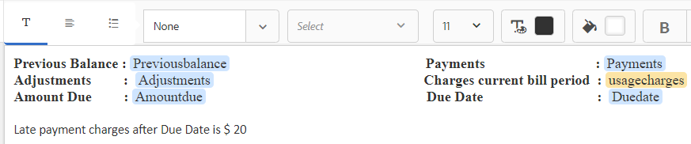

# Tutorial: creare frammenti di documento{#tutorial-create-document-fragments}

Questo tutorial è un passaggio della serie [Crea la tua prima comunicazione interattiva](/help/forms/using/create-your-first-interactive-communication.md). Adobe consiglia di seguire la serie in sequenza cronologica per comprendere, eseguire e dimostrare il caso di utilizzo completo dell’esercitazione.

I frammenti di documento sono componenti riutilizzabili di una corrispondenza utilizzati per comporre una comunicazione interattiva. I frammenti di documento sono dei seguenti tipi:

* Testo: una risorsa di testo è un contenuto costituito da uno o più paragrafi di testo. Un paragrafo può essere statico o dinamico.
* Elenco: l’elenco è un gruppo di frammenti di documento, inclusi testo, elenchi, condizioni e immagini.
* Condizione: le condizioni ti consentono di definire quale contenuto viene incluso nella comunicazione interattiva in base ai dati ricevuti dal modello di dati del modulo.

Questo tutorial illustra i passaggi necessari per creare più frammenti di documenti di testo in base all&#39;anatomia fornita nella sezione [Pianificare la comunicazione interattiva](/help/forms/using/planning-interactive-communications.md). Al termine di questa esercitazione, dovresti essere in grado di effettuare le seguenti operazioni:

* Creare frammenti di documenti
* Creare le variabili
* Creare e applicare regole

Di seguito è riportato l’elenco dei frammenti di documento creati in questa esercitazione:

* [Dettagli fattura](../../forms/using/create-document-fragments.md#step-create-bill-details-text-document-fragment)
* [Dettagli cliente](../../forms/using/create-document-fragments.md#step-create-customer-details-text-document-fragment)
* [Riepilogo fatture](../../forms/using/create-document-fragments.md#step-create-bill-summary-text-document-fragment)
* [Riepilogo delle spese](../../forms/using/create-document-fragments.md#step-create-summary-of-charges-text-document-fragment)

Ogni frammento di documento include campi con testo statico, dati ricevuti dal modello dati del modulo e dati immessi tramite l’interfaccia utente dell’agente. Tutti questi campi sono stati rappresentati nella sezione [Pianificare la comunicazione interattiva](/help/forms/using/planning-interactive-communications.md).

Durante la creazione di frammenti di documento in questa esercitazione, vengono create variabili per i campi che ricevono dati tramite l’interfaccia utente dell’agente.

Utilizza **FDM_Create_First_IC**, come descritto nella sezione [Creare un modello di dati modulo](../../forms/using/create-form-data-model0.md), come modello di dati modulo per creare frammenti di documento in questa esercitazione.

## Passaggio 1: creare un frammento di documento di testo di dettagli fattura {#step-create-bill-details-text-document-fragment}

Il frammento del documento Dettagli distinta include i campi riportati di seguito.

| Campo | Origine dati |
|---|---|
| N. fattura | Interfaccia utente agente |
| Periodo di fatturazione | Interfaccia utente agente |
| Data di fatturazione | Interfaccia utente agente |
| Il piano | Modello dati modulo |

Per creare variabili per i campi con l’interfaccia utente agente come origine dati, creare testo statico e utilizzare gli elementi del modello dati modulo nel frammento di documento, effettua le seguenti operazioni:

1. Seleziona **[!UICONTROL Forms]** > **[!UICONTROL Frammenti di documento]**.

1. Selezionare **Crea** > **Testo**.
1. Specifica le seguenti informazioni:

   1. Immetti **bill_details_first_ic** come nome nel campo **Title**. Il titolo viene popolato automaticamente nel campo **Name**.

   1. Seleziona **Modello dati modulo** dalla sezione **Modello dati**.

   1. Seleziona **FDM_Create_First_IC** come modello dati del modulo e seleziona **Seleziona**.

   1. Seleziona **Avanti**.

1. Selezionare la scheda **Variabili** nel riquadro a sinistra e selezionare **Crea**.
1. Nella sezione **Crea variabile**:

   1. Immetti **Invoicenumber** come nome della variabile.
   1. Seleziona **Stringa** come tipo.
   1. Seleziona **Crea**.

   

   Ripeti i passaggi 4 e 5 per creare le seguenti variabili:

   * Billperiod: tipo di stringa
   * Data fatturazione: tipo di data

   

1. Crea testo statico per i campi seguenti utilizzando il riquadro di destra:

   * N. fattura
   * Periodo di fatturazione
   * Data di fatturazione
   * Il piano

   

1. Posizionare il cursore accanto al campo **Fattura n.** e fare doppio clic sulla variabile **NumeroFattura** dalla scheda **Variabili** nel riquadro a sinistra.
1. Posizionare il cursore accanto al campo **Periodo fatturazione** e fare doppio clic sulla variabile **Billperiod**.
1. Posizionare il cursore accanto al campo **Data fattura** e fare doppio clic sulla variabile **Data fattura**.
1. Selezionare la scheda **Oggetti modello dati** nel riquadro sinistro.
1. Posizionare il cursore accanto al campo **Piano** e fare doppio clic sulla proprietà **cliente** > **customerplan**.

   

1. Fare clic su **Salva** per creare il frammento del documento di testo Dettagli fattura.

## Passaggio 2: creare un frammento del documento di testo dei dettagli del cliente {#step-create-customer-details-text-document-fragment}

Il frammento del documento Dettagli cliente include i campi seguenti:

| Campo | Origine dati |
|---|---|
| Nome cliente | Modello dati modulo |
| Indirizzo | Modello dati modulo |
| Luogo della prestazione | Interfaccia utente agente |
| Codice stato | Interfaccia utente agente |
| Numero cellulare | Modello dati modulo |
| Numero di contatto alternativo | Modello dati modulo |
| Numero di relazione | Modello dati modulo |
| Numero di connessioni | Interfaccia utente agente |

Per creare variabili per i campi con l’interfaccia utente agente come origine dati, creare testo statico e utilizzare gli elementi del modello dati modulo nel frammento di documento, effettua le seguenti operazioni:

1. Seleziona **[!UICONTROL Forms]** > **[!UICONTROL Frammenti di documento]**.
1. Selezionare **Crea** > **Testo**.
1. Specifica le seguenti informazioni:

   1. Immetti **customer_details_first_ic** come nome nel campo **Title**. Il titolo viene popolato automaticamente nel campo **Name**.

   1. Seleziona **Modello dati modulo** dalla sezione **Modello dati**.

   1. Seleziona **FDM_Create_First_IC** come modello dati del modulo e seleziona **Seleziona**.

   1. Seleziona **Avanti**.

1. Selezionare la scheda **Variabili** nel riquadro a sinistra e selezionare **Crea**.
1. Nella sezione **Crea variabile**:

   1. Immetti **Placesupply** come nome della variabile.
   1. Seleziona **Stringa** come tipo.
   1. Seleziona **Crea**.

   Ripeti i passaggi 4 e 5 per creare le seguenti variabili:

   * Codice stato: tipo di numero
   * Numberconnections: tipo di numero

1. Selezionare la scheda **Oggetti modello dati**, posizionare il cursore nel riquadro di destra e fare doppio clic sulla proprietà **customer** > **name**.
1. Premi Invio per spostare il cursore alla riga successiva e fai doppio clic sulla proprietà **cliente** > **indirizzo**.
1. Crea testo statico per i campi seguenti utilizzando il riquadro di destra:

   * Numero cellulare
   * Numero di contatto alternativo
   * Luogo della prestazione
   * Numero di relazione
   * Codice stato
   * Numero di connessioni

   

1. Posizionare il cursore accanto al campo **Mobile Number** e fare doppio clic sulla proprietà **customer** > **mobilenum**.
1. Posizionare il cursore accanto al campo **Numero contatto alternativo** e fare doppio clic sulla proprietà **&#x200B; cliente** > **alternatemobilenumber**.
1. Posizionare il cursore accanto al campo **Numero relazione** e fare doppio clic sulla proprietà **cliente** > **numero relazione**.
1. Selezionare la scheda **Variabili**, posizionare il cursore accanto al campo **Luogo di fornitura** e fare doppio clic sulla variabile **Fornitura**.
1. Posizionare il cursore accanto al campo **Codice stato** e fare doppio clic sulla variabile **Codice stato**.
1. Posizionare il cursore accanto al campo **Numero di connessioni** e fare doppio clic sulla variabile **Numberconnections**.

   

1. Fai clic su **Salva** per creare il frammento del documento di testo Dettagli cliente.

## Passaggio 3: creare un frammento di documento di riepilogo delle fatture {#step-create-bill-summary-text-document-fragment}

Il frammento del documento Sintetico distinta include i campi riportati di seguito.

| Campo | Origine dati |
|---|---|
| Saldo precedente | Interfaccia utente agente |
| Pagamenti | Interfaccia utente agente |
| Adeguamenti | Interfaccia utente agente |
| Addebiti periodo di fatturazione corrente | Modello dati modulo |
| Importo dovuto | Interfaccia utente agente |
| Data di scadenza | Interfaccia utente agente |

Per creare variabili per i campi con l’interfaccia utente agente come origine dati, creare testo statico e utilizzare gli elementi del modello dati modulo nel frammento di documento, effettua le seguenti operazioni:

1. Seleziona **[!UICONTROL Forms]** > **[!UICONTROL Frammenti di documento]**.
1. Selezionare **Crea** > **Testo**.
1. Specifica le seguenti informazioni:

   1. Immetti **bill_summary_first_ic** come nome nel campo **Titolo**. Il titolo viene popolato automaticamente nel campo **Name**.

   1. Seleziona **Modello dati modulo** dalla sezione **Modello dati**.

   1. Seleziona **FDM_Create_First_IC** come modello dati del modulo e seleziona **Seleziona**.

   1. Seleziona **Avanti**.

1. Selezionare la scheda **Variabili** nel riquadro a sinistra e selezionare **Crea**.
1. Nella sezione **Crea variabile**:

   1. Immetti **Saldo precedente** come nome della variabile.
   1. Seleziona **Numero** come tipo.
   1. Seleziona **Crea**.

   Ripeti i passaggi 4 e 5 per creare le seguenti variabili:

   * Pagamenti: tipo di numero
   * Adeguamenti: tipo di numero
   * Importo: tipo di numero
   * Data scadenza: tipo di data

1. Crea testo statico per i campi seguenti utilizzando il riquadro di destra:

   * Saldo precedente
   * Pagamenti
   * Adeguamenti
   * Addebiti periodo di fatturazione corrente
   * Importo dovuto
   * Data di scadenza
   * Le spese di pagamento in ritardo dopo la data di scadenza sono di $ 20

   

1. Posizionare il cursore accanto al campo **Saldo precedente** e fare doppio clic sulla variabile **Saldo precedente**.
1. Posizionare il cursore accanto al campo **Pagamenti** e fare doppio clic sulla variabile **Pagamenti**.
1. Posizionare il cursore accanto al campo **Adeguamenti** e fare doppio clic sulla variabile **Adeguamenti**.
1. Posizionare il cursore accanto al campo **Importo dovuto** e fare doppio clic sulla variabile **Importo dovuto**.
1. Posizionare il cursore accanto al campo **Data di scadenza** e fare doppio clic sulla variabile **Data di scadenza**.
1. Selezionare la scheda **Oggetti modello dati**, posizionare il cursore accanto al campo **Addebiti periodo fatturazione corrente** nel riquadro di destra e fare doppio clic sulla proprietà **effetti** > **addebiti utili**.

   

1. Fai clic su **Salva** per creare il frammento del documento di testo Dettagli cliente.

## Passaggio 4: creare un frammento di documento di testo riepilogo spese {#step-create-summary-of-charges-text-document-fragment}

Il frammento del documento Riepilogo spese include i campi riportati di seguito.

| Campo | Origine dati |
|---|---|
| Spese di chiamata | Modello dati modulo |
| Spese di conferenza telefonica | Modello dati modulo |
| Spese SMS | Modello dati modulo |
| Tariffe Internet mobile | Modello dati modulo |
| Tariffe nazionali di roaming | Modello dati modulo |
| Tariffe di roaming internazionale | Modello dati modulo |
| Spese per servizi a valore aggiunto | Modello dati modulo |
| Oneri totali | Modello dati modulo |
| TOTALE DA PAGARE | Modello dati modulo |

Per creare testo statico e utilizzare gli elementi del modello dati modulo nel frammento di documento, effettuare le seguenti operazioni:

1. Seleziona **[!UICONTROL Forms]** > **[!UICONTROL Frammenti di documento]**.
1. Selezionare **Crea** > **Testo**.
1. Specifica le seguenti informazioni:

   1. Immetti **summary_charge_first_ic** come nome nel campo **Title**. Il titolo viene compilato automaticamente nel campo Nome.

   1. Seleziona **Modello dati modulo** dalla sezione **Modello dati**.

   1. Seleziona **FDM_Create_First_IC** come modello dati del modulo e seleziona **Seleziona**.

   1. Seleziona **Avanti**.

1. Crea testo statico per i campi seguenti utilizzando il riquadro di destra:

   * Spese di chiamata
   * Spese di conferenza telefonica
   * Spese SMS
   * Tariffe Internet mobile
   * Tariffe nazionali di roaming
   * Tariffe di roaming internazionale
   * Spese per servizi a valore aggiunto
   * Oneri totali
   * TOTALE DA PAGARE

   

1. Selezionare la scheda **Oggetti modello dati**.
1. Posizionare il cursore accanto al campo **Spese di chiamata** e fare doppio clic sulla proprietà **fatture** > **spese di chiamata**.
1. Posizionare il cursore accanto al campo **Spese conferenza telefonica** e fare doppio clic sulla proprietà **fatture** > **spese conferenza**.
1. Posiziona il cursore accanto al campo **Spese SMS** e fai doppio clic sulla proprietà **fatture** > **spese SMS**.
1. Posizionare il cursore accanto al campo **Tariffe Internet Mobile** e fare doppio clic sulla proprietà **bills** > **internetcharge**.
1. Posizionare il cursore accanto al campo **Tariffe nazionali di roaming** e fare doppio clic sulla proprietà **bills** > **roamingnational**.
1. Posizionare il cursore accanto al campo **Tariffe di roaming internazionali** e fare doppio clic sulla proprietà **bills** > **roamingintl**.
1. Posizionare il cursore accanto al campo **Spese servizi aggiunti** e fare doppio clic sulla proprietà **distinte** > **vas**.
1. Posizionare il cursore accanto al campo **Spese totali** e fare doppio clic sulla proprietà **fatture** > **spese d&#39;uso**.
1. Posizionare il cursore accanto al campo **TOTAL PAYABLE** e fare doppio clic sulla proprietà **bills** > **usagecharge**.

   

1. Selezionare il testo nella riga **Spese per servizi aggiunti** e selezionare **Crea regola** per creare una condizione in base alla quale visualizzare la riga nella comunicazione interattiva:
1. Nella finestra popup **Crea regola**:

   1. Seleziona **Modelli dati e variabili**, quindi **fatture** > **spese di connessione**.

   1. Seleziona **è minore di** come operatore.
   1. Seleziona **Numero** e immetti il valore come **60**.

   In base a questa condizione, la riga Spese servizi a valore aggiunto viene visualizzata solo se il valore del campo Spese di chiamata è inferiore a 60.

   

1. Fai clic su **Salva** per creare il frammento del documento di testo del riepilogo delle spese.
