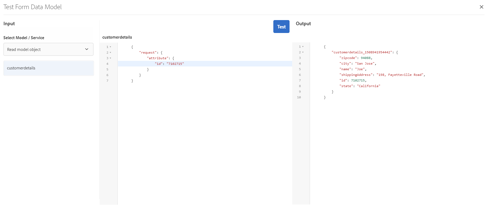

# Tutorial: creare un modello di dati modulo {#tutorial-create-form-data-model}

Questo tutorial è un passaggio del [Creare il primo modulo adattivo](../../forms/using/create-your-first-adaptive-form.md) serie. L’Adobe consiglia di seguire la serie in sequenza cronologica per comprendere, eseguire e dimostrare il caso di utilizzo completo dell’esercitazione.

## Informazioni sull’esercitazione {#about-the-tutorial}

AEM [!DNL Forms] il modulo di integrazione dei dati consente di creare un modello di dati modulo da diverse origini dati back-end, come il profilo utente AEM, i servizi web RESTful, i servizi web basati su SOAP, i servizi OData e i database relazionali. È possibile configurare oggetti e servizi del modello dati in un modello dati del modulo e associarlo a un modulo adattivo. I campi del modulo adattivo sono associati alle proprietà dell’oggetto modello dati. I servizi consentono di precompilare il modulo adattivo e riscrivere i dati del modulo inviato nell’oggetto modello dati.

Per ulteriori informazioni sull’integrazione dei dati dei moduli e sul modello di dati dei moduli, consulta [Integrazione dei dati di AEM Forms](../../forms/using/data-integration.md).

Questo tutorial illustra i passaggi necessari per preparare, creare, configurare e associare un modello di dati modulo a un modulo adattivo. Al termine di questa esercitazione, sarai in grado di:

* [Configura database MySQL come origine dati](#config-database)
* [Crea modello dati modulo tramite database MySQL](#create-fdm)
* [Configura modello dati modulo](#config-fdm)
* [Test modello dati modulo](#test-fdm)

Il modello dati del modulo sarà simile al seguente:

**R.** Origini dati configurate **B.** Schemi di origini dati **C.** Servizi disponibili **D.** Oggetti modello dati **E.** Servizi configurati

## Prerequisiti {#prerequisites}

Prima di iniziare, assicurati di disporre dei seguenti elementi:

* [!DNL MySQL] database con dati di esempio come indicato nella sezione Prerequisiti di [Creare il primo modulo adattivo](../../forms/using/create-your-first-adaptive-form.md)
* Pacchetto OSGi per [!DNL MySQL] Driver JDBC come spiegato in [Bundling del driver di database JDBC](/help/sites-developing/jdbc.md#bundling-the-jdbc-database-driver)
* Modulo adattivo come spiegato nella prima esercitazione [Creare un modulo adattivo](/help/forms/using/create-adaptive-form.md)

## Passaggio 1: configurare il database MySQL come origine dati {#config-database}

È possibile configurare diversi tipi di origini dati per creare un modello dati del modulo. Per questa esercitazione, configurare il database MySQL configurato e popolato con dati di esempio. Per informazioni sulle altre origini dati supportate e su come configurarle, consulta [Integrazione dei dati di AEM Forms](../../forms/using/data-integration.md).

Per configurare il [!DNL MySQL] database:

1. Installa il driver JDBC per [!DNL MySQL] il database come bundle OSGi:

   1. Scarica [!DNL MySQL] JDBC Driver OSGi Bundle da `http://www.java2s.com/ref/jar/download-orgosgiservicejdbc100jar-file.html`. <!-- This URL is an insecure link but using https is not possible -->
   1. Accedere a AEM [!DNL Forms] Crea istanza come amministratore e vai ai bundle della console web AEM. L’URL predefinito è [https://localhost:4502/system/console/bundles](https://localhost:4502/system/console/bundles).

   1. Seleziona **[!UICONTROL Installa/Aggiorna]**. Un [!UICONTROL Caricare/Installare i bundle] viene visualizzata.

   1. Seleziona **[!UICONTROL Scegli file]** per esplorare e selezionare [!DNL MySQL] Pacchetto OSGi del driver JDBC. Seleziona **[!UICONTROL Bundle iniziale]** e **[!UICONTROL Aggiorna pacchetti]**, e seleziona **[!UICONTROL Installare o aggiornare]**. Assicurati che il [!DNL Oracle Corporation's] driver JDBC per [!DNL MySQL] sia attivo. Il driver è installato.

1. Configurare [!DNL MySQL] il database come origine dati:

   1. Vai a AEM console Web all&#39;indirizzo [https://localhost:4502/system/console/configMgr](https://localhost:4502/system/console/configMgr).
   1. Individua **la configurazione Apache Sling Connection Pooled DataSource** . Selezionare questa opzione per aprire la configurazione in modalità di modifica.
   1. Nella finestra di dialogo di configurazione, specifica i dettagli seguenti:

      * **Nome origine dati:** È possibile specificare qualsiasi nome. Ad esempio, specifica **WeRetailMySQL**.
      * **Nome proprietà servizio DataSource**: specifica il nome della proprietà del servizio contenente il nome DataSource. Viene specificato durante la registrazione dell’istanza dell’origine dati come servizio OSGi. Ad esempio: **datasource.name**.
      * **Classe driver JDBC**: specifica il nome della classe Java™ del driver JDBC. Per [!DNL MySQL] database, specificare **com.mysql.jdbc.Driver**.
      * **URI** connessione JDBC: specifica il URL di connessione del database. Per [!DNL MySQL] il database in esecuzione su porta 3306 e lo schema `weretail`, il URL è: `jdbc:mysql://'server':3306/weretail?autoReconnect=true&useUnicode=true&characterEncoding=utf-8`

      >[!NOTE]
      >
      > Quando il [!DNL MySQL] database è protetto da un firewall, il nome host del database non è un DNS pubblico. L&#39;indirizzo *IP del database deve essere aggiunto nel file /etc/hosts* del computer host AEM.

      * **Nome utente:** Nome utente del database. È necessario per consentire al driver JDBC di stabilire una connessione con il database.
      * **Password:** Password del database. È necessario per abilitare il driver JDBC per stabilire una connessione con il database.

      >[!NOTE]
      >
      >AEM Forms non supporta l’autenticazione NT per [!DNL MySQL]. Vai alla console Web all AEM indirizzo [https://localhost:4502/system/console/configMgr](https://localhost:4502/system/console/configMgr) e ricerca &quot;Apache Sling Connection Pooled Datasource&quot;. Per la proprietà &quot;JDBC connection URI&quot;, imposta il valore di &quot;integratedSecurity&quot; su False e utilizza il nome utente e il password creati per la connessione al [!DNL MySQL] database.

      * **Test in prestito:** attiva l&#39;opzione **[!UICONTROL Test su prestito]** .
      * **Test on Return:** consente di abilitare l&#39;opzione **[!UICONTROL Test on Return.]**
      * **Query di convalida:** Specificare una query SQL SELECT per convalidare le connessioni dal pool. La query deve restituire almeno una riga. Ad esempio: **seleziona &#42; da customerdetails**.
      * **Isolamento transazione**: imposta il valore su **READ_COMMIT**.

        Lascia altre proprietà con impostazione predefinita [valori](https://tomcat.apache.org/tomcat-7.0-doc/jdbc-pool.html) e seleziona **[!UICONTROL Salva]**.

        Viene creata una configurazione simile alla seguente.

        

## Passaggio 2: creare il modello dati del modulo {#create-fdm}

AEM [!DNL Forms] offre un’interfaccia utente intuitiva per [creare un modello di dati modulo](data-integration.md) da origini dati configurate. È possibile utilizzare più origini dati in un modello dati del modulo. Per questo caso d’uso, puoi utilizzare il configurato [!DNL MySQL] origine dati.

Per creare il modello dati del modulo, effettua le seguenti operazioni:

1. Nell’istanza di authoring dell’AEM, passa a **[!UICONTROL Forms]** > **[!UICONTROL Integrazioni di dati]**.
1. Seleziona **[!UICONTROL Crea]** > **[!UICONTROL Modello dati modulo]**.
1. Nella finestra di dialogo Crea modello dati modulo, specifica un **nome** per il modello dati del modulo. Ad esempio: **customer-shipping-billing-details**. Seleziona **[!UICONTROL Avanti]**.
1. Nella schermata Seleziona origine dati sono elencate tutte le origini dati configurate. Seleziona **WeRetailMySQL** origine dati e selezionare **[!UICONTROL Crea]**.

   

Il **customer-shipping-billing-details** modello dati modulo creato.

## Passaggio 3: configurare il modello dati del modulo {#config-fdm}

La configurazione del modello dati del modulo prevede:

* aggiunta di servizi e oggetti modello dati
* configurazione dei servizi di lettura e scrittura per gli oggetti modello dati

Per configurare il modello dati del modulo, eseguire le operazioni seguenti:

1. Nell’istanza di authoring dell’AEM, passa a **[!UICONTROL Forms]** > **[!UICONTROL Integrazioni di dati]**. L’URL predefinito è [https://localhost:4502/aem/forms.html/content/dam/formsanddocuments-fdm](https://localhost:4502/aem/forms.html/content/dam/formsanddocuments-fdm).
1. Il **customer-shipping-billing-details** il modello dati del modulo creato in precedenza è elencato qui. Apri in modalità di modifica.

   Origine dati selezionata **WeRetailMySQL** è configurato nel modello dati del modulo.

   

1. Espandere la struttura dell&#39;origine dati WeRailMySQL. Seleziona i seguenti oggetti e servizi del modello dati da **weretail** > **customerdetails** schema che consente di creare un modello dati:

   * **Oggetti modello dati**:

      * id
      * nome
      * shippingAddress
      * città
      * stato
      * zipcode

   * **Servizi:**

      * ottenere
      * aggiorna

   Seleziona **Aggiungi selezionati** per aggiungere al modello dati del modulo oggetti e servizi modello dati selezionati.

   

   >[!NOTE]
   >
   >I servizi predefiniti di recupero, aggiornamento e inserimento per le origini dati JDBC vengono forniti con il modello dati del modulo pronto all’uso.

1. Configurare i servizi di lettura e scrittura per l&#39;oggetto modello dati.

   1. Seleziona la **customerdetails** oggetto modello dati e seleziona **[!UICONTROL Modifica proprietà]**.
   1. Seleziona **[!UICONTROL ottenere]** dal menu a discesa Servizio di lettura. Il **id** , che rappresenta la chiave primaria nell&#39;oggetto modello dati customerdetails, viene aggiunto automaticamente. Seleziona  e configura l’argomento come segue.

      

   1. Analogamente, seleziona **[!UICONTROL aggiorna]** come servizio di scrittura. Il **customerdetails** L&#39;oggetto viene aggiunto automaticamente come argomento. L’argomento viene configurato come segue.

      

      Aggiungi e configura l&#39;argomento **id** come segue.

      

   1. Selezionare **[!UICONTROL Fine]** per salvare le proprietà dell&#39;oggetto modello dati. **[!UICONTROL Selezionare quindi Salva]** per salvare il modello dati modulo.

      Il **[!UICONTROL ottenere]** e **[!UICONTROL aggiorna]** I servizi vengono aggiunti come servizi predefiniti per l&#39;oggetto modello dati.

      

1. Vai a **[!UICONTROL Servizi]** e configurare **[!UICONTROL ottenere]** e **[!UICONTROL aggiorna]** servizi.

   1. Seleziona la **[!UICONTROL ottenere]** servizio e selezione **[!UICONTROL Modifica proprietà]**. Viene visualizzata la finestra di dialogo delle proprietà.
   1. Nella finestra di dialogo Modifica Proprietà, specifica quanto segue:

      * **Titolo**: specifica il titolo del servizio. Ad esempio: Recupera indirizzo di spedizione.
      * **Descrizione**: specifica la descrizione contenente i dettagli del funzionamento del servizio. Ad esempio:

        Questo servizio recupera l’indirizzo di spedizione e altri dettagli del cliente da [!DNL MySQL] database

      * **Oggetto modello di output**: seleziona lo schema contenente i dati del cliente. Ad esempio:

        schema customerdetail

      * **Array di ritorno**: disabilita il **Array di ritorno** opzione.
      * **Argomenti**: argomento di selezione denominato **ID**.

      Seleziona **[!UICONTROL Fine]**. Il servizio per il recupero dei dettagli del cliente dal database MySQL è configurato.

      

   1. Seleziona la **[!UICONTROL aggiorna]** servizio e selezione **[!UICONTROL Modifica proprietà]**. Viene visualizzata la finestra di dialogo delle proprietà.

   1. Specifica quanto segue in [!UICONTROL Modifica proprietà] finestra di dialogo:

      * **Titolo**: specifica il titolo del servizio. Ad esempio, Aggiorna Indirizzo di spedizione.
      * **Descrizione**: specifica la descrizione contenente i dettagli del funzionamento del servizio. Ad esempio:

        Questo servizio aggiorna l&#39;indirizzo di spedizione e i campi correlati nel database MySQL

      * **Oggetto modello di input**: seleziona lo schema contenente i dati del cliente. Ad esempio:

        schema customerdetail

      * **Tipo di output**: Seleziona **BOOLEANO**.

      * **Argomenti**: seleziona nome argomento **ID** e **customerdetails**.

      Seleziona **[!UICONTROL Fine]**. Il **[!UICONTROL aggiorna]** servizio per aggiornare i dettagli del cliente in [!DNL MySQL] il database è configurato.

      

L’oggetto modello dati e i servizi nel modello dati del modulo sono configurati. È ora possibile verificare il modello dati del modulo.

## Passaggio 4: testare il modello di dati del modulo {#test-fdm}

È possibile eseguire il test dell&#39;oggetto modello dati e dei servizi per verificare che il modello dati del modulo sia configurato correttamente.

Per eseguire il test, eseguire le operazioni seguenti:

1. Vai a **[!UICONTROL Modello]** , seleziona la scheda **customerdetails** oggetto modello dati e selezionare **[!UICONTROL Oggetto modello di test]**.
1. In [!UICONTROL Modello/servizio di prova] finestra, seleziona **[!UICONTROL Leggi oggetto modello]** dal **[!UICONTROL Seleziona modello/servizio]** a discesa.
1. In **customerdetails** , specificare un valore per la sezione **id** argomento esistente nella configurazione [!DNL MySQL] database e selezionare **[!UICONTROL Test]**.

   I dettagli del cliente associati all&#39;ID specificato vengono recuperati e visualizzati nel **[!UICONTROL Output]** come illustrato di seguito.

   

1. Analogamente, è possibile testare l&#39;oggetto e i servizi del modello Write.

   Nell’esempio seguente, il servizio di aggiornamento aggiorna correttamente i dettagli dell’indirizzo per l’ID 7102715 nel database.

   

   Ora, se verifichi di nuovo la lettura del servizio modello per 7107215 ID, questo recupera e visualizza i dettagli del cliente aggiornati come mostrato di seguito.

   

>[!NOTE]
>
> Puoi creare e utilizzare la configurazione Elenco SharePoint utilizzando Modello dati modulo in un modulo adattivo, per salvare dati o documenti di record generati in un elenco SharePoint. Fai riferimento a [Collegare un modulo adattivo all’elenco di Microsoft® SharePoint](/help/forms/using/configuring-submit-actions.md#create-a-sharepoint-list-configuration), per i passaggi dettagliati.