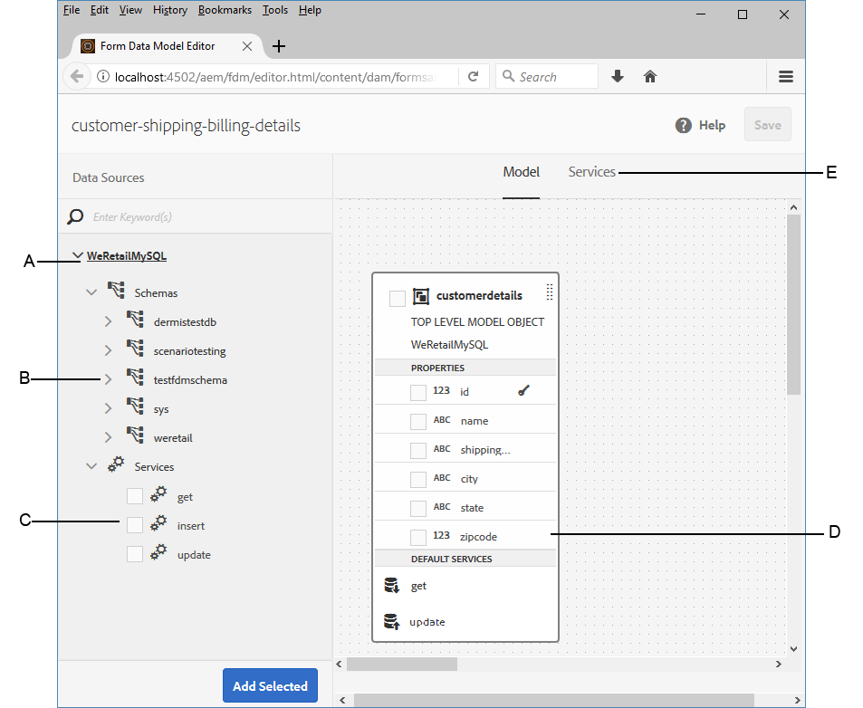
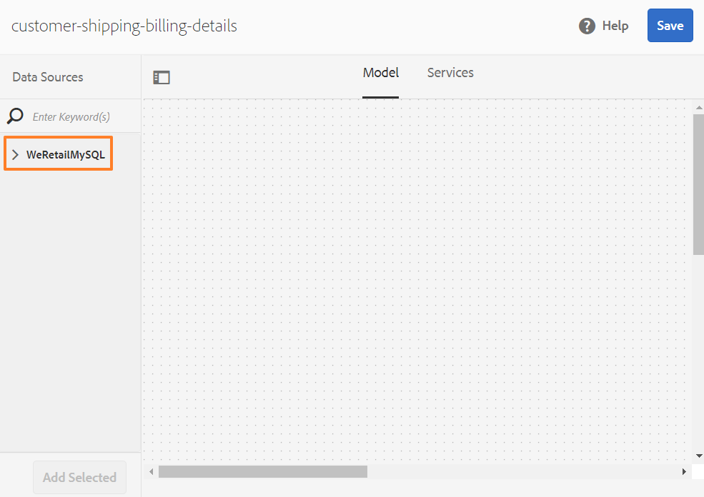
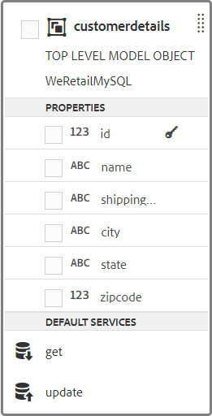

# Esercitazione: Crea modello dati modulo {#tutorial-create-form-data-model}

Questa esercitazione è un passaggio della serie [Crea il tuo primo modulo adattivo](../../forms/using/create-your-first-adaptive-form.md). Si consiglia di seguire le serie in sequenza cronologica per comprendere, eseguire e dimostrare l&#39;uso completo dell&#39;esercitazione.

## Informazioni sull&#39;esercitazione {#about-the-tutorial}

AEM modulo di integrazione dei dati [!DNL Forms] consente di creare un modello di dati del modulo da origini dati back-end diverse, come AEM profilo utente, servizi Web RESTful, servizi Web basati su SOAP, servizi OData e database relazionali. È possibile configurare oggetti e servizi del modello dati in un modello dati del modulo e associarlo a un modulo adattivo. I campi modulo adattivi sono associati alle proprietà dell&#39;oggetto modello dati. I servizi consentono di precompilare il modulo adattivo e di riscrivere i dati del modulo inviato all&#39;oggetto modello dati.

Per ulteriori informazioni sull&#39;integrazione dei dati del modulo e sul modello di dati del modulo, vedere [ AEM Forms Data Integration](../../forms/using/data-integration.md).

Questa esercitazione illustra i passaggi necessari per preparare, creare, configurare e associare un modello dati del modulo a un modulo adattivo. Al termine di questa esercitazione, potrete:

* [Configurare il database MySQL come origine dati](#config-database)
* [Creare un modello dati modulo utilizzando il database MySQL](#create-fdm)
* [Configurare il modello dati del modulo](#config-fdm)
* [Verifica modello dati modulo](#test-fdm)

Il modello dati del modulo sarà simile al seguente:

**A.** Origini dati  **B.** Schemi origine dati  **C.Servizi** disponibili  **D.** Oggetti modello dati  **E.** Servizi configurati

## Prerequisiti {#prerequisites}

Prima di iniziare, accertatevi di disporre dei seguenti elementi:

* [!DNL MySQL] database con dati di esempio come indicato nella sezione Prerequisiti di  [Creazione del primo modulo adattivo](../../forms/using/create-your-first-adaptive-form.md)
* Pacchetto OSGi per il driver [!DNL MySQL] JDBC come spiegato in [Bundling the JDBC Database Driver](/help/sites-developing/jdbc.md#bundling-the-jdbc-database-driver)
* Modulo adattivo come spiegato nella prima esercitazione [Creare un modulo adattivo](/help/forms/using/create-adaptive-form.md)

## Passaggio 1: Configurare il database MySQL come origine dati {#config-database}

È possibile configurare diversi tipi di origini dati per creare un modello dati del modulo. Per questa esercitazione, verrà configurato il database MySQL configurato e popolato con dati di esempio. Per informazioni su altre origini dati supportate e su come configurarle, vedere [ AEM Forms Data Integration](../../forms/using/data-integration.md).

Per configurare il database [!DNL MySQL], effettuate le seguenti operazioni:

1. Installare il driver JDBC per il database [!DNL MySQL] come bundle OSGi:

   1. Accedete a AEM [!DNL Forms] Author Instance come amministratore e andate AEM bundle della console Web. L&#39;URL predefinito è [https://localhost:4502/system/console/bundles](https://localhost:4502/system/console/bundles).

   1. Toccate **[!UICONTROL Installa/Aggiorna]**. Viene visualizzata una finestra di dialogo [!UICONTROL Carica/Installa pacchetti].

   1. Toccate **[!UICONTROL Scegli file]** per sfogliare e selezionate il bundle OSGi del driver [!DNL MySQL] JDBC. Selezionate **[!UICONTROL Avvia pacchetto]** e **[!UICONTROL Aggiorna pacchetti]**, quindi toccate **[!UICONTROL Installa o Aggiorna]**. Assicurarsi che il driver [!DNL Oracle Corporation's] JDBC per [!DNL MySQL] sia attivo. Il driver è installato.

1. Configurare il database [!DNL MySQL] come origine dati:

   1. Passate AEM console Web all&#39;indirizzo [https://localhost:4502/system/console/configMgr](https://localhost:4502/system/console/configMgr).
   1. Individuare la configurazione di **Apache Sling Connection DataSource** in pool. Toccate per aprire la configurazione in modalità di modifica.
   1. Nella finestra di dialogo di configurazione, specificate i seguenti dettagli:

      * **Nome origine dati:** è possibile specificare qualsiasi nome. Ad esempio, specificare **WeRetailMySQL**.
      * **Nome** proprietà del servizio DataSource: Specificare il nome della proprietà del servizio contenente il nome DataSource. Viene specificato durante la registrazione dell&#39;istanza dell&#39;origine dati come servizio OSGi. Ad esempio, **datasource.name**.
      * **Classe** driver JDBC: Specificate il nome della classe Java del driver JDBC. Per il database [!DNL MySQL], specificare **com.mysql.jdbc.Driver**.
      * **URI** connessione JDBC: Specificate l&#39;URL di connessione del database. Per il database [!DNL MySQL] in esecuzione sulla porta 3306 e la coda dello schema, l&#39;URL è: `jdbc:mysql://'server':3306/weretail?autoReconnect=true&useUnicode=true&characterEncoding=utf-8`
      * **Nome utente:** Nome utente del database. È necessario per consentire al driver JDBC di stabilire una connessione con il database.
      * **Password:** password del database. È necessario per consentire al driver JDBC di stabilire una connessione con il database.
      * **Prova in prestito:** attiva l’opzione  **[!UICONTROL Test su]** prestito.
      * **Test su restituzione:** abilita il  **[!UICONTROL test sulla]** restituzione.
      * **Query di convalida:** specificate una query SQL SELECT per convalidare le connessioni dal pool. La query deve restituire almeno una riga. Ad esempio, **selezionare * dai dettagli del cliente**.
      * **Isolamento** transazione: Impostare il valore su  **READ_COMMTED**.

         Lasciare altre proprietà con valori [predefiniti](https://tomcat.apache.org/tomcat-7.0-doc/jdbc-pool.html) e toccare **[!UICONTROL Save]**.

         Viene creata una configurazione simile a quella riportata di seguito.

         

## Passaggio 2: Crea modello dati modulo {#create-fdm}

AEM [!DNL Forms] fornisce un&#39;interfaccia utente intuitiva per [creare un modello dati del modulo](data-integration.md) da origini dati configurate. È possibile utilizzare più origini dati in un modello dati del modulo. Per il nostro caso di utilizzo, utilizzeremo l&#39;origine dati [!DNL MySQL] configurata.

Per creare un modello dati modulo, effettuare le seguenti operazioni:

1. Nell&#39;istanza di AEM autore, passare a **[!UICONTROL Forms]** > **[!UICONTROL Integrazioni dati]**.
1. Toccate **[!UICONTROL Crea]** > **[!UICONTROL Modello dati modulo]**.
1. Nella finestra di dialogo Crea modello dati modulo, specificare un **nome** per il modello dati del modulo. Ad esempio, **customer-shipping-fatturazione-details**. Toccare **[!UICONTROL Next]**.
1. Nella schermata dell&#39;origine dati selezionata sono elencate tutte le origini dati configurate. Selezionare l&#39;origine dati **WeRetailMySQL** e toccare **[!UICONTROL Create]**.

   

Viene creato il modello di dati del modulo **customer-Shipping-Invoice-details**.

## Passaggio 3: Configurare il modello dati del modulo {#config-fdm}

La configurazione del modello dati del modulo comporta:

* aggiunta di oggetti modello dati e servizi
* configurazione di servizi di lettura e scrittura per gli oggetti modello dati

Per configurare il modello dati del modulo, effettuare le seguenti operazioni:

1. Nell&#39;istanza di AEM autore, andate a **[!UICONTROL Forms]** > **[!UICONTROL Integrazioni dati]**. L&#39;URL predefinito è [https://localhost:4502/aem/forms.html/content/dam/formsanddocuments-fdm](https://localhost:4502/aem/forms.html/content/dam/formsanddocuments-fdm).
1. Il modello di dati del modulo **customer-Shipping-Invoice-details** creato in precedenza è elencato qui. Aprirlo in modalità di modifica.

   L&#39;origine dati selezionata **WeRetailMySQL** è configurata nel modello dati del modulo.

   

1. Espandere la struttura di origine dati WeRailMySQL. Selezionare gli oggetti e i servizi del modello dati seguenti dallo schema **weretail** > **custom details** al modello dati del modulo:

   * **Oggetti** del modello dati:

      * id
      * name
      * spesaIndirizzo
      * città
      * stadio
      * zipcode
   * **Servizi:**

      * get
      * aggiorna

   Toccare **Aggiungi selezionato** per aggiungere gli oggetti e i servizi del modello dati selezionati al modello dati del modulo.

   

   >[!NOTE]
   >
   >I servizi predefiniti get, update e insert per le origini dati JDBC vengono forniti out-of-the-box con il modello dati del modulo.

1. Configurare i servizi di lettura e scrittura per l&#39;oggetto modello dati.

   1. Selezionare l&#39;oggetto modello dati **custom details** e toccare **[!UICONTROL Edit Properties]**.
   1. Selezionare **[!UICONTROL get]** dal menu a discesa Servizio di lettura. L&#39;argomento **id**, che è la chiave primaria nell&#39;oggetto del modello di dati dei dettagli del cliente, viene aggiunto automaticamente. Toccate  e configurate l&#39;argomento come segue.

      

   1. Analogamente, selezionare **[!UICONTROL update]** come servizio di scrittura. L&#39;oggetto **customerdetails** viene aggiunto automaticamente come argomento. L&#39;argomento è configurato come segue.

      

      Aggiungere e configurare l&#39;argomento **id** come segue.

      

   1. Toccate **[!UICONTROL Fine]** per salvare le proprietà dell&#39;oggetto modello dati. Quindi, toccare **[!UICONTROL Save]** per salvare il modello dati del modulo.

      I servizi **[!UICONTROL get]** e **[!UICONTROL update]** vengono aggiunti come servizi predefiniti per l&#39;oggetto modello dati.

      

1. Andate alla scheda **[!UICONTROL Services]** e configurate i servizi **[!UICONTROL get]** e **[!UICONTROL update]**.

   1. Selezionare il servizio **[!UICONTROL get]** e toccare **[!UICONTROL Edit Properties]**. Viene visualizzata la finestra di dialogo delle proprietà.
   1. Specificate quanto segue nella finestra di dialogo Modifica proprietà:

      * **Titolo**: Specificate il titolo del servizio. Ad esempio: Recupera indirizzo di spedizione.
      * **Descrizione**: Specificare la descrizione contenente il funzionamento dettagliato del servizio. Esempio:

         Questo servizio recupera l&#39;indirizzo di spedizione e altri dettagli cliente dal database [!DNL MySQL]

      * **Oggetto** modello di output: Selezionare lo schema contenente i dati del cliente. Esempio:

         schema dettaglio cliente

      * **Restituisce array**: Disattivate l’opzione  **Ritorno** dall’elenco.
      * **Argomenti**: Selezionare l&#39;argomento denominato  **ID**.

      Toccate **[!UICONTROL Chiudi]**. Il servizio per recuperare i dettagli del cliente dal database MySQL è configurato.

      

   1. Selezionare il servizio **[!UICONTROL update]** e toccare **[!UICONTROL Edit Properties]**. Viene visualizzata la finestra di dialogo delle proprietà.

   1. Specificate quanto segue nella finestra di dialogo [!UICONTROL Modifica proprietà]:

      * **Titolo**: Specificate il titolo del servizio. Ad esempio, Aggiorna indirizzo di spedizione.
      * **Descrizione**: Specificare la descrizione contenente il funzionamento dettagliato del servizio. Esempio:

         Questo servizio aggiorna l&#39;indirizzo di spedizione e i campi correlati nel database MySQL

      * **Oggetto** del modello di input: Selezionare lo schema contenente i dati del cliente. Esempio:

         schema dettaglio cliente

      * **Tipo** di output: Selezionare  **BOOLEAN**.

      * **Argomenti**: Selezionate l’argomento denominato  **** IDe i dettagli  **cliente**.
      Toccate **[!UICONTROL Chiudi]**. Il servizio **[!UICONTROL update]** per aggiornare i dettagli del cliente nel database [!DNL MySQL] è configurato.

      

L&#39;oggetto e i servizi del modello dati nel modello dati del modulo sono configurati. È ora possibile verificare il modello dati del modulo.

## Passaggio 4: Test del modello dati del modulo {#test-fdm}

È possibile verificare l&#39;oggetto del modello dati e i servizi per verificare che il modello dati del modulo sia configurato correttamente.

Per eseguire il test, effettuate le seguenti operazioni:

1. Fare clic sulla scheda **[!UICONTROL Modello]**, selezionare l&#39;oggetto modello dati **custom details** e toccare **[!UICONTROL Oggetto modello di prova]**.
1. Nella finestra [!UICONTROL Test Model/Service], selezionare **[!UICONTROL Leggi oggetto modello]** dal menu a discesa **[!UICONTROL Seleziona modello/servizio]**.
1. Nella sezione **custom details**, specificate un valore per l&#39;argomento **id** presente nel database [!DNL MySQL] configurato e toccate **[!UICONTROL Test]**.

   I dettagli del cliente associati all&#39;ID specificato vengono recuperati e visualizzati nella sezione **[!UICONTROL Output]** come mostrato di seguito.

   

1. Analogamente, è possibile verificare l&#39;oggetto e i servizi del modello di scrittura.

   Nell&#39;esempio seguente, il servizio di aggiornamento aggiorna correttamente i dettagli dell&#39;indirizzo per l&#39;ID 7102715 nel database.

   

   Ora, se si esegue nuovamente il test del servizio modello di lettura per l&#39;ID 7107215, il servizio recupererà e visualizzerà i dettagli cliente aggiornati come mostrato di seguito.

   
