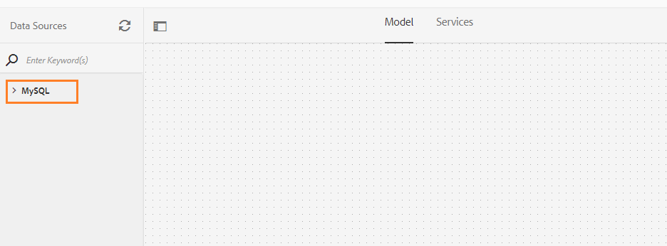
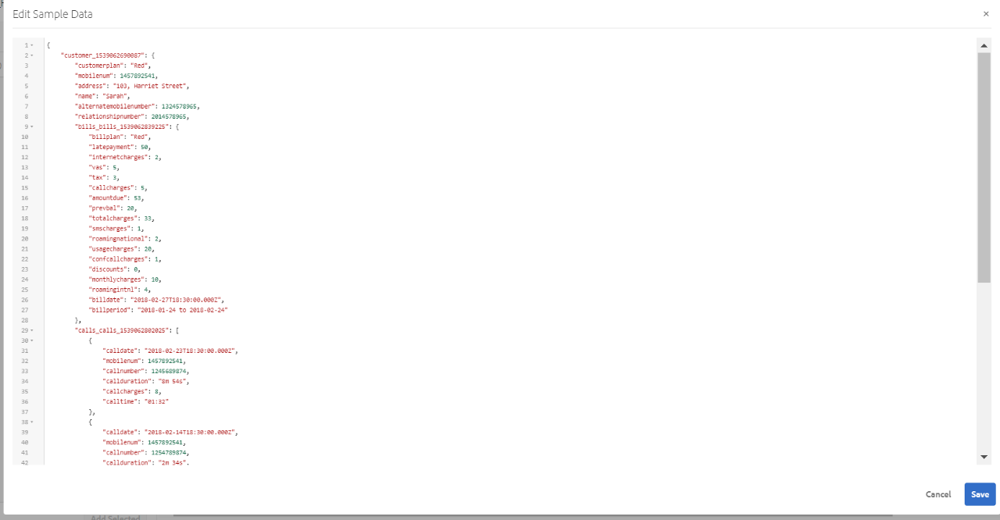

# Tutorial: creare un modello di dati modulo in AEM Forms{#tutorial-create-form-data-model}


Questo tutorial è un passaggio del [Creare la prima comunicazione interattiva](/help/forms/using/create-your-first-interactive-communication.md) serie. Si consiglia di seguire la serie in sequenza cronologica per comprendere, eseguire e dimostrare il caso di utilizzo completo dell’esercitazione.

## Informazioni sull’esercitazione {#about-the-tutorial}

Il modulo di integrazione dei dati di AEM Forms consente di creare un modello di dati modulo da diverse origini dati back-end, come il profilo utente AEM, i servizi web RESTful, i servizi web basati su SOAP, i servizi OData e i database relazionali. È possibile configurare oggetti e servizi del modello dati in un modello dati del modulo e associarlo a un modulo adattivo. I campi del modulo adattivo sono associati alle proprietà dell’oggetto modello dati. I servizi consentono di precompilare il modulo adattivo e riscrivere i dati del modulo inviato nell’oggetto modello dati.

Per ulteriori informazioni sull’integrazione dei dati dei moduli e sul modello di dati dei moduli, consulta [Integrazione dei dati di AEM Forms](https://helpx.adobe.com/experience-manager/6-3/forms/using/data-integration.html).

Questo tutorial illustra i passaggi necessari per preparare, creare, configurare e associare un modello di dati modulo a una comunicazione interattiva. Al termine di questa esercitazione, sarai in grado di:

* [Configurare il database](../../forms/using/create-form-data-model0.md#step-set-up-the-database)
* [Configura database MySQL come origine dati](../../forms/using/create-form-data-model0.md#step-configure-mysql-database-as-data-source)
* [Crea modello dati modulo](../../forms/using/create-form-data-model0.md#step-create-form-data-model)
* [Configura modello dati modulo](../../forms/using/create-form-data-model0.md#step-configure-form-data-model)
* [Test modello dati modulo](../../forms/using/create-form-data-model0.md#step-test-form-data-model-and-services)

Il modello dati del modulo è simile al seguente:


**R.** Origini dati configurate **B.** Schemi di origini dati **C.** Servizi disponibili **D.** Oggetti modello dati **E.** Servizi configurati

## Prerequisiti {#prerequisites}

Prima di iniziare, assicurati di disporre dei seguenti elementi:

* Database MySQL con dati di esempio come indicato nella [Configurare il database](../../forms/using/create-form-data-model0.md#step-set-up-the-database) sezione.
* Pacchetto OSGi per il driver JDBC MySQL come spiegato in [Bundling del driver di database JDBC](https://helpx.adobe.com/experience-manager/6-3/help/sites-developing/jdbc.html#bundling-the-jdbc-database-driver)

## Passaggio 1: configurare il database {#step-set-up-the-database}

Una banca dati è essenziale per creare una comunicazione interattiva. Questa esercitazione utilizza un database per visualizzare il modello dati del modulo e le funzionalità di persistenza delle comunicazioni interattive. Impostare un database contenente le tabelle cliente, fatture e chiamate.
L’immagine seguente illustra alcuni dati di esempio per la tabella del cliente:


Utilizza la seguente istruzione DDL per creare **cliente** tabella nel database.

```sql
CREATE TABLE `customer` (
   `mobilenum` int(11) NOT NULL,
   `name` varchar(45) NOT NULL,
   `address` varchar(45) NOT NULL,
   `alternatemobilenumber` int(11) DEFAULT NULL,
   `relationshipnumber` int(11) DEFAULT NULL,
   `customerplan` varchar(45) DEFAULT NULL,
   PRIMARY KEY (`mobilenum`),
   UNIQUE KEY `mobilenum_UNIQUE` (`mobilenum`)
 ) ENGINE=InnoDB DEFAULT CHARSET=utf8
```

Utilizza la seguente istruzione DDL per creare **effetti** tabella nel database.

```sql
CREATE TABLE `bills` (
   `billplan` varchar(45) NOT NULL,
   `latepayment` decimal(4,2) NOT NULL,
   `monthlycharges` decimal(4,2) NOT NULL,
   `billdate` date NOT NULL,
   `billperiod` varchar(45) NOT NULL,
   `prevbal` decimal(4,2) NOT NULL,
   `callcharges` decimal(4,2) NOT NULL,
   `confcallcharges` decimal(4,2) NOT NULL,
   `smscharges` decimal(4,2) NOT NULL,
   `internetcharges` decimal(4,2) NOT NULL,
   `roamingnational` decimal(4,2) NOT NULL,
   `roamingintnl` decimal(4,2) NOT NULL,
   `vas` decimal(4,2) NOT NULL,
   `discounts` decimal(4,2) NOT NULL,
   `tax` decimal(4,2) NOT NULL,
   PRIMARY KEY (`billplan`)
 ) ENGINE=InnoDB DEFAULT CHARSET=utf8
```

Utilizza la seguente istruzione DDL per creare **chiamate** tabella nel database.

```sql
CREATE TABLE `calls` (
   `mobilenum` int(11) DEFAULT NULL,
   `calldate` date DEFAULT NULL,
   `calltime` varchar(45) DEFAULT NULL,
   `callnumber` int(11) DEFAULT NULL,
   `callduration` varchar(45) DEFAULT NULL,
   `callcharges` decimal(4,2) DEFAULT NULL,
   `calltype` varchar(45) DEFAULT NULL
 ) ENGINE=InnoDB DEFAULT CHARSET=utf8
```

Il **chiamate** la tabella include i dettagli della chiamata, ad esempio la data, l&#39;ora, il numero, la durata e le spese. Il **cliente** La tabella è collegata alla tabella delle chiamate utilizzando il campo Mobile Number (mobilenum) (Numero cellulare). Per ogni numero di cellulare elencato nella **cliente** tabella, sono presenti più record nella **chiamate** tabella. Ad esempio, puoi recuperare i dettagli della chiamata per **1457892541** numero di cellulare facendo riferimento al **chiamate** tabella.

Il **effetti** la tabella include i dettagli della fattura come la data di fatturazione, il periodo di fatturazione, gli addebiti mensili e gli addebiti delle chiamate. Il **cliente** la tabella è collegata al **effetti** utilizzando il campo Piano fatturazione. Esiste un piano associato a ogni cliente in **cliente** tabella. Il **effetti** La tabella include i dettagli relativi alla determinazione dei prezzi per tutti i piani esistenti. Ad esempio, è possibile recuperare i dettagli del piano per **Sarah** dal **cliente** e utilizzare tali dettagli per recuperare i dettagli dei prezzi dal **effetti** tabella.

## Passaggio 2: configurare il database MySQL come origine dati {#step-configure-mysql-database-as-data-source}

È possibile configurare diversi tipi di origini dati per creare un modello dati del modulo. Per questa esercitazione, si configurerà il database MySQL configurato e popolato con dati di esempio. Per informazioni sulle altre origini dati supportate e su come configurarle, consulta [Integrazione dei dati di AEM Forms](https://helpx.adobe.com/experience-manager/6-3/forms/using/data-integration.html).

Per configurare il database MySQL, eseguire le operazioni seguenti:

1. Installa il driver JDBC per il database MySQL come bundle OSGi:

   1. Accedi all’istanza di authoring di AEM Forms come amministratore e passa ai bundle della console web AEM. L’URL predefinito è [https://localhost:4502/system/console/bundles](https://localhost:4502/system/console/bundles).
   1. Tocca **Installa/Aggiorna**. Un **Caricare/Installare i bundle** viene visualizzata.

   1. Tocca **Scegli file** per esplorare e selezionare il bundle OSGi del driver JDBC MySQL. Seleziona **Bundle iniziale** e **Aggiorna pacchetti**, e tocca **Installa** o **Aggiorna**. Verificare che il driver JDBC di Oracle Corporation per MySQL sia attivo. Il driver è installato.

1. Configurare il database MySQL come origine dati:

   1. Vai alla console web dell’AEM all’indirizzo [https://localhost:4502/system/console/configMgr](https://localhost:4502/system/console/configMgr).
   1. Individua **Origine dati in pool di connessione Apache Sling** configurazione. Tocca per aprire la configurazione in modalità di modifica.
   1. Nella finestra di dialogo di configurazione, specifica i dettagli seguenti:

      * **Nome origine dati:** È possibile specificare qualsiasi nome. Ad esempio, specifica **MySQL**.

      * **Nome proprietà servizio DataSource**: specifica il nome della proprietà del servizio contenente il nome DataSource. Viene specificato durante la registrazione dell’istanza dell’origine dati come servizio OSGi. Ad esempio: **datasource.name**.

      * **Classe driver JDBC**: specifica il nome della classe Java del driver JDBC. Per il database MySQL, specificare **com.mysql.jdbc.Driver**.

      * **URI connessione JDBC**: specifica l’URL di connessione del database. Per il database MySQL in esecuzione sulla porta 3306 e sulla teleca dello schema, l&#39;URL è: `jdbc:mysql://'server':3306/teleca?autoReconnect=true&useUnicode=true&characterEncoding=utf-8`
      * **Nome utente:** Nome utente del database. È necessario per abilitare il driver JDBC per stabilire una connessione con il database.
      * **Password:** Password del database. È necessario per abilitare il driver JDBC per stabilire una connessione con il database.
      * **Test su prestito:** Abilita **Test su prestito** opzione.

      * **Test al ritorno:** Abilita **Test al ritorno** opzione.

      * **Query di convalida:** Specificare una query SQL SELECT per convalidare le connessioni dal pool. La query deve restituire almeno una riga. Ad esempio: **seleziona &#42; dal cliente**.

      * **Isolamento transazione**: imposta il valore su **READ_COMMIT**.
   Lascia altre proprietà con impostazione predefinita [valori](https://tomcat.apache.org/tomcat-7.0-doc/jdbc-pool.html) e tocca **Salva**.

   Viene creata una configurazione simile alla seguente.

   

## Passaggio 3: creare il modello dati del modulo {#step-create-form-data-model}

AEM Forms fornisce un’interfaccia utente intuitiva per [creare una modalità dati modulo](https://helpx.adobe.com/experience-manager/6-3/forms/using/data-integration.html#main-pars_header_1524967585)l da origini dati configurate. È possibile utilizzare più origini dati in un modello dati del modulo. Per il caso d&#39;uso di questa esercitazione, verrà utilizzato MySQL come origine dati.

Per creare il modello dati del modulo, effettua le seguenti operazioni:

1. Nell’istanza di authoring dell’AEM, passa a **Forms** > **Integrazioni di dati**.
1. Tocca **Crea** > **Modello dati modulo**.
1. Nella procedura guidata Crea modello dati modulo, specifica un **nome** per il modello dati del modulo. Ad esempio: **FDM_Create_First_IC**. Tocca **Successivo**.
1. Nella schermata Seleziona origine dati sono elencate tutte le origini dati configurate. Seleziona **MySQL** origine dati e tocco **Crea**.

   

1. Clic **Fine**. Il **FDM_Create_First_IC** modello dati modulo creato.

## Passaggio 4: configurare il modello dati del modulo {#step-configure-form-data-model}

La configurazione del modello dati del modulo include:

* [aggiunta di servizi e oggetti modello dati](#add-data-model-objects-and-services)
* [creazione di proprietà figlio calcolate per l’oggetto modello dati](#create-computed-child-properties-for-data-model-object)
* [aggiunta di associazioni tra oggetti modello dati](#add-associations-between-data-model-objects)
* [modifica delle proprietà di un oggetto modello dati](#edit-data-model-object-properties)
* [configurazione dei servizi per gli oggetti modello dati](#configure-services)

### Aggiungere oggetti e servizi del modello dati {#add-data-model-objects-and-services}

1. Nell’istanza di authoring dell’AEM, passa a **Forms** > **Integrazioni di dati**. L’URL predefinito è [https://localhost:4502/aem/forms.html/content/dam/formsanddocuments-fdm](https://localhost:4502/aem/forms.html/content/dam/formsanddocuments-fdm).
1. Il **FDM_Create_First_IC** il modello dati del modulo creato in precedenza è elencato qui. Selezionala e tocca **Modifica**.

   Origine dati selezionata **MySQL** viene visualizzato in **Origini dati** riquadro.

   

1. Espandi **MySQL** struttura origine dati. Seleziona i seguenti oggetti e servizi del modello dati da **teleca** schema:

   * **Oggetti modello dati**:

      * effetti
      * chiamate
      * cliente
   * **Servizi:**

      * ottenere
      * aggiorna

   Tocca **Aggiungi selezionati** per aggiungere al modello dati del modulo oggetti e servizi modello dati selezionati.

   

   Gli oggetti modello dati relativi a fatture, chiamate e clienti vengono visualizzati nel riquadro di destra in **Modello** scheda. I servizi di recupero e aggiornamento vengono visualizzati nel **Servizi** scheda.

   

### Creare proprietà figlio calcolate per l’oggetto modello dati {#create-computed-child-properties-for-data-model-object}

Una proprietà calcolata è quella il cui valore viene calcolato in base a una regola o a un&#39;espressione. Utilizzando una regola è possibile impostare il valore di una proprietà calcolata su una stringa letterale, un numero, il risultato di un&#39;espressione matematica o il valore di un&#39;altra proprietà nel modello dati del modulo.

In base al caso d’uso, crea il **spese d&#39;uso** proprietà calcolata figlio in **effetti** oggetto modello dati utilizzando la seguente espressione matematica:

* costi di utilizzo = spese di chiamata + spese di conferenza telefonica + spese SMS + spese Internet per dispositivi mobili + roaming nazionale + roaming internazionale + VAS (tutte queste proprietà esistono nell’oggetto modello dati fatture) Per ulteriori informazioni su **spese d&#39;uso** proprietà calcolata figlio, vedi [Pianificare la comunicazione interattiva](/help/forms/using/planning-interactive-communications.md).

Per creare proprietà figlio calcolate per l&#39;oggetto modello dati distinte, eseguire la procedura seguente:

1. Seleziona la casella di controllo nella parte superiore della sezione **effetti** oggetto modello dati per selezionarlo e toccarlo **Crea proprietà figlio**.
1. In **Crea proprietà figlio** riquadro:

   1. Invio **spese d&#39;uso** come nome della proprietà figlio.
   1. Abilita **Calcolato**.
   1. Seleziona **Mobile** come tipo e tocca **Fine** per aggiungere la proprietà figlio al **effetti** oggetto modello dati.

   

1. Tocca **Modifica regola** per aprire l&#39;editor di regole.
1. Tocca **Crea**. Il **Imposta valore** viene visualizzata la finestra regola.
1. Dall’elenco a discesa Seleziona opzione, seleziona **Espressione matematica**.

   

1. Nell&#39;espressione matematica, selezionare **callcharge** e **confcallcharge** come primo e secondo oggetto, rispettivamente. Seleziona **più** come operatore. Tocca all’interno dell’espressione matematica e tocca **Estendi estensione** da aggiungere **schemi**, **tariffe Internet**, **roamingnational**, **roaming**, e **area di lavoro** all&#39;espressione.

   L’immagine seguente illustra l’espressione matematica nell’editor di regole:

   

1. Tocca **Fine**. La regola viene creata nell’Editor di regole.
1. Tocca **Chiudi** per chiudere la finestra Editor regole.

### Aggiungere associazioni tra oggetti modello dati {#add-associations-between-data-model-objects}

Una volta definiti gli oggetti modello dati, puoi creare delle associazioni tra di essi. L’associazione può essere uno a uno o uno a molti. Ad esempio, a un dipendente possono essere associate più persone a carico. È definita associazione uno-a-molti ed è rappresentata da 1:n sulla linea che collega gli oggetti modello dati associati. Tuttavia, se un&#39;associazione restituisce un nome di dipendente univoco per un determinato ID dipendente, viene definita associazione uno-a-uno.

Quando si aggiungono oggetti modello dati associati in un&#39;origine dati a un modello dati del modulo, le relative associazioni vengono mantenute e visualizzate come collegate da linee freccia.

In base al caso d’uso, crea le seguenti associazioni tra gli oggetti del modello di dati:

| Associazione | Oggetti modello dati |
|---|---|
| 1:n | cliente:chiamate (è possibile associare più chiamate a un cliente con una fattura mensile) |
| 1:1 | cliente:fatture (una fattura è associata a un cliente per un mese specifico) |

Per creare associazioni tra oggetti modello dati, effettuare le operazioni riportate di seguito.

1. Seleziona la casella di controllo nella parte superiore della sezione **cliente** oggetto modello dati per selezionarlo e toccarlo **Aggiungi associazione**. Il **Aggiungi associazione** viene aperto il riquadro delle proprietà.
1. In **Aggiungi associazione** riquadro:

   * Specificare un titolo per l&#39;associazione. È un campo facoltativo.
   * Seleziona **Da uno a molti** dal **Tipo** elenco a discesa.

   * Seleziona **chiamate** dal **Oggetto modello** elenco a discesa.

   * Seleziona **ottenere** dal **Servizio** elenco a discesa.

   * Tocca **Aggiungi** per collegare **cliente** oggetto modello dati a **chiamate** oggetto modello dati utilizzando una proprietà. In base al caso d’uso, l’oggetto modello dati chiamate deve essere collegato alla proprietà mobile number nell’oggetto modello dati cliente. Il **Aggiungi argomento** viene visualizzata.

   

1. In **Aggiungi argomento** finestra di dialogo:

   * Seleziona **mobilenum** dal **Nome** elenco a discesa. La proprietà mobile number è una proprietà comune disponibile negli oggetti modello dati del cliente e delle chiamate. Di conseguenza, viene utilizzato per creare un’associazione tra il cliente e chiama oggetti modello dati.
Per ogni numero di cellulare disponibile nell’oggetto modello dati del cliente, nella tabella chiamate sono disponibili più record di chiamata.

   * Specificare un titolo e una descrizione facoltativi per l&#39;argomento.
   * Seleziona **cliente** dal **Associazione a** elenco a discesa.

   * Seleziona **mobilenum** dal **Valore di binding** elenco a discesa.

   * Tocca **Aggiungi**.

   

   La proprietà mobilenum viene visualizzata nel **Argomenti** sezione.

   

1. Tocca **Fine** per creare un’associazione 1:n tra il cliente e richiama gli oggetti del modello dati.

   Dopo aver creato un&#39;associazione tra il cliente e gli oggetti modello dati di chiamata, creare un&#39;associazione 1:1 tra gli oggetti modello dati cliente e fatturazione.

1. Seleziona la casella di controllo nella parte superiore della sezione **cliente** oggetto modello dati per selezionarlo e toccarlo **Aggiungi associazione**. Il **Aggiungi associazione** viene aperto il riquadro delle proprietà.
1. In **Aggiungi associazione** riquadro:

   * Specificare un titolo per l&#39;associazione. È un campo facoltativo.
   * Seleziona **Da uno a uno** dal **Tipo** elenco a discesa.

   * Seleziona **effetti** dal **Oggetto modello** elenco a discesa.

   * Seleziona **ottenere** dal **Servizio** elenco a discesa. Il **billplan** proprietà, che rappresenta la chiave primaria per la tabella delle distinte, è già disponibile **Argomenti** sezione.
Gli oggetti modello dati fatture e cliente vengono collegati utilizzando rispettivamente le proprietà billplan (fatture) e customerplan (cliente). Creare un&#39;associazione tra queste proprietà per recuperare i dettagli del piano per qualsiasi cliente disponibile nel database MySQL.

   * Seleziona **cliente** dal **Associazione a** elenco a discesa.

   * Seleziona **customerplan** dal **Valore di binding** elenco a discesa.

   * Tocca **Fine** per creare un&#39;associazione tra le proprietà billplan e customerplan.

   

   L’immagine seguente illustra le associazioni tra gli oggetti modello dati e le proprietà utilizzate per creare associazioni tra di essi:

   

### Modifica proprietà oggetto modello dati {#edit-data-model-object-properties}

Dopo aver creato le associazioni tra il cliente e altri oggetti modello dati, modifica le proprietà del cliente per definire la proprietà in base alla quale i dati vengono recuperati dall’oggetto modello dati. In base al caso d’uso, il numero di cellulare viene utilizzato come proprietà per recuperare i dati dall’oggetto modello dati del cliente.

1. Seleziona la casella di controllo nella parte superiore della sezione **cliente** oggetto modello dati per selezionarlo e toccarlo **Modifica proprietà**. Il **Modifica proprietà** viene visualizzato il riquadro.
1. Specifica **cliente** come **Oggetto modello di primo livello**.
1. Seleziona **ottenere** dal **Servizio di lettura** elenco a discesa.
1. In **Argomenti** sezione:

   * Seleziona **Richiedi attributo** dal **Associazione a** elenco a discesa.

   * Specifica **mobilenum** come valore di binding.

1. Seleziona **aggiorna** dal **Scrittura** Elenco a discesa Servizio.
1. In **Argomenti** sezione:

   * Per **mobilenum** proprietà, seleziona **cliente** dal **Associazione a** elenco a discesa.

   * Seleziona **mobilenum** dal **Valore di binding** elenco a discesa.

1. Tocca **Fine** per salvare le proprietà.

   

1. Seleziona la casella di controllo nella parte superiore della sezione **chiamate** oggetto modello dati per selezionarlo e toccarlo **Modifica proprietà**. Il **Modifica proprietà** viene visualizzato il riquadro.
1. Disattiva il **Oggetto modello di primo livello** per **chiamate** oggetto modello dati.
1. Tocca **Fine**.

   Ripeti i passaggi da 8 a 10 per configurare le proprietà per **effetti** oggetto modello dati.

### Configurare i servizi {#configure-services}

1. Vai a **Servizi** scheda.
1. Seleziona la **ottenere** servizio e tocco **Modifica proprietà**. Il **Modifica proprietà** viene visualizzato il riquadro.
1. In **Modifica proprietà** riquadro:

   * Immettere un titolo e una descrizione facoltativi.
   * Seleziona **cliente** dal **Oggetto modello di output** elenco a discesa.

   * Tocca **Fine** per salvare le proprietà.

   

1. Seleziona la **aggiorna** servizio e tocco **Modifica proprietà**. Il **Modifica proprietà** viene visualizzato il riquadro.
1. In **Modifica proprietà** riquadro:

   * Immettere un titolo e una descrizione facoltativi.
   * Seleziona **cliente** dal **Oggetto modello di input** elenco a discesa.

   * Tocca **Fine**.
   * Tocca **Salva** per salvare il modello dati del modulo.

   

## Passaggio 5: testare il modello di dati del modulo e i servizi {#step-test-form-data-model-and-services}

È possibile eseguire il test dell&#39;oggetto modello dati e dei servizi per verificare che il modello dati del modulo sia configurato correttamente.

Per eseguire il test, eseguire le operazioni seguenti:

1. Vai a **Modello** , seleziona la scheda **cliente** oggetto modello dati e tocca **Oggetto modello di test**.
1. In **Modello dati modulo di prova** finestra, seleziona **Leggi oggetto modello** dal **Seleziona modello/servizio** elenco a discesa.
1. In **Input** , specificare un valore per la sezione **mobilenum** proprietà esistente nel database MySQL configurato e toccare **Test**.

   I dettagli del cliente associati alla proprietà mobilenum specificata vengono recuperati e visualizzati nella sezione Output come mostrato di seguito. Chiudete la finestra di dialogo.

   

1. Vai a **Servizi** scheda.
1. Seleziona la **ottenere** servizio e tocco **Servizio di test.**
1. In **Input** , specificare un valore per la sezione **mobilenum** proprietà esistente nel database MySQL configurato e toccare **Test**.

   I dettagli del cliente associati alla proprietà mobilenum specificata vengono recuperati e visualizzati nella sezione Output come mostrato di seguito. Chiudete la finestra di dialogo.

   

### Modificare e salvare i dati di esempio {#edit-and-save-sample-data}

L’editor del modello dati modulo consente di generare dati di esempio per tutte le proprietà dell’oggetto modello dati, incluse le proprietà calcolate, in un modello dati modulo. Si tratta di un set di valori casuali conformi al tipo di dati configurato per ogni proprietà. È inoltre possibile modificare e salvare i dati, che vengono mantenuti anche se si rigenerano i dati di esempio.

Per generare, modificare e salvare dati di esempio, effettuare le seguenti operazioni:

1. Nella pagina del modello di dati del modulo, tocca **Modifica dati di esempio**. Genera e visualizza i dati di esempio nella finestra Modifica dati di esempio.

   

1. In entrata **Modifica dati di esempio** finestra, modifica i dati secondo necessità e tocca **Salva**. Chiudete la finestra.
