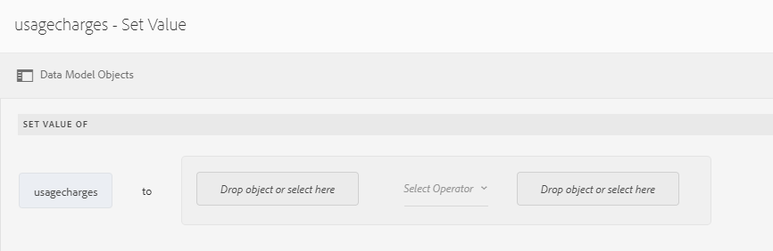
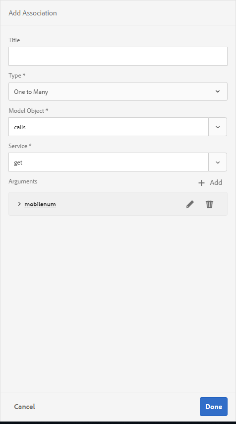

# Esercitazione: Crea modello dati modulo{#tutorial-create-form-data-model}


Questa esercitazione è un passaggio della serie [Crea la tua prima comunicazione interattiva](/help/forms/using/create-your-first-interactive-communication.md). Si consiglia di seguire la serie in sequenza cronologica per comprendere, eseguire e illustrare il caso d’uso completo dell’esercitazione.

## Informazioni sull&#39;esercitazione {#about-the-tutorial}

Il modulo di integrazione dei dati di AEM Forms consente di creare un modello di dati del modulo da diverse origini di dati di backend, come AEM profilo utente, servizi web RESTful, servizi web basati su SOAP, servizi OData e database relazionali. È possibile configurare oggetti modello dati e servizi in un modello dati modulo e associarlo a un modulo adattivo. I campi modulo adattivo sono associati alle proprietà dell’oggetto modello dati. I servizi consentono di precompilare il modulo adattivo e di riscrivere i dati del modulo inviato all’oggetto modello dati.

Per ulteriori informazioni sull&#39;integrazione dei dati del modulo e sul modello di dati del modulo, vedere [Integrazione dei dati di AEM Forms](https://helpx.adobe.com/experience-manager/6-3/forms/using/data-integration.html).

Questa esercitazione descrive i passaggi necessari per preparare, creare, configurare e associare un modello di dati modulo a una comunicazione interattiva. Al termine di questa esercitazione, potrai:

* [Configurare il database](../../forms/using/create-form-data-model0.md#step-set-up-the-database)
* [Configurare il database MySQL come origine dati](../../forms/using/create-form-data-model0.md#step-configure-mysql-database-as-data-source)
* [Crea modello dati modulo](../../forms/using/create-form-data-model0.md#step-create-form-data-model)
* [Configurare il modello dati del modulo](../../forms/using/create-form-data-model0.md#step-configure-form-data-model)
* [Test del modello dati del modulo](../../forms/using/create-form-data-model0.md#step-test-form-data-model-and-services)

Il modello dati del modulo è simile al seguente:


**A.** Origini dati configurate  **B.** Schemi origine dati  **C.** Servizi disponibili  **D.** Oggetti modello dati  **E.** Servizi configurati

## Prerequisiti {#prerequisites}

Prima di iniziare, assicurati di disporre dei seguenti elementi:

* Database MySQL con dati di esempio come indicato nella sezione [Configurare il database](../../forms/using/create-form-data-model0.md#step-set-up-the-database).
* Bundle OSGi per il driver JDBC MySQL come spiegato in [Bundling del driver di database JDBC](https://helpx.adobe.com/experience-manager/6-3/help/sites-developing/jdbc.html#bundling-the-jdbc-database-driver)

## Passaggio 1: Imposta il database {#step-set-up-the-database}

Un database è essenziale per creare una comunicazione interattiva. Questa esercitazione utilizza un database per visualizzare le funzionalità di Form Data Model e persistenza delle comunicazioni interattive. Imposta un database contenente tabelle cliente, fatture e chiamate.
L’immagine seguente illustra dati di esempio per la tabella cliente:


Utilizzare la seguente istruzione DDL per creare la tabella **customer** nel database.

```sql
CREATE TABLE `customer` (
   `mobilenum` int(11) NOT NULL,
   `name` varchar(45) NOT NULL,
   `address` varchar(45) NOT NULL,
   `alternatemobilenumber` int(11) DEFAULT NULL,
   `relationshipnumber` int(11) DEFAULT NULL,
   `customerplan` varchar(45) DEFAULT NULL,
   PRIMARY KEY (`mobilenum`),
   UNIQUE KEY `mobilenum_UNIQUE` (`mobilenum`)
 ) ENGINE=InnoDB DEFAULT CHARSET=utf8
```

Utilizzare la seguente istruzione DDL per creare la tabella **bollette** nel database.

```sql
CREATE TABLE `bills` (
   `billplan` varchar(45) NOT NULL,
   `latepayment` decimal(4,2) NOT NULL,
   `monthlycharges` decimal(4,2) NOT NULL,
   `billdate` date NOT NULL,
   `billperiod` varchar(45) NOT NULL,
   `prevbal` decimal(4,2) NOT NULL,
   `callcharges` decimal(4,2) NOT NULL,
   `confcallcharges` decimal(4,2) NOT NULL,
   `smscharges` decimal(4,2) NOT NULL,
   `internetcharges` decimal(4,2) NOT NULL,
   `roamingnational` decimal(4,2) NOT NULL,
   `roamingintnl` decimal(4,2) NOT NULL,
   `vas` decimal(4,2) NOT NULL,
   `discounts` decimal(4,2) NOT NULL,
   `tax` decimal(4,2) NOT NULL,
   PRIMARY KEY (`billplan`)
 ) ENGINE=InnoDB DEFAULT CHARSET=utf8
```

Utilizza la seguente istruzione DDL per creare la tabella **chiamate** nel database.

```sql
CREATE TABLE `calls` (
   `mobilenum` int(11) DEFAULT NULL,
   `calldate` date DEFAULT NULL,
   `calltime` varchar(45) DEFAULT NULL,
   `callnumber` int(11) DEFAULT NULL,
   `callduration` varchar(45) DEFAULT NULL,
   `callcharges` decimal(4,2) DEFAULT NULL,
   `calltype` varchar(45) DEFAULT NULL
 ) ENGINE=InnoDB DEFAULT CHARSET=utf8
```

La tabella **chiamate** include i dettagli della chiamata, come la data della chiamata, l&#39;ora di chiamata, il numero di chiamata, la durata della chiamata e le tariffe di chiamata. La tabella **customer** è collegata alla tabella delle chiamate utilizzando il campo Mobile Number (mobilenum) . Per ogni numero di cellulare elencato nella tabella **customer**, la tabella **Calls** contiene più record. Ad esempio, puoi recuperare i dettagli della chiamata per il numero mobile **1457892541** facendo riferimento alla tabella **chiamate** .

La tabella **distinte** include i dettagli della fattura, ad esempio data di fatturazione, periodo di fatturazione, addebiti mensili e spese di chiamata. La tabella **customer** è collegata alla tabella **bill** utilizzando il campo Piano fatturazione. È presente un piano associato a ciascun cliente nella tabella **customer** . La tabella **bollette** include i dettagli dei prezzi per tutti i piani esistenti. Ad esempio, è possibile recuperare i dettagli del piano per **Sarah** dalla tabella **customer** e utilizzarli per recuperare i dettagli dei prezzi dalla tabella **bill**.

## Passaggio 2: Configura il database MySQL come origine dati {#step-configure-mysql-database-as-data-source}

È possibile configurare diversi tipi di origini dati per creare un modello dati del modulo. Per questa esercitazione, configurerai il database MySQL configurato e compilato con dati di esempio. Per informazioni su altre origini dati supportate e su come configurarle, consulta [Integrazione dei dati di AEM Forms](https://helpx.adobe.com/experience-manager/6-3/forms/using/data-integration.html).

Per configurare il database MySQL eseguire le operazioni seguenti:

1. Installa il driver JDBC per il database MySQL come bundle OSGi:

   1. Accedi all’istanza di authoring di AEM Forms come amministratore e vai AEM bundle della console web. L&#39;URL predefinito è [https://localhost:4502/system/console/bundles](https://localhost:4502/system/console/bundles).
   1. Tocca **Installa/Aggiorna**. Viene visualizzata una finestra di dialogo **Carica/Installa bundle**.

   1. Tocca **Scegli file** per sfogliare e selezionare il bundle OSGi del driver JDBC MySQL. Seleziona **Avvia bundle** e **Aggiorna pacchetti** e tocca **Installa** o **Aggiorna**. Verificare che il driver JDBC di Oracle Corporation per MySQL sia attivo. Il driver è installato.

1. Configura il database MySQL come origine dati:

   1. Vai AEM console Web all&#39;indirizzo [https://localhost:4502/system/console/configMgr](https://localhost:4502/system/console/configMgr).
   1. Individua la configurazione **Apache Sling Connection Pooled DataSource**. Tocca per aprire la configurazione in modalità di modifica.
   1. Nella finestra di dialogo di configurazione, specifica i seguenti dettagli:

      * **Nome origine dati:** puoi specificare qualsiasi nome. Ad esempio, specificare **MySQL**.

      * **Nome** della proprietà del servizio DataSource: Specifica il nome della proprietà del servizio contenente il nome DataSource. Viene specificato durante la registrazione dell&#39;istanza dell&#39;origine dati come servizio OSGi. Ad esempio, **datasource.name**.

      * **Classe** del driver JDBC: Specifica il nome della classe Java del driver JDBC. Per il database MySQL, specificare **com.mysql.jdbc.Driver**.

      * **URI** di connessione JDBC: Specifica l&#39;URL di connessione del database. Per il database MySQL in esecuzione sulla porta 3306 e sullo schema teleca, l&#39;URL è: `jdbc:mysql://'server':3306/teleca?autoReconnect=true&useUnicode=true&characterEncoding=utf-8`
      * **Nome utente:** nome utente del database. È necessario per abilitare il driver JDBC per stabilire una connessione con il database.
      * **Password:** password del database. È necessario per abilitare il driver JDBC per stabilire una connessione con il database.
      * **Test su prestito:** abilita l&#39;opzione  **Test su** prestito.

      * **Test on Return:** abilita il  **test on** Return.

      * **Query di convalida:** specifica una query SQL SELECT per convalidare le connessioni dal pool. La query deve restituire almeno una riga. Ad esempio, **seleziona * dal cliente**.

      * **Isolamento** transazione: Imposta il valore su  **READ_COMMTED**.
   Lascia le altre proprietà con i valori predefiniti [e tocca **Salva**.](https://tomcat.apache.org/tomcat-7.0-doc/jdbc-pool.html)

   Viene creata una configurazione simile a quella riportata di seguito.

   

## Passaggio 3: Crea modello dati modulo {#step-create-form-data-model}

AEM Forms fornisce un&#39;interfaccia utente intuitiva per [creare una modalità dati modulo](https://helpx.adobe.com/experience-manager/6-3/forms/using/data-integration.html#main-pars_header_1524967585)l da origini dati configurate. È possibile utilizzare più origini dati in un modello dati modulo. Per il caso di utilizzo in questa esercitazione, verrà utilizzato MySQL come origine dati.

Per creare un modello dati modulo, procedere come segue:

1. Nell&#39;istanza AEM autore, passa a **Forms** > **Integrazioni dati**.
1. Tocca **Crea** > **Modello dati modulo**.
1. Nella procedura guidata Crea modello dati modulo, specificare un **nome** per il modello dati del modulo. Ad esempio, **FDM_Create_First_IC**. Tocca **Avanti**.
1. Nella schermata Seleziona origine dati sono elencate tutte le origini dati configurate. Seleziona l&#39;origine dati **MySQL** e tocca **Crea**.

   

1. Fare clic su **Fine**. Viene creato il modello di dati del modulo **FDM_Create_First_IC** .

## Passaggio 4: Configura il modello dati del modulo {#step-configure-form-data-model}

La configurazione del modello dati del modulo include:

* [aggiunta di oggetti e servizi del modello dati](#add-data-model-objects-and-services)
* [creazione di proprietà figlio calcolate per l&#39;oggetto modello dati](#create-computed-child-properties-for-data-model-object)
* [aggiunta di associazioni tra gli oggetti del modello dati](#add-associations-between-data-model-objects)
* [modifica delle proprietà dell&#39;oggetto modello dati](#edit-data-model-object-properties)
* [configurazione dei servizi per gli oggetti del modello dati](#configure-services)

### Aggiungere oggetti e servizi del modello dati {#add-data-model-objects-and-services}

1. Nell&#39;istanza AEM autore, passa a **Forms** > **Integrazioni dati**. L&#39;URL predefinito è [https://localhost:4502/aem/forms.html/content/dam/formsanddocuments-fdm](https://localhost:4502/aem/forms.html/content/dam/formsanddocuments-fdm).
1. Il modello di dati del modulo **FDM_Create_First_IC** creato in precedenza è elencato qui. Selezionala e tocca **Modifica**.

   L&#39;origine dati selezionata **MySQL** viene visualizzata nel riquadro **Origini dati**.

   

1. Espandere la struttura dell&#39;origine dati **MySQL**. Selezionare i seguenti oggetti e servizi del modello dati dallo schema **teleca**:

   * **Oggetti** del modello dati:

      * fatture
      * chiama
      * cliente
   * **Servizi:**

      * get
      * aggiorna

   Tocca **Aggiungi selezionati** per aggiungere oggetti e servizi del modello dati selezionati al modello dati del modulo.

   

   Le fatture, le chiamate e gli oggetti modello dati cliente vengono visualizzati nel riquadro a destra nella scheda **Modello** . I servizi get e update vengono visualizzati nella scheda **Servizi** .

   

### Creare proprietà figlio calcolate per l&#39;oggetto modello dati {#create-computed-child-properties-for-data-model-object}

Una proprietà calcolata è quella il cui valore viene calcolato in base a una regola o a un&#39;espressione. Utilizzando una regola, è possibile impostare il valore di una proprietà calcolata su una stringa letterale, un numero, il risultato di un&#39;espressione matematica o il valore di un&#39;altra proprietà nel modello dati del modulo.

In base al caso d&#39;uso, creare la proprietà calcolata secondaria **usagecars** nell&#39;oggetto modello dati **bill** utilizzando la seguente espressione matematica:

* tariffe d&#39;uso = tariffe di chiamata + tariffe di chiamata per conferenza + tariffe SMS + tariffe internet mobili + roaming nazionale + roaming internazionale + VAS (tutte queste proprietà esistono nell&#39;oggetto modello dati fatture)
Per ulteriori informazioni sulla proprietà di calcolo figlio **usagecars**, vedere [Pianificare la comunicazione interattiva](/help/forms/using/planning-interactive-communications.md).

Eseguire i seguenti passaggi per creare proprietà figlio calcolate per l&#39;oggetto modello dati fatture:

1. Seleziona la casella di controllo nella parte superiore dell&#39;oggetto modello dati **bollette** per selezionarlo e tocca **Crea proprietà figlio**.
1. Nel riquadro **Crea proprietà figlio**:

   1. Immetti **usagecariche** come nome della proprietà figlio.
   1. Abilita **Computed**.
   1. Seleziona **Mobile** come tipo e tocca **Fine** per aggiungere la proprietà figlio all&#39;oggetto modello dati **bollette**.

   

1. Tocca **Modifica regola** per aprire l’Editor di regole.
1. Tocca **Crea**. Viene visualizzata la finestra della regola **Imposta valore** .
1. Dal menu a discesa Seleziona opzione , seleziona **Espressione matematica**.

   

1. Nell&#39;espressione matematica, selezionare rispettivamente **callcariche** e **concallcariche** come primo e secondo oggetto. Seleziona **più** come operatore. Tocca all’interno dell’espressione matematica e tocca **Estendi espressione** per aggiungere **scharges**, **internetcart**, **roamingnational**, **roamingintnl** e **vas** 11/> oggetti all&#39;espressione.

   L&#39;immagine seguente rappresenta l&#39;espressione matematica nell&#39;editor di regole:

   

1. Toccate **Chiudi**. La regola viene creata nell&#39;editor di regole.
1. Tocca **Chiudi** per chiudere la finestra Editor regole.

### Aggiungi associazioni tra gli oggetti del modello dati {#add-associations-between-data-model-objects}

Una volta definiti gli oggetti del modello dati, è possibile creare associazioni tra di essi. L&#39;associazione può essere uno a uno o uno a molti. Ad esempio, possono essere associati più dipendenti a un dipendente. Viene definita associazione uno-a-molti e rappresentata da 1:n sulla linea che collega gli oggetti del modello dati associati. Tuttavia, se un&#39;associazione restituisce un nome dipendente univoco per un determinato ID dipendente, viene definita associazione uno-a-uno.

Quando si aggiungono oggetti del modello dati associati in un&#39;origine dati a un modello dati del modulo, le relative associazioni vengono mantenute e visualizzate come collegate da linee freccia.

In base al caso di utilizzo, creare le seguenti associazioni tra gli oggetti del modello dati:

| Associazione | Oggetti del modello dati |
|---|---|
| 1:n | cliente:chiamate (è possibile associare più chiamate a un cliente in una fattura mensile) |
| 1:1 | cliente:fatture (una fattura è associata a un cliente per un mese specifico) |

Per creare associazioni tra oggetti del modello dati, effettua le seguenti operazioni:

1. Seleziona la casella di controllo nella parte superiore dell&#39;oggetto modello dati **cliente** per selezionarlo e tocca **Aggiungi associazione**. Viene visualizzato il riquadro delle proprietà **Aggiungi associazione** .
1. Nel riquadro **Aggiungi associazione**:

   * Specifica un titolo per l’associazione. È un campo facoltativo.
   * Selezionare **Uno-Molti** dall&#39;elenco a discesa **Tipo**.

   * Seleziona **chiamate** dall&#39;elenco a discesa **Oggetto modello**.

   * Seleziona **get** dall&#39;elenco a discesa **Service**.

   * Tocca **Aggiungi** per collegare l&#39;oggetto modello dati **customer** all&#39;oggetto modello dati **chiama** utilizzando una proprietà. In base al caso d’uso, l’oggetto modello dati di chiamate deve essere collegato alla proprietà numero mobile nell’oggetto modello dati cliente. Viene visualizzata la finestra di dialogo **Aggiungi argomento**.

   

1. Nella finestra di dialogo **Aggiungi argomento**:

   * Seleziona **mobilenum** dall&#39;elenco a discesa **Nome**. La proprietà mobile number è una proprietà comune disponibile nel cliente e richiama gli oggetti del modello dati. Di conseguenza, viene utilizzato per creare un&#39;associazione tra gli oggetti modello dati del cliente e chiama.
Per ogni numero mobile disponibile nell&#39;oggetto modello dati cliente, nella tabella delle chiamate sono disponibili più record di chiamata.

   * Specifica un titolo e una descrizione facoltativi per l’argomento.
   * Selezionare **customer** dall&#39;elenco a discesa **Binding a**.

   * Selezionare **mobilenum** dall&#39;elenco a discesa **Valore di binding**.

   * Tocca **Aggiungi**.

   

   La proprietà mobilenum viene visualizzata nella sezione **Argomenti** .

   

1. Tocca **Fine** per creare un’associazione 1:n tra gli oggetti del modello dati del cliente e delle chiamate.

   Dopo aver creato un&#39;associazione tra gli oggetti modello dati cliente e chiama, creare un&#39;associazione 1:1 tra gli oggetti modello dati cliente e distinte.

1. Seleziona la casella di controllo nella parte superiore dell&#39;oggetto modello dati **cliente** per selezionarlo e tocca **Aggiungi associazione**. Viene visualizzato il riquadro delle proprietà **Aggiungi associazione** .
1. Nel riquadro **Aggiungi associazione**:

   * Specifica un titolo per l’associazione. È un campo facoltativo.
   * Selezionare **Uno a uno** dall&#39;elenco a discesa **Tipo**.

   * Selezionare **bollette** dall&#39;elenco a discesa **Oggetto modello**.

   * Seleziona **get** dall&#39;elenco a discesa **Service**. La proprietà **billplan**, che è la chiave primaria per la tabella delle fatture, è già disponibile nella sezione **Argomenti** .
Gli oggetti delle distinte e del modello dati cliente sono collegati utilizzando rispettivamente le proprietà billplan (bill) e customerplan (customer). Creare un binding tra queste proprietà per recuperare i dettagli del piano per qualsiasi cliente disponibile nel database MySQL.

   * Selezionare **customer** dall&#39;elenco a discesa **Binding a**.

   * Selezionare **customerplan** dall&#39;elenco a discesa **Valore di binding**.

   * Tocca **Fine** per creare un binding tra le proprietà del piano di fatturazione e del piano cliente.

   

   Nell&#39;immagine seguente sono illustrate le associazioni tra gli oggetti del modello dati e le proprietà utilizzate per creare associazioni tra di essi:

   

### Modifica proprietà oggetto modello dati {#edit-data-model-object-properties}

Dopo aver creato le associazioni tra il cliente e altri oggetti del modello dati, modificare le proprietà del cliente per definire la proprietà in base alla quale i dati vengono recuperati dall’oggetto del modello dati. In base al caso d’uso, il numero mobile viene utilizzato come proprietà per recuperare i dati dall’oggetto modello dati cliente.

1. Seleziona la casella di controllo nella parte superiore dell&#39;oggetto modello dati **cliente** per selezionarlo e tocca **Modifica proprietà**. Viene visualizzato il riquadro **Modifica proprietà** .
1. Specifica **customer** come oggetto modello di livello principale **a3/>.**
1. Selezionare **get** dall&#39;elenco a discesa **Read Service**.
1. Nella sezione **Argomenti** :

   * Selezionare **Attributo di richiesta** dall&#39;elenco a discesa **Binding a**.

   * Specificare **mobilenum** come valore di binding.

1. Seleziona **update** dall&#39;elenco a discesa **Write** Service .
1. Nella sezione **Argomenti** :

   * Per la proprietà **mobilenum** , selezionare **customer** dall&#39;elenco a discesa **Binding a**.

   * Selezionare **mobilenum** dall&#39;elenco a discesa **Valore di binding**.

1. Tocca **Fine** per salvare le proprietà.

   

1. Seleziona la casella di controllo nella parte superiore dell&#39;oggetto modello dati **chiama** per selezionarlo e tocca **Modifica proprietà**. Viene visualizzato il riquadro **Modifica proprietà** .
1. Disabilita l&#39; **oggetto modello di livello principale** per l&#39;oggetto modello dati **chiama**.
1. Toccate **Chiudi**.

   Ripetere i passaggi 8 - 10 per configurare le proprietà per l&#39;oggetto modello dati **bollette**.

### Configurare i servizi {#configure-services}

1. Passa alla scheda **Servizi** .
1. Seleziona il servizio **get** e tocca **Modifica proprietà**. Viene visualizzato il riquadro **Modifica proprietà** .
1. Nel riquadro **Modifica proprietà**:

   * Immetti un titolo e una descrizione facoltativi.
   * Seleziona **cliente** dall&#39;elenco a discesa **Oggetto modello di output**.

   * Tocca **Fine** per salvare le proprietà.

   

1. Seleziona il servizio **update** e tocca **Modifica proprietà**. Viene visualizzato il riquadro **Modifica proprietà** .
1. Nel riquadro **Modifica proprietà**:

   * Immetti un titolo e una descrizione facoltativi.
   * Seleziona **cliente** dall&#39;elenco a discesa **Oggetto modello di input**.

   * Toccate **Chiudi**.
   * Tocca **Salva** per salvare il modello dati del modulo.

   

## Passaggio 5: Test del modello dati e dei servizi del modulo {#step-test-form-data-model-and-services}

È possibile verificare l’oggetto e i servizi del modello dati per verificare che il modello dati del modulo sia configurato correttamente.

Per eseguire il test, procedi come segue:

1. Vai alla scheda **Modello**, seleziona l&#39;oggetto modello dati **customer** e tocca **Test Model Object**.
1. Nella finestra **Prova modello dati modulo**, selezionare **Leggi oggetto modello** dall&#39;elenco a discesa **Seleziona modello/servizio**.
1. Nella sezione **Input**, specifica un valore per la proprietà **mobilenum** presente nel database MySQL configurato e tocca **Test**.

   I dettagli del cliente associati alla proprietà mobilenum specificata vengono recuperati e visualizzati nella sezione Output come mostrato di seguito. Chiudi la finestra di dialogo.

   

1. Passa alla scheda **Servizi** .
1. Seleziona il servizio **get** e tocca **Test Service.**
1. Nella sezione **Input**, specifica un valore per la proprietà **mobilenum** presente nel database MySQL configurato e tocca **Test**.

   I dettagli del cliente associati alla proprietà mobilenum specificata vengono recuperati e visualizzati nella sezione Output come mostrato di seguito. Chiudi la finestra di dialogo.

   

### Modifica e salva i dati di esempio {#edit-and-save-sample-data}

L’editor del modello dati modulo consente di generare dati di esempio per tutte le proprietà degli oggetti del modello dati, incluse le proprietà calcolate, in un modello dati modulo. Si tratta di un insieme di valori casuali conformi al tipo di dati configurato per ciascuna proprietà. Puoi anche modificare e salvare i dati, che vengono conservati anche se rigeneri i dati di esempio.

Per generare, modificare e salvare dati di esempio, procedi come segue:

1. Nella pagina del modello dati del modulo, tocca **Modifica dati di esempio**. Genera e visualizza i dati di esempio nella finestra Modifica dati campione.

   

1. Nella finestra **Modifica dati di esempio**, modifica i dati in base alle esigenze e tocca **Salva**. Chiudi la finestra.


