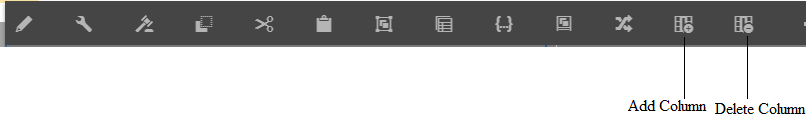

# Creazione di una comunicazione interattiva{#create-an-interactive-communication}

## Panoramica {#overview}

Le comunicazioni interattive centralizzano e gestiscono la creazione, l&#39;assemblaggio e la distribuzione di corrispondenze personalizzate e interattive. Utilizzando la stampa come canale principale per il Web, potete ridurre al minimo la duplicazione del lavoro per creare l&#39;output Web della comunicazione interattiva.

### Prerequisiti {#prerequisites}

Di seguito sono riportati i prerequisiti per la creazione di una comunicazione interattiva:

* Configurare un modello [dati](/help/forms/using/data-integration.md) modulo contenente dati di prova o con un&#39;origine dati effettiva, ad esempio un&#39;istanza di Microsoft® Dynamics.
* Assicurarsi di disporre dei frammenti del documento.
* Accertatevi di disporre di [Modelli per la stampa e il canale](/help/forms/using/web-channel-print-channel.md)Web.
* Accertatevi di disporre del [tema](/help/forms/using/themes.md) richiesto per il canale Web.

## Crea comunicazione interattiva {#createic}

1. Accedete all’istanza di creazione di AEM e andate a **[!UICONTROL Adobe Experience Manager]** > **[!UICONTROL Moduli]** > **[!UICONTROL Moduli e documenti]**.
1. Toccate **[!UICONTROL Crea]** e selezionate Comunicazione **** interattiva. Viene visualizzata la pagina Crea comunicazione interattiva.

   

1. Inserite le seguenti informazioni. :

   * **[!UICONTROL Titolo]**: Inserite il titolo della comunicazione interattiva.
   * **[!UICONTROL Nome]**: Il nome della comunicazione interattiva viene ricavato dal titolo immesso. Modificatelo, se necessario.
   * **[!UICONTROL Descrizione]**: Inserite una descrizione della comunicazione interattiva.
   * **[!UICONTROL Modello]** dati modulo: Individuare e selezionare il modello dati del modulo. Per ulteriori informazioni sul modello dati del modulo, vedere Integrazione [dei dati](/help/forms/using/data-integration.md)AEM Forms.

   * **[!UICONTROL Servizio]** di precompilazione: Selezionate il servizio di precompilazione per recuperare i dati e precompilare la comunicazione interattiva.
   * **[!UICONTROL Tipo]** post-processo: Potete selezionare il flusso di lavoro AEM o Forms da attivare all&#39;invio della comunicazione interattiva. Selezionare il tipo di flusso di lavoro da attivare.

   * **[!UICONTROL Post-processo]**: Selezionate il nome del flusso di lavoro da attivare. Quando si seleziona Flusso di lavoro AEM, specificare Percorso allegato, Percorso layout, Percorso PDF, Percorso dati di stampa e Percorso dati Web.
   * **[!UICONTROL Tag]**: Selezionate i tag da applicare alla comunicazione interattiva. Potete anche digitare un nome di tag nuovo/personalizzato e premere Invio per crearlo.
   * **[!UICONTROL Autore]**: il nome dell&#39;autore viene automaticamente prelevato dal nome utente dell&#39;utente connesso.
   * **[!UICONTROL Data pubblicazione:]** Immettete la data di pubblicazione della comunicazione interattiva.
   * **[!UICONTROL Data]** di annullamento pubblicazione: Immettete la data per annullare la pubblicazione della comunicazione interattiva.

1. Toccate **[!UICONTROL Avanti]**. Viene visualizzata la schermata per specificare i dettagli del canale Web e della stampa.
1. Digitate il testo seguente:

   * **[!UICONTROL Stampa]**: Selezionate questa opzione per generare il canale di stampa della comunicazione interattiva.
   * **[!UICONTROL Modello]** di stampa: Sfogliate e selezionate un XDP come modello di stampa.
   * **[!UICONTROL Web]**: Selezionate questa opzione per generare il canale Web o l&#39;output reattivo della comunicazione interattiva.
   * **[!UICONTROL Modello]** Web di comunicazione interattiva: Sfogliate e selezionate il modello Web.
   * **[!UICONTROL Tema]** e **[!UICONTROL Seleziona tema]**: Sfogliate e selezionate il tema per definire lo stile del canale Web della comunicazione interattiva. Per ulteriori informazioni, vedere [Temi in AEM Forms](/help/forms/using/themes.md).

   * **[!UICONTROL Usa stampa come principale per il canale]** Web: Selezionate questa opzione per creare il canale Web sincronizzato con il canale di stampa. L&#39;utilizzo del canale di stampa come master per il canale Web garantisce che il contenuto e il binding dei dati del canale Web siano derivati dal canale di stampa e che le modifiche apportate al canale di stampa si riflettano sul canale Web quando si tocca Sincronizza. Gli autori possono tuttavia interrompere l’ereditarietà di componenti specifici nel canale Web, a seconda delle necessità. Per ulteriori informazioni, vedere [Sincronizzare il canale Web con il canale](../../forms/using/create-interactive-communication.md#synchronize)Stampa.
Se selezionate l’opzione **[!UICONTROL Usa stampa come master per canale]** Web, potete selezionare una delle seguenti modalità per generare il canale Web:

      * **[!UICONTROL Layout]** automatico: Selezionare questa modalità per generare automaticamente segnaposto, contenuto e binding dei dati per il canale Web dal canale Stampa.
      * **[!UICONTROL Organizzare]** manualmente: Selezionare questa modalità per selezionare e aggiungere manualmente gli elementi del canale di stampa al canale Web utilizzando il contenuto principale disponibile nella scheda Origini **** dati. Per ulteriori informazioni, vedere [Selezione degli elementi del canale di stampa per creare contenuto](#selectprintchannelelements)del canale Web.

   Per ulteriori informazioni sui canali di stampa e web, vedere Canale di [stampa e canale](/help/forms/using/web-channel-print-channel.md)Web.

1. Toccate **[!UICONTROL Crea]**. Viene creata la comunicazione interattiva e viene visualizzata una finestra di avviso. Toccate **[!UICONTROL Modifica]** per iniziare a creare il contenuto della comunicazione interattiva come spiegato in [Aggiunta di contenuti mediante l’interfaccia](#step2)utente per la creazione di comunicazioni interattive. In alternativa, toccate **[!UICONTROL Fine]** e scegliete di modificare la comunicazione interattiva in un secondo momento.

## Aggiunta di contenuti alla comunicazione interattiva {#step2}

Dopo aver creato una comunicazione interattiva, potete usare l’interfaccia di creazione della comunicazione interattiva per crearne il contenuto.

Per ulteriori informazioni sull’interfaccia di authoring delle comunicazioni interattive, consulta [Introduzione all’authoring](/help/forms/using/introduction-interactive-communication-authoring.md)delle comunicazioni interattive.

1. L&#39;interfaccia di creazione delle comunicazioni interattive viene avviata quando toccate Modifica come indicato in [Creazione di comunicazioni](#createic)interattive. In alternativa, puoi accedere a una risorsa di comunicazione interattiva esistente su AEM, selezionarla e toccare **[!UICONTROL Modifica]** per avviare l’interfaccia di creazione della comunicazione interattiva.

   Per impostazione predefinita, viene visualizzato il canale di stampa della comunicazione interattiva, a meno che la comunicazione interattiva non sia solo per il canale Web. Il canale di stampa della comunicazione interattiva visualizza le aree di destinazione, come disponibile nel modello di canale XDP/stampa selezionato. In queste aree e campi di destinazione, potete aggiungere componenti o risorse.

1. Con il canale di stampa selezionato, selezionare la scheda **[!UICONTROL Componenti]** . I seguenti componenti sono disponibili nel canale di stampa:

   | **Componente** | **Funzionalità** |
   |---|---|
   | Grafico | Aggiunge un grafico che è possibile utilizzare nella comunicazione interattiva per la rappresentazione visiva dei dati bidimensionali recuperati da una raccolta di modelli di dati del modulo. Per ulteriori informazioni, consulta [Utilizzo dei grafici nelle comunicazioni](/help/forms/using/chart-component-interactive-communications.md)interattive. |
   | Frammento di documento | Consente di aggiungere a una comunicazione interattiva un componente riutilizzabile, ad esempio testo, elenco o condizione. Il componente aggiunto può essere basato su un modello dati del modulo o senza un modello dati del modulo. |
   | Immagine | Consente di inserire un’immagine. |

   Trascina i componenti nella comunicazione interattiva e configurali come necessario.

   È inoltre possibile utilizzare le operazioni di annullamento e ripristino durante la creazione di una comunicazione interattiva per i canali Stampa e Web.

   Utilizzare l&#39;operazione di annullamento per eliminare l&#39;ultima azione eseguita e l&#39;operazione di ripristino per incorporare di nuovo l&#39;azione eliminata. Ad esempio, se hai inserito un&#39;immagine o creato un binding di dati in una comunicazione interattiva e devi eliminarla, utilizza l&#39;operazione di annullamento.

   

   Le opzioni Annulla e Ripristina sono visualizzate nella barra degli strumenti dell’interfaccia utente di authoring. L&#39;opzione Annulla viene visualizzata solo dopo l&#39;esecuzione di un&#39;azione. L&#39;opzione Ripristina viene visualizzata sulla barra degli strumenti della pagina solo dopo l&#39;esecuzione di un&#39;operazione di annullamento. Queste azioni vengono reimpostate all’aggiornamento della pagina.

1. Con il canale di stampa selezionato, andate alla scheda **[!UICONTROL Risorse]** e applicate il filtro per visualizzare solo le risorse che desiderate vedere.

   Utilizzando il browser Risorse, puoi anche trascinare e rilasciare risorse direttamente nelle aree di destinazione delle comunicazioni interattive.

   

1. Trascinare i frammenti di documento nella comunicazione interattiva. Di seguito sono riportati i tipi di frammenti di documento che è possibile utilizzare nel canale di stampa della comunicazione interattiva.

<table>
 <tbody>
  <tr>
   <td><strong>Tipo frammento documento</strong></td>
   <td><strong>Esempio di scopo</strong></td>
  </tr>
  <tr>
   <td><a href="/help/forms/using/texts-interactive-communications.md" target="_blank">Testo</a></td>
   <td>Testo per aggiungere indirizzo, e-mail del destinatario e testo della lettera </td>
  </tr>
  <tr>
   <td><a href="/help/forms/using/conditions-interactive-communications.md" target="_blank">Condizione</a></td>
   <td>Condizione per aggiungere l'immagine di intestazione appropriata alla comunicazione in base al tipo di criterio: Standard o Premium.   </td>
  </tr>
  <tr>
   <td>Elenco</td>
   <td>Gruppo di frammenti di documento, inclusi testo, condizioni, altri elenchi e immagini.   </td>
  </tr>
 </tbody>
</table>

È inoltre possibile sostituire il binding tra un&#39;area di destinazione e un frammento di documento rilasciando il nuovo frammento nell&#39;area di destinazione utilizzando la scheda **[!UICONTROL Risorse]** . L&#39;ombreggiatura blu dell&#39;area di destinazione durante il trascinamento del frammento indica che è possibile rilasciare il frammento di documento nell&#39;area di destinazione.

Per ulteriori informazioni sui frammenti di documento, vedere [Frammenti](/help/forms/using/document-fragments.md)di documento.

L’interfaccia di authoring consente di distinguere tra i campi non associati e i campi associati e le variabili all’interno di una comunicazione interattiva. L&#39;interfaccia evidenzia i campi e le variabili non associati utilizzando un bordo arancione.

Inoltre, quando si passa il mouse su questi elementi, viene visualizzata una descrizione comandi con il messaggio Campo (non associato) o Variabile (non associato).

È possibile che talvolta nell’interfaccia di authoring non venga visualizzata una variabile non associata utilizzata in un frammento di documento. Può verificarsi a causa di una regola di testo in linea all&#39;interno di un frammento di documento o nel caso di un frammento di condizione. In questi casi, una descrizione comandi, evidenziata in blu, viene visualizzata come parte del frammento del documento. La descrizione comandi visualizza il numero di variabili non associate utilizzate all&#39;interno di un frammento di documento.

Toccate il frammento di documento, toccate  (Configura), quindi toccate **[!UICONTROL Proprietà]** dalla barra laterale della comunicazione interattiva. La sezione **[!UICONTROL Variabili e oggetti]** modello dati elenca le variabili, incluse le variabili nascoste e gli oggetti modello dati utilizzati nei frammenti del documento. Utilizzare l&#39;icona  (Modifica) accanto a ogni oggetto o variabile del modello dati per modificare le proprietà.

1. Per impostare il binding delle variabili, toccare una variabile e selezionare  (Configure), quindi impostare le proprietà di binding nel pannello Proprietà nella barra laterale.

   * **Nessuno**: L&#39;agente inserirà il valore della variabile.
   * **Frammento** di testo: Se questa opzione è selezionata, è possibile individuare e selezionare un frammento di documento di testo il cui contenuto è rappresentato nel campo. Solo i frammenti di documento di testo possono essere associati a variabili prive di variabili.
   * **Oggetto** modello dati: Selezionare una proprietà del modello dati del modulo il cui valore è popolato nel campo.
   * **Valore predefinito:** È possibile definire un valore predefinito per la variabile utilizzando questo campo. Il valore viene visualizzato quando si visualizza l&#39;anteprima della comunicazione interattiva o nell&#39;interfaccia utente dell&#39;agente.
   * **Pattern di visualizzazione:** È inoltre possibile definire un formato di visualizzazione per una variabile. Selezionare una delle opzioni predefinite dall&#39;elenco a discesa **Tipo** per applicare un formato di visualizzazione a una variabile. Selezionare **Personalizzato** per definire un pattern di visualizzazione non disponibile nell&#39;elenco. Per ulteriori informazioni, vedere [Pattern](../../forms/using/create-interactive-communication.md#datadisplaypatterns)di visualizzazione dei dati.

   Passare a [Variabili e oggetti](../../forms/using/create-interactive-communication.md#hiddenvariables) modello dati per impostare il binding di variabili nascoste nel frammento di documento.

   È inoltre possibile trascinare elementi di origine dati o frammenti di documenti di testo per impostare il binding delle variabili.  Per creare un binding con uno qualsiasi degli elementi dell&#39;origine dati, selezionare la scheda Origini **** dati e trascinare l&#39;elemento sul nome della variabile. L&#39;elemento e la variabile dell&#39;origine dati devono essere dello stesso tipo per impostare correttamente il binding. Se si trascina un elemento origine dati su una variabile già associata, il nuovo elemento sostituisce il precedente per creare un nuovo binding con la variabile. Allo stesso modo, seleziona la scheda **Risorse** e trascina il frammento del documento di testo sul nome della variabile per impostare il binding tra di essi. Il frammento di documento di testo non deve contenere variabili.

1. Per aggiungere una tabella, con il canale di stampa selezionato, nella scheda **[!UICONTROL Risorse]** applicare il filtro per visualizzare solo i frammenti di layout. Trascinate il frammento di layout desiderato nella comunicazione interattiva. Un frammento di layout è basato su un XDP e può essere utilizzato per creare layout grafici o tabelle statiche e dinamiche in Comunicazione interattiva con dati dinamici.

   Esempio: Tabella di layout per visualizzare il premio lordo, lo sconto fedeltà %, e la disponibilità di assistenza stradale di emergenza per le vecchie e le nuove politiche.

   Per ulteriori informazioni sui frammenti di layout, vedere [Frammenti](/help/forms/using/document-fragments.md)di documento.

1. Con il canale di stampa selezionato, nella scheda **[!UICONTROL Risorse]** applicare il filtro per visualizzare le immagini. Trascinate le immagini richieste nella comunicazione interattiva, ad esempio per il logo aziendale.

   Inoltre, nella comunicazione interattiva, gestite quanto segue:

   * [Aggiunta e configurazione di grafici](/help/forms/using/chart-component-interactive-communications.md)
   * [Sincronizzazione del canale Web con il canale di stampa](../../forms/using/create-interactive-communication.md#synchronize)

      * Sincronizzazione automatica
      * Annulla ereditarietà
      * Riabilita ereditarietà
      * Sincronizza
   * [Allegati e accesso alla libreria](../../forms/using/create-interactive-communication.md#attachmentslibrary)
   * [Proprietà dei campi XDP/Layout](../../forms/using/create-interactive-communication.md#xdplayoutfieldproperties)
   * [Aggiunta di regole ai componenti](../../forms/using/create-interactive-communication.md#rules)

1. Passate al canale **[!UICONTROL Web]**. Il canale Web viene visualizzato nell&#39;editor di comunicazione interattiva. Quando si passa dal canale Stampa al canale Web per la prima volta, si verifica la sincronizzazione automatica. Per ulteriori informazioni, vedere [Sincronizzazione del canale Web dal canale](../../forms/using/create-interactive-communication.md#synchronize)di stampa.

   Poiché in questo esempio viene utilizzata la funzione Stampa come master per il Web, i segnaposto dei canali di stampa, i contenuti e il binding dei dati vengono sincronizzati sul canale Web. Tuttavia, potete modificare e personalizzare il contenuto specifico del canale Web. [Annulla ereditarietà](#cancelinheritance) per le aree di destinazione e le variabili generate tramite il canale di stampa per personalizzare il contenuto.

   

   Toccate il frammento di documento, toccate  (Configura), quindi toccate **[!UICONTROL Proprietà]** dalla barra laterale della comunicazione interattiva. La sezione **[!UICONTROL Variabili e oggetti]** modello dati elenca le variabili, incluse le variabili nascoste e gli oggetti modello dati utilizzati nei frammenti del documento. Utilizzare l&#39;icona  (Modifica) accanto a ogni oggetto o variabile del modello dati per modificare le proprietà. Inoltre, per i frammenti di documento generati  automaticamente nel canale Web tramite il canale Stampa, utilizzare l&#39;icona  (Annulla ereditarietà) accanto a ciascun oggetto e variabile del modello dati per [annullare l&#39;ereditarietà](#cancelinheritance) e modificarli.

1. Per aggiungere altri componenti nel canale Web, toccate **[!UICONTROL Componenti]** con il canale Web selezionato. Trascina i componenti sul canale Web della comunicazione interattiva, come necessario, e procedi a configurarli.

   | Componenti | Funzionalità |
   |---|---|
   | Grafico | Aggiunge un grafico che è possibile utilizzare nella comunicazione interattiva per la rappresentazione visiva dei dati bidimensionali recuperati da una raccolta di modelli di dati del modulo. Per ulteriori informazioni, vedere [Uso del componente](../../forms/using/chart-component-interactive-communications.md)grafico. |
   | Frammento di documento | Consente di aggiungere a una comunicazione interattiva un componente, un testo, un elenco o una condizione riutilizzabili. Il componente riutilizzabile aggiunto a una comunicazione interattiva potrebbe essere basato su un modello dati del modulo o non su un modello dati del modulo. |
   | Immagine | Consente di inserire un’immagine. |
   | Pannello | Consente di aggiungere un [pannello](../../forms/using/create-interactive-communication.md#add-panel-component-to-the-web-channel) alla comunicazione interattiva. |
   | Tabella | Aggiunge una tabella che consente di organizzare i dati in righe e colonne. |
   | Area di destinazione | Inserisce un’area di destinazione in un canale Web per organizzare i componenti specifici del canale Web. Target area è un contenitore semplice che consente di raggruppare componenti specifici per i canali Web. |
   | Testo | Aggiunge testo RTF al canale Web di una comunicazione interattiva. Il testo può anche utilizzare oggetti modello dati modulo per rendere dinamico il contenuto. |
   | Pulsante | Consente di aggiungere un [pulsante](../../forms/using/create-interactive-communication.md#add-button-component-to-the-web-channel) alla comunicazione interattiva. Potete utilizzare il componente Pulsante per passare ad altre comunicazioni interattive, moduli adattivi, altre risorse come immagini o frammenti di documento o un URL esterno. |
   | Separatore | Consente di inserire una linea orizzontale all&#39;interno di una comunicazione interattiva. Utilizzate questo componente per distinguere tra sezioni in una corrispondenza. Ad esempio, è possibile utilizzare il componente Separatore per distinguere tra le sezioni Dettagli cliente e Dettagli carta di credito in un rendiconto della carta di credito. |

1. Se necessario, inserite le risorse nel canale Web.

   Potete [visualizzare l&#39;anteprima della comunicazione](#previewic) interattiva per vedere l&#39;aspetto della stampa e delle uscite Web della comunicazione interattiva e continuare a apportare le modifiche necessarie.

## Anteprima della comunicazione interattiva {#previewic}

Potete utilizzare l&#39;opzione **Anteprima** per valutare l&#39;aspetto della comunicazione interattiva. Il canale Web della comunicazione interattiva offre inoltre la possibilità di emulare l&#39;esperienza di una comunicazione interattiva per diversi dispositivi. Ad esempio, iPhone, iPad e Desktop. Potete utilizzare insieme le opzioni **Anteprima** ed **Emulatore**  per visualizzare in anteprima le uscite Web per dispositivi di diverse dimensioni di schermo. I dati di esempio contenuti nell&#39;anteprima vengono compilati a partire dal modello dati del modulo specificato.

1. Selezionate il canale (stampa o Web) per visualizzare l’anteprima e toccate Anteprima. Viene visualizzata la comunicazione interattiva.

   >[!NOTE]
   >
   >L&#39;anteprima viene compilata con i dati di esempio del modello dati del modulo specificato. Per ulteriori informazioni sulla visualizzazione in anteprima della comunicazione interattiva con altri dati o sull&#39;utilizzo del servizio di precompilazione, vedere [Uso del modello](/help/forms/using/using-form-data-model.md) dati del modulo e [Uso del modello](/help/forms/using/work-with-form-data-model.md)dati del modulo.

1. Per il canale Web, utilizzate il  per visualizzare l&#39;aspetto della comunicazione interattiva su vari dispositivi.

   

Inoltre, puoi [preparare e inviare comunicazioni interattive utilizzando l&#39;interfaccia utente](/help/forms/using/prepare-send-interactive-communication.md)agente.

## Configurare le proprietà nella comunicazione interattiva  {#configure-properties-in-interactive-communication}

### Allegati e accesso alla libreria {#attachmentslibrary}

Nel canale Stampa, puoi configurare gli allegati e l&#39;accesso alla libreria per consentire all&#39;agente di gestire gli allegati nell&#39;interfaccia utente dell&#39;agente per la comunicazione interattiva:

1. Nel canale Stampa, evidenziare il Contenitore documento e toccare **Proprietà**.

   

   Il pannello Proprietà viene visualizzato nella barra laterale.

   

1. Espandere **Allegati** e specificare le proprietà seguenti:

   * **[!UICONTROL Consenti accesso]** libreria: Selezionate questa opzione per abilitare l&#39;accesso alla libreria per l&#39;agente nell&#39;interfaccia utente dell&#39;agente. Se attivato, l&#39;agente può aggiungere i file dalla libreria durante la preparazione della comunicazione interattiva.
   * **[!UICONTROL Consenti Riordinamento Degli Allegati]**: Selezionare per abilitare l&#39;agente a riordinare gli allegati con la comunicazione interattiva.
   * **[!UICONTROL Numero Massimo Di Allegati Consentiti]**: Specificate il numero massimo di allegati consentiti con la comunicazione interattiva.
   * **[!UICONTROL File Da Allegare]**: Toccate **[!UICONTROL Aggiungi]** e sfogliate per selezionare i file da allegare e specificate quanto segue:

      * **[!UICONTROL Allega Questo File Al Documento Per Impostazione Predefinita]**: È possibile modificare questa opzione se solo l&#39;allegato non è obbligatorio.
      * **[!UICONTROL Obbligatorio:]** L&#39;agente non sarà in grado di rimuovere l&#39;allegato nell&#39;interfaccia utente dell&#39;agente.

   

1. Toccate **[!UICONTROL Chiudi]**.

### Proprietà dei campi XDP/Layout {#xdplayoutfieldproperties}

1. Durante la modifica del canale di stampa di una comunicazione interattiva, passare il mouse su un campo, creato nel modello del canale di stampa, e selezionare  (Configura).

   Nella barra laterale viene visualizzata la finestra di dialogo Proprietà.

   

1. Specificate quanto segue:

   * **[!UICONTROL Nome]**: Nome del nodo JCR.
   * **[!UICONTROL Titolo]**: Immettete un titolo che sarà visibile all’agente nell’interfaccia utente dell’agente e nella struttura del contenitore del documento.
   * **[!UICONTROL Tipo]** di binding: Selezionare uno dei seguenti tipi di binding per il campo.

      * Nessuno: L&#39;agente inserirà il valore della proprietà.
      * Frammento di testo: Se questa opzione è selezionata, è possibile individuare e selezionare un frammento di documento di testo il cui contenuto è rappresentato nel campo. In alternativa, trascinare il frammento del documento di testo sul nome del campo per impostare il binding tra di essi. Il frammento di documento di testo non deve contenere variabili.
      * Oggetto del modello dati: Selezionare una proprietà del modello dati del modulo il cui valore è popolato nel campo. In alternativa, seleziona la scheda **Origini** dati e trascina la proprietà sul campo.
   * **[!UICONTROL Valori]** predefiniti: Il valore predefinito assicura che il campo non sia vuoto se non è presente alcun valore fornito dall&#39;oggetto modello dati o dal frammento di testo specificato. Se il tipo di binding dei dati è none, il valore predefinito viene precompilato nel campo.
   * **[!UICONTROL Pattern]** di visualizzazione: È inoltre possibile definire un formato di visualizzazione per un campo. Selezionare una delle opzioni predefinite dall&#39;elenco a discesa **Tipo** per applicare un formato di visualizzazione a un campo. Selezionare **Personalizzato** per definire un pattern di visualizzazione non disponibile nell&#39;elenco. Per ulteriori informazioni, vedere Pattern di visualizzazione [dei dati](../../forms/using/create-interactive-communication.md#datadisplaypatterns)

   * **[!UICONTROL Modificabile dall&#39;agente]**: Selezionare questa opzione per consentire all&#39;agente di modificare il valore nel campo nell&#39;interfaccia utente dell&#39;agente. Questa impostazione non è applicabile se il tipo di binding è Frammento di testo.
   * **[!UICONTROL Etichetta]**: Specificate una stringa di testo da visualizzare con il campo all&#39;agente nell&#39;interfaccia utente dell&#39;agente. Questa impostazione non è applicabile se il tipo di binding è Frammento di testo.
   * **[!UICONTROL Descrizione]**: Immettere una stringa di testo che sarà visibile quando si passa il puntatore del mouse sull&#39;agente nell&#39;interfaccia utente dell&#39;agente. Questa impostazione non è applicabile se il tipo di binding è Frammento di testo.
   * **[!UICONTROL Obbligatorio]**: Selezionare questa opzione per rendere il campo obbligatorio per l&#39;agente. Questa impostazione non è applicabile se il tipo di binding è Frammento di testo.
   * **[!UICONTROL Consenti righe]** multiple: Selezionare questo campo per consentire l&#39;immissione di più righe di testo nel campo. Questa impostazione non è applicabile se il tipo di binding è Frammento di testo.

1. Toccate .

### Pattern di visualizzazione dei dati {#datadisplaypatterns}

L&#39;interfaccia di authoring consente di definire pattern di visualizzazione dei dati per campi, variabili ed elementi del modello di dati del modulo disponibili durante la creazione di una comunicazione interattiva per la stampa e i canali Web.

Per configurare il pattern di visualizzazione dei dati, toccate l&#39;elemento, selezionate  (Configure) e impostate il pattern di visualizzazione nel pannello **[!UICONTROL Proprietà]** nella barra laterale. Selezionare un&#39;opzione predefinita dall&#39;elenco a discesa **[!UICONTROL Tipo]** per visualizzare il pattern associato al tipo selezionato. Selezionare **[!UICONTROL Personalizzato]** dall&#39;elenco a discesa **[!UICONTROL Tipo]** per definire un pattern non disponibile nell&#39;elenco. La modifica dei valori nel campo **[!UICONTROL Pattern]** modifica automaticamente il tipo in **[!UICONTROL Personalizzato]**.

Per applicare il pattern di visualizzazione, il numero di caratteri o cifre definito nel campo Pattern deve corrispondere o superare i caratteri o le cifre definiti nel valore per i campi, le variabili e gli elementi del modello dati del modulo. For more information, see [example](../../forms/using/create-interactive-communication.md#greaternumberofdigits).

È possibile ridefinire il pattern di visualizzazione per un campo, una variabile o un elemento del modello dati modulo dopo la generazione del contenuto Web dal canale di stampa. Di conseguenza, un elemento può presentare pattern di visualizzazione diversi definiti per i canali di stampa e Web. Se non si definisce un pattern di visualizzazione per un elemento nel canale di stampa e si genera automaticamente il contenuto Web utilizzando il canale di stampa, il binding dei dati definito per l&#39;elemento nel canale di stampa definisce le opzioni del pattern di visualizzazione disponibili nell&#39;elenco a discesa **[!UICONTROL Tipo]** . Se non è definito alcun binding per l&#39;elemento, il tipo di dati dell&#39;elemento definisce le opzioni disponibili per il pattern di visualizzazione. Ad esempio, se si crea un binding di dati di tipo Number per un elemento nel canale di stampa, le opzioni del pattern di visualizzazione disponibili nell&#39;elenco a discesa **[!UICONTROL Tipo]** sono di tipo Number in vari formati.

Passate alla modalità **Anteprima** o aprite l&#39;interfaccia utente dell&#39;agente per visualizzare il pattern di visualizzazione applicato a questi elementi.

Nella tabella seguente è riportato un esempio dei valori visualizzati come risultato dell&#39;impostazione del pattern di visualizzazione dei dati per una variabile:

| Tipo | Valore predefinito | Pattern di visualizzazione | Valore visualizzato | Descrizione |
|---|---|---|---|---|
| Codice fiscale | 123456789 | text{999-99-9999} | 123-45-6789 | Il numero di cifre nel campo del valore predefinito corrisponde al numero di cifre nel campo Pattern. Il valore basato sul pattern viene visualizzato correttamente. |
| Codice fiscale | 1234567 | text{999-99-9999} | 1-23-4567 | Il numero di cifre nel campo del valore predefinito è inferiore al numero di cifre nel campo Pattern. Il pattern si applica alle 7 cifre disponibili. |
| Codice fiscale | 1234567890 | text{999-99-9999} | 1234567890 | Il numero di cifre nel campo del valore predefinito è maggiore del numero di cifre nel campo Pattern. Di conseguenza, il valore di visualizzazione non viene modificato. |

Se non viene specificato un pattern di visualizzazione per una variabile o un elemento del modello dati del modulo, per impostazione predefinita viene utilizzata la configurazione  globale del frammento di documento.

Se non si applica un pattern di visualizzazione a una variabile del tipo di dati numerico, nell&#39;anteprima di stampa viene visualizzato il pattern in base alla configurazione globale del frammento di documento. Se si applicano modifiche alla configurazione di frammento di documento globale predefinita, l&#39;interfaccia utente dell&#39;agente visualizza comunque il pattern in base ai separatori predefiniti definiti per le impostazioni internazionali.

Analogamente, per i campi, se il pattern di visualizzazione non è specificato, al campo viene applicato il pattern definito durante la creazione del modello di stampa (XDP). Se durante la creazione del modello di stampa non è presente alcun pattern, ai campi vengono applicati i pattern predefiniti basati sulle specifiche XFA.

Inoltre, se il pattern di visualizzazione specificato non è corretto o non può essere applicato, i pattern predefiniti basati sulle specifiche XFA vengono applicati ai campi, alle variabili o agli elementi del modello dati del modulo.

## Applicazione di regole ai componenti di comunicazione interattiva {#rules}

Per condizionare i componenti o il contenuto nella comunicazione interattiva, toccate il componente o il contenuto e selezionate  (Crea regola) per avviare Editor regole.

Per ulteriori informazioni, vedere:

* [Editor regola](/help/forms/using/rule-editor.md)
* [Introduzione all&#39;authoring delle comunicazioni interattive](/help/forms/using/introduction-interactive-communication-authoring.md)

## Uso delle tabelle {#tables}

### Tabelle dinamiche nella comunicazione interattiva {#dynamic-tables-in-interactive-communication}

È possibile aggiungere tabelle dinamiche in Comunicazione interattiva utilizzando i frammenti di layout. Nella procedura seguente viene illustrato l&#39;utilizzo di un frammento di layout per creare una tabella dinamica in una comunicazione interattiva tramite un esempio di istruzione con carta di credito.

1. Assicurati che il frammento di layout richiesto per la creazione della tabella sia disponibile in AEM.
1. Nel canale di stampa della comunicazione interattiva, trascinate un frammento di layout (con una tabella a più colonne) in un’area Target dal browser Risorse.

   

   Nell&#39;area del layout Comunicazione interattiva viene visualizzata una tabella.

   

1. Specificare il binding dei dati per ciascuna cella della tabella. Per creare una riga ripetibile, inserire le proprietà del modello dati del modulo nella riga appartenente a una proprietà raccolta comune.

   1. Toccate una cella nella tabella e selezionate  (Configura).

      Nella barra laterale viene visualizzata la finestra di dialogo Proprietà.

      

   1. Configurare le proprietà:

      * **[!UICONTROL Nome]**: Nome del nodo JCR.
      * **[!UICONTROL Titolo]**: Immettete un titolo che sarà visibile nell’editor per le comunicazioni interattive.
      * **[!UICONTROL Tipo]** di binding: Selezionare uno dei seguenti tipi di binding per il campo.

         * **[!UICONTROL Nessuno]**
         * **[!UICONTROL Oggetto]** del modello dati: Il valore della proprietà del modello dati del modulo è popolato nel campo. In alternativa, seleziona la scheda **Origini** dati e trascina la proprietà sul campo.
      * **[!UICONTROL Oggetto]** modello dati: La proprietà del modello dati del modulo il cui valore è popolato nel campo.
      * **[!UICONTROL Valore]** predefinito: Il valore predefinito assicura che il campo non sia vuoto se non è presente alcun valore fornito dall&#39;oggetto modello dati specificato. Il valore predefinito è precompilato nel campo.

      * **[!UICONTROL Modificabile dall&#39;agente]**: Selezionare questa opzione per consentire all&#39;agente di modificare il valore nel campo nell&#39;interfaccia utente dell&#39;agente.
   1. Toccate .

1. Visualizzate l&#39;anteprima della comunicazione interattiva per visualizzare la tabella rappresentata con i dati.

   

### Tabelle solo per canali Web {#webchanneltables}

Toccate il pannello principale nel modello Web e toccate **+** per aggiungere un componente **Tabella** alla comunicazione interattiva. Nella comunicazione interattiva viene inserita una tabella contenente due righe. La prima riga della tabella rappresenta l&#39;intestazione della tabella.

#### Aggiungere righe e colonne alla tabella {#addrowscolumnstable}

**Per aggiungere o eliminare colonne:**

1. Toccate la casella di testo predefinita nella riga di intestazione della tabella per visualizzare la barra degli strumenti del componente.
1. Selezionare **Aggiungi colonna** o **Elimina colonna** per aggiungere o eliminare rispettivamente le colonne della tabella.

**Per aggiungere o eliminare righe:**

1. Toccate una delle righe della tabella per visualizzare la barra degli strumenti del componente. Potete anche selezionare la riga di tabella utilizzando il browser Contenuto nella barra laterale della comunicazione interattiva.
1. Selezionare **Aggiungi riga** o **Elimina riga** per aggiungere o eliminare rispettivamente le righe della tabella. Per ridisporre le righe nella tabella, usate le opzioni **Sposta su** e **Sposta giù** disponibili nella barra degli strumenti.

**A.** Aggiungi riga **B.** Elimina riga **C.** Sposta in alto **D.** Sposta in basso

#### Aggiungere o modificare il testo nelle celle di una tabella {#addedittexttable}

1. Selezionare la casella di testo predefinita nella cella della tabella e toccare  (Modifica).
1. Digitate il testo nella cella della tabella e toccate  per salvarlo.

#### Creazione di un binding tra le celle della tabella e gli elementi dell&#39;oggetto modello dati {#createbindingtablecells}

1. Selezionare la casella di testo predefinita nella riga della tabella e toccare  (Modifica).
1. Toccare l&#39;elenco a discesa degli oggetti del modello dati e selezionare la proprietà.
1. Toccare per salvare e creare un binding tra la cella della tabella e la proprietà dell&#39;oggetto modello dati.

#### Creare un collegamento ipertestuale per il testo nella cella della tabella {#createhyperlinktable}

1. Selezionare la casella di testo predefinita nella cella della tabella e toccare  (Modifica).
1. Selezionare il testo nella cella della tabella e toccare l&#39;icona Collegamento ipertestuale.
1. Specificate l’URL nel campo **Percorso** .
1. Toccate  per salvare le proprietà del collegamento ipertestuale.

#### Creare tabelle dinamiche {#createdynamictables}

È possibile creare una tabella dinamica solo per i canali Web in una comunicazione interattiva utilizzando una proprietà del modello dati di raccolta di tipi. Una tabella di questo tipo è una rappresentazione delle proprietà figlio di una raccolta. È possibile modificare solo le proprietà di formattazione delle varie celle della tabella.

1. Passate al canale Web e scegliete di visualizzare il browser Origini dati.
1. Trascinare una proprietà della raccolta in un sottomodulo. Nel sottomodulo viene creata una tabella.
1. Visualizzare l&#39;anteprima della tabella nell&#39;anteprima Web della comunicazione interattiva.

#### Ordinare le colonne in una tabella {#sortcolumns}

Puoi ordinare i dati in base a qualsiasi colonna di una tabella nella comunicazione interattiva. I valori nella colonna possono essere ordinati in ordine crescente o decrescente.

L&#39;ordinamento può essere applicato alle colonne di tabelle contenenti:

* Testo statico
* Proprietà dell&#39;oggetto modello dati
* Combinazione di proprietà statiche dell&#39;oggetto testo e modello dati

Per abilitare l&#39;ordinamento:

1. Selezionate la tabella e toccate  (Configure). Potete anche selezionare la tabella utilizzando il browser **Contenuto** nella barra laterale della comunicazione interattiva.
1. Selezionate **Abilita ordinamento.**
1. Toccate  per salvare le proprietà della tabella. Le icone di ordinamento, le frecce su e giù, nelle intestazioni delle colonne, indicano che l&#39;ordinamento è stato attivato.

   

1. Passate alla modalità **Anteprima** per visualizzare l’output. La tabella viene ordinata automaticamente in base alla prima colonna della tabella.
1. Fate clic sull’intestazione della colonna per ordinare i valori in base alla colonna.

   Un&#39;intestazione di colonna con una freccia su rappresenta quanto segue:

   * la tabella è ordinata in base a tale colonna.
   * i valori nella colonna vengono visualizzati nell&#39;ordine crescente.

   

   Analogamente, un&#39;intestazione di colonna con una freccia rivolta verso il basso rappresenta la visualizzazione dei valori della colonna in ordine decrescente.

## Modifica delle proprietà di comunicazione interattiva {#edit-interactive-communication-properties}

Dopo aver creato una comunicazione interattiva, potete modificarne le proprietà in un secondo momento.

Utilizzare la pagina **Proprietà** per:

* Modificate i valori per i campi specificati durante la creazione della comunicazione interattiva, ad esempio Titolo e Descrizione.
* Aggiunta o eliminazione di un canale Web per una comunicazione interattiva esistente.
* Visualizzare in anteprima, scaricare o eliminare la comunicazione interattiva
* Aprite l’interfaccia utente dell’ [agente](/help/forms/using/prepare-send-interactive-communication.md).

Per accedere alla pagina **Proprietà** :

1. Accedete all’istanza di creazione di AEM e andate a **Adobe Experience Manager** > **Moduli** > **Moduli e documenti**.
1. Selezionate la comunicazione interattiva e toccate **Proprietà**.
1. Selezionate la scheda **Generale** per modificare i campi **Titolo** e **Descrizione** .

### Aggiunta o eliminazione del canale Web {#add-or-delete-the-web-channel}

Per aggiungere il canale Web per una comunicazione interattiva esistente, eseguite i seguenti passaggi:

1. Nella pagina **Proprietà** , selezionate la scheda **Canali** .
1. Selezionate la casella di controllo **Web** e selezionate un modello per il canale Web.
1. Selezionate **Usa stampa come principale per canale** Web per abilitare la sincronizzazione tra il canale Web e il canale Stampa.
1. Tap **Save &amp; Close** to save the changes.

   Allo stesso modo, potete toccare la casella di controllo **Web** nella scheda **Canali** per eliminare il canale Web dalla comunicazione interattiva.

## Aggiungi componente Pulsante al canale Web {#add-button-component-to-the-web-channel}

È possibile aggiungere un pulsante come componente al canale Web della comunicazione interattiva. Definite le regole utilizzando l&#39;editor [delle](../../forms/using/rule-editor.md) regole per passare ad altre comunicazioni interattive, moduli adattivi, altre risorse come immagini o frammenti di documento o un URL esterno toccando il pulsante.

Per aggiungere un pulsante e definire le relative regole:

1. Toccate il pannello principale nel modello Web e toccate **+** per aggiungere il componente **Pulsante** alla comunicazione interattiva.
1. Toccate il componente pulsante e toccate  di modifica per definire le regole sul tocco del pulsante.
1. Nella sezione **Quando** , selezionare **premuto** dallo stato dell&#39;elenco a discesa del pulsante.
1. Nella sezione **Quindi** :

   1. Selezionare un&#39;azione dall&#39;elenco a discesa. Ad esempio, selezionare **Passa** al tipo di azione.

   1. Specificate l&#39;URL della comunicazione interattiva, del modulo adattivo, di una risorsa o di una pagina Web. Ad esempio, specificate l’URL nel formato seguente per passare a un’altra comunicazione interattiva: https://&lt;nome-server>:&lt;porta>/editor.html/content/forms/af/&lt;nome-comunicazione interattiva>/channel/&lt;nome-canale - stampa o Web>.html
   1. Specificate l&#39;opzione per aprire la risorsa nella stessa scheda, nuova scheda o in una nuova finestra.
   1. Toccate **Fine** e quindi **Chiudi** per salvare la regola.

   Allo stesso modo, è possibile selezionare altre opzioni disponibili dall&#39;elenco a discesa del tipo di azione, ad esempio Richiama il servizio e Invia modulo. Per ulteriori informazioni, consultate Editor regole.

1. Visualizzate l’anteprima della comunicazione interattiva e toccate il pulsante per visualizzare la comunicazione interattiva, il modulo adattivo, una risorsa o una pagina Web specificata al punto 4, lettera b).

## Aggiunta del componente Pannello al canale Web {#add-panel-component-to-the-web-channel}

Il componente Pannello è un segnaposto per raggruppare altri componenti e controlla il modo in cui un gruppo di componenti, come fisarmonica e schede, vengono disposti nella comunicazione interattiva. Un componente pannello consente inoltre di rendere ripetibile un gruppo di componenti per l’utente finale, ad esempio in più voci richieste per compilare le credenziali educative.

Per aggiungere un componente Pannello al canale Web, effettuate le seguenti operazioni:

1. Inserite il componente **Pannello** nel canale Web utilizzando una delle seguenti opzioni:

   * Toccate un componente, toccate **+** e selezionate il componente **Pannello** .

   * Dal pannello del browser **Componenti** , trascinate il componente **Pannello** nella comunicazione interattiva.

   * Toccate il **pannello** nel pannello del browser **Contenuto** e toccate **Aggiungi pannello** secondario. Quando si seleziona l’opzione **Aggiungi pannello** secondario viene visualizzata la finestra di dialogo **Aggiungi pannello** secondario. Inserite il titolo e una descrizione e un nome facoltativi per il componente Pannello.

1. Toccate il pannello dal browser **Contenuto** per eseguire azioni aggiuntive sul pannello, ad esempio configurare, modificare le regole, copiare, eliminare e inserire il componente.

   Potete anche trascinare un pannello nel browser **Contenuto** per riflettere la modifica nella struttura della comunicazione interattiva nel riquadro a destra.

## Sincronizzazione del canale Web con il canale di stampa {#synchronize}

Quando si seleziona Stampa come canale principale per il canale Web durante la creazione di una comunicazione interattiva, il canale Web viene creato in sincronia con il canale Stampa e il binding dei contenuti e dei dati del canale Web viene derivato dal canale di stampa e le modifiche apportate al canale di stampa potrebbero riflettersi nel canale Web toccando Sincronizza.

Gli autori possono tuttavia interrompere l’ereditarietà dei componenti nel canale Web, a seconda delle necessità.

 

### Sincronizzazione automatica {#autosync}

Se selezionate l’opzione **[!UICONTROL Usa stampa come master per canale]** Web, potete selezionare una delle seguenti modalità per generare il canale Web:

* **[!UICONTROL Layout]** automatico: Selezionare questa modalità per generare automaticamente segnaposto, contenuto e binding dei dati per il canale Web dal canale Stampa.
* **[!UICONTROL Organizzare]** manualmente: Selezionare questa modalità per selezionare e aggiungere manualmente gli elementi del canale di stampa al canale Web utilizzando il contenuto principale disponibile nella scheda Origini dati. Per ulteriori informazioni, vedere [Selezione degli elementi del canale di stampa per creare contenuto](#selectprintchannelelements)del canale Web.

>[!NOTE]
>
>La sincronizzazione dei canali sincronizza solo i frammenti di documento, le immagini, le condizioni, gli elenchi e i frammenti di layout dal canale di stampa al canale Web. I sottomoduli o i nodi padre che includono tali elementi non sono sincronizzati.

### Selezionare gli elementi del canale di stampa per creare il contenuto del canale Web {#selectprintchannelelements}

Se durante la creazione della comunicazione interattiva selezionate Stampa come elemento principale e non selezionate l’opzione di sincronizzazione automatica, potete anche trascinare gli elementi del canale Stampa nell’interfaccia di creazione del canale Web.

Andate a **Origini** dati > Contenuto **** principale per visualizzare gli elementi del canale Stampa. Trascinare le aree, i campi o le tabelle di destinazione nell’interfaccia di authoring del canale Web. Un&#39;icona a forma di cerchio blu accanto al nome dell&#39;elemento indica che l&#39;elemento del canale Stampa è già stato incluso nel canale Web.

### Annulla ereditarietà {#cancelinheritance}

Nel canale Web, i componenti sono incorporati nelle aree di destinazione.

Passa il cursore del mouse sull’area di destinazione o sulla variabile pertinente nel canale Web e seleziona  (Annulla ereditarietà), quindi tocca **[!UICONTROL Sì]** nella finestra di dialogo Annulla ereditarietà.

L&#39;ereditarietà dei componenti all&#39;interno dell&#39;area di destinazione viene annullata e ora è possibile modificarli come necessario.

### Riattiva ereditarietà {#re-enable-inheritance}

Nel canale Web, se avete annullato l’ereditarietà di un componente, potete riattivarlo. Per abilitare nuovamente l&#39;ereditarietà, passate il puntatore del mouse sul contorno dell&#39;area di destinazione interessata, che include il componente, e toccate .

Viene visualizzata la finestra di dialogo Ripristina ereditarietà.

Se necessario, selezionate **[!UICONTROL Sincronizza pagina dopo il ripristino dell’ereditarietà]**. Selezionate questa opzione per sincronizzare l&#39;intera comunicazione interattiva. Se non si seleziona questa opzione, al ripristino dell&#39;ereditarietà viene sincronizzata solo l&#39;area di destinazione interessata.

Toccate **[!UICONTROL Sì]**.

### Sincronizza {#synchronize-1}

Se si utilizza Stampa come canale principale per il canale Web e si apportano modifiche al canale Stampa, è possibile sincronizzare i contenuti per apportare le modifiche appena apportate al canale Web.

1. Per sincronizzare il canale Web con il canale Stampa, passare al canale Web e toccare l&#39;icona Altre opzioni.

   

1. Toccate una delle seguenti opzioni:

   * **[!UICONTROL Sincronizza con stampa]**: Sincronizza il contenuto solo per le aree di destinazione in cui l&#39;ereditarietà non viene annullata.
   * **[!UICONTROL Reimposta]**: Sincronizza il contenuto del canale Web con il canale Stampa e scarta tutte le modifiche apportate al canale Web.

### Utilizzare la barra degli strumenti dei componenti per eseguire azioni sui componenti ereditati {#componenttoolbar}

Dopo aver generato automaticamente il contenuto nel canale Web utilizzando l&#39;opzione Sincronizza, potete eseguire più azioni sui componenti senza annullare l&#39;ereditarietà.

Toccate il componente per visualizzare le seguenti opzioni:

* **Copia:** Copiate un componente e incollatelo in altre aree della comunicazione interattiva.
* **Taglia:** Spostare un componente da un punto all’altro nella comunicazione interattiva.
* **Inserisci componente:** Inserisci un componente sopra il componente selezionato.
* **Incolla:** Incollate il componente tagliato o copiato utilizzando le opzioni descritte sopra.
* **Gruppo:** Selezionate più componenti se desiderate tagliare, copiare o incollare insieme più componenti.
* **Elemento padre:** Selezionate l’elemento padre di un componente.
* **Visualizza espressione SOM:** Visualizzare l&#39;espressione  SOM per il componente.

* **Raggruppa oggetti nel pannello:** Raggruppare i componenti in un pannello per eseguire contemporaneamente operazioni su tali componenti. Per informazioni dettagliate, consultate [Raggruppare gli oggetti nel pannello](#groupobjectspanel).

* **Annulla ereditarietà:** [Annulla l’ereditarietà](#cancelinheritance) dei componenti nell’area di destinazione per modificarli.

### Group objects in Panel {#groupobjectspanel}

L’interfaccia di authoring dei canali Web facilita il raggruppamento dei componenti in un pannello per eseguire contemporaneamente operazioni su tali componenti. La scheda **Contenuto** elenca i componenti raggruppati come elementi secondari del pannello nella struttura del contenuto.

1. Toccate un componente e selezionate l’operazione Gruppo ( ).
1. Selezionate più componenti e toccate gli oggetti **Gruppo nel pannello**.

   

1. Nella finestra di dialogo **Raggruppa oggetti nel pannello** , inserite un nome per il pannello.
1. Inserite un titolo e una descrizione facoltativi per il pannello.
1. Fare clic su .

   I componenti raggruppati vengono visualizzati come elementi secondari del pannello nella struttura del contenuto.

   

