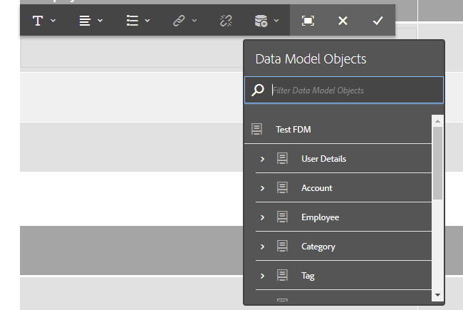

# Creare una comunicazione interattiva{#create-an-interactive-communication}

## Panoramica {#overview}

Le comunicazioni interattive centralizzano e gestiscono la creazione, l’assemblaggio e la consegna di corrispondenze personalizzate e interattive. Utilizza stampa come canale principale per il web, puoi ridurre al minimo la duplicazione degli sforzi nella creazione dell’output web della comunicazione interattiva.

### Prerequisiti {#prerequisites}

Di seguito sono riportati i prerequisiti per la creazione di una comunicazione interattiva:

* Configurare un [Modello dati modulo](/help/forms/using/data-integration.md) contenente dati di test o con un’origine dati effettiva, ad esempio un’istanza di Microsoft® Dynamics.
* Assicurati di disporre di [Frammenti di documenti](/help/forms/using/document-fragments.md).
* Assicurati di avere [Modelli per stampa e canale web](/help/forms/using/web-channel-print-channel.md).
* Assicurati di disporre dei [tema](/help/forms/using/themes.md) per il canale web.

## Crea comunicazione interattiva {#createic}

1. Accedi all’istanza di authoring dell’AEM e passa a **[!UICONTROL Adobe Experience Manager]** > **[!UICONTROL Forms]** > **[!UICONTROL Forms e documenti]**.
1. Tocca **[!UICONTROL Crea]** e seleziona **[!UICONTROL Comunicazione interattiva]**. Viene visualizzata la pagina Crea comunicazione interattiva.

   

1. Immettere le seguenti informazioni. :

   * **[!UICONTROL Titolo]**: immetti il titolo della comunicazione interattiva.
   * **[!UICONTROL Nome]**: il nome della comunicazione interattiva deriva dal titolo immesso. Se necessario, modificalo.
   * **[!UICONTROL Descrizione]**: immetti una descrizione della comunicazione interattiva.
   * **[!UICONTROL Modello dati modulo]**: sfoglia e seleziona il modello dati del modulo. Per ulteriori informazioni sul modello dati modulo, consulta [Integrazione dei dati di AEM Forms](/help/forms/using/data-integration.md).

   * **[!UICONTROL Servizio preriempimento]**: seleziona il servizio di precompilazione per recuperare i dati e precompilare la comunicazione interattiva.
   * **[!UICONTROL Tipo post-elaborazione]**: puoi selezionare il flusso di lavoro AEM o Forms da attivare quando viene inviata la comunicazione interattiva. Seleziona il tipo di flusso di lavoro da attivare.

   * **[!UICONTROL Post-elaborazione]**: seleziona il nome del flusso di lavoro da attivare. Quando si seleziona un flusso di lavoro AEM, specificare Percorso allegato, Percorso layout, Percorso PDF, Percorso dati di stampa e Percorso dati Web.
   * **[!UICONTROL Tag]**: seleziona i tag da applicare alla comunicazione interattiva. Puoi anche immettere un nome di tag nuovo/personalizzato e premere Invio per crearlo.
   * **[!UICONTROL Autore]**: il nome dell’autore viene ricavato automaticamente dal nome utente dell’utente connesso.
   * **[!UICONTROL Data pubblicazione:]** Immetti la data in cui pubblicare la comunicazione interattiva.
   * **[!UICONTROL Data di annullamento pubblicazione]**: immetti la data in cui annullare la pubblicazione della comunicazione interattiva.

1. Tocca **[!UICONTROL Successivo]**. Viene visualizzata la schermata che consente di specificare i dettagli dei canali di stampa e web.
1. Immetti quanto segue:

   * **[!UICONTROL Stampa]**: seleziona questa opzione per generare il canale di stampa della comunicazione interattiva.
   * **[!UICONTROL Stampa modello]**: sfoglia e seleziona un XDP come modello di stampa.
   * **[!UICONTROL Web]**: seleziona questa opzione per generare il canale web o l’output reattivo della comunicazione interattiva.
   * **[!UICONTROL Modello web di comunicazione interattiva]**: sfoglia e seleziona il modello web.
   * **[!UICONTROL Tema]** e **[!UICONTROL Seleziona tema]**: sfoglia e seleziona il tema per assegnare uno stile al canale web della comunicazione interattiva. Per ulteriori informazioni, consulta [Temi in AEM Forms](/help/forms/using/themes.md).

   * **[!UICONTROL Usa stampa come master per canale web]**: seleziona questa opzione per creare il canale web sincronizzato con il canale di stampa. L&#39;utilizzo del canale di stampa come master per il canale Web garantisce che il contenuto e l&#39;associazione dati del canale Web derivino dal canale di stampa e che le modifiche apportate al canale di stampa vengano applicate al canale Web quando si tocca Sincronizza. Tuttavia, agli autori è consentito interrompere l’ereditarietà di componenti specifici nel canale web, in base alle esigenze. Per ulteriori informazioni, consulta [Sincronizza canale web con canale di stampa](../../forms/using/create-interactive-communication.md#synchronize).
Se si seleziona la **[!UICONTROL Usa stampa come master per canale web]** , è possibile selezionare una delle seguenti modalità per generare il canale Web:

      * **[!UICONTROL Layout automatico]**: seleziona questa modalità per generare automaticamente segnaposto, contenuto e associazione dati per il canale web dal canale di stampa.
      * **[!UICONTROL Organizza manualmente]**: seleziona questa modalità per selezionare e aggiungere manualmente gli elementi del canale di stampa al canale web utilizzando il contenuto principale disponibile nella **[!UICONTROL Origini dati]** scheda. Per ulteriori informazioni, consulta [Seleziona Stampa elementi canale per creare contenuti canale web](#selectprintchannelelements).

   Per ulteriori informazioni sul canale di stampa e sul canale web, consulta [Canale di stampa e canale web](/help/forms/using/web-channel-print-channel.md).

1. Tocca **[!UICONTROL Crea]**. Viene creata la comunicazione interattiva e viene visualizzata una finestra di avviso. Tocca **[!UICONTROL Modifica]** per iniziare a creare i contenuti della comunicazione interattiva come spiegato in [Aggiungi contenuti tramite l’interfaccia utente di creazione di comunicazioni interattive](#step2). In alternativa, puoi toccare **[!UICONTROL Fine]** e scegliere di modificare la comunicazione interattiva in un secondo momento.

## Aggiungere contenuto alla comunicazione interattiva {#step2}

Dopo aver creato una comunicazione interattiva, puoi utilizzare l’interfaccia di authoring di comunicazione interattiva per crearne il contenuto.

Per ulteriori informazioni sull’interfaccia di authoring di comunicazioni interattive, consulta [Introduzione all’authoring di comunicazioni interattive](/help/forms/using/introduction-interactive-communication-authoring.md).

1. L’interfaccia di authoring della comunicazione interattiva viene avviata quando tocchi Modifica come indicato in [Creare una comunicazione interattiva](#createic). In alternativa, puoi passare a una risorsa di comunicazione interattiva esistente su AEM, selezionarla e toccare **[!UICONTROL Modifica]** per avviare l&#39;interfaccia di creazione di comunicazioni interattive.

   Per impostazione predefinita, viene visualizzato il canale di stampa della comunicazione interattiva, a meno che la comunicazione interattiva non sia solo per il canale web. Il canale Stampa della comunicazione interattiva visualizza le aree di destinazione, come disponibili nel modello di canale XDP/stampa selezionato. In queste aree e questi campi di destinazione, puoi aggiungere componenti o risorse.

1. Con il canale di stampa selezionato, selezionare **[!UICONTROL Componenti]** scheda. Nel canale di stampa sono disponibili i seguenti componenti:

   | **Component** | **Funzionalità** |
   |---|---|
   | Grafico | Aggiunge un grafico che è possibile utilizzare nella comunicazione interattiva per la rappresentazione visiva di dati bidimensionali recuperati da un insieme di modelli di dati del modulo. Per ulteriori informazioni, consulta [Utilizzo dei grafici nelle comunicazioni interattive](/help/forms/using/chart-component-interactive-communications.md). |
   | Frammento di documento | Consente di aggiungere a una comunicazione interattiva un componente riutilizzabile, ad esempio testo, elenco o condizione. Il componente aggiunto può essere basato su un modello di dati modulo o senza un modello di dati modulo. |
   | Immagine | Consente di inserire un&#39;immagine. |

   Trascina i componenti nella comunicazione interattiva e configurali come richiesto.

   È inoltre possibile utilizzare le operazioni Annulla e Ripristina durante la creazione di una comunicazione interattiva sia per i canali di stampa che per quelli Web.

   Utilizzare l&#39;operazione Annulla per annullare l&#39;ultima azione eseguita e l&#39;operazione Ripeti per incorporare nuovamente l&#39;azione eliminata. Se, ad esempio, è stata inserita un&#39;immagine o creata un&#39;associazione dati in una comunicazione interattiva ed è necessario eliminarla, utilizzare l&#39;operazione Annulla.

   

   Le opzioni Annulla e Ripristina vengono visualizzate sulla barra degli strumenti della pagina dell’interfaccia utente di authoring. L&#39;opzione Annulla (Undo) viene visualizzata solo dopo aver eseguito un&#39;azione. L&#39;opzione Ripristina viene visualizzata sulla barra degli strumenti della pagina solo dopo l&#39;esecuzione di un&#39;operazione Annulla. Queste azioni vengono reimpostate all’aggiornamento della pagina.

1. Con il canale di stampa selezionato, vai al **[!UICONTROL Risorse]** e applica il filtro per visualizzare solo le risorse che desideri visualizzare.

   Utilizzando il browser Risorse, puoi anche trascinare e rilasciare direttamente le risorse nelle aree di destinazione della comunicazione interattiva.

   

1. Trascinare i frammenti del documento nella comunicazione interattiva. Di seguito sono elencati i tipi di frammenti di documento che è possibile utilizzare nel canale di stampa della comunicazione interattiva.

<table>
 <tbody>
  <tr>
   <td><strong>Tipo frammento documento</strong></td>
   <td><strong>Scopo di esempio</strong></td>
  </tr>
  <tr>
   <td><a href="/help/forms/using/texts-interactive-communications.md" target="_blank">Testo</a></td>
   <td>Testo per aggiungere l’indirizzo, l’e-mail del destinatario e il corpo del testo della lettera </td>
  </tr>
  <tr>
   <td><a href="/help/forms/using/conditions-interactive-communications.md" target="_blank">Condizione</a></td>
   <td>Condizione per aggiungere l’immagine di intestazione appropriata alla comunicazione in base al tipo di criterio: Standard o Premium. <br /> </td>
  </tr>
  <tr>
   <td>Elenco</td>
   <td>Gruppo di frammenti di documenti, inclusi testo, condizioni, altri elenchi e immagini. <br /> </td>
  </tr>
 </tbody>
</table>

È inoltre possibile sostituire l’associazione tra un’area di destinazione e un frammento di documento rilasciando il nuovo frammento sull’area di destinazione utilizzando **[!UICONTROL Risorse]** scheda. L’ombreggiatura blu dell’area di destinazione durante il trascinamento del frammento indica che il frammento di documento può essere rilasciato nell’area di destinazione.

Per ulteriori informazioni sui frammenti di documenti, vedere [Frammenti di documenti](/help/forms/using/document-fragments.md).

L’interfaccia di authoring consente di distinguere tra campi e variabili non associati e associati all’interno di una comunicazione interattiva. L’interfaccia evidenzia i campi e le variabili non associati utilizzando un bordo arancione.


Inoltre, quando passi il mouse su questi elementi, viene visualizzata una descrizione con il messaggio Campo (non associato) o Variabile (non associato).

Talvolta, una variabile non associata utilizzata in un frammento di documento potrebbe non essere visualizzata nell’interfaccia di creazione. Può verificarsi a causa di una regola di testo in linea all’interno di un frammento di documento o in caso di un frammento di condizione. In questi casi, una descrizione, evidenziata in blu, viene visualizzata come parte del frammento di documento. Nella descrizione viene visualizzato il numero di variabili non associate utilizzate all’interno di un frammento di documento.


Tocca il frammento del documento e tocca  (Configura), quindi tocca **[!UICONTROL Proprietà]** dalla barra laterale della comunicazione interattiva. Il **[!UICONTROL Variabili e oggetti modello dati]** In questa sezione sono elencate le variabili, incluse le variabili nascoste, e gli oggetti modello dati utilizzati nei frammenti di documento. Utilizza il  (Modifica) accanto a ciascun oggetto modello dati o variabile per modificare le proprietà.

1. Per impostare l’associazione delle variabili, tocca una variabile e seleziona  (Configura) e quindi impostare le proprietà di binding nel pannello Proprietà nella barra laterale.

   * **Nessuno**: l’agente inserirà il valore della variabile.
   * **Frammento di testo**: se selezionata, puoi sfogliare e selezionare un frammento di documento di testo di cui viene eseguito il rendering del contenuto nel campo. Solo i frammenti di documenti di testo possono essere associati a variabili prive di variabili in.
   * **Oggetto modello dati**: seleziona una proprietà del modello dati del modulo il cui valore viene popolato nel campo.
   * **Valore predefinito:** Puoi definire un valore predefinito per la variabile utilizzando questo campo. Il valore viene visualizzato quando visualizzi l’anteprima della comunicazione interattiva o nell’interfaccia utente dell’agente.
   * **Pattern di visualizzazione:** Puoi anche definire un formato di visualizzazione per una variabile. Seleziona una delle opzioni predefinite dal menu **Tipo** per applicare un formato di visualizzazione a una variabile. Seleziona **Personalizzato** per definire un pattern di visualizzazione non disponibile nell&#39;elenco. Per ulteriori informazioni, consulta [Modelli di visualizzazione dei dati](../../forms/using/create-interactive-communication.md#datadisplaypatterns).

   Accedi a [Variabili e oggetti modello dati](../../forms/using/create-interactive-communication.md#hiddenvariables) per impostare l’associazione delle variabili nascoste nel frammento di documento.

   È inoltre possibile trascinare elementi dell’origine dati o frammenti di documenti di testo per impostare l’associazione delle variabili.  Per creare un&#39;associazione con uno qualsiasi degli elementi dell&#39;origine dati, selezionare **Origini dati** e trascina l’elemento sul nome della variabile. L&#39;elemento e la variabile dell&#39;origine dati devono essere dello stesso tipo per impostare correttamente l&#39;associazione. Se trascini un elemento origine dati su una variabile già associata, il nuovo elemento sostituisce il precedente per creare un&#39;associazione con la variabile. Allo stesso modo, seleziona la **Risorse** e trascina il frammento di documento di testo sul nome della variabile per impostare l’associazione tra di essi. Il frammento di documento di testo non deve contenere variabili.

1. Per aggiungere una tabella, con il canale di stampa selezionato, nel **[!UICONTROL Risorse]** applica il filtro per visualizzare solo i frammenti di layout. Trascina il frammento di layout richiesto nella comunicazione interattiva. Un frammento di layout è basato su un XDP e può essere utilizzato per creare layout grafici o tabelle statiche e dinamiche in Comunicazione interattiva che vengono compilate con dati dinamici.

   Esempio: una tabella di layout per visualizzare il premio lordo, la percentuale di sconto fedeltà e la disponibilità dell&#39;assistenza stradale di emergenza per i criteri vecchi e nuovi.

   Per ulteriori informazioni sui frammenti di layout, consulta [Frammenti di documenti](/help/forms/using/document-fragments.md).

1. Con il canale di stampa selezionato, nella **[!UICONTROL Risorse]** applica il filtro per visualizzare le immagini. Trascina le immagini richieste nella comunicazione interattiva, ad esempio per il logo dell’azienda.

   Inoltre, gestisci quanto segue nella comunicazione interattiva:

   * [Aggiunta e configurazione di grafici](/help/forms/using/chart-component-interactive-communications.md)
   * [Sincronizzazione del canale web con il canale di stampa](../../forms/using/create-interactive-communication.md#synchronize)

      * Sincronizzazione automatica
      * Annulla ereditarietà
      * Riabilita ereditarietà
      * Sincronizza

   * [Allegati e accesso alla libreria](../../forms/using/create-interactive-communication.md#attachmentslibrary)
   * [Proprietà campo XDP/Layout](../../forms/using/create-interactive-communication.md#xdplayoutfieldproperties)
   * [Aggiungere regole ai componenti](../../forms/using/create-interactive-communication.md#rules)

1. Passa a **[!UICONTROL Canale web]**. Il canale web viene visualizzato nell’editor di comunicazione interattiva. Quando si passa per la prima volta dal canale di stampa al canale Web, viene eseguita automaticamente la sincronizzazione. Per ulteriori informazioni, consulta [Sincronizzazione del canale web dal canale di stampa](../../forms/using/create-interactive-communication.md#synchronize).

   Poiché in questo esempio viene utilizzato Stampa come master per il Web, i segnaposto del canale di stampa, il contenuto e l’associazione dati vengono sincronizzati nel canale web. Tuttavia, puoi modificare e personalizzare il contenuto specifico nel canale web. [Annulla ereditarietà](#cancelinheritance) per le aree e le variabili di destinazione che sono state generate utilizzando il canale di stampa per poter personalizzare il contenuto.

   

   Tocca il frammento del documento e tocca  (Configura), quindi tocca **[!UICONTROL Proprietà]** dalla barra laterale della comunicazione interattiva. Il **[!UICONTROL Variabili e oggetti modello dati]** In questa sezione sono elencate le variabili, incluse le variabili nascoste, e gli oggetti modello dati utilizzati nei frammenti di documento. Utilizza il  (Modifica) accanto a ciascun oggetto modello dati o variabile per modificare le proprietà. Inoltre, per i frammenti di documento che sono stati [generato automaticamente](#synchronize) in Canale web utilizzando Canale di stampa, utilizza  (Annulla ereditarietà) accanto a ciascun oggetto modello dati e variabile su [annulla ereditarietà](#cancelinheritance) e per poterli modificare.

1. Per aggiungere altri componenti al canale web, con il canale web selezionato, tocca **[!UICONTROL Componenti]**. Trascina i componenti nel canale web della comunicazione interattiva secondo le esigenze e procedi alla loro configurazione.

   | Componenti | Funzionalità |
   |---|---|
   | Grafico | Aggiunge un grafico che è possibile utilizzare nella comunicazione interattiva per la rappresentazione visiva di dati bidimensionali recuperati da un insieme di modelli di dati del modulo. Per ulteriori informazioni, consulta [Utilizzo del componente grafico](../../forms/using/chart-component-interactive-communications.md). |
   | Frammento di documento | Consente di aggiungere un componente, testo, elenco o condizione riutilizzabile a una comunicazione interattiva. Il componente riutilizzabile aggiunto a una comunicazione interattiva potrebbe essere basato su un modello di dati modulo o senza un modello di dati modulo. |
   | Immagine | Consente di inserire un&#39;immagine. |
   | Pannello | Consente di aggiungere un [Pannello](../../forms/using/create-interactive-communication.md#add-panel-component-to-the-web-channel) alla comunicazione interattiva. |
   | Tabella | Aggiunge una tabella che consente di organizzare i dati in righe e colonne. |
   | Area di destinazione | Inserisce un&#39;area di destinazione in un canale web per organizzare i componenti specifici del canale web. L’area di destinazione è un contenitore semplice che consente di raggruppare componenti specifici per il canale web. |
   | Testo | Aggiunge testo formattato al canale web di una comunicazione interattiva. Il testo può inoltre utilizzare oggetti modello dati modulo per rendere dinamico il contenuto. |
   | Pulsante | Consente di aggiungere un [Pulsante](../../forms/using/create-interactive-communication.md#add-button-component-to-the-web-channel) alla comunicazione interattiva. Puoi utilizzare il componente Pulsante per passare ad altre comunicazioni interattive, moduli adattivi, altre risorse come immagini o frammenti di documenti o un URL esterno. |
   | Separatore | Consente di inserire una linea orizzontale in una comunicazione interattiva. Utilizza questo componente per distinguere le sezioni in una corrispondenza. Ad esempio, è possibile utilizzare il componente Separatore per distinguere le sezioni Dettagli cliente e Dettagli carta di credito in un estratto conto relativo a una carta di credito. |

1. Se necessario, inserisci le risorse nel canale web.

   È possibile [anteprima della comunicazione interattiva](#previewic) per vedere come si presentano i risultati di stampa e web della comunicazione interattiva e continuare ad apportare modifiche, se necessario.

## Anteprima della comunicazione interattiva {#previewic}

È possibile utilizzare **Opzione Anteprima** valutare l’aspetto della comunicazione interattiva. Il canale web di comunicazione interattiva fornisce anche un’opzione per emulare l’esperienza di una comunicazione interattiva per vari dispositivi. Ad esempio, iPhone, iPad e Desktop. Puoi utilizzare entrambi **Anteprima** e **Emulatore**  insieme per visualizzare in anteprima le uscite web per dispositivi di dimensioni diverse. I dati di esempio nell’anteprima vengono compilati dal modello dati dei moduli specificato.

1. Seleziona il canale (stampa o web) per visualizzare in anteprima e toccare anteprima. Viene visualizzata la comunicazione interattiva.

   >[!NOTE]
   >
   >L’anteprima viene compilata con i dati di esempio del modello dati del modulo specificato. Per ulteriori informazioni sulla visualizzazione in anteprima della comunicazione interattiva con altri dati o sull’utilizzo del servizio di precompilazione, consulta [Usa modello dati modulo](/help/forms/using/using-form-data-model.md) e [Utilizzare il modello dati del modulo](/help/forms/using/work-with-form-data-model.md).

1. Per il canale web, utilizza  per visualizzare l’aspetto della comunicazione interattiva su vari dispositivi.

   

Inoltre, puoi [Preparare e inviare comunicazioni interattive tramite l’interfaccia utente dell’agente](/help/forms/using/prepare-send-interactive-communication.md).

## Configurare le proprietà nella comunicazione interattiva  {#configure-properties-in-interactive-communication}

### Allegati e accesso alla libreria {#attachmentslibrary}

Nel canale di stampa, puoi configurare gli allegati e l’accesso alla libreria per consentire all’agente di gestire gli allegati nell’interfaccia utente dell’agente per la comunicazione interattiva:

1. Nel canale di stampa, evidenzia il Contenitore documento e tocca **Proprietà**.

   

   Il pannello Proprietà viene visualizzato nella barra laterale.

   

1. Espandi **Allegati** e specifica le seguenti proprietà:

   * **[!UICONTROL Consenti accesso alla libreria]**: seleziona per abilitare l’accesso alla libreria per l’agente nell’interfaccia utente dell’agente. Se questa opzione è abilitata, l’agente può aggiungere file dalla libreria durante la preparazione della comunicazione interattiva.
   * **[!UICONTROL Consenti Riordinamento Degli Allegati]**: seleziona questa opzione per consentire all’agente di riordinare gli allegati con la comunicazione interattiva.
   * **[!UICONTROL Numero massimo di allegati consentiti]**: specifica il numero massimo di allegati consentiti per la comunicazione interattiva.
   * **[!UICONTROL File Da Allegare]**: Tocca **[!UICONTROL Aggiungi]** e sfogliare per selezionare i file da allegare e specificare quanto segue:

      * **[!UICONTROL Allega Il File Al Documento Per Impostazione Predefinita]**: puoi modificare questa opzione se solo l’allegato non è Obbligatorio.
      * **[!UICONTROL Obbligatorio]** L&#39;agente non potrà rimuovere l&#39;allegato nell&#39;interfaccia utente dell&#39;agente.

   

1. Tocca **[!UICONTROL Fine]**.

### Proprietà campo XDP/Layout {#xdplayoutfieldproperties}

1. Durante la modifica del canale di stampa di una comunicazione interattiva, passa il puntatore del mouse su un campo integrato nel modello del canale di stampa e seleziona  (Configura).

   La finestra di dialogo Proprietà viene visualizzata nella barra laterale.

   

1. Specifica quanto segue:

   * **[!UICONTROL Nome]**: nome del nodo JCR.
   * **[!UICONTROL Titolo]**: immetti un titolo che sarà visibile all’agente nell’interfaccia utente dell’agente e nella struttura Contenitore documenti.
   * **[!UICONTROL Tipo di associazione]**: seleziona uno dei seguenti tipi di associazione per il campo.

      * Nessuno: l&#39;agente immetterà il valore della proprietà.
      * Frammento di testo: se selezionata, puoi sfogliare e selezionare un frammento di documento di testo il cui contenuto viene renderizzato nel campo. In alternativa, trascina il frammento del documento di testo sul nome del campo per impostare l’associazione tra di essi. Il frammento di documento di testo non deve contenere variabili.
      * Oggetto modello dati: selezionare una proprietà del modello dati del modulo il cui valore viene popolato nel campo. In alternativa, seleziona la **Origini dati** e trascina la proprietà sul campo.

   * **[!UICONTROL Valori predefiniti]**: il valore predefinito garantisce che il campo non sia vuoto se non è disponibile alcun valore fornito dall’oggetto modello dati o dal frammento di testo specificato. Se il tipo di associazione dati è none, il valore predefinito viene precompilato nel campo.
   * **[!UICONTROL Pattern di visualizzazione]**: puoi anche definire un formato di visualizzazione per un campo. Seleziona una delle opzioni predefinite dal menu **Tipo** per applicare un formato di visualizzazione a un campo. Seleziona **Personalizzato** per definire un pattern di visualizzazione non disponibile nell&#39;elenco. Per ulteriori informazioni, consulta [Modelli di visualizzazione dei dati](../../forms/using/create-interactive-communication.md#datadisplaypatterns)

   * **[!UICONTROL Modificabile dall&#39;agente]**: seleziona per consentire all’agente di modificare il valore nel campo nell’interfaccia utente dell’agente. Questa impostazione non è applicabile se il tipo di associazione è Frammento di testo.
   * **[!UICONTROL Etichetta]**: specifica una stringa di testo visualizzata con il campo per l’agente nell’interfaccia utente dell’agente. Questa impostazione non è applicabile se il tipo di associazione è Frammento di testo.
   * **[!UICONTROL Descrizione]**: immetti una stringa di testo che sarà visibile al passaggio del mouse sull’agente nell’interfaccia utente dell’agente. Questa impostazione non è applicabile se il tipo di associazione è Frammento di testo.
   * **[!UICONTROL Obbligatorio]**: seleziona questa opzione per rendere il campo obbligatorio per l’agente. Questa impostazione non è applicabile se il tipo di associazione è Frammento di testo.
   * **[!UICONTROL Consenti più righe]**: seleziona questo campo per consentire l’inserimento di più righe di testo nel campo. Questa impostazione non è applicabile se il tipo di associazione è Frammento di testo.

1. Tocca .

### Modelli di visualizzazione dei dati {#datadisplaypatterns}

L’interfaccia di authoring consente di definire modelli di visualizzazione dei dati per campi, variabili ed elementi del modello dati del modulo disponibili durante la creazione di una comunicazione interattiva per i canali di stampa e web.

Per configurare il pattern di visualizzazione dei dati, tocca l’elemento, seleziona  (Configura) e imposta il modello di visualizzazione nel **[!UICONTROL Proprietà]** nella barra laterale. Seleziona un’opzione predefinita dalla sezione **[!UICONTROL Tipo]** per visualizzare il motivo associato al tipo selezionato. Seleziona **[!UICONTROL Personalizzato]** dal **[!UICONTROL Tipo]** per definire un pattern non disponibile nell&#39;elenco. Modifica dei valori in **[!UICONTROL Pattern]** modifica automaticamente il tipo in **[!UICONTROL Personalizzato]**.

Per applicare il modello di visualizzazione, il numero di caratteri o cifre definito nel campo Pattern deve corrispondere o superare i caratteri o le cifre definiti nel valore per campi, variabili ed elementi del modello dati del modulo. Per ulteriori informazioni, consulta [esempio](../../forms/using/create-interactive-communication.md#greaternumberofdigits).


Puoi ridefinire il pattern di visualizzazione per un campo, una variabile o un elemento del modello dati del modulo dopo aver generato il contenuto web dal canale di stampa. Di conseguenza, un elemento può avere diversi modelli di visualizzazione definiti per la stampa e i canali web. Se non si definisce un modello di visualizzazione per un elemento nel canale di stampa e si genera automaticamente contenuto web utilizzando il canale di stampa, l&#39;associazione dati definita per l&#39;elemento nel canale di stampa definisce le opzioni del modello di visualizzazione disponibili nel **[!UICONTROL Tipo]** elenco a discesa. Se non è stata definita alcuna associazione per l&#39;elemento, il tipo di dati dell&#39;elemento definisce le opzioni disponibili per il motivo di visualizzazione. Ad esempio, se si crea un&#39;associazione dati di tipo Numerico per un elemento nel canale di stampa, le opzioni del motivo di visualizzazione disponibili nel **[!UICONTROL Tipo]** elenco a discesa di tipo Numerico in vari formati.

Passa a **Anteprima** o apri l’interfaccia utente dell’agente per visualizzare il pattern di visualizzazione applicato a questi elementi.

Nella tabella seguente è riportato un esempio dei valori visualizzati in seguito all&#39;impostazione del modello di visualizzazione dei dati per una variabile:

| Tipo | Valore predefinito | Pattern di visualizzazione | Valore visualizzato | Descrizione |
|---|---|---|---|---|
| Codice fiscale | 123456789 | testo{999-99-9999} | 123-45-6789 | Il numero di cifre nel campo del valore predefinito corrisponde al numero di cifre nel campo Pattern. Il valore basato sul modello viene visualizzato correttamente. |
| Codice fiscale | 1234567 | testo{999-99-9999} | 1-23-4567 | Il numero di cifre nel campo del valore predefinito è inferiore al numero di cifre nel campo Pattern. Il modello si applica alle 7 cifre disponibili. |
| Codice fiscale | 1234567890 | testo{999-99-9999} | 1234567890 | Il numero di cifre nel campo del valore predefinito è maggiore del numero di cifre nel campo Pattern. Di conseguenza, il valore visualizzato non cambia. |

Se non viene specificato un pattern di visualizzazione per una variabile o un elemento del modello dati del modulo, [configurazione frammento di documento globale](https://helpx.adobe.com//experience-manager/6-5/forms/using/interactive-communication-configuration-properties.html) viene utilizzato per impostazione predefinita.

Se non si applica un motivo di visualizzazione a una variabile di tipo numerico, nell&#39;anteprima di stampa il motivo viene visualizzato in base alla configurazione globale del frammento di documento. Se si applicano modifiche alla configurazione globale predefinita del frammento di documento, il modello viene comunque visualizzato nell’interfaccia utente dell’agente in base ai separatori predefiniti definiti per le impostazioni internazionali.

Analogamente, per i campi, se non viene specificato un pattern di visualizzazione, al campo viene applicato il pattern definito durante la creazione del modello di stampa (XDP). Se non è presente alcun motivo durante la creazione del modello di stampa, ai campi vengono applicati i motivi predefiniti basati sulle specifiche XFA.

Inoltre, se il modello di visualizzazione specificato non è corretto o non può essere applicato, i modelli predefiniti basati sulle specifiche XFA vengono applicati ai campi, alle variabili o agli elementi del modello dati del modulo.

## Applicare le regole ai componenti di comunicazione interattiva {#rules}

Per condizionare componenti o contenuti nella comunicazione interattiva, tocca il componente o l’elemento di contenuto e seleziona  (Crea regola) per avviare l&#39;editor di regole.

Per ulteriori informazioni, consulta:

* [Editor regola](/help/forms/using/rule-editor.md)
* [Introduzione all’authoring di comunicazioni interattive](/help/forms/using/introduction-interactive-communication-authoring.md)

## Utilizzo delle tabelle {#tables}

### Tabelle dinamiche nella comunicazione interattiva {#dynamic-tables-in-interactive-communication}

È possibile aggiungere tabelle dinamiche in Comunicazione interattiva utilizzando frammenti di layout. I passaggi seguenti utilizzano un esempio di estratto conto relativo a una carta di credito per illustrare l’utilizzo di un frammento di layout per la creazione di una tabella dinamica in una comunicazione interattiva.

1. Assicurati che il frammento di layout richiesto per la creazione della tabella sia disponibile in AEM.
1. Nel canale di stampa della comunicazione interattiva, trascina e rilascia un frammento di layout (con una tabella a più colonne) in un’area di destinazione dal browser Risorse.

   

   Nell&#39;area di layout Comunicazione interattiva viene visualizzata una tabella.

   

1. Specificare l&#39;associazione dati per ciascuna cella della tabella. Per creare una riga ripetibile, inserire le proprietà del modello dati del modulo nella riga che appartiene a una proprietà di raccolta comune.

   1. Tocca una cella nella tabella e seleziona  (Configura).

      La finestra di dialogo Proprietà viene visualizzata nella barra laterale.

      

   1. Configura le proprietà:

      * **[!UICONTROL Nome]**: nome del nodo JCR.
      * **[!UICONTROL Titolo]**: immetti un titolo che sarà visibile nell’editor di comunicazione interattiva.
      * **[!UICONTROL Tipo di associazione]**: seleziona uno dei seguenti tipi di associazione per il campo.

         * **[!UICONTROL Nessuno]**
         * **[!UICONTROL Oggetto modello dati]**: il valore della proprietà del modello dati del modulo viene popolato nel campo. In alternativa, seleziona la **Origini dati** e trascina la proprietà sul campo.

      * **[!UICONTROL Oggetto modello dati]**: proprietà del modello dati del modulo il cui valore viene popolato nel campo.
      * **[!UICONTROL Valore predefinito]**: il valore predefinito garantisce che il campo non sia vuoto se non è disponibile alcun valore fornito dall’oggetto modello dati specificato. Il valore predefinito viene inserito automaticamente nel campo.

      * **[!UICONTROL Modificabile dall&#39;agente]**: seleziona per consentire all’agente di modificare il valore nel campo nell’interfaccia utente dell’agente.

   1. Tocca .

1. Visualizza l’anteprima della comunicazione interattiva per visualizzare la tabella con i dati sottoposti a rendering.

   

### Tabelle solo per canale web {#webchanneltables}

Tocca il pannello principale nel modello Web e tocca **+** per aggiungere un **Tabella** componente della comunicazione interattiva. Nella comunicazione interattiva viene inserita una tabella comprendente due righe. La prima riga della tabella rappresenta l’intestazione della tabella.

#### Aggiungere righe e colonne alla tabella {#addrowscolumnstable}

**Per aggiungere o eliminare colonne:**

1. Tocca la casella di testo predefinita nella riga di intestazione della tabella per visualizzare la barra degli strumenti del componente.
1. Seleziona **Aggiungi colonna** o **Elimina colonna** rispettivamente per aggiungere o eliminare colonne di tabella.


**Per aggiungere o eliminare righe:**

1. Tocca una delle righe della tabella per visualizzare la barra degli strumenti del componente. Puoi anche selezionare una riga di tabella utilizzando il Browser contenuto nella barra laterale della comunicazione interattiva.
1. Seleziona **Aggiungi riga** o **Elimina riga** rispettivamente per aggiungere o eliminare righe di tabella. Utilizza il **Sposta su** e **Sposta giù** nella barra degli strumenti per ridisporre le righe nella tabella.


**R.** Aggiungi riga **B.** Elimina riga **C.** Sposta su **D.** Sposta in basso

#### Aggiungere o modificare testo nelle celle di tabella {#addedittexttable}

1. Seleziona la casella di testo predefinita nella cella della tabella e tocca  (Modifica).
1. Digita il testo nella cella della tabella e tocca  per salvarlo.

#### Creare un&#39;associazione tra celle di tabella ed elementi oggetto modello dati {#createbindingtablecells}

1. Seleziona la casella di testo predefinita nella riga della tabella e tocca  (Modifica).
1. Tocca l’elenco a discesa Oggetti modello dati e seleziona la proprietà.
1. Tocca per salvare e creare un binding tra la cella della tabella e la proprietà dell’oggetto modello dati.



#### Creare un collegamento ipertestuale per il testo nella cella della tabella {#createhyperlinktable}

1. Seleziona la casella di testo predefinita nella cella della tabella e tocca  (Modifica).
1. Selezionare il testo nella cella della tabella e toccare l&#39;icona Collegamento ipertestuale.
1. Specifica l’URL in **Percorso** campo.
1. Tocca  per salvare le proprietà del collegamento ipertestuale.


#### Creare tabelle dinamiche {#createdynamictables}

Puoi creare una tabella dinamica solo per il canale web in una comunicazione interattiva utilizzando una proprietà del modello di dati di tipo raccolta. Tale tabella rappresenta le proprietà figlio di una proprietà di insieme. È possibile modificare solo le proprietà di formattazione delle varie celle della tabella.

1. Passare al canale Web, quindi scegliere di visualizzare il browser Origini dati.
1. Trascinare una proprietà di raccolta in una sottomaschera. Viene creata una tabella nella sottomaschera.
1. Visualizza l’anteprima della tabella nell’anteprima web della comunicazione interattiva.

#### Ordinare le colonne in una tabella {#sortcolumns}

Nella comunicazione interattiva puoi ordinare i dati in base a qualsiasi colonna di una tabella. I valori nella colonna possono essere ordinati in ordine crescente o decrescente.

L’ordinamento può essere applicato alle colonne delle tabelle contenenti:

* Testo statico
* Proprietà oggetto modello dati
* Combinazione di testo statico e proprietà dell’oggetto modello dati

Per abilitare l&#39;ordinamento:

1. Seleziona la tabella e tocca  (Configura). È inoltre possibile selezionare la tabella utilizzando **Contenuto** nella barra laterale della comunicazione interattiva.
1. Seleziona **Abilita Ordinamento.**
1. Tocca  per salvare le proprietà della tabella. Le icone di ordinamento, frecce verso l’alto o il basso, nelle intestazioni di colonna indicano che l’ordinamento è stato abilitato.

   

1. Passa a **Anteprima** per visualizzare l&#39;output. La tabella viene ordinata automaticamente in base alla prima colonna della tabella.
1. Fai clic sull’intestazione della colonna per ordinare i valori in base alla colonna.

   Un’intestazione di colonna con una freccia su indica che:

   * tabella è ordinata in base a tale colonna.
   * i valori nella colonna vengono visualizzati in ordine crescente.

   

   Analogamente, un&#39;intestazione di colonna con una freccia in giù indica che i valori nella colonna vengono visualizzati in ordine decrescente.

## Modificare le proprietà di comunicazione interattiva {#edit-interactive-communication-properties}

Dopo aver creato una comunicazione interattiva, puoi modificarne le proprietà in una fase successiva.

Utilizza il **Proprietà** pagina a:

* Modifica i valori per i campi specificati durante la creazione della comunicazione interattiva, ad esempio Titolo e Descrizione.
* Aggiungi o elimina un canale web per una comunicazione interattiva esistente.
* Visualizzare in anteprima, scaricare o eliminare la comunicazione interattiva
* Apri [Interfaccia utente agente](/help/forms/using/prepare-send-interactive-communication.md).

Per accedere al **Proprietà** pagina:

1. Accedi all’istanza di authoring dell’AEM e passa a **Adobe Experience Manager** > **Forms** > **Forms e documenti**.
1. Seleziona la comunicazione interattiva e tocca **Proprietà**.
1. Seleziona la **Generale** per modificare il **Titolo** e **Descrizione** campi.

### Aggiungere o eliminare il canale Web {#add-or-delete-the-web-channel}

Per aggiungere il canale web per una comunicazione interattiva esistente, effettua le seguenti operazioni:

1. Il giorno **Proprietà** , seleziona la **Canali** scheda.
1. Seleziona la **Web** e selezionare un modello per il canale Web.
1. Seleziona **Usa stampa come master per canale web** per abilitare la sincronizzazione tra il canale Web e il canale di stampa.
1. Tocca **Salva e chiudi** per salvare le modifiche.

   Allo stesso modo, puoi toccare **Web** casella di controllo sulla **Canali** per eliminare il canale web dalla comunicazione interattiva.

## Aggiungi componente Pulsante al canale web {#add-button-component-to-the-web-channel}

Puoi aggiungere un pulsante come componente al canale web della comunicazione interattiva. Definire le regole utilizzando [editor di regole](../../forms/using/rule-editor.md) per navigare su altre comunicazioni interattive, moduli adattivi, altre risorse come immagini o frammenti di documento oppure su un URL esterno toccando il pulsante.

Per aggiungere un pulsante e definirne le regole:

1. Tocca il pannello principale nel modello Web e tocca **+** per aggiungere **Pulsante** componente della comunicazione interattiva.
1. Tocca il componente pulsante e tocca  per definire le regole toccando il pulsante.
1. In **Quando** sezione, seleziona **cliccato** dall&#39;elenco a discesa stato del pulsante.
1. In **Then** sezione:

   1. Seleziona un’azione dall’elenco a discesa. Ad esempio, seleziona **Accedi a** come tipo di azione.

   1. Specifica l’URL della comunicazione interattiva, del modulo adattivo, di una risorsa o di una pagina web. Ad esempio, specifica l’URL nel formato seguente per passare a un’altra comunicazione interattiva: https://&lt;server-name>:&lt;port>/editor.html/content/forms/af/&lt;interactive communication=&quot;&quot; name=&quot;&quot;>/canali/&lt;channel name=&quot;&quot; print=&quot;&quot; or=&quot;&quot; web=&quot;&quot;>.html
   1. Specifica l&#39;opzione per aprire la risorsa nella stessa scheda, nella nuova scheda o nella nuova finestra.
   1. Tocca **Fine** e quindi tocca **Chiudi** per salvare la regola.

   Allo stesso modo, puoi selezionare altre opzioni disponibili dall’elenco a discesa del tipo di azione, ad esempio Richiama servizio e Invia modulo. Per ulteriori informazioni, consulta [editor di regole](../../forms/using/rule-editor.md).

1. Visualizza l’anteprima della comunicazione interattiva e tocca il pulsante per visualizzare la comunicazione interattiva, il modulo adattivo, una risorsa o una pagina web specificata al passaggio 4, lettera b).

## Aggiungi componente Pannello al canale web {#add-panel-component-to-the-web-channel}

Il componente Pannello è un segnaposto per raggruppare altri componenti e controlla il modo in cui un gruppo di componenti, come Pannello a soffietto e Schede, viene layout nella comunicazione interattiva. Un componente pannello consente inoltre di rendere un gruppo di componenti ripetibili per l’utente finale, ad esempio in più voci necessarie per compilare le credenziali educative.

Per aggiungere un componente Pannello al canale web, effettua le seguenti operazioni:

1. Inserisci il **Pannello** nel canale web utilizzando una delle seguenti opzioni:

   * Tocca un componente, tocca **+** e seleziona la **Pannello** componente.

   * Dalla sezione **Componente** nel pannello del browser, trascina **Pannello** componente sulla comunicazione interattiva.

   * Tocca il **Pannello** nel **Contenuto** pannello del browser e tocca **Aggiungi pannello secondario**. Selezione del **Aggiungi pannello secondario** visualizza il **Aggiungi pannello secondario** . Immetti il titolo e una descrizione e un nome facoltativi per il componente Pannello.

1. Tocca il pannello dal menu **Contenuto** per eseguire azioni aggiuntive sul pannello, ad esempio configurare, modificare regole, copiare, eliminare e inserire componenti.

   Puoi anche trascinare un pannello all’interno del **Contenuto** per riflettere la modifica nella struttura della comunicazione interattiva nel riquadro a destra.

## Sincronizzazione del canale web con il canale di stampa {#synchronize}

Quando si seleziona Stampa come master per un canale web durante la creazione di una comunicazione interattiva, il canale web viene creato in sincronia con il canale di stampa e il contenuto e l&#39;associazione dati del canale web derivano dal canale di stampa e le modifiche apportate al canale di stampa potrebbero riflettersi nel canale web quando si tocca Sincronizza.

Tuttavia, agli autori è consentito interrompere l’ereditarietà dei componenti nel canale web in base alle esigenze.

 

### Sincronizzazione automatica {#autosync}

Se si seleziona la **[!UICONTROL Usa stampa come master per canale web]** , è possibile selezionare una delle seguenti modalità per generare il canale Web:

* **[!UICONTROL Layout automatico]**: seleziona questa modalità per generare automaticamente segnaposto, contenuto e associazione dati per il canale web dal canale di stampa.
* **[!UICONTROL Organizza manualmente]**: seleziona questa modalità per selezionare e aggiungere manualmente gli elementi del canale Stampa al canale Web utilizzando il contenuto principale disponibile nella scheda Origini dati. Per ulteriori informazioni, consulta [Seleziona Stampa elementi canale per creare contenuti canale web](#selectprintchannelelements).


>[!NOTE]
>
>La sincronizzazione dei canali sincronizza solo i frammenti di documento, le immagini, le condizioni, gli elenchi e i frammenti di layout dal canale di stampa al canale web. I sottomoduli o i nodi principali che includono tali elementi non vengono sincronizzati.

### Seleziona Stampa elementi canale per creare contenuti canale web {#selectprintchannelelements}

Se si seleziona Stampa come master durante la creazione della comunicazione interattiva e non si seleziona l&#39;opzione di sincronizzazione automatica, è anche possibile trascinare gli elementi del canale di stampa nell&#39;interfaccia di creazione del canale Web.

Accedi a **Origini dati** > **Contenuto principale** per visualizzare gli elementi del canale di stampa. Trascinare le aree di destinazione, i campi o le tabelle nell&#39;interfaccia di creazione del canale Web. Un&#39;icona blu accanto al nome dell&#39;elemento indica che l&#39;elemento Canale di stampa è già stato incluso nel canale Web.


### Annulla ereditarietà {#cancelinheritance}

Nel canale web, i componenti sono incorporati nelle aree di destinazione.

Passa il puntatore del mouse sull’area di destinazione o sulla variabile pertinente nel canale web e seleziona  (Annulla ereditarietà), quindi nella finestra di dialogo Annulla ereditarietà tocca **[!UICONTROL Sì]**.

L’ereditarietà dei componenti all’interno dell’area di destinazione viene annullata e ora puoi modificarli in base alle esigenze.

### Riattiva ereditarietà {#re-enable-inheritance}

Nel canale web, se hai annullato l’ereditarietà di un componente, puoi riabilitarlo. Per riabilitare l’ereditarietà, passa il cursore sul limite dell’area di destinazione pertinente, che include il componente, e tocca .

Viene visualizzata la finestra di dialogo Ripristina ereditarietà.


Se necessario, seleziona **[!UICONTROL Sincronizza La Pagina Dopo Aver Ripristinato L’Ereditarietà]**. Selezionare questa opzione per sincronizzare l&#39;intera comunicazione interattiva. Se non selezioni questa opzione, al ripristino dell’ereditarietà viene sincronizzata solo l’area di destinazione pertinente.

Tocca **[!UICONTROL Sì]**.

### Sincronizza {#synchronize-1}

Se si utilizza Stampa come master per il canale Web e si apportano modifiche al canale di stampa, è possibile sincronizzare il contenuto per apportare al canale Web le modifiche appena apportate.

1. Per sincronizzare il canale web con il canale di stampa, passa al canale web e tocca l’icona Altre opzioni.

   

1. Toccare una delle seguenti opzioni:

   * **[!UICONTROL Sincronizza con Stampa]**: sincronizza il contenuto solo per le aree di destinazione in cui l’ereditarietà non viene annullata.
   * **[!UICONTROL Reimposta]**: sincronizza il contenuto del canale web con il canale di stampa ed elimina tutte le modifiche apportate al canale web.

### Utilizza la barra degli strumenti del componente per eseguire azioni sui componenti ereditati {#componenttoolbar}

Dopo aver generato automaticamente il contenuto nel canale web utilizzando l’opzione Sincronizza, puoi eseguire più azioni sui componenti senza annullare l’ereditarietà.


Tocca il componente per visualizzare le seguenti opzioni:

* **Copia:** Copiare un componente e incollarlo in altre posizioni nella comunicazione interattiva.
* **Taglia:** Spostare un componente da una posizione all&#39;altra nella comunicazione interattiva.
* **Inserisci componente:** Inserisce un componente sopra il componente selezionato.
* **Incolla:** Incolla il componente tagliato o copiato utilizzando le opzioni descritte in precedenza.
* **Gruppo:** Seleziona più componenti se desideri tagliare, copiare o incollare insieme più di un componente.
* **Elemento padre:** Seleziona l’elemento padre di un componente.
* **Visualizza espressione SOM:** Visualizza [Espressione SOM](../../forms/using/using-som-expressions-adaptive-forms.md) per il componente.

* **Raggruppa oggetti nel pannello:** Raggruppare i componenti in un pannello per poter eseguire operazioni su tali componenti contemporaneamente. Per ulteriori informazioni, consulta [Raggruppa oggetti nel pannello](#groupobjectspanel).

* **Annulla ereditarietà:** [Annulla l’ereditarietà](#cancelinheritance) dei componenti all’interno dell’area di destinazione per modificarli.

### Raggruppa oggetti nel pannello {#groupobjectspanel}

L’interfaccia di authoring del canale web semplifica il raggruppamento dei componenti in un pannello per consentire l’esecuzione simultanea di operazioni su tali componenti. Il **Contenuto** nella scheda sono elencati i componenti raggruppati come elementi secondari del pannello nella struttura del contenuto.

1. Tocca un componente e seleziona il Gruppo ( ).
1. Seleziona più componenti e tocca **Raggruppa oggetti nel pannello**.

   

1. In **Raggruppa oggetti nel pannello** immettere un nome per il pannello.
1. Immetti un titolo e una descrizione facoltativi per il pannello.
1. Clic .

   I componenti raggruppati vengono visualizzati come elementi secondari del pannello nella struttura del contenuto.

   

## Formato di output per il canale di stampa {#output-format-print-channel}

Utilizza l’API PrintChannel per definire il formato di output per il canale di stampa di una comunicazione interattiva. Se non definite un formato di output, AEM Forms genera l&#39;output in formato PDF.

```javascript
//options for rendering print channel of a multi-channel document
PrintChannelRenderOptions renderOptions = new PrintChannelRenderOptions();
PrintDocument printDocument = printChannel.render(renderOptions);
```

Per generare l&#39;output in qualsiasi altro formato, specificate il tipo di formato di output. Fai riferimento a [API PrintChannel](https://helpx.adobe.com/experience-manager/6-5/forms/javadocs/com/adobe/fd/output/api/PrintConfig.html) per l’elenco dei tipi di formati di output supportati.

Ad esempio, potete utilizzare l&#39;esempio seguente per definire PCL come formato di output per una comunicazione interattiva:

```javascript
//options for rendering print channel of a multi-channel document
PrintChannelRenderOptions renderOptions = new PrintChannelRenderOptions();
renderOptions.setRenderFormat(PrintConfig.HP_PCL_5e);
PrintDocument printDocument = printChannel.render(renderOptions);
```
