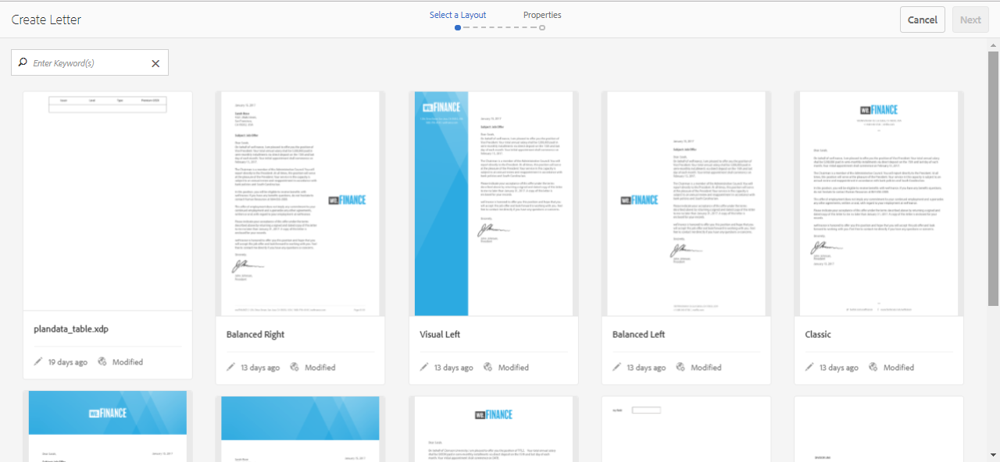

# Crea lettera {#create-letter}

## Flusso di lavoro di gestione della corrispondenza {#correspondence-management-workflow}

Il flusso di lavoro Gestione Corrispondenza si articola in quattro fasi:

1. Creazione di modelli
1. Creazione di frammenti di documento
1. Creazione di lettere
1. Postelaborazione

### Creazione di modelli {#template-creation}

L’immagine seguente mostra un flusso di lavoro tipico per la creazione di un modello di corrispondenza.

In questo flusso di lavoro:

1. I progettisti di moduli creano layout e frammenti utilizzando Adobe Forms Designer e li caricano in un archivio CRX. I layout contengono campi modulo tipici, funzioni di layout quali intestazione e piè di pagina e &quot;aree target&quot; vuote per il posizionamento del contenuto. Successivamente, gli specialisti dell&#39;applicazione mappano il contenuto necessario per queste aree di destinazione. Ulteriori informazioni [progettazione layout](/help/forms/using/layout-design-details.md).
1. Soggetto Esperti di reparto Consulenza Legale, Finanziario o Marketing creano e caricano contenuti quali clausole di testo, clausole di esclusione della responsabilità, termini e condizioni e immagini come loghi, che vengono riutilizzati in vari modelli di corrispondenza.
1. Gli specialisti dell&#39;applicazione creano modelli di corrispondenza. Specialista della domanda

   * Mappa le clausole di testo e le immagini nelle aree di destinazione nei modelli di layout
   * Definisce condizioni/regole per l’inclusione del contenuto
   * Associa campi e variabili di layout ai modelli di dati sottostanti

1. L’autore visualizza in anteprima la lettera e la invia per la post-elaborazione. Ulteriori informazioni [post-elaborazione](/help/forms/using/submit-letter-topostprocess.md).

#### Utilizzo di modelli di lettera forniti con Gestione corrispondenza {#using-letter-templates-provided-with-correspondence-management}

Invece di creare un modello di layout da zero, puoi scegliere di modificare e riutilizzare i modelli forniti da Gestione Corrispondenza. Puoi utilizzare designer per modificare rapidamente il branding e i campi dati e contenuto dei modelli in base alle esigenze della tua organizzazione. Per ulteriori informazioni sui modelli di gestione della corrispondenza, consulta [Modelli di lettera di riferimento](/help/forms/using/reference-cm-layout-templates.md).

### Creazione di frammenti di documento {#document-fragment-creation}

I frammenti di documento sono parti riutilizzabili\componenti di una corrispondenza che consente di comporre lettere\corrispondenza.

I frammenti di documento sono di tipo:

#### Testo {#text}

Una risorsa di testo è una parte di contenuto costituita da uno o più paragrafi di testo. Un paragrafo può essere statico o dinamico. Un paragrafo dinamico contiene riferimenti agli elementi dati i cui valori vengono forniti in fase di esecuzione.

#### Elenco {#list}

Elenco è una serie di frammenti di documento, tra cui testo, elenchi (lo stesso elenco non può essere &quot;aggiunto in se stesso), condizioni e immagini. L’ordine degli elementi dell’elenco può essere fisso o modificabile. Durante la creazione di una lettera, è possibile utilizzare alcuni o tutti gli elementi dell’elenco per replicare un pattern di elementi riutilizzabili.

#### Condizione {#condition}

Le condizioni ti consentono di definire quale contenuto viene incluso al momento della creazione della corrispondenza, in base ai dati forniti. La condizione è descritta in termini di variabili di controllo. Le variabili possono essere un elemento del dizionario dati o un segnaposto. Quando aggiungi una condizione, puoi scegliere di includere una risorsa in base al valore della variabile di controllo. Le condizioni dispongono di un singolo output basato su un’espressione. La prima espressione è vera, in base alla variabile di condizione corrente. Il suo valore diventa l’output della condizione.

#### Frammento di layout {#layout-fragment}

Un frammento di layout è un layout utilizzabile all’interno di una o più lettere. Un frammento di layout viene utilizzato per creare pattern ripetibili, in particolare tabelle dinamiche. Il layout può contenere campi modulo tipici, ad esempio &quot;Indirizzo&quot; e &quot;Numero di riferimento&quot;. Contiene inoltre sottomoduli vuoti che indicano le aree di destinazione. I layout (XDP) vengono creati in Designer e quindi sono [caricato su Forms e documenti](/help/forms/using/get-xdp-pdf-documents-aem.md).

### Creazione di lettere {#letter-creation}

Esistono due modi per generare la corrispondenza inviata ai clienti: guidati dall&#39;utente e guidati dal sistema.

#### Basato su utente {#user-driven}

I dipendenti rivolti al cliente, come i responsabili del trattamento dei sinistri o i collaboratori aziendali, possono creare una corrispondenza personalizzata. Utilizzando un&#39;interfaccia semplice e intuitiva per la compilazione delle lettere, gli utenti aziendali possono aggiungere testo facoltativo alla corrispondenza, personalizzare contenuti modificabili durante l&#39;anteprima della corrispondenza in tempo reale. Possono quindi inviare la corrispondenza personalizzata a un processo back-end.

#### Sistema {#system-driven}

La generazione della corrispondenza è automatizzata, guidata dai trigger degli eventi. Ad esempio, un avviso di promemoria inviato a un cittadino che le chiede di inoltrare una richiesta di anticipo fiscale viene generato dalla fusione del modello predefinito con i dati del cittadino. La lettera finale può essere inviata via e-mail, stampata, inviata via fax o archiviata.

### Post-elaborazione {#post-processing}

La corrispondenza finale può essere inviata a un processo back-end per la postelaborazione. La corrispondenza può essere:

1. Elaborato per la stampa di e-mail, fax o batch oppure inserito in una cartella per la stampa o l’invio di e-mail.
1. Presentato per la revisione e l&#39;approvazione.
1. Protetto mediante l’applicazione di firme digitali, certificazione, crittografia o gestione dei diritti.
1. Convertito in un documento PDF ricercabile contenente tutti i metadati necessari a scopo di archiviazione e controllo.
1. Incluso in un Portfolio PDF che include più documenti, ad esempio materiale di marketing. Il Portfolio PDF può quindi essere inviato come corrispondenza finale.

### Architettura della soluzione di gestione della corrispondenza {#correspondence-management-solution-architecture}

L&#39;immagine seguente fornisce una panoramica di un&#39;architettura esemplificativa della soluzione Lettere.

## Eliminazione di una lettera {#deconstructing-a-letter}

Questo documento Avviso di cancellazione è un esempio di corrispondenza tipica:

<table> 
 <tbody> 
  <tr> 
   <td><strong>Elementi lettera</strong></td> 
   <td><strong>Descrizione</strong></td> 
   <td><strong>Formati con</strong></td> 
  </tr> 
  <tr> 
   <td>Dati provenienti da sistemi aziendali back-end</td> 
   <td>Dati provenienti da sistemi aziendali back-end. I dati vengono uniti dinamicamente con il modello di corrispondenza.</td> 
   <td>La  File di dati creato in base a un dizionario dati</td> 
  </tr> 
  <tr> 
   <td>Dati  Inserito da dipendente in linea diretta</td> 
   <td>Dati che possono essere forniti da un dipendente in prima linea che sta personalizzando la lettera prima di inviarla.  </td> 
   <td>
Elementi DD non protetti  Paragrafi di testo modificabili  Variabili/segnaposto  
 </td> 
  </tr> 
  <tr> 
   <td>Preapprovato  Paragrafi di testo</td> 
   <td>Contenuto di testo pre-approvato. Esperti di questioni legali, finanziarie o di settore che conoscono il contesto commerciale della lettera, in genere creano il contenuto del testo. Contenuto, ad esempio intestazione, piè di pagina, liberatoria e formula introduttiva, è comune alla maggior parte delle lettere. Tuttavia, il contenuto, come "motivo della denuncia", sarebbe specifico per la lettera in questione.</td> 
   <td>
Testo\Elenchi\  Condizioni\Layout
 
 
 </td> 
  </tr> 
  <tr> 
   <td>Dati  In base alla logica personalizzata ?</td> 
   <td>Per alcune lettere, ad esempio una lettera per richiedere ulteriori informazioni su un'attestazione, utenti come l'Aggiustatore di richieste possono aggiungere testo personalizzato.</td> 
   <td>Documento  Frammento di tipo Condizione </td> 
  </tr> 
  <tr> 
   <td>Archiviato  Immagini da archivio centrale</td> 
   <td>Immagini quali logo e immagini della firma. Immagini come i logo aziendali apparirebbero nella maggior parte o in tutta la corrispondenza. Le immagini della firma sono specifiche della lettera e della persona per conto della quale la lettera è inviata.</td> 
   <td>
Immagini archiviate in AEM risorse (DAM)  
 
 
 </td> 
  </tr> 
 </tbody> 
</table>

## Analizzare una lettera prima di costruirla {#analyze-a-letter-before-you-construct-it}

Analizza ogni lettera per scoprire i vari pezzi che compongono la lettera. Lo specialista dell&#39;applicazione analizza le corrispondenze generate.

* Quali parti della corrispondenza sono statiche e quali dinamiche. Variabili compilate da origini dati di backend o dagli utenti finali.
* L’ordine in cui i vari paragrafi di testo compaiono nella corrispondenza, ad esempio se un utente aziendale può modificare i paragrafi durante la creazione della corrispondenza.
* Il sistema di corrispondenza è generato o richiede un utente finale per modificare la corrispondenza? Quante corrispondenze vengono generate dal sistema e quante richiedono l’intervento dell’utente?
* Con quale frequenza cambia il modello di corrispondenza? Sarà aggiornato ogni anno, trimestralmente o solo quando una particolare legislazione cambierà? Quale tipo di modifiche è previsto? È una modifica correggere gli errori tipografici, una modifica del layout, l’aggiunta di più campi, l’aggiunta di più paragrafi e così via?
* Quando pianifichi le tue esigenze di corrispondenza, assembla l&#39;elenco di nuovi modelli di corrispondenza. Per ogni modello di corrispondenza è necessario:

   * Clausole di testo, immagini e tabelle
   * Valori dei dati provenienti dai sistemi back-end
   * Layout e layout dei frammenti della corrispondenza
   * Ordine in cui il contenuto compare nella lettera e regole per l’inclusione e l’esclusione del contenuto

* Le condizioni alle quali gli utenti aziendali, come gli esperti di liquidazione dei sinistri o i collaboratori per la gestione dei casi, modificano il contenuto o le parti della lettera.
* Gli scenari sono narrazioni che descrivono l&#39;esperienza utente, i requisiti e i vantaggi dell&#39;utilizzo della soluzione Lettere.
* Gli scenari forniscono anche: i set di competenze e gli strumenti necessari per il progetto.
* Best practice per la pianificazione dell’implementazione. &quot;Panoramica sull’implementazione di alto livello.

## Vantaggi dell&#39;esecuzione dell&#39;analisi {#benefits-of-performing-the-analysis}

**Riutilizzo dei contenuti** Hai un elenco consolidato di nuovi contenuti necessari per generare la corrispondenza. Gran parte dei contenuti, come intestazioni, piè di pagina, liberatoria e presentazioni, sono comuni a molte lettere e possono essere riutilizzati in diverse lettere. Tutti questi contenuti comuni possono essere creati e approvati dagli esperti una volta e poi riutilizzati in molti pezzi di corrispondenza.

**Creazione del dizionario dati** Ci saranno valori di dati come &quot;ID cliente&quot; e &quot;Nome cliente&quot; comuni a molte lettere. È possibile preparare un elenco consolidato di tutti questi valori di dati. In genere un utente del team middleware aziendale viene consultato durante la pianificazione della struttura. Questo costituisce la base per la creazione del dizionario dati.

**Origine dati da sistemi aziendali di back-end** Sarà inoltre possibile conoscere tutti i valori dei dati necessari e da dove vengono ottenuti i dati del sistema aziendale. È quindi possibile architettare l’implementazione per estrarre i dati dal sistema aziendale e inviarli alla soluzione Lettere.

**Stima della complessità delle lettere** È importante determinare quanto sarà complesso creare una particolare corrispondenza. Questa analisi consente di determinare il tempo e i set di competenze necessari per creare i modelli di lettera. Questo a sua volta contribuirà a stimare le risorse e i costi dell&#39;implementazione della soluzione Lettere.

## Complessità della corrispondenza {#correspondence-complexity}

La complessità della corrispondenza può essere determinata analizzando i seguenti parametri:

**Complessità del layout** Quanto è complesso il layout? Lettere come Avviso di annullamento hanno layout semplici. Mentre le lettere come Conferma copertura richieste hanno un layout complesso con diverse tabelle e più di 60 campi modulo. La creazione di layout complessi richiede più tempo e richiede set di competenze avanzate di progettazione del layout.

**Numero di paragrafi e condizioni del testo** Un contratto di prestito può essere lungo 10 pagine e contenere più di 40 clausole testuali. Molte di queste clausole dipenderebbero da &quot;parametri di prestito. Sulla base dei termini e delle condizioni esatti, le clausole sarebbero incluse o escluse dal contratto. La creazione di tali lettere richiede una pianificazione accurata e un&#39;attenta definizione delle condizioni complesse.

Questa tabella fornisce alcune linee guida che è possibile utilizzare per classificare le lettere:

<table> 
 <tbody> 
  <tr> 
   <td>
<strong>Livello di complessità</strong>
 </td> 
   <td>
<strong>Complessità del layout (soggettivo)</strong>
 </td> 
   <td>
<strong>Numero di paragrafi di testo</strong>
 </td> 
   <td>
<strong>Numero di testi o immagini condizionali</strong>
 </td> 
   <td>
<strong>Set di competenze richiesto</strong>
 </td> 
  </tr> 
  <tr> 
   <td>
Bassa complessità
 </td> 
   <td>
Bassa. Il layout dispone di pochi campi modulo (&lt;15).
 
In genere una pagina.
 </td> 
   <td>
8
 </td> 
   <td>
1
 </td> 
   <td>
Competenze di Designer medie.
 </td> 
  </tr> 
  <tr> 
   <td>
Complessità media
 </td> 
   <td>
Layout a complessità media. Include strutture quali tabelle. In genere, la lunghezza supera più di una pagina.
 </td> 
   <td>
16
 </td> 
   <td>
2
 </td> 
   <td>
Competenze di Designer medie.
 
 
 
Possibilità di creare espressioni complesse utilizzando le interfacce utente.
 </td> 
  </tr> 
  <tr> 
   <td>
Elevata complessità
 </td> 
   <td>
Layout complesso. Può essere maggiore di tre pagine. Contiene tabelle e più di 60 campi modulo.
 </td> 
   <td>
40
 </td> 
   <td>
8
 </td> 
   <td>
Competenze di esperti designer.
 
 
 
Possibilità di creare espressioni complesse utilizzando le interfacce utente.
 </td> 
  </tr> 
 </tbody> 
</table>

## Panoramica sulla creazione di una lettera {#overview-of-creating-a-letter}

1. Selezionare il layout appropriato da utilizzare come base della lettera e creare una lettera.
1. Aggiungi alla lettera moduli di dati o frammenti di layout e configurali.
1. Scegli di visualizzare in anteprima la corrispondenza.
1. Modificare e impostare campi, variabili, contenuto e allegati.

### Prerequisiti {#prerequisites}

Per creare una corrispondenza, è necessario disporre innanzitutto dei seguenti elementi:

* [Pacchetto di compatibilità](compatibility-package.md). Installa il pacchetto di compatibilità per visualizzare il **Lettere** l&#39;opzione **Forms** pagina.
* La lettera XDP ([layout](/help/forms/using/document-fragments.md)).
* Altri XDP ([frammenti di layout](document-fragments.md#document-fragments)) che formano parti della lettera. I file XDP\Layout vengono creati in [Designer](https://www.adobe.com/go/learn_aemforms_designer_65).
* La [dizionario dati](/help/forms/using/data-dictionary.md) (Facoltativo).
* La [moduli dati](/help/forms/using/document-fragments.md) vuoi usare nella corrispondenza.
* [Dati di prova](/help/forms/using/data-dictionary.md#p-working-with-test-data-p) è il file XML con i dati di prova in esso contenuti. I dati di test sono necessari se si utilizza un dizionario dati.

## Creare un modello di lettera {#create-a-letter-template}

### Selezionare un layout e immettere le proprietà della lettera {#select-a-layout-and-enter-the-letter-properties}

1. Seleziona **Forms** > **Lettere**.

1. Seleziona **Crea > Lettera**. Gestione corrispondenza visualizza i layout disponibili (XDP). Questi layout provengono da Designer. I layout includono anche i modelli di lettera forniti da Gestione Corrispondenza. Per ulteriori informazioni sui modelli di gestione della corrispondenza, consulta [Modelli di lettera di riferimento](/help/forms/using/reference-cm-layout-templates.md). Per aggiungere layout personalizzati, creare file XDP (layout) in Designer e quindi [caricali in AEM Forms](/help/forms/using/get-xdp-pdf-documents-aem.md).

   

1. Seleziona un layout toccandolo e toccandolo **Successivo**.

   

1. Immetti le proprietà per la Corrispondenza e tocca **Salva:**

   * **Titolo (facoltativo):** Inserisci il titolo della lettera. Il titolo non deve essere univoco e può contenere caratteri speciali e caratteri non inglesi.
   * **Nome:** Nome univoco della lettera. Non possono esistere due lettere in uno stato con lo stesso nome. Nel campo Nome è possibile immettere solo caratteri, numeri e trattini della lingua inglese. Il campo Nome viene compilato automaticamente in base al campo Titolo . I caratteri speciali, gli spazi, i numeri e i caratteri non inglesi immessi nel campo Titolo vengono sostituiti dai trattini nel campo Nome . Anche se il valore nel campo Titolo viene copiato automaticamente nel campo Nome, è possibile modificarlo.
   * **Descrizione (facoltativo):** Descrivi la lettera per il tuo riferimento.
   * **Dizionario dati (facoltativo)**: Il dizionario dati può essere associato alla corrispondenza. Le risorse inserite in seguito in questa corrispondenza devono avere lo stesso dizionario dati scelto per la corrispondenza qui o nessun dizionario dati.
   * **Tag (facoltativo):** Selezionare i tag da applicare alla corrispondenza. Puoi anche digitare un nome di tag nuovo/personalizzato e premere Invio per crearlo.
   * **Processo post (facoltativo):** Selezionare il processo di pubblicazione da applicare al modello di lettera. Sono disponibili processi post pronti e quelli creati con AEM, come e-mail e stampa.

   

1. Il sistema visualizza un messaggio: &quot;La lettera è stata creata con successo.&quot; (nel messaggio di avviso) Tocca **Apri** per configurare i moduli dati e i frammenti di layout al suo interno. Oppure tocca **Fine** per tornare alla pagina precedente.

   

   **Successivo**: Quando tocchi **Apri**, Gestione corrispondenza visualizza una rappresentazione del layout con tutti i componenti del layout (XDP) elencati. Inserisci [Moduli dati e frammenti di layout e loro configurazione](/help/forms/using/create-letter.md#p-insert-data-modules-and-layout-fragments-in-a-letter-and-configure-them-p).

### Inserire moduli di dati e frammenti di layout in una lettera e configurarli {#insert-data-modules-and-layout-fragments-in-a-letter-and-configure-them}

Dopo aver creato una corrispondenza, toccate Apri, Gestione corrispondenza visualizza una rappresentazione del layout con tutti i sottomoduli/aree di destinazione elencati nel layout (XDP). In ciascuna delle aree di destinazione, puoi scegliere di inserire un modulo dati o un frammento di layout (e quindi moduli dati nel frammento di layout).

>[!NOTE]
>
>È inoltre possibile scegliere di toccare l’icona Modifica per una lettera nella pagina Lettere per inserire moduli di dati e frammenti di layout in una lettera e configurarli.

1. Tocca **Inserisci** per ciascuno dei sottomoduli, selezionare Moduli dati o un frammento di layout da inserire in ciascuno dei sottomoduli.

   

1. Selezionare Modulo dati o Frammento di layout per queste opzioni per ciascuno dei sottomoduli, quindi scegliere i Moduli dati o i Frammenti di layout da inserire. Un frammento di layout consente di inserire ulteriormente moduli dati o frammenti di layout in esso in base alla sua progettazione (fino a quattro livelli).

   

1. Se si inserisce un frammento di layout, il nome del frammento di layout viene visualizzato nel sottomodulo. Inoltre, in base al frammento selezionato, i sottomoduli nidificati vengono visualizzati nel sottomodulo.
1. Dopo aver inserito nel layout i Moduli dati selezionati, puoi toccare la modalità di configurazione e impostare quanto segue dopo aver toccato l’icona Modifica per ciascuno dei moduli:

   1. **Modificabile**: Quando questa opzione è selezionata, il contenuto può essere modificato nell’interfaccia utente Crea corrispondenza . Contrassegna il contenuto come modificabile solo se l’utente aziendale (ad esempio un Aggiustatore di richieste di indennizzo) lo richiede per modificarlo.
   1. **Obbligatorio**: Quando questa opzione è selezionata, il contenuto è richiesto nell’interfaccia utente Crea corrispondenza .
   1. **Selezionati**: Quando questa opzione è selezionata, il contenuto viene selezionato per impostazione predefinita nell’interfaccia utente Crea corrispondenza.
   1. **Rientro**: Aumenta o diminuisce il rientro del modulo/contenuto nella lettera. Il rientro è specificato in termini di livelli, a partire da 0. Ogni livello fa un rientro di 36 punti. Per ulteriori informazioni sulla personalizzazione dei moduli, vedere **[!UICONTROL Configurazioni di gestione della corrispondenza]** in [Flusso di lavoro Forms](submit-letter-topostprocess.md#formsworkflow).
   1. **Interruzione di pagina prima**: Se si imposta l&#39;opzione Interruzione pagina prima su attivata, il contenuto di questo modulo viene sempre visualizzato su una nuova pagina.
   1. **Interruzione di pagina dopo**: Se per un modulo specifico si imposta l’opzione Interruzione pagina dopo su , il contenuto del modulo NEXT viene sempre visualizzato in una nuova pagina.

   

1. Per modificare un modulo, tocca l’icona Modifica posta accanto a esso. Dopo aver modificato i moduli, tocca **Salva**.

   In questa pagina è inoltre possibile effettuare le seguenti operazioni per i sottomoduli:

   1. **Consenti testo libero**: Se l’opzione Consenti testo libero è abilitata, l’utente può aggiungere testo in linea sotto forma di lettera nella vista CCR. Nella vista CCR è abilitata un’azione &quot;T&quot; per le aree di destinazione in cui è abilitato Consenti testo libero e quando l’utente lo tocca, richiede nome e descrizione del testo e, toccando ok, apre il testo in modalità di modifica, dove l’utente può aggiungere testo. Questo si comporta come gli altri moduli di testo
   1. **Blocca ordine**: Blocca l’ordine dei sottomoduli nella lettera. L’autore non può riordinare i sottomoduli/componenti durante la creazione della lettera.

   In questa pagina è inoltre possibile effettuare le seguenti operazioni per ciascuna risorsa dei sottomoduli:

   1. **Modificare l’ordine delle risorse**: trascina e rilascia una risorsa contenente l’icona di riordino per una risorsa ( ).
   1. **Eliminare le risorse**: Tocca l’icona Elimina accanto a una risorsa per eliminarla.
   1. **Anteprima delle risorse**: Tocca l’icona Mostra anteprima ( ) accanto a una risorsa.

1. Tocca **Successivo**.
1. La pagina Dati descrive in che modo i campi dati e le variabili vengono utilizzati nel modello. I dati possono essere collegati a origini dati quali un dizionario dati o un input dell’utente. Ogni campo definisce le proprietà da cui il dizionario dati mappa i dati o quale didascalia viene visualizzata per i campi di input dell’utente.

   Collegamento:

   * La **field** Gli elementi possono essere collegati a un elemento letterale, a un elemento dizionario dati, a una risorsa o a un valore specificato dall’utente. È inoltre possibile ignorare un elemento campo associandolo all’opzione Ignora.
   * La **variable** Gli elementi possono essere collegati a un elemento letterale, dizionario dati, un campo, una variabile, una risorsa o un valore specificato dall’utente.

   Di seguito sono riportati alcuni campi principali del collegamento:

   * **Multiriga**: È possibile specificare se l’immissione di dati per un campo o una variabile è su più righe. Se si seleziona questa opzione, la casella di input per il campo o la variabile viene visualizzata come casella di input a più righe nella visualizzazione di modifica dei dati. Il campo o la variabile viene visualizzata anche come su più righe nelle visualizzazioni Dati e Contenuto nell’interfaccia utente Crea corrispondenza . Il campo di input a più righe è simile al campo per l’immissione di un commento in un modulo di testo. L’opzione su più righe è disponibile solo per campi e variabili con tipo di collegamento Utente o elementi del dizionario dati non protetti.
   * **Facoltativo**: È possibile specificare se il valore per il campo o la variabile è facoltativo o meno. L’opzione campo opzionale è disponibile per campi e variabili con tipo di collegamento Utente o elementi del dizionario dati non protetti.

   * **Convalida di campi/variabili**: Per migliorare la convalida del valore di un campo o di una variabile, è possibile assegnare una convalida al campo o alla variabile. Questa opzione è disponibile solo per campi e variabili con tipo di collegamento Utente o elementi del dizionario dati non protetti.
   * **Didascalia** e **Descrizione comandi**: Didascalia è l’etichetta del campo visualizzato prima del campo nell’interfaccia utente CCR. Questa opzione è disponibile per campi e variabili con tipo di collegamento Utente o elementi del dizionario dati non protetti.

   Di seguito sono riportati i tipi di convalida utilizzabili per i campi:

   * **Convalida stringa**: Utilizzare Convalida stringa per specificare una lunghezza minima e massima della stringa immessa nel campo o nella variabile. Quando si crea una convalida di tipo stringa, verificare di specificare parametri di convalida validi. Immettere una lunghezza valida per i valori minimo e massimo. Per la convalida Stringa, è possibile specificare la lunghezza minima e massima del valore che è possibile immettere. Se il valore immesso non corrisponde al valore minimo e massimo specificato, il campo pertinente nell’interfaccia utente del CCR è contrassegnato in rosso.

   * **Convalida del numero**: Utilizzare Convalida numero per specificare il valore numerico minimo e massimo immesso in un campo o in una variabile. Quando si crea una convalida numerica, verificare di specificare parametri di convalida validi. Immetti valori numerici sia per i valori minimi che massimi.

   * **Convalida regolare delle espressioni**: Utilizzare la funzione Convalida espressione regolare per definire un&#39;espressione regolare utilizzata per convalidare il valore di un campo o di una variabile. Inoltre, puoi personalizzare il messaggio di errore. Quando crei una convalida delle espressioni regolari, accertati di specificare un’espressione regolare valida.
   >[!NOTE]
   >
   >I validatori di campi e variabili sono disponibili solo su campi o variabili con tipo di collegamento Utente o elementi del dizionario dati non protetti.

   

1. Dopo aver specificato il collegamento, tocca **Successivo**. Gestione corrispondenza visualizza la schermata Allegati.

### Impostare gli allegati {#set-up-the-attachments}

1. Seleziona **Aggiungi risorsa**.
1. Nella schermata Seleziona risorsa , tocca le risorse da allegare alla lettera e tocca **Fine**. Devi prima caricare le risorse in Assets. È consigliabile allegare solo documenti PDF e Microsoft Office, ma è anche possibile allegare immagini. Per ulteriori informazioni sul caricamento di risorse in DAM, vedi [Caricamento delle risorse](/help/assets/manage-assets.md).
1. Per bloccare l&#39;ordine delle risorse nell&#39;elenco in modo che l&#39;Aggiustatore crediti non possa modificare l&#39;ordine, toccare **Blocca ordine**. Se non si seleziona questa opzione, è possibile modificare l&#39;ordine degli elementi dell&#39;elenco.
1. Per modificare l’ordine delle risorse, trascina e rilascia una risorsa contenente l’icona di riordino per una risorsa ( ).
1. Tocca **Modifica** davanti a un allegato e specifica un allegato come obbligatorio se non desideri che l&#39;autore possa eliminarlo. Se desideri che sia preselezionato nell’interfaccia CCR, specifica un allegato come selezionato .
1. Seleziona **Accesso libreria** per dare l&#39;accesso alla libreria. Se l&#39;accesso alla libreria è abilitato, l&#39;Aggiustatore delle attestazioni può accedere alla libreria dei contenuti durante la creazione di una lettera e l&#39;inserimento di allegati.
1. Seleziona **Configurazione allegati** e specificare il numero massimo di allegati.

1. Tocca **Salva**. La corrispondenza viene creata ed elencata nella pagina Lettere.

Dopo aver creato un modello di lettera in Gestione corrispondenza, l&#39;utente/agente/regolatore di attestazione può aprire la lettera nell&#39;interfaccia utente CCR e creare una corrispondenza inserendo i dati, configurando il contenuto e gestendo gli allegati. Per ulteriori informazioni, consulta [Crea corrispondenza](/help/forms/using/create-correspondence.md).

## Tipi di collegamento disponibili per ciascuno dei campi {#types-of-linkage-available-for-each-of-the-fields}

Nella tabella seguente sono descritti i tipi di collegamento disponibili per vari tipi di campi.

I seguenti valori nella tabella

* **Sì**: Il tipo di campo nella colonna più a sinistra supporta tale tipo di mappatura
* **No**: Il tipo di campo nella colonna più a sinistra non supporta tale tipo di mappatura
* **N/D**: Il tipo di campo nella colonna più a sinistra non è applicabile

<table> 
 <tbody> 
  <tr> 
   <td> </td> 
   <td><strong>Letterale</strong></td> 
   <td><strong>Risorsa</strong></td> 
   <td><strong>Dizionario dati</strong></td> 
   <td><strong>Ignora</strong></td> 
   <td><strong>User</strong></td> 
   <td><strong>Campo</strong></td> 
   <td><strong>Variabile</strong></td> 
  </tr> 
  <tr> 
   <td><strong>data</strong></td> 
   <td>Sì</td> 
   <td>No</td> 
   <td>Sì</td> 
   <td>Sì</td> 
   <td>Sì</td> 
   <td>N/D</td> 
   <td>N/D</td> 
  </tr> 
  <tr> 
   <td><strong>time</strong></td> 
   <td>Sì</td> 
   <td>No</td> 
   <td>Sì</td> 
   <td>Sì</td> 
   <td>Sì</td> 
   <td>N/D</td> 
   <td>N/D</td> 
  </tr> 
  <tr> 
   <td><strong>datetime</strong></td> 
   <td>Sì</td> 
   <td>No</td> 
   <td>Sì</td> 
   <td>Sì</td> 
   <td>Sì</td> 
   <td>N/D</td> 
   <td>N/D</td> 
  </tr> 
  <tr> 
   <td><strong>numero intero</strong></td> 
   <td>Sì</td> 
   <td>No</td> 
   <td>Sì</td> 
   <td>Sì</td> 
   <td>Sì  </td> 
   <td>N/D</td> 
   <td>N/D</td> 
  </tr> 
  <tr> 
   <td><strong>float</strong></td> 
   <td>Sì</td> 
   <td>No</td> 
   <td>Sì</td> 
   <td>Sì</td> 
   <td>Sì  </td> 
   <td>N/D</td> 
   <td>N/D  </td> 
  </tr> 
  <tr> 
   <td><strong>richtext</strong></td> 
   <td>Sì</td> 
   <td>solo testo</td> 
   <td>Sì</td> 
   <td>Sì</td> 
   <td>Sì</td> 
   <td>N/D</td> 
   <td>N/D</td> 
  </tr> 
  <tr> 
   <td><strong>semplice</strong> <strong>text</strong></td> 
   <td>Sì</td> 
   <td>solo testo</td> 
   <td>Sì</td> 
   <td>Sì</td> 
   <td>Sì</td> 
   <td>N/D</td> 
   <td>N/D</td> 
  </tr> 
  <tr> 
   <td><strong>immagine</strong></td> 
   <td>No</td> 
   <td>solo immagine</td> 
   <td>No</td> 
   <td>Sì</td> 
   <td>No</td> 
   <td>N/D</td> 
   <td>N/D</td> 
  </tr> 
  <tr> 
   <td><strong>signature</strong></td> 
   <td>No</td> 
   <td>No</td> 
   <td>No  </td> 
   <td>Sì</td> 
   <td>No</td> 
   <td>N/D</td> 
   <td>N/D  </td> 
  </tr> 
 </tbody> 
</table>

## Crea una copia di un modello di lettera {#createcopylettertemplate}

È possibile utilizzare un modello di lettera esistente per creare rapidamente un modello di lettera con proprietà, contenuto e risorse ereditate simili, ad esempio frammenti di documento e dizionario dati. A questo scopo, copia e incolla una lettera.

1. Nella pagina Lettere, selezionare una o più lettere. Nell’interfaccia utente viene visualizzata l’icona Copia .
1. Tocca Copia. Nell’interfaccia utente viene visualizzata l’icona Incolla . È inoltre possibile scegliere di entrare in una cartella prima di incollare. Le cartelle diverse possono contenere risorse con gli stessi nomi. Per ulteriori informazioni sulle cartelle, consulta [Cartelle e organizzazione delle risorse](/help/forms/using/import-export-forms-templates.md#folders-and-organizing-assets).
1. Tocca Incolla. Viene visualizzata la finestra di dialogo Incolla. Se si copiano e si incolla le lettere nello stesso punto, il sistema assegna automaticamente nomi e titoli alle nuove copie di lettere, ma è possibile modificare i titoli e i nomi delle lettere.
1. Se necessario, modificare il Titolo e il Nome con cui si desidera salvare la copia della lettera.
1. Tocca Incolla. Viene creata la copia della lettera. Ora è possibile apportare le modifiche necessarie nella nuova lettera creata.
