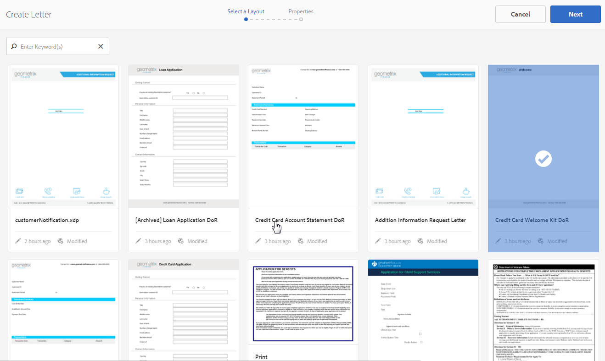
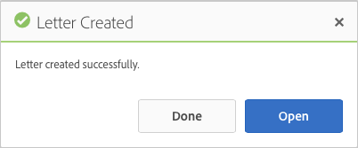

# Crea lettera {#create-letter}

## Flusso di lavoro di gestione della corrispondenza {#correspondence-management-workflow}

Il flusso di lavoro di gestione della corrispondenza si articola in quattro fasi:

1. Creazione di modelli
1. Creazione di frammenti di documento
1. Creazione di lettere
1. Postprocessing

### Creazione di modelli {#template-creation}

L’immagine seguente mostra un flusso di lavoro tipico per la creazione di un modello di corrispondenza.

In questo flusso di lavoro:

1. I progettisti di moduli creano layout e frammenti utilizzando  Adobe Forms Designer e li caricano in un archivio CRX. I layout contengono campi modulo tipici, funzioni di layout quali intestazione e piè di pagina e &quot;aree di destinazione&quot; vuote per il posizionamento del contenuto. Successivamente, gli specialisti dell&#39;applicazione mappano il contenuto richiesto per queste aree di destinazione. Ulteriori informazioni sulla [progettazione di layout](/help/forms/using/layout-design-details.md).
1. Esperti di materia oggetto di dipartimenti legali, finanziari o di marketing, creano e caricano contenuti quali clausole di testo, clausole di non responsabilità, termini e condizioni e immagini come logo, che vengono riutilizzati in vari modelli di corrispondenza.
1. Gli specialisti dell&#39;applicazione creano modelli di corrispondenza. Specialista dell&#39;applicazione

   * Mappa le clausole di testo e le immagini nelle aree di destinazione nei modelli di layout
   * Definisce condizioni/regole per l’inclusione del contenuto
   * Collega i campi e le variabili di layout ai modelli di dati sottostanti

1. L&#39;autore visualizza l&#39;anteprima della lettera e la invia per la post-elaborazione. Ulteriori informazioni su [post-elaborazione](/help/forms/using/submit-letter-topostprocess.md).

#### Utilizzo di modelli Lettera forniti con Gestione Corrispondenza {#using-letter-templates-provided-with-correspondence-management}

Invece di creare un modello di layout da zero, potete scegliere di modificare e riutilizzare i modelli forniti da Gestione corrispondenza. È possibile utilizzare Designer per modificare rapidamente il branding e i campi dati e contenuto dei modelli in base alle esigenze aziendali. Per ulteriori informazioni sui modelli di gestione della corrispondenza, vedere [Modelli di lettere di riferimento](/help/forms/using/reference-cm-layout-templates.md).

### Creazione di frammenti di documento {#document-fragment-creation}

I frammenti di documento sono parti riutilizzabili\componenti di una corrispondenza mediante le quali è possibile comporre lettere\corrispondenza.

I frammenti di documento sono dei tipi seguenti:

#### Testo {#text}

Una risorsa di testo è una parte di contenuto costituita da uno o più paragrafi di testo. Un paragrafo può essere statico o dinamico. Un paragrafo dinamico contiene riferimenti a elementi di dati, i cui valori vengono forniti in fase di esecuzione.

#### Elenco {#list}

Elenco è una serie di frammenti di documento, tra cui testo, elenchi (lo stesso elenco non può essere &quot;aggiunto in se stesso&quot;), condizioni e immagini. L&#39;ordine degli elementi elenco può essere fisso o modificabile. Durante la creazione di una lettera, è possibile utilizzare alcuni o tutti gli elementi dell&#39;elenco per replicare un pattern di elementi riutilizzabili.

#### Condizione {#condition}

Le condizioni consentono di definire il contenuto da includere al momento della creazione della corrispondenza, in base ai dati forniti. La condizione è descritta in termini di variabili di controllo. Le variabili possono essere un elemento dizionario dati o un segnaposto. Quando aggiungete una condizione, potete scegliere di includere una risorsa in base al valore della variabile di controllo. Le condizioni hanno un singolo output basato su un&#39;espressione. La prima espressione è vera, in base alla variabile di condizione corrente. Il suo valore diventa l&#39;output della condizione.

#### Frammento di layout {#layout-fragment}

Un frammento di layout è un layout che può essere utilizzato all&#39;interno di una o più lettere. Un frammento di layout viene utilizzato per creare pattern ripetibili, in particolare tabelle dinamiche. Il layout può contenere campi modulo tipici come &quot;Indirizzo&quot; e &quot;Numero di riferimento&quot;. Contiene inoltre sottomoduli vuoti che indicano le aree di destinazione. I layout (XDP) vengono creati in Designer e quindi [caricati in Forms e Documents](/help/forms/using/get-xdp-pdf-documents-aem.md).

### Creazione di lettere {#letter-creation}

Esistono due modi per generare la corrispondenza inviata ai clienti: guidati dall&#39;utente e guidati dal sistema.

#### Guida utente {#user-driven}

I dipendenti orientati al cliente, ad esempio gli esperti di revisione dei sinistri o i collaboratori del caso, possono creare corrispondenza personalizzata. Utilizzando un&#39;interfaccia semplice e intuitiva per il riempimento delle lettere, gli utenti aziendali possono aggiungere testo facoltativo alla corrispondenza, personalizzare contenuti modificabili e visualizzare in anteprima la corrispondenza in tempo reale. Possono quindi inviare la corrispondenza personalizzata a un processo back-end.

#### Sistema {#system-driven}

La generazione della corrispondenza è automatizzata, guidata dagli attivatori degli eventi. Ad esempio, un promemoria inviato a un cittadino che le chiede di inoltrare una richiesta di pagamento anticipato dell&#39;imposta, viene generato dall&#39;unione del modello predefinito con i dati dei cittadini. La lettera finale può essere inviata via e-mail, stampata, inviata via fax o archiviata.

### Post-elaborazione {#post-processing}

La corrispondenza finale può essere inviata a un processo back-end per la postelaborazione. La corrispondenza può essere:

1. Elaborato per la stampa tramite e-mail, fax o batch oppure inserito in una cartella per la stampa o l’e-mail.
1. Presentato per revisione e approvazione.
1. Protetto mediante l’applicazione di firme digitali, certificazione, cifratura o gestione dei diritti.
1. Convertito in un documento PDF ricercabile contenente tutti i metadati necessari per l&#39;archiviazione e il controllo.
1. Incluso in un Portfolio PDF che include più documenti, come materiale di marketing. Il Portfolio PDF può quindi essere inviato come corrispondenza finale.

### Architettura della soluzione di gestione della corrispondenza {#correspondence-management-solution-architecture}

L&#39;immagine seguente fornisce una panoramica di un&#39;architettura di esempio della soluzione Letters.

## Deconfigurazione di una lettera {#deconstructing-a-letter}

Questo documento Avviso di cancellazione è un esempio di corrispondenza tipica:

<table> 
 <tbody> 
  <tr> 
   <td><strong>Elementi Lettera</strong></td> 
   <td><strong>Descrizione</strong></td> 
   <td><strong>Formato con</strong></td> 
  </tr> 
  <tr> 
   <td>Dati dai sistemi aziendali back-end</td> 
   <td>Dati originati dai sistemi aziendali back-end. I dati vengono uniti dinamicamente con il modello di corrispondenza.</td> 
   <td>File di dati   creato in base a un dizionario dati</td> 
  </tr> 
  <tr> 
   <td>Dati  inseriti dal dipendente front-line</td> 
   <td>Dati che possono essere forniti da un dipendente front-line che sta personalizzando la lettera prima di inviarla.  </td> 
   <td>
Elementi DD non protetti  Paragrafi di testo modificabili  Variabili/segnaposto  
 </td> 
  </tr> 
  <tr> 
   <td>Paragrafi di testo pre-approvati </td> 
   <td>Contenuto di testo già approvato. Esperti in Legale, Finanza o in una linea di business che conoscono il contesto aziendale della lettera, in genere creano il contenuto del testo. Contenuto come intestazione, piè di pagina, dichiarazioni di non responsabilità e formula di apertura è comune alla maggior parte delle lettere. Tuttavia, contenuti come "motivo della denuncia" sarebbero specifici della lettera in questione.</td> 
   <td>
Text\Lists\  Condizioni\Layout
 
 
 </td> 
  </tr> 
  <tr> 
   <td>Dati  Basati su logica personalizzata ?</td> 
   <td>Per alcune lettere, ad esempio una lettera per richiedere ulteriori informazioni su un'attestazione, gli utenti come l'Adeguamento richieste di rimborso possono aggiungere testo personalizzato.</td> 
   <td>Documento  Frammento di tipo Condizione </td> 
  </tr> 
  <tr> 
   <td>Immagini memorizzate  dall'archivio centrale</td> 
   <td>Immagini quali logo e immagini della firma. Immagini come il logo aziendale apparirebbero nella maggior parte o in tutta la corrispondenza. Le immagini della firma sono specifiche per la lettera e per la persona per conto della quale la lettera viene inviata.</td> 
   <td>
Immagini memorizzate in AEM risorse (DAM)  
 
 
 </td> 
  </tr> 
 </tbody> 
</table>

## Analizzare una lettera prima di costruirla {#analyze-a-letter-before-you-construct-it}

Analizzare ogni lettera per scoprire i vari pezzi che compongono la lettera. Application Specialist analizza le corrispondenze generate.

* Quali parti della corrispondenza sono statiche e quali dinamiche. Variabili compilate da origini dati backend o dagli utenti finali.
* L’ordine in cui i vari paragrafi di testo compaiono nella corrispondenza, ad esempio se un utente aziendale può modificare i paragrafi durante la creazione della corrispondenza.
* Il sistema di corrispondenza è generato o richiede un utente finale per modificare la corrispondenza? Quante corrispondenze vengono generate dal sistema e quante richiedono l&#39;intervento dell&#39;utente?
* Con quale frequenza cambia il modello di corrispondenza? Sarà aggiornato annualmente, trimestralmente o solo in caso di modifica di una determinata legislazione? Che tipo di modifiche è previsto? È una modifica correggere gli errori tipografici, modificare il layout, aggiungere più campi, aggiungere più paragrafi e così via?
* Quando pianificate i requisiti di corrispondenza, assemblate l&#39;elenco di nuovi modelli di corrispondenza. Per ogni modello di corrispondenza, è necessario:

   * Clausole di testo, immagini e tabelle
   * Valori dei dati provenienti dai sistemi di backend
   * Layout e layout dei frammenti della corrispondenza
   * Ordine in cui il contenuto viene visualizzato nella lettera e regole per l&#39;inclusione e l&#39;esclusione del contenuto

* Le condizioni in base alle quali gli utenti aziendali, come gli esperti di revisione delle richieste di indennizzo o gli addetti alle indagini, modificano contenuti o parti della lettera.
* Gli scenari sono narrazioni che descrivono l&#39;esperienza utente, i requisiti e i vantaggi dell&#39;utilizzo della soluzione Letters.
* Gli scenari forniscono anche:i set di competenze e gli strumenti richiesti per il progetto.
* Procedure ottimali per la pianificazione dell’implementazione. &quot;Panoramica dell&#39;implementazione di alto livello.

## Vantaggi dell&#39;esecuzione dell&#39;analisi {#benefits-of-performing-the-analysis}

**Riuso dei contenutiPer generare la corrispondenza è necessario disporre di un elenco consolidato di nuovi contenuti.** La maggior parte del contenuto, come intestazioni, piè di pagina, dichiarazioni di non responsabilità e presentazioni, è comune a molte lettere e può essere riutilizzata tra diverse lettere. Tutti questi contenuti comuni possono essere creati e approvati dagli esperti una volta e poi riutilizzati in molti corrispondenza.

**Creazione del** dizionario datiEsistono valori di dati quali &quot;ID cliente&quot; e &quot;Nome cliente&quot; comuni a più lettere. È possibile preparare un elenco consolidato di tutti questi valori di dati. In genere, un membro del team middleware aziendale viene consultato quando si pianifica la struttura. Questo costituisce la base per la creazione del dizionario dati.

**Origine dati da** sistemi aziendali back-endL&#39;utente sarà inoltre a conoscenza di tutti i valori di dati necessari e da dove vengono ottenuti i dati del sistema aziendale. È quindi possibile architettare l&#39;implementazione per estrarre i dati dal sistema aziendale e inviarli alla soluzione Letters.

**Stima della complessità delle** lettereÈ importante determinare quanto sarà complesso creare una particolare corrispondenza. Questa analisi consente di determinare il tempo e i set di competenze necessari per creare i modelli Lettera. Questo a sua volta aiuterà a stimare le risorse e i costi per l&#39;implementazione della soluzione Letters.

## Complessità corrispondenza {#correspondence-complexity}

La complessità della corrispondenza può essere determinata analizzando i seguenti parametri:

**Layout** complessoQuanto è complesso il layout? Le lettere come Avviso di annullamento dispongono di layout semplici. Mentre le lettere come Conferma copertura delle richieste di rimborso dispongono di un layout complesso con più tabelle e più di 60 campi modulo. La creazione di layout complessi richiede più tempo e richiede set di competenze di progettazione di layout avanzate.

**Numero di paragrafi di testo e** condizioniUn contratto di prestito può avere una lunghezza di 10 pagine e contenere più di 40 clausole testuali. Molte di queste clausole dipenderebbero dai &quot;parametri di prestito&quot;. In base alle condizioni esatte, le clausole sarebbero incluse o escluse dal contratto. La creazione di tali lettere richiede una pianificazione accurata e un&#39;attenta definizione delle condizioni complesse.

Questa tabella fornisce alcune linee guida che è possibile utilizzare per classificare le lettere:

<table> 
 <tbody> 
  <tr> 
   <td>
<strong>Livello di complessità</strong>
 </td> 
   <td>
<strong>Complessità del layout (soggettivo)</strong>
 </td> 
   <td>
<strong>Numero di paragrafi di testo</strong>
 </td> 
   <td>
<strong>Numero di testi o immagini condizionali</strong>
 </td> 
   <td>
<strong>Set di competenze richiesto</strong>
 </td> 
  </tr> 
  <tr> 
   <td>
Bassa complessità
 </td> 
   <td>
Bassa. Il layout contiene pochi campi modulo (&lt;15).
 
In genere una pagina.
 </td> 
   <td>
8
 </td> 
   <td>
1
 </td> 
   <td>
Medie competenze di Designer.
 </td> 
  </tr> 
  <tr> 
   <td>
Media complessità
 </td> 
   <td>
Layout a complessità media. Include strutture come le tabelle. In genere, la lunghezza di più pagine è maggiore.
 </td> 
   <td>
16
 </td> 
   <td>
2
 </td> 
   <td>
Medie competenze di Designer.
 
 
 
Possibilità di creare espressioni complesse utilizzando le interfacce utente.
 </td> 
  </tr> 
  <tr> 
   <td>
Elevata complessità
 </td> 
   <td>
Layout complesso. Può essere maggiore di tre pagine. Contiene tabelle e più di 60 campi modulo.
 </td> 
   <td>
40
 </td> 
   <td>
8
 </td> 
   <td>
Competenze di Designer esperto.
 
 
 
Possibilità di creare espressioni complesse utilizzando le interfacce utente.
 </td> 
  </tr> 
 </tbody> 
</table>

## Panoramica sulla creazione di una lettera {#overview-of-creating-a-letter}

1. Selezionare il layout appropriato che funge da base per la lettera e creare una lettera.
1. Aggiungere moduli dati o frammenti di layout alla lettera e configurarli.
1. Scegliete di visualizzare in anteprima la corrispondenza.
1. Modificare e impostare campi, variabili, contenuto e allegati.

### Prerequisiti {#prerequisites}

Prima di creare una corrispondenza è necessario disporre dei seguenti elementi:

* [Pacchetto](compatibility-package.md) di compatibilità. Installate il pacchetto di compatibilità per visualizzare l&#39;opzione **Lettere** nella pagina **Forms**.
* La lettera XDP ([layout](/help/forms/using/document-fragments.md)).
* Altri XDP ([frammenti di layout](document-fragments.md#document-fragments)) che formano parti della lettera. I file XDP\Layouts vengono creati in [Designer](https://help.adobe.com/en-US/AEMForms/6.1/DesignerHelp/).
* Il [dizionario dati ](/help/forms/using/data-dictionary.md) pertinente (facoltativo).
* I [moduli di dati](/help/forms/using/document-fragments.md) che si desidera utilizzare nella corrispondenza.
* [Test ](/help/forms/using/data-dictionary.md#p-working-with-test-data-p) Data: il file XML contenente i dati di prova. I dati di test sono richiesti se si utilizza un dizionario dati.

## Creare un modello di lettera {#create-a-letter-template}

### Selezionare un layout e immettere le proprietà della lettera {#select-a-layout-and-enter-the-letter-properties}

1. Selezionare **Forms** > **Letters**.

1. Selezionare **Crea > Lettera**. Gestione corrispondenza visualizza i layout disponibili (XDP). Questi layout provengono da Designer. I layout includono anche i modelli Lettera forniti da Gestione Corrispondenza. Per ulteriori informazioni sui modelli di gestione della corrispondenza, vedere [Modelli di lettere di riferimento](/help/forms/using/reference-cm-layout-templates.md). Per aggiungere layout personalizzati, creare file XDP (layout) in Designer e quindi [caricarli  AEM Forms](/help/forms/using/get-xdp-pdf-documents-aem.md).

   

1. Selezionate un layout toccandolo e toccando **Next**.

   

1. Immettete le proprietà per Corrispondenza e toccate **Salva:**

   * **Titolo (facoltativo):** inserite il titolo della lettera. Il titolo non deve essere univoco e può contenere caratteri speciali e caratteri non inglesi.
   * **Nome:** nome univoco della lettera. Non possono esistere due lettere con lo stesso nome. Nel campo Nome, è possibile immettere solo caratteri, numeri e trattini della lingua inglese. Il campo Nome viene compilato automaticamente in base al campo Titolo. I caratteri speciali, gli spazi, i numeri e i caratteri non inglesi immessi nel campo Titolo vengono sostituiti con i trattini nel campo Nome. Anche se il valore nel campo Titolo viene automaticamente copiato nel campo Nome, è possibile modificarlo.
   * **Descrizione (facoltativo):** descrivere la lettera del riferimento.
   * **Dizionario dati (facoltativo)**: Il dizionario dati può essere associato alla corrispondenza. Le risorse inserite successivamente in questa corrispondenza devono avere lo stesso dizionario dati scelto per la corrispondenza oppure nessun dizionario dati.
   * **Tag (facoltativo):** selezionare i tag da applicare alla corrispondenza. Potete anche digitare un nome di tag nuovo/personalizzato e premere Invio per crearlo.
   * **Post Process (facoltativo):** selezionare il processo di post da applicare al modello di lettera. Sono disponibili processi di pubblicazione out-of-box e quelli creati con AEM, ad esempio e-mail e stampa.

   

1. Il sistema visualizza un messaggio: &quot;La lettera è stata creata con successo.&quot; (nel messaggio di avviso) Toccate **Apri** per configurare i moduli dati e i frammenti di layout al loro interno. Oppure toccate **Fine** per tornare alla pagina precedente.

   

   **Avanti**: Quando toccate  **Apri**, Gestione corrispondenza visualizza una rappresentazione del layout con tutti i componenti elencati nel layout (XDP). Inserite i [moduli dati e i frammenti di layout e configurateli](/help/forms/using/create-letter.md#p-insert-data-modules-and-layout-fragments-in-a-letter-and-configure-them-p).

### Inserire moduli dati e frammenti di layout in una lettera e configurarli {#insert-data-modules-and-layout-fragments-in-a-letter-and-configure-them}

Dopo aver creato una corrispondenza, toccate Apri, Gestione corrispondenza per visualizzare una rappresentazione del layout con tutti i sottomoduli/aree di destinazione elencati nel layout (XDP). In ciascuna area di destinazione, è possibile scegliere di inserire un modulo dati o un frammento di layout (e quindi moduli dati nel frammento di layout).

>[!NOTE]
>
>È inoltre possibile scegliere di toccare l&#39;icona Modifica per una lettera nella pagina Lettere per inserire moduli dati e frammenti di layout in una lettera e configurarli.

1. Toccare **Inserisci** per ciascuno dei sottomoduli e selezionare Moduli dati o un frammento di layout da inserire in ciascuno di essi.

   

1. Selezionare Modulo dati o Frammento di layout per queste opzioni per ciascun sottomodulo, quindi scegliere i moduli dati o i frammenti di layout da inserire. Un frammento di layout consente di inserire ulteriormente moduli dati o frammenti di layout in base alla sua struttura (fino a quattro livelli).

   

1. Se si inserisce un frammento di layout, nel sottomodulo viene visualizzato il nome del frammento di layout. Inoltre, in base al frammento selezionato, nel sottomodulo vengono visualizzati sottomoduli nidificati.
1. Dopo aver inserito nel layout i moduli dati selezionati, toccate la modalità di configurazione e impostate quanto segue dopo aver toccato l&#39;icona Modifica per ciascuno dei moduli:

   1. **Modificabile**: Quando questa opzione è selezionata, il contenuto può essere modificato nell’interfaccia utente Crea corrispondenza. Contrassegnare il contenuto come modificabile solo se l&#39;utente aziendale (ad esempio, un regolatore di richieste di indennizzo) lo richiede per modificarlo.
   1. **Obbligatorio**: Quando questa opzione è selezionata, il contenuto è richiesto nell&#39;interfaccia utente Crea corrispondenza.
   1. **Selezionato**: Quando questa opzione è selezionata, il contenuto viene selezionato per impostazione predefinita nell&#39;interfaccia utente Crea corrispondenza.
   1. **Rientro**: Aumentare o diminuire il rientro del modulo/contenuto nella lettera. Il rientro è specificato in termini di livelli, a partire da 0. Ogni livello fa rientrare 36 punti. Per ulteriori informazioni sulla personalizzazione dei moduli, vedere **[!UICONTROL Configurazioni di gestione della corrispondenza]** nel [flusso di lavoro Forms](submit-letter-topostprocess.md#formsworkflow).
   1. **Interruzione di pagina prima** di: Se si imposta l&#39;opzione Interrompi pagina prima su attivata, il contenuto di QUESTO modulo viene sempre visualizzato su una nuova pagina.
   1. **Interruzione di pagina dopo**: Se per un modulo specifico si imposta l&#39;opzione Interruzione pagina dopo, il contenuto del modulo NEXT viene sempre visualizzato su una nuova pagina.

   

1. Per modificare un modulo, toccate l&#39;icona Modifica accanto ad esso. Dopo aver modificato i moduli, toccare **Salva**.

   In questa pagina è inoltre possibile eseguire le operazioni seguenti per i sottomoduli:

   1. **Consenti testo** gratuito: Se l&#39;opzione Consenti testo gratuito è attivata, l&#39;utente può aggiungere testo in linea nelle lettere della vista CCR. Nella visualizzazione CCR è attivata un&#39;azione &quot;T&quot; per le aree di destinazione in cui è attivato Consenti testo libero e quando l&#39;utente tocca, chiede il nome e la descrizione del testo e, toccando, apre il testo in modalità di modifica, dove l&#39;utente può aggiungere del testo. Questo si comporta come gli altri moduli di testo
   1. **Blocca ordine**: Blocca l&#39;ordine dei sottomoduli nella lettera. L&#39;autore non può riordinare i sottomoduli/componenti durante la creazione della lettera.

   In questa pagina è inoltre possibile eseguire le operazioni seguenti per ciascuna risorsa dei sottomoduli:

   1. **Modificare l’ordine delle risorse**: trascinate una risorsa contenente l’icona di riordinamento per una risorsa ( ).
   1. **Eliminare le risorse**: Toccate l’icona Elimina accanto a una risorsa per eliminarla.
   1. **Visualizzare in anteprima le risorse**: Toccate l’icona Mostra anteprima ( ) accanto a una risorsa.

1. Toccare **Next**.
1. Nella pagina Dati viene illustrato in che modo i campi dati e le variabili vengono utilizzati nel modello. I dati possono essere collegati a origini dati come un dizionario dati o un input dell&#39;utente. Ogni campo definisce le proprietà da cui il dizionario dati mappa i dati o la didascalia visualizzata per i campi di input dell&#39;utente.

   Collegamento:

   * Gli elementi **field** possono essere collegati a un elemento letterale del dizionario dati, a una risorsa o a un valore specificato dall&#39;utente. È inoltre possibile ignorare un elemento campo associandolo all&#39;opzione Ignora.
   * Gli elementi **variabili** possono essere collegati a un elemento letterale del dizionario dati, a un campo, a una variabile, a una risorsa o a un valore specificato dall&#39;utente.

   Di seguito sono riportati alcuni campi principali del collegamento:

   * **Più righe**: È possibile specificare se l&#39;immissione di dati per un campo o una variabile è su più righe. Se si seleziona questa opzione, la casella di input per il campo o la variabile viene visualizzata come casella di input a più righe nella Visualizzazione modifica dati. Il campo o la variabile viene visualizzata anche come su più righe nelle visualizzazioni Dati e Contenuto nell’interfaccia utente Crea corrispondenza. Il campo di immissione su più righe è simile al campo per l&#39;immissione di un commento in un TextModule. L&#39;opzione su più righe è disponibile solo per i campi e le variabili con tipo di collegamento Utente o elementi del dizionario dati non protetti.
   * **Facoltativo**: È possibile specificare se il valore per il campo o la variabile è facoltativo o meno. L&#39;opzione del campo opzionale è disponibile per i campi e le variabili con tipo di collegamento Utente o elementi del dizionario dati non protetti.

   * **Convalida** campo/variabile: Per consentire una migliore convalida del valore di un campo o di una variabile, è possibile assegnare un validatore al campo o alla variabile. Questa opzione è disponibile solo per i campi e le variabili con tipo di collegamento Utente o elementi del dizionario dati non protetti.
   * **** Didascalia e  **descrizione**: Didascalia è l&#39;etichetta del campo visualizzato prima del campo nell&#39;interfaccia utente CCR. Questa opzione è disponibile per i campi e le variabili con tipo di collegamento Utente o elementi del dizionario dati non protetti.

   Di seguito sono riportati i tipi di convalida utilizzabili per i campi:

   * **Convalida** stringa: Utilizzare Convalida stringa per specificare una lunghezza minima e massima della stringa immessa nel campo o nella variabile. Quando si crea una convalida di tipo String, assicurarsi di specificare parametri di convalida validi. Immettere una lunghezza valida per i valori minimo e massimo. Per la funzione di convalida della stringa, è possibile specificare la lunghezza minima e massima del valore immesso. Se il valore immesso non corrisponde al valore minimo e massimo specificato, il campo pertinente nell’interfaccia utente del CCR è contrassegnato in rosso.

   * **Convalida** numero: Utilizzare Convalida del numero per specificare il valore numerico minimo e massimo immesso in un campo o in una variabile. Quando si crea una funzione Convalida del numero, verificare di specificare parametri di convalida validi. Immettete valori numerici sia per i valori minimo che per quelli massimi.

   * **Convalida** espressione regolare: Utilizzare la Convalida delle espressioni regolari per definire un&#39;espressione regolare utilizzata per convalidare il valore di un campo o di una variabile. Inoltre, potete personalizzare il messaggio di errore. Quando create una Convalida delle espressioni regolari, accertatevi di specificare un&#39;espressione regolare valida.
   >[!NOTE]
   >
   >I validatori di campi e variabili sono disponibili solo su campi o variabili con tipo di collegamento Utente o elementi del dizionario dati non protetti.

   

1. Dopo aver specificato il collegamento, toccare **Next**. Gestione corrispondenza visualizza la schermata Allegati.

### Impostare gli allegati {#set-up-the-attachments}

1. Selezionare **Aggiungi risorsa**.
1. Nella schermata Seleziona risorsa, toccate le risorse da allegare con la lettera e toccate **Fine**. È necessario che le risorse vengano caricate per la prima volta in Risorse. È consigliabile allegare solo documenti PDF e Microsoft Office, ma è anche possibile allegare immagini. Per ulteriori informazioni sul caricamento di risorse in DAM, consultate [Caricamento di risorse](/help/assets/manage-assets.md).
1. Per bloccare l&#39;ordine delle risorse nell&#39;elenco in modo che l&#39;Aggiustatore crediti non possa modificare l&#39;ordine, toccare **Blocca ordine**. Se non si seleziona questa opzione, l&#39;Aggiustatore crediti può modificare l&#39;ordine delle voci dell&#39;elenco.
1. Per cambiare l’ordine delle risorse, trascinate una risorsa contenente l’icona di riordinamento per una risorsa ( ).
1. Toccate **Modifica** davanti a un allegato e specificate un allegato come obbligatorio se non desiderate che l&#39;autore possa eliminarlo. Specificate un allegato come selezionato se lo desiderate preselezionare nell&#39;interfaccia CCR.
1. Selezionare **Accesso alla libreria** per consentire l&#39;accesso alla libreria. Se l&#39;accesso alla libreria è abilitato, l&#39;Aggiustatore attestazioni può accedere alla libreria del contenuto durante la creazione di una lettera e l&#39;inserimento di allegati.
1. Selezionare **Configurazione allegati** e specificare il numero massimo di allegati.

1. Toccate **Salva**. La corrispondenza viene creata ed elencata nella pagina Lettere.

Dopo aver creato un modello di lettera in Gestione corrispondenza, l&#39;utente finale/agente/regolatore di attestazione può aprire la lettera nell&#39;interfaccia utente CCR e creare una corrispondenza immettendo i dati, configurando il contenuto e gestendo gli allegati. Per ulteriori informazioni, vedere [Crea corrispondenza](/help/forms/using/create-correspondence.md).

## Tipi di collegamento disponibili per ciascuno dei campi {#types-of-linkage-available-for-each-of-the-fields}

Nella tabella seguente sono descritti i tipi di collegamento disponibili per i vari tipi di campi.

I seguenti valori nella tabella

* **Sì**: Il tipo di campo nella colonna più a sinistra supporta quel tipo di mappatura
* **No**: Il tipo di campo nella colonna più a sinistra non supporta quel tipo di mappatura
* **N/D**: Il tipo di campo nella colonna più a sinistra non è applicabile

<table> 
 <tbody> 
  <tr> 
   <td> </td> 
   <td><strong>Letterale</strong></td> 
   <td><strong>Risorsa</strong></td> 
   <td><strong>Dizionario dati</strong></td> 
   <td><strong>Ignora</strong></td> 
   <td><strong>User</strong></td> 
   <td><strong>Campo</strong></td> 
   <td><strong>Variabile</strong></td> 
  </tr> 
  <tr> 
   <td><strong>data</strong></td> 
   <td>Sì</td> 
   <td>No</td> 
   <td>Sì</td> 
   <td>Sì</td> 
   <td>Sì</td> 
   <td>N/D</td> 
   <td>N/D</td> 
  </tr> 
  <tr> 
   <td><strong>time</strong></td> 
   <td>Sì</td> 
   <td>No</td> 
   <td>Sì</td> 
   <td>Sì</td> 
   <td>Sì</td> 
   <td>N/D</td> 
   <td>N/D</td> 
  </tr> 
  <tr> 
   <td><strong>datetime</strong></td> 
   <td>Sì</td> 
   <td>No</td> 
   <td>Sì</td> 
   <td>Sì</td> 
   <td>Sì</td> 
   <td>N/D</td> 
   <td>N/D</td> 
  </tr> 
  <tr> 
   <td><strong>numero intero</strong></td> 
   <td>Sì</td> 
   <td>No</td> 
   <td>Sì</td> 
   <td>Sì</td> 
   <td>Sì  </td> 
   <td>N/D</td> 
   <td>N/D</td> 
  </tr> 
  <tr> 
   <td><strong>float</strong></td> 
   <td>Sì</td> 
   <td>No</td> 
   <td>Sì</td> 
   <td>Sì</td> 
   <td>Sì  </td> 
   <td>N/D</td> 
   <td>N/D  </td> 
  </tr> 
  <tr> 
   <td><strong>richtext</strong></td> 
   <td>Sì</td> 
   <td>solo testo</td> 
   <td>Sì</td> 
   <td>Sì</td> 
   <td>Sì</td> 
   <td>N/D</td> 
   <td>N/D</td> 
  </tr> 
  <tr> 
   <td><strong></strong> <strong>testo normale</strong></td> 
   <td>Sì</td> 
   <td>solo testo</td> 
   <td>Sì</td> 
   <td>Sì</td> 
   <td>Sì</td> 
   <td>N/D</td> 
   <td>N/D</td> 
  </tr> 
  <tr> 
   <td><strong>immagine</strong></td> 
   <td>No</td> 
   <td>solo immagine</td> 
   <td>No</td> 
   <td>Sì</td> 
   <td>No</td> 
   <td>N/D</td> 
   <td>N/D</td> 
  </tr> 
  <tr> 
   <td><strong>signature</strong></td> 
   <td>No</td> 
   <td>No</td> 
   <td>No  </td> 
   <td>Sì</td> 
   <td>No</td> 
   <td>N/D</td> 
   <td>N/D  </td> 
  </tr> 
 </tbody> 
</table>

## Creare una copia di un modello di lettera {#createcopylettertemplate}

Potete utilizzare un modello di lettera esistente per creare rapidamente un modello di lettera con proprietà, contenuto e risorse ereditate simili, ad esempio frammenti di documento e dizionario dati. A tal fine, copiate e incollate una lettera.

1. Nella pagina Lettere, selezionare una o più lettere. L’interfaccia utente presenta l’icona Copia.
1. Tocca Copia. Nell’interfaccia utente viene visualizzata l’icona Incolla. Potete anche scegliere di entrare in una cartella prima di incollare. Cartelle diverse possono contenere risorse con gli stessi nomi. Per ulteriori informazioni sulle cartelle, consultate [Cartelle e organizzazione delle risorse](/help/forms/using/import-export-forms-templates.md#folders-and-organizing-assets).
1. Toccate Incolla. Viene visualizzata la finestra di dialogo Incolla. Se si copia e incolla le lettere nello stesso punto, il sistema assegna automaticamente nomi e titoli alle nuove copie di lettere, ma è possibile modificare i titoli e i nomi delle lettere.
1. Se necessario, modificate il Titolo e il Nome con cui desiderate salvare la copia della lettera.
1. Toccate Incolla. Viene creata la copia della lettera. Ora è possibile apportare le modifiche necessarie nella nuova lettera creata.

