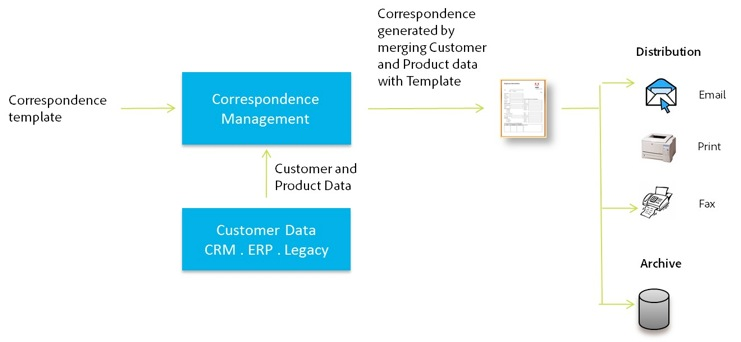

# Crea lettera {#create-letter}

## Flusso di lavoro di gestione della corrispondenza {#correspondence-management-workflow}

Il flusso di lavoro di Gestione della corrispondenza è costituito da quattro fasi:

1. Creazione di modelli
1. Creazione di frammenti di documenti
1. Creazione di lettere
1. Postelaborazione

### Creazione di modelli {#template-creation}

L’immagine seguente mostra un flusso di lavoro tipico per la creazione di un modello di corrispondenza.

In questo flusso di lavoro:

1. I progettisti di moduli creano layout e layout di frammenti utilizzando Adobe Forms Designer e li caricano in un archivio CRX. I layout contengono campi modulo tipici, funzionalità di layout come intestazione e piè di pagina e &quot;aree di destinazione&quot; vuote per il posizionamento del contenuto. Successivamente, gli specialisti delle applicazioni mappano il contenuto necessario per queste aree di destinazione. Ulteriori informazioni su [progettazione del layout](/help/forms/using/layout-design-details.md).
1. Esperti in materia provenienti da dipartimenti legali, finanziari o di marketing creano e caricano contenuti quali clausole di testo, clausole di esclusione di responsabilità, termini e condizioni e immagini quali logo, riutilizzati in vari modelli di corrispondenza.
1. Gli specialisti delle applicazioni creano modelli di corrispondenza. Specialista dell&#39;applicazione

   * Esegue il mapping di clausole di testo e immagini alle aree di destinazione nei modelli di layout
   * Definisce condizioni/regole per l’inclusione dei contenuti
   * Associa campi e variabili di layout ai modelli di dati sottostanti

1. L’autore visualizza l’anteprima della lettera e la invia per la post-elaborazione. Ulteriori informazioni su [post-elaborazione](/help/forms/using/submit-letter-topostprocess.md).

#### Utilizzo dei modelli di lettera forniti con Gestione corrispondenza {#using-letter-templates-provided-with-correspondence-management}

Invece di creare un modello di layout da zero, puoi scegliere di modificare e riutilizzare i modelli forniti da Gestione corrispondenza. È possibile utilizzare Designer per modificare rapidamente i campi di branding e di dati e contenuti dei modelli in base alle esigenze della propria organizzazione. Per ulteriori informazioni sui modelli di Gestione della corrispondenza, consulta [Modelli di lettere di riferimento](/help/forms/using/reference-cm-layout-templates.md).

### Creazione di frammenti di documenti {#document-fragment-creation}

I frammenti di documento sono parti o componenti riutilizzabili di una corrispondenza mediante i quali è possibile comporre lettere o corrispondenza.

I frammenti di documento sono dei seguenti tipi:

#### Testo {#text}

Una risorsa di testo è un contenuto costituito da uno o più paragrafi di testo. Un paragrafo può essere statico o dinamico. Un paragrafo dinamico contiene riferimenti a elementi dati, i cui valori vengono forniti in fase di esecuzione.

#### Elenco {#list}

Elenco è una serie di frammenti di documenti, tra cui testo, elenchi (lo stesso elenco non può essere &quot;aggiunto in sé&quot;), condizioni e immagini. L’ordine degli elementi dell’elenco può essere fisso o modificabile. Durante la creazione di una lettera, potete utilizzare alcuni o tutti gli elementi dell&#39;elenco per replicare un pattern di elementi riutilizzabile.

#### Condizione {#condition}

Le condizioni consentono di definire quale contenuto viene incluso al momento della creazione della corrispondenza, in base ai dati forniti. La condizione è descritta in termini di variabili di controllo. Le variabili possono essere un elemento del dizionario dati o un segnaposto. Quando aggiungi una condizione, puoi scegliere di includere una risorsa in base al valore di cui dispone la variabile di controllo. Le condizioni hanno un singolo output basato su un’espressione. La prima espressione risulta essere true, in base alla variabile di condizione corrente. Il suo valore diventa l’output della condizione.

#### Frammento layout {#layout-fragment}

Un frammento di layout è un layout che può essere utilizzato all’interno di una o più lettere. Un frammento di layout viene utilizzato per creare pattern ripetibili, in particolare tabelle dinamiche. Il layout può contenere campi modulo tipici come &quot;Indirizzo&quot; e &quot;Numero di riferimento&quot;. Contiene anche sottomoduli vuoti che denotano le aree di destinazione. I layout (XDP) vengono creati in Designer e quindi sono [caricato in Forms e Documenti](/help/forms/using/get-xdp-pdf-documents-aem.md).

### Creazione di lettere {#letter-creation}

Esistono due modi per generare la corrispondenza inviata ai clienti: guidata dall’utente e guidata dal sistema.

#### Guidato dall&#39;utente {#user-driven}

I dipendenti che si rivolgono al cliente, ad esempio gli addetti alla liquidazione dei sinistri o i lavoratori che si occupano dei casi, possono creare corrispondenza personalizzata. Grazie a un’interfaccia semplice e intuitiva per la compilazione delle lettere, gli utenti aziendali possono aggiungere testo opzionale alla corrispondenza, personalizzare i contenuti modificabili e visualizzare in anteprima la corrispondenza in tempo reale. In seguito, può inviare la corrispondenza personalizzata a un processo back-end.

#### Basato sul sistema {#system-driven}

La generazione della corrispondenza è automatizzata, guidata dai trigger di evento. Ad esempio, un avviso di promemoria inviato a un cittadino che richiede la registrazione dell’imposta anticipata viene generato unendo il modello predefinito con i dati del cittadino. La lettera finale può essere inviata via e-mail, stampata, inviata via fax o archiviata.

### Post-elaborazione {#post-processing}

La corrispondenza finale può essere inviata a un processo back-end per la post-elaborazione. La corrispondenza può essere:

1. Elaborato per la stampa di e-mail, fax o batch o inserito in una cartella per la stampa o l&#39;invio di e-mail.
1. Inviato per revisione e approvazione.
1. Protetto tramite l&#39;applicazione di firme digitali, certificazione, crittografia o gestione dei diritti.
1. Convertito in un documento PDF ricercabile contenente tutti i metadati necessari a scopo di archiviazione e controllo.
1. Incluso in un Portfolio PDF che include più documenti, ad esempio materiale di marketing. Il Portfolio PDF può quindi essere inviato come corrispondenza finale.

### Architettura della soluzione per la gestione della corrispondenza {#correspondence-management-solution-architecture}

L’immagine seguente fornisce una panoramica di un’architettura di esempio della soluzione Letters.

## Annullamento della costruzione di una lettera {#deconstructing-a-letter}

Il presente documento di notifica di annullamento è un esempio di corrispondenza tipica:

<table> 
 <tbody> 
  <tr> 
   <td><strong>Elementi lettera</strong></td> 
   <td><strong>Descrizione</strong></td> 
   <td><strong>Formato con</strong></td> 
  </tr> 
  <tr> 
   <td>Dati da sistemi aziendali back-end</td> 
   <td>Dati provenienti da sistemi aziendali back-end. I dati vengono uniti dinamicamente con il modello di corrispondenza.</td> 
   <td>Il  File di dati creato in base a un dizionario dati</td> 
  </tr> 
  <tr> 
   <td>Dati  Inserito dal dipendente in prima linea</td> 
   <td>Dati che possono essere forniti da un dipendente in prima linea che personalizza la lettera prima di inviarla.  </td> 
   <td>
Elementi DD non protetti  Paragrafi di testo modificabili  Variabili/segnaposto  
 </td> 
  </tr> 
  <tr> 
   <td>Pre-approvato  Paragrafi di testo</td> 
   <td>Contenuto di testo preapprovato. Il contenuto del testo viene in genere creato da esperti in questioni legali, finanziarie o di settore che conoscono il contesto commerciale della lettera. Contenuto come intestazione, piè di pagina, disclaimer e formula introduttiva è comune alla maggior parte delle lettere. Tuttavia, il contenuto come "motivo della rescissione" sarebbe specifico per la lettera in questione.</td> 
   <td>
Testo\Elenchi\  Condizioni\Layout
 
 
 </td> 
  </tr> 
  <tr> 
   <td>Dati  In base alla logica personalizzata?</td> 
   <td>Per alcune lettere, ad esempio una lettera per richiedere ulteriori informazioni relative a una richiesta di risarcimento, gli utenti come l'Adattatore richieste di rimborso possono aggiungere contenuto di testo personalizzato.</td> 
   <td>Documento  Frammento di tipo Condizione </td> 
  </tr> 
  <tr> 
   <td>Archiviato  Immagini dall’archivio centrale</td> 
   <td>Immagini quali loghi e immagini di firma. Immagini come i logo aziendali appaiono nella maggior parte o in tutta la corrispondenza. Le immagini della firma sono specifiche della lettera e della persona per conto della quale la lettera viene inviata.</td> 
   <td>
Immagini memorizzate in risorse AEM (DAM)  
 
 
 </td> 
  </tr> 
 </tbody> 
</table>

## Analizzare una lettera prima di crearla {#analyze-a-letter-before-you-construct-it}

Analizzare ogni lettera per scoprire i vari pezzi che compongono la lettera. Lo specialista dell&#39;applicazione analizza le corrispondenze generate.

* Quali parti della corrispondenza sono statiche e quali sono dinamiche. Le variabili che vengono compilate dalle origini dati back-end o dagli utenti finali.
* L’ordine in cui i vari paragrafi di testo compaiono nella corrispondenza, ad esempio se un utente aziendale può modificare i paragrafi durante la creazione della corrispondenza.
* Il sistema di corrispondenza è generato o richiede un utente finale per modificare la corrispondenza? Quante corrispondenze sono generate dal sistema e quante richiedono l’intervento dell’utente?
* Con quale frequenza cambia il modello di corrispondenza? Sarà aggiornato ogni anno, trimestralmente o solo quando una particolare legislazione cambia? Quale tipo di modifiche è previsto? Correggere gli errori tipografici, modificare il layout, aggiungere altri campi, aggiungere altri paragrafi e così via?
* Quando pianifichi i requisiti di corrispondenza, assembla l’elenco dei nuovi modelli di corrispondenza. Per ogni modello di corrispondenza, è necessario:

   * Clausole di testo, immagini e tabelle
   * Valori dei dati dai sistemi back-end
   * Layout e layout dei frammenti della corrispondenza
   * Ordine in cui il contenuto viene visualizzato nella lettera e regole per l’inclusione e l’esclusione del contenuto

* Le condizioni in base alle quali gli utenti aziendali, ad esempio i periti per la liquidazione dei sinistri o i lavoratori addetti ai casi, modificano il contenuto o parti della lettera.
* Gli scenari sono narrazioni che descrivono l’esperienza utente, i requisiti e i vantaggi dell’utilizzo della soluzione Letters.
* Gli scenari forniscono anche:le competenze e gli strumenti necessari per il progetto.
* Best practice per la pianificazione dell’implementazione. &quot;Panoramica sull’implementazione di alto livello.

## Vantaggi dell’esecuzione dell’analisi {#benefits-of-performing-the-analysis}

**Riutilizzo dei contenuti** Disponi di un elenco consolidato dei nuovi contenuti necessari per generare la corrispondenza. Gran parte del contenuto, come intestazioni, piè di pagina, disclaimer e introduzioni, è comune a molte lettere e può essere riutilizzato in diverse lettere. Tutti i contenuti comuni possono essere creati e approvati dagli esperti una sola volta e poi riutilizzati in molti invii di corrispondenza.

**Creazione del dizionario dati** Ci saranno valori di dati come &quot;ID cliente&quot; e &quot;Nome cliente&quot; che sono comuni a molte lettere. Puoi preparare un elenco consolidato di tutti questi valori di dati. In genere viene consultato un membro del team middleware aziendale durante la pianificazione della struttura. Questo costituisce la base per la creazione del dizionario dati.

**Acquisizione dei dati dai sistemi aziendali back-end** Conoscerai inoltre tutti i valori di dati necessari e da dove vengono ottenuti i dati del sistema aziendale. Puoi quindi progettare l’implementazione per estrarre i dati dal sistema aziendale e inviarli alla soluzione Letters.

**Stima della complessità delle lettere** È importante determinare quanto sarà complesso creare una particolare corrispondenza. Questa analisi consente di determinare la quantità di tempo e di competenze necessarie per creare i modelli di lettera. Ciò contribuirà a sua volta a stimare le risorse e i costi di implementazione della soluzione Letters.

## Complessità della corrispondenza {#correspondence-complexity}

La complessità della corrispondenza può essere determinata analizzando i seguenti parametri:

**Complessità del layout** Quanto è complesso il layout? Lettere come Notifica di annullamento hanno layout semplici. Le lettere, come la conferma di copertura delle richieste di rimborso, hanno invece un layout complesso con diverse tabelle e più di 60 campi modulo. La creazione di layout complessi richiede più tempo e competenze avanzate per la progettazione del layout.

**Numero di paragrafi e condizioni di testo** Un contratto di prestito può avere una lunghezza di 10 pagine e contenere più di 40 clausole di testo. Molte di queste clausole dipenderebbero da &quot;parametri di prestito&quot;. Sulla base dei termini e delle condizioni esatte, le clausole sarebbero incluse o escluse dal contratto. La creazione di tali lettere richiede una pianificazione approfondita e un&#39;attenta definizione delle condizioni complesse.

In questa tabella vengono fornite alcune linee guida che è possibile utilizzare per classificare le lettere:

<table> 
 <tbody> 
  <tr> 
   <td>
<strong>Livello di complessità</strong>
 </td> 
   <td>
<strong>Complessità del layout (soggettivo)</strong>
 </td> 
   <td>
<strong>Numero di paragrafi di testo</strong>
 </td> 
   <td>
<strong>Numero di testi o immagini condizionali</strong>
 </td> 
   <td>
<strong>Set di competenze richiesto</strong>
 </td> 
  </tr> 
  <tr> 
   <td>
Bassa complessità
 </td> 
   <td>
Bassa. Il layout contiene pochi campi modulo (&lt;15).
 
In genere, una pagina.
 </td> 
   <td>
8
 </td> 
   <td>
1
 </td> 
   <td>
Competenze di designer medio.
 </td> 
  </tr> 
  <tr> 
   <td>
Complessità media
 </td> 
   <td>
Layout con complessità media. Include strutture quali le tabelle. In genere, la lunghezza supera le una pagina.
 </td> 
   <td>
16
 </td> 
   <td>
2
 </td> 
   <td>
Competenze di designer medio.
 
 
 
Capacità di creare espressioni complesse utilizzando interfacce utente.
 </td> 
  </tr> 
  <tr> 
   <td>
Elevata complessità
 </td> 
   <td>
Layout complesso. Può essere superiore a tre pagine. Contiene tabelle e più di 60 campi modulo.
 </td> 
   <td>
40
 </td> 
   <td>
8
 </td> 
   <td>
Competenze di designer esperti.
 
 
 
Capacità di creare espressioni complesse utilizzando interfacce utente.
 </td> 
  </tr> 
 </tbody> 
</table>

## Panoramica sulla creazione di una lettera {#overview-of-creating-a-letter}

1. Selezionare il layout appropriato che funge da base per la lettera e creare una lettera.
1. Aggiungi moduli di dati o frammenti di layout alla lettera e configurali.
1. Scegli di visualizzare in anteprima la corrispondenza.
1. Modifica e imposta campi, variabili, contenuto e allegati.

### Prerequisiti {#prerequisites}

Per creare una corrispondenza è necessario disporre quanto segue:

* [Pacchetto di compatibilità](compatibility-package.md). Installare il pacchetto di compatibilità per visualizzare **Lettere** opzione sul **Forms** pagina.
* La lettera XDP ([layout](/help/forms/using/document-fragments.md)).
* Altri XDP ([frammenti di layout](document-fragments.md#document-fragments)) che formano parti della lettera. Gli XDP\Layout vengono creati in [Designer](https://www.adobe.com/go/learn_aemforms_designer_65_it).
* Le pertinenti [dizionario dati](/help/forms/using/data-dictionary.md) (Facoltativo)
* Il [moduli dati](/help/forms/using/document-fragments.md) desideri utilizzare nella corrispondenza.
* [Dati di prova](/help/forms/using/data-dictionary.md#p-working-with-test-data-p) è il file XML contenente i dati di test. I dati di test sono necessari se si utilizza un dizionario dati.

## Creare un modello di lettera {#create-a-letter-template}

### Seleziona un layout e immetti le proprietà della lettera {#select-a-layout-and-enter-the-letter-properties}

1. Seleziona **Forms** > **Lettere**.

1. Seleziona **Crea > Lettera**. Gestione della corrispondenza visualizza i layout disponibili (XDP). Questi layout provengono da Designer. I layout includono anche i modelli di lettera forniti da Gestione corrispondenza. Per ulteriori informazioni sui modelli di Gestione della corrispondenza, consulta [Modelli di lettere di riferimento](/help/forms/using/reference-cm-layout-templates.md). Per aggiungere layout personalizzati, creare file XDP (layout) in Designer e quindi [caricali su AEM Forms](/help/forms/using/get-xdp-pdf-documents-aem.md).

   

1. Seleziona un layout toccandolo e toccandolo **Successivo**.

   

1. Immetti le proprietà per la corrispondenza e tocca **Salva:**

   * **Titolo (facoltativo):** Immettere il titolo della lettera. Il titolo non deve necessariamente essere univoco e può contenere caratteri speciali e non inglesi.
   * **Nome:** Nome univoco della lettera. Non possono esistere due lettere con lo stesso nome in nessuno stato. Nel campo Nome è possibile immettere solo caratteri, numeri e trattini in lingua inglese. Il campo Nome viene compilato automaticamente in base al campo Titolo. I caratteri speciali, gli spazi, i numeri e i caratteri non inglesi immessi nel campo Titolo vengono sostituiti da trattini nel campo Nome. Anche se il valore nel campo Titolo viene copiato automaticamente nel Nome, è possibile modificarlo.
   * **Descrizione (facoltativa):** Descrivi la lettera come riferimento.
   * **Dizionario dati (facoltativo)**: il dizionario dati può essere associato alla corrispondenza. Le risorse inserite successivamente in questa corrispondenza devono avere lo stesso dizionario dati scelto per la corrispondenza in questo campo o nessun dizionario dati.
   * **Tag (facoltativo):** Seleziona i tag da applicare alla corrispondenza. Puoi anche immettere un nome di tag nuovo/personalizzato e premere Invio per crearlo.
   * **Post-elaborazione (facoltativo):** Selezionare il processo di registrazione da applicare al modello di lettera. Esistono processi di post predefiniti e quelli creati con l’AEM, ad esempio e-mail e stampa.

   

1. Il sistema visualizza un messaggio: &quot;Lettera creata correttamente&quot;. (nel messaggio di avviso) Tocca **Apri** per configurare i moduli di dati e i frammenti di layout al loro interno. Oppure tocca **Fine** per tornare alla pagina precedente.

   

   **Successivo**: quando tocchi **Apri**, Gestione corrispondenza visualizza una rappresentazione del layout con tutti i componenti nel layout (XDP) elencati. Procedere con l&#39;inserimento del [Moduli di dati e frammenti di layout e relativa configurazione](/help/forms/using/create-letter.md#p-insert-data-modules-and-layout-fragments-in-a-letter-and-configure-them-p).

### Inserire moduli di dati e frammenti di layout in una lettera e configurarli {#insert-data-modules-and-layout-fragments-in-a-letter-and-configure-them}

Quando, dopo aver creato una corrispondenza, tocca Apri, Gestione corrispondenza visualizza una rappresentazione del layout con tutte le sottomaschere/aree di destinazione nel layout (XDP) elencato. In ciascuna area di destinazione è possibile scegliere di inserire un modulo dati o un frammento di layout (e quindi i moduli dati nel frammento di layout).

>[!NOTE]
>
>Puoi anche scegliere di toccare l’icona Modifica per una lettera nella pagina Lettere per inserire in una lettera moduli di dati e frammenti di layout e configurarli.

1. Tocca **Inserisci** per ciascuna sottomaschera e selezionare Moduli dati o un frammento di layout da inserire in ciascuna sottomaschera.

   

1. Seleziona Modulo dati o Frammento layout per queste opzioni per ciascuna sottomaschera, quindi scegli i Moduli dati o i Frammenti layout da inserire. Un frammento di layout consente di inserire ulteriori moduli di dati o frammenti di layout in esso in base alla progettazione (fino a quattro livelli).

   

1. Se si inserisce un frammento di layout, il nome del frammento viene visualizzato nel sottomodulo. In base al frammento selezionato, nella sottomaschera vengono visualizzate le sottomaschere nidificate.
1. Dopo aver inserito i Moduli dati selezionati nel layout, tocca la modalità di configurazione e imposta quanto segue dopo aver toccato l’icona Modifica per ciascuno dei moduli:

   1. **Modificabile**: quando questa opzione è selezionata, il contenuto può essere modificato nell’interfaccia utente Crea corrispondenza. Contrassegna il contenuto come modificabile solo se richiede la modifica da parte dell&#39;utente aziendale, ad esempio un perito per la liquidazione dei sinistri.
   1. **Obbligatorio**: quando questa opzione è selezionata, il contenuto è obbligatorio nell’interfaccia utente Crea corrispondenza.
   1. **Selezionato**: quando questa opzione è selezionata, il contenuto viene selezionato per impostazione predefinita nell’interfaccia utente Crea corrispondenza.
   1. **Rientro**: aumenta o diminuisce il rientro del modulo/contenuto nella lettera. Il rientro è specificato in termini di livelli, a partire da 0. Ogni livello fa un rientro di 36 punti. Per ulteriori informazioni sulla personalizzazione dei moduli, consulta **[!UICONTROL Configurazioni gestione corrispondenza]** in [Flusso di lavoro di Forms](submit-letter-topostprocess.md#formsworkflow).
   1. **Interruzione di pagina prima**: se imposti Interruzione di pagina prima su on, il contenuto di QUESTO modulo viene sempre visualizzato in una nuova pagina.
   1. **Interruzione di pagina dopo**: se imposti l’opzione Interruzione di pagina dopo su per un modulo specifico, il contenuto del modulo SUCCESSIVO viene sempre visualizzato in una nuova pagina.

   

1. Per modificare un modulo, tocca l’icona Modifica accanto a esso. Dopo aver modificato i moduli, tocca **Salva**.

   In questa pagina è inoltre possibile eseguire le operazioni seguenti per le sottomaschere:

   1. **Consenti testo libero**: se è abilitata l’opzione Consenti testo libero, l’utente può aggiungere testo in linea nella lettera nella vista CCR. Nella vista CCR è abilitata un’azione &quot;T&quot; per le aree di destinazione in cui è abilitato Consenti testo libero e quando l’utente lo tocca chiede il nome e la descrizione del testo e quindi tocca ok apre il testo in modalità di modifica, dove l’utente può aggiungere testo. Funziona come gli altri moduli di testo
   1. **Blocca ordine**: blocca l’ordine delle sottomaschere nella lettera. L’autore non può riordinare le sottomaschere o i componenti durante la creazione della lettera.

   In questa pagina è inoltre possibile eseguire le operazioni seguenti per ciascuna delle risorse nelle sottomaschere:

   1. **Modificare l’ordine delle risorse**: trascina e rilascia una risorsa contenente l’icona Riordina per una risorsa ( ).
   1. **Eliminare risorse**: tocca l’icona Elimina accanto a una risorsa per eliminarla.
   1. **Visualizzare in anteprima le risorse**: tocca l’icona mostra anteprima ( ) accanto a una risorsa.

1. Tocca **Successivo**.
1. La pagina Dati descrive in dettaglio come vengono utilizzati i campi dati e le variabili nel modello. I dati possono essere collegati a origini dati quali un dizionario dati o un input utente. Ogni campo definisce le proprietà da cui il dizionario dati mappa i dati o quale didascalia viene visualizzata per i campi di input dell’utente.

   Collegamento:

   * Il **campo** Gli elementi possono essere collegati a un elemento letterale, a un elemento del dizionario dati, a una risorsa o a un valore specificato dall’utente. È inoltre possibile ignorare un elemento campo associandolo all’opzione Ignora.
   * Il **variabile** Gli elementi possono essere collegati a un elemento letterale, un elemento del dizionario dati, un campo, una variabile, una risorsa o un valore specificato dall’utente.

   Di seguito sono riportati alcuni campi principali del collegamento:

   * **Multiriga**: puoi specificare se l’immissione dei dati per un campo o una variabile è su più righe. Se si seleziona questa opzione, la casella di input per il campo o la variabile viene visualizzata come casella di input su più righe nella Visualizzazione modifica dati. Il campo o la variabile viene inoltre visualizzato come multiriga nelle visualizzazioni Dati e Contenuto nell’interfaccia utente Crea corrispondenza. Il campo di immissione su più righe è simile al campo per l&#39;immissione di un commento in un TextModule. L’opzione su più righe è disponibile solo per campi e variabili con tipo di collegamento Utente o Elementi del dizionario dati non protetti.
   * **Facoltativo**: puoi specificare se il valore per il campo o la variabile è facoltativo o meno. L’opzione campo opzionale è disponibile per campi e variabili con tipo di collegamento Utente o Elementi del dizionario dati non protetti.

   * **Convalida campo/variabile**: per fornire una convalida avanzata del valore di un campo o di una variabile, puoi assegnare una convalida al campo o alla variabile. Questa opzione è disponibile solo per campi e variabili con tipo di collegamento Utente o Elementi del dizionario dati non protetti.
   * **Didascalia** e **Descrizione**: la didascalia è l’etichetta del campo che viene visualizzato prima del campo nell’interfaccia utente di CCR. Questa opzione è disponibile per campi e variabili con tipo di collegamento Utente o Elementi del dizionario dati non protetti.

   Di seguito sono riportati i tipi di convalida utilizzabili per i campi:

   * **Convalida stringa**: utilizza Convalida stringhe per specificare una lunghezza minima e massima della stringa immessa nel campo o nella variabile. Quando si crea un Convalida stringa, assicurarsi di specificare parametri di convalida validi. Immettere una lunghezza valida per i valori minimo e massimo. Per la convalida delle stringhe, puoi specificare la lunghezza minima e massima del valore che può essere immesso. Se il valore immesso non corrisponde ai valori minimo e massimo specificati, il campo pertinente nell’interfaccia utente CCR è contrassegnato in rosso.

   * **Convalida numero**: utilizza la funzione di convalida del numero per specificare il valore numerico minimo e massimo immesso in un campo o in una variabile. Quando si crea una convalida numerica, assicurarsi di specificare parametri di convalida validi. Immettere valori numerici sia per il valore minimo che per quello massimo.

   * **Convalida espressioni regolari**: utilizza Convalida espressioni regolari per definire un’espressione regolare utilizzata per convalidare il valore di un campo o di una variabile. Inoltre, è possibile personalizzare il messaggio di errore. Quando si crea un Convalida espressioni regolari, assicurarsi di specificare un&#39;espressione regolare valida.

   >[!NOTE]
   >
   >Le convalide di campi e variabili sono disponibili solo per campi o variabili con tipo di collegamento Utente o Elementi del dizionario dati non protetti.

   

1. Dopo aver specificato il collegamento, tocca **Successivo**. Gestione corrispondenza visualizza la schermata Allegati.

### Impostare gli allegati {#set-up-the-attachments}

1. Seleziona **Aggiungi risorsa**.
1. Nella schermata Seleziona risorsa, tocca le risorse da allegare alla lettera e tocca **Fine**. Devi prima caricare le risorse in Assets. È consigliabile allegare solo documenti di PDF e Microsoft Office, ma è anche possibile allegare immagini. Per ulteriori informazioni sul caricamento di risorse in DAM, consulta [Caricamento risorse](/help/assets/manage-assets.md).
1. Per bloccare l&#39;ordine dei cespiti nell&#39;elenco in modo che l&#39;Aggiustatore risarcimenti non possa modificarlo, toccare **Blocca ordine**. Se non si seleziona questa opzione, l&#39;Aggiustatore richieste di rimborso può modificare l&#39;ordine delle voci di elenco.
1. Per modificare l’ordine delle risorse, trascina e rilascia una risorsa contenente l’icona Riordina per una risorsa ( ).
1. Tocca **Modifica** davanti a un allegato e specificare un allegato come Obbligatorio se non si desidera che l&#39;autore possa eliminarlo. Specificate un allegato come Selezionato se desiderate che sia preselezionato nell&#39;interfaccia CCR.
1. Seleziona **Accesso libreria** per consentire l’accesso alla libreria. Se l&#39;accesso alla libreria è abilitato, l&#39;Aggiustatore attestazioni può accedere alla libreria dei contenuti durante la creazione di una lettera e l&#39;inserimento di allegati.
1. Seleziona **Configurazione allegati** e specificare il numero massimo di allegati.

1. Tocca **Salva**. La corrispondenza viene creata ed elencata nella pagina Lettere.

Dopo aver creato un modello di lettera in Gestione corrispondenza, l’utente finale, l’agente o l’addetto alle richieste di rimborso può aprire la lettera nell’interfaccia utente di CCR e creare una corrispondenza immettendo i dati, configurando il contenuto e gestendo gli allegati. Per ulteriori informazioni, consulta [Crea corrispondenza](/help/forms/using/create-correspondence.md).

## Tipi di collegamento disponibili per ciascuno dei campi {#types-of-linkage-available-for-each-of-the-fields}

Nella tabella seguente vengono descritti i tipi di collegamento disponibili per i vari tipi di campi.

I seguenti valori nella tabella

* **Sì**: il tipo di campo nella colonna più a sinistra supporta tale tipo di mappatura
* **No**: il tipo di campo nella colonna più a sinistra non supporta tale tipo di mappatura
* **N/D**: tipo di campo non applicabile nella colonna più a sinistra

<table> 
 <tbody> 
  <tr> 
   <td> </td> 
   <td><strong>Letterale</strong></td> 
   <td><strong>Risorsa</strong></td> 
   <td><strong>Dizionario dati</strong></td> 
   <td><strong>Ignora</strong></td> 
   <td><strong>User</strong></td> 
   <td><strong>Campo</strong></td> 
   <td><strong>Variabile</strong></td> 
  </tr> 
  <tr> 
   <td><strong>data</strong></td> 
   <td>Sì</td> 
   <td>No</td> 
   <td>Sì</td> 
   <td>Sì</td> 
   <td>Sì</td> 
   <td>N/D</td> 
   <td>N/D</td> 
  </tr> 
  <tr> 
   <td><strong>time</strong></td> 
   <td>Sì</td> 
   <td>No</td> 
   <td>Sì</td> 
   <td>Sì</td> 
   <td>Sì</td> 
   <td>N/D</td> 
   <td>N/D</td> 
  </tr> 
  <tr> 
   <td><strong>datetime</strong></td> 
   <td>Sì</td> 
   <td>No</td> 
   <td>Sì</td> 
   <td>Sì</td> 
   <td>Sì</td> 
   <td>N/D</td> 
   <td>N/D</td> 
  </tr> 
  <tr> 
   <td><strong>numero intero</strong></td> 
   <td>Sì</td> 
   <td>No</td> 
   <td>Sì</td> 
   <td>Sì</td> 
   <td>Sì  </td> 
   <td>N/D</td> 
   <td>N/D</td> 
  </tr> 
  <tr> 
   <td><strong>galleggiare</strong></td> 
   <td>Sì</td> 
   <td>No</td> 
   <td>Sì</td> 
   <td>Sì</td> 
   <td>Sì  </td> 
   <td>N/D</td> 
   <td>N/D  </td> 
  </tr> 
  <tr> 
   <td><strong>richtext</strong></td> 
   <td>Sì</td> 
   <td>solo testo</td> 
   <td>Sì</td> 
   <td>Sì</td> 
   <td>Sì</td> 
   <td>N/D</td> 
   <td>N/D</td> 
  </tr> 
  <tr> 
   <td><strong>semplice</strong> <strong>text</strong></td> 
   <td>Sì</td> 
   <td>solo testo</td> 
   <td>Sì</td> 
   <td>Sì</td> 
   <td>Sì</td> 
   <td>N/D</td> 
   <td>N/D</td> 
  </tr> 
  <tr> 
   <td><strong>immagine</strong></td> 
   <td>No</td> 
   <td>solo immagine</td> 
   <td>No</td> 
   <td>Sì</td> 
   <td>No</td> 
   <td>N/D</td> 
   <td>N/D</td> 
  </tr> 
  <tr> 
   <td><strong>firma</strong></td> 
   <td>No</td> 
   <td>No</td> 
   <td>No  </td> 
   <td>Sì</td> 
   <td>No</td> 
   <td>N/D</td> 
   <td>N/D  </td> 
  </tr> 
 </tbody> 
</table>

## Creare una copia di un modello di lettera {#createcopylettertemplate}

È possibile utilizzare un modello di lettera esistente per creare rapidamente un modello di lettera con proprietà, contenuto e risorse ereditate simili, ad esempio frammenti di documento e dizionario dati. A questo scopo, copia e incolla una lettera.

1. Nella pagina Lettere selezionare una o più lettere. Nell’interfaccia utente viene visualizzata l’icona Copia.
1. Tocca Copia. Nell’interfaccia viene visualizzata l’icona Incolla. Puoi anche scegliere di entrare in una cartella prima di incollarla. Cartelle diverse possono contenere risorse con gli stessi nomi. Per ulteriori informazioni sulle cartelle, consulta [Cartelle e organizzazione delle risorse](/help/forms/using/import-export-forms-templates.md#folders-and-organizing-assets).
1. Tocca Incolla. Viene visualizzata la finestra di dialogo Incolla. Se si copiano e si incollano le lettere nello stesso punto, il sistema assegna automaticamente nomi e titoli alle nuove copie di lettere, ma è possibile modificare i titoli e i nomi delle lettere.
1. Se necessario, modificare il Titolo e il Nome con cui si desidera salvare la copia della lettera.
1. Tocca Incolla. Viene creata la copia della lettera. Ora puoi apportare le modifiche richieste nella nuova lettera creata.
