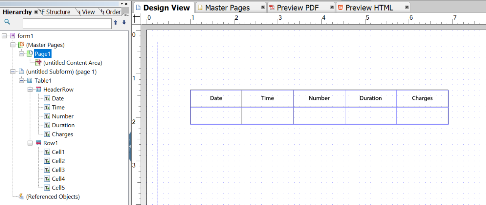

# Tutorial: creare modelli{#tutorial-create-templates}

Questo tutorial è un passaggio del [Creare la prima comunicazione interattiva](/help/forms/using/create-your-first-interactive-communication.md) serie. È consigliabile seguire la serie in sequenza cronologica per comprendere, eseguire e dimostrare il caso di utilizzo completo dell’esercitazione.

Per creare una comunicazione interattiva, è necessario che sul server AEM siano disponibili modelli per la stampa e i canali Web.

I modelli per il canale di stampa vengono creati in Adobe Forms Designer e caricati sul server AEM. Questi modelli sono quindi disponibili per l’utilizzo durante la creazione di una comunicazione interattiva.

I modelli per il canale web vengono creati in AEM. Gli autori e gli amministratori dei modelli possono creare, modificare e abilitare i modelli web. Una volta creati e abilitati, questi modelli sono disponibili per l’uso durante la creazione di una comunicazione interattiva.

Questo tutorial illustra i passaggi necessari per creare modelli per i canali di stampa e web, in modo che siano disponibili per l’utilizzo durante la creazione di comunicazioni interattive. Al termine di questa esercitazione, sarai in grado di:

* Creazione di modelli XDP per il canale di stampa con Adobe Forms Designer
* Carica i modelli XDP sul server AEM Forms
* Creare e abilitare modelli per il canale web

## Crea modello per canale di stampa {#create-template-for-print-channel}

Crea e gestisci un modello per il canale di stampa della comunicazione interattiva utilizzando le seguenti attività:

* [Creare un modello XDP utilizzando Forms Designer](../../forms/using/create-templates-print-web.md#create-xdp-template-using-forms-designer)
* [Caricare un modello XDP sul server AEM Forms](../../forms/using/create-templates-print-web.md#upload-xdp-template-to-the-aem-forms-server)
* [Creare un modello XDP per i frammenti di layout](../../forms/using/create-templates-print-web.md#create-xdp-template-for-layout-fragments)

### Creare un modello XDP utilizzando Forms Designer {#create-xdp-template-using-forms-designer}

In base al [caso d’uso](/help/forms/using/create-your-first-interactive-communication.md) e [anatomia](/help/forms/using/planning-interactive-communications.md), crea i seguenti sottomoduli nel modello XDP:

* Dettagli distinta: include un frammento di documento
* Dettagli cliente: include un frammento di documento
* Riepilogo fatture: include un frammento di documento
* Riepilogo: include un frammento di documento (sottomaschera Addebiti) e un grafico (sottomaschera Grafici)
* Chiamate dettagliate: include una tabella (frammento di layout)
* Pay Now (Paga ora): include un’immagine
* Servizi a valore aggiunto: include un’immagine

Questi sottomoduli vengono visualizzati come aree di destinazione nel modello Stampa dopo il caricamento del file XDP sul server Forms. Tutte le entità, quali frammenti di documenti, grafici, frammenti di layout e immagini, vengono aggiunte alle aree di destinazione durante la creazione della comunicazione interattiva.

Per creare un modello XDP per il canale di stampa, effettuare le seguenti operazioni:

1. Apri Forms Designer, seleziona **File** > **Nuovo** > **Utilizzare un modulo vuoto,** seleziona **Successivo** e quindi selezionare **Fine** per aprire il modulo per la creazione di modelli.

   Assicurati che **Libreria di oggetti** e **Oggetto** sono selezionate dall&#39;opzione **Finestra** menu.

1. Trascina la selezione **Sottomodulo** componente da **Libreria di oggetti** al modulo.
1. Selezionare la sottomaschera in modo da visualizzare le opzioni della sottomaschera in **Oggetto** nel riquadro di destra.
1. Seleziona la **Sottomodulo** e seleziona **Flussi** dal **Contenuto** elenco a discesa. Per regolare la lunghezza, trascinare il punto finale sinistro della sottomaschera.
1. In **Associazioni** scheda:

   1. Specifica **Dettagli fattura** nel **Nome** campo.

   1. Seleziona **Nessuna associazione dati** dal **Associazione dati** elenco a discesa.

   

1. Analogamente, selezionare la sottomaschera principale, quindi selezionare **Sottomodulo** e seleziona **Flussi** dal **Contenuto** elenco a discesa. In **Associazioni** scheda:

   1. Specifica **TelecaBill** nel **Nome** campo.

   1. Seleziona **Nessuna associazione dati** dal **Associazione dati** elenco a discesa.

   

1. Ripetere i passaggi da 2 a 5 per creare le sottomaschere seguenti:

   * Dettagli fattura
   * DettagliCliente
   * Riepilogo fatture
   * Riepilogo: seleziona la **Sottomodulo** e seleziona **Posizionato** dal **Contenuto** elenco a discesa per questa sottomaschera. Inserisci le seguenti sottomaschere in **Riepilogo** sottomaschera.

      * Spese
      * Grafici

   * Chiamate dettagliate
   * PayNow
   * ValueAddedServices

   Per risparmiare tempo, è inoltre possibile copiare e incollare sottomaschere esistenti per crearne altre.

   Per spostare il **Grafici** sottomaschera a destra della sottomaschera Spese, selezionare la **Grafici** sottomaschera dal riquadro a sinistra, selezionare **Layout** e specificare un valore per la scheda **AnchorX** campo. Il valore deve essere maggiore del valore per **Larghezza** campo per **Spese** sottomaschera. Seleziona la **Spese** sottomaschera e seleziona la **Layout** in modo da poter visualizzare il valore della proprietà **Larghezza** campo.

1. Trascina la selezione **Testo** oggetto da **Libreria di oggetti** al modulo e immettere **Componi XXXX per abbonarti** testo nella casella.
1. Fare clic con il pulsante destro del mouse sull&#39;oggetto di testo nel riquadro sinistro e selezionare **Rinomina oggetto** e immettere il nome dell&#39;oggetto di testo come **Abbonati**.

   

1. Seleziona **File** > **Salva con nome** per salvare il file nel file system locale:

   1. Passa alla posizione in cui è possibile salvare il file e specifica il nome come **create_first_ic_print_template**.
   1. Seleziona **.xdp** dal **Salva come tipo** elenco a discesa.

   1. Seleziona **Salva**.

### Caricare un modello XDP sul server AEM Forms {#upload-xdp-template-to-the-aem-forms-server}

Dopo aver creato un modello XDP utilizzando Forms Designer, è necessario caricarlo sul server AEM Forms in modo che sia disponibile per l’uso durante la creazione della comunicazione interattiva.

1. Seleziona **[!UICONTROL Forms]** > **[!UICONTROL Forms e documenti]**.
1. Seleziona **Crea** > **Caricamento file**.

   Naviga e seleziona la **create_first_ic_print_template** modello (XDP) e seleziona **Apri** per importare il modello XDP sul server AEM Forms.

### Creare un modello XDP per i frammenti di layout {#create-xdp-template-for-layout-fragments}

Per creare un frammento di layout per il canale Stampa della comunicazione interattiva, crea un XDP utilizzando Forms Designer e caricalo sul server AEM Forms.

1. Apri Forms Designer, seleziona **File** > **Nuovo** > **Utilizzare un modulo vuoto,** seleziona **Successivo** e quindi selezionare **Fine** per aprire il modulo per la creazione di modelli.

   Assicurati che **Libreria di oggetti** e **Oggetto** sono selezionate dall&#39;opzione **Finestra** menu.

1. Trascina la selezione **Tabella** componente da **Libreria di oggetti** al modulo.
1. Nella finestra di dialogo Inserisci tabella:

   1. Specifica il numero di colonne come **5**.
   1. Specifica il numero di righe del corpo come **1**.
   1. Seleziona la **Includi riga intestazione nella tabella** casella di controllo.
   1. Linguetta **OK**.

1. Seleziona **+** nel riquadro a sinistra accanto a **Tabella** 1 e clic con il pulsante destro del mouse **Cella1** e seleziona **Rinomina oggetto** a **Data**.

   Analogamente, rinominare **Cella2**, **Cella3**, **Cella4**, e **Cella5** a **Ora**, **Numero**, **Durata**, e **Spese** rispettivamente.

1. Fai clic sui campi di testo dell’intestazione nel **Visualizzazione Progettazione** e rinominale in **Ora**, **Numero**, **Durata**, e **Spese**.

   

1. Seleziona **Riga 1** dal riquadro a sinistra e seleziona **Oggetto** > **Binding** > **Ripeti riga per ogni elemento dati**.

   

1. Trascina la selezione **Campo di testo** componente da **Libreria di oggetti** al **Visualizzazione Progettazione**.

   

   Allo stesso modo, trascina e rilascia la **Campo di testo** componente per **Ora**, **Numero**, **Durata**, e **Spese** righe.

1. Seleziona **File** > **Salva con nome** per salvare il file nel file system locale:

   1. Passa alla posizione in cui è possibile salvare il file e specifica il nome come **table_lf**.
   1. Seleziona **.xdp** dal **Salva come tipo** elenco a discesa.

   1. Seleziona **Salva**.

   Dopo aver creato un modello XDP per il frammento di layout utilizzando Progettazione Forms, è necessario [caricare](../../forms/using/create-templates-print-web.md#upload-xdp-template-to-the-aem-forms-server) sul server AEM Forms, in modo che il modello sia disponibile per l’uso durante la creazione di frammenti di layout.

## Creare un modello per il canale web {#create-template-for-web-channel}

Crea e gestisci un modello per il canale web di comunicazione interattiva utilizzando le seguenti attività:

* [Crea cartella per i modelli](../../forms/using/create-templates-print-web.md#create-folder-for-templates)
* [Creare il modello](../../forms/using/create-templates-print-web.md#create-the-template)
* [Abilita il modello](../../forms/using/create-templates-print-web.md#enable-the-template)
* [Abilitazione dei pulsanti nelle comunicazioni interattive](../../forms/using/create-templates-print-web.md#enabling-buttons-in-interactive-communications)

### Creare una cartella per i modelli {#create-folder-for-templates}

Per creare un modello di canale Web, definire una cartella in cui salvare i modelli creati. Dopo aver creato un modello all&#39;interno della cartella, abilitare il modello per consentire agli utenti dei moduli di creare un canale Web di una comunicazione interattiva basata sul modello.

Per creare una cartella per i modelli modificabili, effettuare le seguenti operazioni:

1. Seleziona **Strumenti**  > **Browser configurazioni**.
   * Consulta la [Browser configurazioni](/help/sites-administering/configurations.md) per ulteriori informazioni.
1. Nella pagina Browser configurazioni, seleziona **Crea**.
1. In **Crea configurazione** finestra di dialogo, specifica **Create_First_IC_templates** come titolo della cartella, seleziona **Modelli modificabili**, e seleziona **Crea**.

   

   Il **Create_First_IC_templates** viene creata ed elencata nella **Browser configurazioni** pagina.

### Creare il modello {#create-the-template}

In base al [caso d’uso](/help/forms/using/create-your-first-interactive-communication.md) e [anatomia](/help/forms/using/planning-interactive-communications.md), crea i seguenti pannelli nel modello Web:

* Dettagli distinta: include un frammento di documento
* Dettagli cliente: include un frammento di documento
* Riepilogo fatture: include un frammento di documento
* Riepilogo addebiti: include un frammento di documento e un grafico (layout a due colonne)
* Chiamate dettagliate: include una tabella
* Pay Now (Paga ora): include **Paga ora** e un&#39;immagine
* Servizi a valore aggiunto: include un&#39;immagine e un **Abbonati** pulsante.

Durante la creazione della comunicazione interattiva vengono aggiunte tutte le entità, ad esempio frammenti di documento, grafici, tabelle, immagini e pulsanti.

Per creare un modello per il canale Web in **Create_First_IC_templates** cartella, effettuare le seguenti operazioni:

1. Passare alla cartella dei modelli appropriata selezionando **Strumenti** > **Modelli** > **Create_First_IC_templates** cartella.
1. Seleziona **Crea**.
1. Il giorno **Scegli un tipo di modello** configurazione guidata, seleziona **Comunicazione interattiva - Canale web** e seleziona **Successivo**.
1. Il giorno **Dettagli Modello** configurazione guidata, specificare **Crea_Primo_IC_Modello_Web** come titolo del modello. Specifica una descrizione facoltativa e seleziona **Crea**.

   Un messaggio di conferma che **Crea_Primo_IC_Modello_Web** viene visualizzato.

1. Seleziona **Apri** per aprire il modello nell’editor modelli.
1. Seleziona **Contenuto iniziale** dall’elenco a discesa accanto al **Anteprima** opzione.

   

1. Seleziona **Pannello principale** e quindi seleziona **+** per visualizzare l’elenco dei componenti che è possibile aggiungere al modello.
1. Per aggiungere un pannello sopra **Pannello principale**, seleziona **Pannello** dall&#39;elenco.
1. Seleziona la **Contenuto** nel riquadro a sinistra. Il nuovo pannello aggiunto al passaggio 8 viene visualizzato sotto **Pannello principale** nella struttura del contenuto.

   

1. Seleziona il pannello e seleziona  (Configura).
1. Nel riquadro Proprietà:

   1. Specifica **billdetails** nel campo Nome.
   1. Specifica **Dettagli fattura** nel campo Titolo.
   1. Seleziona **1** dal **Numero di colonne** elenco a discesa.

   1. Per salvare le proprietà, seleziona .

   Il nome del pannello viene aggiornato a **Dettagli fattura** nella struttura del contenuto.

1. Ripeti i passaggi da 7 a 11 per aggiungere al modello i pannelli con le seguenti proprietà:

   | Nome | Titolo | Numero di colonne |
   |---|---|---|
   | customerdetails | Dettagli cliente | 1 |
   | billsummary | Riepilogo fatture | 1 |
   | spese di riepilogo | Riepilogo addebiti | 2 |
   | itemisedcalls | Chiamate dettagliate | 1 |
   | paynow | Paga ora | 2 |
   | area di lavoro | Servizi a valore aggiunto | 1 |

   L’immagine seguente illustra la struttura del contenuto dopo l’aggiunta di tutti i pannelli al modello:

   

### Abilita il modello {#enable-the-template}

Dopo aver creato il modello Web, è necessario abilitarlo per utilizzarlo durante la creazione della comunicazione interattiva.

Per attivare il modello Web, eseguire le operazioni seguenti:

1. Seleziona **Strumenti**  > **Modelli**.
1. Accedi a **Crea_Primo_IC_Modello_Web** modello, selezionarlo e selezionare **Abilita**.
1. Seleziona **Abilita** di nuovo per confermare.

   Il modello è abilitato e il suo stato viene visualizzato come Abilitato. Puoi utilizzare questo modello durante la creazione di comunicazioni interattive per il canale web.

### Abilitazione dei pulsanti nelle comunicazioni interattive {#enabling-buttons-in-interactive-communications}

In base al caso d’uso, devi includere **Paga ora** e **Abbonati** (componenti per moduli adattivi) nella comunicazione interattiva. Per abilitare l&#39;uso di questi pulsanti nella comunicazione interattiva, eseguire le operazioni seguenti:

1. Seleziona **Struttura** dall’elenco a discesa accanto al **Anteprima** opzione.
1. Seleziona la **Contenitore documento** pannello principale tramite la struttura del contenuto e seleziona **Policy** per selezionare i componenti consentiti per la comunicazione interattiva.

   

1. In **Componenti consentiti** scheda di **Proprietà** sezione, seleziona **Pulsante** dal **Modulo adattivo** componenti.

   

1. Per salvare le proprietà, seleziona .
