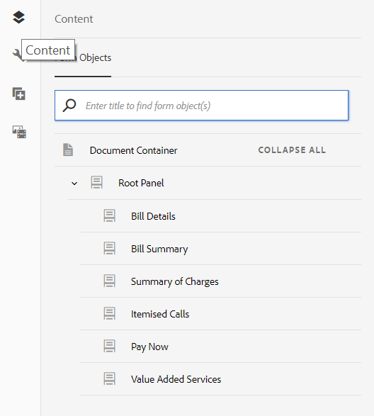
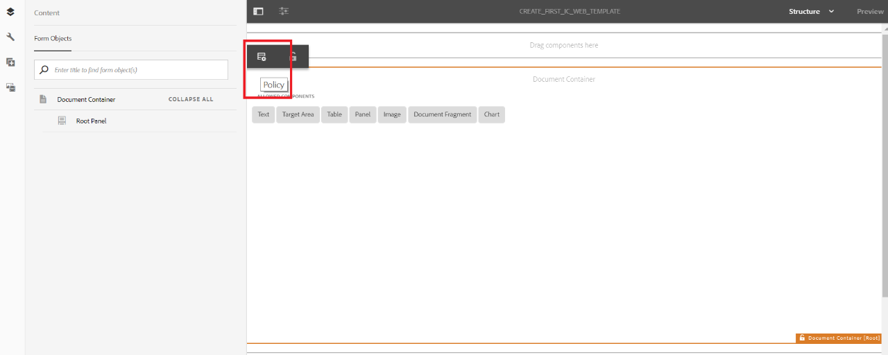
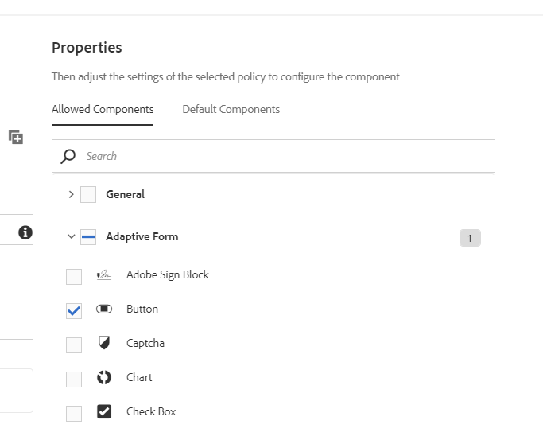

# Esercitazione: Crea modelli{#tutorial-create-templates}

Questa esercitazione è un passaggio della serie [Crea la tua prima comunicazione interattiva](/help/forms/using/create-your-first-interactive-communication.md). Si consiglia di seguire la serie in sequenza cronologica per comprendere, eseguire e illustrare il caso d’uso completo dell’esercitazione.

Per creare una comunicazione interattiva, è necessario disporre di modelli disponibili sul server AEM per i canali Stampa e Web.

I modelli per il canale Stampa vengono creati in Adobe Forms Designer e caricati sul server AEM. Questi modelli sono quindi disponibili per l’utilizzo durante la creazione di una comunicazione interattiva.

I modelli per il canale Web vengono creati in AEM. Gli autori e gli amministratori dei modelli possono creare, modificare e abilitare i modelli web. Una volta creati e abilitati, questi modelli sono disponibili per l’utilizzo durante la creazione di una comunicazione interattiva.

Questa esercitazione illustra i passaggi necessari per creare modelli per i canali Stampa e Web in modo che siano disponibili per l&#39;utilizzo durante la creazione di comunicazioni interattive. Al termine di questa esercitazione, potrai:

* Creare modelli XDP per il canale di stampa utilizzando Adobe Forms Designer
* Caricare i modelli XDP sul server AEM Forms
* Creare e abilitare modelli per il canale Web

## Crea modello per il canale di stampa {#create-template-for-print-channel}

Crea e gestisci modelli per il canale Stampa di Comunicazione interattiva utilizzando le seguenti attività:

* [Creare un modello XDP utilizzando Forms Designer](../../forms/using/create-templates-print-web.md#create-xdp-template-using-forms-designer)
* [Carica il modello XDP sul server AEM Forms](../../forms/using/create-templates-print-web.md#upload-xdp-template-to-the-aem-forms-server)
* [Creare un modello XDP per i frammenti di layout](../../forms/using/create-templates-print-web.md#create-xdp-template-for-layout-fragments)

### Creare un modello XDP utilizzando Forms Designer {#create-xdp-template-using-forms-designer}

In base al [caso d’uso](/help/forms/using/create-your-first-interactive-communication.md) e [anatomia](/help/forms/using/planning-interactive-communications.md), crea i seguenti sottomoduli nel modello XDP:

* Dettagli fattura: Include un frammento di documento
* Dettagli cliente: Include un frammento di documento
* Riepilogo fattura: Include un frammento di documento
* Riepilogo: Include un frammento di documento (sottomodulo Carica) e un grafico (sottomodulo Grafici)
* Chiamate dettagliate: Include una tabella (frammento di layout)
* Paga ora: Include un&#39;immagine
* Servizi a valore aggiunto: Include un&#39;immagine

Questi sottomoduli vengono visualizzati come aree di destinazione nel modello Stampa dopo il caricamento del file XDP sul server Forms. Durante la creazione della comunicazione interattiva, tutte le entità quali frammenti di documento, grafici, frammenti di layout e immagini vengono aggiunte alle aree di destinazione.

Esegui i seguenti passaggi per creare un modello XDP per il canale Stampa:

1. Apri Forms Designer, seleziona **File** > **Nuovo** > **Utilizza un modulo vuoto,** tocca **Avanti**, quindi tocca **Fine** per aprire il modulo per la creazione del modello.

   Assicurati che le opzioni **Libreria oggetto** e **Oggetto** siano selezionate dal menu **Finestra**.

1. Trascina il componente **Sottomodulo** dalla **Libreria oggetto** al modulo.
1. Selezionare il sottomodulo per visualizzare le opzioni del sottomodulo nella finestra **Oggetto** del riquadro di destra.
1. Selezionare la scheda **Sottomodulo** e selezionare **Flusso** dall&#39;elenco a discesa **Contenuto**. Trascinare l’endpoint sinistro del sottomodulo per regolare la lunghezza.
1. Nella scheda **Binding** :

   1. Specificare **DettagliBill** nel campo **Nome**.

   1. Selezionare **Nessun binding di dati** dall&#39;elenco a discesa **Binding dei dati**.

   

1. Allo stesso modo, selezionare il sottomodulo principale, selezionare la scheda **Sottomodulo** e selezionare **Flusso** dall&#39;elenco a discesa **Contenuto**. Nella scheda **Binding** :

   1. Specificare **TelecaBill** nel campo **Nome**.

   1. Selezionare **Nessun binding di dati** dall&#39;elenco a discesa **Binding dei dati**.

   

1. Ripetere i passaggi da 2 a 5 per creare i sottomoduli seguenti:

   * DettagliFattura
   * DettagliCliente
   * RiepilogoFatturazione
   * Riepilogo: seleziona la scheda **Sottomodulo** e seleziona **Posizionato** dall’elenco a discesa **Contenuto** del sottomodulo. Inserire i sottomoduli seguenti nel sottomodulo **Riepilogo**.

      * Oneri
      * Grafici
   * Chiamate dettagliate
   * PayNow
   * ValueAddedServices

   Per risparmiare tempo, è inoltre possibile copiare e incollare i sottomoduli esistenti per creare nuovi sottomoduli.

   Per spostare il sottomodulo **Grafici** a destra del sottomodulo Carica, selezionare il sottomodulo **Grafici** dal riquadro a sinistra, selezionare la scheda **Layout** e specificare un valore per il campo **AncoraggioX**. Il valore deve essere maggiore del valore del campo **Larghezza** del sottomodulo **Carica**. Selezionare il sottomodulo **Carica** e selezionare la scheda **Layout** per visualizzare il valore del campo **Larghezza**.

1. Trascinare l&#39;oggetto **Testo** dalla **Libreria oggetto** al modulo e immettere il testo **Dial XXXX per sottoscrivere** nella casella.
1. Fare clic con il pulsante destro del mouse sull&#39;oggetto testo nel riquadro a sinistra, selezionare **Rinomina oggetto** e immettere il nome dell&#39;oggetto testo come **Sottoscrivi**.

   

1. Selezionare **File** > **Salva con nome** per salvare il file sul file system locale:

   1. Passa alla posizione in cui salvare il file e specifica il nome come **create_first_ic_print_template**.
   1. Seleziona **.xdp** dall&#39;elenco a discesa **Salva come**.

   1. Tocca **Salva**.

### Carica il modello XDP sul server AEM Forms {#upload-xdp-template-to-the-aem-forms-server}

Dopo aver creato un modello XDP utilizzando Forms Designer, è necessario caricarlo sul server AEM Forms in modo che sia disponibile per l’utilizzo durante la creazione della comunicazione interattiva.

1. Seleziona **[!UICONTROL Forms]** > **[!UICONTROL Forms &amp; Documents]**.
1. Tocca **Crea** > **Caricamento file**.

   Passa al modello **create_first_ic_print_template** (XDP) e tocca **Apri** per importare il modello XDP nel server AEM Forms.

### Creare un modello XDP per frammenti di layout {#create-xdp-template-for-layout-fragments}

Per creare un frammento di layout per il canale Stampa della comunicazione interattiva, crea un file XDP utilizzando Forms Designer e caricalo sul server AEM Forms.

1. Apri Forms Designer, seleziona **File** > **Nuovo** > **Utilizza un modulo vuoto,** tocca **Avanti**, quindi tocca **Fine** per aprire il modulo per la creazione del modello.

   Assicurati che le opzioni **Libreria oggetto** e **Oggetto** siano selezionate dal menu **Finestra**.

1. Trascina il componente **Tabella** dalla **Libreria oggetto** al modulo.
1. Nella finestra di dialogo Inserisci tabella:

   1. Specifica il numero di colonne come **5**.
   1. Specifica il numero di righe corpo come **1**.
   1. Selezionare la casella di controllo **Includi riga di intestazione nella tabella**.
   1. Tab **OK**.

1. Tocca **+** nel riquadro a sinistra accanto a **Tabella** 1 e fai clic con il pulsante destro del mouse su **Cella1** e seleziona **Rinomina oggetto** in **Data**.

   Allo stesso modo, rinomina **Cell2**, **Cell3**, **Cell4** e **Cell5** a **Time**, **Number**, **Durata&lt;a1 3/> e** Carica **rispettivamente.**

1. Fare clic sui campi di testo Intestazione in **Visualizzazione Designer** e rinominarli in **Tempo**, **Numero**, **Durata** e **Caricamenti**.

   

1. Selezionare **Riga 1** dal riquadro a sinistra e selezionare **Oggetto** > **Binding** > **Ripeti riga per ogni elemento dati**.

   

1. Trascina il componente **Campo di testo** dalla **Libreria oggetto** alla **visualizzazione Designer**.

   

   Allo stesso modo, trascinate il componente **Campo di testo** nelle righe **Time**, **Number**, **Duration** e **Carica**.

1. Selezionare **File** > **Salva con nome** per salvare il file sul file system locale:

   1. Passa alla posizione in cui salvare il file e specifica il nome come **table_lf**.
   1. Seleziona **.xdp** dall&#39;elenco a discesa **Salva come**.

   1. Tocca **Salva**.
   Dopo aver creato un modello XDP per il frammento di layout utilizzando Forms Designer, è necessario [caricarlo](../../forms/using/create-templates-print-web.md#upload-xdp-template-to-the-aem-forms-server) sul server AEM Forms in modo che il modello sia disponibile per l’uso durante la creazione dei frammenti di layout.

## Crea modello per il canale web {#create-template-for-web-channel}

Crea e gestisci un modello per il canale Web della comunicazione interattiva utilizzando le seguenti attività:

* [Crea cartella per i modelli](../../forms/using/create-templates-print-web.md#create-folder-for-templates)
* [Creare il modello](../../forms/using/create-templates-print-web.md#create-the-template)
* [Attiva il modello](../../forms/using/create-templates-print-web.md#enable-the-template)
* [Abilitazione dei pulsanti nelle comunicazioni interattive](../../forms/using/create-templates-print-web.md#enabling-buttons-in-interactive-communications)

### Crea cartella per i modelli {#create-folder-for-templates}

Per creare un modello di canale Web, definisci una cartella in cui salvare i modelli creati. Dopo aver creato un modello all’interno della cartella, abilitare il modello per consentire agli utenti dei moduli di creare un canale Web di una comunicazione interattiva basata sul modello.

Esegui i seguenti passaggi per creare una cartella per i modelli modificabili:

1. Toccare **Strumenti**  > **Browser di configurazione**.
   * Per ulteriori informazioni, consulta la documentazione [Browser configurazioni](/help/sites-administering/configurations.md) .
1. Nella pagina Browser configurazioni, tocca **Crea**.
1. Nella finestra di dialogo **Crea configurazione**, specifica **Crea_Primo_IC_templates** come titolo per la cartella, seleziona **Modelli modificabili** e tocca **Crea**.

   

   La cartella **Create_First_IC_templates** viene creata ed elencata nella pagina **Browser di configurazione**.

### Crea il modello {#create-the-template}

In base al [caso d&#39;uso](/help/forms/using/create-your-first-interactive-communication.md) e [anatomia](/help/forms/using/planning-interactive-communications.md), crea i seguenti pannelli nel modello Web:

* Dettagli fattura: Include un frammento di documento
* Dettagli cliente: Include un frammento di documento
* Riepilogo fattura: Include un frammento di documento
* Sintesi delle tariffe: Include un frammento di documento e un grafico (layout a due colonne)
* Chiamate dettagliate: Include una tabella
* Paga ora: Include un pulsante **Paga ora** e un&#39;immagine
* Servizi a valore aggiunto: Include un&#39;immagine e un pulsante **Sottoscrivi**.

Durante la creazione della comunicazione interattiva vengono aggiunte tutte le entità quali frammenti di documento, grafici, tabelle, immagini e pulsanti.

Esegui i seguenti passaggi per creare un modello per il canale Web nella cartella **Create_First_IC_templates** :

1. Passa alla cartella del modello appropriata selezionando la cartella **Strumenti** > **Modelli** > **Crea_Primo_IC_templates** .
1. Tocca **Crea**.
1. Nella procedura guidata di configurazione **Scegli un tipo di modello**, seleziona **Comunicazione interattiva - Canale web** e tocca **Avanti**.
1. Nella procedura guidata di configurazione **Dettagli modello**, specifica **Create_First_IC_Web_Template** come titolo del modello. Specifica una descrizione facoltativa e tocca **Crea**.

   Viene visualizzato un messaggio di conferma della visualizzazione di **Create_First_IC_Web_Template**.

1. Tocca **Apri** per aprire il modello nell’editor modelli.
1. Seleziona **Contenuto iniziale** dall&#39;elenco a discesa accanto all&#39;opzione **Anteprima**.

   

1. Tocca **Pannello principale**, quindi tocca **+** per visualizzare l’elenco dei componenti che puoi aggiungere al modello.
1. Seleziona **Pannello** dall&#39;elenco per aggiungere un pannello sopra il **pannello principale**.
1. Seleziona la scheda **Contenuto** nel riquadro a sinistra. Il nuovo pannello aggiunto al passaggio 8 viene visualizzato sotto il **pannello principale** nella struttura del contenuto.

   

1. Seleziona il pannello e tocca  (Configura).
1. Nel riquadro Proprietà :

   1. Specificare **billdetails** nel campo Nome.
   1. Specificare **Dettagli fattura** nel campo Titolo.
   1. Selezionare **1** dall&#39;elenco a discesa **Numero di colonne**.

   1. Tocca  per salvare le proprietà.

   Il nome del pannello viene aggiornato in **Dettagli fatturazione** nella struttura del contenuto.

1. Ripeti i passaggi da 7 a 11 per aggiungere al modello pannelli con le seguenti proprietà:

   | Nome | Titolo | Numero di colonne |
   |---|---|---|
   | dettagli cliente | Dettagli cliente | 1 |
   | billsummary | Riepilogo fatturazione | 3 |
   | riepiloghi | Sintesi dei costi | 2 |
   | itemisedcall | Chiamate dettagliate | 3 |
   | paga | Paga ora | 2 |
   | vas | Servizi a valore aggiunto | 3 |

   L’immagine seguente rappresenta la struttura del contenuto dopo l’aggiunta di tutti i pannelli al modello:

   

### Attiva il modello {#enable-the-template}

Dopo aver creato il modello Web, è necessario attivarlo per utilizzare il modello durante la creazione della comunicazione interattiva.

Esegui i seguenti passaggi per abilitare il modello Web:

1. Tocca **Strumenti**  > **Modelli**.
1. Passa al modello **Create_First_IC_Web_Template**, selezionalo e tocca **Abilita**.
1. Tab **Abilita** di nuovo per confermare.

   Il modello è abilitato e il suo stato viene visualizzato come Abilitato. È possibile utilizzare questo modello durante la creazione di comunicazioni interattive per il canale Web.

### Abilitazione dei pulsanti nelle comunicazioni interattive {#enabling-buttons-in-interactive-communications}

In base al caso d’uso, è necessario includere i pulsanti **Paga ora** e **Sottoscrivi** (componenti di moduli adattivi) nella comunicazione interattiva. Per abilitare l’utilizzo di questi pulsanti nella comunicazione interattiva, esegui i seguenti passaggi:

1. Seleziona **Struttura** dall&#39;elenco a discesa accanto all&#39;opzione **Anteprima**.
1. Seleziona il pannello principale **Contenitore documento** utilizzando la struttura del contenuto e tocca **Criterio** per selezionare i componenti consentiti per la comunicazione interattiva.

   

1. Nella scheda **Componenti consentiti** della sezione **Proprietà** , seleziona **Pulsante** dai componenti **Modulo adattivo**.

   

1. Tocca  per salvare le proprietà.