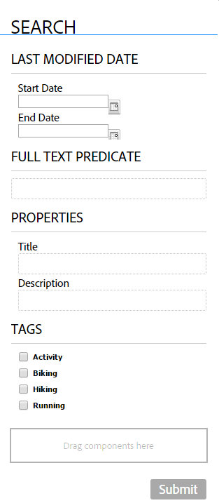

# Creazione di una pagina del portale dei moduli{#creating-a-forms-portal-page}

I componenti del portale Forms forniscono agli sviluppatori web componenti che consentono di creare e personalizzare un portale moduli sui siti web creati con Adobe Experience Manager (AEM). Per una panoramica rapida del portale dei moduli, vedere [Introduzione alla pubblicazione dei moduli su un portale](../../forms/using/introduction-publishing-forms.md).

## Prerequisiti {#prerequisites}

I componenti del portale Forms non sono disponibili per l&#39;uso predefinito. Assicurati che le seguenti categorie di componenti del portale moduli siano abilitate come descritto in [Abilitazione dei componenti del portale moduli](/help/forms/using/enabling-forms-portal-components.md).

**Document** ServicesInclude i componenti Search&amp;Lister, Link, Bozze e Invii.

**Predicati di Document ServicesInclude** i componenti Predicato data, Predicato testo completo, Predicato proprietà e Predicato tag. Questi componenti vengono utilizzati per configurare la ricerca nel componente Ricerca e filtro .

Una volta abilitate in una pagina AEM siti, queste categorie di componenti sono disponibili per l’uso nel browser componenti.

Categorie di componenti del portale Forms

## Componente Search&amp;Lister {#search-amp-lister-component}

Il componente Ricerca e filtro, disponibile nella categoria del componente Servizi documenti, viene utilizzato per elencare i moduli su una pagina e per implementare la ricerca sui moduli elencati. Il componente include due riquadri:

* Riquadro elenco in cui sono elencati i moduli.
* Riquadro di ricerca in cui aggiungere la funzionalità di ricerca.

Puoi trascinare il componente Ricerca e filtro dalla categoria di componenti Servizi documenti nel browser Componenti sulla pagina. Il componente, una volta aggiunto, ha un aspetto simile al seguente.

Componente Search&amp;Lister in una pagina con layout Griglia

### Riquadro elenco {#list-pane}

Il riquadro Elenco è un’area in cui sono elencati i moduli. Il componente Ricerca e filtro offre diverse opzioni di configurazione che è possibile utilizzare per controllare la visualizzazione dei moduli nel riquadro Elenco.

Per configurare il riquadro Elenco, tocca il componente Ricerca e filtro , quindi tocca . Viene visualizzata la finestra di dialogo **[!UICONTROL Modifica componente]** .

Riquadro elenco in modalità di modifica

La finestra di dialogo **Modifica** include diverse schede che forniscono le opzioni di configurazione descritte nella tabella seguente. Al termine, tocca **OK** per salvare la configurazione.

<table>
 <tbody>
  <tr>
   <th>Scheda</th>
   <th>Configurazione</th>
   <th>Descrizione</th>
  </tr>
  <tr>
   <td><strong>Cartelle risorse</strong></code></td>
   <td>Aggiungi elemento</td>
   <td>Configura le cartelle in cui le risorse vengono caricate tramite l’interfaccia utente di AEM Forms. Per impostazione predefinita, elenca tutte le risorse caricate. Per ulteriori informazioni sull’interfaccia utente di AEM Forms, consulta <a href="../../forms/using/introduction-managing-forms.md" target="_blank">Introduzione alla gestione dei moduli</a>.</td>
  </tr>
  <tr>
   <td>
<strong>Visualizzazione</strong></code>
 </td>
   <td>Testo titolo</td>
   <td>Titolo del componente Ricerca e filtro . Il titolo predefinito è <strong>Forms Portal.</strong></td>
  </tr>
  <tr>
   <td> </td>
   <td>Modello di layout</td>
   <td>Layout delle risorse. </td>
  </tr>
  <tr>
   <td> </td>
   <td>Disattiva ricerca avanzata</td>
   <td>Quando questa opzione è attivata, nasconde l’icona di ricerca avanzata.</td>
  </tr>
  <tr>
   <td> </td>
   <td>Disattiva ricerca testo</td>
   <td>Quando questa opzione è attivata, nasconde la barra di ricerca full-text.</td>
  </tr>
  <tr>
   <td><strong>Risultato</strong></code></td>
   <td>Numero di risultati per pagina</td>
   <td>Configura il numero massimo di moduli da visualizzare su una pagina.</td>
  </tr>
  <tr>
   <td> </td>
   <td>Testo risultati</td>
   <td>
Configura il testo dei risultati (ad esempio, 1-12 di 601 <strong>Risultati</strong>). Il valore predefinito è <strong>Risultati</strong>.
 
Ad esempio, se in questo campo si specifica <strong>Forms </strong>e sono presenti in totale 601 moduli, il testo del risultato verrà modificato in 1-12 di 601 <strong>Forms.</strong>
 </td>
  </tr>
  <tr>
   <td> </td>
   <td>Testo pagina</td>
   <td>
Configura il testo della pagina (ad esempio, <strong>Pagina </strong>1 di 51). Il valore predefinito è <strong>Page</strong>.
 
Ad esempio, se in questo campo si specifica <strong>Modulo applicazione </strong>e sono presenti 51 pagine, il testo della pagina viene modificato in <strong>Modulo applicazione </strong>1 di 51.
 </td>
  </tr>
  <tr>
   <td> </td>
   <td>Di testo</td>
   <td>
Sostituisce la parola <strong>di</strong> con il testo specificato (Pagina 1 <strong>di </strong>51). Il valore predefinito è <strong>di</strong>.
 
Ad esempio, se si specifica <strong>out of </strong>in questo campo, il testo diventa Pagina 1 <strong>fuori da </strong>51.
 </td>
  </tr>
  <tr>
   <td><strong>Collegamento modulo</strong></code></td>
   <td>Tipo di rendering</td>
   <td>Controlla l’elenco dei moduli in base al tipo di rendering specificato. Le opzioni disponibili sono PDF e HTML. Ad esempio, se selezioni solo HTML come tipo di rendering, i PDF forms vengono filtrati.</td>
  </tr>
  <tr>
   <td> </td>
   <td>Profilo HTML</td>
   <td>Configura il profilo HTML da utilizzare per il rendering. Tutti i profili disponibili sono elencati nell’elenco a discesa.</td>
  </tr>
  <tr>
   <td> </td>
   <td>Invia URL</td>
   <td>
Configura un servlet in cui vengono inviati i dati del modulo.
 
<strong>Nota:</strong> <em>è possibile specificare l’URL di invio di un modulo in più posizioni e il relativo ordine di precedenza è il seguente:</em>

    <ol>
     <li><em>L’URL di invio incorporato nel modulo (nel pulsante Invia) ha la priorità più alta.</em></li>
     <li><em>L’URL di invio menzionato nell’interfaccia utente di AEM Forms ha la seconda priorità più alta.</em></li>
     <li><em>L’URL di invio menzionato nel portale dei moduli ha la priorità più bassa.</em></li>
    </ol> </td>
  </tr>
  <tr>
   <td> </td>
   <td>Suggerimento per l'azione di rendering HTML</td>
   <td>Configura il testo per la descrizione comando, che viene visualizzata quando si passa il puntatore del mouse su  (icona HTML5).</td>
  </tr>
  <tr>
   <td> </td>
   <td>Suggerimento per l’azione di rendering PDF</td>
   <td>Configura il testo per la descrizione comandi, visualizzata quando si passa il puntatore del mouse su  (icona PDF).</td>
  </tr>
  <tr>
   <td><strong>Stile</strong></code></td>
   <td>Tipo di stile</td>
   <td>Consente di specificare <strong>Nessuno stile, Stile predefinito</strong> o <strong>Stile personalizzato </strong>per elencare i moduli.</td>
  </tr>
  <tr>
   <td> </td>
   <td>Percorso stile personalizzato</td>
   <td>Se hai selezionato Personalizzato come Tipo di stile, cerca per specificare il percorso del CSS personalizzato, altrimenti seleziona Predefinito.</td>
  </tr>
 </tbody>
</table>

### Riquadro di ricerca {#search-pane}

Il riquadro Ricerca consente di aggiungere i componenti Predicato data, Predicato testo completo, Predicato proprietà e Predicato tag dalla categoria Predicati di Document Services nella barra laterale AEM. Questi componenti implementano la funzionalità di ricerca che consente agli utenti di eseguire ricerche nei moduli elencati.

**Suggerimento:** *puoi controllare l’elenco dei moduli visualizzati sul portale dei moduli in base a criteri preimpostati e nascondere la funzionalità di ricerca per gli utenti finali. Per controllare l’elenco dei moduli, utilizzare i componenti Predicate per applicare i filtri di ricerca. È inoltre possibile specificare i valori di filtro predefiniti e disattivare la ricerca nella scheda Visualizzazione della finestra di dialogo Modifica componente.*

Pannello di ricerca con predicato data, testo completo, proprietà e tag

#### Predicato data {#date-predicate}

Il componente Date Predicate, quando viene aggiunto, consente di eseguire ricerche nei moduli elencati modificati durante un determinato periodo di tempo.

Per configurare il componente Predicato data :

1. Tocca il componente, quindi tocca . Viene visualizzata la finestra di dialogo Modifica.
1. Specifica quanto segue:

   * **Tipo:** L’unica opzione disponibile è Data  **ultima modifica**

   * **Testo:** etichetta o didascalia per il componente Date Predicate. Il valore predefinito è **Data ultima modifica.**

   * **Etichetta data inizio:** Etichetta o didascalia del campo data iniziale
   * **Etichetta data fine:** etichetta o didascalia per il campo data di fine
   * **Nascondi:** per applicare il filtro data predefinito all’elenco dei moduli

1. Tocca **OK**

#### Predicato full-text {#full-text-predicate}

Il componente Predicato full-text implementa la ricerca full-text sui dati del modulo, ad esempio nome e descrizione. Gli utenti possono cercare qualsiasi stringa di testo per restituire i moduli contenenti il testo nel nome o nella descrizione.

Per configurare il componente Predicato a testo completo:

1. Tocca il componente, quindi tocca . Viene visualizzata la finestra di dialogo Modifica.
1. Specifica il titolo nel campo **Titolo principale** .
1. Tocca **Ok**

#### Predicato proprietà {#properties-predicate}

Il componente Predicato proprietà implementa la ricerca di moduli in base alle proprietà del modulo, ad esempio titolo, autore e descrizione.

Per configurare il componente Predicato proprietà:

1. Tocca il componente, quindi tocca . Viene visualizzata la finestra di dialogo Modifica.
1. Nella scheda Generale , specifica l’etichetta di ricerca. Il valore predefinito è **Proprietà**

1. Nella scheda Opzioni, tocca **Aggiungi elemento.**
1. Seleziona una proprietà dall’elenco a discesa e specifica un’etichetta di ricerca nel campo sotto l’elenco a discesa.
1. Ripetere il passaggio 4 per aggiungere altre proprietà. È inoltre possibile specificare un valore di filtro predefinito per elencare i moduli in base ai criteri specificati e nascondere la proprietà di ricerca per gli utenti finali. Selezionare la casella di controllo Nascondi per una proprietà e specificare il valore del filtro predefinito.
Ad esempio, se si desidera visualizzare i moduli contenenti &quot;Viaggio&quot; nei relativi titoli, selezionare Nascondi accanto alla proprietà Titolo. Inoltre, specifica la casella di testo Viaggi nel valore di filtro predefinito.

1. Tocca **OK**

#### Predicato tag {#tags-predicate}

Il componente Predicato tag implementa la ricerca di moduli in base ai tag definiti in Forms Manager.

Per configurare il componente Predicato tag :

1. Tocca il componente, quindi tocca . Viene visualizzata la finestra di dialogo Modifica.
1. Tocca il pulsante freccia giù accanto al campo Tag .
1. Selezionare i tag appropriati
1. Tocca **OK**

I tag selezionati vengono visualizzati nel riquadro Ricerca insieme alle caselle di controllo per la selezione. Gli utenti possono ora limitare la ricerca in base ai tag .

## Elencare moduli in una pagina {#list-forms-on-a-page-br}

Per elencare i moduli su una pagina, aggiungi il componente **[!UICONTROL Ricerca e filtro]** alla pagina e configura il **[!UICONTROL Riquadro di elenco]**. Per consentire agli utenti finali di eseguire ricerche nei moduli con data, testo e tag, aggiungere un componente **[!UICONTROL Riquadro di ricerca]**.

Per collegare un modulo da un punto qualsiasi della pagina, utilizza il componente Collegamento . Per ulteriori informazioni sul componente collegamento, consulta [Incorporare un componente collegamento in una pagina](../../forms/using/embedding-link-component-page.md).

Per elencare i moduli in stato di bozza e quelli già inviati, utilizza il componente **[!UICONTROL Bozze e invii]** . Per ulteriori informazioni, consulta [Personalizzazione del componente Bozze e invii](../../forms/using/draft-submission-component.md).

## Facilità di utilizzo dei dispositivi mobili {#mobile-device-friendliness}

Il componente Ricerca e filtro di Forms Portal è compatibile con i dispositivi mobili e si adatta di conseguenza. Tutte e tre le viste predefinite: Griglia, scheda, Pannello relayout in base al dispositivo in cui il sito viene aperto, purché anche la pagina web si adatti. Il fatto semplice è che Search &amp; Lister è solo un componente e non regola lo stile a livello di pagina.

L’immagine seguente rappresenta il componente Ricerca e filtro quando viene aperto su un dispositivo mobile:

Componente Ricerca e filtro

## Personalizzazione di una pagina del portale dei moduli {#customizing-a-forms-portal-page-br}

È possibile personalizzare una pagina del portale dei moduli in modo da fornire un aspetto distinto alla pagina. Puoi anche aggiungere metadati per migliorare l’esperienza di ricerca, modificare il layout della pagina e aggiungere stili CSS personalizzati. Per ulteriori informazioni, consulta [Personalizzazione dei modelli per i componenti del portale Forms](../../forms/using/customizing-templates-forms-portal-components.md).

L’interfaccia utente di AEM Forms consente di aggiungere metadati personalizzati ai moduli. I metadati personalizzati sono utili per fornire agli utenti finali un’esperienza di elenco e ricerca dei moduli. Per ulteriori informazioni sui metadati personalizzati, consulta [Personalizzazione dei modelli per i componenti del portale Forms](../../forms/using/customizing-templates-forms-portal-components.md).

Con il portale dei moduli sono disponibili azioni di rendering. È possibile personalizzare il portale dei moduli per aggiungere altre azioni. Per informazioni dettagliate, vedere [Aggiunta di azioni personalizzate agli elementi dell&#39;elenco dei moduli.](../../forms/using/add-custom-action-form-lister.md)

## Articoli correlati

* [Abilitare i componenti del portale moduli](/help/forms/using/enabling-forms-portal-components.md)
* [Pagina del portale dei moduli](/help/forms/using/creating-form-portal-page.md)
* [Elencare moduli in una pagina web utilizzando le API](/help/forms/using/listing-forms-webpage-using-apis.md)
* [Usa componente Bozze e invii](/help/forms/using/draft-submission-component.md)
* [Personalizzare l’archiviazione delle bozze e dei moduli inviati](/help/forms/using/draft-submission-component.md)
* [Esempio per l&#39;integrazione del componente bozze e invii con il database](/help/forms/using/integrate-draft-submission-database.md)
* [Personalizzazione dei modelli per i componenti del portale dei moduli](/help/forms/using/customizing-templates-forms-portal-components.md)
* [Introduzione alla pubblicazione di moduli su un portale](/help/forms/using/introduction-publishing-forms.md)
