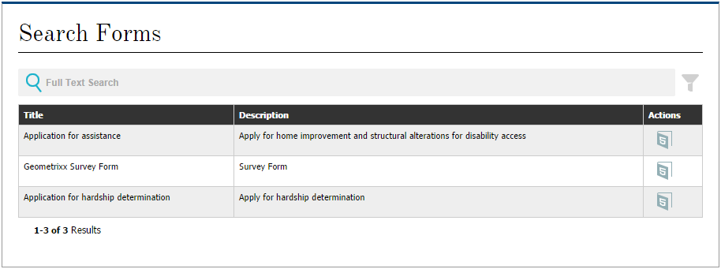

# Creazione di una pagina del portale dei moduli{#creating-a-forms-portal-page}

I componenti del portale Forms forniscono agli sviluppatori Web componenti per creare e personalizzare un portale moduli sui siti Web creati con Adobe Experience Manager (AEM). Per una panoramica rapida del portale dei moduli, vedere [Introduzione alla pubblicazione di moduli su un portale](../../forms/using/introduction-publishing-forms.md).

## Prerequisiti {#prerequisites}

Per impostazione predefinita, i componenti del portale Forms non sono disponibili per l&#39;uso. Assicurarsi che le seguenti categorie di componenti del portale moduli siano abilitate come descritto in [Abilitazione di componenti del portale moduli](/help/forms/using/enabling-forms-portal-components.md).

**Document** ServicesInclude componenti di ricerca e archiviazione, collegamenti e bozze e invii.

**Predicati di Document ServicesInclude** i componenti Predicato data, Predicato testo completo, Predicato proprietà e Predicato tag. Questi componenti sono utilizzati per configurare la ricerca nel componente Ricerca e filtro.

Una volta abilitati in una pagina AEM siti, queste categorie di componenti sono disponibili per l’uso nel browser Componenti.

Categorie di componenti di Forms Portal

## Componente Search &amp; Lister {#search-amp-lister-component}

Il componente Cerca e elenca, disponibile nella categoria di componenti Document Services, consente di elencare i moduli su una pagina e di implementare la ricerca nei moduli elencati. Il componente include due riquadri:

* Riquadro elenco in cui sono elencati i moduli.
* Riquadro di ricerca in cui si aggiunge la funzionalità di ricerca.

È possibile trascinare il componente Ricerca e filtro dalla categoria di componenti Document Services nel browser Componenti sulla pagina. Il componente, se aggiunto, è simile al seguente.

Componente Ricerca e filtro in una pagina con layout Griglia

### Riquadro elenco {#list-pane}

Il riquadro Elenco è un&#39;area in cui sono elencati i moduli. Il componente Ricerca e filtro offre diverse opzioni di configurazione che è possibile utilizzare per controllare la visualizzazione dei moduli nel riquadro Elenco.

Per configurare il riquadro Elenco, toccate il componente Cerca e Archivia, quindi toccate . Viene visualizzata la finestra di dialogo **[!UICONTROL Edit Component]** (Modifica componente).

Riquadro elenco in modalità di modifica

La finestra di dialogo **Edit** include diverse schede che forniscono le opzioni di configurazione descritte nella tabella seguente. Al termine, toccare **OK** per salvare la configurazione.

<table>
 <tbody>
  <tr>
   <th>Scheda</th>
   <th>Configurazione</th>
   <th>Descrizione</th>
  </tr>
  <tr>
   <td><strong>Cartelle risorse</strong></code></td>
   <td>Aggiungi elemento</td>
   <td>Configura le cartelle in cui vengono caricate le risorse tramite ’interfaccia utente di AEM Forms. Per impostazione predefinita, elenca tutte le risorse caricate. Per ulteriori informazioni 'interfaccia utente di AEM Forms, vedere <a href="../../forms/using/introduction-managing-forms.md" target="_blank">Introduzione alla gestione dei moduli</a>.</td>
  </tr>
  <tr>
   <td>
<strong>Visualizzazione</strong></code>
 </td>
   <td>Testo titolo</td>
   <td>Titolo del componente Ricerca e filtro. Il titolo predefinito è <strong>Forms Portal.</strong></td>
  </tr>
  <tr>
   <td> </td>
   <td>Modello di layout</td>
   <td>Layout delle risorse. </td>
  </tr>
  <tr>
   <td> </td>
   <td>Disattiva ricerca avanzata</td>
   <td>Quando abilitata, nasconde l'icona di ricerca avanzata.</td>
  </tr>
  <tr>
   <td> </td>
   <td>Disattiva ricerca testo</td>
   <td>Quando questa opzione è attivata, nasconde la barra di ricerca full-text.</td>
  </tr>
  <tr>
   <td><strong>Risultato</strong></code></td>
   <td>Numero Di Risultati Per Pagina</td>
   <td>Configura il numero massimo di moduli da visualizzare su una pagina.</td>
  </tr>
  <tr>
   <td> </td>
   <td>Testo risultati</td>
   <td>
Configura il testo dei risultati (ad esempio, 1-12 di 601 <strong>Results</strong>). Il valore predefinito è <strong>Results</strong>.
 
Ad esempio, se si specifica <strong>Forms </strong>in questo campo e sono presenti in totale 601 moduli, il testo del risultato cambia in 1-12 di 601 <strong>Forms.</strong>
 </td>
  </tr>
  <tr>
   <td> </td>
   <td>Testo pagina</td>
   <td>
Configura il testo della pagina (ad esempio, <strong>Pagina </strong>1 di 51). Il valore predefinito è <strong>Page</strong>.
 
Ad esempio, se in questo campo si specifica <strong>Modulo applicazione </strong>e sono presenti 51 pagine, il testo della pagina diventa <strong>Modulo applicazione </strong>1 di 51.
 </td>
  </tr>
  <tr>
   <td> </td>
   <td>Di testo</td>
   <td>
Sostituisce la parola <strong>di</strong> con il testo specificato (Pagina 1 <strong>di </strong>51). Il valore predefinito è <strong>di</strong>.
 
Ad esempio, se si specifica <strong>out di </strong>in questo campo, il testo cambia in Pagina 1 <strong>di </strong>51.
 </td>
  </tr>
  <tr>
   <td><strong>Collegamento modulo</strong></code></td>
   <td>Tipo di rendering</td>
   <td>Controlla l'elenco dei moduli in base al tipo di rendering specificato. Le opzioni disponibili sono PDF e HTML. Ad esempio, se selezionate solo HTML come tipo di rendering, gli PDF forms vengono filtrati.</td>
  </tr>
  <tr>
   <td> </td>
   <td>Profilo HTML</td>
   <td>Configura il profilo HTML da utilizzare per il rendering. Tutti i profili disponibili sono elencati nell'elenco a discesa.</td>
  </tr>
  <tr>
   <td> </td>
   <td>Invia URL</td>
   <td>
Configura un servlet in cui vengono inviati i dati del modulo.
 
<strong>Nota:è possibile specificare l'URL di </strong> <em>invio di un modulo in più punti e il relativo ordine di precedenza è il seguente:</em>

    <ol>
     <li><em>L'URL di invio incorporato nel modulo (nel pulsante Invia) ha la priorità più alta.</em></li>
     <li><em>L’URL di invio menzionato ’interfaccia utente di AEM Forms ha la seconda priorità.</em></li>
     <li><em>L'URL di invio indicato nel portale dei moduli ha la priorità più bassa.</em></li>
    </ol> </td>
  </tr>
  <tr>
   <td> </td>
   <td>Descrizione comandi per le azioni di rendering HTML</td>
   <td>Configura il testo della descrizione comandi, che viene visualizzata quando si passa il puntatore su  (l'icona HTML5).</td>
  </tr>
  <tr>
   <td> </td>
   <td>Descrizione comandi per le azioni di rendering PDF</td>
   <td>Configura il testo della descrizione comandi, visualizzata quando si passa il puntatore su  (l'icona PDF).</td>
  </tr>
  <tr>
   <td><strong>Stile</strong></code></td>
   <td>Tipo di stile</td>
   <td>Consente di specificare <strong>Nessuno stile, Stile predefinito</strong> o <strong>Stile personalizzato </strong>per elencare i moduli.</td>
  </tr>
  <tr>
   <td> </td>
   <td>Percorso stile personalizzato</td>
   <td>Se avete selezionato Personalizzato come Tipo di stile, individuate e specificate il percorso del CSS personalizzato, altrimenti selezionate Predefinito.</td>
  </tr>
 </tbody>
</table>

### Riquadro di ricerca {#search-pane}

Il riquadro Ricerca consente di aggiungere i componenti Predicato data, Predicato testo completo, Predicato proprietà e Predicato tag dalla categoria Predicati di Document Services nella barra laterale AEM. Questi componenti implementano la funzionalità di ricerca che consente agli utenti di eseguire ricerche nei moduli elencati.

**Suggerimento:** *è possibile controllare l&#39;elenco dei moduli visualizzato sul portale dei moduli in base a criteri predefiniti e nascondere le funzionalità di ricerca per gli utenti finali. Per controllare l&#39;elenco dei moduli, utilizzare i componenti Predicate per applicare i filtri di ricerca. È inoltre possibile specificare i valori di filtro predefiniti e disabilitare la ricerca dalla scheda Visualizzazione della finestra di dialogo Modifica componente.*

Pannello di ricerca con indicazione data, testo completo, proprietà e tag

#### Predicato data {#date-predicate}

Il componente Predicato data, se aggiunto, consente la ricerca nei moduli elencati modificati durante una durata specificata.

Per configurare il componente Predicato data:

1. Toccate il componente, quindi toccate . Viene visualizzata la finestra di dialogo Modifica.
1. Specificate quanto segue:

   * **Tipo:** L’unica opzione disponibile è Data  **ultima modifica**

   * **Testo:** Etichetta o didascalia per il componente Predicato data. Il valore predefinito è **Data ultima modifica.**

   * **Etichetta data iniziale:** Etichetta o didascalia del campo data iniziale
   * **Etichetta data finale:** Etichetta o didascalia per il campo data di fine
   * **Nascondi:** Per applicare il filtro data predefinito all&#39;elenco dei moduli

1. Toccare **OK**

#### Predicato full-text {#full-text-predicate}

Il componente Predicato full-text implementa la ricerca full-text sui dati del modulo, ad esempio nome e descrizione. Gli utenti possono cercare qualsiasi stringa di testo per restituire moduli che contengono il testo nel nome o nella descrizione.

Per configurare il componente Predicato full-text:

1. Toccate il componente, quindi toccate . Viene visualizzata la finestra di dialogo Modifica.
1. Specificare il titolo nel campo **Titolo principale**.
1. Toccare **Ok**

#### Predicato proprietà {#properties-predicate}

Il componente Predicato proprietà implementa la ricerca nei moduli in base alle proprietà del modulo, quali titolo, autore e descrizione.

Per configurare il componente Predicato proprietà:

1. Toccate il componente, quindi toccate . Viene visualizzata la finestra di dialogo Modifica.
1. Nella scheda Generale, specificate l&#39;etichetta di ricerca. Il valore predefinito è **Properties**

1. Nella scheda Opzioni, toccare **Aggiungi elemento.**
1. Selezionare una proprietà dall&#39;elenco a discesa e specificare un&#39;etichetta di ricerca nel campo sotto l&#39;elenco a discesa.
1. Ripetere il passaggio 4 per aggiungere altre proprietà. È inoltre possibile specificare un valore di filtro predefinito per elencare i moduli in base ai criteri specificati e nascondere la proprietà di ricerca per gli utenti finali. Selezionare la casella di controllo Nascondi per una proprietà e specificare il valore del filtro predefinito.
Ad esempio, se si desidera visualizzare i moduli che contengono &quot;Viaggio&quot; nei titoli, selezionare Nascondi accanto alla proprietà Titolo. Inoltre, specificate Viaggio nella casella di testo del valore del filtro predefinito.

1. Toccare **OK**

#### Predicato tag {#tags-predicate}

Il componente Predicato tag implementa la ricerca nei moduli in base ai tag definiti in Forms Manager.

Per configurare il componente Predicato tag:

1. Toccate il componente, quindi toccate . Viene visualizzata la finestra di dialogo Modifica.
1. Toccate il pulsante freccia giù accanto al campo Tag.
1. Selezionare i tag appropriati
1. Toccare **OK**

I tag selezionati vengono visualizzati nel riquadro Ricerca insieme alle caselle di controllo per la selezione. Gli utenti ora possono limitare la ricerca in base ai tag.

## Elenca i moduli in una pagina {#list-forms-on-a-page-br}

Per elencare i moduli in una pagina, aggiungere il componente **[!UICONTROL Cerca e filtro]** alla pagina e configurare il **[!UICONTROL Riquadro di riepilogo]**. Per consentire agli utenti finali di eseguire ricerche nei moduli con data, testo e tag, aggiungere un componente **[!UICONTROL Riquadro di ricerca]**.

Per collegare un modulo da un punto qualsiasi della pagina, utilizzare il componente Collegamento. Per ulteriori informazioni sul componente collegamento, vedere [Incorporazione del componente collegamento in una pagina](../../forms/using/embedding-link-component-page.md).

Per elencare i moduli in stato bozza e quelli già inviati, utilizzare il componente **[!UICONTROL Bozze e invii]**. Per ulteriori informazioni, vedere [Personalizzazione di bozze e invii, componente](../../forms/using/draft-submission-component.md).

## Facilità di utilizzo dei dispositivi mobili {#mobile-device-friendliness}

Il componente Forms Portal Search &amp; Lister è compatibile con i dispositivi mobili e si adatta di conseguenza. Tutte e tre le viste predefinite: Griglia, Scheda, Pannello vengono presentati in base al dispositivo in cui viene aperto il sito, a condizione che anche la pagina Web si adatti. Il fatto è che Search &amp; Lister è solo un componente e non regola lo stile a livello di pagina.

L’immagine seguente mostra il componente Ricerca e filtro quando viene aperto su un dispositivo mobile:

Ricerca e filtro, componente

## Personalizzazione di una pagina del portale dei moduli {#customizing-a-forms-portal-page-br}

È possibile personalizzare una pagina del portale dei moduli per fornire un aspetto distinto alla pagina. Potete inoltre aggiungere metadati per migliorare l&#39;esperienza di ricerca, modificare il layout della pagina e aggiungere stili CSS personalizzati. Per ulteriori informazioni, vedere [Personalizzazione dei modelli per i componenti di Forms Portal](../../forms/using/customizing-templates-forms-portal-components.md).

&#39;interfaccia utente di AEM Forms consente di aggiungere metadati personalizzati ai moduli. I metadati personalizzati sono utili per fornire agli utenti finali un&#39;esperienza di elenco e ricerca dei moduli. Per ulteriori informazioni sui metadati personalizzati, consultate [Personalizzazione dei modelli per i componenti di Forms Portal](../../forms/using/customizing-templates-forms-portal-components.md).

Dal portale dei moduli sono incluse le azioni di rendering. È possibile personalizzare il portale dei moduli per aggiungere ulteriori azioni. Per informazioni dettagliate, vedere [Aggiunta di azioni personalizzate agli elementi dell&#39;elenco dei moduli.](../../forms/using/add-custom-action-form-lister.md)

## Articoli correlati

* [Abilitare i componenti del portale moduli](/help/forms/using/enabling-forms-portal-components.md)
* [Pagina del portale moduli](/help/forms/using/creating-form-portal-page.md)
* [Elencare i moduli in una pagina Web utilizzando le API](/help/forms/using/listing-forms-webpage-using-apis.md)
* [Uso del componente Bozze e invii](/help/forms/using/draft-submission-component.md)
* [Personalizzazione dell&#39;archiviazione delle bozze e dei moduli inviati](/help/forms/using/draft-submission-component.md)
* [Esempio per l’integrazione del componente bozze e invii con il database](/help/forms/using/integrate-draft-submission-database.md)
* [Personalizzazione dei modelli per i componenti del portale moduli](/help/forms/using/customizing-templates-forms-portal-components.md)
* [Introduzione alla pubblicazione di moduli su un portale](/help/forms/using/introduction-publishing-forms.md)
