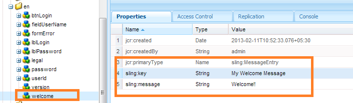

# Creazione di una schermata di accesso{#creating-a-new-login-screen}

Puoi modificare la schermata di accesso di tutti i moduli AEM Forms che utilizzano la schermata di accesso di AEM Forms. Ad esempio, le modifiche influiscono sulla schermata di accesso di, Forms Manager e AEM Forms Workspace.

## Prerequisito {#prerequisite}

1. Accedi a `/lc/crx/de` con autorizzazioni di amministratore.
1. Effettua le seguenti azioni:

   1. Replica la struttura gerarchica: di `/libs/livecycle/core/content` a `/apps/livecycle/core/content`.

      Gestisci le stesse proprietà (nodo/cartella) e il controllo degli accessi.

   1. Copia la cartella dei contenuti:

      da: `/libs/livecycle/core`

      a: `/apps/livecycle/core`.

   1. Elimina il contenuto di `/apps/livecycle/core` cartella.

1. Eseguire le azioni riportate di seguito.

   1. Replica la struttura gerarchica: di `/libs/livecycle/core/components/login` a `/apps/livecycle/core/components/login`. Gestisci le stesse proprietà (nodo/cartella) e il controllo degli accessi.

   1. Copia la cartella dei componenti: da `/libs/livecycle/core` a `/apps/livecycle/core`.

   1. Elimina il contenuto della cartella: `/apps/livecycle/core/components/login`.

### Aggiunta di una nuova lingua {#adding-a-new-locale}

1. Copia il `i18n` cartella:

   * da `/libs/livecycle/core/components/login`
   * a `/apps/livecycle/core/components/login`

1. Elimina tutte le cartelle all&#39;interno di `i18n` tranne uno, di&#39; `en`.

1. Nella cartella `en`, esegui le seguenti azioni:

   1. Rinominare la cartella con il nome delle impostazioni internazionali che si desidera supportare. Esempio: `ar`.

   1. Modificare la proprietà `jcr:language` valore per `ar`(per `ar` cartella ).

   >[!NOTE]
   >
   >Se locale è una combinazione di codice lingua-paese, ad esempio, `ar-DZ`, quindi modifica il nome della cartella e il valore della proprietà in `ar-DZ`.

1. Copia `login.jsp`:

   * da `/libs/livecycle/core/components/login`
   * a `/apps/livecycle/core/components/login`

1. Modifica il seguente frammento di codice per `/apps/livecycle/core/components/login/login.jsp`:

***La lingua è il codice della lingua***

```jsp
String browserLocale = "en";

    for(int i=0; i<locales.length; i++)
    {
        String prioperty = locales[i];
        if(prioperty.trim().startsWith("en")) {
            browserLocale = "en";
            break;
        }
        if(prioperty.trim().startsWith("de")){
            browserLocale = "de";
            break;
        }
        if(prioperty.trim().startsWith("ja")){
            browserLocale = "ja";
            break;
        }
        if(prioperty.trim().startsWith("fr")){
            browserLocale = "fr";
            break;
        }
    }
```

A

```jsp
String browserLocale = "en";
    for(int i=0; i<locales.length; i++)
    {
        String prioperty = locales[i];
        if(prioperty.trim().startsWith("ar")) {
            browserLocale = "ar";
            break;
        }
        if(prioperty.trim().startsWith("en")) {
            browserLocale = "en";
            break;
        }
        if(prioperty.trim().startsWith("de")){
            browserLocale = "de";
            break;
        }
        if(prioperty.trim().startsWith("ja")){
            browserLocale = "ja";
            break;
        }
        if(prioperty.trim().startsWith("fr")){
            browserLocale = "fr";
            break;
        }
    }
```

```jsp
String browserLocale = "en";

    for(int i=0; i<locales.length; i++)
    {
        String prioperty = locales[i];
        if(prioperty.trim().startsWith("en")) {
            browserLocale = "en";
            break;
        }
        if(prioperty.trim().startsWith("de")){
            browserLocale = "de";
            break;
        }
        if(prioperty.trim().startsWith("ja")){
            browserLocale = "ja";
            break;
        }
        if(prioperty.trim().startsWith("fr")){
            browserLocale = "fr";
            break;
        }
    }
```

A

```jsp
String browserLocale = "en";
    for(int i=0; i<locales.length; i++)
    {
        String prioperty = locales[i];
        if(prioperty.trim().equalsIgnoreCase("ar-DZ")) {
            browserLocale = "ar-DZ";
            break;
        }
        if(prioperty.trim().startsWith("en")) {
            browserLocale = "en";
            break;
        }
        if(prioperty.trim().startsWith("de")){
            browserLocale = "de";
            break;
        }
        if(prioperty.trim().startsWith("ja")){
            browserLocale = "ja";
            break;
        }
        if(prioperty.trim().startsWith("fr")){
            browserLocale = "fr";
            break;
        }
    }
```

***Per modificare le impostazioni locali predefinite***

```jsp
   String browserLocale = "en";
   for(int i=0; i<locales.length; i++)

   To

   String browserLocale = "ar";
   for(int i=0; i<locales.length; i++)
```

### Aggiunta di nuovo testo o modifica di testo esistente {#adding-new-text-or-modifying-existing-text}

1. Copia `i18n` cartella:

   * da `/libs/livecycle/core/components/login`
   * a `/apps/livecycle/core/components/login`

1. Ora modifica il valore della proprietà `sling:message` del nodo (nella cartella del codice locale desiderata) per il quale si desidera modificare il testo. La traduzione viene eseguita tramite la chiave indicata nel valore di `sling:key` del nodo.

1. Per aggiungere una nuova coppia chiave-valore, effettua le seguenti operazioni. Controlla un esempio nella schermata seguente.

   1. Creare un nodo di tipo `sling:MessageEntry`o copiare un nodo esistente e rinominarlo in tutte le cartelle delle impostazioni internazionali.
   1. Copia `login.jsp` :

      * da `/libs/livecycle/core/components/login`

      * a `/apps/livecycle/core/components/login`

   1. Modifica `/apps/livecycle/core/components/login/login.jsp` per incorporare il testo appena aggiunto.

   

   ```jsp
   div class="loginContent">
   
                       <span class="loginFlow"></code>
                       <span class="loginVersion"><%= i18n.get("Version: 11.0.0") %></code>
                       <span class="loginTitle"><%= i18n.get("Login") %></code>
                       <% if (loginFailed) {%>
   ```

   A

   ```jsp
   div class="loginContent">
   
                       <span class="loginFlow"></code>
                       <span class="loginVersion"><%= i18n.get("My Welcome Message") %></code>
                       <span class="loginVersion"><%= i18n.get("Version: 11.0.0") %></code>
                       <span class="loginTitle"><%= i18n.get("Login") %></code>
                       <% if (loginFailed) {%>
   ```

### Aggiunta di un nuovo stile o modifica di uno stile esistente {#adding-new-style-or-modifying-existing-style}

1. Copia `login` nodo:

   * da `/libs/livecycle/core/content`
   * a `/apps/livecycle/core/content`

1. Elimina file `login.js` e `jquery-1.8.0.min.js`, dal nodo `/apps/livecycle/core/content/login.`
1. Modifica gli stili nel file CSS.
1. Per aggiungere nuovi stili:

   1. Aggiungi nuovi stili a `/apps/livecycle/core/content/login/login.css`
   1. Copia `login.jsp`

      * da `/libs/livecycle/core/components/login`

      * a `/apps/livecycle/core/components/login`

   1. Modifica `/apps/livecycle/core/components/login/login.jsp` per incorporare i nuovi stili aggiunti.


Ad esempio:

* Aggiungi quanto segue a `/apps/livecycle/core/content/login/login.css`.

```
css.newLoginContentArea {
    width: 700px;
    padding: 100px 0px 0px 100px;
   }
```

* Modifica quanto segue in `/apps/livecycle/core/components/login.jsp`.


  ```jsp
  <div class="loginContentArea">
  ```

  A

  ```jsp
  <div class="newLoginContentArea">
  ```

>[!NOTE]
>
>Se le immagini esistenti `/apps/livecycle/core/content/login` (copiato da `/libs/livecycle/core/content/login`) vengono rimossi, quindi rimuovi i riferimenti corrispondenti in CSS.

### Aggiungere nuove immagini {#add-new-images}

1. Segui i passaggi per aggiungere nuovo stile o modificare lo stile esistente (descritti in precedenza).
1. Aggiungere nuove immagini in `/apps/livecycle/core/content/login`. Per aggiungere un&#39;immagine:

   1. Installare il client WebDAV.
   1. Accedi a `/apps/livecycle/core/content/login` mediante il client WebDAV. Per ulteriori informazioni, consulta: [https://dev.day.com/docs/en/crx/current/how_to/webdav_access.html](https://experienceleague.adobe.com/docs/experience-manager-release-information/aem-release-updates/previous-updates/aem-previous-versions.html?lang=it).

   1. Aggiungere nuove immagini.

1. Aggiungere nuovi stili in `/apps/livecycle/core/content/login/login.css,` corrispondente alle nuove immagini aggiunte in `/apps/livecycle/core/content/login`.
1. Utilizzare i nuovi stili in `login.jsp` a `/apps/livecycle/core/components`.

Ad Esempio:


```css
.newLoginContainerBkg {

 background-image: url(my_Bg.gif);
 background-repeat: no-repeat;
 background-position: left top;
 width: 727px;
}
```


    * Modificare quanto segue in /apps/livecycle/core/components/login.jsp.

```jsp
<div class="loginContainerBkg">
```

A

```jsp
<div class="newLginContainerBkg">
```
