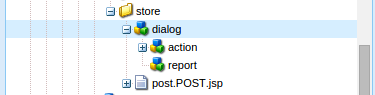

# Scrittura di un’azione di invio personalizzata per i moduli adattivi{#writing-custom-submit-action-for-adaptive-forms}

I moduli adattivi richiedono azioni di invio per elaborare dati specificati dall’utente. Un’azione Invia determina l’attività eseguita sui dati inviati utilizzando un modulo adattivo. Adobe Experience Manager (AEM) include [Azioni di invio OOTB](../../forms/using/configuring-submit-actions.md) che illustrano le attività personalizzate che è possibile eseguire utilizzando i dati inviati dall’utente. Ad esempio, puoi eseguire attività quali l’invio di e-mail o l’archiviazione dei dati.

## Flusso di lavoro per un’azione Invia {#workflow-for-a-submit-action}

Il diagramma di flusso rappresenta il flusso di lavoro per un’azione Invia che viene attivata quando si fa clic sul pulsante **[!UICONTROL Invia]** in un modulo adattivo. I file nel componente File allegato vengono caricati sul server e i dati del modulo vengono aggiornati con gli URL dei file caricati. All’interno del client, i dati vengono memorizzati nel formato JSON. Il client invia una richiesta Ajax a un servlet interno che massaggia i dati specificati e li restituisce in formato XML. Il client raccoglie questi dati con i campi delle azioni. Invia i dati al servlet finale (servlet di invio della guida) tramite un’azione di invio del modulo. Quindi, il servlet inoltra il controllo all’azione Invia. L’azione Invia può inoltrare la richiesta a una diversa risorsa sling o reindirizzare il browser a un altro URL.


### Formato dati XML {#xml-data-format}

I dati XML vengono inviati al servlet utilizzando **`jcr:data`** parametro di richiesta. Le azioni di invio possono accedere al parametro per elaborare i dati. Il codice seguente descrive il formato dei dati XML. I campi associati al modello Modulo vengono visualizzati nella **`afBoundData`** sezione . I campi non associati vengono visualizzati nella `afUnoundData`sezione . Per ulteriori informazioni sul formato del `data.xml` file, vedi [Introduzione alla precompilazione dei campi modulo adattivo](../../forms/using/prepopulate-adaptive-form-fields.md).

```xml
<?xml ?>
<afData>
<afUnboundData>
<data>
<field1>value</field2>
<repeatablePanel>
    <field2>value</field2>
</repeatablePanel>
<repeatablePanel>
    <field2>value</field2>
</repeatablePanel>
</data>
</afUnboundData>
<afBoundData>
<!-- xml corresponding to the Form Model /XML Schema -->
</afBoundData>
</afData>
```

### Campi azione {#action-fields}

Un’azione Invia può aggiungere campi di input nascosti (utilizzando HTML [input](https://developer.mozilla.org/en/docs/Web/HTML/Element/Input) al modulo di cui è stato effettuato il rendering in HTML. Questi campi nascosti possono contenere i valori necessari durante l’elaborazione dell’invio del modulo. Quando si invia il modulo, questi valori dei campi vengono inviati nuovamente come parametri di richiesta che l’azione Invia può utilizzare durante la gestione dell’invio. I campi di input sono chiamati campi di azione.

Ad esempio, un’azione Invia che acquisisce anche il tempo necessario per compilare un modulo può aggiungere campi di input nascosti `startTime` e `endTime`.

Uno script può fornire i valori `startTime` e `endTime` i campi in cui viene eseguito il rendering del modulo e prima dell’invio del modulo, rispettivamente. Lo script di azione Invia `post.jsp` può quindi accedere a questi campi utilizzando i parametri di richiesta e calcolare il tempo totale necessario per compilare il modulo.

### Allegati file {#file-attachments}

Le azioni di invio possono inoltre utilizzare gli allegati file caricati utilizzando il componente File allegato. Gli script di azione Invia possono accedere a questi file utilizzando lo sling [API RequestParameter](https://sling.apache.org/apidocs/sling5/org/apache/sling/api/request/RequestParameter.html). La [isFormField](https://sling.apache.org/apidocs/sling5/org/apache/sling/api/request/RequestParameter.html#isFormField()) Il metodo dell&#39;API aiuta a identificare se il parametro della richiesta è un file o un campo del modulo. È possibile eseguire iterazioni sui parametri di richiesta in un’azione Invia per identificare i parametri di File allegato.

Il codice di esempio seguente identifica gli allegati di file nella richiesta. Successivamente, legge i dati nel file utilizzando [Ottieni API](https://sling.apache.org/apidocs/sling5/org/apache/sling/api/request/RequestParameter.html#get()). Infine, crea un oggetto Document utilizzando i dati e lo aggiunge a un elenco.

```java
RequestParameterMap requestParameterMap = slingRequest.getRequestParameterMap();
for (Map.Entry<String, RequestParameter[]> param : requestParameterMap.entrySet()) {
    RequestParameter rpm = param.getValue()[0];
    if(!rpm.isFormField()) {
        fileAttachments.add(new Document(rpm.get()));
    }
}
```

### URL di percorso e reindirizzamento {#forward-path-and-redirect-url}

Dopo aver eseguito l’azione richiesta, il servlet di invio inoltra la richiesta al percorso successivo. Un’azione utilizza l’API setForwardPath per impostare il percorso in avanti nel servlet di invio della guida.

Se l’azione non fornisce un percorso in avanti, il servlet di invio reindirizzerà il browser utilizzando l’URL di reindirizzamento. L’autore configura l’URL di reindirizzamento utilizzando la configurazione Pagina di ringraziamento nella finestra di dialogo Modifica modulo adattivo. Puoi anche configurare l’URL di reindirizzamento tramite l’azione Submit o l’API setRedirectUrl nel servlet di invio della guida. Puoi anche configurare i parametri Request inviati all’URL di reindirizzamento utilizzando l’API setRedirectParameters nel servlet di invio della guida.

>[!NOTE]
>
>Un autore fornisce l’URL di reindirizzamento (utilizzando la configurazione della pagina di ringraziamento). [Azioni di invio OOTB](../../forms/using/configuring-submit-actions.md) utilizza l&#39;URL di reindirizzamento per reindirizzare il browser dalla risorsa a cui fa riferimento il percorso in avanti.
>
>È possibile scrivere un’azione di invio personalizzata che inoltra una richiesta a una risorsa o a un servlet. L’Adobe consiglia che lo script che esegue la gestione delle risorse per il percorso di avanzamento reindirizzi la richiesta all’URL di reindirizzamento al termine dell’elaborazione.

## Azione di invio {#submit-action}

Un’azione Invia è una sling:Folder che include quanto segue:

* **addfields.jsp**: Questo script fornisce i campi azione che vengono aggiunti al file HTML durante il rendering. Utilizza questo script per aggiungere i parametri di input nascosti richiesti durante l’invio nello script post.POST.jsp.
* **dialog.xml**: Questo script è simile alla finestra di dialogo del componente CQ. Fornisce informazioni di configurazione personalizzate dall’autore. I campi vengono visualizzati nella scheda Azioni di invio della finestra di dialogo Modifica modulo adattivo quando si seleziona l’azione Invia.
* **post.POST.jsp**: Il servlet di invio chiama questo script con i dati inviati e i dati aggiuntivi nelle sezioni precedenti. Qualsiasi menzione dell&#39;esecuzione di un&#39;azione in questa pagina implica l&#39;esecuzione dello script post.POST.jsp. Per registrare l’azione Invia con i moduli adattivi da visualizzare nella finestra di dialogo Modifica modulo adattivo, aggiungi queste proprietà allo sling:Folder:

   * **guideComponentType** di tipo String e di valore **fd/af/components/guidesubmittype**
   * **guideDataModel** di tipo String che specifica il tipo di modulo adattivo per il quale è applicabile l’azione Invia. **xfa** è supportato per i moduli adattivi basati su XFA mentre **xsd** è supportato per i moduli adattivi basati su XSD. **base** è supportato per i moduli adattivi che non utilizzano XDP o XSD. Per visualizzare l’azione su più tipi di moduli adattivi, aggiungi le stringhe corrispondenti. Separa ogni stringa con una virgola. Ad esempio, per rendere visibile un’azione nei moduli adattivi basati su XFA e XSD, specifica i valori **xfa** e **xsd** rispettivamente.

   * **jcr:description** di tipo String. Il valore di questa proprietà viene visualizzato nell’elenco delle azioni Invia nella scheda Azioni di Invia della finestra di dialogo Modifica modulo adattivo. Le azioni OOTB sono presenti nell’archivio CRX nella posizione **/libs/fd/af/components/guidesubmittype**.

## Creazione di un’azione di invio personalizzata {#creating-a-custom-submit-action}

Esegui i seguenti passaggi per creare un’azione di invio personalizzata che salva i dati nell’archivio CRX e quindi invia un’e-mail. Il modulo adattivo contiene l’azione Invia Contenuto archivio azioni (obsoleto) di OOTB che salva i dati nell’archivio CRX. Inoltre, CQ fornisce un [Posta](https://docs.adobe.com/docs/en/cq/current/javadoc/com/day/cq/mailer/package-summary.html) API che può essere utilizzata per inviare e-mail. Prima di utilizzare l&#39;API Mail, [configurare](https://docs.adobe.com/docs/en/cq/current/administering/notification.html?wcmmode=disabled#Configuring il servizio Mail) il servizio Day CQ Mail tramite la console di sistema. Puoi riutilizzare l’azione Archivia contenuto (obsoleto) per memorizzare i dati nell’archivio. L’azione Archivia contenuto (obsoleto) è disponibile nel percorso /libs/fd/af/components/guidesubmittype/store nell’archivio CRX.

1. Accedi a CRXDE Lite all’URL https://&lt;server>:&lt;port>/crx/de/index.jsp. Crea un nodo con la proprietà sling:Folder e il nome store_and_mail nella cartella /apps/custom_submit_action . Crea la cartella custom_submit_action se non esiste già.

   

1. **Fornisci i campi di configurazione obbligatori.**

   Aggiungi la configurazione necessaria per l&#39;azione Store. Copia il **cq:dialog** nodo dell&#39;azione Store da /libs/fd/af/components/guidesubmittype/store alla cartella delle azioni in /apps/custom_submit_action/store_and_email.

   

1. **Fornisci campi di configurazione per richiedere all’autore la configurazione dell’e-mail.**

   Il modulo adattivo fornisce anche un’azione E-mail che invia e-mail agli utenti. Personalizza questa azione in base alle tue esigenze. Passa a /libs/fd/af/components/guidesubmittype/email/dialog. Copia i nodi all’interno del nodo cq:dialog nel nodo cq:dialog dell’azione di invio (/apps/custom_submit_action/store_and_email/dialog).

   

1. **Rendi disponibile l’azione nella finestra di dialogo Modifica modulo adattivo .**

   Aggiungi le seguenti proprietà nel nodo store_and_email:

   * **guideComponentType** di tipo **Stringa** e valore **fd/af/components/guidesubmittype**

   * **guideDataModel** di tipo **Stringa** e valore **xfa, xsd, base**

   * **jcr:description** di tipo **Stringa** e valore **Azione store ed e-mail**

1. Apri qualsiasi modulo adattivo. Fai clic sul pulsante **Modifica** pulsante accanto a **Inizio** per aprire **Modifica** finestra di dialogo del contenitore di moduli adattivi. La nuova azione viene visualizzata nella **Inviare azioni** Tab. Selezione della **Azione store ed e-mail** visualizza la configurazione aggiunta nel nodo della finestra di dialogo.

   

1. **Utilizzare l&#39;azione per completare un&#39;attività.**

   Aggiungi lo script post.POST.jsp all&#39;azione. (/apps/custom_submit_action/store_and_mail/).

   Esegui l&#39;azione OOTB Store (script post.POST.jsp). Utilizza la [FormsHelper.runAction](https://docs.adobe.com/docs/en/cq/current/javadoc/com/day/cq/wcm/foundation/forms/FormsHelper.html#runAction(java.lang.String, java.lang.String, org.apache.sling.api.resource.Resource, org.apache.sling.api.SlingHttpServletRequest, org.apache.sling.api.SlingHttpServletResponse) API che CQ fornisce nel codice per eseguire l&#39;azione Store. Aggiungi il seguente codice nel file JSP:

   `FormsHelper.runAction("/libs/fd/af/components/guidesubmittype/store", "post", resource, slingRequest, slingResponse);`

   Per inviare l’e-mail, il codice legge l’indirizzo e-mail del destinatario dalla configurazione. Per recuperare il valore di configurazione nello script dell’azione, leggi le proprietà della risorsa corrente utilizzando il codice seguente. Allo stesso modo puoi leggere gli altri file di configurazione.

   `ValueMap properties = ResourceUtil.getValueMap(resource);`

   `String mailTo = properties.get("mailTo");`

   Infine, utilizza l’API CQ Mail per inviare l’e-mail. Utilizza la [SimpleEmail](https://commons.apache.org/proper/commons-email/apidocs/org/apache/commons/mail/SimpleEmail.html) Classe per creare l’oggetto e-mail come illustrato di seguito:

   >[!NOTE]
   >
   >Assicurati che il file JSP abbia il nome post.POST.jsp.

   ```java
   <%@include file="/libs/fd/af/components/guidesglobal.jsp" %>
   <%@page import="com.day.cq.wcm.foundation.forms.FormsHelper,
          org.apache.sling.api.resource.ResourceUtil,
          org.apache.sling.api.resource.ValueMap,
                   com.day.cq.mailer.MessageGatewayService,
     com.day.cq.mailer.MessageGateway,
     org.apache.commons.mail.Email,
                   org.apache.commons.mail.SimpleEmail" %>
   <%@taglib prefix="sling"
                   uri="https://sling.apache.org/taglibs/sling/1.0" %>
   <%@taglib prefix="cq"
                   uri="https://www.day.com/taglibs/cq/1.0"
   %>
   <cq:defineObjects/>
   <sling:defineObjects/>
   <%
           String storeContent =
                       "/libs/fd/af/components/guidesubmittype/store";
           FormsHelper.runAction(storeContent, "post", resource,
                                   slingRequest, slingResponse);
    ValueMap props = ResourceUtil.getValueMap(resource);
    Email email = new SimpleEmail();
    String[] mailTo = props.get("mailto", new String[0]);
    email.setFrom((String)props.get("from"));
           for (String toAddr : mailTo) {
               email.addTo(toAddr);
      }
    email.setMsg((String)props.get("template"));
    email.setSubject((String)props.get("subject"));
    MessageGatewayService messageGatewayService =
                       sling.getService(MessageGatewayService.class);
    MessageGateway messageGateway =
                   messageGatewayService.getGateway(SimpleEmail.class);
    messageGateway.send(email);
   %>
   ```

   Seleziona l’azione nel modulo adattivo. L’azione invia un’e-mail e memorizza i dati.
