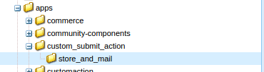
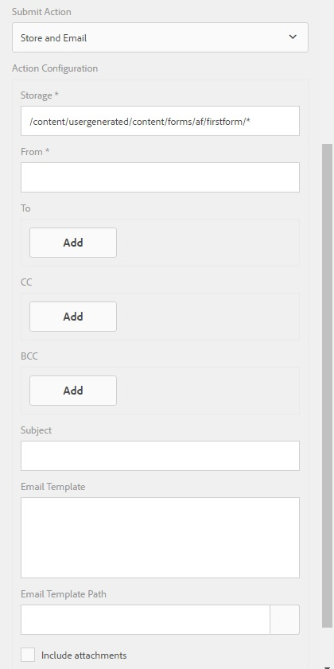

# Scrittura dell’azione di invio personalizzata per i moduli adattivi{#writing-custom-submit-action-for-adaptive-forms}

| Versione | Collegamento articolo |
| -------- | ---------------------------- |
| AEM as a Cloud Service | [Fai clic qui](https://experienceleague.adobe.com/docs/experience-manager-cloud-service/content/forms/adaptive-forms-authoring/authoring-adaptive-forms-foundation-components/configure-submit-actions-and-metadata-submission/custom-submit-action-form.html?lang=it) |
| AEM 6.5 | Questo articolo |

I moduli adattivi richiedono azioni di invio per elaborare i dati specificati dall’utente. Un’azione Invia determina il task eseguito sui dati inviati tramite un modulo adattivo. Adobe Experience Manager (AEM) include [azioni di invio pronte all&#39;uso](../../forms/using/configuring-submit-actions.md) che dimostrano attività personalizzate eseguibili utilizzando i dati inviati dall&#39;utente. Ad esempio, puoi eseguire attività quali l’invio di e-mail o la memorizzazione dei dati.

## Flusso di lavoro per un&#39;azione di invio {#workflow-for-a-submit-action}

Il diagramma di flusso mostra il flusso di lavoro per un&#39;azione di invio attivata quando si fa clic sul pulsante **[!UICONTROL Invia]** in un modulo adattivo. I file nel componente File allegato vengono caricati sul server e i dati del modulo vengono aggiornati con gli URL dei file caricati. All’interno del client, i dati vengono memorizzati in formato JSON. Il client invia una richiesta Ajax a un servlet interno che massaggia i dati specificati e li restituisce in formato XML. Il client confronta questi dati con campi di azione. Invia i dati al servlet finale (servlet di invio guida) tramite un’azione di invio modulo. Quindi, il servlet inoltra il controllo all’azione Invia. L’azione Invia può inoltrare la richiesta a una risorsa sling diversa o reindirizzare il browser a un altro URL.


### Formato dati XML {#xml-data-format}

I dati XML vengono inviati al servlet utilizzando il parametro di richiesta **`jcr:data`**. Le azioni di invio possono accedere al parametro per elaborare i dati. Nel codice seguente viene descritto il formato dei dati XML. I campi associati al modello di modulo vengono visualizzati nella sezione **`afBoundData`**. I campi non associati vengono visualizzati nella sezione `afUnoundData`. Per ulteriori informazioni sul formato del file `data.xml`, vedere [Introduzione alla precompilazione dei campi del modulo adattivo](../../forms/using/prepopulate-adaptive-form-fields.md).

```xml
<?xml ?>
<afData>
<afUnboundData>
<data>
<field1>value</field2>
<repeatablePanel>
    <field2>value</field2>
</repeatablePanel>
<repeatablePanel>
    <field2>value</field2>
</repeatablePanel>
</data>
</afUnboundData>
<afBoundData>
<!-- xml corresponding to the Form Model /XML Schema -->
</afBoundData>
</afData>
```

### Campi azione {#action-fields}

Un&#39;azione Invia può aggiungere campi di input nascosti (utilizzando il tag HTML [input](https://developer.mozilla.org/en-US/docs/Web/HTML/Element/Input)) al form HTML sottoposto a rendering. Questi campi nascosti possono contenere i valori necessari durante l’elaborazione dell’invio del modulo. Durante l’invio del modulo, questi valori dei campi vengono postback come parametri di richiesta che l’azione Invia può utilizzare durante la gestione dell’invio. I campi di input sono denominati campi di azione.

Ad esempio, un&#39;azione Invia che acquisisce anche il tempo impiegato per compilare un modulo può aggiungere i campi di input nascosti `startTime` e `endTime`.

Uno script può fornire i valori dei campi `startTime` e `endTime` rispettivamente durante il rendering del modulo e prima dell&#39;invio del modulo. L&#39;ActionScript di invio `post.jsp` può quindi accedere a questi campi utilizzando i parametri di richiesta e calcolare il tempo totale necessario per compilare il modulo.

### File allegati {#file-attachments}

Le azioni di invio possono inoltre utilizzare i file allegati caricati utilizzando il componente File allegato. Gli script di azioni di invio possono accedere a questi file utilizzando l&#39;API sling [RequestParameter](https://sling.apache.org/apidocs/sling5/org/apache/sling/api/request/RequestParameter.html). Il metodo [isFormField](https://sling.apache.org/apidocs/sling5/org/apache/sling/api/request/RequestParameter.html#isFormField()) dell&#39;API consente di identificare se il parametro della richiesta è un file o un campo modulo. È possibile scorrere i parametri di richiesta in un&#39;azione di invio per identificare i parametri di file allegato.

Il codice di esempio seguente identifica gli allegati della richiesta. Successivamente, legge i dati nel file utilizzando [Get API](https://sling.apache.org/apidocs/sling5/org/apache/sling/api/request/RequestParameter.html#get()). Infine, crea un oggetto Document utilizzando i dati e lo aggiunge a un elenco.

```java
RequestParameterMap requestParameterMap = slingRequest.getRequestParameterMap();
for (Map.Entry<String, RequestParameter[]> param : requestParameterMap.entrySet()) {
    RequestParameter rpm = param.getValue()[0];
    if(!rpm.isFormField()) {
        fileAttachments.add(new Document(rpm.get()));
    }
}
```

### Percorso di inoltro e URL di reindirizzamento {#forward-path-and-redirect-url}

Dopo aver eseguito l’azione richiesta, il servlet Submit inoltra la richiesta al percorso di inoltro. Un’azione utilizza l’API setForwardPath per impostare il percorso di inoltro nel servlet di invio della guida.

Se l’azione non fornisce un percorso di inoltro, il servlet di invio reindirizzerà il browser utilizzando l’URL di reindirizzamento. L’autore configura l’URL di reindirizzamento utilizzando la configurazione della pagina di ringraziamento nella finestra di dialogo Modifica modulo adattivo. Puoi anche configurare l’URL di reindirizzamento tramite l’azione Invia o l’API setRedirectUrl nel servlet di invio della guida. Puoi anche configurare i parametri di richiesta inviati all’URL di reindirizzamento utilizzando l’API setRedirectParameters nel servlet di invio della guida.

>[!NOTE]
>
>Un autore fornisce l’URL di reindirizzamento (utilizzando la configurazione della pagina di ringraziamento). [azioni di invio predefinite](../../forms/using/configuring-submit-actions.md) utilizzano l&#39;URL di reindirizzamento per reindirizzare il browser dalla risorsa a cui fa riferimento il percorso di inoltro.
>
>Puoi scrivere un’azione di invio personalizzata che inoltra una richiesta a una risorsa o a un servlet. L’Adobe consiglia che lo script che gestisce le risorse per il percorso di inoltro reindirizzi la richiesta all’URL di reindirizzamento al termine dell’elaborazione.

## Azione di invio {#submit-action}

Un’azione Invia è una sling:Folder che include quanto segue:

* **addfields.jsp**: questo script fornisce i campi di azione che vengono aggiunti al file HTML durante la rappresentazione. Utilizza questo script per aggiungere i parametri di input nascosti richiesti durante l’invio nello script post.POST.jsp.
* **dialog.xml**: questo script è simile alla finestra di dialogo del componente CQ. Fornisce informazioni di configurazione personalizzate dall’autore. I campi vengono visualizzati nella scheda Invia azioni della finestra di dialogo Modifica modulo adattivo quando si seleziona l’azione Invia.
* **post.POST.jsp**: il servlet di invio chiama questo script con i dati inviati e i dati aggiuntivi nelle sezioni precedenti. Ogni riferimento all’esecuzione di un’azione in questa pagina implica l’esecuzione dello script post.POST.jsp. Per registrare l&#39;azione Invia con i moduli adattivi da visualizzare nella finestra di dialogo Modifica modulo adattivo, aggiungi queste proprietà a `sling:Folder`:

   * **guideComponentType** di tipo String e valore **fd/af/components/guidesubmittype**
   * **guideDataModel** di tipo String che specifica il tipo di modulo adattivo per il quale è applicabile l&#39;azione Invia. **xfa** è supportato per i moduli adattivi basati su XFA, mentre **xsd** è supportato per i moduli adattivi basati su XSD. **basic** è supportato per i moduli adattivi che non utilizzano XDP o XSD. Per visualizzare l’azione su più tipi di moduli adattivi, aggiungi le stringhe corrispondenti. Separa ogni stringa con una virgola. Ad esempio, per rendere visibile un&#39;azione nei moduli adattivi basati su XFA e XSD, specifica i valori **xfa** e **xsd** rispettivamente.

   * **jcr:description** di tipo String. Il valore di questa proprietà viene visualizzato nell&#39;elenco Azione invio della scheda Invia azioni della finestra di dialogo Modifica modulo adattivo. Le azioni predefinite sono presenti nell&#39;archivio CRX nel percorso **/libs/fd/af/components/guidesubmittype**.

## Creazione di un’azione di invio personalizzata {#creating-a-custom-submit-action}

Per creare un’azione di invio personalizzata che salvi i dati nell’archivio CRX, quindi ti invia un’e-mail, effettua le seguenti operazioni. Il modulo adattivo contiene l’azione predefinita Invia a Contenuto archivio (obsoleto) che salva i dati nell’archivio CRX. Inoltre, CQ fornisce un&#39;API [Mail](https://experienceleague.adobe.com/docs/experience-manager-release-information/aem-release-updates/previous-updates/aem-previous-versions.html?lang=it) che può essere utilizzata per inviare e-mail. Prima di utilizzare l&#39;API Mail, [configura](https://experienceleague.adobe.com/docs/experience-manager-release-information/aem-release-updates/previous-updates/aem-previous-versions.html?lang=it&wcmmode=disabled) il servizio Day CQ Mail tramite la console di sistema. Puoi riutilizzare l’azione Archivia contenuto (obsoleta) per memorizzare i dati nell’archivio. L’azione Archivia contenuto (obsoleta) è disponibile nella posizione /libs/fd/af/components/guidesubmittype/store nell’archivio CRX.

1. Accedi a CRXDE Lite all’URL https://&lt;server>:&lt;porta>/crx/de/index.jsp. Crea un nodo con la proprietà sling:Folder e name store_and_mail nella cartella /apps/custom_submit_action. Creare la cartella custom_submit_action se non esiste già.

   

1. **Fornisci i campi di configurazione obbligatori.**

   Aggiungi la configurazione richiesta dall’azione Archivia. Copia il nodo **cq:dialog** dell&#39;azione Archivia da /libs/fd/af/components/guidesubmittype/store nella cartella delle azioni in /apps/custom_submit_action/store_and_email.

   

1. **Fornire i campi di configurazione per richiedere all&#39;autore la configurazione della posta elettronica.**

   Il modulo adattivo fornisce anche un’azione E-mail che invia e-mail agli utenti. Personalizza questa azione in base alle tue esigenze. Passa a /libs/fd/af/components/guidesubmittype/email/dialog. Copia i nodi all’interno del nodo cq:dialog nel nodo cq:dialog dell’azione Invia (/apps/custom_submit_action/store_and_email/dialog).

   

1. **Rendi l&#39;azione disponibile nella finestra di dialogo Modifica modulo adattivo.**

   Aggiungi le seguenti proprietà nel nodo store_and_email:

   * **guideComponentType** di tipo **String** e valore **fd/af/components/guidesubmittype**

   * **guideDataModel** di tipo **String** e valore **xfa, xsd, basic**

   * **jcr:description** di tipo **String** e valore **Azione archivio e posta elettronica**

1. Apri qualsiasi modulo adattivo. Fai clic sul pulsante **Modifica** accanto a **Inizio** per aprire la finestra di dialogo **Modifica** del contenitore del modulo adattivo. La nuova azione viene visualizzata nella scheda **Invia azioni**. Se si seleziona l&#39;**Azione archivio ed e-mail**, la configurazione aggiunta verrà visualizzata nel nodo della finestra di dialogo.

   

1. **Utilizzare l&#39;azione per completare un&#39;attività.**

   Aggiungi lo script post.POST.jsp all’azione. (/apps/custom_submit_action/store_and_mail/).

   Esegui l’azione predefinita Store (script post.POST.jsp). Utilizza l&#39;API [FormsHelper.runAction](https://experienceleague.adobe.com/docs/experience-manager-release-information/aem-release-updates/previous-updates/aem-previous-versions.html?lang=it)(java.lang.String, java.lang.String, org.apache.sling.api.resource.Resource, org.apache.sling.api.SlingHttpServletRequest, org.apache.sling.api.SlingHttpServletResponse) fornita da CQ nel codice per eseguire l&#39;azione Archivia. Aggiungi il seguente codice nel file JSP:

   `FormsHelper.runAction("/libs/fd/af/components/guidesubmittype/store", "post", resource, slingRequest, slingResponse);`

   Per inviare l’e-mail, il codice legge l’indirizzo e-mail del destinatario dalla configurazione. Per recuperare il valore di configurazione nello script dell’azione, leggi le proprietà della risorsa corrente utilizzando il codice seguente. Analogamente, potete leggere gli altri file di configurazione.

   `ValueMap properties = ResourceUtil.getValueMap(resource);`

   `String mailTo = properties.get("mailTo");`

   Infine, utilizza l’API Mail di CQ per inviare l’e-mail. Utilizza la classe [SimpleEmail](https://commons.apache.org/proper/commons-email/apidocs/org/apache/commons/mail/SimpleEmail.html) per creare l&#39;oggetto e-mail come illustrato di seguito:

   >[!NOTE]
   >
   >Assicurati che il file JSP abbia il nome post.POST.jsp.

   ```java
   <%@include file="/libs/fd/af/components/guidesglobal.jsp" %>
   <%@page import="com.day.cq.wcm.foundation.forms.FormsHelper,
          org.apache.sling.api.resource.ResourceUtil,
          org.apache.sling.api.resource.ValueMap,
                   com.day.cq.mailer.MessageGatewayService,
     com.day.cq.mailer.MessageGateway,
     org.apache.commons.mail.Email,
                   org.apache.commons.mail.SimpleEmail" %>
   <%@taglib prefix="sling"
                   uri="https://sling.apache.org/taglibs/sling/1.0" %>
   <%@taglib prefix="cq"
                   uri="https://www.day.com/taglibs/cq/1.0"
   %>
   <cq:defineObjects/>
   <sling:defineObjects/>
   <%
           String storeContent =
                       "/libs/fd/af/components/guidesubmittype/store";
           FormsHelper.runAction(storeContent, "post", resource,
                                   slingRequest, slingResponse);
    ValueMap props = ResourceUtil.getValueMap(resource);
    Email email = new SimpleEmail();
    String[] mailTo = props.get("mailto", new String[0]);
    email.setFrom((String)props.get("from"));
           for (String toAddr : mailTo) {
               email.addTo(toAddr);
      }
    email.setMsg((String)props.get("template"));
    email.setSubject((String)props.get("subject"));
    MessageGatewayService messageGatewayService =
                       sling.getService(MessageGatewayService.class);
    MessageGateway messageGateway =
                   messageGatewayService.getGateway(SimpleEmail.class);
    messageGateway.send(email);
   %>
   ```

   Seleziona l’azione nel modulo adattivo. L’azione invia un’e-mail e memorizza i dati.
