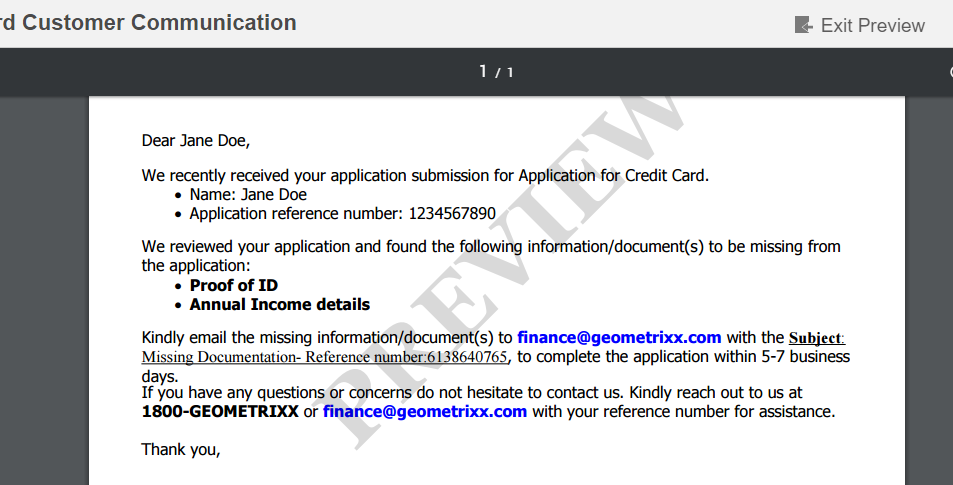

# Filigrana personalizzata in anteprima PDF lettera{#custom-watermark-in-letter-pdf-preview}

## Panoramica {#overview}

Nell’interfaccia utente Crea corrispondenza, gli utenti dell’agente visualizzano in anteprima la corrispondenza nella forma finale in cui viene inviata alla post-elaborazione, ad esempio per l’e-mail o la stampa.

Per evitare l’utilizzo non autorizzato di questi dati, le organizzazioni possono imporre una filigrana al PDF di anteprima. La filigrana predefinita è &quot;ANTEPRIMA&quot;, visualizzata nel PDF.

Per abilitare la filigrana nell&#39;anteprima PDF, seleziona l&#39;opzione **[!UICONTROL Applica filigrana]** Durante l&#39;anteprima in **[!UICONTROL Configurazioni di gestione della corrispondenza]** all&#39;indirizzo https://&#39;[server]:[port]&#39;/system/console/configMgr.



Per personalizzare il testo e l’aspetto della filigrana è possibile attenersi alla procedura descritta di seguito.

## Personalizzare la filigrana nell&#39;anteprima PDF in Crea interfaccia utente Corrispondenza {#customizewatermark-}

1. Vai a `https://'[server]:[port]'/[ContextPath]/crx/de` e accedi come amministratore.
1. Nella cartella delle app, crea una cartella denominata **[!UICONTROL anteprima filigrana]** con percorso/struttura simile alla cartella della filigrana di anteprima nella cartella libs:

   1. Fai clic con il pulsante destro del mouse sulla cartella **anteprima filigrana** al seguente percorso e seleziona **Sovrapponi nodo**:

      `/libs/fd/cm/configFiles/previewwatermark`

   1. Assicurati che la finestra di dialogo Sovrapponi nodo abbia i seguenti valori:

      **Percorso:** /libs/fd/cm/configFiles/previewwatermark

      **Posizione di sovrapposizione:** /apps/

      **Tipi di nodo di corrispondenza:** controllati

      >[!NOTE]
      >
      >Non apportare modifiche al ramo /libs. Eventuali modifiche apportate potrebbero andare perse, in quanto questo ramo è soggetto a modifiche ogni volta che:
      >
      >    
      >    
      >    * Aggiorna l&#39;istanza
      >    * Applicare un hotfix
      >    * Installare un feature pack


   1. Fare clic su **OK**, quindi fare clic su **Salva tutto**. La cartella **[!UICONTROL preview watermark]** viene creata nel percorso specificato.


1. Copia e incolla il file ddx dalla cartella &quot;/libs/fd/cm/configFiles/previewwatermark&quot; alla cartella &quot;/apps/fd/cm/configFiles/previewwatermark&quot; e fai clic su **[!UICONTROL Salva tutto]**.
1. Apporta le modifiche desiderate nel file ddx in /apps/fd/cm/configFiles/previewwatermark/.

   ```xml
   <DDX xmlns="https://ns.adobe.com/DDX/1.0/">
    <PDF result="output.pdf">
     <PDF source="input.pdf"/>
           <Watermark opacity="15%" rotation="45">
            <StyledText>
                     <p font-family="Georgia" font-size="70pt" color="black" font-weight="bold">
                         PREVIEW
                    </p>
            </StyledText>
           </Watermark>
    </PDF>
   </DDX>
   ```

   Per informazioni su come personalizzare l&#39;aspetto della filigrana, il testo e l&#39;allineamento, vedere Aggiunta e rimozione di filigrane e sfondi nel documento [Assembler Service e DDX Reference](https://help.adobe.com/en_US/livecycle/11.0/ddxRef.pdf).

   >[!NOTE]
   >
   >Nel file ddx, i riferimenti a risultato e sorgente devono rimanere inalterati in output.pdf e input.pdf. Anche il nome del file ddx non deve essere modificato.

1. Fare clic su **Salva tutto**.

