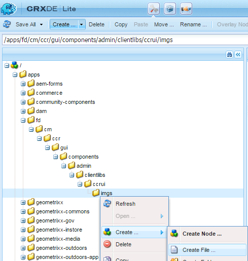

# Personalizza interfaccia utente per la corrispondenza{#customize-create-correspondence-ui}

## Panoramica {#overview}

La gestione della corrispondenza consente di rigenerare il modello di soluzione per migliorare il valore del marchio e soddisfare gli standard aziendali in materia di marchio. Il riordinamento dell’interfaccia utente include la modifica del logo dell’organizzazione, visualizzato nell’angolo in alto a sinistra dell’interfaccia utente Crea corrispondenza.

Potete cambiare il logo nell’interfaccia utente Crea corrispondenza con il logo aziendale.


Icona personalizzata nell’interfaccia utente Crea corrispondenza

### Modifica del logo nell&#39;interfaccia utente Crea corrispondenza {#changing-the-logo-in-the-create-correspondence-ui}

Per impostare un’immagine logo desiderata, effettuate le seguenti operazioni:

1. Create la struttura di cartelle appropriata in CRX[.](#creatingfolderstructure)
1. [Caricate il nuovo ](#uploadlogo) file di logo nella cartella creata in CRX.

1. [Impostate il ](#createcss) CSS su CRX per fare riferimento al nuovo logo.
1. Cancella la cronologia del browser e [aggiorna l&#39;interfaccia utente Crea corrispondenza](#refreshccrui).

## Creazione della struttura di cartelle richiesta {#creatingfolderstructure}

Create la struttura di cartelle, come illustrato di seguito, per ospitare l’immagine logo personalizzata e il foglio di stile. La nuova struttura di cartelle con la cartella principale /apps è simile alla struttura della cartella /libs.

Per qualsiasi personalizzazione, create una struttura di cartelle parallela, come illustrato di seguito, nel ramo /apps.

Il ramo /apps (struttura delle cartelle):

* Assicurarsi che i file siano sicuri in caso di aggiornamento del sistema. In caso di aggiornamento, pacchetto di funzioni o correzione, il ramo /libs viene aggiornato e se ospitate le modifiche nel ramo /libs, queste vengono sovrascritte.
* Consente di non disturbare l&#39;attuale sistema/ramo, che è possibile disinstallare per errore se si utilizzano le posizioni predefinite per la memorizzazione dei file personalizzati.
* Consente di assegnare priorità maggiore alle risorse quando AEM le risorse. AEM configurato per cercare prima il ramo /apps e quindi il ramo /libs per trovare una risorsa. Questo meccanismo significa che il sistema utilizza la sovrapposizione (e le personalizzazioni ivi definite).

Utilizzate i passaggi seguenti per creare la struttura di cartelle richiesta nel ramo /apps:

1. Andate a `https://'[server]:[port]'/[ContextPath]/crx/de` e accedete come amministratore.
1. Nella cartella delle app, create una cartella denominata `css` con percorso/struttura simile alla cartella css (che si trova nella cartella ccrui).

   Passaggi per la creazione della cartella css:

   1. Fare clic con il pulsante destro del mouse sulla cartella **css** nel percorso seguente e selezionare **Overlay Node**: `/libs/fd/cm/ccr/gui/components/admin/clientlibs/ccrui/css`

      

   1. Verificate che la finestra di dialogo Nodo sovrapposizione contenga i seguenti valori:

      **Percorso:** /libs/fd/cm/ccr/gui/components/admin/clientlibs/ccrui/css

      **Posizione overlay:** /apps/

      **Corrispondenza tipi di nodo:** Selezionati

      

      >[!NOTE]
      >
      >Non apportare modifiche al ramo /libs. Eventuali modifiche apportate potrebbero andare perse, in quanto il ramo potrebbe essere modificato ogni volta che:
      >
      >    
      >    
      >    * Aggiornamento dell’istanza
      >    * Applicazione di una correzione
      >    * Installare un pacchetto di funzioni


   1. Fai clic su **OK**. La cartella css viene creata nel percorso specificato.


1. Nella cartella delle app, create una cartella denominata `imgs` con percorso/struttura simile alla cartella imgs (che si trova nella cartella ccrui).

   1. Fare clic con il pulsante destro del mouse sulla cartella **imgs** nel percorso seguente e selezionare **Overlay Node**: `/libs/fd/cm/ccr/gui/components/admin/clientlibs/ccrui/imgs`
   1. Verificate che la finestra di dialogo Nodo sovrapposizione contenga i seguenti valori:

      **Percorso:** /libs/fd/cm/ccr/gui/components/admin/clientlibs/ccrui/imgs

      **Posizione overlay:** /apps/

      **Corrispondenza tipi di nodo:** Selezionati

   1. Fai clic su **OK**.

      >[!NOTE]
      >
      >Potete anche creare manualmente la struttura di cartelle nella cartella /apps.

1. Fare clic su **Salva tutto** per salvare le modifiche sul server.

## Caricare il nuovo logo su CRX {#uploadlogo}

Caricate il file del logo personalizzato in CRX. Le regole HTML standard determinano il rendering del logo. I formati di file immagine supportati dipendono dal browser utilizzato per accedere  AEM Forms. Tutti i browser supportano JPEG, GIF e PNG. Per ulteriori informazioni, consultate la documentazione specifica del browser sui formati immagine supportati.

* Le dimensioni predefinite dell’immagine del logo sono 48 px * 48 px. Accertatevi che l&#39;immagine sia simile o maggiore di 48 px * 48 px.
* Se l’altezza dell’immagine del logo è superiore a 50 px, l’interfaccia utente Crea corrispondenza ridimensiona l’immagine fino a un’altezza massima di 50 px, in quanto corrisponde all’altezza dell’intestazione. Quando si riduce l’immagine, l’interfaccia utente Crea corrispondenza mantiene le proporzioni dell’immagine.
* L’interfaccia utente Crea corrispondenza non ridimensiona l’immagine se è piccola, pertanto accertatevi di usare un’immagine logo di altezza e larghezza almeno 48 px per garantire la chiarezza.

Per caricare il file del logo personalizzato in CRX, effettuate le seguenti operazioni:

1. Passa a `https://'[server]:[port]'/[contextpath]/crx/de`. Se necessario, effettuate l’accesso come amministratore.
1. In CRXDE, fare clic con il pulsante destro del mouse sulla cartella **imgs** nel percorso seguente e selezionare **Crea > Crea file**:

   `/apps/fd/cm/ccr/gui/components/admin/clientlibs/ccrui/imgs/`

   

1. Nella finestra di dialogo Crea file, immettete il nome del file come CustomLogo.png (o il nome del file del logo).

   

1. Fare clic su **Salva tutto**.

   Nel nuovo file creato (in questo esempio CustomLogo.png) viene visualizzata la proprietà jcr:content.

1. Fate clic su jcr:content nella struttura delle cartelle.

   vengono visualizzate le proprietà di jcr:content.

   

1. Fare doppio clic sulla proprietà **jcr:data**.

   Viene visualizzata la finestra di dialogo Modifica jcr:data.

   Ora fate clic sulla cartella newlogo.png, fate doppio clic su jcr:content (opzione dim) e impostate il tipo nt:resource. Se non è presente, create una proprietà con nome jcr:content.

1. Nella finestra di dialogo Edit jcr:data, fate clic su **Browse** e selezionate il file immagine da usare come logo (in questo caso CustomLogo.png).

   I formati di file immagine supportati dipendono dal browser utilizzato per accedere  AEM Forms. Tutti i browser supportano JPEG, GIF e PNG. Per ulteriori informazioni, consultate la documentazione specifica del browser sui formati immagine supportati.

   

   Esempio: CustomLogo.png da usare come logo personalizzato

1. Fare clic su **Salva tutto**.

## Create il CSS per integrare il logo nell&#39;interfaccia {#createcss}

L&#39;immagine del logo personalizzato richiede il caricamento di un foglio di stile aggiuntivo nel contesto del contenuto.

Per impostare il foglio di stile per il rendering del logo, procedere come segue:

1. Passa a `https://'[server]:[port]'/[contextpath]/crx/de`. Se necessario, effettuate l’accesso come amministratore.
1. Create un file denominato customcss.css (non potete usare un nome di file diverso) nel percorso seguente:

   `/apps/fd/cm/ccr/gui/components/admin/clientlibs/ccrui/css/`

   Passaggi per creare il file custom.css:

   1. Fare clic con il pulsante destro del mouse sulla cartella **css** e selezionare **Crea > Crea file**.
   1. Nella finestra di dialogo Nuovo file, specificate il nome del CSS come `customcss.css` (non potete usare un nome file diverso), quindi fate clic su **OK**.
   1. Aggiungete il codice seguente al file css appena creato. In content:url nel codice, specificate il nome immagine caricato nella cartella imgs in CRXDE.

      ```css
      .logo, .logo:after {
      content:url("../imgs/CustomLogo.png");
      }
      ```

   1. Fare clic su **Salva tutto**.

## Aggiornate l&#39;interfaccia utente Crea corrispondenza per visualizzare il logo personalizzato {#refreshccrui}

Cancella la cache del browser e apri l’istanza dell’interfaccia utente Crea corrispondenza nel browser. Dovresti vedere il tuo logo personalizzato.


Icona personalizzata nell’interfaccia utente Crea corrispondenza

