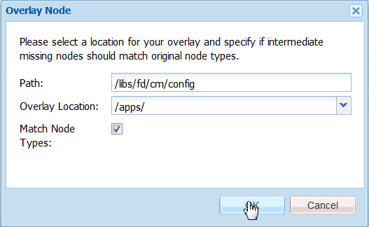

# Personalizza editor di testo{#customize-text-editor}

## Panoramica {#overview}

Puoi personalizzare l’editor di testo, nell’interfaccia di gestione delle risorse e creazione della corrispondenza, per aggiungere altri font e dimensioni di font. Questi font includono inglese e non inglese, ad esempio giapponese, font.

Potete personalizzare le seguenti impostazioni di font:

* Famiglia e dimensione dei font
* Proprietà quali l&#39;altezza e la spaziatura tra le lettere
* Valori predefiniti di famiglia e dimensione del font, altezza, spaziatura tra le lettere e formato della data
* Punti elenco

A tal fine, è necessario:

1. [Personalizzare i font modificando il file tbxeditor-config.xml in CRX](#customizefonts)
1. [Aggiunta di font personalizzati al computer client](#addcustomfonts)

## Personalizzare i font modificando il file tbxeditor-config.xml in CRX {#customizefonts}

Per personalizzare i font modificando il file tbxeditor-config.xml, effettuate le seguenti operazioni:

1. Accedete a `https://'[server]:[port]'/[ContextPath]/crx/de` e accedete come amministratore.
1. Nella cartella delle app, create una cartella denominata config con percorso/struttura simile alla cartella di configurazione, che si trova in libs/fd/cm/config, utilizzando i seguenti passaggi:

   1. Fate clic con il pulsante destro del mouse sulla cartella degli elementi nel percorso seguente e selezionate Nodo **** sovrapposizione:

      `/libs/fd/cm/config`

      

   1. Verificate che la finestra di dialogo Nodo sovrapposizione contenga i seguenti valori:

      **Percorso:** /libs/fd/cm/config

      **Posizione:** /apps/

      **Corrispondenza tipi di nodo:** Selezionato

      

   1. Fai clic su **OK**. La struttura delle cartelle viene creata nella cartella delle app.

   1. Fate clic su **Salva tutto**.

1. Create una copia del file tbxeditor-config.xml nella cartella di configurazione appena creata, eseguendo la procedura seguente:

   1. Fate clic con il pulsante destro del mouse sul file tbxeditor-config.xml in libs/fd/cm/config e selezionate **Copia**.
   1. Fate clic con il pulsante destro del mouse sulla cartella seguente e selezionate **Incolla:**

      `apps/fd/cm/config`

   1. Per impostazione predefinita, il nome del file incollato è `copy of tbxeditor-config.xml.` Rinomina il file in `tbxeditor-config.xml` e fai clic su **Salva tutto**.

1. Aprite il file tbxeditor-config.xml in apps/fd/cm/config e apportate le modifiche necessarie.

   1. Fate doppio clic sul file tbxeditor-config.xml in apps/fd/cm/config. Viene aperto il file.

      ```xml
      <editorConfig>
         <bulletIndent>0.25in</bulletIndent>
      
         <defaultDateFormat>DD-MM-YYYY</defaultDateFormat>
      
         <fonts>
            <default>Times New Roman</default>
            <font>_sans</font>
            <font>_serif</font>
            <font>_typewriter</font>
            <font>Arial</font>
            <font>Courier</font>
            <font>Courier New</font>
            <font>Geneva</font>
            <font>Georgia</font>
            <font>Helvetica</font>
            <font>Tahoma</font>
            <font>Times New Roman</font>
            <font>Times</font>
            <font>Verdana</font>
         </fonts>
      
         <fontSizes>
            <default>12</default>
            <fontSize>8</fontSize>
            <fontSize>9</fontSize>
            <fontSize>10</fontSize>
            <fontSize>11</fontSize>
            <fontSize>12</fontSize>
            <fontSize>14</fontSize>
            <fontSize>16</fontSize>
            <fontSize>18</fontSize>
            <fontSize>20</fontSize>
            <fontSize>22</fontSize>
            <fontSize>24</fontSize>
            <fontSize>26</fontSize>
            <fontSize>28</fontSize>
            <fontSize>36</fontSize>
            <fontSize>48</fontSize>
            <fontSize>72</fontSize>
         </fontSizes>
      
         <lineHeights>
            <default>2</default>     
            <lineHeight>2</lineHeight>
            <lineHeight>3</lineHeight>
            <lineHeight>4</lineHeight>
            <lineHeight>5</lineHeight>
            <lineHeight>6</lineHeight>
            <lineHeight>7</lineHeight>
            <lineHeight>8</lineHeight>
            <lineHeight>9</lineHeight>
            <lineHeight>10</lineHeight>
            <lineHeight>11</lineHeight>
            <lineHeight>12</lineHeight>
            <lineHeight>13</lineHeight>
            <lineHeight>14</lineHeight>
            <lineHeight>15</lineHeight>
            <lineHeight>16</lineHeight>
         </lineHeights>
      
         <letterSpacings>
            <default>0</default>
            <letterSpacing>0</letterSpacing>
            <letterSpacing>1</letterSpacing>
            <letterSpacing>2</letterSpacing>
            <letterSpacing>3</letterSpacing>
            <letterSpacing>4</letterSpacing>
            <letterSpacing>5</letterSpacing>
            <letterSpacing>6</letterSpacing>
            <letterSpacing>7</letterSpacing>
            <letterSpacing>8</letterSpacing>
            <letterSpacing>9</letterSpacing>
            <letterSpacing>10</letterSpacing>
            <letterSpacing>11</letterSpacing>
            <letterSpacing>12</letterSpacing>
            <letterSpacing>13</letterSpacing>
            <letterSpacing>14</letterSpacing>
            <letterSpacing>15</letterSpacing>
            <letterSpacing>16</letterSpacing>
         </letterSpacings>
      </editorConfig>
      ```

   1. Apportate le modifiche necessarie nel file per modificare quanto segue nelle impostazioni dei font:

      * Aggiungere o rimuovere la famiglia e la dimensione dei font
      * Proprietà quali l&#39;altezza e la spaziatura tra le lettere
      * Valori predefiniti di famiglia e dimensione del font, altezza, spaziatura tra le lettere e formato della data
      * Punti elenco

      Ad esempio, per aggiungere un font giapponese denominato Sazanami Mincho Medium, è necessario inserire la voce seguente nel file XML: `<font>Sazanami Mincho Medium</font>`. È inoltre necessario che questo font sia installato nel computer client e utilizzato per accedere e utilizzare la personalizzazione dei font. Per ulteriori informazioni, vedere [Aggiunta di font personalizzati al computer](#addcustomfonts)client.

      Potete inoltre modificare le impostazioni predefinite per vari aspetti del testo e, rimuovendo le voci, rimuovere i font dall’editor di testo.

   1. Fate clic su **Salva tutto**.


## Aggiunta di font personalizzati al computer client {#addcustomfonts}

Quando accedete a un font nell&#39;editor di testo Gestione corrispondenza, deve essere presente nel computer client utilizzato per accedere a Gestione corrispondenza. Per poter utilizzare un font personalizzato nell&#39;editor di testo, è innanzitutto necessario installare lo stesso nel computer client.

Per ulteriori informazioni sull&#39;installazione dei font, consultate i seguenti riferimenti:

* [Installare o disinstallare i font in Windows](https://windows.microsoft.com/en-us/windows-vista/install-or-uninstall-fonts)
* [Mac Basics: Font Book](https://support.apple.com/en-us/HT201749)

## Accesso alle personalizzazioni dei font {#access-font-customizations}

Dopo aver apportato modifiche ai font nel file tbxeditor-config.xml in CRX e installato i font richiesti nel computer client utilizzato per accedere ai AEM Forms, le modifiche vengono visualizzate nell&#39;editor di testo.

Ad esempio, il font Sazanami Mincho Medium aggiunto nei font [Customize modificando il file tbxeditor-config.xml nella procedura CRX](#customizefonts) viene visualizzato nell’interfaccia utente dell’editor di testo come segue:


>[!NOTE]
>
>Per visualizzare il testo in giapponese, è innanzitutto necessario immettere il testo con caratteri giapponesi. L&#39;applicazione di un font giapponese personalizzato formatta solo il testo in un certo modo. L&#39;applicazione di un font giapponese personalizzato non modifica l&#39;inglese o altri caratteri in caratteri giapponesi.

