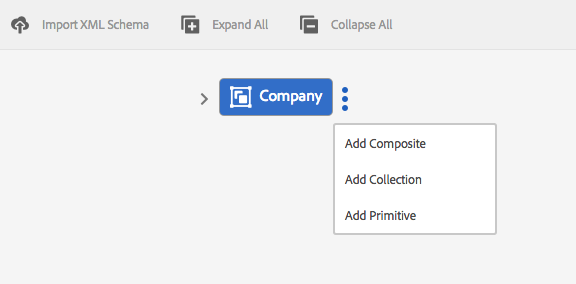
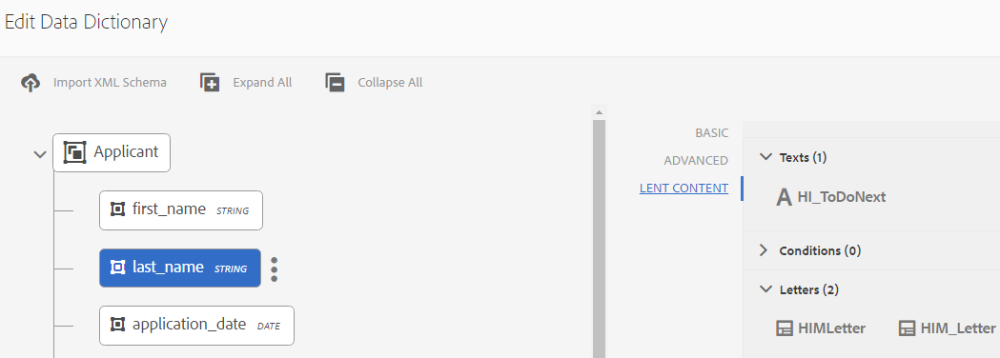

# Dizionario dati{#data-dictionary}

## Introduzione {#introduction}

Un dizionario dati consente agli utenti aziendali di utilizzare informazioni provenienti da origini dati back-end senza conoscere dettagli tecnici sui modelli di dati sottostanti. Un dizionario dati è composto da elementi del dizionario dati (DDE). Questi elementi dati vengono utilizzati per integrare i dati back-end nelle lettere come input da utilizzare nella corrispondenza con i clienti.

Un dizionario dati è una rappresentazione indipendente dei metadati che descrive le strutture di dati sottostanti e i relativi attributi associati. Un dizionario dati viene creato utilizzando il vocabolario aziendale. Può essere mappato a uno o più modelli di dati sottostanti.

Il dizionario dati è costituito da elementi di tre tipi: elementi semplici, compositi e di raccolta. I DDE semplici sono elementi primitivi quali stringhe, numeri, date e valori booleani che contengono informazioni quali il nome di una città. Un DDE composito contiene altri DDE, che possono essere di tipo primitivo, composito o raccolta. Ad esempio, un indirizzo, costituito da un indirizzo stradale, città, provincia, paese e codice postale. Una raccolta è un elenco di DDE semplici o compositi simili. Ad esempio, un cliente con più ubicazioni o diversi indirizzi di fatturazione e spedizione.

Gestione della corrispondenza utilizza i dati back-end, specifici del cliente o del destinatario memorizzati in base alla struttura del dizionario dati per creare corrispondenza destinata a clienti diversi. Ad esempio, è possibile creare un documento con nomi descrittivi, ad esempio &quot;Gentile {First Name}&quot;,&quot;Sig. {Cognome}&quot;.

In genere, gli utenti aziendali non devono conoscere le rappresentazioni di metadati come XSD (XML Schema) e le classi Java. Tuttavia, in genere richiedono l’accesso a tali strutture di dati e attributi per creare soluzioni.

### Flusso di lavoro del dizionario dati {#data-dictionary-workflow}

1. Un Autore [crea il dizionario dati](#createdatadictionary) caricando uno schema o da zero.
1. L’Autore crea comunicazioni lettera e interattive in base al dizionario dati e associa gli elementi del dizionario dati nella lettera e nelle comunicazioni interattive laddove necessario.
1. Un autore può scaricare un file XML di dati di esempio, basato sullo schema di un dizionario di dati. L’autore può modificare il file XML dei dati di esempio, che può essere associato come dati di test al dizionario dati. Lo stesso viene utilizzato durante l’anteprima della lettera.
1. Mentre [anteprima di una lettera](../../forms/using/create-letter.md#p-types-of-linkage-available-for-each-of-the-fields-p), un autore sceglie di visualizzare in anteprima la lettera con i dati (anteprima personalizzata). La lettera viene aperta precompilata con i dati forniti dall’autore. Si apre nell’interfaccia per la creazione di corrispondenza. L&#39;agente che visualizza l&#39;anteprima di questa lettera può modificare il contenuto, i dati e gli allegati di questa lettera e può inviare la lettera finale. Per ulteriori informazioni sulla creazione di lettere, vedere [Creare corrispondenza](../../forms/using/create-letter.md).

## Prerequisito {#prerequisite}

Installare [Pacchetto di compatibilità](compatibility-package.md) per visualizzare **Dizionari dati** opzione sul **Forms** pagina.

## Creare un dizionario dati {#createdatadictionary}

Utilizza l’Editor del dizionario dati per creare un dizionario dati oppure puoi caricare un file di schema XSD per creare un dizionario dati basato su questo. Puoi quindi estendere il dizionario dati aggiungendo ulteriori informazioni richieste, inclusi i campi. Indipendentemente da come è stato creato il dizionario dati, il proprietario del processo aziendale non ha bisogno di conoscere i sistemi back-end. Il proprietario del processo aziendale richiede solo la conoscenza degli oggetti del dominio e delle relative definizioni per il processo.

>[!NOTE]
>
>Per più lettere che richiedono elementi simili, puoi creare un dizionario dati comune. Un dizionario dati di grandi dimensioni con un numero elevato di elementi può tuttavia causare problemi di prestazioni quando si utilizza il dizionario dati e si caricano gli elementi, ad esempio in lettere e frammenti di documento. In caso di problemi di prestazioni, provare a creare dizionari dati separati per lettere diverse.

1. Seleziona **Forms** > **Dizionari dati**.
1. Tocca **Crea dizionario dati**.
1. Nella schermata Proprietà, aggiungi quanto segue:

   * **Titolo:** (Facoltativo) Immetti il titolo del dizionario dati. Il titolo non deve necessariamente essere univoco e può contenere caratteri speciali e non inglesi. Alle lettere e agli altri frammenti di documento viene fatto riferimento con il relativo titolo (se disponibile), ad esempio nelle proprietà delle miniature e delle risorse. I dizionari dati sono indicati con i relativi nomi e non con i titoli.
   * **Nome:** Nome univoco del dizionario dati. Nel campo Nome è possibile immettere solo caratteri, numeri e trattini in lingua inglese. Il campo Nome viene compilato automaticamente in base al campo Titolo e i caratteri speciali, gli spazi, i numeri e i caratteri non inglesi immessi nel campo Titolo vengono sostituiti da trattini. Anche se il valore nel campo Titolo viene copiato automaticamente nel Nome, è possibile modificarlo.

   * **Descrizione**: (facoltativo) descrizione del dizionario dati.
   * **Tag:** (Facoltativo) Per creare un tag personalizzato, immetti il valore nel campo di testo e premi Invio. Puoi visualizzare il tag sotto il campo di testo dei tag. Quando salvi questo testo, vengono creati anche i nuovi tag aggiunti.
   * **Proprietà estese**: (Facoltativo) Tocca **Aggiungi campo** per specificare gli attributi dei metadati per il dizionario dati. Nella colonna Nome proprietà immettere un nome di proprietà univoco. Nella colonna Valore immettere un valore da associare alla proprietà.

   

1. (Facoltativo) Per caricare una definizione dello schema XSD per il dizionario dati, nel riquadro Data Dictionary Structure, tocca **Carica schema XML**. Individua il file XSD, selezionalo e tocca **Apri**. Un dizionario dati viene creato in base allo schema XML caricato. È necessario modificare i nomi visualizzati e le descrizioni degli elementi nel dizionario dati. A questo scopo, seleziona i nomi degli elementi toccandoli e modificane le descrizioni, i nomi visualizzati e altri dettagli nei campi del riquadro a destra.

   Per ulteriori informazioni sugli elementi DD calcolati, consulta [Elementi dizionario dati calcolati](#computedddelements).

   >[!NOTE]
   >
   >Puoi saltare il caricamento del file dello schema e creare il dizionario dati da zero utilizzando l’interfaccia utente di. Per eseguire questa operazione, salta questo passaggio e continua con i passaggi successivi.

1. Tocca **Successivo**.
1. Nella schermata Aggiungi proprietà, aggiungi gli elementi al dizionario dati. Puoi anche aggiungere/eliminare elementi e modificarne i dettagli, se hai caricato uno schema per ottenere una struttura di base del dizionario dati.

   Tocca i tre punti a destra di un elemento e aggiungi un elemento alla struttura del dizionario dati.

   

   Selezionare Elemento composito, Elemento di raccolta o Elemento primitivo.

   * Un DDE composito contiene altri DDE che possono essere di tipo primitivo, composito o raccolta. Ad esempio, un indirizzo, costituito da un indirizzo stradale, città, provincia, paese e codice postale.
   * I DDE di base sono elementi quali stringhe, numeri, date e valori booleani che contengono informazioni quali il nome di una città.
   * Una raccolta è un elenco di DDE semplici o compositi simili. Ad esempio, un cliente con più ubicazioni o diversi indirizzi di fatturazione e spedizione.

   Di seguito sono riportate alcune regole per la creazione di un dizionario dati:

   * Solo il tipo composito è consentito come DDE di livello superiore in un dizionario dati.
   * Nome, nome di riferimento e tipo di elemento sono campi obbligatori per un dizionario dati e DDE.
   * Il nome di riferimento deve essere univoco.
   * Un DDE padre (composito) non può avere due figli con lo stesso nome.
   * Le enumerazioni contengono solo tipi String primitivi.

   Per ulteriori informazioni sugli elementi compositi, di raccolta e primitivi e sull’utilizzo degli elementi del dizionario dati, consulta [Mappatura degli elementi del dizionario dati allo schema XML](#mappingddetoschema).

   Per informazioni sulle convalide nel dizionario dati, vedi [Convalide dell’editor del dizionario dati](#ddvalidations).

   

1. (Facoltativo) Dopo aver selezionato un elemento, nella scheda Avanzate puoi aggiungere proprietà (attributi). Puoi anche toccare **Aggiungi campo** ed estendere le proprietà di un elemento DD.

   

1. (Facoltativo) Per rimuovere un elemento, tocca i tre punti sul lato destro di un elemento e seleziona **Elimina**.

   

   >[!NOTE]
   >
   >Se si elimina un elemento composito o di raccolta con nodi figlio, verranno eliminati anche i relativi nodi figlio.

1. (Facoltativo) Seleziona un elemento nel riquadro Struttura del dizionario dati e nel pannello Elenco campi e variabili. Modifica o aggiungi eventuali attributi obbligatori associati all’elemento.
1. Tocca **Salva**.

### Creare copie di uno o più dizionari di dati {#create-copies-of-one-or-more-data-dictionary}

Per creare rapidamente uno o più dizionari dati con proprietà ed elementi simili a quelli dei dizionari dati esistenti, è possibile copiarli e incollarli.

1. Selezionare i dizionari dati appropriati dall&#39;elenco dei dizionari dati. Nell’interfaccia utente viene visualizzata l’icona Copia.
1. Tocca Copia. Nell’interfaccia viene visualizzata l’icona Incolla.
1. Tocca Incolla. Viene visualizzata la finestra di dialogo Incolla. Il sistema assegna automaticamente un nome e un titolo ai nuovi dizionari dati.
1. Se necessario, modificare il Titolo e il Nome con cui si desidera salvare la copia del dizionario dati.
1. Tocca Incolla. Viene creata la copia del dizionario dati. Ora puoi apportare le modifiche richieste nel dizionario dati appena creato.

## Visualizzare i frammenti di documento o i documenti che fanno riferimento a un elemento del dizionario dati {#see-the-document-fragments-or-documents-that-refer-to-a-data-dictionary-element}

Durante la modifica o la visualizzazione di un dizionario dati, è possibile vedere a quali elementi del dizionario dati fanno riferimento testi, condizioni, lettere e comunicazioni interattive.

1. Per modificare il dizionario dati, effettuare una delle seguenti operazioni:

   * Passa il puntatore del mouse su un dizionario dati e tocca Modifica.
   * Seleziona un dizionario dati, quindi tocca Modifica nell’intestazione.
   * Passa il puntatore del mouse su un dizionario dati e tocca Seleziona. Quindi tocca Modifica nell’intestazione.

   In alternativa, tocca un dizionario dati per visualizzarlo.

1. Nel dizionario dati, tocca un elemento semplice per selezionarlo. Gli elementi compositi e di raccolta non dispongono di riferimenti.

   Insieme alle proprietà di base e avanzate dell’elemento, viene visualizzato anche Contenuto prestato.

1. Toccare Contenuto prestato.

   Viene visualizzata la scheda Contenuto prestato con le informazioni seguenti: Testi, Condizioni, Lettere e Comunicazioni interattive. Ognuna di queste intestazioni visualizza anche il numero di riferimenti all’elemento selezionato.

1. Tocca un’intestazione per visualizzare il nome delle risorse che fanno riferimento all’elemento.

   

1. Per visualizzare il contenuto prestato per un altro elemento, tocca l’elemento.
1. Per visualizzare una risorsa che fa riferimento all’elemento, tocca il suo nome. Il browser visualizza la risorsa, la lettera o la comunicazione interattiva.

## Utilizzo dei dati di test {#working-with-test-data}

1. Nella pagina Dizionari di dati, tocca **Seleziona**.
1. Tocca un dizionario dati per il quale vuoi scaricare i dati di prova, quindi tocca **Scarica dati XML di esempio**.
1. Tocca **OK** nel messaggio di avviso. Viene scaricato un file XML.
1. Aprire il file XML con il Blocco note o un altro editor XML. Il file XML ha la stessa struttura del dizionario dati e delle stringhe segnaposto negli elementi. Sostituire le stringhe segnaposto con i dati con cui si desidera verificare una lettera.

   ```xml
   <?xml version="1.0" encoding="UTF-8" standalone="no"?>
   <Company>
   <Name>string</Name>
   <Type>string</Type>
   <HeadOfficeAddress>
   <Street>string</Street>
   <City>string</City>
   <State>string</State>
   <Zip>string</Zip>
   </HeadOfficeAddress>
   <SalesOfficeAddress>
   <Street>string</Street>
   <City>string</City>
   <State>string</State>
   <Zip>string</Zip>
   </SalesOfficeAddress>
   <HeadCount>1.0</HeadCount>
   <CEO>
   <PersonName>
   <FirstName>string</FirstName>
   <MiddleName>string</MiddleName>
   <LastName>string</LastName>
   </PersonName>
   <DOB>string</DOB>
   <CurrAddress>
   <Street>string</Street>
   <City>string</City>
   <State>string</State>
   <Zip>string</Zip>
   </CurrAddress>
   <DOJ>14-04-1973</DOJ>
   <Phone>1.0</Phone>
   </CEO>
   </Company>
   ```

   >[!NOTE]
   >
   >In questo esempio, il codice XML crea spazio per tre valori in un elemento di raccolta, ma il numero di valori può essere aumentato o diminuito in base al requisito.

1. Dopo aver inserito i dati, è possibile utilizzare questo file XML quando si visualizza l&#39;anteprima di una lettera con i dati di test.

   Puoi aggiungere questi dati di test con DD (seleziona DD e tocca Carica dati di test e carica questo file xml). Dopo questa operazione, quando visualizzi l’anteprima della lettera normalmente (non personalizzata), questi dati XML vengono utilizzati nella lettera. Puoi anche toccare Personalizza e quindi caricare questo XML.

## Esempi {#samples}

Gli esempi di codice seguenti mostrano i dettagli di implementazione per il dizionario dati.

### Schema di esempio che può essere caricato nel dizionario dati {#sample-schema-that-can-be-uploaded-to-the-data-dictionary}

```xml
<?xml version="1.0" encoding="utf-8"?>
<xs:schema xmlns="DCT" targetNamespace="DCT" xmlns:xs="https://www.w3.org/2001/XMLSchema"
  elementFormDefault="qualified" attributeFormDefault="unqualified">
  <xs:element name="Company">
    <xs:complexType>
      <xs:sequence>
        <xs:element name="Name" type="xs:string"/>
        <xs:element name="Type" type="xs:anySimpleType"/>
        <xs:element name="HeadOfficeAddress" type="Address"/>
        <xs:element name="SalesOfficeAddress" type="Address" minOccurs="0"/>
        <xs:element name="HeadCount" type="xs:integer"/>
        <xs:element name="CEO" type="Employee"/>
        <xs:element name="Workers" type="Employee" maxOccurs="unbounded"/>
      </xs:sequence>
    </xs:complexType>
  </xs:element>
  <xs:complexType name="Employee">
    <xs:complexContent>
      <xs:extension  base="Person">
        <xs:sequence>
          <xs:element name="CurrAddress" type="Address"/>
          <xs:element name="DOJ" type="xs:date"/>
          <xs:element name="Phone" type="xs:integer"/>
        </xs:sequence>
      </xs:extension>
    </xs:complexContent>
  </xs:complexType>
  <xs:complexType name="Person">
    <xs:sequence>
      <xs:element name="PersonName" type="Name"/>
      <xs:element name="DOB" type="xs:dateTime"/>
    </xs:sequence>
  </xs:complexType>
  <xs:complexType name="Name">
    <xs:sequence>
      <xs:element name="FirstName" type="xs:string"/>
      <xs:element name="MiddleName" type="xs:string"/>
      <xs:element name="LastName" type="xs:string"/>
    </xs:sequence>
  </xs:complexType>
  <xs:complexType name="Address">
    <xs:sequence>
      <xs:element name="Street" type="xs:string"/>
      <xs:element name="City" type="xs:string"/>
      <xs:element name="State" type="xs:string"/>
      <xs:element name="Zip" type="xs:string"/>
    </xs:sequence>
  </xs:complexType>
</xs:schema>
```

## Attributi comuni associati a un DDE {#common-attributes-associated-with-a-dde}

La tabella seguente descrive gli attributi comuni associati a un DDE:

<table>
 <tbody>
  <tr>
   <td><strong>Attributo</strong></td>
   <td><strong>Tipo</strong></td>
   <td><strong>Descrizione</strong></td>
  </tr>
  <tr>
   <td>Nome</td>
   <td>Stringa</td>
   <td>Obbligatorio.<br /> Nome del DDE. Deve essere univoco.</td>
  </tr>
  <tr>
   <td>Riferimento<br /> Nome</td>
   <td>Stringa</td>
   <td>Obbligatorio. Nome di riferimento univoco per il DDE che consente riferimenti al DDE indipendenti dalle modifiche apportate alla gerarchia o alla struttura del dizionario dati. I moduli di testo sono mappati con questo nome</td>
  </tr>
  <tr>
   <td>displayname</td>
   <td>Stringa</td>
   <td>Nome descrittivo facoltativo del DDE.</td>
  </tr>
  <tr>
   <td>descrizione</td>
   <td>Stringa</td>
   <td>Descrizione del DDE.</td>
  </tr>
  <tr>
   <td>elementType</td>
   <td>Stringa</td>
   <td>Obbligatorio. Il tipo di DDE: STRING, NUMBER, DATE, Boolean, COMPOSITE, COLLECTION.</td>
  </tr>
  <tr>
   <td>elementSubType</td>
   <td>Stringa</td>
   <td>Il sottotipo per DDE: ENUM. Consentito solo per STRING e NUMBER elementType.</td>
  </tr>
  <tr>
   <td>Chiave</td>
   <td>Booleano</td>
   <td>Un campo booleano per indicare se un DDE è un elemento chiave.</td>
  </tr>
  <tr>
   <td>Calcolati</td>
   <td>Booleano</td>
   <td>Campo booleano per indicare se viene calcolato un DDE. Un valore DDE calcolato è una funzione di altri valori DDE. Per impostazione predefinita, sono supportate le espressioni jsp.</td>
  </tr>
  <tr>
   <td>espressione</td>
   <td>Stringa</td>
   <td>Espressione per il DDE "calcolato". Il servizio di valutazione delle espressioni fornito per impostazione predefinita supporta le espressioni JSP EL. Puoi sostituire il servizio di espressioni con un’implementazione personalizzata.</td>
  </tr>
  <tr>
   <td>valueSet</td>
   <td>Elenco</td>
   <td>Set di valori consentiti per un DDE di tipo Enum. Ad esempio, il tipo di conto può avere solo valori (Salvataggio, Corrente).</td>
  </tr>
  <tr>
   <td>extendedProperties</td>
   <td>Oggetto</td>
   <td>Una mappa delle proprietà personalizzate aggiunte al DDE (specifiche dell’interfaccia utente o altre informazioni).</td>
  </tr>
  <tr>
   <td>Obbligatorio</td>
   <td>Booleano</td>
   <td>Il flag indica che l’origine dei dati dell’istanza corrispondenti al dizionario dati deve contenere il valore di questo particolare DDE.</td>
  </tr>
  <tr>
   <td>Associazione</td>
   <td>BindingElement</td>
   <td>Associazione XML o Java dell'elemento.</td>
  </tr>
 </tbody>
</table>

### Elementi dizionario dati calcolati {#computedddelements}

Un dizionario dati può includere anche elementi calcolati. Un elemento dizionario dati calcolato è sempre associato a un’espressione. Questa espressione viene valutata per ottenere il valore di un elemento del dizionario dati in fase di esecuzione. Un valore DDE calcolato è una funzione di altri valori o valori letterali DDE. Per impostazione predefinita, sono supportate le espressioni EL (JSP Expression Language). Le espressioni EL utilizzano i caratteri ${ } e le espressioni valide possono includere valori letterali, operatori, variabili (riferimenti agli elementi del dizionario dati) e chiamate di funzione. Quando si fa riferimento a un elemento del dizionario dati nell’espressione, viene utilizzato il nome di riferimento del DDE. Il nome di riferimento è univoco per ogni elemento del dizionario dati all’interno di un dizionario dati.

È possibile associare un valore DDE PersonFullName calcolato a un&#39;espressione di concatenazione EL come ${PersonFirstName} ${PersonLastName}.

## Mappatura del tipo di dati tra XSD e il dizionario dati {#data-type-mapping-between-xsd-and-data-dictionary-br}

L’esportazione di un XSD richiede una mappatura dei dati specifica, descritta nella tabella seguente. La colonna DDI indica il tipo di valore DDE disponibile nell&#39;unità DDI.

<table>
 <tbody>
  <tr>
   <td>XSD <br /> </td>
   <td><p>Dizionario dati <br /> </p> </td>
   <td>DDI (Instance Value Data Type)<br /> </p> </td>
  </tr>
  <tr>
   <td><p>xs:element of type - Composite Type<br /> </p> </td>
   <td>DDE di tipo - COMPOSITE<br /> </p> </td>
   <td>java.util.Map<br /> </td>
  </tr>
  <tr>
   <td><p>xs:element dove maxOccurs &gt; 1<br /> </p> </td>
   <td>DDE di tipo - COLLECTION-<br /> Accanto al DDE COLLECTION viene creato un nodo DDE che acquisisce informazioni dal nodo COLLECTION padre. Lo stesso viene creato per entrambe le raccolte di tipi di dati semplici/compositi. Ogni volta che si dispone di una COLLECTION del tipo composito, la struttura del dizionario dati acquisisce i campi costitutivi negli elementi figlio del DDE creato per acquisire informazioni sul tipo.<br /> - DDE (RACCOLTA)<br /> - DDE(COMPOSITE per informazioni sul tipo)<br /> - Campo DDE(STRING) 1<br /> - Campo DDE(STRING) 2<br /> <br /> </p> </td>
   <td>java.util.List<br /> </td>
  </tr>
  <tr>
   <td>Attributo di tipo - xs:id <br /> </p> </td>
   <td>DDE di tipo - STRING <br /> </td>
   <td>java.lang.String<br /> </td>
  </tr>
  <tr>
   <td>xs:attribute /xs:element di tipo - xs:string</p> </td>
   <td>DDE di tipo - STRING<br /> </td>
   <td>java.lang.String<br /> </td>
  </tr>
  <tr>
   <td>xs:attribute /xs:element di tipo - xs: booleano <br /> </td>
   <td>DDE di tipo - Booleano <br /> </td>
   <td>java.lang.Boolean<br /> </td>
  </tr>
  <tr>
   <td>xs:attribute /xs:elemento di tipo - xs:date </td>
   <td>DDE di tipo - DATE </td>
   <td>java.lang.String</td>
  </tr>
  <tr>
   <td>xs:attribute /xs:element di tipo - xs:integer </td>
   <td>DDE di tipo - NUMBER </td>
   <td>java.lang.Double</td>
  </tr>
  <tr>
   <td>xs:attribute /xs:element di tipo - xs:long</td>
   <td>DDE di tipo - NUMBER </td>
   <td>java.lang.Double</td>
  </tr>
  <tr>
   <td>xs:attribute /xs:element di tipo - xs:double</td>
   <td>DDE di tipo - NUMBER </td>
   <td>java.lang.Double</td>
  </tr>
  <tr>
   <td>Elemento di tipo enum e baseType - xs:string</td>
   <td>DDE di<br /> type - STRING<br /> subtype - ENUM<br /> valueSet: i valori consentiti per ENUM<br /> </td>
   <td>java.lang.String</td>
  </tr>
 </tbody>
</table>

## Scaricare un file di dati di esempio da un dizionario dati {#download-a-sample-data-file-from-a-data-dictionary}

Dopo aver creato un dizionario dati, è possibile scaricarlo come file di dati di esempio XML per inserire voci di testo.

1. Nella pagina Dizionari di dati, tocca **Seleziona** quindi tocca un dizionario dati per selezionarlo.
1. Seleziona **Scarica dati XML di esempio**.
1. Tocca **OK** nel messaggio di avviso.

   Gestione corrispondenza crea un file XML basato sulla struttura del dizionario dati selezionato e lo scarica nel computer con il nome &lt;data-dictionary-name>-SampleData. Ora è possibile modificare questo file in un editor XML o di testo per effettuare immissioni di dati mentre [creazione lettera](../../forms/using/create-letter.md).

## Internazionalizzazione dei metadati {#internationalization-of-meta-data}

Quando desideri inviare ai clienti la stessa lettera in lingue diverse, puoi localizzare i set di valori nome visualizzato, descrizione ed enum degli elementi del dizionario dati e del dizionario dati.

### Localizza dizionario dati {#localize-data-dictionary}

1. Nella pagina Dizionari di dati, tocca **Seleziona** quindi tocca un dizionario dati per selezionarlo.
1. Tocca **Scarica dati di localizzazione**.
1. Tocca **OK** nell&#39;avviso. Gestione corrispondenza scarica un file zip sul computer con il nome DataDictionary-&lt;ddname>.zip.
1. Il file ZIP contiene un file con estensione properties. Questo file definisce il dizionario dati scaricato. Il contenuto del file delle proprietà è simile al seguente:

   ```ini
   #Wed May 20 16:06:23 BST 2015
   DataDictionary.EmployeeDD.description=
   DataDictionary.EmployeeDD.displayName=EmployeeDataDictionary
   DataDictionaryElement.name.description=
   DataDictionaryElement.name.displayName=name
   DataDictionaryElement.person.description=
   DataDictionaryElement.person.displayName=person
   ```

   La struttura del file delle proprietà definisce una riga per la descrizione e il nome visualizzato per il dizionario dati e per ogni elemento del dizionario dati nel dizionario dati. Inoltre, il file delle proprietà definisce una riga per un valore enum impostato per ciascun elemento del dizionario dati. Come per un dizionario dati, il file delle proprietà corrispondente può avere più definizioni di elementi del dizionario dati. Inoltre, il file può contenere le definizioni per uno o più set di valori enum.

1. Per aggiornare il file con estensione properties in una lingua diversa, aggiornare il nome visualizzato e i valori della descrizione nel file. Crea più istanze del file per ogni lingua che desideri localizzare in. Sono supportate solo le lingue francese, tedesco, giapponese e inglese.

1. Salva i diversi file di proprietà aggiornati con i seguenti nomi:

   _fr_FR.properties Francese

   _de_DE.properties Tedesco

   _ja_JA.properties Giapponese

   _en_EN.properties Inglese

1. Archivia il file con estensione properties (o i file per più lingue) in un unico file con estensione zip.

1. Nella pagina Dizionari di dati, seleziona **Altro** > **Carica dati di localizzazione** e seleziona il file zip con i file delle proprietà localizzate.
1. Per visualizzare le modifiche di localizzazione, modifica le impostazioni internazionali del browser.

## Convalide del dizionario dati {#ddvalidations}

Durante la creazione o l’aggiornamento di un dizionario dati, l’Editor del dizionario dati applica le seguenti convalide.

* Solo il tipo composito è consentito come elemento di livello superiore in un dizionario dati.
* Gli elementi compositi e di raccolta non sono consentiti a livello foglia. Solo gli elementi primitivi (stringa, data, numero, booleani) sono consentiti a livello foglia. Questa convalida garantisce che non vi siano elementi compositi e di raccolta senza un DDE figlio.
* Durante il caricamento di un file XSD per creare un dizionario dati, l’Editor del dizionario dati richiede un elemento di livello superiore, se esistono più elementi, per creare il dizionario dati.
* Il nome è l’unico parametro obbligatorio per un dizionario dati.
* Un DDE padre (composito) non può avere due figli con lo stesso nome
* Assicura che un DDE sia contrassegnato come calcolato solo se non è un parametro obbligatorio. Non è possibile calcolare un elemento obbligatorio né un elemento calcolato. Inoltre, la raccolta e l’elemento composito non possono essere elementi calcolati.
* Assicura che un DDE sia contrassegnato come obbligatorio solo quando non viene calcolato. Inoltre, assicura che non sia &quot;collectionElement&quot; che denota il tipo di insieme, ovvero gli unici elementi figlio di un elemento di insieme.
* Le chiavi vuote o duplicate non sono consentite in extendedProperties per un dizionario dati o DDE.
* Non utilizzare i caratteri due punti (:) o barra verticale(|) all’interno della chiave o del valore di una proprietà estesa. Non esiste alcuna convalida per l’uso di questi caratteri non consentiti.

Convalide applicate a livello del dizionario dati

* Il nome del dizionario dati non può essere nullo.
* Il nome del dizionario dati può contenere solo caratteri alfanumerici.
* L’elenco degli elementi figlio nel dizionario dati non può essere nullo o vuoto.
* Il dizionario dati non può contenere più di un elemento del dizionario dati di livello principale.
* Solo il tipo composito è consentito come elemento di livello superiore in un dizionario dati.

Convalide applicate a livello dell’elemento del dizionario dati.

* Tutti i nomi DDE non possono essere Null e non possono contenere spazi.
* Tutti i DDE devono avere un tipo di elemento &quot;not null/non null&quot;.
* Tutti i nomi di riferimento DDE non possono essere null.
* Tutti i nomi di riferimento DDE devono essere univoci.
* Tutti i riferimenti DDE devono contenere solo caratteri alfanumerici e &quot;_&quot;.
* Tutti i nomi visualizzati DDE devono contenere solo caratteri alfanumerici e &quot;_&quot;.
* Gli elementi compositi e di raccolta non sono consentiti a livello foglia. Solo gli elementi primitivi (stringa, data, numero, booleani) sono consentiti a livello foglia. Questa convalida garantisce che non vi siano elementi compositi e di raccolta senza un DDE figlio.
* Un DDE padre composito non deve avere due elementi figlio con lo stesso nome.
* Il sottotipo ENUM viene utilizzato solo per gli elementi String e Number.
* Impossibile calcolare gli elementi di raccolta e compositi.
* Un DDE non può essere calcolato e richiesto allo stesso tempo.
* I DDE calcolati devono contenere un&#39;espressione valida.
* I DDE calcolati non devono avere un&#39;associazione XML.
* Non è possibile calcolare o richiedere un DDE che indica il tipo di un DDE di raccolta.
* I DDE del sottotipo ENUM non devono contenere set di valori Null o vuoti.
* L&#39;associazione XML di un DDE della raccolta non deve essere mappata a un attributo.
* La sintassi di associazione XML deve essere valida, ad esempio deve essere visualizzata una sola @, la @ è consentita solo se seguita da un nome di attributo.

## Mappatura degli elementi del dizionario dati allo schema XML {#mappingddetoschema}

È possibile creare un dizionario dati da uno schema XML o generarlo utilizzando l’interfaccia utente del dizionario dati. Tutti gli elementi del dizionario dati (DDE) all’interno di un dizionario dati dispongono di un campo di associazione XML per memorizzare l’associazione del DDE a un elemento nello schema XML. L&#39;associazione in ogni DDE è relativa al DDE padre.

Di seguito sono riportati alcuni modelli di esempio ed esempi di codice che mostrano i dettagli di implementazione per il dizionario dati.

## Mappatura di elementi semplici (di base) {#mapping-simple-primitive-elements}

Un DDE primitivo rappresenta un campo o un attributo di natura atomica. I DDE primitivi definiti al di fuori dell&#39;ambito di un tipo complesso (DDE composito) o di un elemento ripetuto (DDE di raccolta) possono essere memorizzati in qualsiasi posizione all&#39;interno dello schema XML. La posizione dei dati corrispondenti a un DDE primitivo non dipende dalla mappatura del relativo DDE padre. DDE primitivo utilizza le informazioni di mapping del campo di associazione XML per determinarne il valore e i mapping si traducono in uno dei seguenti elementi:

* un attributo
* un elemento
* un contesto di testo
* niente (un DDE ignorato)

L’esempio seguente mostra uno schema semplice.

```xml
<?xml version="1.0" encoding="UTF-8"?>
<xs:schema xmlns:xs="https://www.w3.org/2001/XMLSchema">
  <xs:element name='age' type='integer'/>
  <xs:element name='price' type='decimal'/>
</xs:schema>
```

| **Elemento dizionario dati** | **Associazione XML predefinita** |
|---|---|
| età | /età |
| prezzo | /prezzo |

### Mappatura di elementi compositi {#mapping-composite-elements}

L&#39;associazione non è supportata per gli elementi compositi. Se viene specificata l&#39;associazione, questa verrà ignorata. Il binding di tutti i DDE figli di tipo primitivo deve essere assoluto. Consentendo la mappatura assoluta per gli elementi figlio di un DDE composito si ottiene una maggiore flessibilità in termini di binding XPath. La mappatura di un DDE composito a un elemento di tipo complesso nello schema XML limita l&#39;ambito dell&#39;associazione per i relativi elementi figlio.

Nell&#39;esempio seguente viene illustrato lo schema di una nota.

```xml
<xs:element name="note">
    <xs:complexType>
        <xs:sequence>
            <xs:element name="to" type="xs:string"/>
            <xs:element name="from" type="xs:string"/>
            <xs:element name="heading" type="xs:string"/>
            <xs:element name="body" type="xs:string"/>
        </xs:sequence>
    </xs:complexType>
</xs:element>
```

<table>
 <tbody>
  <tr>
   <td><strong>Elemento dizionario dati</strong></td>
   <td><strong>Associazione XML predefinita</strong></td>
  </tr>
  <tr>
   <td>nota</td>
   <td>empty(null)<br /> </td>
  </tr>
  <tr>
   <td>a</td>
   <td>/note/to</td>
  </tr>
  <tr>
   <td>da</td>
   <td>/note/from</td>
  </tr>
  <tr>
   <td>intestazione</td>
   <td>/note/header</td>
  </tr>
  <tr>
   <td>corpo</td>
   <td>/note/body</td>
  </tr>
 </tbody>
</table>

### Mappatura degli elementi di raccolta {#mapping-collection-elements}

Un elemento di raccolta è mappato solo a un altro elemento di raccolta con cardinalità > 1. I DDE figlio di un insieme DDE dispongono di un&#39;associazione XML relativa (locale) rispetto all&#39;associazione XML padre. Poiché i DDE figlio di un elemento di raccolta devono avere la stessa cardinalità di quella dell&#39;elemento padre, l&#39;associazione relativa è obbligatoria per garantire il vincolo di cardinalità in modo che i DDE figlio non puntino a un elemento schema XML non ripetuto. Nell’esempio seguente, la cardinalità di &quot;TokenID&quot; deve essere uguale a &quot;Tokens&quot;, che è il DDE della raccolta principale.

Quando si esegue il mapping di un DDE della raccolta a un elemento dello schema XML:

* l&#39;associazione per il DDE corrispondente all&#39;elemento Collection deve essere XPath assoluto

* Non fornire alcuna associazione per il DDE che rappresenta il tipo di elemento Collection. Se fornito, il binding verrà ignorato.

* L&#39;associazione per tutti i DDE figlio dell&#39;elemento Collection deve essere relativa all&#39;elemento Collection padre.

Lo schema XML riportato di seguito dichiara un elemento con il nome Tokens e l&#39;attributo maxOccurs &quot;unbounded&quot;. Pertanto, Tokens è un elemento di raccolta.

```xml
<?xml version="1.0" encoding="utf-8"?>
<Root>
  <Tokens>
    <TokenID>string</TokenID>
    <TokenText>
      <TextHeading>string</TextHeading>
      <TextBody>string</TextBody>
    </TokenText>
  </Tokens>
  <Tokens>
    <TokenID>string</TokenID>
    <TokenText>
      <TextHeading>string</TextHeading>
      <TextBody>string</TextBody>
    </TokenText>
  </Tokens>
  <Tokens>
    <TokenID>string</TokenID>
    <TokenText>
      <TextHeading>string</TextHeading>
      <TextBody>string</TextBody>
    </TokenText>
  </Tokens>
</Root>
```

Il Token.xsd associato a questo esempio è:

```xml
<xs:element name="Root">
  <xs:complexType>
    <xs:sequence>
      <xs:element name="Tokens" type="TokenType" maxOccurs="unbounded"/>
    </xs:sequence>
  </xs:complexType>
</xs:element>

<xs:complexType name="TokenType">
  <xs:sequence>
    <xs:element name="TokenID" type="xs:string"/>
    <xs:element name="TokenText">
      <xs:complexType>
        <xs:sequence>
          <xs:element name="TextHeading" type="xs:string"/>
          <xs:element name="TextBody" type="xs:string"/>
        </xs:sequence>
      </xs:complexType>
    </xs:element>
  </xs:sequence>
</xs:complexType>
```

| **Elemento dizionario dati** | **Associazione XML predefinita** |
|---|---|
| Directory principale | empty(null) |
| Token | /Root/Tokens |
| Composito | empty(null) |
| TokenID | TokenID |
| TokenText | empty(null) |
| TokenHeading | TokenText/TextHeading |
| TokenBody | TokenText/TextBody |
