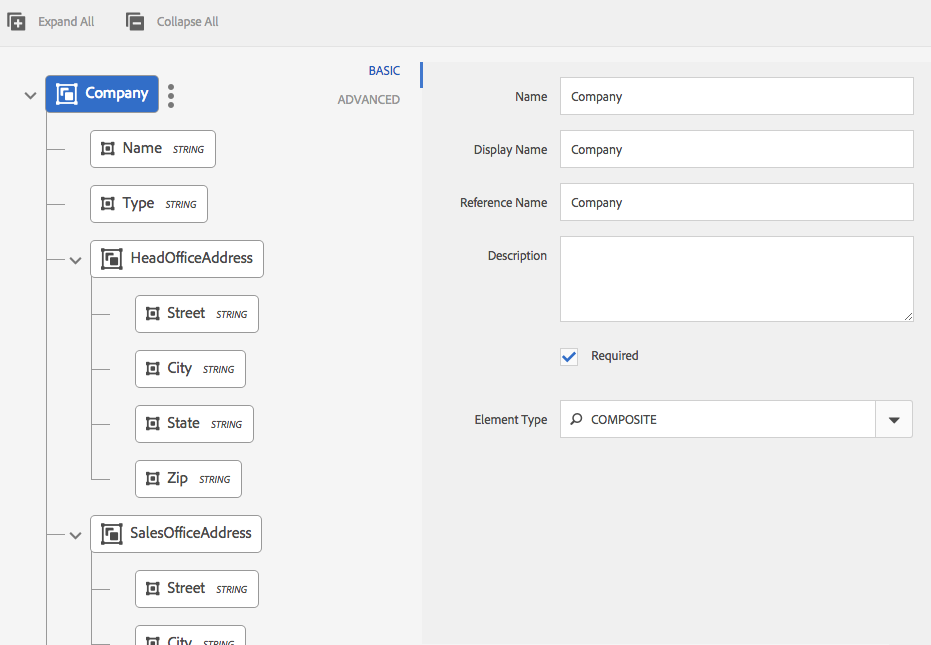

# Dizionario dati{#data-dictionary}

## Introduzione {#introduction}

Un dizionario dati consente agli utenti aziendali di utilizzare le informazioni provenienti da origini dati back-end senza conoscere i dettagli tecnici sui modelli di dati sottostanti. Un dizionario dati è composto da elementi del dizionario dati (DDE). Questi elementi dati vengono utilizzati per integrare i dati di back-end alle lettere come input da utilizzare nella corrispondenza del cliente.

Un dizionario dati è una rappresentazione indipendente di metadati che descrive le strutture di dati sottostanti e i relativi attributi associati. Un dizionario dati viene creato utilizzando il vocabolario aziendale. Può essere mappato su uno o più modelli di dati sottostanti.

Il dizionario dati è composto da tre tipi di elementi: Elementi semplici, compositi e di raccolta. I DDE semplici sono elementi primitivi quali stringhe, numeri, date e valori booleani che contengono informazioni quali il nome di una città. Un DDE composito contiene altri DDE, che possono essere di tipo primitivo, composito o raccolta. Ad esempio, un indirizzo, che consiste in un indirizzo, una città, una provincia, un paese e un codice postale. Una raccolta è un elenco di DDE semplici o composite simili. Ad esempio, un cliente con più posizioni o diversi indirizzi di fatturazione e spedizione.

Gestione corrispondenza utilizza i dati back-end, cliente o destinatario specifici memorizzati in base alla struttura del dizionario dati per creare corrispondenza destinata a clienti diversi. Ad esempio, è possibile creare un documento con nomi descrittivi, ad esempio &quot;Gentile {Nome}&quot;, &quot;Sig. {Cognome}&quot;.

In genere, gli utenti aziendali non necessitano di conoscenze sulle rappresentazioni di metadati come XSD (schema XML) e le classi Java. Tuttavia, in genere richiedono l&#39;accesso a queste strutture di dati e attributi per creare soluzioni.

### Flusso di lavoro del dizionario dati {#data-dictionary-workflow}

1. Un autore [crea il Dizionario](#createdatadictionary) dati caricando uno schema o da zero.
1. L&#39;autore crea lettere e comunicazioni interattive in base al dizionario dati e associa gli elementi del dizionario dati in lettere e comunicazioni interattive laddove necessario.
1. Un autore può scaricare un file XML di dati di esempio, basato sullo schema di un dizionario dati. L&#39;autore può modificare il file XML dei dati di esempio, che può essere associato come dati di prova al dizionario dati. Lo stesso viene utilizzato durante l&#39;anteprima della lettera.
1. Durante l&#39; [anteprima di una lettera](../../forms/using/create-letter.md#p-types-of-linkage-available-for-each-of-the-fields-p), l&#39;autore sceglie di visualizzare l&#39;anteprima della lettera con i dati (anteprima personalizzata). La lettera si apre precompilata con i dati forniti da Author. Questo si apre nell&#39;interfaccia per la creazione della corrispondenza. L&#39;agente che sta visualizzando in anteprima questa lettera può modificare il contenuto, i dati e gli allegati in questa lettera e può inviare la lettera finale. Per ulteriori informazioni sulla creazione di lettere, vedere [Creazione di corrispondenza](../../forms/using/create-letter.md).

## Prerequisito {#prerequisite}

Installare il pacchetto [di](compatibility-package.md) compatibilità per visualizzare l&#39;opzione **Dizionari** dati nella pagina **Moduli** .

## Creare un dizionario dati {#createdatadictionary}

È possibile utilizzare l&#39;Editor dizionario dati per creare un dizionario dati o caricare un file di schema XSD per creare un dizionario dati basato su di esso. È quindi possibile estendere il dizionario dati aggiungendo ulteriori informazioni, compresi i campi. Indipendentemente da come è stato creato il dizionario dati, il proprietario del processo aziendale non ha bisogno di conoscere i sistemi back-end. Il proprietario del processo aziendale ha bisogno solo di conoscere gli oggetti del dominio e le relative definizioni per il loro processo.

>[!NOTE]
>
>Per più lettere che richiedono elementi simili, è possibile creare un dizionario dati comune. Un dizionario dati di grandi dimensioni con un gran numero di elementi, tuttavia, potrebbe causare problemi di prestazioni durante l&#39;utilizzo del dizionario dati e il caricamento degli elementi, ad esempio in lettere e frammenti di documento. Se si verificano problemi di prestazioni, provare a creare dizionari dati separati per lettere diverse.

1. Selezionare **Moduli** > **Dizionari** dati.
1. Toccare **Crea dizionario** dati.
1. Nella schermata Proprietà, aggiungete quanto segue:

   * **Titolo:** (Facoltativo) Immettere il titolo per il dizionario dati. Il titolo non deve essere univoco e può contenere caratteri speciali e caratteri non inglesi. Alle lettere e ad altri frammenti di documento viene fatto riferimento il relativo titolo (se disponibile), ad esempio nelle miniature e nelle proprietà delle risorse. I dizionari dati sono citati con i relativi nomi e non con i titoli.
   * **Nome:** Nome univoco per il dizionario dati. Nel campo Nome, è possibile immettere solo caratteri, numeri e trattini della lingua inglese. Il campo Nome viene compilato automaticamente in base al campo Titolo e i caratteri speciali, gli spazi, i numeri e i caratteri non inglesi immessi nel campo Titolo vengono sostituiti con i trattini. Anche se il valore nel campo Titolo viene automaticamente copiato nel campo Nome, è possibile modificarlo.

   * **Descrizione**: (Facoltativo) Descrizione del dizionario dati.
   * **Tag:** (Facoltativo) Per creare un tag personalizzato, immettete un valore nel campo di testo e premete Invio. Potete visualizzare il tag sotto il campo di testo dei tag. Quando salvate questo testo, vengono creati anche i nuovi tag aggiunti.
   * **Proprietà** estese: (Facoltativo) Toccate **Aggiungi campo** per specificare gli attributi di metadati per il dizionario dati. Nella colonna Nome proprietà, inserite un nome di proprietà univoco. Nella colonna Valore, immettere un valore da associare alla proprietà.

   

1. (Facoltativo) Per caricare una definizione dello schema XSD per il dizionario dati, nel riquadro Struttura dizionario dati toccare **Carica schema** XML. Individuate il file XSD, selezionatelo e toccate **Apri**. Viene creato un dizionario dati basato sullo schema XML caricato. È necessario modificare i nomi visualizzati e le descrizioni degli elementi nel dizionario dati. A questo scopo, selezionate i nomi degli elementi toccandogli e modificatene le descrizioni, i nomi visualizzati e altri dettagli nei campi nel riquadro a destra.

   Per ulteriori informazioni sugli elementi DD [calcolati, vedere Elementi](#computedddelements)dizionario dati calcolati.

   >[!NOTE]
   >
   >È possibile saltare il caricamento del file dello schema e creare il dizionario dati da zero utilizzando l&#39;interfaccia utente. Per eseguire questa operazione, saltare questo passaggio e continuare con i passaggi successivi.

1. Toccate **Avanti**.
1. Nella schermata Aggiungi proprietà, aggiungi gli elementi al dizionario dati. È inoltre possibile aggiungere o eliminare elementi e modificarne i dettagli se è stato caricato uno schema per ottenere una struttura di base del dizionario dati.

   Potete toccare i tre punti sul lato destro di un elemento e aggiungere un elemento alla struttura del dizionario dati.

   

   Selezionare Elemento composito, Elemento raccolta o Elemento primitivo.

   * Un DDE composito contiene altri DDE, che possono essere di tipo primitivo, composito o raccolta. Ad esempio, un indirizzo, che consiste in un indirizzo, una città, una provincia, un paese e un codice postale.
   * I DDE primitivi sono elementi quali stringhe, numeri, date e valori booleani che contengono informazioni quali il nome di una città.
   * Una raccolta è un elenco di DDE semplici o composite simili. Ad esempio, un cliente con più posizioni o diversi indirizzi di fatturazione e spedizione.

   Di seguito sono riportate alcune regole per la creazione di un dizionario dati:

   * Solo il tipo composito è consentito come DDE di livello principale in un dizionario dati.
   * Nome, nome di riferimento e tipo di elemento sono campi obbligatori per un dizionario dati e DDE.
   * Il nome di riferimento deve essere univoco.
   * Un DDE padre (composito) non può avere due figli con lo stesso nome.
   * Gli enumerazioni contengono solo tipi di stringa primitivi.

   Per ulteriori informazioni sugli elementi Composite, Collection e Primitive e sull&#39;utilizzo degli elementi del dizionario dati, vedere [Mapping di elementi del dizionario dati a uno schema](#mappingddetoschema)XML.

   Per informazioni sulle convalide nel dizionario dati, vedere Convalide [dell&#39;Editor dizionario](#ddvalidations)dati.

   

1. (Facoltativo) Dopo aver selezionato un elemento, nella scheda Avanzate è possibile aggiungere proprietà (attributi). Puoi anche toccare **Aggiungi campo** ed estendere le proprietà di un elemento DD.

   

1. (Facoltativo) Per rimuovere qualsiasi elemento, toccate i tre punti sul lato destro di un elemento e selezionate **Elimina**.

   

   >[!NOTE]
   >
   >Se eliminate un elemento composito/raccolta con nodi secondari, vengono eliminati anche i relativi nodi secondari.

1. (Facoltativo) Selezionare un elemento nel riquadro Struttura dizionario dati e nel pannello Elenco campi e variabili. Modificate o aggiungete eventuali attributi richiesti associati all&#39;elemento.
1. Toccate **Salva**.

### Creare copie di uno o più dizionari di dati {#create-copies-of-one-or-more-data-dictionary}

Per creare rapidamente uno o più dizionari di dati con proprietà ed elementi simili ai dizionari di dati esistenti, è possibile copiarli e incollarli.

1. Dall&#39;elenco dei dizionari di dati, selezionare i dizionari di dati appropriati. L’interfaccia utente presenta l’icona Copia.
1. Tocca Copia. Nell’interfaccia utente viene visualizzata l’icona Incolla.
1. Toccate Incolla. Viene visualizzata la finestra di dialogo Incolla. Il sistema assegna automaticamente nomi e titoli ai nuovi dizionari di dati.
1. Se necessario, modificare il Titolo e il Nome con cui si desidera salvare la copia del dizionario dati.
1. Toccate Incolla. Viene creata la copia del dizionario dati. Ora puoi apportare le modifiche necessarie nel dizionario dati appena creato.

## Vedere i frammenti di documento o i documenti che fanno riferimento a un elemento del dizionario dati {#see-the-document-fragments-or-documents-that-refer-to-a-data-dictionary-element}

Durante la modifica o la visualizzazione di un dizionario dati, puoi vedere quali elementi nel dizionario dati sono denominati in cui Testi, Condizioni, Lettere e Comunicazioni interattive.

1. Per modificare il dizionario dati, effettuare una delle seguenti operazioni:

   * Passa il puntatore del mouse su un dizionario dati e tocca Modifica.
   * Selezionate un dizionario dati e toccate Modifica nell’intestazione.
   * Passa il cursore del mouse su un dizionario dati e tocca Seleziona. Quindi toccate Modifica nell’intestazione.

   Oppure toccate un dizionario dati per visualizzarlo.

1. Nel dizionario dati, toccate un elemento semplice per selezionarlo. Gli elementi compositi e di raccolta non hanno riferimenti.

   Insieme alle proprietà Base e Avanzate dell&#39;elemento, viene visualizzato anche il contenuto Lent.

1. Toccate Contenuto Quarto.

   La scheda Contenuto prestato viene visualizzata con le seguenti opzioni: Testi, condizioni, lettere e comunicazioni interattive. Ciascuna di queste intestazioni mostra anche il numero di riferimenti all&#39;elemento selezionato.

1. Toccate un’intestazione per visualizzare il nome delle risorse che fanno riferimento all’elemento.

   

1. Per visualizzare il contenuto prestato per un altro elemento, toccate l&#39;elemento.
1. Per visualizzare una risorsa che fa riferimento all&#39;elemento, toccate il suo nome. Il browser visualizza la risorsa, la lettera o la comunicazione interattiva.

## Utilizzo dei dati di prova {#working-with-test-data}

1. Nella pagina Data Dictionaries, tocca **Seleziona**.
1. Toccate un dizionario dati per il quale desiderate scaricare i dati di prova, quindi toccate **Scarica dati** XML di esempio.
1. Toccate **OK** nel messaggio di avviso. Viene scaricato un file XML.
1. Aprite il file XML con Blocco note o un altro editor XML. Il file XML ha la stessa struttura del dizionario dati e delle stringhe segnaposto negli elementi. Sostituire le stringhe segnaposto con i dati con cui si desidera eseguire il test di una lettera.

   ```xml
   <?xml version="1.0" encoding="UTF-8" standalone="no"?>
   <Company>
   <Name>string</Name>
   <Type>string</Type>
   <HeadOfficeAddress>
   <Street>string</Street>
   <City>string</City>
   <State>string</State>
   <Zip>string</Zip>
   </HeadOfficeAddress>
   <SalesOfficeAddress>
   <Street>string</Street>
   <City>string</City>
   <State>string</State>
   <Zip>string</Zip>
   </SalesOfficeAddress>
   <HeadCount>1.0</HeadCount>
   <CEO>
   <PersonName>
   <FirstName>string</FirstName>
   <MiddleName>string</MiddleName>
   <LastName>string</LastName>
   </PersonName>
   <DOB>string</DOB>
   <CurrAddress>
   <Street>string</Street>
   <City>string</City>
   <State>string</State>
   <Zip>string</Zip>
   </CurrAddress>
   <DOJ>14-04-1973</DOJ>
   <Phone>1.0</Phone>
   </CEO>
   </Company>
   ```

   >[!NOTE]
   >
   >In questo esempio, XML crea uno spazio per tre valori per un elemento di raccolta, ma il numero di valori può essere aumentato/diminuito in base al requisito.

1. Dopo aver compilato le voci di dati, è possibile utilizzare questo file XML quando si visualizza in anteprima una lettera con i dati di prova.

   Potete aggiungere questi dati di prova con DD (Selezionate DD, toccate Carica dati di prova e caricate questo file xml)Quindi dopo questo, quando visualizzate l&#39;anteprima della lettera normalmente (non personalizzata), questi dati XML vengono utilizzati in lettera. Potete anche toccare Personalizzato e caricare il file XML.

## Esempi {#samples}

Gli esempi di codice seguenti mostrano i dettagli di implementazione per il dizionario dati.

### Schema di esempio che può essere caricato nel dizionario dati {#sample-schema-that-can-be-uploaded-to-the-data-dictionary}

```xml
<?xml version="1.0" encoding="utf-8"?>
<xs:schema xmlns="DCT" targetNamespace="DCT" xmlns:xs="https://www.w3.org/2001/XMLSchema"
  elementFormDefault="qualified" attributeFormDefault="unqualified">
  <xs:element name="Company">
    <xs:complexType>
      <xs:sequence>
        <xs:element name="Name" type="xs:string"/>
        <xs:element name="Type" type="xs:anySimpleType"/>
        <xs:element name="HeadOfficeAddress" type="Address"/>
        <xs:element name="SalesOfficeAddress" type="Address" minOccurs="0"/>
        <xs:element name="HeadCount" type="xs:integer"/>
        <xs:element name="CEO" type="Employee"/>
        <xs:element name="Workers" type="Employee" maxOccurs="unbounded"/>
      </xs:sequence>
    </xs:complexType>
  </xs:element>
  <xs:complexType name="Employee">
    <xs:complexContent>
      <xs:extension  base="Person">
        <xs:sequence>
          <xs:element name="CurrAddress" type="Address"/>
          <xs:element name="DOJ" type="xs:date"/>
          <xs:element name="Phone" type="xs:integer"/>
        </xs:sequence>
      </xs:extension>
    </xs:complexContent>
  </xs:complexType>
  <xs:complexType name="Person">
    <xs:sequence>
      <xs:element name="PersonName" type="Name"/>
      <xs:element name="DOB" type="xs:dateTime"/>
    </xs:sequence>
  </xs:complexType>
  <xs:complexType name="Name">
    <xs:sequence>
      <xs:element name="FirstName" type="xs:string"/>
      <xs:element name="MiddleName" type="xs:string"/>
      <xs:element name="LastName" type="xs:string"/>
    </xs:sequence>
  </xs:complexType>
  <xs:complexType name="Address">
    <xs:sequence>
      <xs:element name="Street" type="xs:string"/>
      <xs:element name="City" type="xs:string"/>
      <xs:element name="State" type="xs:string"/>
      <xs:element name="Zip" type="xs:string"/>
    </xs:sequence>
  </xs:complexType>
</xs:schema>
```

## Attributi comuni associati a un DDE {#common-attributes-associated-with-a-dde}

Nella tabella seguente sono descritti gli attributi comuni associati a un DDE:

<table>
 <tbody>
  <tr>
   <td><strong>Attributo</strong></td>
   <td><strong>Tipo</strong></td>
   <td><strong>Descrizione</strong></td>
  </tr>
  <tr>
   <td>Nome</td>
   <td>Stringa</td>
   <td>Obbligatorio.<br /> Nome del DDE. Deve essere unico.</td>
  </tr>
  <tr>
   <td>Reference<br /> Name</td>
   <td>Stringa</td>
   <td>Obbligatorio. Nome di riferimento univoco per il DDE che consente riferimenti al DDE che sono indipendenti dalle modifiche alla gerarchia o alla struttura del dizionario dati. I moduli di testo mappati con questo nome</td>
  </tr>
  <tr>
   <td>display name</td>
   <td>Stringa</td>
   <td>Un nome descrittivo opzionale del DDE.</td>
  </tr>
  <tr>
   <td>descrizione</td>
   <td>Stringa</td>
   <td>Descrizione del DDE.</td>
  </tr>
  <tr>
   <td>elementType</td>
   <td>Stringa</td>
   <td>Obbligatorio. Tipo di DDE: STRING, NUMBER, DATE, Boolean, COMPOSITE, COLLECTION.</td>
  </tr>
  <tr>
   <td>elementSubType</td>
   <td>Stringa</td>
   <td>Il sottotipo per DDE: ENUM. È consentito solo per STRING e NUMBER elementType.</td>
  </tr>
  <tr>
   <td>Chiave</td>
   <td>Booleano</td>
   <td>Campo booleano per indicare se un DDE è un elemento chiave.</td>
  </tr>
  <tr>
   <td>Calcolati</td>
   <td>Booleano</td>
   <td>Campo booleano per indicare se un DDE è calcolato. Un valore DDE calcolato è una funzione di altri valori DDE. Per impostazione predefinita, le espressioni jsp sono supportate.</td>
  </tr>
  <tr>
   <td>espressione</td>
   <td>Stringa</td>
   <td>L'espressione per il DDE "calcolato". Il servizio di valutazione delle espressioni fornito per impostazione predefinita supporta le espressioni JSP EL. È possibile sostituire il servizio espressione con un'implementazione personalizzata.</td>
  </tr>
  <tr>
   <td>valueSet</td>
   <td>Elenco</td>
   <td>Un insieme di valori consentiti per un tipo Enum DDE. Ad esempio, il tipo di account può avere solo valori (Salvataggio, Corrente).</td>
  </tr>
  <tr>
   <td>extendedProperties</td>
   <td>Oggetto</td>
   <td>Mappa delle proprietà personalizzate aggiunte al DDE (interfaccia utente specifica o qualsiasi altra informazione).</td>
  </tr>
  <tr>
   <td>Obbligatorio</td>
   <td>Booleano</td>
   <td>Il flag indica che l'origine dei dati dell'istanza corrispondente al dizionario dati deve contenere il valore di questo particolare DDE.</td>
  </tr>
  <tr>
   <td>Associazione</td>
   <td>BindingElement</td>
   <td>Il binding XML o Java dell'elemento.</td>
  </tr>
 </tbody>
</table>

### Elementi del dizionario dati calcolati {#computedddelements}

Un dizionario dati può anche includere elementi calcolati. Un elemento del dizionario dati calcolato è sempre associato a un&#39;espressione. Questa espressione viene valutata per ottenere il valore di un elemento dizionario dati in fase di esecuzione. Un valore DDE calcolato è una funzione di altri valori DDE o letterali. Per impostazione predefinita, sono supportate le espressioni JSP Expression Language (EL). Le espressioni EL utilizzano i caratteri ${ } e le espressioni valide possono includere letterali, operatori, variabili (riferimenti agli elementi del dizionario dati) e chiamate di funzioni. Quando si fa riferimento a un elemento del dizionario dati nell&#39;espressione, viene utilizzato il nome di riferimento del DDE. Il nome di riferimento è univoco per ogni elemento del dizionario dati all&#39;interno di un dizionario dati.

Un DDE PersonFullName calcolato può essere associato a un&#39;espressione di concatenazione EL come ${PersonFirstName} ${PersonLastName}.

## Mappatura del tipo di dati tra XSD e dizionario dati {#data-type-mapping-between-xsd-and-data-dictionary-br}

L&#39;esportazione di un file XSD richiede una mappatura dati specifica, dettagliata nella tabella seguente. La colonna DDI indica il tipo di valore DDE disponibile nel DDI.

<table>
 <tbody>
  <tr>
   <td>XSD <br /> </td>
   <td><p>Dizionario dati <br /> </p> </td>
   <td>DDI (tipo di dati valore istanza)<br /> </p> </td>
  </tr>
  <tr>
   <td><p>xs:element type - Composite Type<br /> </p> </td>
   <td>DDE di tipo - COMPOSITE<br /> </p> </td>
   <td>java.util.Map<br /> </td>
  </tr>
  <tr>
   <td><p>xs:element where maxOccurs &gt; 1<br /> </p> </td>
   <td>DDE di tipo - COLLECTION-<br /> Un nodo DDE viene creato accanto al DDE DI RACCOLTA che acquisisce le informazioni dal nodo COLLECTION padre. Lo stesso viene creato per entrambe le raccolte di tipi di dati semplici o compositi. Ogni volta che si dispone di una RACCOLTA di tipo composito, la struttura del Dizionario dati acquisisce i campi costitutivi negli elementi secondari del DDE creato per l'acquisizione delle informazioni sul tipo.<br /> - DDE (RACCOLTA)<br /> - DDE(COMPOSITE per informazioni di tipo)<br /> - DDE(STRING) field1<br /> - DDE(STRING) field2<br /> <br /> </p> </td>
   <td>java.util.List<br /> </td>
  </tr>
  <tr>
   <td>Attributo type - xs:id <br /> </p> </td>
   <td>DDE di tipo - STRING <br /> </td>
   <td>java.lang.String<br /> </td>
  </tr>
  <tr>
   <td>xs:attribute /xs:element di tipo - xs:string</p> </td>
   <td>DDE di tipo - STRING<br /> </td>
   <td>java.lang.String<br /> </td>
  </tr>
  <tr>
   <td>xs:attribute /xs:element di tipo - xs: boolean <br /> </td>
   <td>DDE di tipo - booleano <br /> </td>
   <td>java.lang.Boolean<br /> </td>
  </tr>
  <tr>
   <td>xs:attribute /xs:element type - xs:date </td>
   <td>DDE del tipo - DATA </td>
   <td>java.lang.String</td>
  </tr>
  <tr>
   <td>xs:attribute /xs:element type - xs:integer </td>
   <td>DDE di tipo - NUMBER </td>
   <td>java.lang.Double</td>
  </tr>
  <tr>
   <td>xs:attribute /xs:element type - xs:long</td>
   <td>DDE di tipo - NUMBER </td>
   <td>java.lang.Double</td>
  </tr>
  <tr>
   <td>xs:attribute /xs:element type - xs:double</td>
   <td>DDE di tipo - NUMBER </td>
   <td>java.lang.Double</td>
  </tr>
  <tr>
   <td>Elemento di tipo enum e baseType - xs:string</td>
   <td>DDE di<br /> tipo - Sottotipo STRING<br /> - ENUM<br /> valueSet - valori consentiti per ENUM<br /> </td>
   <td>java.lang.String</td>
  </tr>
 </tbody>
</table>

## Scaricare un file di dati di esempio da un dizionario dati {#download-a-sample-data-file-from-a-data-dictionary}

Dopo aver creato un dizionario dati, è possibile scaricarlo come file di dati di esempio XML per inserire delle voci di testo.

1. Nella pagina Dizionari dati, tocca **Seleziona** , quindi tocca un dizionario dati per selezionarlo.
1. Select **Download Sample XML Data**.
1. Toccate **OK** nel messaggio di avviso.

   Gestione corrispondenza crea un file XML basato sulla struttura del dizionario dati selezionato e lo scarica nel computer con il nome &lt;data-dizionario-name>-SampleData. Ora è possibile modificare il file in un editor XML o di testo per inserire i dati durante la [creazione di una lettera](../../forms/using/create-letter.md).

## Internazionalizzazione dei metadati {#internationalization-of-meta-data}

Se si desidera inviare la stessa lettera in lingue diverse ai clienti, è possibile localizzare il nome visualizzato, la descrizione e i set di valori enum del dizionario dati e degli elementi del dizionario dati.

### Localizza dizionario dati {#localize-data-dictionary}

1. Nella pagina Data Dictionaries, tocca **Seleziona** , quindi tocca un dizionario dati per selezionarlo.
1. Toccate **Scarica dati** di localizzazione.
1. Toccate **OK** nell&#39;avviso. Gestione corrispondenza scarica un file zip nel computer con il nome DataDictionary-&lt;NomeFile>.zip.
1. Il file ZIP contiene un file .properties. Questo file definisce il dizionario dati scaricato. Il contenuto del file delle proprietà è simile al seguente:

   ```ini
   #Wed May 20 16:06:23 BST 2015
   DataDictionary.EmployeeDD.description=
   DataDictionary.EmployeeDD.displayName=EmployeeDataDictionary
   DataDictionaryElement.name.description=
   DataDictionaryElement.name.displayName=name
   DataDictionaryElement.person.description=
   DataDictionaryElement.person.displayName=person
   ```

   La struttura del file delle proprietà definisce una riga ciascuna per la descrizione e il nome visualizzato per il dizionario dati e per ciascun elemento del dizionario dati nel dizionario dati. Inoltre, il file delle proprietà definisce una riga per un valore enum impostato per ciascun elemento del dizionario dati. Come per un dizionario dati, il file delle proprietà corrispondente può avere più definizioni di elementi del dizionario dati. Inoltre, il file può contenere le definizioni per uno o più set di valori enum.

1. Per aggiornare il file .properties in una lingua diversa, aggiornate il nome visualizzato e i valori di descrizione nel file. Create più istanze del file per ogni lingua in cui desiderate localizzare. Sono supportate solo le lingue francese, tedesca, giapponese e inglese.

1. Salvate i diversi file di proprietà aggiornati con i seguenti nomi:

   _fr_FR.properties Francese

   _de_DE.properties Tedesco

   _ja_JA.properties Japanese

   _en_EN.properties English

1. Archiviate il file .properties (o i file per più lingue) in un unico file .zip.

1. Nella pagina Dizionari dati, selezionate **Altro** > **Carica dati** di localizzazione, quindi selezionate il file zip con i file delle proprietà localizzate.
1. Per visualizzare le modifiche alla localizzazione, modificate le impostazioni internazionali del browser.

## Convalide del dizionario dati {#ddvalidations}

L&#39;Editor dizionario dati applica le seguenti convalide durante la creazione o l&#39;aggiornamento di un dizionario dati.

* Solo il tipo composito è consentito come elemento di primo livello in un dizionario dati.
* Gli elementi Composite e Collection non sono consentiti a livello di foglia. Solo gli elementi Primitivi (String, Date, Number, Boolean) sono consentiti a livello di foglia. Questa convalida assicura che non vi siano elementi compositi e di raccolta senza un DDE secondario.
* Durante il caricamento di un file XSD per creare un dizionario dati, l&#39;Editor dizionario dati richiede la creazione di un elemento di livello principale, se esistono più elementi, per creare il dizionario dati.
* Il nome è l&#39;unico parametro richiesto per un dizionario dati.
* Un DDE padre (composito) non può avere due figli con lo stesso nome
* Assicurarsi che un DDE sia contrassegnato come calcolato, solo se non è un parametro obbligatorio. Non è possibile calcolare un elemento richiesto e non è possibile richiedere un elemento calcolato. Non è inoltre possibile calcolare gli elementi di raccolta e di composizione.
* Assicurarsi che un DDE sia contrassegnato come obbligatorio, solo quando non viene calcolato. Inoltre, assicura che non sia &quot;collectionElement&quot; a denotare il tipo di Collection (ovvero gli unici elementi secondari di un elemento di raccolta).
* Le chiavi vuote o le chiavi duplicate non sono consentite nelle proprietà estese per un dizionario dati o DDE.
* Non utilizzare i caratteri due punti (:) o barre verticali(|) all&#39;interno della chiave o del valore di una proprietà estesa. Nessuna convalida per l&#39;uso di questi caratteri proibiti.

Convalide applicate a livello di dizionario dati

* Il nome del dizionario dati non deve essere null.
* Il nome del dizionario dati deve contenere solo caratteri alfanumerici.
* L&#39;elenco di elementi figlio nel dizionario dati non deve essere null o vuoto.
* Il dizionario dati non può contenere più di un elemento del dizionario dati di livello principale.
* Solo il tipo composito è consentito come elemento di livello principale in un dizionario dati.

Convalide applicate a livello di elemento del dizionario dati.

* Tutti i nomi DDE non devono essere null e non devono contenere spazi.
* Tutti i DDE devono avere un tipo di elemento &quot;non null/non null&quot;.
* Tutti i nomi di riferimento DDE non devono essere null.
* Tutti i nomi di riferimento DDE devono essere univoci.
* Tutti i riferimenti DDE devono contenere solo caratteri alfanumerici e &quot;_&quot;.
* Tutti i nomi visualizzati DDE devono contenere solo caratteri alfanumerici e &quot;_&quot;.
* Gli elementi Composite e Collection non sono consentiti a livello di foglia. Solo gli elementi Primitivi (String, Date, Number, Boolean) sono consentiti a livello di foglia. Questa convalida assicura che non vi siano elementi compositi e di raccolta senza un DDE secondario.
* Un DDE padre composito non deve avere due elementi secondari con lo stesso nome.
* Il sottotipo ENUM è utilizzato solo per gli elementi String e Number.
* Impossibile calcolare gli elementi di raccolta e compositi.
* Un DDE non può essere sia calcolato che richiesto.
* I DDE calcolati devono contenere un&#39;espressione valida.
* I DDE calcolati non devono avere binding XML.
* Un DDE che indica il tipo per un DDE di raccolta non può essere calcolato o richiesto.
* I DDE di sottotipo ENUM non devono contenere set di valori null o vuoti.
* Il binding XML di un DDE di raccolta non deve essere associato a un attributo.
* La sintassi di binding XML deve essere valida, ad esempio viene visualizzata una sola @, la @ è consentita solo se seguita da un nome di attributo.

## Mappatura degli elementi del dizionario dati in uno schema XML {#mappingddetoschema}

È possibile creare un dizionario dati da uno schema XML o utilizzando l&#39;interfaccia utente del dizionario dati. Tutti gli elementi del dizionario dati (DDE, Data Dictionary Elements) all&#39;interno di un dizionario dati hanno un campo Binding XML per memorizzare il binding del DDE a un elemento nello schema XML. Il binding in ciascun DDE è relativo al DDE padre.

I seguenti modelli di esempio e esempi di codice che mostrano i dettagli di implementazione per il dizionario dati.

## Mapping di elementi semplici (primitivi) {#mapping-simple-primitive-elements}

Un DDE primitivo rappresenta un campo o un attributo che è atomico in natura. I DDE primitivi definiti al di fuori dell&#39;ambito di un tipo complesso (DDE composito) o di un elemento ripetuto (DDE della raccolta) possono essere memorizzati in qualsiasi posizione all&#39;interno dello schema XML. La posizione dei dati corrispondenti a un DDE primitivo non dipende dalla mappatura del DDE padre. DDE primitivo utilizza le informazioni di mappatura del campo Binding XML per determinarne il valore e le mappature vengono convertite in uno dei seguenti elementi:

* un attributo
* un elemento
* un contesto di testo
* none (un DDE ignorato)

L&#39;esempio seguente mostra uno schema semplice.

```xml
<?xml version="1.0" encoding="UTF-8"?>
<xs:schema xmlns:xs="https://www.w3.org/2001/XMLSchema">
  <xs:element name='age' type='integer'/>
  <xs:element name='price' type='decimal'/>
</xs:schema>
```

| **Elemento dizionario dati** | **Binding XML predefinito** |
|---|---|
| age | /age |
| prezzo | /prezzo |

### Mappatura di elementi compositi {#mapping-composite-elements}

Il binding non è supportato per gli elementi compositi. Se viene fornito il binding, viene ignorato. Il binding per tutti i DDE secondari costitutivi di tipo primitivo deve essere assoluto. Consentire la mappatura assoluta per gli elementi secondari di un DDE composito offre maggiore flessibilità in termini di Binding XPath. La mappatura di un DDE composito a un elemento di tipo complesso nello schema XML limita l&#39;ambito del binding per i relativi elementi secondari.

L&#39;esempio seguente mostra lo schema di una nota.

```xml
<xs:element name="note">
    <xs:complexType>
        <xs:sequence>
            <xs:element name="to" type="xs:string"/>
            <xs:element name="from" type="xs:string"/>
            <xs:element name="heading" type="xs:string"/>
            <xs:element name="body" type="xs:string"/>
        </xs:sequence>
    </xs:complexType>
</xs:element>
```

<table>
 <tbody>
  <tr>
   <td><strong>Elemento dizionario dati</strong></td>
   <td><strong>Binding XML predefinito</strong></td>
  </tr>
  <tr>
   <td>nota</td>
   <td>empty(null)<br /> </td>
  </tr>
  <tr>
   <td>a</td>
   <td>/note/to</td>
  </tr>
  <tr>
   <td>da</td>
   <td>/note/from</td>
  </tr>
  <tr>
   <td>intestazione</td>
   <td>/note/heading</td>
  </tr>
  <tr>
   <td>body</td>
   <td>/note/body</td>
  </tr>
 </tbody>
</table>

### Mapping degli elementi della raccolta {#mapping-collection-elements}

Un elemento raccolta è mappato solo a un altro elemento raccolta con cardinalità > 1. I DDE secondari di una raccolta DDE hanno un binding XML relativo (locale) rispetto al binding XML del relativo elemento padre. Poiché i DDE secondari di un elemento di raccolta devono avere la stessa cardinalità di quello dell&#39;elemento padre, il binding relativo è obbligatorio per garantire il vincolo di cardinalità in modo che i DDE secondari non facciano riferimento a un elemento schema XML non ripetuto. Nell&#39;esempio seguente, la cardinalità di &quot;TokenID&quot; deve essere uguale a &quot;Token&quot; che è la raccolta principale DDE.

Quando si esegue la mappatura di un DDE di raccolta a un elemento schema XML:

* il binding per il DDE corrispondente all&#39;elemento Collection deve essere l&#39;XPath assoluto

* Non fornire alcun binding per il DDE che rappresenta il tipo di elemento Collection. Se specificato, il binding viene ignorato.

* Il binding per tutti i DDE secondari dell&#39;elemento Collection deve essere relativo all&#39;elemento Collection principale.

Lo schema XML seguente dichiara un elemento con il nome Token e un attributo maxOccurs di &quot;unbounded&quot;. Pertanto, Tokens è un elemento di raccolta.

```xml
<?xml version="1.0" encoding="utf-8"?>
<Root>
  <Tokens>
    <TokenID>string</TokenID>
    <TokenText>
      <TextHeading>string</TextHeading>
      <TextBody>string</TextBody>
    </TokenText>
  </Tokens>
  <Tokens>
    <TokenID>string</TokenID>
    <TokenText>
      <TextHeading>string</TextHeading>
      <TextBody>string</TextBody>
    </TokenText>
  </Tokens>
  <Tokens>
    <TokenID>string</TokenID>
    <TokenText>
      <TextHeading>string</TextHeading>
      <TextBody>string</TextBody>
    </TokenText>
  </Tokens>
</Root>
```

Token.xsd associato a questo esempio sarebbe:

```xml
<xs:element name="Root">
  <xs:complexType>
    <xs:sequence>
      <xs:element name="Tokens" type="TokenType" maxOccurs="unbounded"/>
    </xs:sequence>
  </xs:complexType>
</xs:element>

<xs:complexType name="TokenType">
  <xs:sequence>
    <xs:element name="TokenID" type="xs:string"/>
    <xs:element name="TokenText">
      <xs:complexType>
        <xs:sequence>
          <xs:element name="TextHeading" type="xs:string"/>
          <xs:element name="TextBody" type="xs:string"/>
        </xs:sequence>
      </xs:complexType>
    </xs:element>
  </xs:sequence>
</xs:complexType>
```

| **Elemento dizionario dati** | **Binding XML predefinito** |
|---|---|
| Directory principale | empty(null) |
| Token | /Root/Tokens |
| Composito | empty(null) |
| TokenID | TokenID |
| TokenText | empty(null) |
| TokenHeading | TokenText/TextHeading |
| TokenBody | TokenText/TextBody |

