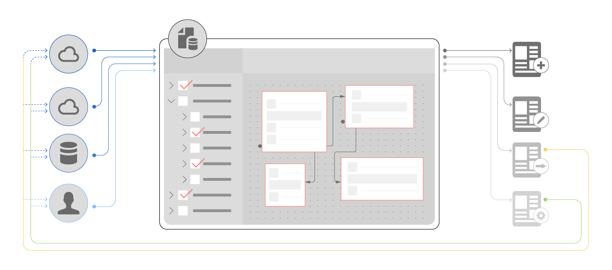

# [!DNL AEM Forms] Integrazione dei dati {#aem-forms-data-integration}

L&#39;infrastruttura aziendale include diversi sistemi back-end o origini dati come database, servizi Web, servizi REST, servizi OData e soluzioni CRM. Insieme, creano un sistema di informazioni che fornisce dati alle applicazioni aziendali per eseguire le attività quotidiane. D&#39;altra parte, le applicazioni acquisiscono i dati e li inviano ad aggiornare le origini dati.

[!DNL AEM Forms] applicazioni come i moduli adattivi e le comunicazioni interattive richiedono l’integrazione con le origini dati per recuperare i dati dei clienti durante il rendering dei moduli e la creazione di comunicazioni interattive. In alcuni casi i dati vengono recuperati da origini dati in base agli input degli utenti nei moduli adattivi. Inoltre, i dati del modulo adattivo inviati possono essere riscritti per aggiornare le rispettive origini dati.

Anche se un sistema modulare distribuito ha i propri vantaggi, la sfida consiste nell’integrare e creare associazioni di dati tra diverse origini dati. L&#39;integrazione dei dati è la chiave di un&#39;infrastruttura aziendale funzionale ed efficiente con diverse origini dati collegate alle applicazioni per lo scambio di dati aziendali.

## Panoramica sull’integrazione dei dati {#data-integration-overview}

[!DNL AEM Forms] L’integrazione dei dati consente di configurare e collegare diverse origini dati con [!DNL AEM Forms]. Fornisce un’interfaccia utente intuitiva per creare uno schema unificato di rappresentazione dei dati di entità business e servizi tra origini dati connesse. La rappresentazione unificata è nota come modello di dati del modulo, un’estensione dello schema JSON. Le entità in un modello dati modulo sono denominate oggetti modello dati. Un modello dati modulo consente di:

* Accesso a oggetti, proprietà e servizi del modello dati da origini dati connesse.
* Creare oggetti e proprietà del modello dati personalizzato
* Creare associazioni tra oggetti modello dati all’interno e tra origini dati.
* Richiama i servizi oggetto modello dati per eseguire query o scrivere dati da e verso origini dati.

Dopo aver creato un modello di dati modulo, puoi utilizzarlo in vari flussi di lavoro per moduli adattivi e comunicazioni interattive, ad esempio:

* Creare moduli adattivi e comunicazioni interattive basate sul modello di dati del modulo
* Precompilare moduli adattivi e comunicazioni interattive da origini dati configurate
* Richiama servizi/operazioni origine dati tramite regole modulo adattivo
* Scrivi i dati del modulo adattivo inviati nelle origini dati

## Introduzione all’integrazione dei dati {#get-started-with-data-integration}

Il primo passaggio per implementare l’integrazione dei dati consiste nell’identificare e configurare le origini dati in cui sono memorizzate le informazioni da utilizzare nei moduli adattivi e nei casi di utilizzo delle comunicazioni interattive. Successivamente, verrà creato un modello dati modulo che utilizza oggetti, proprietà e servizi del modello dati da una o più origini dati. Puoi creare moduli adattivi e comunicazioni interattive basate su un modello di dati del modulo in cui i campi del modulo adattivo o i segnaposto nelle comunicazioni interattive sono associati alle rispettive proprietà dell’origine dati.

[!DNL AEM Forms] consente inoltre di creare un modello dati modulo indipendente dalle origini dati e di associare o associare in seguito gli oggetti e le proprietà del modello dati modulo all&#39;origine dati. Elimina tutte le dipendenze dalle origini dati mentre si lavora su un modello dati modulo.

Consulta quanto segue per iniziare, comprendere e implementare l’integrazione dei dati.

* [Configurare origini dati](../../forms/using/configure-data-sources.md)
* [Crea modello dati modulo](../../forms/using/create-form-data-models.md)
* [Utilizzare il modello dati del modulo](../../forms/using/work-with-form-data-model.md)
* [Usa modello dati modulo](../../forms/using/using-form-data-model.md)
