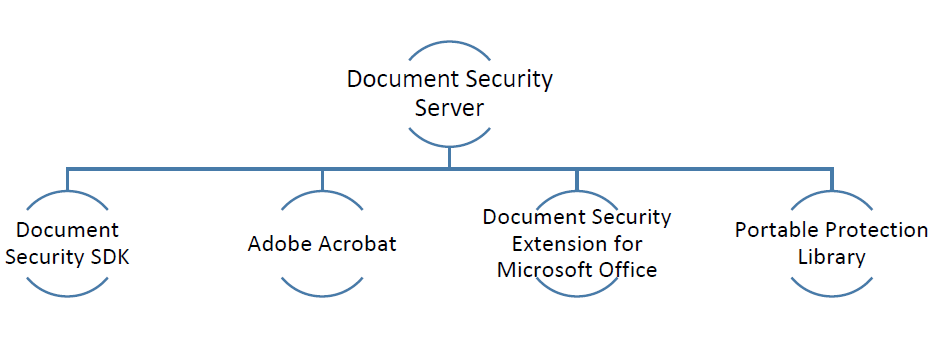

# Offerte sulla sicurezza dei documenti{#document-security-offerings}

La funzione di protezione dei documenti di Adobe Experience Manager Forms garantisce che solo gli utenti autorizzati possano utilizzare i documenti. Grazie alla protezione dei documenti è possibile distribuire in modo sicuro le informazioni salvate in un formato supportato. I formati di file supportati sono Adobe Portable Document Format (PDF) e Microsoft Word, Excel e PowerPoint.

È possibile proteggere i documenti utilizzando le policy. Le impostazioni di riservatezza specificate in una policy determinano il modo in cui un destinatario può utilizzare un documento al quale si applica la policy. È ad esempio possibile specificare se i destinatari possono stampare o copiare testo, modificare testo o aggiungere firme e commenti ai documenti protetti.

Le policy vengono memorizzate nel server di Document Security e applicate ai documenti tramite l’applicazione client. Quando si applica una policy a un documento, le impostazioni di riservatezza specificate nella policy proteggono le informazioni contenute nel documento. Puoi distribuire il documento protetto tramite policy ai destinatari autorizzati dalla policy.

Il diagramma seguente mostra l’architettura tipica di AEM Forms Document Security:

## Client Document Security {#document-security-clients}

Document Security offre a diversi client la protezione dei documenti, la visualizzazione e la modifica di documenti protetti e indicizzatori per consentire la ricerca full-text nei documenti protetti. Puoi scegliere un cliente in base ai tuoi requisiti e alle funzionalità del cliente.

Document Security Server è il componente centrale tramite il quale Document Security esegue transazioni quali l’autenticazione degli utenti, la gestione in tempo reale di policy e l’applicazione di criteri di riservatezza. Il server fornisce inoltre un repository centrale per le regole, i record di controllo e altre informazioni correlate.

Il server di Document Security fornisce un’interfaccia basata su web (pagina web) per creare policy, gestire documenti protetti tramite policy e monitorare gli eventi associati ai documenti protetti tramite policy. Gli amministratori possono anche configurare opzioni globali quali l’autenticazione degli utenti, il controllo e la messaggistica per gli utenti invitati e gestire gli account utente invitati.

Il server è incluso nell’offerta del componente aggiuntivo AEM Forms Document Security. Puoi contattare AEM Forms [team di vendita](https://www.adobe.com/products/request-consultation/marketing-cloud.html?s_osc=70114000002JNwKAAW&amp;s_iid=70114000002JHs3AAG) per acquistare il componente aggiuntivo Document Security.

### Documenti Protect {#protect-documents}

AEM Forms Document Security fornisce diversi strumenti per applicare i criteri di sicurezza. Puoi scegliere uno strumento in base alle tue esigenze e specifiche.

È possibile utilizzare Document Security SDK, Adobe Acrobat, Document Security Extension for Microsoft Office o Portable Protection Library per applicare e tenere traccia delle policy di sicurezza:

* **SDK di Document Security:** L’SDK è un client ricco di funzioni. Document Security SDK consente di accedere alle funzionalità del server documenti, aprire documenti protetti tramite policy e sviluppare estensioni, plug-in o applicazioni personalizzate. Ad esempio, puoi sviluppare estensioni per proteggere i formati di file personalizzati o integrare l’SDK con le soluzioni DLP (Data Loss Prevention). Estensioni, applicazioni e plug-in sviluppati utilizzando Document Security SDK inviano documenti al server AEM Forms designato e le policy vengono applicate al server. Inoltre, AEM Forms document security client SDK (CSDK) non può rimuovere la protezione dei documenti protetti utilizzando la libreria di protezione portatile (PPL) e viceversa.

   Document Security SDK è disponibile sia per Java che per C++. L’SDK Java è incluso nell’offerta Document Security di AEM Forms e viene installato nella distribuzione di moduli AEM su JEE. Puoi contattare [Team di supporto AEM](https://helpx.adobe.com/it/marketing-cloud/contact-support.html) per acquistare C++ SDK. L’SDK C++ può essere compilato con Microsoft Visual Studio 2013. Puoi visitare [Documentazione di Document Security API](https://help.adobe.com/en_US/livecycle/11.0/Services/WS92d06802c76abadb76c48dfe12dbeb3e281-7ff0.2.html) per scoprire e utilizzare le funzioni dell’SDK.

* **Adobe Acrobat:** È possibile utilizzare Adobe Acrobat per applicare i criteri di protezione ai documenti PDF creati utilizzando applicazioni desktop comuni, ad esempio Microsoft Office, browser Web o qualsiasi applicazione che supporti la stampa in formato PDF.

   Puoi acquistare e scaricare Adobe Acrobat da [Sito Web Adobe](https://acrobat.adobe.com/us/en/free-trial-download.html). Articolo di Adobe Acrobat [impostazione dei criteri di sicurezza per i PDF](https://helpx.adobe.com/acrobat/using/setting-security-policies-pdfs.html) fornisce informazioni dettagliate sulla creazione e l’applicazione di policy in Adobe Acrobat.

* **Document Security Extension for Microsoft Office**: è possibile utilizzare Document Security Extension for Microsoft Office per applicare policy predefinite ai file di Microsoft Office dall’interno delle applicazioni di Microsoft Office. L’estensione garantisce che solo gli utenti autorizzati possano utilizzare file Microsoft Word, Excel e PowerPoint protetti tramite policy. Solo gli utenti autorizzati che dispongono del plug-in possono utilizzare i file protetti tramite policy.

   L’estensione Document Security è disponibile come plug-in di Microsoft Office. Puoi contattare [Team di supporto AEM](https://helpx.adobe.com/ca/marketing-cloud/contact-support.html) per ottenere l’estensione. In seguito, potrai visitare [Document Security Extension for Microsoft Office](https://helpx.adobe.com/aem-forms/aem-document-security/download-installer.html) scopri come installare, configurare e utilizzare l’estensione.

* **Libreria di protezione portatile:** La libreria PPL (Portable Protection Library) protegge un documento localmente, senza inviarlo al server AEM Forms. Solo le credenziali di protezione e i dettagli dei criteri possono essere utilizzati in rete. PPL consente inoltre di limitare l’accesso al recupero dei criteri solo agli utenti connessi. Puoi recuperare i criteri con il contesto dell’utente connesso all’utente AEM.

   Oltre a quanto sopra, la Libreria di protezione personalizzabile dispone di tutte le funzioni dell’SDK di Document Security. Document Security SDK consente di accedere alle funzionalità del server documenti, aprire documenti protetti tramite policy e sviluppare estensioni, plug-in o applicazioni personalizzate. Inoltre, la libreria di protezione portatile (PPL) non può rimuovere la protezione dei documenti protetti utilizzando AEM Forms document security client SDK (CSDK) e viceversa.

   La Portable Protection Library è disponibile per i linguaggi Java e C++ nelle versioni a 32 bit e a 64 bit. È disponibile anche come bundle OSGi per AEM Forms su OSGi. Il file PPL C++ può essere compilato con Microsoft Visual Studio 2013. Se hai concesso la licenza per il componente aggiuntivo AEM Forms Document Security, puoi contattare [AEM Forms Document Security](https://helpx.adobe.com/it/marketing-cloud/contact-support.html) team di supporto per acquistare Portable Protection Library. In seguito sarà possibile utilizzare la Guida della libreria di protezione portatile (inclusa nella libreria) per impostare e utilizzare la libreria di protezione portatile.

### Visualizzare o modificare documenti protetti {#view-or-edit-protected-documents}

* Per **Documenti PDF**, puoi utilizzare Adobe Acrobat DC, Acrobat Reader e Acrobat Reader Mobile per visualizzare documenti PDF protetti. La maggior parte degli utenti dispone già di Acrobat Reader installato sui propri dispositivi, pertanto non è necessario ottenere o apprendere software aggiuntivo per visualizzare i documenti protetti. Puoi scaricare l’Acrobat Reader anche da [Sito Web di download Acrobat Reader](https://get.adobe.com/reader/).

* Per **Documenti di Microsoft Office**, è necessario disporre di Microsoft Office e AEM Forms Document Security Extension for Microsoft Office. L’estensione Document Security è disponibile come plug-in di Microsoft Office. Puoi scaricare l’estensione dal sito web di Adobe.

### Indice documenti protetti {#index-protected-documents}

I motori di ricerca full-text di Microsoft Windows (server indice di SharePoint) e Adobe Experience Manager (AEM) possono eseguire ricerche full-text su formati di documenti di uso comune, come file di testo normale, documenti di Microsoft Office e documenti di PDF. È possibile utilizzare gli indicizzatori di Document Security per abilitare i motori di ricerca full-text nella ricerca di documenti PDF protetti:

* **Indicizzatore iFilter:** È possibile utilizzare l&#39;indicizzatore iFilter per indicizzare i documenti protetti di PDF e abilitare i motori di ricerca full-text di Microsoft Windows (Servizio di indicizzazione desktop e SharePoint Indexserver) per eseguire ricerche nei documenti protetti di PDF. Per informazioni dettagliate, consulta [IFilter SharePoint per documenti protetti AEM](assets/sharepoint-ifilter-doc-security.pdf).

* **Indicizzatore di AEM Forms Document Security:** È possibile utilizzare l’indicizzatore di AEM Forms Document Security per indicizzare i documenti protetti di PDF e consentire ad Adobe Experience Manager di effettuare ricerche nei documenti protetti di PDF. Gli indicizzatori fanno parte dell’offerta di AEM Forms Document Security. Sono inclusi nei programmi di installazione di AEM Forms su JEE.
