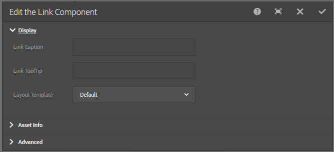

# Incorporazione di un componente collegamento in una pagina{#embedding-link-component-in-a-page}

## Prerequisiti {#prerequisites}

Il componente di collegamento è membro della categoria Document Services . Assicurarsi che la categoria Document Services sia visibile nel browser Componenti AEM. Se la categoria non è elencata, segui i passaggi elencati in [Abilitazione dei componenti del portale moduli](/help/forms/using/enabling-forms-portal-components.md).

## Componente collegamento {#link-component}

Il componente Collegamento permette agli autori di un portale moduli di creare un collegamento a un modulo adattivo da qualsiasi punto di una pagina. Il componente Collegamento è disponibile nella sezione Servizi documenti del browser componenti.

Per aggiungere un componente Collegamento alla pagina, effettua le seguenti operazioni:

1. Trascina **Collegamento** nella pagina. Seleziona il componente e tocca . Viene visualizzata la finestra di dialogo Modifica componente collegamento .

   

1. In **Visualizzazione** , specifica quanto segue:

   * **Didascalia collegamento**: Collegamento di testo o didascalia per il collegamento.
   * **Descrizione collegamento**: Descrizione del collegamento.
   * **Modello di layout**: Modello per il layout del componente Collegamento .

1. Apri **Informazioni risorsa** e specifica il tipo di risorsa. Una risorsa può essere **modulo**. A seconda del tipo di risorsa selezionata, vengono visualizzate le opzioni elencate di seguito:

   * **Percorso risorsa**: Percorso archivio in cui viene memorizzata la risorsa.

   * **Tipo di rendering**: Il formato di rendering: PDF, HTML o Auto. Il tipo di rendering automatico rileva l’ambiente utente e, di conseguenza, esegue il rendering del modulo come HTML o PDF. Ad esempio, se l’accesso al modulo è effettuato da un dispositivo mobile, il tipo di rendering automatico esegue il rendering del modulo in HTML.
   * **URL di invio:**  URL del servlet in cui vengono inviati i dati del modulo.
   * **Profilo HTML**: Profilo per il rendering del modulo come HTML.
   * **Profilo PDF**: Profilo per il rendering del modulo come documento PDF.

1. Apri la scheda **Avanzate.** È possibile specificare i parametri aggiuntivi nel formato della coppia chiave-valore. Quando fai clic sul collegamento, questi parametri aggiuntivi vengono passati insieme al modulo.

   Tocca **Fine** per salvare la configurazione.

## Best practice per l’utilizzo del componente Collegamento {#best-practices-for-using-link-component-br}

* Assicurarsi di selezionare PDF come tipo di rendering se il percorso specificato in Percorso modulo punta a un documento con PDF come formato di rendering consentito.
* L’URL di invio di un modulo può essere specificato in più posizioni e il relativo ordine di precedenza è il seguente:

   1. L’URL di invio incorporato nel modulo (nel pulsante di invio) ha la priorità più alta.
   1. L’URL di invio menzionato in Forms Manager ha la priorità media.
   1. L’URL di invio menzionato nel portale dei moduli ha la priorità più bassa.
