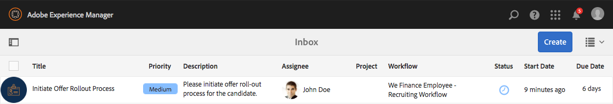
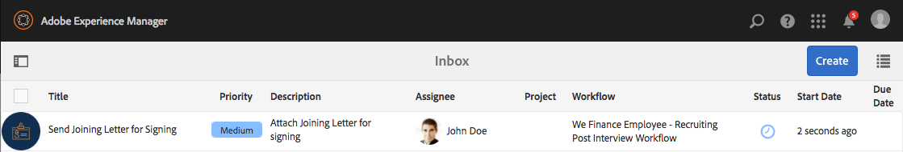
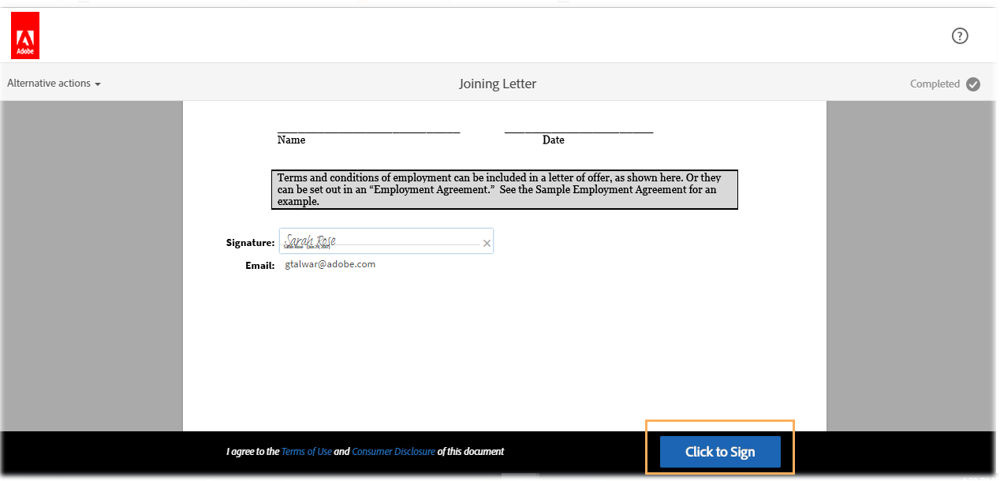

# Procedura dettagliata sul sito di riferimento per la selezione dei dipendenti {#employee-recruitment-reference-site-walkthrough}

## Panoramica {#overview}

We.Finance è un&#39;organizzazione che consente ai candidati di richiedere un impiego tramite il portale del sito di riferimento. L&#39;organizzazione utilizza anche il portale per gestire la pianificazione dei colloqui dei candidati, l&#39;elenco dei candidati selezionati e la comunicazione interna. Il sito gestisce quanto segue:

* Candidati alla ricerca e alla candidatura a mansioni
* Selezione e selezione dei candidati
* Processo di colloquio
* Raccolta dei dettagli dei candidati
* Controllo sfondo candidati
* Rollout di offerte ai candidati selezionati

>[!NOTE]
>
>I casi di utilizzo della selezione dei dipendenti sono disponibili sia nei siti di riferimento We.Finance che in quelli di We.Gov. Gli esempi, le immagini e le descrizioni utilizzati nelle procedure dettagliate utilizzano il sito di riferimento We.Finance. Tuttavia, puoi eseguire questi casi d’uso e rivedere gli artefatti anche utilizzando We.Gov. Per eseguire questa operazione, sostituisci **we-finance** con **we-gov** negli URL menzionati.

### Modelli di flusso di lavoro {#workflow-models-involved}

Il caso di utilizzo della selezione dei dipendenti prevede due flussi di lavoro:

* Prima del colloquio: finanziamo il flusso di lavoro di selezione dei dipendenti
* Dopo il colloquio - Flusso di lavoro di post-colloquio per la selezione di dipendenti

Questi flussi di lavoro sono creati in AEM e si trovano all’indirizzo:

`https://[authorHost]:[authorPort]/libs/cq/workflow/admin/console/content/models.html/etc/workflow/models/`

#### Il flusso di lavoro di selezione dei dipendenti è finanziato da Dell {#we-finance-employee-recruiting-workflow}

Di seguito è riportato il modello del flusso di lavoro di selezione dei dipendenti di We Finance riportato in questo documento.

#### Flusso di lavoro di post-colloquio per la selezione di dipendenti {#we-finance-employee-recruiting-post-interview-workflow}

Di seguito è riportato il modello del flusso di lavoro di selezione post colloquio per i dipendenti di We Finance illustrato in questo documento.

### Persone {#personas}

Lo scenario coinvolge i seguenti utenti tipo:

* Sarah Rose, la candidata per un posto di lavoro presso l&#39;organizzazione
* John Jacobs, il reclutatore
* Gloria Rios, la gestione delle assunzioni
* John Doe, il responsabile delle risorse umane

## Sarah fa domanda per un lavoro {#sarah-applies-for-a-job}

Sarah Rose sta cercando un&#39;opportunità di lavoro nell&#39;organizzazione. Visita il loro portale web ed esplora le opportunità di lavoro elencate nella pagina Carriera. Trova un&#39;offerta di lavoro corrispondente e ne fa richiesta.

Home page di We.Finance

Pagina carriera We.Finance

Sarah fa clic su Applica per la registrazione di un lavoro. Verrà aperto il modulo di richiesta di lavoro. Essa compila tutti i dati contenuti nella domanda e la presenta.

### Come funziona {#how-it-works}

La home page di We.Finance e la pagina relativa alla carriera sono pagine AEM Sites. La pagina Carriera incorpora un modulo adattivo, che utilizza un pannello ripetibile per recuperare le aperture di lavoro utilizzando un servizio ed elencarle sulla pagina. Puoi rivedere il modulo adattivo all’indirizzo `https://[authorHost]:[authorPort]/editor.html/content/forms/af/we-finance/employee/recruitment/jobs.html`.

### Vedi tu stesso {#see-it-yourself}

Vai a `https://[publishHost]:[publishPort]/content/we-finance/global/en.html` e fai clic su **[!UICONTROL Carriera]**. Clic **[!UICONTROL Ricerca]** in modo da compilare l&#39;elenco dei job e quindi fare clic su **[!UICONTROL Applica]** per un lavoro. Compila i dettagli nel modulo e invia la domanda.

Assicurarsi di specificare un ID e-mail valido nell&#39;applicazione, in quanto tutte le comunicazioni effettuate tramite questa procedura dettagliata vengono inviate all&#39;ID e-mail specificato.

## John Jacobs ha selezionato il profilo di Sarah Rose per la selezione del responsabile dell&#39;assunzione {#john-jacobs-shortlists-sarah-rose-s-profile-for-the-hiring-manager-s-screening}

L&#39;organizzazione riceve la candidatura di lavoro inviata da Sarah. A John Jacobs, un reclutatore, viene assegnato il compito di rivedere il profilo di Sarah. John rivede l’attività nella sua casella in entrata AEM, trova il profilo che corrisponde ai requisiti del lavoro e fa clic su Shortlist. Il profilo di Sarah viene inoltrato a Gloria Rios, la responsabile delle assunzioni, per la sua approvazione.

Casella in entrata AEM di John

John Jacobs ha selezionato il profilo di Sarah Rose per la selezione del responsabile dell&#39;assunzione

**Come funziona**

L’azione di invio nel modulo della candidatura attiva un flusso di lavoro che crea un’attività nella casella in entrata di John Jacob’s per lo screening dell’applicazione. Quando John esamina e seleziona l’applicazione, il flusso di lavoro crea un’attività nella casella in entrata di Gloria, responsabile dell’assunzione.

### Vedi tu stesso {#see-it-yourself-1}

Vai a `https://[publishHost]:[publishPort]/content/we-finance/global/en/login.html?resource=/aem/inbox.html`e accedi utilizzando jjacobs/password come nome utente/password per John Jacobs. Aprire il task Revisione profilo candidato e selezionare il candidato.

## Gloria esamina la domanda e approva il candidato per un colloquio {#gloria-reviews-the-application-and-approves-the-applicant-for-an-interview}

Gloria, la responsabile delle assunzioni, riceve il profilo selezionato come un&#39;attività nella sua casella in entrata AEM. Lo rivede e approva la candidata, Sarah Rose, per l&#39;intervista.

Casella in entrata AEM di Gloria

Gloria approva Sarah Rose per un&#39;intervista

**Come funziona**

Quando Gloria approva il candidato per un colloquio, il flusso di lavoro crea un&#39;attività nella casella in entrata AEM di John Doe, che è un selezionatore per We.Finance.

### Vedi tu stesso {#see-it-yourself-2}

Vai a `https://[publishHost]:[publishPort]/content/we-finance/global/en/login.html?resource=/aem/inbox.html` e accedi utilizzando jjacobs/password come nome utente/password per John Jacobs. Aprire il task Revisione profilo candidato e selezionare il candidato.

Vai a `https://[publishHost]:[publishPort]/content/we-finance/global/en/login.html?resource=/aem/inbox.html` e accedi utilizzando grios/password come nome utente/password per Gloria Rios. Aprire l&#39;attività Revisione profilo candidato e fare clic su Pianifica colloquio.

## John Doe programma un&#39;intervista {#john-doe-schedules-an-interview}

John Doe riceve il compito di programmare un colloquio nella sua casella in entrata. John Doe seleziona e apre l&#39;attività e fissa la data e l&#39;ora del colloquio, la posizione e la persona responsabile delle risorse umane per il colloquio come John Jacob. John Doe fa clic su Invia e-mail di invito. Viene inviata un&#39;e-mail a Sarah e viene assegnata un&#39;attività a Gloria, la responsabile delle assunzioni, per intervistare Sarah.

Casella in entrata AEM di John Doe

John Doe pianifica l&#39;intervista e invia i dettagli a Sarah Rose

## Sarah Rose riceve l&#39;e-mail con il programma del colloquio {#sarah-rose-receives-the-email-with-interview-schedule}

Sarah Rose riceve l’e-mail con il programma dei colloqui, la sede del colloquio e altri dettagli. Sarah fa clic su Accept per indicare che la programmazione e il luogo del colloquio sono corretti. Come guidata da informazioni precise, Sarah si presenta alle interviste.

Sarah Rose riceve il programma del colloquio

## Dopo le interviste, il responsabile delle assunzioni seleziona Sarah Rose {#after-the-interviews-the-hiring-manager-shortlists-sarah-rose}

Dopo che Sarah Rose ha esaminato le interviste e le ha cancellate, Gloria Rios, la responsabile delle assunzioni, apre l’attività Selezione candidati dalla sua casella in entrata e fa clic su Seleziona. La decisione di Gloria Rios viene trasmessa alla persona responsabile delle risorse umane, John Doe, per ulteriore elaborazione.

Casella in entrata AEM di Gloria

Gloria Rios seleziona Sarah Rose dopo le interviste

## John Doe richiede ulteriori informazioni {#john-doe-requests-more-information}

Prima di chiedere a un candidato di entrare nell&#39;organizzazione, bisogna controllare il background di Sarah. John Doe apre e rivede i dettagli del candidato selezionato e scopre che alcuni dei suoi dettagli relativi all&#39;impiego e all&#39;istruzione non sono ancora stati compilati. I clic di John Doe richiedono ulteriori informazioni.

 

John Doe richiede ulteriori informazioni a Sarah Rose sulla sua esperienza di istruzione e lavoro

## Sarah Rose riceve un&#39;e-mail con la richiesta di ulteriori informazioni {#sarah-rose-receives-an-email-requesting-further-information}

Sarah Rose riceve un&#39;e-mail che la informa che sono necessarie ulteriori informazioni per elaborare la sua domanda di lavoro. L’e-mail include un collegamento al modulo per la compilazione delle informazioni richieste.

Sarah Rose riceve un&#39;e-mail di notifica che sono necessarie ulteriori informazioni per elaborare la sua domanda di lavoro

Sarah fa clic sul collegamento Fornisci dettagli nell’e-mail. Viene visualizzato un modulo. Sarah compila i dettagli richiesti su formazione e impiego, come richiesto da John Doe, e fa clic su Submit.

Sarah apre il modulo di informazioni aggiuntive facendo clic sul collegamento nell’e-mail

Sarah compila le informazioni aggiuntive richieste da John Doe e fa clic su Invia.

## John Doe esamina il profilo candidato selezionato per ottenere le informazioni aggiuntive fornite {#john-doe-reviews-the-selected-candidate-profile-for-the-additional-information-provided}

John Doe seleziona la richiesta di revisione del candidato e la apre. John Doe scopre che Sarah ha compilato tutte le informazioni come richiesto. Dopo aver esaminato l’applicazione, John Doe fa clic su Approve (Approva). Dopo l&#39;approvazione di John Doe, la richiesta di eseguire un controllo dei precedenti personali su Sarah Rose viene inoltrata a John Jacobs.

Casella in entrata AEM di John Doe

John Doe esamina le informazioni aggiuntive fornite da Sarah e le approva

## John Jacobs riceve una richiesta di controllo dei precedenti personali {#john-jacobs-receives-a-background-check-request}

John Jacobs vede la richiesta di controllo dei precedenti personali nella sua casella in entrata. John Jacobs apre l&#39;attività e rivede le informazioni fornite da Sarah Rose. Dopo aver eseguito un controllo dei precedenti personali, John Jacobs fa clic su Vai avanti per indicare che il controllo dei precedenti personali è stato eseguito correttamente.

Casella in entrata AEM di John Jacobs

Dopo aver eseguito il controllo dello sfondo, John Jacobs fa clic su Vai avanti

## John Doe invia la lettera di adesione a Sarah Rose {#john-doe-sends-out-the-joining-letter-to-sarah-rose}

John Doe riceve una richiesta nella sua casella di posta AEM per l’invio della lettera di adesione. John apre la richiesta e visualizza i dettagli. John Doe allega la lettera di join PDF e quindi fa clic su Allega e invia lettera di join.

Casella in entrata AEM di John Doe

John Doe invia la lettera per la firma

## Sarah Rose riceve e firma la lettera di adesione {#sarah-rose-receives-and-signs-the-joining-letter}

Sarah Rose riceve la lettera di adesione per la firma. Fai Clic Su Click Here Per Rivedere E Firmare La Lettera Di Iscrizione. Il PDF della lettera di unione si apre con un campo per firmare il documento.

Sarah Rose riceve la lettera di adesione per la firma

Sarah può scegliere di digitare, utilizzare il disegno per scrivere a mano, inserire un&#39;immagine di firma o utilizzare il touchscreen del suo cellulare per disegnare la sua firma. Sarah digita il suo nome, fa clic su Click To Sign e scarica la copia firmata della lettera di join.

Sarah digita il suo nome per firmare la lettera di iscrizione

Sarah fa clic su Click To Sign per completare la firma della lettera di adesione
