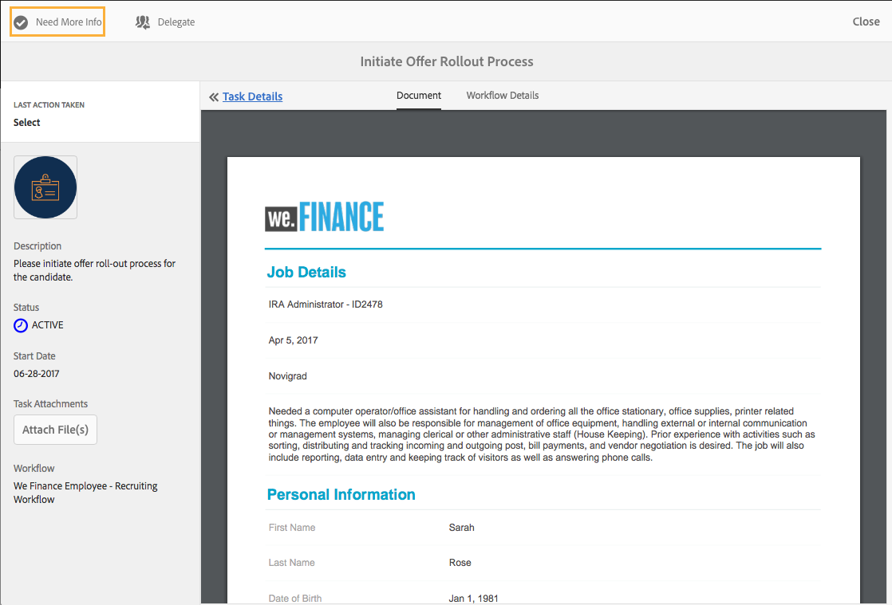
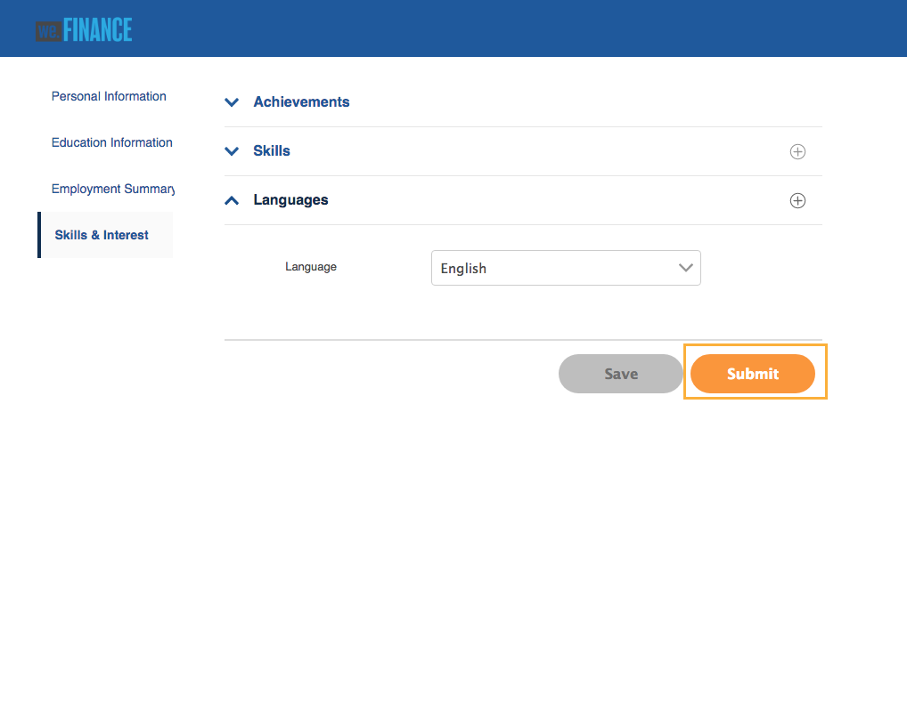

# Procedura dettagliata sul sito di riferimento per l&#39;assunzione di dipendenti {#employee-recruitment-reference-site-walkthrough}

## Panoramica {#overview}

We.Finance è un&#39;organizzazione che consente ai candidati di fare domanda di lavoro attraverso il portale del sito di riferimento. L&#39;organizzazione utilizza inoltre il portale per gestire la programmazione degli interviste, la creazione di elenchi puntati e la comunicazione interna dei candidati. Il sito gestisce quanto segue:

* Candidati alla ricerca e alla richiesta di processi
* Screening e rosa dei candidati
* Processo di intervista
* Raccolta dei dati relativi al candidato
* Verifica in background dei candidati
* Rollout delle offerte ai candidati selezionati

>[!NOTE]
>
>I casi di utilizzo di reclutamento dei dipendenti sono disponibili sia nei siti di riferimento We.Finance che We.Gov. Gli esempi, le immagini e le descrizioni utilizzati nelle procedure dettagliate utilizzano il sito di riferimento We.Finance. Tuttavia, potete eseguire questi casi di utilizzo e rivedere gli artifact utilizzando anche We.Gov. A tal fine, sostituite **we-finance** con **we-gov** negli URL indicati.

### Modelli di flussi di lavoro coinvolti {#workflow-models-involved}

Il caso d’uso di assunzione dei dipendenti comprende due flussi di lavoro:

* Prima dell&#39;intervista - Flusso di lavoro di reclutamento dei dipendenti di finanza
* Dopo l&#39;intervista - Contabilizziamo il flusso di lavoro del post-intervista del dipendente Reclutamento

Questi flussi di lavoro vengono creati in AEM e sono disponibili al seguente indirizzo:

`https://[authorHost]:[authorPort]/libs/cq/workflow/admin/console/content/models.html/etc/workflow/models/`

#### Flusso di lavoro di reclutamento dei dipendenti di contabilità aziendale {#we-finance-employee-recruiting-workflow}

Di seguito è riportato il modello del flusso di lavoro di reclutamento dei dipendenti di We Finance seguito in questo documento.

#### Flusso di lavoro post-intervista per clienti aziendali{#we-finance-employee-recruiting-post-interview-workflow}

Di seguito è riportato il modello del flusso di lavoro di recupero post intervista dipendente di We Finance seguito in questo documento.

### Personas {#personas}

Lo scenario coinvolge le seguenti persone:

* Sarah Rose, la candidata per un lavoro presso l&#39;organizzazione
* John Jacobs, il reclutatore
* Gloria Rios, responsabile delle assunzioni
* John Doe, la persona HR

## Sarah si riferisce a un lavoro {#sarah-applies-for-a-job}

Sarah Rose sta cercando un&#39;opportunità di lavoro nell&#39;organizzazione. Visita il loro portale web ed esplora le aperture di lavoro elencate nella pagina Carriera. Trova un elenco di processi corrispondente e lo richiede.

Pagina principale We.Finance

Pagina di carriera We.Finance

Sarah fa clic su Applica su un processo di registrazione. Viene visualizzato il modulo di richiesta del processo. Riempie tutti i dettagli nella domanda e li invia.

### Come funziona {#how-it-works}

La home page di We.Finance e la pagina della carriera sono  pagine AEM Sites. La pagina della carriera incorpora un modulo adattivo, che utilizza un pannello ripetibile per recuperare le aperture di un processo utilizzando un servizio e visualizzarle nella pagina. È possibile esaminare il modulo adattivo all&#39;indirizzo `https://[authorHost]:[authorPort]/editor.html/content/forms/af/we-finance/employee/recruitment/jobs.html`.

### Vedere da soli {#see-it-yourself}

Vai a `https://[publishHost]:[publishPort]/content/we-finance/global/en.html` e fai clic su **[!UICONTROL Carriera]**. Fare clic su **[!UICONTROL Cerca]** per compilare l&#39;elenco dei processi, quindi fare clic su **[!UICONTROL Applica]** per un processo. Compila il modulo con i dettagli e invia la domanda.

Accertatevi di specificare un ID e-mail valido nell&#39;applicazione come qualsiasi comunicazione tramite questa procedura dettagliata verrà inviata all&#39;ID e-mail specificato.

## John Jacobs presenta il profilo di Sarah Rose per la proiezione del manager delle assunzioni{#john-jacobs-shortlists-sarah-rose-s-profile-for-the-hiring-manager-s-screening}

L&#39;organizzazione riceve la domanda di lavoro presentata da Sarah. John Jacobs, un reclutatore, ha il compito di rivedere il profilo di Sarah. Controlla l’attività nella propria casella in entrata AEM, trova il profilo corrispondente al requisito del processo e fa clic su Elenco di scelta rapida. Il profilo di Sarah viene inoltrato a Gloria Rios, la responsabile delle assunzioni, per la sua approvazione.

Casella in entrata AEM di John

John Jacobs presenta il profilo di Sarah Rose per lo screening del responsabile delle assunzioni

**Come funziona**

L&#39;azione di invio nel modulo Applicazione processo attiva un flusso di lavoro che crea un&#39;attività nella inbox di John Jacob per lo screening dell&#39;applicazione. Quando John, recensisce e seleziona l&#39;applicazione, il flusso di lavoro crea un&#39;attività nel manager delle assunzioni, la inbox di Gloria.

### Vedere da soli {#see-it-yourself-1}

Andate a `https://[publishHost]:[publishPort]/content/we-finance/global/en/login.html?resource=/aem/inbox.html`ed effettuate l&#39;accesso utilizzando jjacobs/password come nome utente/password per John Jacobs. Aprite l&#39;attività di revisione profilo candidato e selezionate l&#39;elenco dei candidati.

## Gloria esamina la domanda e approva il richiedente per un colloquio {#gloria-reviews-the-application-and-approves-the-applicant-for-an-interview}

Gloria, la responsabile delle assunzioni, riceve il profilo in lista ridotta come un&#39;attività nella sua casella AEM Posta in arrivo. Lo esamina e approva la candidata, Sarah Rose, per l&#39;intervista.

AEM inbox di Gloria

Gloria approva Sarah Rose per un&#39;intervista

**Come funziona**

Quando Gloria approva il candidato per un&#39;intervista, il flusso di lavoro crea un&#39;attività nella AEM Posta in arrivo di John Doe, che è un reclutatore per We.Finance.

### Vedere da soli {#see-it-yourself-2}

Andate a `https://[publishHost]:[publishPort]/content/we-finance/global/en/login.html?resource=/aem/inbox.html` e accedete utilizzando jjacobs/password come nome utente/password per John Jacobs. Aprite l&#39;attività di revisione profilo candidato e selezionate l&#39;elenco dei candidati.

Andate a `https://[publishHost]:[publishPort]/content/we-finance/global/en/login.html?resource=/aem/inbox.html` e accedete utilizzando grios/password come nome utente/password per Gloria Rios. Aprite l&#39;attività di revisione profilo candidato e fate clic su Pianifica intervista.

## John Doe pianifica un&#39;intervista {#john-doe-schedules-an-interview}

John Doe riceve il compito di programmare un&#39;intervista nella sua inbox. John Doe seleziona e apre il compito e fissa la data e l&#39;ora dell&#39;intervista, la località e la persona responsabile dell&#39;intervista come John Jacob. John Doe fa clic su Invia e-mail di invito. Un&#39;email viene inviata a Sarah e un compito è assegnato a Gloria, il responsabile delle assunzioni, per intervistare Sarah.

Posta in AEM di John Doe

John Doe pianifica l&#39;intervista e invia i dettagli a Sarah Rose

## Sarah Rose riceve l&#39;e-mail con la programmazione dell&#39;intervista {#sarah-rose-receives-the-email-with-interview-schedule}

Sarah Rose riceve l&#39;e-mail con l&#39;orario delle interviste, il luogo e altri dettagli. Fa clic su Accetto per indicare che sta bene con il programma e il luogo dell&#39;intervista. Come guidato dalle informazioni precise, Sarah arriva alle interviste.

Sarah Rose riceve il programma del colloquio

## Dopo l&#39;intervista, il manager delle assunzioni sceglie Sarah Rose {#after-the-interviews-the-hiring-manager-shortlists-sarah-rose}

Dopo che Sarah Rose attraversa le interviste e le cancella, Gloria Rios, il manager delle assunzioni, apre il compito di selezione dei candidati dalla sua casella in entrata e fa clic su Seleziona. La decisione di Gloria Rios è trasmessa alla persona HR, John Doe, per ulteriori elaborazioni.

AEM inbox di Gloria

Gloria Rios seleziona Sarah Rose dopo le interviste

## John Doe richiede ulteriori informazioni {#john-doe-requests-more-information}

Prima di chiedere a un candidato di unirsi all&#39;organizzazione, è necessario verificare il suo background. John Doe apre e rivede i dettagli del candidato selezionato e rileva che alcuni dei suoi dettagli di lavoro e istruzione non sono ancora stati compilati. John Doe Clicca Ha Bisogno Di Ulteriori Informazioni.

 

John Doe richiede maggiori informazioni da Sarah Rose sulla sua istruzione e la sua esperienza lavorativa

## Sarah Rose riceve un&#39;e-mail con la richiesta di ulteriori informazioni {#sarah-rose-receives-an-email-requesting-further-information}

Sarah Rose riceve un&#39;e-mail di notifica della necessità di ulteriori informazioni per l&#39;elaborazione della sua domanda di lavoro. Il messaggio e-mail include un collegamento al modulo per la compilazione delle informazioni richieste.

Sarah Rose riceve un&#39;e-mail di notifica della necessità di ulteriori informazioni per l&#39;elaborazione della sua domanda di lavoro

Sarah fa clic sul collegamento Fornisci dettagli nell’e-mail. Viene visualizzato un modulo. Sarah completa i dettagli richiesti per l&#39;istruzione e l&#39;occupazione come richiesto da John Doe e fa clic su Invia.

Sarah apre il modulo di informazioni aggiuntive facendo clic sul collegamento presente nell&#39;e-mail

Sarah compila informazioni aggiuntive come richiesto da John Doe e fa clic su Invia

## John Doe esamina il profilo candidato selezionato per le informazioni aggiuntive fornite {#john-doe-reviews-the-selected-candidate-profile-for-the-additional-information-provided}

John Doe seleziona la richiesta di revisione del candidato e la apre. John Doe trova che Sarah ha compilato tutte le informazioni come richiesto. Dopo aver rivisto l&#39;applicazione, John Doe fa clic su Approva. Su approvazione di John Doe, la richiesta di eseguire un controllo di fondo su Sarah Rose è inoltrata a John Jacobs.

Posta in arrivo AEM John Doe

John Doe esamina le informazioni aggiuntive fornite da Sarah e le approva

## John Jacobs riceve una richiesta di verifica in background {#john-jacobs-receives-a-background-check-request}

John Jacobs vede la richiesta del controllo in background nella sua inbox. John Jacobs apre il compito e rivede le informazioni fornite da Sarah Rose. Dopo aver eseguito un controllo in background, John Jacobs fa clic su Vai avanti per indicare che il controllo in background è stato eseguito correttamente.

Posta in AEM di John Jacobs

Dopo aver eseguito il controllo di sfondo, John Jacobs fa clic su Vai avanti

## John Doe invia la lettera di partecipazione a Sarah Rose {#john-doe-sends-out-the-joining-letter-to-sarah-rose}

John Doe riceve nella sua casella in AEM una richiesta di invio della lettera di partecipazione. John apre la richiesta e visualizza i dettagli. John Doe allega la lettera di unione PDF e quindi fa clic su Allega e invia lettera di unione.

Posta in AEM di John Doe

John Doe invia la lettera di partecipazione per la firma

## Sarah Rose riceve e firma la lettera di unione {#sarah-rose-receives-and-signs-the-joining-letter}

Sarah Rose riceve la lettera di partecipazione per la firma. Sarah fa clic qui per rivedere e firmare la lettera di partecipazione. Viene visualizzato il PDF della lettera di unione con un campo per firmare il documento.

Sarah Rose riceve la lettera di partecipazione per la firma

Sarah può scegliere di digitare, utilizzare il disegno per la scrittura a mano, inserire un&#39;immagine della firma o utilizzare il touchscreen del suo cellulare per disegnare la firma. Sarah digita il suo nome, fa clic su Fare clic per firmare e scarica la copia firmata della lettera di unione.

Sarah digita il suo nome per firmare la lettera di unione

Sarah fa clic su Click to Sign per completare la firma della lettera di partecipazione

