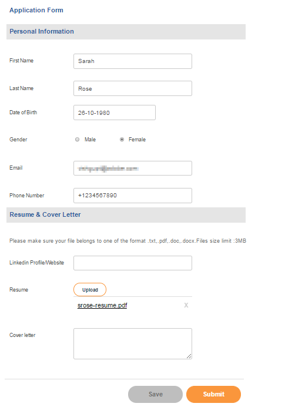

# Procedura dettagliata sul sito di riferimento per le assunzioni dei dipendenti {#employee-recruitment-reference-site-walkthrough}

## Panoramica {#overview}

We.Finance è un&#39;organizzazione che consente ai candidati di richiedere un impiego tramite il portale del sito di riferimento. L&#39;organizzazione utilizza inoltre il portale per gestire la programmazione degli interviste, l&#39;elenco ristretto e la comunicazione interna dei candidati. Il sito gestisce quanto segue:

* Candidati alla ricerca e alla candidatura per lavori
* Screening e inserimento dei candidati
* Processo di intervista
* Raccolta dei dati relativi al candidato
* Controllo dei precedenti candidati
* Rollout delle offerte ai candidati selezionati

>[!NOTE]
>
>I casi di utilizzo per l&#39;assunzione dei dipendenti sono disponibili sia nei siti di riferimento We.Finance che We.Gov. Gli esempi, le immagini e le descrizioni utilizzati nelle procedure dettagliate utilizzano il sito di riferimento We.Finance. Tuttavia, puoi eseguire questi casi d’uso e rivedere gli artefatti utilizzando anche We.Gov. A questo scopo, sostituisci **finanza** con **gov** negli URL menzionati.

### Modelli di workflow coinvolti {#workflow-models-involved}

Il caso di utilizzo per l&#39;assunzione di dipendenti include due flussi di lavoro:

* Prima dell&#39;intervista - Flusso di lavoro di reclutamento dei dipendenti di finanza
* Dopo l&#39;intervista - Flusso di lavoro del post intervista di reclutamento dei dipendenti di finanza

Questi flussi di lavoro vengono creati in AEM e si trovano in:

`https://[authorHost]:[authorPort]/libs/cq/workflow/admin/console/content/models.html/etc/workflow/models/`

#### Flusso di lavoro di reclutamento dipendenti di finanza {#we-finance-employee-recruiting-workflow}

Di seguito è riportato il modello del flusso di lavoro di reclutamento dipendenti di We Finance seguito in questo documento.

#### Flusso di lavoro del post-intervista del reclutamento dei dipendenti {#we-finance-employee-recruiting-post-interview-workflow}

Di seguito è riportato il modello del flusso di lavoro di reclutamento del post intervista dipendente di We Finance seguito in questo documento.

### Personas {#personas}

Lo scenario include i seguenti utenti tipo:

* Sarah Rose, la candidata per un lavoro presso l&#39;organizzazione
* John Jacobs, il reclutatore
* Gloria Rios, responsabile delle assunzioni
* John Doe, la persona HR

## Sarah fa domanda per un lavoro {#sarah-applies-for-a-job}

Sarah Rose sta cercando un&#39;opportunità di lavoro nell&#39;organizzazione. Visita il loro portale web ed esplora le posizioni di lavoro elencate nella pagina Carriera. Trova un elenco di lavoro corrispondente e lo richiede.

Home page di We.Finance

Pagina della carriera We.Finance

Sarah fa clic su Applica su un processo di registrazione. Viene visualizzato il modulo di richiesta di lavoro. Riempie tutti i dettagli nella domanda e la invia.

### Come funziona {#how-it-works}

La home page di We.Finance e la pagina della carriera sono pagine AEM Sites. La pagina della carriera incorpora un modulo adattivo, che utilizza un pannello ripetibile per recuperare le aperture di lavoro utilizzando un servizio e elencarle nella pagina. È possibile esaminare il modulo adattivo in `https://[authorHost]:[authorPort]/editor.html/content/forms/af/we-finance/employee/recruitment/jobs.html`.

### Vedi di persona {#see-it-yourself}

Vai a `https://[publishHost]:[publishPort]/content/we-finance/global/en.html` e fai clic su **[!UICONTROL Carriera]**. Fai clic su **[!UICONTROL Ricerca]** per compilare l&#39;elenco dei processi, quindi fare clic su **[!UICONTROL Applica]** per un lavoro. Compila il modulo con i dettagli e invia la domanda.

Assicurati di specificare un ID e-mail valido nell&#39;applicazione come qualsiasi comunicazione tramite questa procedura dettagliata verrà inviata all&#39;ID e-mail specificato.

## John Jacobs elencherà il profilo di Sarah Rose per lo screening del responsabile delle assunzioni {#john-jacobs-shortlists-sarah-rose-s-profile-for-the-hiring-manager-s-screening}

L&#39;organizzazione riceve la domanda di lavoro inviata da Sarah. A John Jacobs, un reclutatore, è assegnato il compito di rivedere il profilo di Sarah. Controlla l&#39;attività nella sua casella in entrata AEM, trova il profilo corrispondente al requisito del lavoro e fa clic su Lista rapida. Il profilo di Sarah viene inoltrato a Gloria Rios, la responsabile dell&#39;assunzione, per la sua approvazione.

Casella in entrata AEM John

John Jacobs elencherà il profilo di Sarah Rose per lo screening del responsabile delle assunzioni

**Come funziona**

L’azione di invio nel modulo Applicazione processo attiva un flusso di lavoro che crea un’attività nella casella in entrata di John Jacob per lo screening dell’applicazione. Quando John, recensisce e inserisce in elenco l&#39;applicazione, il flusso di lavoro crea un&#39;attività nel manager di assunzione, la casella in entrata di Gloria.

### Vedi di persona {#see-it-yourself-1}

Vai a `https://[publishHost]:[publishPort]/content/we-finance/global/en/login.html?resource=/aem/inbox.html`e accedi utilizzando jjacobs/password come nome utente/password per John Jacobs. Aprire l&#39;attività di revisione del profilo candidato e selezionare il candidato.

## Gloria esamina la domanda e approva il richiedente per un colloquio {#gloria-reviews-the-application-and-approves-the-applicant-for-an-interview}

Gloria, la responsabile delle assunzioni, riceve il profilo selezionato come un&#39;attività nella sua casella in entrata AEM. La recensisce e approva la candidata, Sarah Rose, per l&#39;intervista.

Posta in arrivo AEM di Gloria

Gloria approva Sarah Rose per un&#39;intervista

**Come funziona**

Quando Gloria approva il candidato per un&#39;intervista, il flusso di lavoro crea un&#39;attività nella casella in entrata AEM di John Doe, che è un reclutatore per We.Finance.

### Vedi di persona {#see-it-yourself-2}

Vai a `https://[publishHost]:[publishPort]/content/we-finance/global/en/login.html?resource=/aem/inbox.html` e accedi utilizzando jjacobs/password come nome utente/password per John Jacobs. Aprire l&#39;attività di revisione del profilo candidato e selezionare il candidato.

Vai a `https://[publishHost]:[publishPort]/content/we-finance/global/en/login.html?resource=/aem/inbox.html` e accedi utilizzando grios/password come nome utente/password per Gloria Rios. Apri l’attività di revisione del profilo candidato e fai clic su Pianifica intervista.

## John Doe pianifica un&#39;intervista {#john-doe-schedules-an-interview}

John Doe riceve il compito di programmare un&#39;intervista nella sua casella in entrata. John Doe seleziona e apre l&#39;attività e fissa la data e l&#39;ora dell&#39;intervista, il luogo e il responsabile dell&#39;intervista come John Jacob. John Doe fa clic su Invia e-mail di invito. Viene inviata un&#39;e-mail a Sarah e viene assegnato un compito a Gloria, il responsabile delle assunzioni, per intervistare Sarah.

Posta in AEM di John Doe

John Doe pianifica l&#39;intervista e invia i dettagli a Sarah Rose

## Sarah Rose riceve l&#39;e-mail con la programmazione dell&#39;intervista {#sarah-rose-receives-the-email-with-interview-schedule}

Sarah Rose riceve l&#39;e-mail con la programmazione dell&#39;intervista, il luogo in cui si trova e altri dettagli. Fa clic su Accetta per indicare che sta bene con il programma e il luogo dell&#39;intervista. Come guidato dalle informazioni precise, Sarah arriva alle interviste.

Sarah Rose riceve il programma del colloquio

## Dopo le interviste, il Gestore delle assunzioni sceglie Sarah Rose {#after-the-interviews-the-hiring-manager-shortlists-sarah-rose}

Dopo che Sarah Rose attraversa le interviste e le cancella, Gloria Rios, il Gestore delle assunzioni, apre l&#39;attività Selezione Candidata dalla sua casella in entrata e clicca su Seleziona. La decisione di Gloria Rios è trasmessa al HR persona, John Doe, per ulteriori elaborazioni.

Posta in arrivo AEM di Gloria

Gloria Rios seleziona Sarah Rose dopo le interviste

## John Doe richiede ulteriori informazioni {#john-doe-requests-more-information}

Prima di chiedere a un candidato di aderire all&#39;organizzazione, il suo background deve essere controllato. John Doe apre e rivede i dettagli del candidato selezionato e scopre che alcuni dei suoi dettagli di lavoro e istruzione non sono ancora stati riempiti. I clic su John Doe richiedono maggiori informazioni.

 

John Doe richiede ulteriori informazioni da Sarah Rose sulla sua istruzione e la sua esperienza lavorativa

## Sarah Rose riceve un&#39;e-mail con la richiesta di ulteriori informazioni {#sarah-rose-receives-an-email-requesting-further-information}

Sarah Rose riceve un&#39;e-mail di notifica della necessità di ulteriori informazioni per l&#39;elaborazione della sua domanda di lavoro. L’e-mail include un collegamento al modulo per la compilazione delle informazioni richieste.

Sarah Rose riceve un&#39;e-mail di notifica della necessità di ulteriori informazioni per l&#39;elaborazione della sua domanda di lavoro

Sarah fa clic sul collegamento Fornisci dettagli nell&#39;e-mail. Viene visualizzato un modulo. Sarah compila i dati richiesti su istruzione e occupazione come richiesto da John Doe clicca su Invia.

Sarah apre il modulo di informazioni aggiuntive facendo clic sul collegamento presente nell’e-mail

Sarah compila informazioni aggiuntive richieste da John Doe e fa clic su Invia

## John Doe esamina il profilo candidato selezionato per le informazioni aggiuntive fornite {#john-doe-reviews-the-selected-candidate-profile-for-the-additional-information-provided}

John Doe seleziona la richiesta di revisione del candidato e la apre. John Doe scopre che Sarah ha compilato tutte le informazioni necessarie. Dopo aver esaminato l&#39;applicazione, John Doe fa clic su Approva. Su approvazione di John Doe, la richiesta di eseguire un controllo di background su Sarah Rose è inoltrata a John Jacobs.

Casella in entrata AEM John Doe

John Doe esamina le informazioni aggiuntive fornite da Sarah e le approva

## John Jacobs riceve una richiesta di controllo di background {#john-jacobs-receives-a-background-check-request}

John Jacobs vede la richiesta di controllo in background nella sua casella in entrata. John Jacobs apre il compito e rivede le informazioni fornite da Sarah Rose. Dopo aver eseguito un controllo in background, John Jacobs fa clic su Vai avanti per indicare che il controllo in background è stato eseguito correttamente.

Posta in arrivo AEM di John Jacobs

Dopo aver eseguito il controllo in background, John Jacobs fa clic su Vai avanti

## John Doe invia la lettera di accompagnamento a Sarah Rose {#john-doe-sends-out-the-joining-letter-to-sarah-rose}

John Doe riceve una richiesta nella sua casella in entrata AEM per l&#39;invio della lettera di join. John apre la richiesta e visualizza i dettagli. John Doe allega la lettera di join PDF e quindi fa clic su Allega e invia lettera di join.

Posta in AEM di John Doe

John Doe invia la lettera di conferma per la firma

## Sarah Rose riceve e firma la lettera di accompagnamento {#sarah-rose-receives-and-signs-the-joining-letter}

Sarah Rose riceve la lettera di iscrizione per la firma. Sarah clicca qui per rivedere e firmare la lettera di join. Viene visualizzato il PDF della lettera di unione con un campo per firmare il documento.

Sarah Rose riceve la lettera di iscrizione per la firma

Sarah può scegliere di digitare, utilizzare draw to handwrite, inserire un&#39;immagine di firma o utilizzare il touchscreen del suo cellulare per disegnare la sua firma. Sarah digita il suo nome, fa clic su Click to Sign e scarica la copia firmata della lettera di join.

Sarah scrive il suo nome per firmare la lettera di adesione

Sarah fa clic su Fai clic su per firmare per completare la firma della lettera di join
