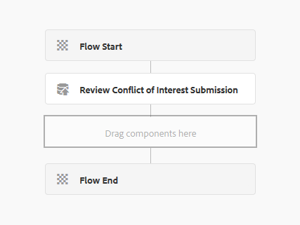
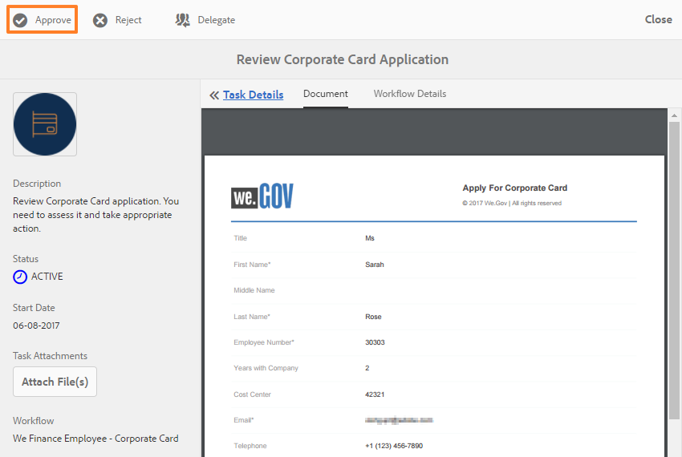

# Procedura dettagliata sul sito di riferimento self-service dei dipendenti{#employee-self-service-reference-site-walkthrough}

## Prerequisito {#prerequisite}

Configurate i siti di riferimento come descritto in [Impostazione e configurazione dei siti](../../forms/using/setup-reference-sites.md)di riferimento di AEM Forms.

## Panoramica {#overview}

I sistemi self-service dei dipendenti, generalmente ospitati sulla Intranet aziendale, consentono ai dipendenti di accedere a una serie di informazioni e servizi che possono utilizzare dai loro uffici. Offre ai dipendenti il controllo completo sulle operazioni da eseguire, ad esempio l&#39;accesso ai dati sul lavoro, la richiesta di congedo e l&#39;invio di note spese. Dall&#39;altro lato, aiuta le organizzazioni a migliorare l&#39;efficienza dei processi e a ridurre i costi, mantenendo i dipendenti informati e impegnati.

Il sito di riferimento self-service dei dipendenti illustra come utilizzare AEM Forms per implementare il sistema di self-service dei dipendenti nell’organizzazione.

>[!NOTE]
>
>Gli esempi, le immagini e le descrizioni utilizzati nella procedura dettagliata di self-service dipendente utilizzano il sito di riferimento We.Finance.

## Procedura dettagliata del questionario sui conflitti di interesse {#conflict-of-interest-questionnaire-walkthrough}

Di tanto in tanto, le organizzazioni chiedono ai propri dipendenti di inviare un questionario sul conflitto di interessi per identificare le attività esterne o i rapporti personali dei loro dipendenti che potrebbero entrare in conflitto con la loro organizzazione.

Il reparto Conformità dell&#39;organizzazione di Sarah ha chiesto ai dipendenti di inviare il questionario sul conflitto di interessi.

### Sarah invia il questionario sul conflitto di interessi {#sarah-submits-the-conflict-of-interest-questionnaire}

Sarah passa al portale aziendale, accede e fa clic su Dipendente per accedere al dashboard del dipendente. Trova il questionario sul conflitto di interessi nel dashboard del dipendente e fai clic su **[!UICONTROL Applica]**.

Portale organizzazione

Pannello dipendente

Sarah naviga nel modulo utilizzando il pulsante Avanti e legge le sezioni Introduzione e Definizione. Risponde alle domande nella sezione Domande. Infine firma e invia il questionario.

Il portale dell&#39;organizzazione e il questionario sono reattivi e facili da usare per i dispositivi mobili. Il seguente flusso di lavoro mostra come Sarah esplora e invia il questionario sul suo dispositivo mobile.

**Come funziona**

Il portale dell&#39;organizzazione e il dashboard dei dipendenti sono pagine di AEM Sites. Il dashboard elenca diverse opzioni self-service, come il questionario sui conflitti di interessi. Il pulsante Applica è collegato a un modulo adattivo.

Il modulo adattivo utilizza delle regole per mostrare o nascondere le informazioni in base alla risposta fornita nella scheda Domande. Inoltre, il modulo utilizza il componente Scribble per accedere alla scheda Dichiarazione. Esaminare il modulo adattivo in `https://[authorHost]:[authorPort]/editor.html/content/forms/af/we-finance/employee/self-service/conflict-of-interest.html`.

**Vedi te stesso**

Vai a `https://[publishHost]:[publishPort]/content/we-finance/global/en/self-service-forms.html` e accedi utilizzando `srose/srose` come nome utente/password per Sarah. Fai clic su **[!UICONTROL Dipendente]** per accedere al dashboard, quindi fai clic su **[!UICONTROL Applica]** al questionario sui conflitti di interessi. Riesaminare e presentare il questionario.

#### Gloria esamina e approva la presentazione del questionario sul conflitto di interessi {#gloria-reviews-and-approves-the-conflict-of-interest-questionnaire-submission}

Il questionario sul Conflitto di interessi presentato da Sarah è assegnato a Gloria Rios per un riesame. Gloria lavora come Responsabile per la conformità aziendale. Gloria accede alla propria Casella in entrata AEM e rivede le attività assegnate. Approva il questionario presentato da Sarah e completa il compito.

Posta in arrivo di Gloria

Apri attività

**Come funziona**

L&#39;azione di invio nel questionario sul conflitto di interessi attiva un flusso di lavoro che crea un&#39;attività nella inbox di Gloria per l&#39;approvazione. Consulta il flusso di lavoro dei moduli in `https://[authorHost]:[authorPort]/editor.html/conf/global/settings/workflow/models/we-finance/employee/self-service/we-finance-employee-conflict-of-interest.html`

**Vedi te stesso**

Accedi `https://[publishHost]:[publishPort]/content/we-finance/global/en/login.html?resource=/aem/inbox.html` e accedi utilizzando `grios/password` come nome utente/password per Gloria Rios. Aprite l&#39;attività creata per il questionario sul conflitto di interessi e approvatela.

## Procedura dettagliata sull&#39;applicazione con carta di credito {#corporate-card-application-walkthrough}

Sarah viaggia molto per lavoro e richiede una carta di credito aziendale per pagare le sue bollette in movimento. Fa domanda per una carta aziendale tramite il portale aziendale dei dipendenti.

### Sarah presenta l&#39;applicazione della carta di credito {#sarah-submits-the-corporate-card-application}

Sarah passa al portale aziendale, accede e fa clic su **[!UICONTROL Dipendente]** per accedere al dashboard del dipendente. Trova l&#39;applicazione di carta d&#39;identità nel dashboard del dipendente e fai clic su **[!UICONTROL Applica]**.

Portale organizzazione

Pannello dipendente

Fa clic su **[!UICONTROL Applica]** nell&#39;applicazione della carta di credito. Viene aperta un’applicazione a pagina singola. Compila tutti i dettagli e fa clic su **[!UICONTROL Applica]** per inviare l&#39;applicazione.

**Come funziona**

Il portale dell&#39;organizzazione e il dashboard dei dipendenti sono pagine di AEM Sites. Il dashboard elenca diverse opzioni self-service, come l&#39;applicazione scheda aziendale. Il pulsante Applica dell&#39;applicazione è collegato a un modulo adattivo.

Il modulo adattivo per l&#39;applicazione con scheda aziendale è un modulo adattivo, semplice, di una pagina e reattivo. Utilizza componenti di base per moduli adattivi come testo, telefono, caselle numeriche e passaggi numerici. Esaminate il modulo adattivo all&#39;indirizzo:\
`https://[authorHost]:[authorPort]/editor.html/content/forms/af/we-finance/employee/self-service/corporate-card.html`.

**Vedi te stesso**

Vai a `https://[publishHost]:[publishPort]/content/we-finance/global/en/self-service-forms.html` e accedi utilizzando `srose/srose` come nome utente/password per Sarah. Fate clic su **[!UICONTROL Dipendente]** per accedere al dashboard, quindi fate clic su **[!UICONTROL Applica]** nell&#39;applicazione Carta aziendale. Compila i dettagli e invia la domanda.

### Gloria esamina e approva l&#39;applicazione della carta aziendale {#gloria-reviews-and-approves-the-corporate-card-application}

La richiesta di carta aziendale inviata da Sarah è assegnata a Gloria Rios per la revisione. Gloria accede alla propria Casella in entrata AEM e rivede le attività assegnate. Approva la richiesta presentata da Sarah e completa il compito.

Posta in arrivo di Gloria

Apri attività

**Come funziona**

Il flusso di lavoro di invio nell’applicazione Cartolina aziendale attiva un flusso di lavoro Forms che crea un’attività nella inbox di Gloria per l’approvazione. Consulta il flusso di lavoro dei moduli in `https://[authorHost]:[authorPort]/editor.html/conf/global/settings/workflow/models/we-finance/employee/self-service/we-finance-employee-corporate-card.html`

**Vedi te stesso**

Accedi `https://[publishHost]:[publishPort]/content/we-finance/global/en/login.html?resource=/aem/inbox.html` e accedi utilizzando `grios/password` come nome utente/password per Gloria Rios. Aprite l&#39;attività creata per l&#39;applicazione Carta aziendale e approvatela.

## Procedura dettagliata per l&#39;invio della nota spese {#expense-report-submission-walkthrough}

Mentre Sarah spende durante i viaggi d&#39;affari, deve inviare le note spese per l&#39;approvazione. L&#39;opzione self-service nella sua organizzazione le consente di inviare la nota spese online.

### Sarah invia l&#39;applicazione nota spese {#sarah-submits-the-expense-report-application}

Sarah passa al portale aziendale, accede e fa clic su **[!UICONTROL Dipendente]** per accedere al dashboard del dipendente. Trova l&#39;applicazione Nota spese nel dashboard del dipendente e fai clic su **[!UICONTROL Applica]**.

Portale organizzazione

Pannello dipendente

Fare clic su **[!UICONTROL Applica]** nell&#39;applicazione Nota spese. Si apre un modulo di applicazione, con due schede: Nome rapporto e Dettagli rapporto. L&#39;icona **+** nella scheda Dettagli rapporto consente di aggiungere più spese in un rapporto.

Il portale dell&#39;organizzazione e le applicazioni sono reattivi e facili da usare per i dispositivi mobili. Il seguente flusso di lavoro mostra come Sarah esplora e invia la nota spese sul suo dispositivo mobile.

**Come funziona**

Il portale dell&#39;organizzazione e il dashboard dei dipendenti sono pagine di AEM Sites. Il dashboard elenca diverse opzioni self-service, come l&#39;applicazione nota spese. Il pulsante Applica è collegato a un modulo adattivo.

Le schede Nome rapporto e Dettagli rapporto nel modulo adattivo sono componenti Pannello. Il pannello Dettagli rapporto contiene il pannello Spese. Si tratta di un pannello ripetibile che consente di aggiungere più spese nel rapporto. Esaminare il modulo adattivo e le relative configurazioni in `https://[authorHost]:[authorPort]/editor.html/content/forms/af/we-finance/employee/expense-report.html`.

**Vedi te stesso**

Vai a `https://[publishHost]:[publishPort]/content/we-finance/global/en/self-service-forms.html` e accedi utilizzando `srose/srose` come nome utente/password per Sarah. Fare clic su **[!UICONTROL Dipendente]** per accedere al dashboard, quindi fare clic su **[!UICONTROL Applica]** all&#39;applicazione nota spese. Compila i dettagli e invia la domanda.

### Gloria esamina e approva la nota spese {#gloria-reviews-and-approves-the-expense-report}

La nota spese inviata da Sarah è assegnata a Gloria Rios per la revisione. Gloria accede alla propria Casella in entrata AEM e rivede le attività assegnate. Approva la richiesta presentata da Sarah e completa il compito.

Posta in arrivo di Gloria

Apri attività

**Come funziona**

Il flusso di lavoro di invio nell&#39;applicazione Nota spese attiva un flusso di lavoro Forms che crea un&#39;attività nella inbox di Gloria per l&#39;approvazione. Consulta il flusso di lavoro dei moduli in `https://[authorHost]:[authorPort]/editor.html/conf/global/settings/workflow/models/we-finance/employee/self-service/we-finance-employee-expense-report-workflow.html`

**Vedi te stesso**

Accedi `https://[publishHost]:[publishPort]/content/we-finance/global/en/login.html?resource=/aem/inbox.html` e accedi utilizzando `grios/password` come nome utente/password per Gloria Rios. Aprire l&#39;attività creata per l&#39;applicazione nota spese e approvarla.

## Procedura dettagliata sull&#39;applicazione {#leave-application-walkthrough}

Sarah sta pianificando una vacanza in famiglia il mese prossimo e vuole fare domanda per una settimana di congedo dal lavoro.

### Sarah invia l&#39;applicazione di congedo {#sarah-submits-the-leave-application}

Sarah passa al portale aziendale, accede e fa clic su **[!UICONTROL Dipendente]** per accedere al dashboard del dipendente. Trova di lasciare l&#39;applicazione sul dashboard del dipendente e fai clic su **[!UICONTROL Applica]**.

Portale organizzazione

Pannello dipendente

Si apre l&#39;applicazione di congedo con il nome di Sarah e l&#39;ID dipendente precompilato nel modulo. Mostra anche l&#39;equilibrio e la storia del suo congedo. Compila i dettagli del congedo e presenta la domanda di approvazione.

Il portale dell&#39;organizzazione e le applicazioni sono reattivi e facili da usare per i dispositivi mobili. Nel seguente flusso di lavoro viene illustrato come Sarah esplora e invia l’applicazione sul suo dispositivo mobile.

**Come funziona**

Il portale dell&#39;organizzazione e il dashboard dei dipendenti sono pagine di AEM Sites. Nel dashboard sono elencate diverse opzioni self-service, ad esempio l&#39;applicazione di destinazione. Il pulsante Applica è collegato a un modulo adattivo.

Il modulo adattivo per l&#39;applicazione di congedo si basa sul modello dati dipendente Lascia il modulo. Nella sezione Saldo congedo, la tabella dei saldi di uscita viene compilata utilizzando il servizio `getLeavesOf` Modello dati modulo. I campi Data di inizio e Data di fine utilizzano regole per convalidare che i valori di data siano uguali o successivi alla data corrente. La durata dell&#39;uscita viene calcolata utilizzando la `calcBusinessDays` funzione.

È possibile esaminare il modulo adattivo e il modello dati modulo nelle seguenti posizioni:

`https://[authorHost]:[authorPort]/editor.html/content/forms/af/we-finance/employee/self-service/leave-application.html`

`https://[authorHost]:[authorPort]/aem/fdm/editor.html/content/dam/formsanddocuments-fdm/db`

**Vedi te stesso**

Vai a `https://[publishHost]:[publishPort]/content/we-finance/global/en/self-service-forms.html` e accedi utilizzando `srose/srose` come nome utente/password per Sarah. Fate clic su **[!UICONTROL Dipendente]** per accedere al dashboard, quindi fate clic su **[!UICONTROL Applica]** all&#39;uscita dall&#39;applicazione. Compila i dettagli e invia la domanda.

#### Gloria recensioni e approva la richiesta di congedo {#gloria-reviews-and-approves-the-leave-application}

La richiesta di congedo presentata da Sarah è assegnata a Gloria Rios per la revisione. Gloria accede alla propria Casella in entrata AEM e rivede le attività assegnate. Approva la richiesta presentata da Sarah e completa il compito.

Posta in arrivo di Gloria

Apri attività

**Come funziona**

Il flusso di lavoro di invio nell’applicazione di uscita attiva un flusso di lavoro Forms che crea un’attività nella inbox di Gloria per l’approvazione. Consulta il flusso di lavoro dei moduli in `https://[authorHost]:[authorPort]/editor.html/conf/global/settings/workflow/models/we-finance/employee/self-service/we-finance-employee-leave-application.html`

**Vedi te stesso**

Accedi `https://[publishHost]:[publishPort]/content/we-finance/global/en/login.html?resource=/aem/inbox.html` e accedi utilizzando `grios/password` come nome utente/password per Gloria Rios. Aprire l&#39;attività creata per uscire dall&#39;applicazione e approvarla.
