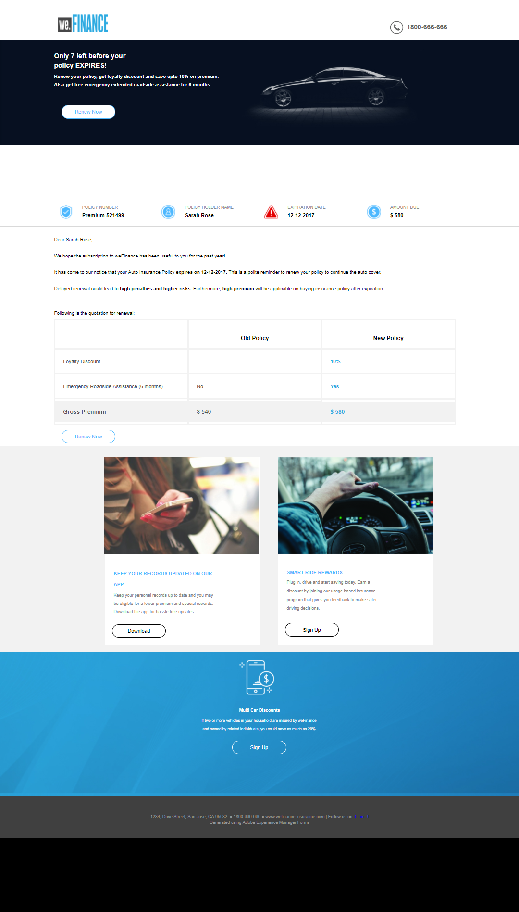

# Procedura dettagliata sul sito di riferimento We.Finance Auto Insurance Renewal{#we-finance-auto-insurance-renewal-reference-site-walkthrough}

## Scenario del sito di riferimento We.Finance  {#we-finance-reference-site-scenario}

Il sito We.Finance è un sito di servizi finanziari progettato per aiutarvi a apprendere le capacità di comunicazione interattiva di  AEM Forms.

Leggi la descrizione dettagliata del caso di utilizzo della funzione Assicurazione automatica We.Finance che mostra come AEM moduli e la sua integrazione con Microsoft Dynamics contribuiscano a personalizzare l&#39;esperienza dei clienti in una società di servizi finanziari. La procedura interattiva è stata progettata per semplificare l&#39;implementazione di transazioni digitali complesse e la comunicazione con i clienti in una società finanziaria.

**Il viaggio inizia con il caso di utilizzo:**

Sarah Rose è un cliente esistente di We.Finance e ha acquistato una polizza di assicurazione auto. Ora è il momento dell’anno per il rinnovo della sua polizza assicurativa. Gloria Rios, agente assicurativo, We.Finance invia un promemoria a Sarah riguardo il rinnovo della sua polizza. Sarah segue le istruzioni fornite nell&#39;e-mail e completa con successo la procedura.

## Procedura dettagliata sull&#39;applicazione di assicurazione automatica {#auto-insurance-application-walkthrough}

Lo scenario dell&#39;applicazione di assicurazione automatica We.Finance è una narrazione visiva per l&#39;utente e si basa su due persone:

* Sarah Rose, un cliente di We.Finance
* Gloria Rios, agente assicurativo, We.Finance

### Gloria invia una comunicazione di rinnovo della polizza assicurativa da We.Finance {#gloria-sends-an-insurance-policy-renewal-communication-from-we-finance}

Gloria accede AEM&#39;istanza, fa clic su Rinnovo **assicurazione automatica,** quindi seleziona **Apri interfaccia utente agente.** Il clic precompila il documento assicurativo con i dettagli sulla polizza di Sarah Rose. Gloria fa clic **su Invia** e sullo schermo viene visualizzato un messaggio &quot;Invio avviato&quot;, quindi in pochi secondi &quot;Invio completato&quot;.

Sarah riceve un&#39;e-mail con l&#39;oggetto &quot;Il rinnovo della tua assicurazione automatica&quot;.

#### Vedi te stesso {#see-it-yourself}

Vai a **Adobe Experience Manager** > **Forms** > **Forms &amp; Documents** > **We.Finance** > **Auto Insurance**. Selezionate la comunicazione **** interattiva Rinnovo assicurazione automatica e fate clic su **Apri interfaccia utente** agente. La comunicazione interattiva si apre nell’interfaccia utente dell’agente. Immettete un indirizzo e-mail valido per ricevere l&#39;e-mail con il documento del criterio allegato e fate clic su Invia.

È possibile accedere e rivedere la comunicazione interattiva Auto Insurance Renewal direttamente da `https://[authorHost]: authorPort]/aem/formdetails.html/content/dam/formsanddocuments/we-finance/autoinsurance/auto-insurance-renewal.`

### Sarah riceve una comunicazione di rinnovo polizza assicurativa da We.Finance e decide di rinnovare {#sarah-receives-an-insurance-policy-renewal-communication-from-we-finance-and-decides-to-renew}

Sarah riceve una email con un allegato da We.Finance che le ricorda che la sua assicurazione auto sta per scadere. L&#39;allegato è la versione cartacea della lettera di assicurazione automatica.

Sarah fa clic su **Rinnova ora** ed è diretta alla versione web della sua lettera di assicurazione auto. In cima a questa lettera, Sarah trova il numero di giorni che rimangono prima che la sua politica scada. La pagina fornisce a Sarah una panoramica di base dei suoi dettagli sulla polizza assicurativa, come Numero polizza, Importo dovuto, e altre informazioni come offerte di sconto e premi fedeltà. Sarah fa di nuovo clic su **Rinnova ora** in fondo alla politica.

#### Come funziona {#how-it-works}

L&#39;output web e di stampa della tua lettera di assicurazione automatica viene creato utilizzando le funzionalità multicanale delle comunicazioni interattive.

Il pulsante Rinnova ora nell’e-mail è collegato all’applicazione Rinnovo assicurazione automatica, che è una comunicazione interattiva su un’istanza di pubblicazione.

#### Vedi te stesso {#see-it-yourself-1}

Devi aver ricevuto un&#39;e-mail con un PDF allegato. Il PDF è una versione di stampa della lettera di assicurazione automatica. Fate clic su **Rinnova ora** per accedere alla versione Web del criterio. Controlla i tuoi dati personali e i dati personali e fai clic su **Rinnova** per passare a un&#39;altra comunicazione interattiva.

Il pulsante **Rinnova ora** nell&#39;e-mail indirizza Sarah alla versione Web del criterio. Potete visitare il seguente URL:

`https://[authorServer]:[authorPort]/content/document.html?schema=fdm&documentId=/content/forms/af/we-finance/autoinsurance/auto-insurance-renewal/channels/web.html&customerId=1`

È possibile controllare il riepilogo dettagliato del rinnovo assicurazione automatica e fare clic su **Rinnova ora** nella parte inferiore della pagina.

### Sarah raggiunge la pagina di pagamento {#sarah-reaches-the-payment-page}

We.Finance porta Sarah alla pagina di pagamento. Sarah ricontrolla il suo numero e la data di scadenza con i suoi record. Sul lato destro della pagina, controlla il Riepilogo pagamenti del rinnovo con sconto del 10% sull&#39;importo totale.

#### Come funziona {#how-it-works-1}

Il pulsante Rinnova ora indirizza Sarah alla pagina di pagamento. La pagina di pagamento è un modulo adattivo.

#### Vedi te stesso {#see-it-yourself-2}

Fare clic su **Rinnova ora** per accedere alla pagina Pagamento. Compila le informazioni sulla carta di credito e fai clic su **Effettua pagamento**.

Puoi accedere alla pagina di pagamento nell’istanza di creazione all’indirizzo

`https://[authorServer]:[authorPort]/content/document.html?documentId=/content/forms/af/we-finance/credit-card/ccbillpayment.html&schema=fdm&customerId=1`

### Sarah effettua il pagamento e completa il processo {#sarah-makes-the-payment-and-completes-the-process}

Sarah riempie i dettagli della sua carta di credito e fa clic su **Effettua pagamento**.

#### Come funziona {#how-it-works-2}

Quando Sarah compila i dettagli della carta di credito e fa clic su Invia, il pagamento della carta di credito viene elaborato e sullo schermo viene visualizzato un messaggio di ringraziamento configurato nel modulo adattivo.

#### Vedi te stesso {#see-it-yourself-3}

È possibile visualizzare il messaggio di conferma dopo aver fatto clic su Effettua pagamento in

`https://[authorServer]:[authorPort]/content/forms/af/we-finance/credit-card/ccbillpayment/jcr:content/guideContainer.guideThankYouPage.html?owner=admin&status=Submitted`
