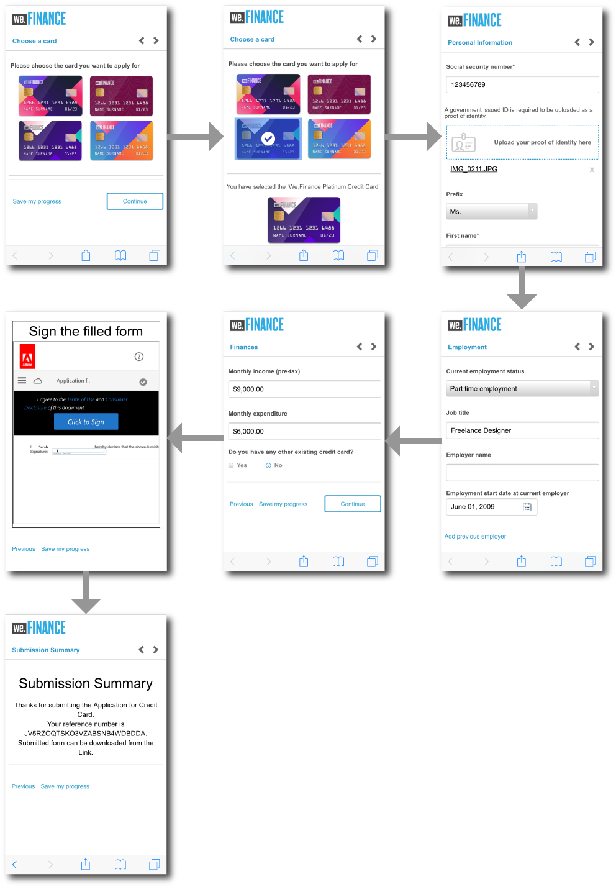
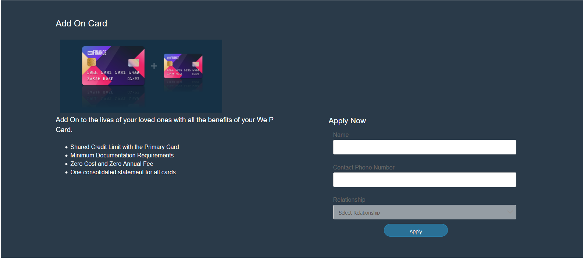
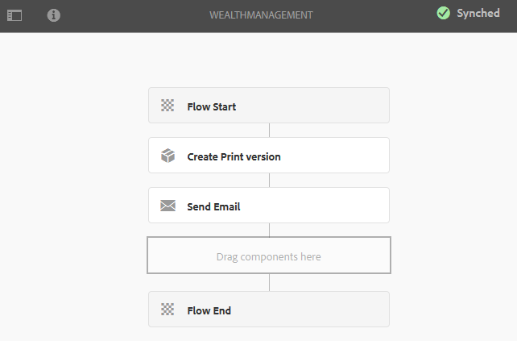

# Procedura dettagliata sul sito di riferimento We.Finance{#we-finance-reference-site-walkthrough}

## Prerequisiti {#pre-requisites}

Configurate i siti di riferimento come descritto in [Impostazione e configurazione  siti](../../forms/using/setup-reference-sites.md)di riferimento AEM Forms.

## Scenari del sito di riferimento di We.Finance {#we-finance-reference-site-scenarios}

We.Finance è un&#39;organizzazione leader nel settore dei servizi finanziari che offre soluzioni finanziarie complete e personalizzate in base alle esigenze dei diversi profili cliente. Offrono carte di credito, mutui per la casa e servizi di assicurazione per la casa.

Il loro obiettivo è quello di raggiungere i clienti esistenti e potenziali sul loro dispositivo preferito, spiegare i vantaggi dei loro servizi e aiutarli ad iscriversi ai loro servizi. Inoltre, stanno cercando di promuovere più prodotti finanziari come schede aggiuntive che i clienti potrebbero trovare interessanti.

Continua a leggere informazioni dettagliate sui casi di utilizzo di We.Finance e scopri in che modo  AEM Forms aiuta le organizzazioni finanziarie a raggiungere i loro obiettivi. Vengono fornite le seguenti procedure dettagliate:

* [Procedura dettagliata sulle applicazioni con carta di credito](#credit-card-application-walkthrough)
* [Procedura dettagliata sull&#39;applicazione di ipoteca](#home-mortgage-application-walkthrough)
* [Home Informazioni dettagliate sull&#39;applicazione ipotecaria con Microsoft Dynamics](#home-mortgage-application-walkthrough-with-microsoft-dynamics)
* [Procedura dettagliata per l&#39;applicazione di assicurazione sulla casa](#home-insurance-application-walkthrough)
* [Procedura dettagliata sulla gestione della ricchezza](#wealthmanagementwalkthrough)
* [Procedura dettagliata sull&#39;applicazione di assicurazione automatica](#autoinsuranceapplicationwalkthrough)

## Procedura dettagliata sulle applicazioni con carta di credito {#credit-card-application-walkthrough}

Lo scenario dell&#39;applicazione della carta di credito We.Finance coinvolge le seguenti persone:

* Sarah Rose, un cliente di We.Finance
* Gloria Rios, responsabile della carta di credito e ipoteca, We.Finance

Nella seguente infografica viene illustrato il flusso di lavoro dettagliato dell&#39;applicazione della carta di credito.

Esaminiamo in dettaglio lo scenario relativo al sito di riferimento per comprendere in che modo  AEM Forms aiuta We.Finance a raggiungere i loro obiettivi.

### Sarah riceve una newsletter da We.Finance e fa domanda per una carta di credito {#sarah-receives-a-newsletter-from-we-finance-and-applies-for-a-credit-card}

Sarah Rose è un cliente esistente di We.Finance. Riceve una newsletter da We.Finance sulle nuove carte di credito in offerta. Trova le offerte eccitanti e decide di fare domanda per una carta di credito. Fa clic sul pulsante Applica ora nella newsletter, che la porta all&#39;applicazione della carta di credito sul portale We.Finance.

#### Come funziona {#how-it-works}

La newsletter inviata a Sarah è un’implementazione personalizzata che attiva un messaggio e-mail per l’ID e-mail specificato. Il pulsante Applica ora nell’e-mail è collegato all’applicazione della carta di credito, un modulo adattivo in un’istanza pubblicata.

#### Vedi te stesso {#see-it-yourself}

Aprite il seguente URL nell’istanza di pubblicazione per attivare un messaggio e-mail per la newsletter. Per ricevere la newsletter, accertatevi di sostituirla `[emailID]` con un account e-mail valido. Aprite la newsletter e fate clic su **[!UICONTROL Applica ora]** per passare all’applicazione della carta di credito.

`https://[publishServer]:[publsihPort]/content/campaigns/we-finance/start.html?app=cc&email=[emailID]&givenName=Sarah&familyName=Rose`

### Sarah trova l&#39;offerta interessante e sceglie di applicare {#sarah-finds-the-offer-interesting-and-chooses-to-apply}

Sarah decide di richiedere la carta di credito e tocca il pulsante **Applica ora** nell&#39;e-mail. Porta Sarah all&#39;applicazione della carta di credito sul portale We.Finance. Il modulo dell&#39;applicazione è organizzato in sezioni utilizzando un layout scheda.

Sarah seleziona una carta di credito dalle opzioni disponibili e fa clic su **[!UICONTROL Continua]**.

Nella pagina Informazioni personali, mentre Sarah fornisce il suo numero di previdenza sociale, riceve una richiesta per accedere con le sue credenziali.

Sarah è un cliente esistente di We.Finance. Effettua l&#39;accesso con le credenziali del suo account We.Finance e i suoi dati personali vengono compilati automaticamente nel modulo. Sarah continua a compilare il modulo di richiesta, e questo quando viene visualizzato un promemoria per una riunione a cui deve partecipare. Fare clic su **[!UICONTROL Salva l&#39;avanzamento]** del modulo di richiesta. Salva tutte le informazioni che Sarah ha compilato fino ad ora e viene visualizzata una finestra di dialogo per confermare se desidera ricevere una e-mail con un collegamento alla sua bozza di applicazione per completare in seguito.

Sarah fa clic su **[!UICONTROL Invia posta]**. Riceve un&#39;e-mail con un link per riprendere la richiesta della carta di credito.

**Sarah accede all&#39;applicazione della carta di credito dal suo dispositivo mobile**

Se Sarah accede all&#39;applicazione della carta di credito dal suo dispositivo mobile, l&#39;applicazione reattiva si apre in una visualizzazione ottimizzata per i dispositivi mobili. In questa visualizzazione, il modulo dell&#39;applicazione viene rappresentato come una sezione alla volta. Consente a Sarah di visualizzare e fornire informazioni in modo progressivo mentre naviga nell&#39;applicazione.

**Come funziona**

Il pulsante **Applica ora** indirizza Sarah all&#39;applicazione della carta di credito. L’applicazione è un modulo adattivo, che può essere esaminato nelle istanze di creazione presenti in `https://[host]:'port'/editor.html/content/forms/af/we-finance/cc-app.html`.

Alcune delle funzioni chiave che è possibile esaminare nel modulo adattivo sono:

* Si basa su uno schema XSD.
* È costruito utilizzando il tema A di finanziamento We per lo stile e il modello We.Finance per il layout. Inoltre, utilizza Layout senza titoli del pannello nel layout dell&#39;intestazione del modulo per la navigazione mobile. Viene visualizzato un layout mobile progressivo quando viene aperto da un dispositivo mobile. Potete esaminare il modello in `https://[host]:'port'/libs/wcm/core/content/sites/templates.html/conf/we-finance` e il tema in `https://[host]:'port'/editor.html/content/dam/formsanddocuments-themes/we-finance/we-finance-theme-a/jcr:content`.
* Include regole del modulo adattivo per richiamare i servizi del modello dati modulo per precompilare i dettagli utente dell&#39;utente connesso. Richiama inoltre i servizi per precompilare le informazioni in base al numero di previdenza sociale o all&#39;indirizzo e-mail fornito nel modulo. È possibile esaminare i modelli di dati dei moduli e i relativi servizi in `https://[host]:'port'/aem/forms.html/content/dam/formsanddocuments-fdm`.
* Utilizza vari componenti per moduli adattivi per acquisire gli input e adattarsi alle risposte degli utenti. Utilizza anche componenti come E-mail che supportano i tipi di input HTML5.
* Utilizza il componente Fase firma per visualizzare il modulo compilato e consente la firma elettronica sul modulo.
* Il pulsante Save my progress genera un ID univoco per l’utente e salva l’applicazione parzialmente compilata come bozza in un nodo AEM repository. Inoltre, visualizza una finestra di dialogo che richiede l&#39;autorizzazione per inviare un&#39;e-mail con un collegamento al nodo che contiene la bozza dell&#39;applicazione. Il pulsante Invia e-mail nella finestra di dialogo di conferma attiva un messaggio e-mail contenente un collegamento al nodo che contiene la bozza.
* Utilizza l&#39;azione di invio Richiama AEM flusso di lavoro per attivare il flusso di lavoro di approvazione della carta di credito. È possibile esaminare il flusso di lavoro utilizzato in questo modulo in `https://[host]:'port'/editor.html/conf/global/settings/workflow/models/we-finance-credit-card-workflow.html`

È consigliabile esaminare il modulo per comprendere lo schema, i componenti, le regole, i modelli dati modulo, il flusso di lavoro moduli e l&#39;azione di invio utilizzata per creare il modulo.

Per ulteriori informazioni sulle funzioni utilizzate nel modulo adattivo per l&#39;applicazione con carta di credito, consulta anche la seguente documentazione:

* [Introduzione alla creazione di moduli adattivi](../../forms/using/introduction-forms-authoring.md)
* [Creazione di moduli adattivi tramite lo schema XML](../../forms/using/adaptive-form-xml-schema-form-model.md)
* [Editor regola](../../forms/using/rule-editor.md)
* [Temi](../../forms/using/themes.md)
* [Integrazione dei dati](../../forms/using/data-integration.md)
* [Utilizzo di  Adobe Sign nei moduli adattivi](../../forms/using/working-with-adobe-sign.md)
* [Flusso di lavoro Forms basato su OSGi](../../forms/using/aem-forms-workflow.md)

**Vedi te stesso**

Quando hai effettuato l&#39;accesso come Sarah Rose, fai clic sul pulsante **Applica ora** nell&#39;applicazione della carta di credito. Compilate alcuni dettagli, esplorate vari componenti per moduli adattivi e fate clic su **Salva avanzamento** per ricevere un messaggio e-mail con un pulsante **Riprendi** che collega alla bozza dell&#39;applicazione. Accertatevi di specificare l&#39;ID e-mail nel modulo dell&#39;applicazione per ricevere l&#39;e-mail.

Leggi il tema We.Finance disponibile all&#39;indirizzo:

`https://<host>:<AuthorPort>/editor.html/content/dam/formsanddocuments-themes/we-Finance/we-Finance-Theme-A/jcr:content`

Puoi consultare il modello We.Finance all&#39;indirizzo:

`https://<host>:<AuthorPort>/editor.html/conf/we-finance/settings/wcm/templates/we-finance-template/structure.html`

### Sarah riprende e invia l&#39;applicazione {#sarah-resumes-and-submits-the-application}

Sarah ritorna più tardi e trova un&#39;e-mail da We.Finance. Fa clic sul pulsante **Riprendi** nell&#39;e-mail che la porta alla sua applicazione di carte di credito bozza. Le informazioni che ha compilato in precedenza vengono precompilate. Compila il modulo di richiesta rimanente, firma l&#39;applicazione e lo invia.

In alternativa, può accedere alla sua bozza di applicazione in **My Forms** sulla home page di We.Finance.

#### Come funziona {#how-it-works-1}

Il pulsante Riprendi nell&#39;e-mail reindirizzerà Sarah al nodo contenente la bozza dell&#39;applicazione.

#### Vedi te stesso {#see-it-yourself-1}

È necessario aver ricevuto un&#39;e-mail con un collegamento alla bozza dell&#39;applicazione sull&#39;ID e-mail specificato durante la compilazione del modulo dell&#39;applicazione. Procedere, compilare le sezioni rimanenti dell&#39;applicazione e inviarla.

### We.Finance riceve e approva l&#39;applicazione {#approving-the-application}

We.Finance riceve la richiesta di carta di credito inviata da Sarah. Un compito è assegnato a Gloria Rios. Rileva l&#39;attività nella propria casella AEM Posta in arrivo e la approva.

#### Come funziona {#how-it-works-2}

Quando Sarah riempie e invia l&#39;applicazione della carta di credito, un Forms Workflow si attiva e un&#39;attività viene creata nella inbox AEM di Gloria.

 AEM Forms su OSGi offre flussi di lavoro incentrati sui moduli che consentono di creare flussi di lavoro basati su moduli adattivi. Questi flussi di lavoro possono essere utilizzati per revisioni e approvazioni, flussi di processi aziendali, per avviare Document Services, per l&#39;integrazione con  flusso di lavoro di firma Adobe Sign e così via. Per ulteriori informazioni, consultate Flusso di lavoro incentrato su [Forms in OSGi](../../forms/using/aem-forms-workflow.md).

Nell&#39;immagine seguente viene illustrato il flusso di lavoro AEM che elabora l&#39;applicazione con carta di credito e genera un output PDF dell&#39;applicazione.

#### Vedi te stesso {#see-it-yourself-2}

Potete accedere AEM inbox per il sito we.finance all&#39;indirizzo https://&lt;*hostname*>:&lt;*PublishPort*>/content/we-finance/global/en.html. Sulla pagina, toccate **Accedi**, selezionate la casella di controllo **Accesso come rappresentante** , accedete alla casella in entrata AEM utilizzando `grios/password` come nome utente/password per Gloria Rios e approvate l&#39;applicazione della carta di credito. Per informazioni sull&#39;utilizzo di AEM Inbox per le attività relative ai flussi di lavoro incentrate sui moduli, vedere [Gestione delle applicazioni e delle attività Forms in AEM Posta in arrivo](../../forms/using/manage-applications-inbox.md).

Quando si approva l&#39;applicazione, Sarah riceve un&#39;e-mail con il kit di benvenuto.

### Sarah riceve il kit di benvenuto e richiede una scheda aggiuntiva {#sarah-receives-the-welcome-kit-and-applies-for-an-add-on-card}

Quando l&#39;applicazione della carta di credito di Sarah viene approvata, riceve un&#39;e-mail con un collegamento al kit di benvenuto. Apre il kit di benvenuto, che include i dettagli del conto della sua carta di credito. Il kit di benvenuto mostra anche offerte promozionali personalizzate per Sarah. Mentre scorre verso il basso, il kit di benvenuto contiene un modulo incorporato da richiedere per una scheda aggiuntiva. Sarah ha rapidamente inserito i dettagli richiesti dall&#39;interno del kit di benvenuto e si applica alla scheda aggiuntiva. Viene visualizzata una finestra di dialogo di conferma per l&#39;applicazione della scheda aggiuntiva.

Il kit di benvenuto è personalizzato per Sarah e mostra informazioni rilevanti per lei. Offre la possibilità di scaricare una versione PDF del kit di benvenuto.

Il kit di benvenuto include un altro modulo di richiesta che Sarah può compilare e inviare per richiedere una scheda aggiuntiva dall&#39;interno del kit di benvenuto senza visitare il portale We.Finance.

#### Come funziona {#how-it-works-3}

Il kit di benvenuto è una comunicazione interattiva inclusa nel `cq-we-finance-content-pkg.zip` pacchetto. Le schede interattive nella versione desktop per mostrare i vantaggi della carta di credito nel kit di benvenuto sono un layout personalizzato creato utilizzando il layout scheda predefinito di un frammento di documento.

L&#39;applicazione scheda aggiuntiva è un modulo adattivo incorporato nel kit di benvenuto per la comunicazione interattiva.

#### Vedi te stesso {#see-it-yourself-3}

Fate clic sul pulsante Riprendi nel messaggio e-mail ricevuto nel passaggio precedente. Apre la bozza di applicazione. Compila tutti i dettagli e invia la domanda. Riceverete quindi un kit di benvenuto. Esaminate il kit di benvenuto.

Potete anche visualizzare il kit di benvenuto al seguente URL:

https://&lt;*host*>: &lt;*porta*>/content/aemforms-refsite/doclink.html?document=/content/forms/af/we-finance/credit-card/creditcardwelcomekit&amp;customerId=197&amp;channel=web

Potete accedervi nelle istanze di creazione e pubblicazione.

### Sarah riceve il rendiconto della carta di credito {#sarah-receives-a-credit-card-statement}

Mentre Sarah inizia a utilizzare la carta di credito, riceve un&#39;altra e-mail da We.Finance che include il suo estratto conto della carta di credito. Le immagini seguenti mostrano l&#39;e-mail con un collegamento all&#39;estratto conto della carta di credito su dispositivo mobile.

Sarah fa clic su Visualizza rendiconto nell&#39;e-mail per visualizzare il rendiconto della carta di credito. L&#39;istruzione è una comunicazione interattiva. Sono disponibili versioni Web e Stampa (PDF). L&#39;istruzione si integra con Forms Data Model per recuperare dal database i dati specifici del cliente. La dichiarazione interattiva costituisce vari elementi:

* Riepilogo istruzioni
* Report spese dettagliato
* Analisi delle spese grafiche
* Opzione per effettuare un pagamento per l&#39;importo dovuto dall&#39;interno del rendiconto
* Scarica la ricevuta di pagamento

Sarah non deve andare al portale o cercare nelle e-mail la versione PDF dell&#39;estratto conto della carta di credito per l&#39;archiviazione offline. Fa clic su Download Statement (Dichiarazione di download) per scaricare una versione PDF dell&#39;istruzione.

L&#39;istruzione dettagliata viene illustrata in una tabella reattiva. L&#39;istruzione fornisce inoltre la possibilità di pagare una parte o l&#39;intero importo dovuto dall&#39;interno dell&#39;istruzione.

Sarah pianifica il pagamento dall&#39;interno del rendiconto. Sarah può anche utilizzare l&#39;opzione Flexi Pay per dividere il pagamento in parti uguali.

#### Come funziona {#how-it-works-4}

Il rendiconto della carta di credito è una comunicazione interattiva. La tabella spese dettagliata nell&#39;istruzione è una tabella reattiva. L&#39;elemento grafico per l&#39;analisi delle spese è un componente grafico che legge la tabella delle spese e genera il grafico a torta.

#### Vedi te stesso {#see-it-yourself-4}

È possibile esaminare il rendiconto della carta di credito interattiva al seguente URL:

https://&lt;*nomehost*>:&lt;*porta*>/content/aemforms-refsite/doclink.html?document=/content/forms/af/we-finance/credit-card/credit-card-Istruzione&amp;customerId=197&amp;channel=web

Potete accedervi nelle istanze di creazione e pubblicazione.

Il rendiconto della carta di credito visualizza le offerte promozionali verso la fine del rendiconto. Potete integrare  Adobe Target con  AEM Forms Interactive Communication per distribuire offerte promozionali mirate basate su segmenti di clienti specifici. Per configurare la comunicazione interattiva per utilizzare  Adobe Target per offerte personalizzate e mirate, consultate [Creare esperienze](/help/forms/using/experience-targeting-forms.md)mirate.

### We.Finance analizza le prestazioni dell&#39;applicazione della carta di credito {#we-finance-analyzes-the-performance-of-the-credit-card-application}

We.Finance, di tanto in tanto, esamina le prestazioni della loro applicazione con carta di credito per verificare la presenza di eventuali problemi che i clienti potrebbero dover affrontare. Utilizzano questa analisi per prendere decisioni informate sulle modifiche richieste nell&#39;applicazione della carta di credito per migliorare l&#39;esperienza dell&#39;utente, ridurre il tasso di abbandono dei moduli e migliorare così la conversione. Utilizzano l&#39;integrazione di  AEM Forms con  Adobe Analytics per la loro analisi. L&#39;immagine seguente mostra il dashboard di analisi.

Per ulteriori informazioni su come interpretare il dashboard di analisi, vedi [Visualizzazione e comprensione  report](../../forms/using/view-understand-aem-forms-analytics-reports.md)di analisi AEM Forms.

#### Come funziona {#how-it-works-5}

Le metriche delle prestazioni per il modulo dell&#39;applicazione con carta di credito vengono tracciate utilizzando  Adobe Analytics. Per ulteriori informazioni sulla configurazione  Adobe Analytics e la visualizzazione dei rapporti, vedere [Configurazione dell&#39;analisi per moduli e documenti](../../forms/using/configure-analytics-forms-documents.md).

#### Vedi te stesso {#see-it-yourself-br}

Per visualizzare ed esaminare il rapporto di analisi, forniamo i dati iniziali per l&#39;applicazione della carta di credito nel sito di riferimento. Prima di utilizzare i dati iniziali, consulta [Configurare Analytics](../../forms/using/setup-reference-sites.md#configureanalytics). Per visualizzare il rapporto con i dati iniziali, effettuate i seguenti passaggi nell’istanza di creazione:

1. Passate all&#39;interfaccia utente di **Forms e documenti** all&#39;indirizzo https://&lt;*hostname*>:&lt;*AuthorPort*>/aem/forms.html/content/dam/formsanddocuments.

1. Fate clic per aprire la cartella **We.Finance** .
1. Selezionate **Applicazione per modulo adattivo carta** di credito, quindi fate clic su **[!UICONTROL Abilita analisi]** nella barra degli strumenti.

1. Selezionate di nuovo il modulo adattivo e fate clic su Report **[!UICONTROL di]** Analytics nella barra degli strumenti per generare il rapporto. Inizialmente verrà visualizzato un rapporto vuoto.

Per generare report di analisi con dati iniziali:

1. Nel browser dell&#39;indirizzo di CRXDE lite, digitare: `/apps/we-finance/demo-artifacts/analyticsTestData/Credit card Analytics Test Data`
1. I dati del test sono selezionati nella struttura di directory a sinistra.
1. Fate doppio clic sul file selezionato per aprirne il contenuto nel pannello a destra.
1. Copiate tutto il contenuto nel file di dati seed.
1. In CRXDE, passa a: `/content/dam/formsanddocuments/we-finance/cc-app/jcr:content/analyticsdatanode/lastsevendays`
1. Nel campo **[!UICONTROL analyticsdata]** in **[!UICONTROL Proprietà]**, incollare il contenuto copiato del file di dati seed.

1. Selezionate Modulo adattivo **per carta** di credito e fate clic su Rapporto **** analisi nella barra degli strumenti per generare il rapporto con i dati iniziali.

**Test A/B dell&#39;applicazione della carta di credito**

Oltre ad analizzare le prestazioni dell&#39;applicazione della carta di credito e a migliorarla costantemente, We.Finance sfrutta l&#39;integrazione di  AEM Forms con Target per creare test A/B. Consente di distribuire esperienze diverse del modulo di richiesta della carta di credito e identificare l&#39;esperienza che causa un migliore tasso di conversione in termini di compilazione e invio del modulo.

Per configurare Target in  server AEM Forms, vedi [Configurare e integrare Target in  AEM Forms](../../forms/using/ab-testing-adaptive-forms.md#set%20up%20and%20integrate%20target%20in%20aem%20forms).

Effettuare le seguenti operazioni per verificare la creazione di test A/B per il modulo di richiesta di carta di credito We.Finance:

1. Andate su **Forms e documenti** all&#39;indirizzo https://&lt;*hostname*>:&lt;*AuthorPort*>/aem/forms.html/content/dam/formsanddocuments.

1. Fate clic per aprire la cartella **We.Finance** .
1. Selezionare **Domanda per modulo adattivo carta** di credito.
1. Fate clic su **Altro** nella barra degli strumenti e selezionate **Configura test** A/B. Viene visualizzata la pagina Configura test A/B.

1. Specificate un Nome **** attività.
1. Dall&#39;elenco a discesa Pubblico, selezionare un&#39;audience a cui distribuire diverse esperienze del modulo. Ad esempio, **Visitatori che utilizzano Chrome**.
1. Nei campi Distribuzione **** esperienza per le esperienze A e B, specificate la distribuzione, in termini percentuali, per determinare la distribuzione delle esperienze tra il pubblico totale. Ad esempio, se specificate 40, 60 rispettivamente per le esperienze A e B, l&#39;esperienza A verrà servita al 40% del pubblico e il restante 60% visualizzerà l&#39;esperienza B.
1. Fate clic su **Configura**. Viene visualizzata una finestra di dialogo per confermare la creazione del test A/B.
1. Fate clic su **Fine**.
1. Selezionare il modulo **Applicazione carta** di credito e fare clic su **Modifica**. Consente di aprire una delle esperienze. Fate clic su **Esperienza B**. Il modulo si apre in modalità di modifica.

1. Modificate il modulo nel modo desiderato per creare un&#39;esperienza diversa dall&#39;esperienza predefinita A.
1. Passare all’interfaccia utente Forms e Documenti, selezionare il modulo, fare clic su **Altro** e selezionare **Avvia test** A/B.
1. Ora apri il modulo in browser Chrome diverse volte utilizzando il seguente URL:

   `https://[hostname]:[port]/content/dam/formsanddocuments/we-finance/cc-app/jcr:content?wcmmode=disabled`

   >[!NOTE]
   > 
   >Rimuovere il cookie con il nome **mbox** dalla persistenza del cookie del browser prima di aprire il modulo la prossima volta. Verranno visualizzate le esperienze A e B del modulo a caso.

1. Selezionate il modulo, fate clic su **Altro** e fate clic su Rapporto **** test A/B. Non troverai molti dati nel rapporto come hai appena iniziato il test. Forniamo ora alcuni dati iniziali per vedere come si presenterà il rapporto Test A/B.
1. Aprite il CRXDE Lite ed effettuate il backup del seguente file: /libs/fd/fmaddon/gui/components/admin/targetreport/clientlibs/targetreport/js/targetreport.js
1. Sostituire la definizione di funzione `onReportLoadSuccess` nel file di cui sopra con la definizione di funzione nel file seguente: /apps/we-finance/demo-artifacts/targetreport.js

   >[!NOTE]
   >
   >Queste modifiche sono solo a scopo dimostrativo. Dopo aver completato questa procedura, accertatevi di ripristinare il contenuto del file.

1. Aggiorna il rapporto generato e vedrai qualcosa di simile al seguente. Esaminate il dashboard di reporting.

Per terminare il test A/B, fate clic sul pulsante **Termina test** A/B nel dashboard di reporting. Al momento, una finestra di dialogo richiede di dichiarare un&#39;esperienza. Scegliete un vincitore e confermate la fine del test A/B.

Se scegliete l&#39;esperienza A come vincitore, il test A/B verrà messo a termine, e andando avanti, solo l&#39;Esperienza A verrà servita a tutti i tipi di pubblico, inclusi quelli su Chrome.

## Procedura dettagliata sull&#39;applicazione di ipoteca {#home-mortgage-application-walkthrough}

Lo scenario di mutuo per la casa We.Finance include le seguenti persone:

* Sarah Rose, un cliente di We.Finance
* Gloria Rios, responsabile della carta di credito e ipoteca, We.Finance
* John Doe, rappresentante dell&#39;assistenza clienti, We.Finance

La seguente infografica illustra il flusso di lavoro dettagliato di un&#39;applicazione mutuo per la casa.

Esaminiamo ora in dettaglio i passaggi nello scenario relativo al sito di riferimento per vedere in che modo  AEM Forms aiuta We.Finance a raggiungere i loro obiettivi.

### Sarah visita il sito web We.Finance e si applica per la casa ipoteca {#sarah-visits-we-finance-website-and-applies-for-home-mortgage}

Sarah Rose sta progettando di comprare una casa e alla ricerca di un mutuo per la casa. È un cliente We.Finance e quindi visita il portale We.Finance per esplorare le offerte di mutui per la casa. Va alla sezione Prestiti e trova una calcolatrice ipotecaria sul portale. Riempie i dettagli e fa clic su Calcola il mio mutuo, che restituisce un piano ipotecario.

 

Calcolatore ipotecario

Risultato del calcolo ipotecario

#### Come funziona {#how-it-works-6}

Il calcolatore del mutuo per la casa nella pagina Prestiti è un modulo adattivo incorporato  pagina AEM Sites. È possibile esaminare la pagina Prestiti in modalità di modifica in `https://[authorHost]:[authorPort]/editor.html/content/we-finance/global/en/loan-landing-page.html`.

Il calcolatore ipotecario incorporato, che è un modulo adattivo, utilizza regole per calcolare l&#39;importo dell&#39;IME in base ai dettagli del prestito forniti nei campi del calcolatore. È possibile esaminare il modulo adattivo in `https://[authorHost]:[authorPort]/editor.html/content/forms/af/we-finance/hm-calc.html`.

#### Vedi te stesso {#see-it-yourself-5}

Andate al portale We.Finance all&#39;indirizzo `https://<publishHost>:<publishPort>/content/we-finance/global/en.html` e fate clic su **[!UICONTROL Prestiti]**. Fornire i dettagli nella calcolatrice ipotecaria e vedere i risultati.

### Sarah trova l&#39;offerta interessante e sceglie di applicare {#sarah-finds-the-offer-interesting-and-chooses-to-apply-1}

Sarah sceglie di fare domanda per ipoteca di casa e clicca **[!UICONTROL Applica ora]** sui risultati della calcolatrice ipotecaria di casa. Apre l&#39;applicazione per il mutuo per la casa.

Se Sarah accede all&#39;applicazione mutuo per la casa dal suo dispositivo mobile, il modulo dell&#39;applicazione si apre in una visualizzazione ottimizzata per la visualizzazione su un dispositivo mobile. In questa visualizzazione, il modulo dell&#39;applicazione esegue il rendering di una sezione alla volta. Consente a Sarah di visualizzare e fornire le informazioni in modo progressivo mentre naviga nel modulo dell&#39;applicazione.

Le immagini seguenti mostrano il flusso di lavoro man mano che Sarah naviga attraverso l&#39;applicazione di mutuo per la casa sul suo dispositivo mobile.

Se Sarah fa clic su **Applica ora** dal suo desktop, si apre il modulo di richiesta ipotecaria come indicato di seguito. Le informazioni fornite da Sarah nel calcolatore ipotecario sono precompilate nel modulo di richiesta. Sarah compila i dettagli rimanenti e fa clic su **Continua**.

Sulla base delle informazioni che Sarah ha compilato nella calcolatrice ipotecaria, le vengono presentati alcuni piani ipotecari. Sceglie il piano che soddisfa le sue esigenze e continua a riempire l&#39;applicazione. Infine firma e invia la domanda.

La domanda inviata va a We.Finance per l&#39;approvazione.

#### Come funziona {#how-it-works-7}

Il pulsante **Applica ora** indirizza Sarah all&#39;applicazione di ipoteca della casa. L’applicazione è un modulo adattivo, che può essere esaminato nelle istanze di creazione presenti in `https://[host]:'port'/editor.html/content/forms/af/we-finance/hm-app.html`.

Alcune delle funzioni chiave che è possibile esaminare nel modulo adattivo sono:

* Si basa su uno schema XSD, `homeMortgageApplication.xsd`.
* È costruito utilizzando il tema B di finanza We per lo stile e il modello We.Finance per il layout. Inoltre, utilizza Layout senza titoli del pannello nel layout dell&#39;intestazione del modulo per la navigazione mobile. Viene visualizzato un layout mobile progressivo quando viene aperto da un dispositivo mobile. Potete esaminare il modello e il tema utilizzati nel modulo adattivo nelle seguenti posizioni nell’istanza di AEM autore:

   * `https://[host]:'port'/libs/wcm/core/content/sites/templates.html/conf/we-finance`
   * `https://[host]:'port'/editor.html/content/dam/formsanddocuments-themes/we-finance/we-finance-theme-b/jcr:content`

* La prima scheda, Guida introduttiva, nell&#39;applicazione è un calcolatore mutui dinamico che visualizza le opzioni in base alla selezione dell&#39;utente. Ad esempio, i campi e i valori sono diversi per le opzioni Acquisto e Rifinanziamento. Questa funzionalità viene ottenuta utilizzando le regole di visualizzazione. Inoltre, quando si fa clic su Continua e si inizializza la scheda Piani, viene richiamato un servizio Web configurato in un modello dati modulo per recuperare e visualizzare i piani ipotecari. È possibile esaminare i modelli di dati dei moduli e i servizi configurati all&#39;indirizzo `https://[host]:'port'/aem/forms.html/content/dam/formsanddocuments-fdm`.
* Utilizza vari componenti per moduli adattivi per acquisire gli input e adattarsi alle risposte degli utenti. Utilizza anche componenti come E-mail che supportano i tipi di input HTML5.
* Utilizza il componente Fase firma per visualizzare il modulo compilato e consente la firma elettronica sul modulo.
* Utilizza l&#39;azione di invio Richiama AEM flusso di lavoro per attivare il flusso di lavoro AEM Contabilità iniziale transazioni finanziarie. È possibile esaminare il flusso di lavoro utilizzato in questo modulo in `https://[host]:'port'/editor.html/conf/global/settings/workflow/models/we-finance-home-mortgage-workflow.html`

È consigliabile esaminare il modulo per comprendere lo schema, i componenti, le regole, i modelli dati modulo, il flusso di lavoro moduli e l&#39;azione di invio utilizzata per creare il modulo.

Per ulteriori informazioni sulle funzioni utilizzate nel modulo adattivo per l&#39;applicazione per ipoteche per la casa, consultate anche la seguente documentazione:

* [Introduzione alla creazione di moduli adattivi](../../forms/using/introduction-forms-authoring.md)
* [Creazione di moduli adattivi tramite lo schema XML](../../forms/using/adaptive-form-xml-schema-form-model.md)
* [Editor regola](../../forms/using/rule-editor.md)
* [Temi](../../forms/using/themes.md)
* [Integrazione dei dati](../../forms/using/data-integration.md)
* [Utilizzo di  Adobe Sign nei moduli adattivi](../../forms/using/working-with-adobe-sign.md)
* [Flusso di lavoro Forms basato su OSGi](../../forms/using/aem-forms-workflow.md)

#### Vedi te stesso {#see-it-yourself-6}

Vai a `https://'[server]:[port]'/content/we-finance/global/en/all-forms.html` e fai clic sul pulsante **Applica ora** sull&#39;applicazione ipoteca principale. Compila i dettagli nella scheda Guida introduttiva, prova con opzioni diverse e invia l’applicazione.

Accertatevi di specificare un ID e-mail valido nell’applicazione per ricevere un messaggio di conferma nella inbox.

### We.Finance riceve l&#39;applicazione {#approving_the_application-1}

We.Finance riceve la richiesta di mutuo presentata da Sarah. Il compito di approvare o respingere la domanda è assegnato a Gloria Rios. Rileva la domanda e rileva che manca l&#39;ID governativo di Sarah.

Gloria apre il compito e seleziona Necessità di maggiori informazioni e commenta l&#39;ID governativo mancante.

Il compito è ora assegnato a John Doe, un rappresentante di assistenza clienti con We.Finance. Apre il compito e riassume il commento di Gloria. Contatta Sarah e le chiede di mandarle una copia del suo documento di identità. Dopo aver ricevuto una copia dell&#39;ID di Sarah, l&#39;allega al compito e invia la domanda di rivalutazione.

Il compito viene riassegnato a Gloria. Controlla l&#39;ID allegato e approva l&#39;applicazione.

#### Come funziona {#how-it-works-8}

Quando Sarah riempie e invia l&#39;applicazione del mutuo per la casa, un Forms Workflow si attiva e un&#39;attività viene creata nella casella in AEM di Gloria. Mentre Gloria esamina la domanda e chiede maggiori informazioni, il compito è assegnato a John Doe. Quando John Doe allega l&#39;ID e invia nuovamente l&#39;applicazione, viene assegnato a Gloria. Questo è definito nel flusso di lavoro AEM associato all&#39;applicazione del mutuo.

 AEM Forms su OSGi offre flussi di lavoro incentrati sui moduli che consentono di creare flussi di lavoro basati su moduli adattivi. Questi flussi di lavoro possono essere utilizzati per revisioni e approvazioni, flussi di processi aziendali, per avviare Document Services, per l&#39;integrazione con  flusso di lavoro di firma Adobe Sign e così via. Per ulteriori informazioni, consultate Flusso di lavoro incentrato su [Forms in OSGi](../../forms/using/aem-forms-workflow.md).

Nell&#39;immagine seguente viene illustrato il flusso di lavoro AEM associato all&#39;applicazione mutuo.

#### Vedi te stesso {#see-it-yourself-7}

Potete accedere alla AEM inbox all&#39;indirizzo `https://<hostname>:<AuthorPort>/content/we-finance/global/en/login.html?resource=/aem/inbox.html`. Accedete alla casella in entrata AEM utilizzando `grios/password` come nome utente/password per Gloria Rios e `jdoe/jdoe` per John Doe, ed esplorate il flusso di lavoro dell&#39;applicazione di mutuo per la casa.

Per informazioni sull&#39;utilizzo di AEM Inbox per le attività relative ai flussi di lavoro incentrate sui moduli, vedere [Gestione delle applicazioni e delle attività Forms in AEM Posta in arrivo](../../forms/using/manage-applications-inbox.md).

### Sarah riceve il kit di benvenuto {#sarah-receives-the-welcome-kit}

Con l&#39;approvazione dell&#39;applicazione dell&#39;ipoteca di Sarah, riceve un&#39;e-mail con un collegamento al kit di benvenuto. Apre il kit di benvenuto, che include un carosello che mostra offerte promozionali personalizzate per Sarah.

Il kit di benvenuto è personalizzato per Sarah e mostra informazioni rilevanti per lei. Offre la possibilità di scaricare una versione PDF del kit di benvenuto. Il pulsante freccia in basso consente a Sarah di scorrere verso il basso e navigare attraverso altre sezioni del kit di benvenuto.

#### Come funziona {#how-it-works-9}

Il kit di benvenuto è una comunicazione interattiva inclusa nel `cq-we-finance-content-pkg.zip` pacchetto. Le offerte promozionali nel kit di benvenuto sono servite  server Adobe Target. Le offerte sono personalizzate e mirate per segmenti di clienti specifici. Il kit di benvenuto raccoglie offerte da un server Adobe Target  preconfigurato per un segmento di pubblico femminile.

Le schede interattive nella versione desktop del kit di benvenuto utilizzano un layout personalizzato creato utilizzando il layout scheda predefinito di un frammento di documento.

#### Vedi te stesso {#see-it-yourself-8}

Se avete fornito il vostro ID e-mail durante la compilazione dell&#39;applicazione ipotecaria, dovreste aver ricevuto un messaggio e-mail contenente il collegamento al kit di benvenuto. Controllate la vostra inbox e controllate il kit di benvenuto.

Potete visualizzarlo AEM’istanza di pubblicazione al seguente URL:

`https://[host]:'port'/content/forms/af/we-finance/mortgage-loan-welcome-kit.html`

### Sarah riceve un rendiconto {#sarah-receives-an-account-statement}

Quando Sarah si avvale del prestito e inizia a pagare le rate, riceve un&#39;altra e-mail da We.Finance che include il rendiconto mensile.

Sarah fa clic su Visualizza rendiconto nell&#39;e-mail per visualizzare l&#39;estratto conto ipotecario. La dichiarazione interattiva costituisce vari elementi:

* Riepilogo istruzioni
* Dettagli dichiarazione

L&#39;immagine seguente mostra una parte diversa dell&#39;istruzione account su Desktop.

L&#39;istruzione dettagliata viene illustrata in una tabella reattiva e fornisce l&#39;opzione per pagare una parte o l&#39;intero importo dovuto dall&#39;interno dell&#39;istruzione.

#### Come funziona {#how-it-works-10}

La dichiarazione ipotecaria è una comunicazione interattiva. Viene generato utilizzando il processo di batch JSON. La tabella spese dettagliata nell&#39;istruzione è una tabella reattiva.

#### Vedi te stesso {#see-it-yourself-9}

È possibile esaminare l&#39;estratto conto ipoteca interattivo al seguente URL:

https://&lt;*hostname*>:&lt;*port*>/content/forms/af/we-finance/mortgage-account-statement.html?wcmmode=disabled

Potete accedervi nelle istanze di creazione e pubblicazione.

### We.Finance analizza le prestazioni dell&#39;applicazione ipoteca {#we-finance-analyzes-the-performance-of-the-mortgage-application}

We.Finance, di tanto in tanto, esamina le prestazioni della loro applicazione di ipoteca per controllare eventuali problemi che i clienti potrebbero dover affrontare. Essi utilizzano questa analisi per prendere decisioni informate sulle modifiche richieste nell&#39;applicazione del mutuo per migliorare l&#39;esperienza dell&#39;utente, ridurre il tasso di abbandono dei moduli, e quindi migliorare la conversione. Utilizzano l&#39;integrazione di  AEM Forms con  Adobe Analytics per la loro analisi. L&#39;immagine seguente mostra il dashboard di analisi.

Per ulteriori informazioni su come interpretare il dashboard di analisi, vedi [Visualizzazione e comprensione  report](../../forms/using/view-understand-aem-forms-analytics-reports.md)di analisi AEM Forms.

#### Come funziona {#how-it-works-11}

Le metriche delle prestazioni per il modulo dell&#39;applicazione ipoteca vengono tracciate utilizzando  Adobe Analytics. Per ulteriori informazioni sulla configurazione  Adobe Analytics e la visualizzazione dei rapporti, vedere [Configurazione dell&#39;analisi per moduli e documenti](../../forms/using/configure-analytics-forms-documents.md).

#### Vedi te stesso {#see-it-yourself-br-1}

Per visualizzare ed esaminare il rapporto di analisi, forniamo i dati iniziali per l&#39;applicazione del mutuo nel sito di riferimento. Prima di utilizzare i dati iniziali, consulta [Configurare Analytics](../../forms/using/setup-reference-sites.md#configureanalytics). Per visualizzare il rapporto con i dati iniziali, effettuate i seguenti passaggi nell’istanza di creazione:

1. Passate all&#39;interfaccia utente di **Forms e documenti** all&#39;indirizzo https://&lt;*hostname*>:&lt;*AuthorPort*>/aem/forms.html/content/dam/formsanddocuments.

1. Fate clic per aprire la cartella **di finanziamento** .
1. Selezionate **[!UICONTROL Applicazione per modulo adattivo ipotecario]** principale, quindi, nella barra degli strumenti, fate clic su **[!UICONTROL Abilita analisi]**.

1. Seleziona di nuovo il modulo e fai clic su Report **[!UICONTROL di]** Analytics nella barra degli strumenti per generare il rapporto. Inizialmente verrà visualizzato un rapporto vuoto.

Per generare report di analisi con dati iniziali:

1. Nel browser dell&#39;indirizzo di CRXDE lite, digitare quanto segue: `/apps/we-finance/demo-artifacts/analyticsTestData/HomeMortgageAnalyticsTestData`
1. I dati del test sono selezionati nella struttura di directory a sinistra.
1. Fate doppio clic sul file selezionato per aprirne il contenuto nel pannello a destra.
1. Copiate tutto il contenuto nel file di dati seed.
1. In CRXDE, passa a: `/content/dam/formsanddocuments/we-finance/hm-app/jcr:content/analyticsdatanode/lastsevendays`
1. Nel campo dei dati di analisi in Proprietà, incollate il contenuto copiato del file di dati di seed.
1. Ora generate di nuovo il report di analisi per il modulo di richiesta ipoteca principale. Il rapporto verrà visualizzato con i dati iniziali.

**Test A/B della domanda di ipoteca**

Oltre ad analizzare le prestazioni dell&#39;applicazione ipoteca e a migliorarla costantemente, We.Finance sfrutta l&#39;integrazione di  AEM Forms con Target per creare test A/B. Consente di distribuire esperienze diverse del modulo di applicazione e identificare l&#39;esperienza che causa un tasso di conversione migliore in termini di compilazione e invio del modulo.

Per configurare Target in  server AEM Forms, vedi [Configurare e integrare Target in  AEM Forms](../../forms/using/ab-testing-adaptive-forms.md#set%20up%20and%20integrate%20target%20in%20aem%20forms).

Per verificare la creazione di un test A/B per il modulo di richiesta di mutuo We.Finance, eseguire i seguenti passaggi nell&#39;istanza di creazione:

1. Andate su **Forms e documenti** all&#39;indirizzo https://&lt;*hostname*>:&lt;*AuthorPort*>/aem/forms.html/content/dam/formsanddocuments.

1. Fate clic per aprire la cartella **We.Finance** .
1. Selezionare **Applicazione per modulo adattivo ipotecario** principale.
1. Fate clic su **Altro** nella barra degli strumenti e selezionate **Configura test** A/B. Viene visualizzata la pagina Configura test A/B.

1. Specificate un Nome **** attività.
1. Dall&#39;elenco a discesa Pubblico, selezionare un&#39;audience a cui distribuire diverse esperienze del modulo. Ad esempio, **Visitatori che utilizzano Chrome**.
1. Nei campi Distribuzione **** esperienza per le esperienze A e B, specificate la distribuzione, in termini percentuali, per determinare la distribuzione delle esperienze tra il pubblico totale. Ad esempio, se specificate 40, 60 rispettivamente per le esperienze A e B, l&#39;esperienza A verrà servita al 40% del pubblico e il restante 60% visualizzerà l&#39;esperienza B.
1. Fate clic su **Configura**. Viene visualizzata una finestra di dialogo per confermare la creazione del test A/B.
1. Fate clic su **Fine**.
1. Selezionare il modulo adattivo **Applicazione per ipoteche** iniziali e fare clic su **Modifica**. Consente di aprire una delle esperienze. Fate clic su **Esperienza B**. Il modulo si apre in modalità di modifica.
1. Modificate il modulo nel modo desiderato per creare un&#39;esperienza diversa dall&#39;esperienza predefinita A.
1. Passare all’interfaccia utente Forms e Documenti, selezionare il modulo, fare clic su **Altro** e selezionare **Avvia test** A/B.
1. Ora apri il modulo in browser Chrome diverse volte utilizzando il seguente URL:
   `https://[hostname]:[port]/content/dam/formsanddocuments/we-finance/hm-app/jcr:content?wcmmode=disabled`

   >[!NOTE]
   > Rimuovere il cookie con il nome **mbox** dalla persistenza del cookie del browser prima di aprire il modulo la prossima volta. Verranno visualizzate le esperienze A e B del modulo a caso.

1. Selezionate il modulo, fate clic su **Altro** e fate clic su Rapporto **** test A/B. Non troverai molti dati nel rapporto come hai appena iniziato il test. Forniamo ora alcuni dati iniziali per vedere come si presenterà il rapporto Test A/B.
1. Aprite il CRXDE Lite ed effettuate il backup del seguente file: /libs/fd/fmaddon/gui/components/admin/targetreport/clientlibs/targetreport/js/targetreport.js
1. Sostituire la definizione della `onReportLoadSuccess` funzione nel file di cui sopra con la definizione della funzione nel file seguente: /apps/we-finance/demo-artifacts/targetreport.js

   >[!NOTE]
   >
   >Queste modifiche sono solo a scopo dimostrativo. Dopo aver completato questa procedura, accertatevi di ripristinare il contenuto del file.

1. Aggiorna il rapporto generato e vedrai qualcosa di simile al seguente. Esaminate il dashboard di reporting.

Per terminare il test A/B, fate clic sul pulsante **Termina test** A/B nel dashboard di reporting. Al momento, una finestra di dialogo richiede di dichiarare un&#39;esperienza. Scegliete un vincitore e confermate la fine del test A/B.

Se scegliete l&#39;esperienza A come vincitore, il test A/B verrà messo a termine, e andando avanti, solo l&#39;Esperienza A verrà servita a tutti i tipi di pubblico, inclusi quelli su Chrome.

## Home Informazioni dettagliate sull&#39;applicazione ipotecaria con Microsoft Dynamics {#home-mortgage-application-walkthrough-with-microsoft-dynamics}

Lo scenario di mutuo per la casa We.Finance con Microsoft Dynamics include le seguenti personalità:

* Sarah Rose, un cliente di We.Finance
* Amministratore dell&#39;istanza Microsoft Dynamics We.Finance

La procedura dettagliata dell&#39;applicazione Home Mutuo con Microsoft Dynamics illustra come un cliente We.Finance può utilizzare il sito per richiedere un mutuo per la casa quando il sito di riferimento utilizza Microsoft Dynamics per l&#39;integrazione dei dati. La procedura dettagliata termina con i dati compilati dall&#39;utente ricevuto da Microsoft Dynamics. Prima di procedere con questo scenario, è necessario completare la configurazione di [Microsoft Dynamics 365 per il flusso di lavoro mutuo di casa del sito](/help/forms/using/ms-dynamics-configuration-home-mortgage.md)di riferimento We.Finance.

### Sarah visita il sito web We.Finance e si applica per la casa ipoteca {#sarah-visits-we-finance-website-and-applies-for-home-mortgage-1}

Sarah Rose sta progettando di comprare una casa e alla ricerca di un mutuo per la casa. È un cliente We.Finance e quindi visita il portale We.Finance per esplorare le offerte di mutui per la casa. Va alla sezione Prestiti e trova una calcolatrice ipotecaria sul portale. Riempie i dettagli e fa clic su Calcola il mio mutuo, che restituisce un piano ipotecario.

 

Calcolatore ipotecario

Risultato del calcolo ipotecario

#### Come funziona {#how-it-works-12}

Il calcolatore del mutuo per la casa nella pagina Prestiti è un modulo adattivo incorporato  pagina AEM Sites. È possibile esaminare la pagina Prestiti in modalità di modifica in `https://[authorHost]:[authorPort]/editor.html/content/we-finance/global/en/loan-landing-page.html`.

Il calcolatore ipotecario incorporato, che è un modulo adattivo, utilizza regole per calcolare l&#39;importo dell&#39;IME in base ai dettagli del prestito forniti nei campi del calcolatore. È possibile esaminare il modulo adattivo in `https://[authorHost]:[authorPort]/editor.html/content/forms/af/we-finance/ms-dynamics/home-mortgage-calculator.html`.

#### Vedi te stesso {#see-it-yourself-10}

Andate al portale We.Finance all&#39;indirizzo `https://<publishHost>:<publishPort>/content/we-finance/global/en.html` e fate clic su **[!UICONTROL Prestiti]**. Fornire i dettagli nella calcolatrice ipotecaria e vedere i risultati.

### Sarah trova l&#39;offerta interessante e sceglie di applicare {#sarah-finds-the-offer-interesting-and-chooses-to-apply-2}

Sarah sceglie di fare domanda per ipoteca di casa e clicca **[!UICONTROL Applica ora]** sui risultati della calcolatrice ipotecaria di casa. Apre l&#39;applicazione per il mutuo per la casa.

Se Sarah accede all&#39;applicazione mutuo per la casa dal suo dispositivo mobile, il modulo dell&#39;applicazione si apre in una visualizzazione ottimizzata per la visualizzazione su un dispositivo mobile. In questa visualizzazione, il modulo dell&#39;applicazione esegue il rendering di una sezione alla volta. Consente a Sarah di visualizzare e fornire le informazioni in modo progressivo mentre naviga nel modulo dell&#39;applicazione.

Le immagini seguenti mostrano il flusso di lavoro man mano che Sarah naviga attraverso l&#39;applicazione di mutuo per la casa sul suo dispositivo mobile.

Se Sarah fa clic su **Applica ora** dal suo desktop, si apre il modulo di richiesta ipotecaria come indicato di seguito. Le informazioni fornite da Sarah nel calcolatore ipotecario sono precompilate nel modulo di richiesta. Sarah compila i dettagli rimanenti e fa clic su **Continua**.

Sulla base delle informazioni che Sarah ha compilato nella calcolatrice ipotecaria, le vengono presentati alcuni piani ipotecari. Sceglie il piano che soddisfa le sue esigenze e continua a riempire l&#39;applicazione. Infine firma e invia la domanda.

La domanda inviata va a We.Finance per l&#39;approvazione.

#### Come funziona {#how-it-works-13}

Il pulsante **Applica ora** indirizza Sarah all&#39;applicazione di ipoteca della casa. L’applicazione è un modulo adattivo, che può essere esaminato nelle istanze di creazione presenti in `https://[host]:'port'/editor.html/content/forms/af/we-finance/ms-dynamics/application-for-home-mortgage.html`.

Alcune delle funzioni chiave che è possibile esaminare nel modulo adattivo sono:

* Si basa su uno schema XSD, `homeMortgageApplication.xsd`.
* È costruito utilizzando il tema B di finanza We per lo stile e il modello We.Finance per il layout. Inoltre, utilizza Layout senza titoli del pannello nel layout dell&#39;intestazione del modulo per la navigazione mobile. Viene visualizzato un layout mobile progressivo quando viene aperto da un dispositivo mobile. Potete esaminare il modello e il tema utilizzati nel modulo adattivo nelle seguenti posizioni nell’istanza di AEM autore:

   * `https://[host]:'port'/libs/wcm/core/content/sites/templates.html/conf/we-finance`
   * `https://[host]:'port'/editor.html/content/dam/formsanddocuments-themes/we-finance/we-finance-theme-b/jcr:content`

* La prima scheda, Guida introduttiva, nell&#39;applicazione è un calcolatore mutui dinamico che visualizza le opzioni in base alla selezione dell&#39;utente. Ad esempio, i campi e i valori sono diversi per le opzioni Acquisto e Rifinanziamento. Questa funzionalità viene ottenuta utilizzando le regole di visualizzazione. Inoltre, quando si fa clic su Continua e si inizializza la scheda Piani, viene richiamato un servizio Web configurato in un modello dati modulo per recuperare e visualizzare i piani ipotecari. È possibile esaminare i modelli di dati dei moduli e i servizi configurati all&#39;indirizzo `https://[host]:'port'/aem/forms.html/content/dam/formsanddocuments-fdm`.
* Utilizza vari componenti per moduli adattivi per acquisire gli input e adattarsi alle risposte degli utenti. Utilizza anche componenti come E-mail che supportano i tipi di input HTML5.
* Utilizza il componente Fase firma per visualizzare il modulo compilato e consente la firma elettronica sul modulo.

È consigliabile esaminare il modulo per comprendere lo schema, i componenti, le regole, i modelli dati modulo, il flusso di lavoro moduli e l&#39;azione di invio utilizzata per creare il modulo.

### L&#39;amministratore visualizza i dati inviati nell&#39;istanza di Microsoft Dynamics {#the-administrator-views-the-submitted-data-in-the-microsoft-dynamics-instance}

We.Finance riceve l&#39;applicazione ipotecaria inviata da Sarah nell&#39;istanza di Microsoft Dynamics. L’amministratore tocca la voce nella colonna lead per passare al record lead creato per Sarah Rose.

## Procedura dettagliata per l&#39;applicazione di assicurazione sulla casa {#home-insurance-application-walkthrough}

Lo scenario di assicurazione per le famiglie We.Finance comprende le seguenti persone:

* Sarah Rose, un cliente di We.Finance
* Gloria Rios, responsabile della carta di credito e ipoteca, We.Finance
* Frank De Costa, agente assicurativo, We.Finance

Nella seguente infografica viene illustrato il flusso di lavoro dettagliato di uno scenario dell’applicazione di assicurazione della casa.

Esaminiamo ora in dettaglio i passaggi nello scenario relativo al sito di riferimento per vedere in che modo  AEM Forms aiuta We.Finance a raggiungere i loro obiettivi.

### Sarah riceve una newsletter da We.Finance e si applica per l&#39;assicurazione sulla casa {#sarah-receives-a-newsletter-from-we-finance-and-applies-for-home-insurance}

Sarah Rose è un cliente ipotecario di casa di We.Finance e alla ricerca di un buon affare per l&#39;assicurazione di casa. Visita il portale We.Finance ed esplora i piani di assicurazione della casa. We.Finance l&#39;ha identificata come cliente esistente e le invia una newsletter mirata tramite e-mail. La newsletter contiene offerte di assicurazione per la casa.

#### Come funziona {#how-it-works-14}

La newsletter inviata a Sarah è un’implementazione personalizzata che attiva un messaggio e-mail per l’ID e-mail specificato. Il pulsante Applica ora nella newsletter è collegato all’applicazione di assicurazione home, un modulo adattivo in un’istanza di pubblicazione.

#### Vedi te stesso {#see-it-yourself-11}

Aprite il seguente URL per attivare un messaggio e-mail per la newsletter. Per ricevere la newsletter, accertatevi di sostituirla `[emailID]` con un account e-mail valido. Aprite la newsletter e fate clic su **[!UICONTROL Applica ora]** per passare all’applicazione di assicurazione per la casa.

`https://[authorServer]:[authorPort]/content/campaigns/we-finance/start.html?app=ins&email=[emailID]&givenName=Sarah&familyName=Rose`

### Sarah trova interessante l&#39;offerta di assicurazione della casa e sceglie di applicare {#sarah-finds-the-home-insurance-offer-interesting-and-chooses-to-apply}

A Sarah piace il piano di assicurazione della casa nella newsletter e decide di farne richiesta. Clicca su Applica ora sulla newsletter, che apre l&#39;applicazione di assicurazione sul portale We.Finance. Il modulo dell&#39;applicazione è organizzato in sezioni utilizzando un layout scheda.

Nella pagina Informazioni personali, mentre Sarah fornisce il suo numero di previdenza sociale, riceve una richiesta per accedere con le sue credenziali.

Sarah è un cliente esistente di We.Finance. Effettua l&#39;accesso con le credenziali del suo account We.Finance e i suoi dati personali vengono compilati automaticamente nel modulo. Continua a compilare e inviare la domanda.

Se Sarah inviava l&#39;applicazione su un dispositivo mobile, passava attraverso i seguenti schermi.

#### Come funziona {#how-it-works-15}

Il pulsante **Applica ora** sulla newsletter indirizza Sarah all&#39;applicazione di assicurazione della casa sul portale We.Finance. L’applicazione è un modulo adattivo, che può essere rivisto nell’istanza di creazione all’indirizzo `https://[host]:'port'/editor.html/content/forms/af/we-finance/insurance/application-for-insurance.html`.

Alcune delle funzioni chiave che è possibile esaminare nel modulo adattivo sono:

* Si basa su uno schema XSD, `insurance.xsd`.
* Viene creato utilizzando il tema Assicurazione per lo stile e utilizza Layout senza titoli del pannello nel layout dell&#39;intestazione del modulo per la navigazione mobile. Viene visualizzato un layout mobile progressivo quando viene aperto da un dispositivo mobile. Potete esaminare il modello in `https://[host]:'port'/libs/wcm/core/content/sites/templates.html/conf/we-finance` e il tema in `https://[host]:'port'/editor.html/content/dam/formsanddocuments-themes/we-finance/insurance/jcr:content`.

* Include regole del modulo adattivo per richiamare i servizi del modello dati modulo per precompilare i dettagli utente dell&#39;utente connesso. Richiama inoltre i servizi per precompilare le informazioni in base al numero di previdenza sociale o all&#39;indirizzo e-mail fornito nel modulo. È possibile esaminare i modelli di dati dei moduli e i relativi servizi in `https://[host]:'port'/aem/forms.html/content/dam/formsanddocuments-fdm`.
* Utilizza vari componenti per moduli adattivi per acquisire gli input e adattarsi alle risposte degli utenti. Utilizza anche componenti come E-mail che supportano i tipi di input HTML5.
* Il pulsante Save my progress genera un ID univoco per l’utente e salva l’applicazione parzialmente compilata come bozza in un nodo AEM repository. Inoltre, visualizza una finestra di dialogo che richiede l&#39;autorizzazione per inviare un&#39;e-mail con un collegamento al nodo che contiene la bozza dell&#39;applicazione. Il pulsante Invia e-mail nella finestra di dialogo di conferma attiva un messaggio e-mail contenente un collegamento al nodo che contiene la bozza.
* Utilizza l&#39;azione di invio Richiama AEM flusso di lavoro per attivare il flusso di lavoro di approvazione dell&#39;assicurazione iniziale. È possibile esaminare il flusso di lavoro utilizzato in questo modulo in `https://[host]:'port'/editor.html/conf/global/settings/workflow/models/we-finance-insurance-workflow.html`

È consigliabile esaminare il modulo per comprendere lo schema, i componenti, le regole, i modelli dati modulo, il flusso di lavoro moduli e l&#39;azione di invio utilizzata per creare il modulo.

Per ulteriori informazioni sulle funzioni utilizzate nel modulo adattivo dell&#39;applicazione di assicurazione per la casa, consultate anche la seguente documentazione:

* [Introduzione alla creazione di moduli adattivi](../../forms/using/introduction-forms-authoring.md)
* [Creazione di moduli adattivi tramite lo schema XML](../../forms/using/adaptive-form-xml-schema-form-model.md)
* [Editor regola](../../forms/using/rule-editor.md)
* [Temi](../../forms/using/themes.md)
* [Integrazione dei dati](../../forms/using/data-integration.md)
* [Utilizzo di  Adobe Sign nei moduli adattivi](../../forms/using/working-with-adobe-sign.md)
* [Flusso di lavoro Forms basato su OSGi](../../forms/using/aem-forms-workflow.md)

#### Vedi te stesso {#see-it-yourself-12}

Fate clic sul pulsante **Applica ora** nella newsletter che avreste ricevuto tramite e-mail. In alternativa, andare a `https://[publishHost]:[publishPort]/content/we-finance/global/en/all-forms.html` e fare clic su **[!UICONTROL Applica]** sulla richiesta di assicurazione. Specificate `123456789` nel campo Codice fiscale. Quando richiesto, effettuate l’accesso utilizzando `srose/srose` come nome utente/password.

Compila i dettagli, esplora vari componenti per moduli adattivi e invia l’applicazione. È possibile esaminare il modulo adattivo in `https://[authorHost]:[authorPort]/editor.html/content/forms/af/we-finance/insurance/application-for-insurance.html`.

### We.Finance approva l&#39;applicazione e viene firmato un contratto {#we-finance-approves-the-application-and-a-contract-is-signed}

We.Finance riceve la richiesta di assicurazione casa presentata da Sarah. Un compito è assegnato a Gloria Rios. Rileva l&#39;applicazione nella propria casella in entrata AEM e l&#39;approva.

Mentre Gloria approva l&#39;applicazione di assicurazione della casa di Sarah, viene creato un compito nella Posta in arrivo AEM Frank De Costa. Frank rivede il compito. Prepara un contratto di assicurazione sulla casa per Sarah, allega il contratto alla sua applicazione e lo invia a Sarah per la firma del contratto. Il contratto, visualizzato di seguito nell’interfaccia utente dell’agente, è la versione per la stampa della comunicazione interattiva.

Sarah riceve un&#39;e-mail con un collegamento al contratto di assicurazione sulla casa per la firma. Sarah rivede e firma il contratto.

#### Come funziona {#how-it-works-16}

Quando Sarah invia l&#39;applicazione di assicurazione per la casa, un Forms Workflow si attiva e un compito viene creato nella inbox AEM Gloria. Mentre Gloria esamina la domanda e la approva, il compito è assegnato a Frank De Costa. Il flusso di attività da un soggetto all&#39;altro è definito nel flusso di lavoro AEM associato all&#39;applicazione di assicurazione. Per ulteriori informazioni sui flussi di lavoro, consultate Flusso di lavoro incentrato su [Forms in OSGi](../../forms/using/aem-forms-workflow.md).

Nell&#39;immagine seguente viene illustrato il flusso di lavoro AEM associato all&#39;applicazione di assicurazione.

Frank utilizza la gestione della corrispondenza per preparare un contratto di assicurazione sulla casa. Scarica il PDF del contratto e lo allega all&#39;applicazione di Sarah e fa clic su Invia contratto. Il flusso di lavoro attiva un messaggio e-mail a Sarah con contratto di assicurazione sulla casa per la firma.

#### Vedi te stesso {#see-it-yourself-13}

Effettua le seguenti operazioni:

1. Vai a AEM Posta in arrivo `https://[publishHost]:[publishPort]/content/we-finance/global/en/login.html?resource=/aem/inbox.html`e accedi con `grios/grios` nome utente password per il personaggio di Gloria. Approva il compito per l&#39;applicazione di assicurazione di casa di Sarah.

1. Accedete quindi a AEM Posta in arrivo con `fdcosta/password` nome utente per la persona di Frank. Visualizza l&#39;attività.
1. A questo punto, andate a `https://[authorHost]:[authorPort]/aem/forms.html/content/dam/formsanddocuments/we-finance/insurance` visualizzare in anteprima il modello di lettera per HomeInsuranceWelcomeKit.
1. Specificate le informazioni nel pannello Dati. Fare clic su **[!UICONTROL Anteprima]** , quindi scaricare il PDF nel file system locale. Assicurarsi che il file PDF sia salvato con il nome del file Contract.pdf.
1. Vai alla cartella Posta in arrivo AEM Frank, apri l&#39;attività, allega il PDF del contratto scaricato e fai clic su **[!UICONTROL Invia contratto]**.
1. Aprite l’e-mail con il contratto e firmate il documento.

### Sarah riceve un kit di benvenuto {#sarah-receives-a-welcome-kit}

Mentre Sarah firma il contratto di assicurazione sulla casa, riceve una email con i dettagli della polizza.

In breve, riceve un&#39;altra email da We.Finance con un kit di benvenuto per la sua polizza assicurativa. Dal kit di benvenuto, Sarah può accedere ai suoi documenti e visualizzare le dichiarazioni.

#### Vedi te stesso {#see-it-yourself-14}

Se avessi specificato l&#39;ID e-mail nell&#39;applicazione, avresti ricevuto un&#39;e-mail con un collegamento al kit di benvenuto. Fate clic su **[!UICONTROL My Welcome Kit]** (Mio kit di benvenuto) per aprire il kit di benvenuto.

## Procedura dettagliata sul prospetto di gestione patrimoniale {#wealth-management-prospectus-walkthrough}

Lo scenario di gestione patrimoniale We.Finance include la seguente persona:

* Sarah Rose, un cliente di We.Finance

La procedura dettagliata di gestione patrimoniale illustra come un cliente We.Finance può utilizzare il sito per conoscere un fondo comune, il Blue Chip Growth Fund. Il sito di riferimento utilizza una comunicazione interattiva per visualizzare informazioni sul fondo. Le informazioni sono disponibili sia in formato Web che in formato PDF. La procedura dettagliata termina con l&#39;invio da parte del cliente della versione PDF delle informazioni al fratello.

L&#39;immagine seguente mostra il flusso di lavoro della procedura dettagliata di gestione patrimoniale:

### Sarah visita il sito Web We.Finance e apre il prospetto Blue Chip Growth Fund {#sarah-visits-we-finance-website-and-opens-the-blue-chip-growth-fund-prospectus}

Sarah Rose sta pensando di investire in un fondo comune. È un cliente esistente di We.Finance e quindi visita il portale We.Finance per esplorare i fondi comuni disponibili. Va alla sezione Gestione della ricchezza e apre la pagina We.Finance Blue Chip Growth Fund. La pagina contiene collegamenti a prospetto che contengono informazioni dettagliate sui prezzi correnti e storici, le prestazioni mensili, la diversificazione settoriale, le spese, le tasse, le tasse e ulteriori informazioni sui fondi.

#### Come funziona {#how-it-works-17}

Il prospetto Blue Chip Growth Fund è una comunicazione interattiva. Utilizza testi, immagini, grafici e componenti di tabella (frammenti di documento) per visualizzare il riepilogo del prodotto, lo stile delle scorte, le prestazioni del fondo, i dettagli del fondo e altre informazioni correlate. È possibile esaminare la comunicazione interattiva in modalità di modifica in `https://[authorHost]:[ authorPort]/editor.html/content/forms/af/we-finance/wealth-management/wealth-management/channels/web.html`

I grafici e le tabelle recuperano i dati da un modello dati del modulo. Il modello dati del modulo si connette alle origini dati configurate, un database in questa procedura dettagliata, per recuperare informazioni specifiche per il fondo. È possibile esaminare il modello dati del modulo in `https://[authorHost]:[authorPort]/aem/fdm/editor.html/content/dam/formsanddocuments-fdm/we-finance/wealth-management`

#### Vedi te stesso  {#see-it-yourself-15}

Andate al portale We.Finance all&#39;indirizzo `https://[publishHost]:[publishPort]/wefinance`, toccate Gestione patrimoniale, espandete i fondi per classe di asset e toccate We.Finance Blue Chip Growth Fund. Viene aperto il prospetto del Fondo di crescita per i chip blu We.Finance.

### Sarah esplora il prospetto Blue Chip Growth Fund per conoscere il fondo {#sarah-explores-the-blue-chip-growth-fund-prospectus-to-learn-about-the-fund}

Sarah esplora le schede Panoramica, Prezzi e Prestazioni, Gestione dei Portfoli, Tariffe e Minime, Imposte e Pagamenti del prospetto per conoscere i prezzi attuali e storici, la crescita storica, il confronto con l&#39;indice S&amp;P 500, la diversificazione settoriale, le persone che gestiscono il fondo e le spese relative al fondo. Le relative informazioni sono separate in schede diverse. Il prospetto è una comunicazione interattiva. Le comunicazioni interattive hanno un design reattivo. È possibile aprire la comunicazione interattiva su un dispositivo di qualsiasi dimensione dello schermo e la comunicazione interattiva riavvia il progetto in base al dispositivo sottostante.

#### Come funziona {#how-it-works-18}

La comunicazione interattiva Blue Chip Growth Fund utilizza i pannelli padre e figlio per separare le informazioni correlate in sezioni diverse. Il pannello principale organizza tutti i pannelli secondari in schede.

Il layout della scheda principale è impostato su Tabulazioni in alto per convertire tutti i pannelli secondari in schede. È possibile esaminare i pannelli della comunicazione interattiva in modalità di modifica in `https://[authorHost]:[ authorPort]/editor.html/content/forms/af/we-finance/wealth-management/wealth-management/channels/web.html`.

#### Vedi te stesso  {#see-it-yourself-16}

Andate alla comunicazione interattiva Blue Chip Growth Fund all&#39;indirizzo `https://[publishHost]:[ publishPort]/content/forms/af/we-finance/wealth-management/wealth-management/channels/web.html?wcmmode=disabled`. Esplora tutte le schede.

### Sarah visualizza ed e-mail la versione PDF della pagina Blue Chip Growth Fund {#sarah-views-and-emails-the-pdf-version-of-the-blue-chip-growth-fund-page}

Sarah sta viaggiando in campagna durante il weekend. Ha intenzione di discutere del Fondo per la crescita dei Chip Blu con il fratello maggiore. Suo fratello maggiore lavora con una banca e la aiuta nelle decisioni relative ai finanziamenti. Sarah scarica una copia della versione PDF della pagina Blue Chip Growth Fund sul suo computer portatile per la lettura offline. Invia inoltre una copia della versione PDF al fratello.

#### Come funziona {#how-it-works-19}

Il prospetto Blue Chip Growth Fund è una comunicazione interattiva. Ha un canale Web e PDF. La comunicazione interattiva si integra con AEM Flussi di lavoro per inviare la versione PDF tramite e-mail. È possibile esaminare il modello di workflow in `https://[authorHost]:[ authorPort]/editor.html/conf/global/settings/workflow/models/wealthmanagement.html`.

#### Vedi te stesso  {#see-it-yourself-17}

Per scaricare la versione PDF, accedete alla comunicazione interattiva Blue Chip Growth Fund `https://[publishHost]:[ publishPort]/content/forms/af/we-finance/wealth-management/wealth-management/channels/web.html`e toccate Scarica PDF.

Per inviare PDF tramite e-mail, accedete alla comunicazione interattiva Blue Chip Growth Fund `https://[publishHost]:[ publishPort]/content/forms/af/we-finance/wealth-management/wealth-management/channels/web.html`, toccate EMAIL PDF. Specificate **Nome** completo e Indirizzo **** e-mail. Fate clic su **Invia e-mail**.

## Procedura dettagliata sull&#39;applicazione di assicurazione automatica {#auto-insurance-application-walkthrough}

Lo scenario dell&#39;applicazione di assicurazione auto We.Finance include la persona seguente:

* Sarah Rose, un cliente di We.Finance
* Conrad Simms, agente assicurativo, We.Finance

Sarah Rose è un cliente esistente di We.Finance e ha acquistato una polizza di assicurazione auto. Ora è il momento dell’anno per il rinnovo della sua polizza assicurativa. Conrad Simms, agente assicurativo, We.Finance invia un promemoria a Sarah riguardo il rinnovo della sua polizza. Il promemoria contiene un PDF contenente i dettagli per il rinnovo del criterio e un collegamento alla versione Web della comunicazione interattiva. Le comunicazioni interattive hanno un design mobile facile e reattivo. Può aprire la comunicazione interattiva su qualsiasi dispositivo e la comunicazione interattiva si ripete in base alle dimensioni dello schermo del dispositivo sottostante. La versione PDF della comunicazione interattiva, allegata alla e-mail, è utile per la lettura offline.

Sarah segue le istruzioni fornite nell&#39;e-mail e rinnova con successo il processo. L&#39;immagine seguente mostra il flusso di lavoro della procedura dettagliata dell&#39;applicazione di assicurazione automatica:  

### Conrad invia una comunicazione di rinnovo polizza assicurativa da We.Finance {#conrad-sends-an-insurance-policy-renewal-communication-from-we-finance}

Conrad accede AEM&#39;istanza, apre il dashboard Assicurazione automatica specifica l&#39;ID **** cliente di Sarah e fa clic su **Rinnova criterio**. L&#39;interfaccia utente **** agente si apre con i dettagli dei criteri di Sarah Rose già compilati. Selezionare l&#39;indirizzo e-mail specificato di Sarah e fare clic su **Invia**. Sarah riceve un&#39;e-mail con l&#39;oggetto **Il rinnovo** dell&#39;assicurazione automatica.

#### Come funziona {#how-it-works-20}

La comunicazione sul rinnovo della polizza assicurativa è una comunicazione interattiva. Conrad Simms utilizza l&#39;interfaccia utente dell&#39;agente per inviare la comunicazione sul rinnovo del polizza assicurativa a Sarah. La comunicazione include la stampa (PDF) e il collegamento al canale Web della comunicazione interattiva. La comunicazione interattiva utilizza AEM Workflow per inviare l’e-mail. Potete visualizzare il flusso di lavoro in `https://[authorHost]:[ authorPort]/editor.html/conf/global/settings/workflow/models/we-finance-auto-insurance-renewal.html`

#### Vedi te stesso  {#see-it-yourself-18}

Accedete al dashboard **di assicurazione automatica** We.Finance come Conrad Simms (csimms/password). L&#39;URL è `https://[publishhost]:[publishport]/content/we-finance/global/en/login.html?resource=/content/we-finance/ccdashboard.html`. Specificate l&#39;ID **** cliente. L&#39;ID cliente di Sarah Rose è 900001. Fate clic su **Rinnova criterio**. La comunicazione interattiva si apre nell’interfaccia utente dell’agente. Nell’interfaccia utente dell’agente, immettete un indirizzo e-mail valido per inviare l’e-mail con allegato il documento del criterio e fate clic su **Invia**. Sullo schermo viene visualizzato un messaggio, Inviato, e in pochi secondi viene visualizzato un altro messaggio, Inviato correttamente. Un messaggio e-mail con oggetto Rinnovo **** assicurazione automatica e viene inviato all&#39;indirizzo e-mail specificato. La politica offerta a Sarah Rose è una politica premium.

La procedura guidata di assicurazione auto contiene anche un altro cliente, Alison Jones. L&#39;ID cliente di Alison Jones è 900002. Quando inviate la comunicazione interattiva ad Alison Jones, viene inviata una policy standard. La differenza tra la polizza standard e quella premium è:

* Il criterio Premium ha un&#39;immagine banner e il criterio standard ha solo testo al di sotto del blocco indirizzo.
* La politica standard costa meno della politica dei premi.
* La politica premium ha una ricompensa anti-furto e la politica standard ha una ricompensa intelligente

Entrambi i criteri utilizzano la stessa comunicazione interattiva. Le sezioni del criterio vengono modificate o nascoste in base alla condizione del tipo di criterio. Puoi accedere e rivedere la comunicazione interattiva per il rinnovo dell&#39;assicurazione auto direttamente da `https://[authorHost]: authorPort]/aem/formdetails.html/content/dam/formsanddocuments/we-finance/autoinsurance/auto-insurance-renewal`

**Utilizzo di Microsoft Dynamics come origine dati**

Il sito di riferimento fornisce inoltre una comunicazione interattiva che utilizza Microsoft Dynamics come origine dati per il modello dati del modulo. Effettuate le seguenti operazioni per configurare la comunicazione interattiva per la procedura dettagliata di assicurazione automatica:

1. Accedete a `https://[author]:'port'/crx/de as an administrator`.
1. Open the `/apps/we-finance/components/ccrui/ccrui.jsp`file.
1. Impostate il valore `FormFieldRequestParameter`su `/content/dam/formsanddocuments/we-finance/autoinsurance/auto-insurance-renewal-dynamics`
1. Toccate **Salva tutto**. Il sito di riferimento è configurato per utilizzare la comunicazione interattiva che utilizza MS Dynamics come origine dati.

Ora, accedete al dashboard **di assicurazione automatica** We.Finance come Conrad Simms (csimms/password). L&#39;URL è `https://[publishhost]:[publishport]/content/we-finance/global/en/login.html?resource=/content/we-finance/ccdashboard.html`. Specificate l&#39;ID **** cliente. L&#39;ID cliente di Sarah Rose è 900001. Fate clic su **Rinnova criterio**. La comunicazione interattiva si apre nell’interfaccia utente dell’agente. Nell’interfaccia utente dell’agente, immettete un indirizzo e-mail valido per inviare l’e-mail con allegato il documento del criterio e fate clic su **Invia**. Sullo schermo viene visualizzato un messaggio, Inviato, e in pochi secondi viene visualizzato un altro messaggio, Inviato correttamente. All&#39;indirizzo e-mail specificato viene inviato un messaggio e-mail con l&#39;oggetto Rinnovo **** assicurazione automatica.

>[!NOTE]
>
>Quando si utilizza la comunicazione interattiva che utilizza Microsoft Dynamics come origine dati, i collegamenti nelle e-mail inviate a Sarah puntano alla comunicazione interattiva che non utilizza Microsoft Dynamics. Per risolvere il problema, modificate manualmente i collegamenti nei modelli delle e-mail.

### Sarah riceve una comunicazione di rinnovo polizza assicurativa da We.Finance e decide di rinnovare {#sarah-receives-an-insurance-policy-renewal-communication-from-we-finance-and-decides-to-renew}

Sarah riceve una email con un allegato da We.Finance che le ricorda che la sua assicurazione auto sta per scadere. L&#39;allegato è la versione cartacea dei dettagli di rinnovo della polizza di assicurazione auto.

Sarah fa clic su **Rinnova ora** ed è diretta alla versione web della sua lettera di assicurazione auto. In cima a questa lettera, Sarah trova qualche giorno rimasto per la scadenza della sua politica. La pagina fornisce a Sarah una panoramica dei suoi dettagli sulla polizza assicurativa, come Numero polizza, Importo dovuto, e altre informazioni come offerte di sconto e premi fedeltà. Sarah fa di nuovo clic su **Rinnova ora** in fondo alla politica.

#### Come funziona  {#how-it-works-21}

Le uscite web e di stampa della lettera di assicurazione auto vengono create utilizzando le funzionalità multicanale delle comunicazioni interattive. **Il pulsante Rinnova ora** nell’e-mail è collegato all’applicazione di rinnovo dell’assicurazione automatica, che è una comunicazione interattiva su un’istanza di pubblicazione.

#### Vedi te stesso  {#see-it-yourself-19}

Devi aver ricevuto un&#39;e-mail con un PDF allegato. Il PDF è una versione cartacea della lettera di assicurazione auto. Fate clic su **Rinnova ora** per accedere alla versione Web del criterio. Controlla i tuoi dati personali e le informazioni legali e fai clic su **Rinnova ora**. Viene utilizzato un modulo adattivo per il pagamento.

Il pulsante **Rinnova ora** nell&#39;e-mail indirizza Sarah alla versione Web del criterio. Potete visitare il seguente URL:

`https://[publishServer]:[publishPort]/content/document.html?schema=fdm&documentId=/content/forms/af/we-finance/autoinsurance/auto-insurance-renewal/channels/web.html&customerId=900001`

È possibile controllare il riepilogo dettagliato del rinnovo dell&#39;assicurazione auto e fare clic su **Rinnova ora** nella parte inferiore della pagina.

### Sarah apre la pagina di pagamento ed effettua il pagamento e completa il processo {#sarah-opens-the-payment-page-and-makes-the-payment-and-completes-the-process}

Quando Sarah fa clic su **Rinnova ora** sulla versione Web della comunicazione interattiva, si apre la pagina dei pagamenti. Sarah ricontrolla il suo numero e la data di scadenza con i suoi record. Sul lato destro della pagina, controlla il Riepilogo pagamenti del rinnovo con sconto del 10% sull&#39;importo totale. Sarah riempie i dettagli della sua carta di credito e fa clic su **Effettua pagamento**.

#### Come funziona  {#how-it-works-22}

Il pulsante Rinnova ora indirizza Sarah alla pagina di pagamento. La pagina di pagamento è un modulo adattivo. Sarah compila i dettagli della carta di credito e fa clic su **Invia**. Il pagamento con carta di credito viene elaborato e sullo schermo viene visualizzato un messaggio di ringraziamento configurato nel modulo adattivo.

#### Vedi te stesso  {#see-it-yourself-20}

Fare clic su **Rinnova ora** per accedere alla pagina Pagamento. Compila le informazioni sulla carta di credito e fai clic su **Effettua pagamento**. Puoi accedere alla pagina del pagamento nell’istanza di creazione all’indirizzo:

`https://[authorServer]:[authorPort]/content/document.html?documentId=/content/forms/af/we-finance/credit-card/ccbillpayment.html&schema=fdm&customerId=900001`

Il messaggio di ringraziamento viene visualizzato dopo aver fatto clic sul pulsante Imposta pagamento.
