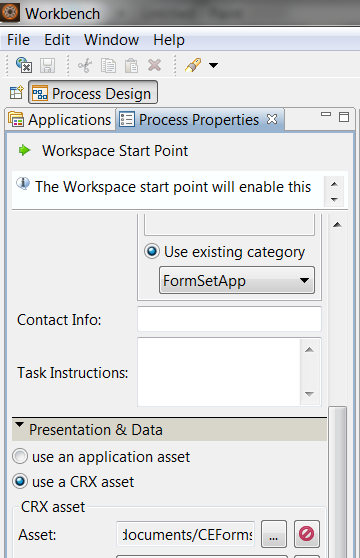

# Utilizzo dei set di moduli nell’area di lavoro di AEM Forms{#working-with-formsets-in-aem-forms-workspace}

Un set di moduli è un insieme di moduli HTML5 raggruppati e presentati come un unico insieme di moduli agli utenti finali. Quando gli utenti finali iniziano a compilare un set di moduli, passano facilmente da un modulo all’altro. Il set di moduli può quindi essere inviato con un solo clic. Per ulteriori informazioni sui set di moduli e su come configurarli, consulta [Set di moduli in AEM Forms](../../forms/using/formset-in-aem-forms.md).

L’area di lavoro di AEM Forms supporta i set di moduli. Con i set di moduli, è possibile raggruppare più moduli relativi a un servizio o a un processo per automatizzare un processo aziendale e presentarli agli utenti finali. In questo caso, gli utenti possono compilare l’intero set in un’unica soluzione e non è necessario archiviare, inviare e tenere traccia di singoli moduli o processi.

## Associazione di un set di moduli al punto d’inizio in un’app dell’area di lavoro AEM Forms {#attaching-a-formset-to-startpoint-in-an-aem-forms-workspace-app-br}

1. Crea il flusso di lavoro del processo aziendale in Workbench. Per ulteriori informazioni, consulta [Aiuto per Workbench](https://www.adobe.com/go/learn_aemforms_workbench_63).
1. Dalle proprietà di processo del punto iniziale, selezionare **Utilizzare Una Risorsa CRX** in Presentation &amp; Data.

   

1. Clic  (Sfoglia) accanto al percorso della risorsa CRX. Viene visualizzata la finestra di dialogo Seleziona risorsa modulo.

   

1. Fai clic su **Set di moduli** , selezionare il set di moduli desiderato dall&#39;elenco e quindi fare clic su **OK**.

1. Distribuire l&#39;applicazione dopo l&#39;aggiornamento di altre proprietà di processo rilevanti.

## Utilizzo del set di moduli nell’area di lavoro di AEM Forms {#using-formset-in-nbsp-aem-forms-workspace}

Una volta collegato un set di moduli a un punto iniziale, quest’ultimo può essere richiamato dall’area di lavoro di AEM Forms, come qualsiasi altro punto iniziale.

Le operazioni supportate sul set di moduli tramite l’area di lavoro di AEM Forms sono:

* Salva come bozza
* Blocca
* Abbandona
* Invia
* Aggiungi allegati
* Aggiungi note
* Spostarsi tra le maschere di un set di maschere utilizzando i pulsanti Indietro o Avanti

>[!NOTE]
>
>Per migliorare le prestazioni durante lo spostamento dai moduli precedenti e successivi in un set di moduli, tutti i pulsanti dell&#39;area di lavoro (Indietro, Avanti, Salva, Invia e Altro) vengono disattivati fino al completo rendering del modulo corrispondente.
