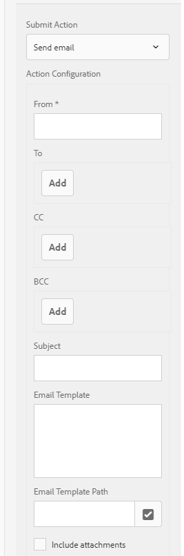

# Invio di una conferma per l’invio di un modulo tramite e-mail {#sending-a-form-submission-acknowledgement-via-email}

## Invio di dati per moduli adattivi {#adaptive-form-data-submission}

I moduli adattivi dispongono di diversi moduli preconfigurati [invia azioni](../../forms/using/configuring-submit-actions.md) flussi di lavoro per l’invio dei dati del modulo a endpoint diversi.

Ad esempio, il **[!UICONTROL Invia e-mail]** azione di invio invia un messaggio e-mail in caso di invio corretto di un modulo adattivo. Può anche essere configurato per inviare i dati del modulo e il PDF nell’e-mail.

Questo articolo descrive i passaggi necessari per abilitare l’azione E-mail su un modulo adattivo e le diverse configurazioni fornite.

>[!NOTE]
>
>È inoltre possibile utilizzare **[!UICONTROL Invia PDF tramite e-mail]** opzione per inviare il modulo compilato tramite e-mail come allegato PDF. Le opzioni di configurazione disponibili per questa azione sono le stesse disponibili per **[!UICONTROL Invia e-mail]** azione. L’azione E-mail PDF è disponibile solo per i moduli adattivi basati su XFA

## Azione Invia e-mail {#email-action}

L’azione Invia e-mail consente all’autore di inviare automaticamente e-mail a uno o più destinatari in caso di invio corretto di un modulo adattivo.

>[!NOTE]
>
>Per utilizzare l’azione Invia e-mail, devi configurare il servizio di posta AEM come descritto in [Configurazione del servizio di posta](/help/sites-administering/notification.md#configuring-the-mail-service).

### Abilitazione dell’azione Invia e-mail su un modulo adattivo {#enabling-email-action-on-an-adaptive-form}

1. Aprire un modulo adattivo in **[!UICONTROL modifica]** modalità.

1. In **[!UICONTROL Contenuto]** , seleziona **[!UICONTROL Contenitore modulo]** e seleziona  per visualizzare le proprietà del modulo adattivo.

1. In **[!UICONTROL Invio]** sezione, seleziona **[!UICONTROL Invia e-mail]** dal **[!UICONTROL Azione di invio]** elenco a discesa.

   

1. Specifica ID e-mail validi nella **[!UICONTROL A]**, **[!UICONTROL CC]**, e **[!UICONTROL CCN]** campi.

   Specifica l’oggetto e il corpo dell’e-mail nel **[!UICONTROL Oggetto]** e **[!UICONTROL Modello e-mail]** rispettivamente.

   È inoltre possibile specificare segnaposto variabili nei campi, nel qual caso i valori dei campi vengono elaborati quando il modulo viene inviato correttamente da un utente finale. Per ulteriori informazioni, consulta [Utilizzo dei nomi dei campi del modulo adattivo per creare in modo dinamico contenuti e-mail](../../forms/using/form-submission-receipt-via-email.md#p-using-adaptive-form-field-names-to-dynamically-create-email-content-p).

   Seleziona **[!UICONTROL Includi allegati]** se il modulo include file allegati e si desidera allegarli all&#39;e-mail.

   >[!NOTE]
   >
   >Se si sceglie **[!UICONTROL Invia PDF tramite e-mail]** selezionare l&#39;opzione Includi allegati.

1. Clic  per salvare le modifiche.

### Utilizzo dei nomi dei campi del modulo adattivo per creare in modo dinamico contenuti e-mail {#using-adaptive-form-field-names-to-dynamically-create-email-content}

I nomi dei campi in un modulo adattivo sono denominati segnaposto e vengono sostituiti con il valore del campo dopo che un utente ha inviato il modulo.

In **[!UICONTROL Invia e-mail]** , è possibile utilizzare segnaposto che vengono elaborati durante l&#39;esecuzione dell&#39;azione. Ciò implica che le intestazioni dell’e-mail (come **[!UICONTROL A]**, **[!UICONTROL CC]**, **[!UICONTROL CCN]**, **[!UICONTROL Oggetto]**) vengono generate quando l&#39;utente invia il modulo.

Per definire un segnaposto, specificare `${<field name>}` in un campo dopo aver selezionato **[!UICONTROL Invia e-mail]** come azione di invio.

Ad esempio, se il modulo contiene **[!UICONTROL Indirizzo e-mail]** campo, denominato `email_addr`, per acquisire l’ID e-mail di un utente, puoi specificare quanto segue nel **[!UICONTROL A]**, **[!UICONTROL CC]**, o **[!UICONTROL CCN]** campi.

`${email_addr}`

Quando un utente invia il modulo, viene inviata un’e-mail all’ID e-mail inserito nel `email_addr` del modulo.

>[!NOTE]
>
>È possibile trovare il nome di un campo nel **[!UICONTROL Modifica]** per il campo.

I segnaposto variabili possono essere utilizzati anche nel **[!UICONTROL Oggetto]** e **[!UICONTROL Modello e-mail]** campi.

Ad esempio:

`Hi ${first_name} ${last_name},`

`Your form has been received by our department. It usually takes ten business days to process the request.`

`Regards`

`Administrator`

>[!NOTE]
>
>I campi nei pannelli ripetibili non possono essere utilizzati come segnaposto per le variabili.
